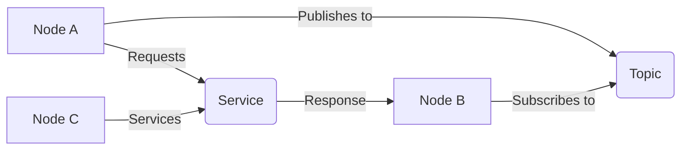

# Module 1: The Robotic Nervous System (ROS 2)

## Learning Objectives
By the end of this module, you will be able to:
- Understand ROS 2 architecture and its role in robotics
- Create and manage ROS 2 nodes, topics, publishers, and subscribers
- Write safe Python code using rclpy for robot simulation
- Build and understand URDF (Unified Robot Description Format) files for humanoid robots
- Design communication patterns between different robot components

## Core Theory

### Introduction to Physical AI & Embodied Intelligence
Physical AI refers to artificial intelligence systems that interact with the physical world through robotic platforms. Embodied intelligence emphasizes that intelligence emerges from the interaction between an agent and its environment. ROS 2 serves as the middleware that enables these interactions by providing a communication framework for distributed robotic applications.

### ROS 2 Architecture Fundamentals
ROS 2 is built on DDS (Data Distribution Service) and provides a middleware that enables communication between different processes and machines. The architecture includes:

- **Nodes**: Individual processes that perform computation
- **Topics**: Unidirectional communication channels for data streaming
- **Services**: Bidirectional communication for request/response patterns
- **Actions**: Extended services for long-running tasks with feedback
- **Parameters**: Configuration values that can be changed at runtime

### Nodes, Topics, Publishers & Subscribers
The pub/sub pattern is fundamental to ROS 2:
- Publishers send messages to topics
- Subscribers receive messages from topics
- The ROS 2 graph manages the connections between nodes

## Practical Examples

### ROS 2 Node Example
```python
import rclpy
from rclpy.node import Node
from std_msgs.msg import String

class MinimalPublisher(Node):
    def __init__(self):
        super().__init__('minimal_publisher')
        self.publisher = self.create_publisher(String, 'topic', 10)
        timer_period = 0.5  # seconds
        self.timer = self.create_timer(timer_period, self.timer_callback)
        self.i = 0

    def timer_callback(self):
        msg = String()
        msg.data = 'Hello World: %d' % self.i
        self.publisher.publish(msg)
        self.get_logger().info('Publishing: "%s"' % msg.data)
        self.i += 1
```

### URDF Example for Humanoid
```xml
<?xml version="1.0"?>
<robot name="simple_humanoid">
  <link name="base_link">
    <visual>
      <geometry>
        <box size="0.2 0.2 0.2"/>
      </geometry>
    </visual>
  </link>

  <joint name="torso_joint" type="fixed">
    <parent link="base_link"/>
    <child link="torso"/>
  </joint>

  <link name="torso">
    <visual>
      <geometry>
        <box size="0.15 0.1 0.3"/>
      </geometry>
    </visual>
  </link>
</robot>
```

## Diagrams

### ROS 2 Communication Architecture


## Exercises

1. Create a simple ROS 2 publisher node that publishes a counter value every second
2. Create a subscriber node that listens to the counter and logs the received values
3. Modify the URDF example to add arms and legs for the humanoid model

## Quiz

1. What is the primary difference between a ROS 2 topic and a service?
2. Name the DDS-based middleware that ROS 2 is built on.
3. What is the purpose of URDF in robotics?

## Summary

This module provided a comprehensive foundation in ROS 2 concepts essential for physical AI and humanoid robotics. We covered the fundamental architecture of ROS 2, including its DDS-based middleware, communication patterns, and node lifecycle management. The module established the groundwork for understanding how to build distributed robotic systems that can effectively coordinate complex behaviors.

Key concepts covered include:
- The distributed architecture of ROS 2 and its advantages over centralized systems
- Communication patterns including topics, services, and actions for different use cases
- Robot description using URDF and its importance for simulation and control
- Best practices for organizing ROS 2 packages and nodes

These foundational concepts form the basis for all subsequent modules in this book, providing the essential knowledge needed to build sophisticated robotic systems. Understanding these principles is critical for developing robots that can operate effectively in real-world environments.

## References
- [Official ROS 2 Documentation](https://docs.ros.org/en/humble/)
- [ROS 2 Tutorials](https://docs.ros.org/en/humble/Tutorials.html)
- [URDF Specification](http://wiki.ros.org/urdf)