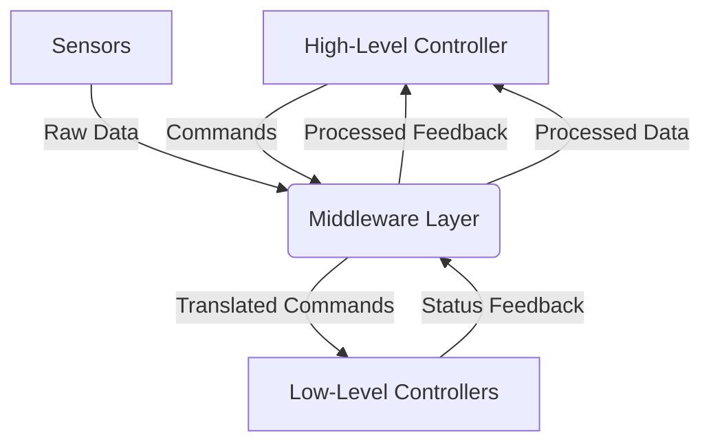

# Chapter 1.1: Middleware for Robot Control

## Learning Objectives
By the end of this chapter, you will be able to:
- Understand the role of middleware in robot control systems
- Explain how ROS 2 serves as middleware for robot control
- Describe the abstraction layers provided by ROS 2 middleware
- Implement basic middleware patterns for robot control

## Core Theory

### Middleware in Robot Control
Middleware serves as a critical layer that abstracts the complexity of robot control by providing standardized interfaces between different components. In robotics, middleware handles:

- **Communication Management**: Handles inter-process communication without requiring direct connections
- **Resource Management**: Manages system resources and process lifecycle
- **Hardware Abstraction**: Hides low-level hardware details from application developers
- **Security Services**: Provides authentication and encryption capabilities

### ROS 2 as Middleware for Robot Control
ROS 2 serves as a sophisticated middleware that abstracts the complexity of robot control:

#### Abstraction Layers
- **Hardware Abstraction Layer**: Hides low-level hardware details
- **Communication Layer**: Manages inter-process communication
- **Resource Management**: Handles process lifecycle and resource allocation
- **Security Layer**: Provides authentication and encryption capabilities

#### Control Architecture Patterns
- **Centralized Control**: Coordinator nodes manage multiple subsystems
- **Distributed Control**: Independent nodes coordinate through messages
- **Hierarchical Control**: Multi-level control architecture with supervisors
- **Behavior-Based Control**: Modular behaviors coordinated through events

#### Real-Time Capabilities
- **Real-time Scheduling**: Support for real-time operating systems
- **Deterministic Communication**: Guaranteed message delivery timing
- **Priority Management**: Task prioritization for critical operations
- **Deadline Enforcement**: Timely execution guarantees

### Middleware Communication Patterns
- **Publish/Subscribe**: Used for streaming data like sensor readings
- **Request/Response**: Used for RPC-style communication
- **Action**: Used for long-running tasks with progress feedback

## Practical Examples

### Basic Middleware Node
```python
import rclpy
from rclpy.node import Node
from std_msgs.msg import String
from std_msgs.msg import Bool

class MiddlewareController(Node):
    def __init__(self):
        super().__init__('middleware_controller')

        # Publisher for control commands
        self.control_pub = self.create_publisher(String, 'control_commands', 10)

        # Subscriber for sensor feedback
        self.feedback_sub = self.create_subscription(
            String, 'sensor_feedback', self.feedback_callback, 10)

        # Service client for system status
        self.status_timer = self.create_timer(1.0, self.status_check)

        self.get_logger().info('Middleware Controller initialized')

    def feedback_callback(self, msg):
        self.get_logger().info(f'Received feedback: {msg.data}')
        # Process feedback and adjust control strategy

    def status_check(self):
        # Check system status through middleware
        status_msg = String()
        status_msg.data = 'System operational'
        self.control_pub.publish(status_msg)

def main(args=None):
    rclpy.init(args=args)
    controller = MiddlewareController()

    try:
        rclpy.spin(controller)
    except KeyboardInterrupt:
        pass
    finally:
        controller.destroy_node()
        rclpy.shutdown()

if __name__ == '__main__':
    main()
```

### Middleware Communication Bridge
```python
import rclpy
from rclpy.node import Node
from sensor_msgs.msg import JointState
from geometry_msgs.msg import Twist
from std_msgs.msg import Float64MultiArray

class MiddlewareBridge(Node):
    def __init__(self):
        super().__init__('middleware_bridge')

        # Subscribe to high-level commands
        self.high_level_sub = self.create_subscription(
            Twist, 'cmd_vel_high_level', self.high_level_callback, 10)

        # Publish to low-level controllers
        self.low_level_pub = self.create_publisher(
            Float64MultiArray, 'joint_commands', 10)

        # Subscribe to joint states
        self.joint_state_sub = self.create_subscription(
            JointState, 'joint_states', self.joint_state_callback, 10)

        self.current_joints = JointState()

    def high_level_callback(self, msg):
        # Convert high-level command to low-level joint commands
        joint_cmd = Float64MultiArray()

        # Example: Convert velocity command to joint angles
        # This is a simplified example - real systems would use kinematics
        joint_values = [
            msg.linear.x * 0.1,  # Joint 1
            msg.angular.z * 0.1, # Joint 2
            0.0,  # Joint 3
            0.0,  # Joint 4
        ]

        joint_cmd.data = joint_values
        self.low_level_pub.publish(joint_cmd)

    def joint_state_callback(self, msg):
        self.current_joints = msg

def main(args=None):
    rclpy.init(args=args)
    bridge = MiddlewareBridge()

    try:
        rclpy.spin(bridge)
    except KeyboardInterrupt:
        pass
    finally:
        bridge.destroy_node()
        rclpy.shutdown()

if __name__ == '__main__':
    main()
```

## Diagrams

### Middleware Architecture


## Exercises

1. Implement a middleware node that bridges between different message types
2. Create a system that uses middleware to coordinate multiple robot subsystems
3. Design a safety layer that operates within the middleware architecture
4. Build a middleware bridge between simulation and real robot control

## Quiz

1. What is the primary role of middleware in robot control systems?
2. How does ROS 2's DDS foundation support real-time communication?
3. What are the main abstraction layers provided by ROS 2 middleware?

## References
- [ROS 2 Middleware Layer](https://design.ros2.org/articles/Infrastructure.html)
- [DDS for Robotics](https://www.omg.org/spec/DDS/)
- [ROS 2 Quality of Service](https://docs.ros.org/en/humble/Concepts/About-Quality-of-Service-Settings.html)

import TranslateButton from '@site/src/components/TranslateButton';

<TranslateButton />