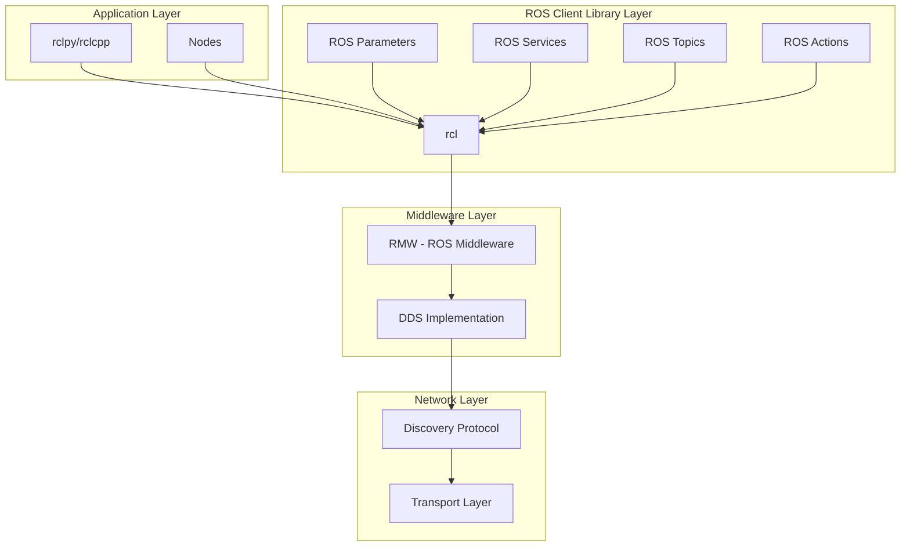
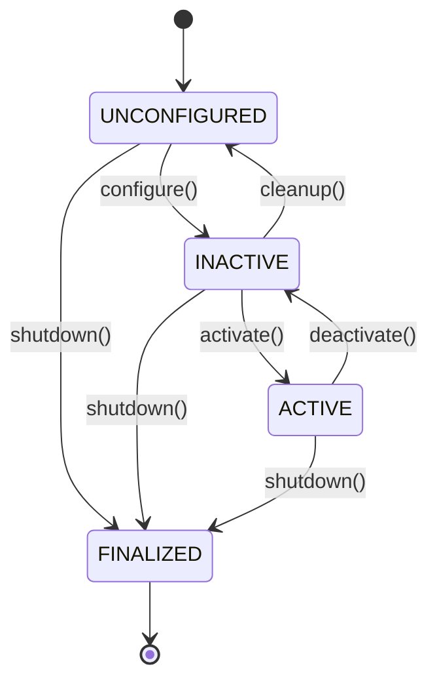

# Chapter 1.1: ROS 2 Fundamentals and Architecture

## Learning Objectives
By the end of this chapter, you will be able to:
- Understand the fundamental architecture of ROS 2 and its distributed nature
- Explain how DDS (Data Distribution Service) enables robust communication
- Describe the node lifecycle and process management in ROS 2
- Implement basic ROS 2 nodes with proper architecture patterns
- Analyze the scalability and reliability features of ROS 2

## Core Theory

### ROS 2 Architecture Overview

ROS 2 represents a fundamental shift from the ROS 1 architecture, moving from a centralized master-based system to a distributed, DDS-based middleware architecture. This change addresses many of the scalability, reliability, and security limitations of ROS 1.

#### Key Architectural Components

**1. DDS Middleware Layer**
- **Data Distribution Service (DDS)**: The underlying middleware that provides publish-subscribe communication
- **RMW (ROS Middleware)**: Abstraction layer that allows ROS 2 to work with different DDS implementations
- **DDS Implementations**: Available options include Fast DDS, Cyclone DDS, RTI Connext DDS

**2. Client Libraries**
- **rclpy**: Python client library for ROS 2
- **rclcpp**: C++ client library for ROS 2
- **rclc**: C client library for embedded systems
- **Other languages**: Support for Rust, Java, C#, etc.

**3. Core Architecture Elements**
- **Nodes**: Individual processes that perform computation
- **Topics**: Publish-subscribe communication channels
- **Services**: Request-response communication patterns
- **Actions**: Long-running tasks with feedback and goal management

### Distributed Systems Principles in ROS 2

#### Decentralized Architecture
ROS 2's decentralized architecture provides several advantages:

**Fault Tolerance**:
- No single point of failure like the ROS 1 master
- Individual nodes can fail without affecting the entire system
- Automatic discovery and reconnection mechanisms

**Scalability**:
- Nodes can be distributed across multiple machines
- No central bottleneck for communication
- Support for cloud robotics applications

**Security**:
- Built-in security features at the DDS level
- Authentication and encryption capabilities
- Fine-grained access control

#### Quality of Service (QoS) Settings

ROS 2 introduces sophisticated QoS settings that allow fine-tuning of communication behavior:

**Reliability Policy**:
- `RELIABLE`: All messages are guaranteed to be delivered
- `BEST_EFFORT`: Messages may be lost, but lower latency
- Use reliable for critical data, best effort for high-frequency sensor data

**Durability Policy**:
- `TRANSIENT_LOCAL`: Late-joining subscribers receive previous messages
- `VOLATILE`: Only new messages are available to subscribers
- Use transient for configuration data, volatile for real-time sensor data

**History Policy**:
- `KEEP_LAST`: Only the most recent messages are kept
- `KEEP_ALL`: All messages are kept (memory considerations)
- Use keep last for most applications, keep all for logging

### ROS 2 Communication Architecture

#### Node Lifecycle Management

ROS 2 nodes follow a well-defined lifecycle that provides better process management:

**States**:
- `UNCONFIGURED`: Initial state after creation
- `INACTIVE`: Configured but not executing callbacks
- `ACTIVE`: Fully operational with callbacks running
- `FINALIZED`: Ready for destruction

**Transitions**:
- `configure()`: Move from unconfigured to inactive
- `activate()`: Move from inactive to active
- `deactivate()`: Move from active to inactive
- `cleanup()`: Move from inactive to unconfigured
- `shutdown()`: Move to finalized state

#### DDS Discovery and Communication

DDS uses a discovery protocol that enables automatic peer-to-peer communication:

**Discovery Process**:
1. Nodes announce their presence on the network
2. Publishers and subscribers discover each other automatically
3. Communication endpoints are established
4. Data flows between matched endpoints

**Communication Patterns**:
- **Publish-Subscribe**: Asynchronous, decoupled communication
- **Request-Response**: Synchronous service calls
- **Action**: Asynchronous goal-oriented communication with feedback

### Advanced Architecture Concepts

#### Domain IDs and Isolation

ROS 2 uses domain IDs to create communication domains:

```python
# Setting domain ID for isolation
import os
os.environ['ROS_DOMAIN_ID'] = '42'  # Different domain
```

**Benefits**:
- Multiple ROS 2 networks on the same machine
- Network isolation for security
- Testing different configurations simultaneously

#### Namespaces and Node Organization

Namespaces provide logical grouping of nodes and topics:

**Global Namespace**: `/robot1/joint_states`
**Relative Namespace**: `joint_states` (resolved relative to node namespace)
**Private Parameters**: `~parameter_name` (node-specific)

### Practical Examples

#### Advanced Node with Lifecycle Management

```python
import rclpy
from rclpy.node import Node
from rclpy.lifecycle import LifecycleNode, LifecycleState, TransitionCallbackReturn
from std_msgs.msg import String
from sensor_msgs.msg import JointState
import time

class AdvancedArchitectureNode(LifecycleNode):
    def __init__(self):
        super().__init__('advanced_architecture_node')

        # Lifecycle-specific components
        self.pub = None
        self.sub = None
        self.timer = None

        # Parameters that can be configured
        self.declare_parameter('publish_rate', 1.0)
        self.declare_parameter('topic_name', 'lifecycle_topic')

    def on_configure(self, state: LifecycleState) -> TransitionCallbackReturn:
        """Configure the node - called when transitioning to INACTIVE state"""
        self.get_logger().info(f'Configuring node in state: {state.label}')

        # Get parameters
        topic_name = self.get_parameter('topic_name').value
        publish_rate = self.get_parameter('publish_rate').value

        # Create publisher and subscriber
        self.pub = self.create_publisher(String, topic_name, 10)
        self.sub = self.create_subscription(
            String, topic_name + '_echo', self.sub_callback, 10)

        # Create timer
        self.timer = self.create_timer(1.0/publish_rate, self.timer_callback)

        # Stop timer initially
        self.timer.cancel()

        return TransitionCallbackReturn.SUCCESS

    def on_activate(self, state: LifecycleState) -> TransitionCallbackReturn:
        """Activate the node - called when transitioning to ACTIVE state"""
        self.get_logger().info(f'Activating node in state: {state.label}')

        # Activate publisher and timer
        self.pub.on_activate()
        self.timer.reset()

        return TransitionCallbackReturn.SUCCESS

    def on_deactivate(self, state: LifecycleState) -> TransitionCallbackReturn:
        """Deactivate the node - called when transitioning to INACTIVE state"""
        self.get_logger().info(f'Deactivating node in state: {state.label}')

        # Deactivate publisher and stop timer
        self.pub.on_deactivate()
        self.timer.cancel()

        return TransitionCallbackReturn.SUCCESS

    def on_cleanup(self, state: LifecycleState) -> TransitionCallbackReturn:
        """Clean up the node - called when transitioning to UNCONFIGURED state"""
        self.get_logger().info(f'Cleaning up node in state: {state.label}')

        # Destroy timer and publisher/subscriber
        self.destroy_timer(self.timer)
        self.destroy_publisher(self.pub)
        self.destroy_subscription(self.sub)

        self.timer = None
        self.pub = None
        self.sub = None

        return TransitionCallbackReturn.SUCCESS

    def timer_callback(self):
        """Timer callback - only active when in ACTIVE state"""
        msg = String()
        msg.data = f'Lifecycle message at {time.time()}'
        self.pub.publish(msg)

    def sub_callback(self, msg):
        """Subscription callback"""
        self.get_logger().info(f'Received echo: {msg.data}')

def main(args=None):
    rclpy.init(args=args)

    node = AdvancedArchitectureNode()

    # Demonstrate lifecycle transitions
    node.trigger_configure()
    node.trigger_activate()

    try:
        rclpy.spin(node)
    except KeyboardInterrupt:
        pass
    finally:
        node.trigger_deactivate()
        node.trigger_cleanup()
        node.destroy_node()
        rclpy.shutdown()

if __name__ == '__main__':
    main()
```

#### DDS Configuration and QoS Advanced Example

```python
import rclpy
from rclpy.node import Node
from std_msgs.msg import String
from rclpy.qos import QoSProfile, ReliabilityPolicy, DurabilityPolicy, HistoryPolicy, LivelinessPolicy

class QoSConfigurationNode(Node):
    def __init__(self):
        super().__init__('qos_configuration_node')

        # Different QoS profiles for different use cases
        self.critical_qos = QoSProfile(
            depth=10,
            reliability=ReliabilityPolicy.RELIABLE,
            durability=DurabilityPolicy.TRANSIENT_LOCAL,
            history=HistoryPolicy.KEEP_LAST,
            lifespan=rclpy.duration.Duration(seconds=30)
        )

        self.stream_qos = QoSProfile(
            depth=50,
            reliability=ReliabilityPolicy.BEST_EFFORT,
            durability=DurabilityPolicy.VOLATILE,
            history=HistoryPolicy.KEEP_ALL
        )

        self.sensor_qos = QoSProfile(
            depth=5,
            reliability=ReliabilityPolicy.BEST_EFFORT,
            durability=DurabilityPolicy.VOLATILE,
            history=HistoryPolicy.KEEP_LAST,
            deadline=rclpy.duration.Duration(seconds=0.1)
        )

        # Publishers with different QoS
        self.critical_pub = self.create_publisher(String, 'critical_commands', self.critical_qos)
        self.stream_pub = self.create_publisher(String, 'data_stream', self.stream_qos)
        self.sensor_pub = self.create_publisher(String, 'sensor_data', self.sensor_qos)

        # Timer for publishing
        self.timer = self.create_timer(0.1, self.publish_data)
        self.counter = 0

    def publish_data(self):
        # Publish with different QoS profiles
        critical_msg = String()
        critical_msg.data = f'Critical command #{self.counter}'
        self.critical_pub.publish(critical_msg)

        stream_msg = String()
        stream_msg.data = f'Stream data #{self.counter}'
        self.stream_pub.publish(stream_msg)

        sensor_msg = String()
        sensor_msg.data = f'Sensor reading #{self.counter}'
        self.sensor_pub.publish(sensor_msg)

        self.counter += 1
        self.get_logger().info(f'Published data with different QoS profiles')

def main(args=None):
    rclpy.init(args=args)
    node = QoSConfigurationNode()

    try:
        rclpy.spin(node)
    except KeyboardInterrupt:
        pass
    finally:
        node.destroy_node()
        rclpy.shutdown()

if __name__ == '__main__':
    main()
```

## Diagrams

### ROS 2 Architecture Overview


### Node Lifecycle States


## Exercises

1. Create a ROS 2 node that demonstrates different QoS profiles and observe their behavior
2. Implement a lifecycle node that manages multiple publishers and subscribers
3. Design a distributed system with multiple nodes communicating across different machines
4. Build a system that uses namespaces to organize related functionality

## Quiz

1. What is the main difference between ROS 1 and ROS 2 architecture?
2. Explain the four main QoS policies in ROS 2 and their use cases
3. What are the states in the ROS 2 node lifecycle?
4. How does DDS discovery work in ROS 2?
5. What are the benefits of the decentralized architecture in ROS 2?

## Summary

This chapter provided a comprehensive overview of ROS 2 fundamentals and architecture, covering the essential concepts that form the foundation of modern robotic systems. We explored the key differences between ROS 1 and ROS 2, focusing on the distributed, DDS-based middleware architecture that addresses scalability, reliability, and security limitations of the previous version.

Key concepts covered include:
- The DDS middleware layer and its role in enabling robust communication
- Quality of Service (QoS) settings for fine-tuning communication behavior
- Node lifecycle management with well-defined states and transitions
- Domain IDs for network isolation and security
- Namespaces for logical organization of nodes and topics

The practical examples demonstrated advanced node implementations with lifecycle management and QoS configuration, providing hands-on experience with real-world ROS 2 patterns. The architecture diagrams illustrated the layered structure of ROS 2, from application nodes down to the network layer.

These foundational concepts are critical for building robust, scalable robotic applications that can operate effectively in complex, distributed environments. Understanding these principles enables the development of systems that can handle the challenges of real-world robotic applications, from single robots to multi-robot systems and cloud robotics.

import TranslateButton from '@site/src/components/TranslateButton';

<TranslateButton />

## References
- [ROS 2 Architecture](https://design.ros2.org/articles/ROS2_Architecture.html)
- [DDS Specification](https://www.omg.org/spec/DDS/)
- [ROS 2 Quality of Service](https://docs.ros.org/en/humble/Concepts/About-Quality-of-Service-Settings.html)
- [ROS 2 Lifecycle Nodes](https://docs.ros.org/en/humble/Tutorials/Advanced/Lifecycle-Nodes.html)