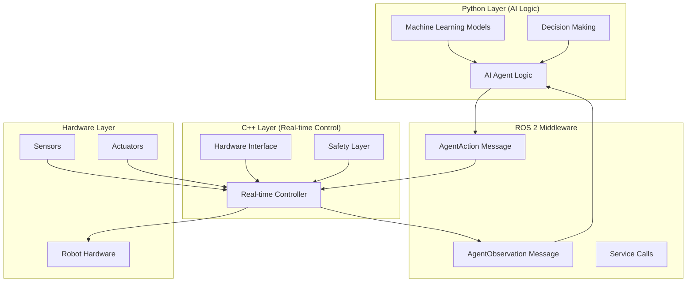
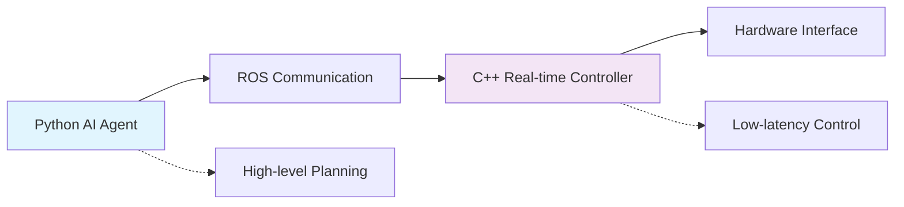

# Chapter 1.2: Python and C++ Integration for AI Agents

## Learning Objectives
By the end of this chapter, you will be able to:
- Understand the strengths and use cases of Python vs C++ for AI agents
- Implement inter-language communication in ROS 2
- Create hybrid AI systems using both Python and C++
- Optimize performance through strategic language selection
- Build robust AI agents that integrate with ROS 2 control systems

## Core Theory

### Language Selection for AI Agents

#### Python Advantages for AI Development
Python is the dominant language for AI development due to several key advantages:

**Rich Ecosystem**:
- **Machine Learning Libraries**: TensorFlow, PyTorch, scikit-learn, Keras
- **Scientific Computing**: NumPy, SciPy, Pandas
- **Visualization**: Matplotlib, Seaborn, Plotly
- **Robotics Libraries**: ROS 2 Python client (rclpy), OpenCV, PCL

**Rapid Prototyping**:
- Dynamic typing enables fast iteration
- High-level abstractions reduce development time
- Extensive documentation and community support
- Jupyter notebooks for interactive development

**AI Agent Frameworks**:
- **Reinforcement Learning**: Stable Baselines3, Ray RLlib, Gymnasium
- **Planning**: PDDL parsers, automated planning libraries
- **Computer Vision**: YOLO, Detectron2, Segment Anything
- **Natural Language Processing**: Transformers, spaCy, NLTK

#### C++ Advantages for Real-time Control
C++ excels in performance-critical applications:

**Performance**:
- Compiled language with near-native performance
- Memory management control
- Low-latency execution
- Deterministic behavior

**Real-time Systems**:
- Real-time scheduling support
- Predictable execution times
- Hardware abstraction capabilities
- Safety-critical system development

**Robotics Control**:
- Low-level hardware interfaces
- Real-time control loops
- Safety-critical operations
- Embedded systems development

### Hybrid Architecture Patterns

#### Bridge Pattern
The bridge pattern creates a communication layer between Python AI agents and C++ controllers:

**Architecture Components**:
- **Python Agent Node**: Contains AI logic and decision-making
- **C++ Control Node**: Handles real-time control and safety
- **Bridge Interface**: ROS 2 messages for communication

**Communication Flow**:
```
Python Agent → ROS Messages → C++ Controller → Hardware
Hardware → ROS Messages → Python Agent
```

#### Service-Based Integration
Using ROS services for synchronous communication between languages:

**Request-Response Pattern**:
- Python agent sends action request to C++ service
- C++ controller processes request and executes action
- C++ controller returns result to Python agent

**Benefits**:
- Synchronous communication ensures coordination
- Type safety through service definitions
- Built-in timeout and error handling

#### Publisher-Subscriber Integration
Asynchronous communication using ROS topics:

**Decoupled Architecture**:
- Python agent publishes actions to topics
- C++ controller subscribes to action topics
- C++ controller publishes sensor data to topics
- Python agent subscribes to sensor data topics

### AI Agent Integration Strategies

#### Direct Integration Approach
Running AI agent logic directly within ROS 2 nodes:

**Python rclpy Nodes**:
- AI agent logic runs in Python node
- Direct access to ROS 2 communication primitives
- Leverages Python's rich AI ecosystem
- Suitable for non-real-time applications

**C++ rclcpp Nodes**:
- AI models deployed in C++ using libtorch or TensorFlow C++ API
- Real-time performance for time-critical applications
- Integration with existing C++ robotics frameworks
- More complex deployment and maintenance

#### External AI Service Approach
Keeping AI agents as external services:

**Architecture**:
- AI agent runs as separate process/service
- Communication through ROS services/topics
- Language-agnostic AI development
- Easier debugging and testing

**Implementation Options**:
- REST APIs for AI services
- gRPC for high-performance communication
- Shared memory for high-frequency data
- Message queues for asynchronous processing

### Performance Optimization Strategies

#### Computation Distribution
Strategically distributing computations between languages:

**Python Responsibilities**:
- High-level decision making
- Complex AI algorithms
- Data preprocessing and postprocessing
- Visualization and debugging

**C++ Responsibilities**:
- Real-time control loops
- Safety-critical operations
- Low-level hardware interfaces
- Performance-critical computations

#### Message Optimization
Efficient communication between Python and C++ components:

**Message Design**:
- Minimize message size and frequency
- Use appropriate data types
- Batch related information
- Consider compression for large data

**Serialization Optimization**:
- Use efficient serialization formats
- Minimize data copying
- Consider shared memory for large datasets
- Optimize for network transmission

### Practical Examples

#### Python AI Agent with C++ Controller Bridge

First, let's define a custom message for AI agent communication:

```python
# ai_agent_msgs/msg/AgentAction.msg
"""
# Action from AI agent to controller
uint8 ACTION_MOVE = 0
uint8 ACTION_GRASP = 1
uint8 ACTION_RELEASE = 2

uint8 action_type
float64[] target_position
float64[] target_orientation
string action_parameters
"""

# ai_agent_msgs/msg/AgentObservation.msg
"""
# Observation from controller to AI agent
float64[] joint_positions
float64[] joint_velocities
float64[] sensor_data
float64 reward
bool is_terminal
string observation_metadata
"""
```

Python AI Agent Node:

```python
import rclpy
from rclpy.node import Node
from ai_agent_msgs.msg import AgentAction, AgentObservation
from std_msgs.msg import String
import numpy as np
import time

class PythonAIAgentNode(Node):
    def __init__(self):
        super().__init__('python_ai_agent_node')

        # Publishers and subscribers
        self.action_publisher = self.create_publisher(
            AgentAction, 'agent_actions', 10)
        self.observation_subscriber = self.create_subscription(
            AgentObservation, 'agent_observations',
            self.observation_callback, 10)

        # Internal state
        self.current_observation = None
        self.agent_policy = SimpleNavigationPolicy()

        # Agent control timer
        self.agent_timer = self.create_timer(0.2, self.agent_step)

        self.get_logger().info('Python AI Agent Node initialized')

    def observation_callback(self, msg):
        """Process observation from C++ controller"""
        self.current_observation = {
            'joint_positions': list(msg.joint_positions),
            'joint_velocities': list(msg.joint_velocities),
            'sensor_data': list(msg.sensor_data),
            'reward': msg.reward,
            'is_terminal': msg.is_terminal
        }
        self.get_logger().info(f'Received observation with {len(msg.joint_positions)} joints')

    def agent_step(self):
        """Main agent decision-making loop"""
        if self.current_observation is not None:
            # Get action from AI policy
            action = self.agent_policy.get_action(self.current_observation)

            # Convert to ROS message
            action_msg = AgentAction()
            action_msg.action_type = action['action_type']
            action_msg.target_position = action['target_position']
            action_msg.target_orientation = action['target_orientation']
            action_msg.action_parameters = action['action_parameters']

            # Publish action
            self.action_publisher.publish(action_msg)
            self.get_logger().info(f'Published action: {action["action_type"]}')

class SimpleNavigationPolicy:
    """Simple navigation policy for demonstration"""
    def __init__(self):
        self.goal_position = np.array([1.0, 0.0, 0.5])  # Target position
        self.current_step = 0

    def get_action(self, observation):
        """Simple navigation policy"""
        # Extract current position from observation
        if len(observation['joint_positions']) >= 3:
            current_pos = np.array(observation['joint_positions'][:3])
        else:
            current_pos = np.array([0.0, 0.0, 0.0])

        # Calculate target position
        target_pos = self.goal_position + np.random.normal(0, 0.1, 3)

        # Create action
        action = {
            'action_type': 0,  # ACTION_MOVE
            'target_position': target_pos.tolist(),
            'target_orientation': [0.0, 0.0, 0.0, 1.0],  # Quaternion
            'action_parameters': f'step_{self.current_step}'
        }

        self.current_step += 1
        return action

def main(args=None):
    rclpy.init(args=args)
    agent_node = PythonAIAgentNode()

    try:
        rclpy.spin(agent_node)
    except KeyboardInterrupt:
        pass
    finally:
        agent_node.destroy_node()
        rclpy.shutdown()

if __name__ == '__main__':
    main()
```

C++ Controller Node:

```cpp
#include <rclcpp/rclcpp.hpp>
#include <ai_agent_msgs/msg/agent_action.hpp>
#include <ai_agent_msgs/msg/agent_observation.hpp>
#include <sensor_msgs/msg/joint_state.hpp>
#include <geometry_msgs/msg/pose.hpp>
#include <vector>
#include <memory>

class CPPControllerNode : public rclcpp::Node
{
public:
    CPPControllerNode() : Node("cpp_controller_node")
    {
        // Publishers and subscribers
        action_subscriber_ = this->create_subscription<ai_agent_msgs::msg::AgentAction>(
            "agent_actions", 10,
            std::bind(&CPPControllerNode::action_callback, this, std::placeholders::_1));

        observation_publisher_ = this->create_publisher<ai_agent_msgs::msg::AgentObservation>(
            "agent_observations", 10);

        joint_state_subscriber_ = this->create_subscription<sensor_msgs::msg::JointState>(
            "joint_states", 10,
            std::bind(&CPPControllerNode::joint_state_callback, this, std::placeholders::_1));

        // Control timer for real-time updates
        control_timer_ = this->create_wall_timer(
            std::chrono::milliseconds(10),
            std::bind(&CPPControllerNode::control_loop, this));

        RCLCPP_INFO(this->get_logger(), "C++ Controller Node initialized");
    }

private:
    void action_callback(const ai_agent_msgs::msg::AgentAction::SharedPtr msg)
    {
        RCLCPP_INFO(this->get_logger(),
            "Received action type: %d", msg->action_type);

        // Process the action based on type
        switch(msg->action_type) {
            case 0: // ACTION_MOVE
                execute_move_action(msg);
                break;
            case 1: // ACTION_GRASP
                execute_grasp_action(msg);
                break;
            case 2: // ACTION_RELEASE
                execute_release_action(msg);
                break;
            default:
                RCLCPP_WARN(this->get_logger(), "Unknown action type: %d", msg->action_type);
        }
    }

    void joint_state_callback(const sensor_msgs::msg::JointState::SharedPtr msg)
    {
        // Store current joint states
        current_joint_positions_ = msg->position;
        current_joint_velocities_ = msg->velocity;
    }

    void control_loop()
    {
        // Publish current observation to AI agent
        auto obs_msg = ai_agent_msgs::msg::AgentObservation();

        // Fill observation data
        obs_msg.joint_positions = current_joint_positions_;
        obs_msg.joint_velocities = current_joint_velocities_;

        // Simulate sensor data
        std::vector<double> sensor_data = {1.0, 2.0, 3.0}; // Example sensor readings
        obs_msg.sensor_data = sensor_data;

        obs_msg.reward = 0.0;  // Calculate reward based on current state
        obs_msg.is_terminal = false;  // Check termination conditions

        observation_publisher_->publish(obs_msg);
    }

    void execute_move_action(const ai_agent_msgs::msg::AgentAction::SharedPtr msg)
    {
        RCLCPP_INFO(this->get_logger(),
            "Executing move to position: [%.2f, %.2f, %.2f]",
            msg->target_position[0], msg->target_position[1], msg->target_position[2]);

        // Implement actual movement logic here
        // This would interface with real hardware or simulation
    }

    void execute_grasp_action(const ai_agent_msgs::msg::AgentAction::SharedPtr msg)
    {
        RCLCPP_INFO(this->get_logger(), "Executing grasp action");
        // Implement grasp logic
    }

    void execute_release_action(const ai_agent_msgs::msg::AgentAction::SharedPtr msg)
    {
        RCLCPP_INFO(this->get_logger(), "Executing release action");
        // Implement release logic
    }

    rclcpp::Subscription<ai_agent_msgs::msg::AgentAction>::SharedPtr action_subscriber_;
    rclcpp::Publisher<ai_agent_msgs::msg::AgentObservation>::SharedPtr observation_publisher_;
    rclcpp::Subscription<sensor_msgs::msg::JointState>::SharedPtr joint_state_subscriber_;
    rclcpp::TimerBase::SharedPtr control_timer_;

    std::vector<double> current_joint_positions_;
    std::vector<double> current_joint_velocities_;
};

int main(int argc, char * argv[])
{
    rclcpp::init(argc, argv);
    rclcpp::spin(std::make_shared<CPPControllerNode>());
    rclcpp::shutdown();
    return 0;
}
```

#### Performance-Optimized AI Agent with C++ Backend

Python node with C++ service calls:

```python
import rclpy
from rclpy.node import Node
from ai_agent_msgs.srv import AgentStep
from ai_agent_msgs.msg import AgentState
import numpy as np
import time

class OptimizedAIAgentNode(Node):
    def __init__(self):
        super().__init__('optimized_ai_agent_node')

        # Service client for C++ AI backend
        self.ai_service_client = self.create_client(
            AgentStep, 'ai_backend_step')

        # Wait for service to be available
        while not self.ai_service_client.wait_for_service(timeout_sec=1.0):
            self.get_logger().info('AI backend service not available, waiting...')

        # Publishers for visualization
        self.state_publisher = self.create_publisher(
            AgentState, 'agent_state', 10)

        # Agent timer
        self.agent_timer = self.create_timer(0.05, self.agent_step)

        self.step_count = 0
        self.get_logger().info('Optimized AI Agent Node initialized')

    def agent_step(self):
        """Agent step using C++ backend service"""
        # Prepare request
        request = AgentStep.Request()
        request.observation.joint_positions = [0.1, 0.2, 0.3]  # Example state
        request.observation.joint_velocities = [0.0, 0.0, 0.0]
        request.observation.sensor_data = [1.0, 2.0, 3.0]
        request.observation.reward = 0.0
        request.observation.is_terminal = False

        # Make service call to C++ backend
        future = self.ai_service_client.call_async(request)

        # Process response when available
        future.add_done_callback(self.service_response_callback)

    def service_response_callback(self, future):
        """Handle response from C++ AI backend"""
        try:
            response = future.result()
            action = response.action

            self.get_logger().info(f'Received action from C++ backend: {action.action_type}')

            # Publish agent state for visualization
            state_msg = AgentState()
            state_msg.step = self.step_count
            state_msg.action_type = action.action_type
            state_msg.timestamp = self.get_clock().now().to_msg()

            self.state_publisher.publish(state_msg)
            self.step_count += 1

        except Exception as e:
            self.get_logger().error(f'Service call failed: {e}')

def main(args=None):
    rclpy.init(args=args)
    agent_node = OptimizedAIAgentNode()

    try:
        rclpy.spin(agent_node)
    except KeyboardInterrupt:
        pass
    finally:
        agent_node.destroy_node()
        rclpy.shutdown()

if __name__ == '__main__':
    main()
```

## Diagrams

### Hybrid AI Agent Architecture


### Performance Optimization Pattern


## Exercises

1. Create a hybrid system where Python handles high-level planning and C++ handles low-level control
2. Implement a custom message type for AI agent communication between languages
3. Design a performance test comparing pure Python vs Python-C++ hybrid approaches
4. Build a safety layer in C++ that validates actions from Python AI agents

## Quiz

1. What are the main advantages of Python for AI agent development?
2. When should you use C++ instead of Python for robotics applications?
3. Explain the bridge pattern for Python-C++ integration.
4. What are the benefits of using ROS services vs topics for AI agent communication?
5. How can you optimize performance in hybrid Python-C++ AI systems?

## Summary

This chapter explored the integration of Python and C++ in ROS 2 for AI agent development, demonstrating how to leverage the strengths of both languages to create efficient, high-performance robotic systems. We examined the advantages of Python for AI development, including its rich ecosystem of machine learning libraries and rapid prototyping capabilities, alongside C++'s performance characteristics for real-time control and safety-critical operations.

Key concepts covered include:
- Hybrid architecture patterns such as the bridge pattern and service-based integration
- Strategies for distributing computations between languages based on performance requirements
- Message optimization techniques for efficient communication between Python and C++ components
- Practical examples of AI agents using both languages in coordination

The practical implementations showed how to create custom messages for AI agent communication, implement Python AI agents with C++ controllers, and optimize performance through strategic language selection. The architecture diagrams illustrated the layered approach to hybrid AI systems, showing how different components interact across language boundaries.

These integration strategies are essential for building AI-powered robotic systems that require both sophisticated decision-making capabilities and real-time performance. Understanding these patterns enables the development of robust systems that can handle the diverse requirements of modern robotics applications.

## References
- [ROS 2 Python vs C++](https://docs.ros.org/en/humble/The-ROS2-Project/Contributing/Code-Style-Language-Versions.html)
- [Python AI Libraries](https://docs.ros.org/en/humble/Tutorials/Beginner-Client-Libraries/Using-Python-Packages.html)
- [C++ ROS Client](https://docs.ros.org/en/humble/Tutorials/Beginner-Client-Libraries/Single-Package-Define-And-Use-Interface-CPP.html)
- [Performance Optimization in ROS 2](https://docs.ros.org/en/humble/Tutorials/Advanced/Node-Performance.html)