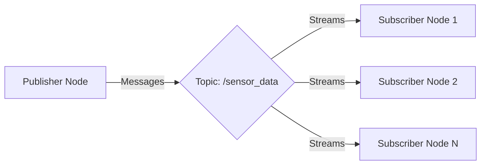
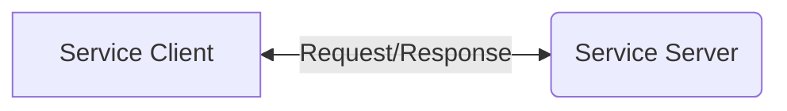

# Chapter 1.2: ROS 2 Nodes, Topics, and Services

## Summary
This chapter provides an in-depth exploration of the fundamental ROS 2 communication primitives: nodes, topics, and services. These components form the backbone of the ROS 2 communication architecture and are essential for building distributed robotic applications.

## Learning Objectives
By the end of this chapter, you will be able to:
- Create and manage ROS 2 nodes with proper lifecycle
- Implement publishers and subscribers for topic-based communication
- Design and implement services for request/response communication
- Understand the differences between topics and services
- Apply Quality of Service (QoS) settings appropriately

## Core Theory

### Nodes
Nodes are the fundamental building blocks of ROS 2 applications:
- Individual processes that perform computation
- Each node runs a specific task or function
- Nodes can be written in different languages (C++, Python, etc.)
- Nodes communicate with each other through topics, services, and actions

#### Node Lifecycle
ROS 2 nodes follow a specific lifecycle that includes:
- **Unconfigured**: Initial state after creation
- **Inactive**: Configured but not executing callbacks
- **Active**: Fully operational, executing callbacks
- **Finalized**: Ready for destruction

### Topics
Topics enable asynchronous, decoupled communication:
- Unidirectional communication channels for data streaming
- Publishers send messages to topics
- Subscribers receive messages from topics
- Many-to-many communication pattern
- Ideal for sensor data streaming and status updates

#### Quality of Service (QoS) Settings
QoS settings define how messages are delivered:
- **Reliability**: Reliable vs. Best Effort delivery
- **Durability**: Volatile vs. Transient Local
- **History**: Keep Last vs. Keep All
- **Depth**: Size of message queue

### Services
Services enable synchronous, request/response communication:
- Bidirectional communication for request/response patterns
- Client makes a request and waits for a response
- Synchronous communication model
- One-to-one communication pattern
- Ideal for operations requiring confirmation or computation

### Communication Patterns
- **Publish/Subscribe**: Used for streaming data like sensor readings
- **Request/Response**: Used for RPC-style communication
- **Action**: Used for long-running tasks with progress feedback

## Practical Examples

### ROS 2 Node with Multiple Communication Patterns
```python
import rclpy
from rclpy.node import Node
from std_msgs.msg import String
from std_srvs.srv import SetBool
from rclpy.qos import QoSProfile, ReliabilityPolicy, DurabilityPolicy

class CommunicationNode(Node):
    def __init__(self):
        super().__init__('communication_node')

        # Publisher for status updates
        qos_profile = QoSProfile(
            depth=10,
            reliability=ReliabilityPolicy.BEST_EFFORT,
            durability=DurabilityPolicy.VOLATILE
        )
        self.status_publisher = self.create_publisher(
            String, 'robot_status', qos_profile)

        # Subscriber for commands
        self.command_subscriber = self.create_subscription(
            String, 'robot_commands', self.command_callback, 10)

        # Service server for configuration
        self.config_service = self.create_service(
            SetBool, 'robot_config', self.config_callback)

        # Timer for status updates
        self.status_timer = self.create_timer(1.0, self.publish_status)
        self.status_counter = 0

        self.get_logger().info('Communication Node initialized')

    def command_callback(self, msg):
        self.get_logger().info(f'Received command: {msg.data}')
        # Process command and update internal state

    def config_callback(self, request, response):
        self.get_logger().info(f'Configuration request: {request.data}')
        response.success = True
        response.message = f'Configuration set to {request.data}'
        return response

    def publish_status(self):
        status_msg = String()
        status_msg.data = f'Operational - {self.status_counter}'
        self.status_publisher.publish(status_msg)
        self.status_counter += 1

def main(args=None):
    rclpy.init(args=args)
    node = CommunicationNode()

    try:
        rclpy.spin(node)
    except KeyboardInterrupt:
        pass
    finally:
        node.destroy_node()
        rclpy.shutdown()

if __name__ == '__main__':
    main()
```

### Advanced Publisher and Subscriber Example
```python
import rclpy
from rclpy.node import Node
from std_msgs.msg import String
from std_msgs.msg import Int32
from rclpy.qos import QoSProfile, ReliabilityPolicy, DurabilityPolicy, HistoryPolicy

class AdvancedCommunicationNode(Node):
    def __init__(self):
        super().__init__('advanced_communication_node')

        # High-reliability publisher for critical data
        critical_qos = QoSProfile(
            depth=5,
            reliability=ReliabilityPolicy.RELIABLE,
            durability=DurabilityPolicy.VOLATILE,
            history=HistoryPolicy.KEEP_LAST
        )
        self.critical_publisher = self.create_publisher(
            String, 'critical_data', critical_qos)

        # Best-effort publisher for high-frequency data
        stream_qos = QoSProfile(
            depth=20,
            reliability=ReliabilityPolicy.BEST_EFFORT,
            durability=DurabilityPolicy.VOLATILE,
            history=HistoryPolicy.KEEP_ALL
        )
        self.stream_publisher = self.create_publisher(
            Int32, 'sensor_stream', stream_qos)

        # Multiple subscribers with different QoS
        self.critical_sub = self.create_subscription(
            String, 'critical_data', self.critical_callback, critical_qos)

        self.stream_sub = self.create_subscription(
            Int32, 'sensor_stream', self.stream_callback, stream_qos)

        # Timer for publishing data
        self.critical_timer = self.create_timer(0.5, self.publish_critical)
        self.stream_timer = self.create_timer(0.01, self.publish_stream)

        self.counter = 0

    def publish_critical(self):
        msg = String()
        msg.data = f'Critical message #{self.counter}'
        self.critical_publisher.publish(msg)
        self.get_logger().info(f'Published: {msg.data}')
        self.counter += 1

    def publish_stream(self):
        msg = Int32()
        msg.data = self.counter * 10
        self.stream_publisher.publish(msg)

    def critical_callback(self, msg):
        self.get_logger().info(f'Critical: {msg.data}')

    def stream_callback(self, msg):
        # Process high-frequency stream data
        pass

def main(args=None):
    rclpy.init(args=args)
    node = AdvancedCommunicationNode()

    try:
        rclpy.spin(node)
    except KeyboardInterrupt:
        pass
    finally:
        node.destroy_node()
        rclpy.shutdown()

if __name__ == '__main__':
    main()
```

## Diagrams

### Node-Topic-Node Communication


### Service Communication


## Exercises

1. Create a node that publishes sensor data and subscribe to it from another node
2. Implement a service server that performs calculations and a client that uses it
3. Experiment with different QoS profiles and observe their effects on communication
4. Build a system with multiple publishers and subscribers on the same topic

## Quiz

1. What is the main difference between topics and services in ROS 2?
2. What are the four main QoS settings in ROS 2?
3. Explain the node lifecycle in ROS 2.
4. When would you use a service instead of a topic?

## References
- [ROS 2 Nodes Documentation](https://docs.ros.org/en/humble/Concepts/About-ROS-2-Nodes.html)
- [ROS 2 Topics Documentation](https://docs.ros.org/en/humble/Concepts/About-ROS-2-Topics.html)
- [ROS 2 Services Documentation](https://docs.ros.org/en/humble/Concepts/About-ROS-2-Services.html)
- [Quality of Service in ROS 2](https://docs.ros.org/en/humble/Concepts/About-Quality-of-Service-Settings.html)