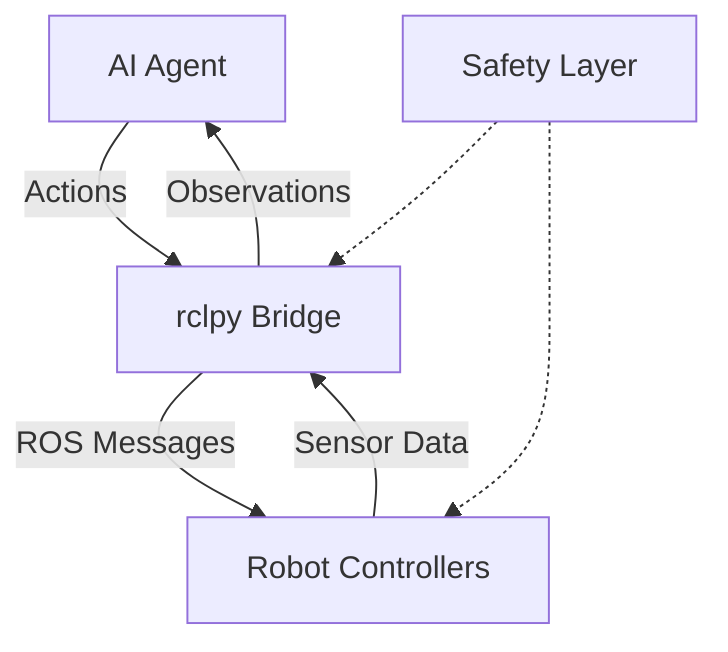
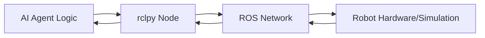

# Chapter 1.3: Bridging Python Agents to ROS Controllers using rclpy

## Summary
This chapter explores the integration of Python-based AI agents with ROS 2 controllers using the rclpy client library. It covers patterns, best practices, and safety considerations for connecting intelligent decision-making systems to robotic control infrastructure.

## Learning Objectives
By the end of this chapter, you will be able to:
- Integrate Python AI agents with ROS 2 control systems using rclpy
- Implement safe communication patterns between agents and controllers
- Design agent-ROS interfaces with proper validation and safety layers
- Apply simulation-safe patterns for agent-controlled robots

## Core Theory

### Agent-Controller Integration Patterns
Modern robotic systems often require integration between high-level AI agents and low-level ROS controllers. This bridge enables:

#### Direct Integration Pattern
- AI agent runs as a ROS 2 node using rclpy
- Direct access to ROS 2 communication primitives
- Minimal latency between decision-making and control
- Shared process space for efficient data exchange

#### Bridge Node Pattern
- Dedicated node translates between agent and ROS ecosystem
- Separation of concerns between AI logic and ROS communication
- Easier debugging and maintenance
- Support for external agent systems

#### Service-Based Pattern
- Agent communicates via ROS services for synchronous operations
- Request-response model for command confirmation
- Better for safety-critical operations
- Clear separation between planning and execution

### Safety-First Integration
When bridging AI agents to ROS controllers, safety is paramount:

#### Validation Layer
- All agent commands validated before ROS execution
- Range checking for joint positions, velocities, and efforts
- Collision detection and avoidance verification
- Kinematic constraint validation

#### Simulation-Safe Patterns
- Ensuring no real hardware commands during development
- Simulation-only execution modes
- Command interception and logging
- Gradual transition from simulation to real hardware

#### Emergency Protocols
- Agent-triggered safety stops and recovery procedures
- Timeout mechanisms for unresponsive agents
- Fallback behaviors when agent fails
- Human override capabilities

### Agent-Controller Interface Design
#### Command Translation
- Converting high-level agent actions to ROS 2 messages
- Mapping discrete agent actions to continuous robot commands
- Action space discretization and quantization
- Multi-step command sequences

#### State Representation
- Mapping robot state to agent observation space
- Sensor data preprocessing for agent consumption
- State space normalization and scaling
- History management for temporal decision-making

#### Timing Coordination
- Managing execution timing between agent and controller
- Synchronization of decision-making and control cycles
- Handling variable agent response times
- Real-time constraints and deadlines

## Practical Examples

### AI Agent as ROS Node
```python
import rclpy
from rclpy.node import Node
from std_msgs.msg import String
from sensor_msgs.msg import JointState
from geometry_msgs.msg import Twist
from builtin_interfaces.msg import Duration
import numpy as np
import time

class AIAgentNode(Node):
    def __init__(self):
        super().__init__('ai_agent_node')

        # Publishers for robot commands
        self.cmd_vel_pub = self.create_publisher(Twist, '/cmd_vel', 10)
        self.joint_cmd_pub = self.create_publisher(
            JointState, '/joint_commands', 10)

        # Subscribers for sensor data
        self.joint_state_sub = self.create_subscription(
            JointState, '/joint_states', self.joint_state_callback, 10)
        self.laser_sub = self.create_subscription(
            String, '/sensor_data', self.sensor_callback, 10)

        # Agent state
        self.current_joints = None
        self.sensor_data = None
        self.safety_validator = SafetyValidator()

        # Agent control timer
        self.agent_timer = self.create_timer(0.1, self.agent_control_loop)

    def joint_state_callback(self, msg):
        self.current_joints = msg

    def sensor_callback(self, msg):
        self.sensor_data = msg

    def agent_control_loop(self):
        if self.current_joints and self.sensor_data:
            # Get observation from current state
            observation = self.get_observation()

            # Get action from AI agent (simplified)
            action = self.simple_agent_policy(observation)

            # Validate action safety
            if self.safety_validator.is_safe_action(action, self.current_joints):
                # Convert action to ROS command
                command = self.action_to_command(action)
                if command:
                    self.cmd_vel_pub.publish(command)
            else:
                self.get_logger().warn('Agent action failed safety validation')

    def get_observation(self):
        """Convert robot state to agent observation space"""
        if self.current_joints:
            # Simplified observation: joint positions and velocities
            obs = {
                'joint_positions': list(self.current_joints.position),
                'joint_velocities': list(self.current_joints.velocity),
                'sensor_data': str(self.sensor_data.data) if self.sensor_data else ''
            }
            return obs
        return {}

    def simple_agent_policy(self, observation):
        """Simplified AI policy - replace with actual ML model"""
        # Example: Random walk with bias toward open space
        action = {
            'linear_x': np.random.uniform(-0.5, 0.5),
            'angular_z': np.random.uniform(-0.5, 0.5)
        }
        return action

    def action_to_command(self, action):
        """Convert agent action to ROS command"""
        cmd = Twist()
        cmd.linear.x = action.get('linear_x', 0.0)
        cmd.angular.z = action.get('angular_z', 0.0)
        return cmd

class SafetyValidator:
    def __init__(self):
        self.joint_limits = {
            'joint1': (-2.0, 2.0),
            'joint2': (-1.5, 1.5),
            'joint3': (-2.5, 2.5)
        }
        self.velocity_limit = 1.0
        self.collision_threshold = 0.3  # meters

    def is_safe_action(self, action, current_joints):
        """Validate that action is safe to execute"""
        # Check if we have joint information
        if not current_joints:
            return False

        # Check joint position limits
        for i, joint_name in enumerate(current_joints.name):
            if i < len(current_joints.position) and joint_name in self.joint_limits:
                pos = current_joints.position[i]
                min_pos, max_pos = self.joint_limits[joint_name]
                if pos < min_pos or pos > max_pos:
                    return False

        # Check velocity limits
        if hasattr(current_joints, 'velocity'):
            for vel in current_joints.velocity:
                if abs(vel) > self.velocity_limit:
                    return False

        return True

def main(args=None):
    rclpy.init(args=args)
    agent_node = AIAgentNode()

    try:
        rclpy.spin(agent_node)
    except KeyboardInterrupt:
        pass
    finally:
        agent_node.destroy_node()
        rclpy.shutdown()

if __name__ == '__main__':
    main()
```

### Bridge Node for External Agent
```python
import rclpy
from rclpy.node import Node
from std_msgs.msg import String
from geometry_msgs.msg import Twist
from sensor_msgs.msg import LaserScan
import json
import requests  # For external agent communication

class AgentBridgeNode(Node):
    def __init__(self):
        super().__init__('agent_bridge_node')

        # ROS publishers and subscribers
        self.cmd_vel_pub = self.create_publisher(Twist, '/cmd_vel', 10)
        self.scan_sub = self.create_subscription(
            LaserScan, '/scan', self.scan_callback, 10)

        # Agent state
        self.latest_scan = None
        self.agent_url = 'http://localhost:5000/get_action'  # External agent API

        # Timer for periodic agent queries
        self.bridge_timer = self.create_timer(0.2, self.query_agent)

    def scan_callback(self, msg):
        self.latest_scan = msg

    def query_agent(self):
        if self.latest_scan:
            # Prepare observation for agent
            observation = {
                'laser_scan': list(self.latest_scan.ranges),
                'timestamp': self.get_clock().now().nanoseconds
            }

            try:
                # Send observation to external agent
                response = requests.post(
                    self.agent_url,
                    json=observation,
                    timeout=0.1
                )

                if response.status_code == 200:
                    action = response.json()
                    self.execute_action(action)
                else:
                    self.get_logger().warn(f'Agent returned status: {response.status_code}')
            except requests.exceptions.RequestException as e:
                self.get_logger().error(f'Agent communication failed: {e}')
            except Exception as e:
                self.get_logger().error(f'Agent processing error: {e}')

    def execute_action(self, action):
        """Execute action from external agent"""
        cmd = Twist()
        cmd.linear.x = action.get('linear_x', 0.0)
        cmd.angular.z = action.get('angular_z', 0.0)

        # Apply safety limits
        cmd.linear.x = max(-0.5, min(0.5, cmd.linear.x))  # Speed limit
        cmd.angular.z = max(-0.5, min(0.5, cmd.angular.z))  # Turn limit

        self.cmd_vel_pub.publish(cmd)

def main(args=None):
    rclpy.init(args=args)
    bridge_node = AgentBridgeNode()

    try:
        rclpy.spin(bridge_node)
    except KeyboardInterrupt:
        pass
    finally:
        bridge_node.destroy_node()
        rclpy.shutdown()

if __name__ == '__main__':
    main()
```

## Diagrams

### Agent-Controller Integration Architecture


### Direct Integration Pattern


## Exercises

1. Implement an AI agent that controls a simulated robot to navigate to a goal
2. Create a safety validation layer that prevents collisions
3. Build a bridge node that connects an external ML model to ROS controllers
4. Design a system that can switch between agent control and manual control

## Quiz

1. What are the three main patterns for integrating AI agents with ROS controllers?
2. Why is safety validation important when bridging agents to ROS controllers?
3. What is the difference between direct integration and bridge node patterns?
4. How do you handle timing coordination between agents and controllers?

## References
- [rclpy Documentation](https://docs.ros.org/en/humble/p/rclpy/)
- [ROS 2 Control](https://control.ros.org/)
- [Robotics and AI Integration](https://arxiv.org/abs/2108.11833)