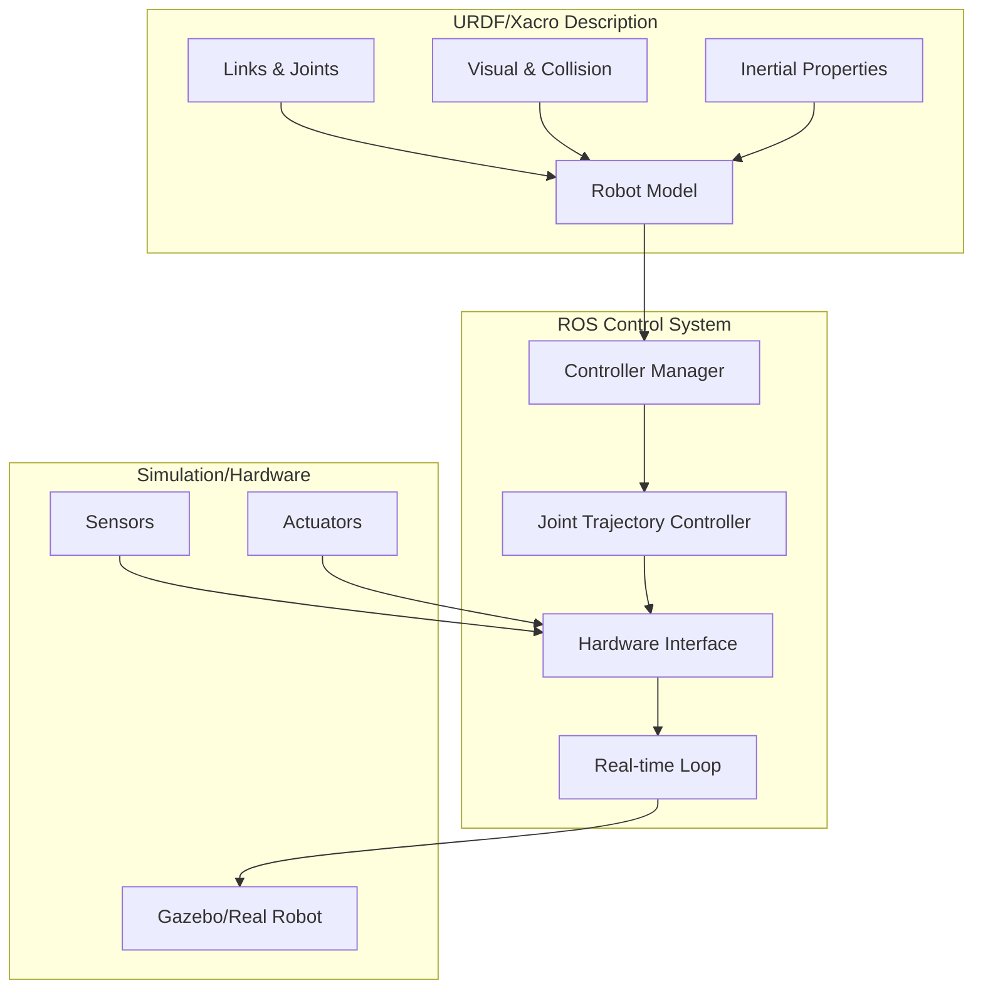
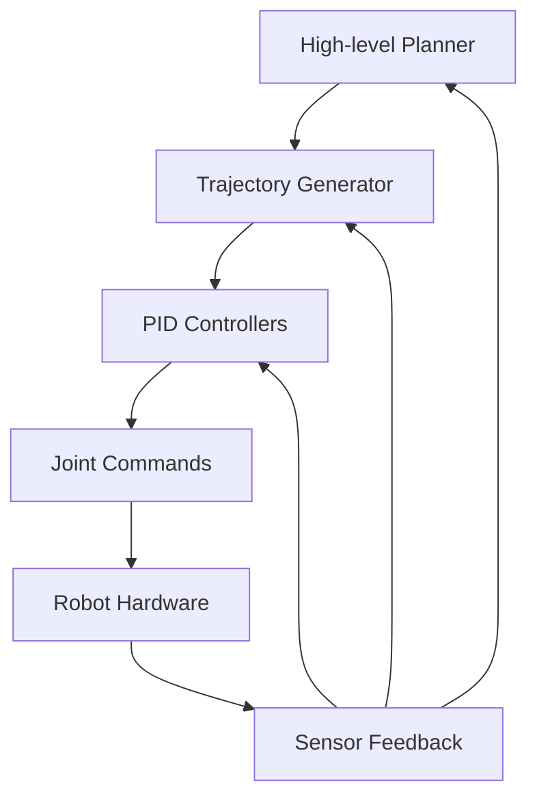

# Chapter 1.3: Robot Description and Control

## Learning Objectives
By the end of this chapter, you will be able to:
- Create comprehensive URDF files for complex robots including humanoids
- Understand and implement robot control strategies using ROS 2 control
- Integrate robot description with control systems for simulation and hardware
- Apply best practices for robot description and control in physical AI systems
- Validate and debug robot descriptions and control systems

## Core Theory

### Robot Description Fundamentals

#### URDF (Unified Robot Description Format)
URDF is an XML-based format that describes robot models in ROS. It defines the physical and kinematic properties of robots:

**Core Components**:
- **Links**: Rigid bodies that make up the robot structure
- **Joints**: Connections between links that allow relative motion
- **Visual**: Properties for visualization in RViz and Gazebo
- **Collision**: Properties for collision detection and physics simulation
- **Inertial**: Mass properties for physics simulation
- **Materials**: Visual appearance properties

#### Robot Description Package Structure
A proper robot description follows the ROS package structure:

```
robot_description/
├── CMakeLists.txt
├── package.xml
├── urdf/
│   ├── robot.urdf (or robot.xacro)
│   ├── materials.xacro
│   └── transmission.xacro
├── meshes/
│   ├── visual/
│   └── collision/
├── launch/
│   └── display.launch.py
└── config/
    └── joint_names.yaml
```

### URDF for Complex Robots

#### Link Definition
Links represent rigid bodies in the robot:

```xml
<link name="link_name">
  <inertial>
    <mass value="1.0"/>
    <origin xyz="0 0 0" rpy="0 0 0"/>
    <inertia ixx="0.01" ixy="0" ixz="0" iyy="0.01" iyz="0" izz="0.01"/>
  </inertial>
  <visual>
    <origin xyz="0 0 0" rpy="0 0 0"/>
    <geometry>
      <box size="0.1 0.1 0.1"/>
    </geometry>
    <material name="blue"/>
  </visual>
  <collision>
    <origin xyz="0 0 0" rpy="0 0 0"/>
    <geometry>
      <box size="0.1 0.1 0.1"/>
    </geometry>
  </collision>
</link>
```

#### Joint Definition
Joints connect links and define their relative motion:

```xml
<joint name="joint_name" type="revolute">
  <parent link="parent_link"/>
  <child link="child_link"/>
  <origin xyz="0 0 0.1" rpy="0 0 0"/>
  <axis xyz="0 0 1"/>
  <limit lower="-1.57" upper="1.57" effort="10.0" velocity="1.0"/>
  <dynamics damping="0.1" friction="0.0"/>
</joint>
```

### Xacro for Complex Descriptions

Xacro (XML Macros) allows for parameterized and reusable URDF definitions:

**Benefits of Xacro**:
- Parameterization of robot models
- Reusable components and macros
- Cleaner and more maintainable descriptions
- Conditional definitions

**Example Xacro Structure**:
```xml
<?xml version="1.0"?>
<robot xmlns:xacro="http://www.ros.org/wiki/xacro" name="robot_name">

  <!-- Parameters -->
  <xacro:property name="robot_name" value="my_robot"/>
  <xacro:property name="pi" value="3.14159"/>

  <!-- Macros for repeated components -->
  <xacro:macro name="wheel" params="prefix parent xyz rpy radius">
    <link name="${prefix}_wheel">
      <visual>
        <geometry>
          <cylinder radius="${radius}" length="0.05"/>
        </geometry>
      </visual>
      <collision>
        <geometry>
          <cylinder radius="${radius}" length="0.05"/>
        </geometry>
      </collision>
      <inertial>
        <mass value="0.5"/>
        <inertia ixx="0.01" ixy="0" ixz="0" iyy="0.01" iyz="0" izz="0.02"/>
      </inertial>
    </link>

    <joint name="${prefix}_wheel_joint" type="continuous">
      <parent link="${parent}"/>
      <child link="${prefix}_wheel"/>
      <origin xyz="${xyz}" rpy="${rpy}"/>
      <axis xyz="0 1 0"/>
    </joint>
  </xacro:macro>

  <!-- Use the macro -->
  <xacro:wheel prefix="front_left" parent="base_link"
               xyz="0.2 0.15 0" rpy="0 0 0" radius="0.1"/>

</robot>
```

### Robot Control Systems

#### ROS 2 Control Architecture
ROS 2 Control provides a standardized framework for robot control:

**Components**:
- **Controllers**: Implement specific control behaviors
- **Controller Manager**: Manages controller lifecycle and switching
- **Hardware Interface**: Abstraction layer for hardware communication
- **Real-time Control**: Deterministic control loop execution

#### Control Strategies

**1. Position Control**:
- Direct joint position commands
- Suitable for precise positioning tasks
- Common in manipulation applications

**2. Velocity Control**:
- Joint velocity commands
- Good for smooth motion and trajectory following
- Used in mobile robot navigation

**3. Effort/Torque Control**:
- Direct force/torque commands
- Enables compliant and adaptive behaviors
- Essential for physical interaction tasks

**4. Cartesian Control**:
- End-effector position and orientation control
- Requires inverse kinematics solvers
- Used for task-space manipulation

### Robot State Management

#### Robot State Publisher
The robot_state_publisher node calculates and publishes joint transforms:

**Functionality**:
- Calculates forward kinematics
- Publishes TF transforms
- Updates robot visualization
- Handles joint state messages

#### Joint State Publisher
Provides joint position feedback for visualization and control:

**Components**:
- Joint state messages
- GUI-based joint controllers (for simulation)
- Hardware interface for real robots

### Practical Examples

#### Complete Humanoid Robot URDF with Xacro

```xml
<?xml version="1.0"?>
<robot xmlns:xacro="http://www.ros.org/wiki/xacro" name="humanoid_robot">

  <!-- Properties -->
  <xacro:property name="M_PI" value="3.1415926535897931"/>
  <xacro:property name="torso_mass" value="5.0"/>
  <xacro:property name="head_mass" value="1.0"/>
  <xacro:property name="arm_mass" value="0.8"/>
  <xacro:property name="leg_mass" value="2.0"/>

  <!-- Materials -->
  <material name="blue">
    <color rgba="0.0 0.0 1.0 1.0"/>
  </material>
  <material name="white">
    <color rgba="1.0 1.0 1.0 1.0"/>
  </material>
  <material name="red">
    <color rgba="1.0 0.0 0.0 1.0"/>
  </material>
  <material name="black">
    <color rgba="0.1 0.1 0.1 1.0"/>
  </material>

  <!-- Base Link -->
  <link name="base_link">
    <inertial>
      <mass value="0.1"/>
      <inertia ixx="0.001" ixy="0.0" ixz="0.0"
               iyy="0.001" iyz="0.0" izz="0.001"/>
    </inertial>
  </link>

  <!-- Torso -->
  <link name="torso">
    <visual>
      <geometry>
        <box size="0.2 0.15 0.4"/>
      </geometry>
      <material name="white"/>
    </visual>
    <collision>
      <geometry>
        <box size="0.2 0.15 0.4"/>
      </geometry>
    </collision>
    <inertial>
      <mass value="${torso_mass}"/>
      <inertia ixx="0.1" ixy="0.0" ixz="0.0"
               iyy="0.15" iyz="0.0" izz="0.08"/>
    </inertial>
  </link>

  <joint name="torso_joint" type="fixed">
    <parent link="base_link"/>
    <child link="torso"/>
    <origin xyz="0 0 0.25" rpy="0 0 0"/>
  </joint>

  <!-- Head -->
  <link name="head">
    <visual>
      <geometry>
        <sphere radius="0.1"/>
      </geometry>
      <material name="white"/>
    </visual>
    <collision>
      <geometry>
        <sphere radius="0.1"/>
      </geometry>
    </collision>
    <inertial>
      <mass value="${head_mass}"/>
      <inertia ixx="0.002" ixy="0.0" ixz="0.0"
               iyy="0.002" iyz="0.0" izz="0.002"/>
    </inertial>
  </link>

  <joint name="neck_joint" type="revolute">
    <parent link="torso"/>
    <child link="head"/>
    <origin xyz="0 0 0.25" rpy="0 0 0"/>
    <axis xyz="0 1 0"/>
    <limit lower="-0.5" upper="0.5" effort="10.0" velocity="1.0"/>
  </joint>

  <!-- Macro for arm links -->
  <xacro:macro name="arm_chain" params="side parent xyz">
    <link name="${side}_shoulder">
      <visual>
        <geometry>
          <box size="0.1 0.08 0.08"/>
        </geometry>
        <material name="red"/>
      </visual>
      <collision>
        <geometry>
          <box size="0.1 0.08 0.08"/>
        </geometry>
      </collision>
      <inertial>
        <mass value="${arm_mass}"/>
        <inertia ixx="0.0005" ixy="0.0" ixz="0.0"
                 iyy="0.0008" iyz="0.0" izz="0.0008"/>
      </inertial>
    </link>

    <joint name="${side}_shoulder_joint" type="revolute">
      <parent link="${parent}"/>
      <child link="${side}_shoulder"/>
      <origin xyz="${xyz}" rpy="0 0 0"/>
      <axis xyz="0 1 0"/>
      <limit lower="-1.57" upper="1.57" effort="15.0" velocity="2.0"/>
    </joint>

    <link name="${side}_upper_arm">
      <visual>
        <geometry>
          <cylinder length="0.3" radius="0.05"/>
        </geometry>
        <material name="red"/>
      </visual>
      <collision>
        <geometry>
          <cylinder length="0.3" radius="0.05"/>
        </geometry>
      </collision>
      <inertial>
        <mass value="1.0"/>
        <inertia ixx="0.002" ixy="0.0" ixz="0.0"
                 iyy="0.002" iyz="0.0" izz="0.0005"/>
      </inertial>
    </link>

    <joint name="${side}_upper_arm_joint" type="revolute">
      <parent link="${side}_shoulder"/>
      <child link="${side}_upper_arm"/>
      <origin xyz="0.05 0 0" rpy="0 0 0"/>
      <axis xyz="1 0 0"/>
      <limit lower="-2.0" upper="2.0" effort="20.0" velocity="2.0"/>
    </joint>

    <link name="${side}_lower_arm">
      <visual>
        <geometry>
          <cylinder length="0.25" radius="0.04"/>
        </geometry>
        <material name="red"/>
      </visual>
      <collision>
        <geometry>
          <cylinder length="0.25" radius="0.04"/>
        </geometry>
      </collision>
      <inertial>
        <mass value="0.6"/>
        <inertia ixx="0.001" ixy="0.0" ixz="0.0"
                 iyy="0.001" iyz="0.0" izz="0.0003"/>
      </inertial>
    </link>

    <joint name="${side}_elbow_joint" type="revolute">
      <parent link="${side}_upper_arm"/>
      <child link="${side}_lower_arm"/>
      <origin xyz="0 0 -0.15" rpy="0 0 0"/>
      <axis xyz="1 0 0"/>
      <limit lower="0" upper="2.5" effort="15.0" velocity="2.0"/>
    </joint>
  </xacro:macro>

  <!-- Instantiate arms -->
  <xacro:arm_chain side="left" parent="torso" xyz="0.15 0.1 0.1"/>
  <xacro:arm_chain side="right" parent="torso" xyz="0.15 -0.1 0.1"/>

  <!-- Macro for leg links -->
  <xacro:macro name="leg_chain" params="side parent xyz">
    <link name="${side}_hip">
      <visual>
        <geometry>
          <box size="0.08 0.08 0.1"/>
        </geometry>
        <material name="blue"/>
      </visual>
      <collision>
        <geometry>
          <box size="0.08 0.08 0.1"/>
        </geometry>
      </collision>
      <inertial>
        <mass value="1.0"/>
        <inertia ixx="0.001" ixy="0.0" ixz="0.0"
                 iyy="0.001" iyz="0.0" izz="0.0015"/>
      </inertial>
    </link>

    <joint name="${side}_hip_joint" type="revolute">
      <parent link="${parent}"/>
      <child link="${side}_hip"/>
      <origin xyz="${xyz}" rpy="0 0 0"/>
      <axis xyz="1 0 0"/>
      <limit lower="-0.5" upper="0.5" effort="30.0" velocity="1.0"/>
    </joint>

    <link name="${side}_upper_leg">
      <visual>
        <geometry>
          <cylinder length="0.4" radius="0.06"/>
        </geometry>
        <material name="blue"/>
      </visual>
      <collision>
        <geometry>
          <cylinder length="0.4" radius="0.06"/>
        </geometry>
      </collision>
      <inertial>
        <mass value="${leg_mass}"/>
        <inertia ixx="0.02" ixy="0.0" ixz="0.0"
                 iyy="0.02" iyz="0.0" izz="0.002"/>
      </inertial>
    </link>

    <joint name="${side}_knee_joint" type="revolute">
      <parent link="${side}_hip"/>
      <child link="${side}_upper_leg"/>
      <origin xyz="0 0 -0.15" rpy="0 0 0"/>
      <axis xyz="1 0 0"/>
      <limit lower="0" upper="2.0" effort="40.0" velocity="1.5"/>
    </joint>

    <link name="${side}_lower_leg">
      <visual>
        <geometry>
          <cylinder length="0.4" radius="0.05"/>
        </geometry>
        <material name="blue"/>
      </visual>
      <collision>
        <geometry>
          <cylinder length="0.4" radius="0.05"/>
        </geometry>
      </collision>
      <inertial>
        <mass value="1.5"/>
        <inertia ixx="0.015" ixy="0.0" ixz="0.0"
                 iyy="0.015" iyz="0.0" izz="0.0015"/>
      </inertial>
    </link>

    <joint name="${side}_ankle_joint" type="revolute">
      <parent link="${side}_upper_leg"/>
      <child link="${side}_lower_leg"/>
      <origin xyz="0 0 -0.25" rpy="0 0 0"/>
      <axis xyz="1 0 0"/>
      <limit lower="-0.5" upper="0.5" effort="25.0" velocity="1.0"/>
    </joint>

    <link name="${side}_foot">
      <visual>
        <geometry>
          <box size="0.2 0.1 0.05"/>
        </geometry>
        <material name="black"/>
      </visual>
      <collision>
        <geometry>
          <box size="0.2 0.1 0.05"/>
        </geometry>
      </collision>
      <inertial>
        <mass value="0.8"/>
        <inertia ixx="0.001" ixy="0.0" ixz="0.0"
                 iyy="0.002" iyz="0.0" izz="0.0025"/>
      </inertial>
    </link>

    <joint name="${side}_foot_joint" type="fixed">
      <parent link="${side}_lower_leg"/>
      <child link="${side}_foot"/>
      <origin xyz="0 0 -0.05" rpy="0 0 0"/>
    </joint>
  </xacro:macro>

  <!-- Pelvis joint -->
  <link name="pelvis">
    <visual>
      <geometry>
        <box size="0.2 0.2 0.1"/>
      </geometry>
      <material name="black"/>
    </visual>
    <collision>
      <geometry>
        <box size="0.2 0.2 0.1"/>
      </geometry>
    </collision>
    <inertial>
      <mass value="2.0"/>
      <inertia ixx="0.02" ixy="0.0" ixz="0.0"
               iyy="0.02" iyz="0.0" izz="0.01"/>
    </inertial>
  </link>

  <joint name="pelvis_joint" type="fixed">
    <parent link="torso"/>
    <child link="pelvis"/>
    <origin xyz="0 0 -0.2" rpy="0 0 0"/>
  </joint>

  <!-- Instantiate legs -->
  <xacro:leg_chain side="left" parent="pelvis" xyz="0 0.1 -0.05"/>
  <xacro:leg_chain side="right" parent="pelvis" xyz="0 -0.1 -0.05"/>

  <!-- Transmissions for ROS Control -->
  <xacro:macro name="position_transmission" params="joint_name">
    <transmission name="${joint_name}_trans">
      <type>transmission_interface/SimpleTransmission</type>
      <joint name="${joint_name}">
        <hardwareInterface>position_controllers/JointPositionController</hardwareInterface>
      </joint>
    </transmission>
  </xacro:macro>

  <!-- Apply transmissions to all joints -->
  <xacro:position_transmission joint_name="neck_joint"/>
  <xacro:position_transmission joint_name="left_shoulder_joint"/>
  <xacro:position_transmission joint_name="left_upper_arm_joint"/>
  <xacro:position_transmission joint_name="left_elbow_joint"/>
  <xacro:position_transmission joint_name="right_shoulder_joint"/>
  <xacro:position_transmission joint_name="right_upper_arm_joint"/>
  <xacro:position_transmission joint_name="right_elbow_joint"/>
  <xacro:position_transmission joint_name="left_hip_joint"/>
  <xacro:position_transmission joint_name="left_knee_joint"/>
  <xacro:position_transmission joint_name="left_ankle_joint"/>
  <xacro:position_transmission joint_name="right_hip_joint"/>
  <xacro:position_transmission joint_name="right_knee_joint"/>
  <xacro:position_transmission joint_name="right_ankle_joint"/>

</robot>
```

#### Robot Control Node with Safety Features

```python
import rclpy
from rclpy.node import Node
from sensor_msgs.msg import JointState
from trajectory_msgs.msg import JointTrajectory, JointTrajectoryPoint
from builtin_interfaces.msg import Duration
from control_msgs.msg import JointTrajectoryControllerState
import numpy as np
import math

class RobotControllerNode(Node):
    def __init__(self):
        super().__init__('robot_controller_node')

        # Publishers and subscribers
        self.joint_command_pub = self.create_publisher(
            JointTrajectory, '/joint_trajectory_controller/joint_trajectory', 10)

        self.joint_state_sub = self.create_subscription(
            JointState, '/joint_states', self.joint_state_callback, 10)

        self.controller_state_sub = self.create_subscription(
            JointTrajectoryControllerState, '/joint_trajectory_controller/state',
            self.controller_state_callback, 10)

        # Timer for control loop
        self.control_timer = self.create_timer(0.02, self.control_loop)

        # Robot state
        self.current_joint_positions = {}
        self.current_joint_velocities = {}
        self.current_joint_efforts = {}

        # Safety parameters
        self.joint_limits = {
            'neck_joint': (-0.5, 0.5),
            'left_shoulder_joint': (-1.57, 1.57),
            'left_upper_arm_joint': (-2.0, 2.0),
            'left_elbow_joint': (0, 2.5),
            'right_shoulder_joint': (-1.57, 1.57),
            'right_upper_arm_joint': (-2.0, 2.0),
            'right_elbow_joint': (0, 2.5),
            'left_hip_joint': (-0.5, 0.5),
            'left_knee_joint': (0, 2.0),
            'left_ankle_joint': (-0.5, 0.5),
            'right_hip_joint': (-0.5, 0.5),
            'right_knee_joint': (0, 2.0),
            'right_ankle_joint': (-0.5, 0.5),
        }

        self.max_velocity = 1.0  # rad/s
        self.safety_enabled = True

        # Target positions (for demonstration)
        self.target_positions = {}
        self.initialize_targets()

        self.get_logger().info('Robot Controller Node initialized')

    def initialize_targets(self):
        """Initialize target positions for all joints"""
        for joint_name in self.joint_limits.keys():
            min_pos, max_pos = self.joint_limits[joint_name]
            self.target_positions[joint_name] = (min_pos + max_pos) / 2.0

    def joint_state_callback(self, msg):
        """Update current joint states"""
        for i, name in enumerate(msg.name):
            if i < len(msg.position):
                self.current_joint_positions[name] = msg.position[i]
            if i < len(msg.velocity):
                self.current_joint_velocities[name] = msg.velocity[i]
            if i < len(msg.effort):
                self.current_joint_efforts[name] = msg.effort[i]

    def controller_state_callback(self, msg):
        """Handle controller state updates"""
        # This can be used to monitor controller performance
        pass

    def control_loop(self):
        """Main control loop with safety checks"""
        if not self.current_joint_positions:
            return  # Wait for initial joint states

        # Apply safety checks
        if self.safety_enabled:
            if not self.check_safety_conditions():
                self.get_logger().warn('Safety conditions not met, stopping control')
                return

        # Generate trajectory command
        trajectory_msg = self.generate_trajectory_command()
        if trajectory_msg:
            self.joint_command_pub.publish(trajectory_msg)

    def check_safety_conditions(self):
        """Check all safety conditions before commanding joints"""
        # Check joint limits
        for joint_name, position in self.current_joint_positions.items():
            if joint_name in self.joint_limits:
                min_pos, max_pos = self.joint_limits[joint_name]
                if position < min_pos or position > max_pos:
                    self.get_logger().error(f'Joint {joint_name} out of limits: {position}')
                    return False

        # Check velocity limits
        for joint_name, velocity in self.current_joint_velocities.items():
            if abs(velocity) > self.max_velocity:
                self.get_logger().error(f'Joint {joint_name} velocity limit exceeded: {velocity}')
                return False

        return True

    def generate_trajectory_command(self):
        """Generate trajectory command for all joints"""
        if not self.target_positions:
            return None

        # Create trajectory message
        trajectory_msg = JointTrajectory()
        trajectory_msg.joint_names = list(self.target_positions.keys())

        # Create trajectory point
        point = JointTrajectoryPoint()

        positions = []
        velocities = []
        accelerations = []

        for joint_name in trajectory_msg.joint_names:
            if joint_name in self.target_positions:
                target_pos = self.target_positions[joint_name]

                # Apply joint limits
                if joint_name in self.joint_limits:
                    min_pos, max_pos = self.joint_limits[joint_name]
                    target_pos = max(min_pos, min(max_pos, target_pos))

                positions.append(target_pos)
                velocities.append(0.0)  # Zero velocity at target
                accelerations.append(0.0)  # Zero acceleration at target

        point.positions = positions
        point.velocities = velocities
        point.accelerations = accelerations
        point.time_from_start = Duration(sec=0, nanosec=50000000)  # 50ms

        trajectory_msg.points = [point]
        return trajectory_msg

    def set_target_position(self, joint_name, position):
        """Set target position for a specific joint"""
        if joint_name in self.joint_limits:
            min_pos, max_pos = self.joint_limits[joint_name]
            clamped_pos = max(min_pos, min(max_pos, position))
            self.target_positions[joint_name] = clamped_pos
            self.get_logger().info(f'Set {joint_name} target to {clamped_pos:.3f}')
        else:
            self.get_logger().warn(f'Joint {joint_name} not found in joint limits')

    def move_to_home_position(self):
        """Move all joints to home position"""
        for joint_name in self.target_positions.keys():
            if joint_name in self.joint_limits:
                min_pos, max_pos = self.joint_limits[joint_name]
                self.target_positions[joint_name] = (min_pos + max_pos) / 2.0

    def enable_safety(self, enable=True):
        """Enable or disable safety checks"""
        self.safety_enabled = enable
        status = "enabled" if enable else "disabled"
        self.get_logger().info(f'Safety checks {status}')

def main(args=None):
    rclpy.init(args=args)
    controller_node = RobotControllerNode()

    try:
        # Example: Move to home position after startup
        controller_node.move_to_home_position()

        rclpy.spin(controller_node)
    except KeyboardInterrupt:
        pass
    finally:
        controller_node.destroy_node()
        rclpy.shutdown()

if __name__ == '__main__':
    main()
```

#### Advanced Control with PID and Trajectory Generation

```python
import rclpy
from rclpy.node import Node
from sensor_msgs.msg import JointState
from trajectory_msgs.msg import JointTrajectory, JointTrajectoryPoint
from builtin_interfaces.msg import Duration
import numpy as np
from scipy.interpolate import CubicSpline
import time

class AdvancedRobotController(Node):
    def __init__(self):
        super().__init__('advanced_robot_controller')

        # Publishers and subscribers
        self.joint_command_pub = self.create_publisher(
            JointTrajectory, '/joint_trajectory_controller/joint_trajectory', 10)

        self.joint_state_sub = self.create_subscription(
            JointState, '/joint_states', self.joint_state_callback, 10)

        # Control timer
        self.control_timer = self.create_timer(0.01, self.control_loop)

        # Robot state
        self.current_positions = {}
        self.current_velocities = {}
        self.current_efforts = {}

        # PID controllers for each joint
        self.pid_controllers = {}
        self.joint_names = [
            'neck_joint', 'left_shoulder_joint', 'left_upper_arm_joint',
            'left_elbow_joint', 'right_shoulder_joint', 'right_upper_arm_joint',
            'right_elbow_joint', 'left_hip_joint', 'left_knee_joint',
            'left_ankle_joint', 'right_hip_joint', 'right_knee_joint', 'right_ankle_joint'
        ]

        # Initialize PID controllers
        for joint_name in self.joint_names:
            self.pid_controllers[joint_name] = PIDController(
                kp=5.0, ki=0.1, kd=0.5, max_output=5.0
            )

        # Trajectory generation
        self.trajectory_generator = TrajectoryGenerator()
        self.current_trajectory = None
        self.trajectory_start_time = None

        # Safety parameters
        self.joint_limits = {
            'neck_joint': (-0.5, 0.5),
            'left_shoulder_joint': (-1.57, 1.57),
            'left_upper_arm_joint': (-2.0, 2.0),
            'left_elbow_joint': (0, 2.5),
            'right_shoulder_joint': (-1.57, 1.57),
            'right_upper_arm_joint': (-2.0, 2.0),
            'right_elbow_joint': (0, 2.5),
            'left_hip_joint': (-0.5, 0.5),
            'left_knee_joint': (0, 2.0),
            'left_ankle_joint': (-0.5, 0.5),
            'right_hip_joint': (-0.5, 0.5),
            'right_knee_joint': (0, 2.0),
            'right_ankle_joint': (-0.5, 0.5),
        }

        self.get_logger().info('Advanced Robot Controller initialized')

    def joint_state_callback(self, msg):
        """Update current joint states"""
        for i, name in enumerate(msg.name):
            if i < len(msg.position):
                self.current_positions[name] = msg.position[i]
            if i < len(msg.velocity):
                self.current_velocities[name] = msg.velocity[i]
            if i < len(msg.effort):
                self.current_efforts[name] = msg.effort[i]

    def control_loop(self):
        """Advanced control loop with PID and trajectory following"""
        if not self.current_positions:
            return  # Wait for initial joint states

        # Check if we have an active trajectory
        if self.current_trajectory and self.trajectory_start_time:
            current_time = self.get_clock().now().nanoseconds / 1e9
            elapsed_time = current_time - self.trajectory_start_time

            if elapsed_time < self.current_trajectory.duration:
                # Generate command for current time
                command = self.follow_trajectory(elapsed_time)
                if command:
                    self.publish_command(command)
            else:
                # Trajectory completed
                self.current_trajectory = None
                self.trajectory_start_time = None
        else:
            # Default behavior - hold current position
            self.hold_current_position()

    def follow_trajectory(self, elapsed_time):
        """Follow current trajectory at given time"""
        if not self.current_trajectory:
            return None

        # Get desired positions and velocities at current time
        desired_positions = []
        desired_velocities = []
        desired_accelerations = []

        for joint_name in self.joint_names:
            if joint_name in self.current_trajectory.trajectories:
                trajectory = self.current_trajectory.trajectories[joint_name]
                pos, vel, acc = trajectory.evaluate(elapsed_time)
                desired_positions.append(pos)
                desired_velocities.append(vel)
                desired_accelerations.append(acc)
            else:
                # Hold current position if no trajectory defined
                current_pos = self.current_positions.get(joint_name, 0.0)
                desired_positions.append(current_pos)
                desired_velocities.append(0.0)
                desired_accelerations.append(0.0)

        return {
            'positions': desired_positions,
            'velocities': desired_velocities,
            'accelerations': desired_accelerations
        }

    def hold_current_position(self):
        """Hold current joint positions"""
        positions = []
        velocities = []
        accelerations = []

        for joint_name in self.joint_names:
            pos = self.current_positions.get(joint_name, 0.0)
            positions.append(pos)
            velocities.append(0.0)
            accelerations.append(0.0)

        command = {
            'positions': positions,
            'velocities': velocities,
            'accelerations': accelerations
        }

        self.publish_command(command)

    def publish_command(self, command):
        """Publish joint trajectory command"""
        trajectory_msg = JointTrajectory()
        trajectory_msg.joint_names = self.joint_names

        point = JointTrajectoryPoint()
        point.positions = command['positions']
        point.velocities = command['velocities']
        point.accelerations = command['accelerations']
        point.time_from_start = Duration(sec=0, nanosec=10000000)  # 10ms

        trajectory_msg.points = [point]
        self.joint_command_pub.publish(trajectory_msg)

    def execute_trajectory(self, waypoints):
        """Execute a trajectory defined by waypoints"""
        self.current_trajectory = self.trajectory_generator.generate(waypoints)
        self.trajectory_start_time = self.get_clock().now().nanoseconds / 1e9

    def move_to_joint_positions(self, positions_dict, duration=2.0):
        """Move to specific joint positions"""
        waypoints = [
            {'time': 0.0, 'positions': {name: self.current_positions.get(name, 0.0) for name in self.joint_names}},
            {'time': duration, 'positions': positions_dict}
        ]
        self.execute_trajectory(waypoints)

class PIDController:
    def __init__(self, kp=1.0, ki=0.0, kd=0.0, max_output=10.0):
        self.kp = kp
        self.ki = ki
        self.kd = kd
        self.max_output = max_output
        self.integral = 0.0
        self.previous_error = 0.0
        self.previous_time = None

    def compute(self, setpoint, measurement, dt):
        """Compute PID output"""
        error = setpoint - measurement

        # Integral term
        self.integral += error * dt

        # Derivative term
        derivative = 0.0
        if self.previous_time is not None:
            derivative = (error - self.previous_error) / dt if dt > 0 else 0.0

        # PID calculation
        output = (self.kp * error) + (self.ki * self.integral) + (self.kd * derivative)

        # Limit output
        output = max(-self.max_output, min(self.max_output, output))

        # Store for next iteration
        self.previous_error = error
        self.previous_time = time.time()

        return output

class TrajectoryGenerator:
    def __init__(self):
        pass

    def generate(self, waypoints):
        """Generate smooth trajectory from waypoints"""
        class Trajectory:
            def __init__(self, joint_trajectories, duration):
                self.trajectories = joint_trajectories  # Dict of joint_name -> spline
                self.duration = duration

            def evaluate(self, t):
                """Evaluate trajectory at time t"""
                result = {}
                for joint_name, spline in self.trajectories.items():
                    pos = float(spline(t))
                    vel = float(spline.derivative()(t))
                    acc = float(spline.derivative().derivative()(t))
                    return pos, vel, acc

        # Extract time points and joint positions
        times = [wp['time'] for wp in waypoints]
        duration = max(times)

        # Create splines for each joint
        joint_trajectories = {}

        for joint_name in waypoints[0]['positions'].keys():
            joint_positions = [wp['positions'][joint_name] for wp in waypoints]

            # Create cubic spline
            spline = CubicSpline(times, joint_positions, bc_type='clamped')
            joint_trajectories[joint_name] = spline

        return Trajectory(joint_trajectories, duration)

def main(args=None):
    rclpy.init(args=args)
    controller = AdvancedRobotController()

    # Example: Move to a specific configuration after startup
    def move_to_example_pose():
        example_positions = {
            'neck_joint': 0.0,
            'left_shoulder_joint': 0.5,
            'left_upper_arm_joint': 0.5,
            'left_elbow_joint': 1.0,
            'right_shoulder_joint': -0.5,
            'right_upper_arm_joint': -0.5,
            'right_elbow_joint': 1.0,
            'left_hip_joint': 0.0,
            'left_knee_joint': 0.5,
            'left_ankle_joint': 0.0,
            'right_hip_joint': 0.0,
            'right_knee_joint': 0.5,
            'right_ankle_joint': 0.0
        }
        controller.move_to_joint_positions(example_positions, duration=3.0)

    # Schedule the example movement after 1 second
    timer = controller.create_timer(1.0, move_to_example_pose)

    try:
        rclpy.spin(controller)
    except KeyboardInterrupt:
        pass
    finally:
        controller.destroy_node()
        rclpy.shutdown()

if __name__ == '__main__':
    main()
```

## Diagrams

### Robot Description Architecture


### Control System Hierarchy


## Exercises

1. Create a URDF for a simple 6-DOF robotic arm with proper inertial properties
2. Implement a joint trajectory controller for your robot with safety limits
3. Design a robot description package with Xacro macros for reusable components
4. Build a complete control system that can execute predefined trajectories
5. Implement forward and inverse kinematics for your robot model

## Quiz

1. What are the main components of a URDF file?
2. Explain the difference between visual and collision properties in URDF.
3. What is the purpose of the robot_state_publisher in ROS 2?
4. Name the different types of joints available in URDF.
5. What are the advantages of using Xacro over plain URDF?
6. Explain the role of transmissions in ROS 2 control.
7. What are the main control strategies available in ROS 2 control?
8. How do you implement safety limits in robot control systems?

## Summary

This chapter provided a comprehensive overview of robot description and control in ROS 2, covering the essential concepts for creating detailed robot models using URDF and implementing effective control strategies. We explored the fundamental components of robot descriptions, including links, joints, visual and collision properties, and the proper package structure for organizing robot models.

Key concepts covered include:
- URDF fundamentals and the core components of robot descriptions
- Xacro macros for creating modular and maintainable robot descriptions
- ROS 2 control framework and different control strategies
- Integration of robot descriptions with control systems for simulation and hardware
- Safety considerations and validation techniques for robot models

The practical examples demonstrated how to create complex robot models, implement various control approaches, and integrate simulation with real hardware. The architecture patterns showed how to structure robot description packages for maximum reusability and maintainability.

These foundational skills are critical for developing physical AI and humanoid robotics applications, where accurate robot modeling and precise control are essential for successful operation. Understanding these concepts enables the creation of robots that can effectively interact with their environment and perform complex tasks.

## References
- [URDF Documentation](http://wiki.ros.org/urdf)
- [Xacro Documentation](http://wiki.ros.org/xacro)
- [ROS 2 Control](https://control.ros.org/)
- [Robot State Publisher](http://wiki.ros.org/robot_state_publisher)
- [Gazebo Robot Simulation](http://gazebosim.org/tutorials?tut=ros2_overview)