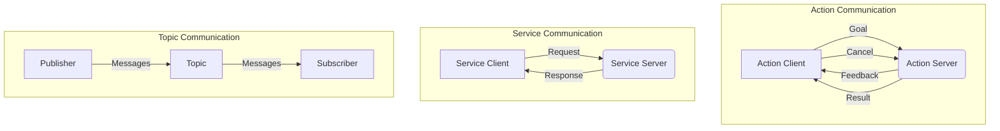
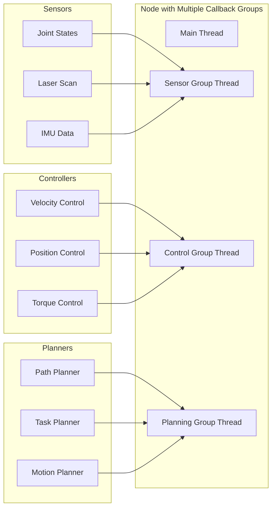
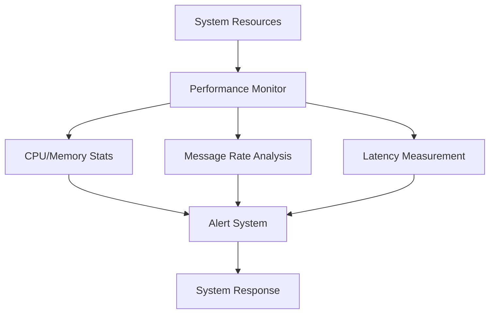

# Chapter 1.4: Advanced ROS 2 Concepts

## Summary
This chapter explores advanced ROS 2 concepts that are essential for developing sophisticated robotic systems. We'll cover complex communication patterns, advanced node management, performance optimization, security considerations, and cutting-edge features that enable state-of-the-art robotic applications. These concepts are crucial for building robust, scalable, and secure robotic systems for physical AI and humanoid robotics.

## Learning Objectives
By the end of this chapter, you will be able to:
- Implement advanced communication patterns including actions and services
- Optimize ROS 2 performance for real-time applications
- Apply security best practices in ROS 2 systems
- Use advanced debugging and profiling tools
- Understand and implement complex robotic system architectures
- Leverage ROS 2 for distributed and cloud robotics applications

## Core Theory

### Advanced Communication Patterns

#### Actions for Long-Running Tasks
Actions provide a more sophisticated communication pattern for long-running tasks with feedback:

**Action Components**:
- **Goal**: Request sent by the client to start an action
- **Result**: Final outcome returned by the server
- **Feedback**: Intermediate updates during execution
- **Status**: Current state of the action execution

**Action States**:
- `PENDING`: Goal received but not yet started
- `ACTIVE`: Goal is currently being processed
- `PREEMPTING`: Goal is being canceled
- `SUCCEEDED`: Goal completed successfully
- `ABORTED`: Goal failed to complete
- `CANCELED`: Goal was canceled

#### Custom Message and Service Types
Creating custom message and service definitions for specific applications:

**Message Definition (.msg)**:
```
# CustomRobotState.msg
float64[] joint_positions
float64[] joint_velocities
float64[] joint_efforts
geometry_msgs/Pose robot_pose
sensor_msgs/JointState sensor_data
builtin_interfaces/Time timestamp
```

**Service Definition (.srv)**:
```
# RobotCalibration.srv
# Request
string calibration_type
float64[] parameters
---
# Response
bool success
string message
float64[] results
```

### Performance Optimization

#### Real-time Considerations
ROS 2 can be configured for real-time performance in critical applications:

**Real-time Scheduling**:
- Use SCHED_FIFO or SCHED_RR scheduling policies
- Configure CPU affinity for ROS nodes
- Use real-time kernel patches if necessary

**Memory Management**:
- Pre-allocate message buffers
- Use memory pools for frequently created objects
- Minimize dynamic memory allocation in control loops

**Communication Optimization**:
- Use appropriate QoS settings for different data types
- Implement data compression for large messages
- Use shared memory for high-frequency data exchange

#### Profiling and Monitoring
Monitoring system performance to identify bottlenecks:

**Built-in Tools**:
- `ros2 topic hz`: Monitor message frequency
- `ros2 topic delay`: Measure message latency
- `ros2 run plotjuggler plotjuggler`: Real-time data visualization

**Custom Profiling**:
- Instrument code with timing measurements
- Monitor CPU and memory usage
- Track message queue sizes and processing times

### Security in ROS 2

#### DDS Security Implementation
ROS 2 leverages DDS security features for secure communication:

**Security Plugins**:
- **Authentication**: Verify node identity
- **Access Control**: Control communication permissions
- **Cryptographic**: Encrypt data in transit

**Security Configuration**:
- Security files define policies and permissions
- Certificates and keys for authentication
- Secure discovery and communication

#### Best Practices for Security
- Use domain isolation for sensitive systems
- Implement least-privilege access control
- Regular security audits and updates
- Secure communication between robots and cloud services

### Distributed and Cloud Robotics

#### Multi-Robot Systems
ROS 2 enables coordination of multiple robots:

**Communication Patterns**:
- Centralized coordination through a master robot
- Decentralized peer-to-peer communication
- Hierarchical organization with team leaders

**Challenges**:
- Network reliability and latency
- Consistent state synchronization
- Resource allocation and task coordination

#### Cloud Integration
Integrating cloud services with ROS 2 systems:

**Cloud Services**:
- Machine learning model deployment
- Data storage and analytics
- Remote monitoring and control
- Collaborative robot learning

### Advanced Node Management

#### Lifecycle Nodes
Advanced node management with explicit state control:

**State Transitions**:
- Configuration and parameter validation
- Resource allocation and deallocation
- Graceful shutdown procedures
- Dynamic reconfiguration capabilities

#### Composition
Running multiple nodes within a single process:

**Benefits**:
- Reduced inter-process communication overhead
- Improved performance for tightly coupled nodes
- Simplified deployment and management

**Considerations**:
- Shared memory space and potential conflicts
- Debugging complexity
- Failure isolation limitations

### Practical Examples

#### Advanced Action Server Implementation

```python
import rclpy
from rclpy.action import ActionServer, CancelResponse, GoalResponse
from rclpy.node import Node
from rclpy.callback_groups import ReentrantCallbackGroup
from rclpy.executors import MultiThreadedExecutor
import time
from threading import Lock

# Assuming we have a custom action definition
# action/RobotNavigation.action:
# # Goal
# geometry_msgs/Pose target_pose
# float64 max_time
# ---
# # Result
# bool success
# string message
# float64 execution_time
# ---
# # Feedback
# geometry_msgs/Pose current_pose
# float64 distance_remaining
# string status

from robot_navigation_msgs.action import RobotNavigation

class AdvancedActionServer(Node):
    def __init__(self):
        super().__init__('advanced_action_server')

        # Use reentrant callback group for handling multiple goals
        callback_group = ReentrantCallbackGroup()

        # Create action server
        self._action_server = ActionServer(
            self,
            RobotNavigation,
            'robot_navigation',
            execute_callback=self.execute_callback,
            callback_group=callback_group,
            goal_callback=self.goal_callback,
            handle_accepted_callback=self.handle_accepted_callback,
            cancel_callback=self.cancel_callback
        )

        # Robot state and control
        self.current_pose = [0.0, 0.0, 0.0]  # x, y, theta
        self.is_navigating = False
        self.navigation_lock = Lock()

        self.get_logger().info('Advanced Action Server initialized')

    def destroy(self):
        self._action_server.destroy()
        super().destroy_node()

    def goal_callback(self, goal_request):
        """Accept or reject goal requests"""
        self.get_logger().info(f'Received navigation goal to: {goal_request.target_pose}')

        # Check if goal is valid (e.g., within bounds)
        target_x = goal_request.target_pose.position.x
        target_y = goal_request.target_pose.position.y

        if abs(target_x) > 10.0 or abs(target_y) > 10.0:
            self.get_logger().warn('Goal is outside navigation bounds')
            return GoalResponse.REJECT

        return GoalResponse.ACCEPT

    def handle_accepted_callback(self, goal_handle):
        """Handle accepted goal"""
        with self.navigation_lock:
            if self.is_navigating:
                self.get_logger().warn('Already navigating, rejecting new goal')
                goal_handle.abort()
                return

            self.is_navigating = True

        # Start execution in separate thread
        goal_handle.execute()

    def cancel_callback(self, goal_handle):
        """Handle goal cancellation"""
        self.get_logger().info('Received cancel request')
        return CancelResponse.ACCEPT

    def execute_callback(self, goal_handle):
        """Execute the navigation goal"""
        self.get_logger().info('Executing navigation goal')

        # Get goal parameters
        target_pose = goal_handle.request.target_pose
        max_time = goal_handle.request.max_time

        # Initialize feedback
        feedback_msg = RobotNavigation.Feedback()
        result = RobotNavigation.Result()

        start_time = time.time()

        try:
            # Navigation loop
            while rclpy.ok():
                # Check for cancellation
                if goal_handle.is_cancel_requested:
                    goal_handle.canceled()
                    result.success = False
                    result.message = 'Goal canceled'
                    self.is_navigating = False
                    return result

                # Simulate navigation progress
                current_time = time.time()
                elapsed_time = current_time - start_time

                # Update current pose (simulated movement)
                self.update_current_pose(target_pose, elapsed_time)

                # Calculate distance to target
                distance = self.calculate_distance_to_target(target_pose)

                # Prepare feedback
                feedback_msg.current_pose.position.x = self.current_pose[0]
                feedback_msg.current_pose.position.y = self.current_pose[1]
                feedback_msg.distance_remaining = distance
                feedback_msg.status = f'Navigating... {distance:.2f}m remaining'

                # Publish feedback
                goal_handle.publish_feedback(feedback_msg)

                # Check if goal is reached
                if distance < 0.1:  # 10cm tolerance
                    result.success = True
                    result.message = 'Navigation completed successfully'
                    result.execution_time = elapsed_time
                    goal_handle.succeed()
                    break

                # Check timeout
                if elapsed_time > max_time:
                    result.success = False
                    result.message = 'Navigation timeout'
                    result.execution_time = elapsed_time
                    goal_handle.abort()
                    break

                # Small delay to simulate processing
                time.sleep(0.1)

        except Exception as e:
            self.get_logger().error(f'Navigation execution failed: {e}')
            result.success = False
            result.message = f'Execution error: {str(e)}'
            goal_handle.abort()

        finally:
            with self.navigation_lock:
                self.is_navigating = False

        return result

    def update_current_pose(self, target_pose, elapsed_time):
        """Simulate pose update during navigation"""
        target_x = target_pose.position.x
        target_y = target_pose.position.y

        # Simple linear interpolation (in real systems, use proper motion models)
        progress = min(1.0, elapsed_time / 5.0)  # Assume 5 seconds to reach target
        self.current_pose[0] = self.current_pose[0] + (target_x - self.current_pose[0]) * progress * 0.1
        self.current_pose[1] = self.current_pose[1] + (target_y - self.current_pose[1]) * progress * 0.1

    def calculate_distance_to_target(self, target_pose):
        """Calculate distance to target pose"""
        dx = target_pose.position.x - self.current_pose[0]
        dy = target_pose.position.y - self.current_pose[1]
        return (dx**2 + dy**2)**0.5

def main(args=None):
    rclpy.init(args=args)

    action_server = AdvancedActionServer()

    # Use multi-threaded executor to handle multiple goals
    executor = MultiThreadedExecutor(num_threads=4)
    executor.add_node(action_server)

    try:
        executor.spin()
    except KeyboardInterrupt:
        pass
    finally:
        action_server.destroy()
        rclpy.shutdown()

if __name__ == '__main__':
    main()
```

#### Performance Monitoring and Optimization Node

```python
import rclpy
from rclpy.node import Node
from std_msgs.msg import String, Int32
from sensor_msgs.msg import JointState
from rclpy.qos import QoSProfile, ReliabilityPolicy
from rclpy.time import Time
from collections import deque
import time
import psutil
import threading
from threading import Lock

class PerformanceMonitorNode(Node):
    def __init__(self):
        super().__init__('performance_monitor_node')

        # QoS profiles for different data types
        reliable_qos = QoSProfile(depth=10, reliability=ReliabilityPolicy.RELIABLE)
        best_effort_qos = QoSProfile(depth=50, reliability=ReliabilityPolicy.BEST_EFFORT)

        # Publishers for monitoring data
        self.monitor_pub = self.create_publisher(String, 'system_monitor', reliable_qos)
        self.stats_pub = self.create_publisher(String, 'performance_stats', best_effort_qos)

        # Subscribers to monitor
        self.joint_state_sub = self.create_subscription(
            JointState, 'joint_states', self.joint_state_callback, 10)

        # Performance tracking
        self.message_times = deque(maxlen=100)  # Last 100 message times
        self.cpu_history = deque(maxlen=100)
        self.memory_history = deque(maxlen=100)
        self.message_count = 0
        self.message_lock = Lock()

        # Performance thresholds
        self.cpu_threshold = 80.0  # Percent
        self.memory_threshold = 80.0  # Percent
        self.message_rate_threshold = 1000.0  # Messages per second

        # Timer for performance monitoring
        self.monitor_timer = self.create_timer(1.0, self.performance_monitor)
        self.stats_timer = self.create_timer(0.1, self.publish_stats)

        # System monitoring thread
        self.monitoring_thread = threading.Thread(target=self.system_monitor_loop)
        self.monitoring_thread.daemon = True
        self.monitoring_thread.start()

        self.get_logger().info('Performance Monitor Node initialized')

    def joint_state_callback(self, msg):
        """Monitor incoming joint state messages"""
        current_time = self.get_clock().now().nanoseconds / 1e9
        self.message_times.append(current_time)
        with self.message_lock:
            self.message_count += 1

    def performance_monitor(self):
        """Monitor system performance and detect issues"""
        current_time = self.get_clock().now().nanoseconds / 1e9

        # Calculate message rate
        with self.message_lock:
            message_rate = self.message_count
            self.message_count = 0

        # Get system stats
        cpu_percent = psutil.cpu_percent()
        memory_percent = psutil.virtual_memory().percent

        # Store history
        self.cpu_history.append(cpu_percent)
        self.memory_history.append(memory_percent)

        # Check for performance issues
        issues = []
        if cpu_percent > self.cpu_threshold:
            issues.append(f'High CPU usage: {cpu_percent:.1f}%')
        if memory_percent > self.memory_threshold:
            issues.append(f'High memory usage: {memory_percent:.1f}%')
        if message_rate > self.message_rate_threshold:
            issues.append(f'High message rate: {message_rate}/s')

        # Log issues
        if issues:
            for issue in issues:
                self.get_logger().warn(f'Performance issue: {issue}')

        # Publish system status
        status_msg = String()
        status_msg.data = f'CPU: {cpu_percent:.1f}%, Memory: {memory_percent:.1f}%, Rate: {message_rate}/s'
        self.monitor_pub.publish(status_msg)

    def publish_stats(self):
        """Publish detailed performance statistics"""
        stats_msg = String()
        stats_msg.data = self.get_detailed_stats()
        self.stats_pub.publish(stats_msg)

    def get_detailed_stats(self):
        """Generate detailed performance statistics"""
        current_time = self.get_clock().now().nanoseconds / 1e9

        # Calculate statistics
        if len(self.message_times) > 1:
            time_diffs = [self.message_times[i] - self.message_times[i-1]
                         for i in range(1, len(self.message_times))]
            avg_interval = sum(time_diffs) / len(time_diffs) if time_diffs else 0
            avg_rate = 1.0 / avg_interval if avg_interval > 0 else 0
        else:
            avg_interval = 0
            avg_rate = 0

        avg_cpu = sum(self.cpu_history) / len(self.cpu_history) if self.cpu_history else 0
        avg_memory = sum(self.memory_history) / len(self.memory_history) if self.memory_history else 0

        stats = {
            'timestamp': current_time,
            'message_rate_avg': avg_rate,
            'message_interval_avg': avg_interval,
            'cpu_avg': avg_cpu,
            'memory_avg': avg_memory,
            'message_buffer_size': len(self.message_times)
        }

        return str(stats)

    def system_monitor_loop(self):
        """Background thread for system monitoring"""
        while rclpy.ok():
            try:
                # Additional system monitoring can be added here
                time.sleep(2.0)
            except Exception as e:
                self.get_logger().error(f'System monitoring error: {e}')

def main(args=None):
    rclpy.init(args=args)
    monitor_node = PerformanceMonitorNode()

    try:
        rclpy.spin(monitor_node)
    except KeyboardInterrupt:
        pass
    finally:
        monitor_node.destroy_node()
        rclpy.shutdown()

if __name__ == '__main__':
    main()
```

#### Advanced Service Implementation with Security

```python
import rclpy
from rclpy.node import Node
from rclpy.qos import QoSProfile
from rclpy.callback_groups import MutuallyExclusiveCallbackGroup
from example_interfaces.srv import AddTwoInts
import hashlib
import time
from functools import wraps

class SecureServiceNode(Node):
    def __init__(self):
        super().__init__('secure_service_node')

        # Create callback groups for different services
        math_callback_group = MutuallyExclusiveCallbackGroup()
        security_callback_group = MutuallyExclusiveCallbackGroup()

        # Create services with different security levels
        self.math_service = self.create_service(
            AddTwoInts,
            'secure_add_two_ints',
            self.secure_add_callback,
            callback_group=math_callback_group
        )

        self.security_service = self.create_service(
            AddTwoInts,
            'security_check',
            self.security_check_callback,
            callback_group=security_callback_group
        )

        # Security parameters
        self.api_keys = {
            'robot1_key': 'valid_client_1',
            'robot2_key': 'valid_client_2'
        }
        self.rate_limits = {}  # Track request rates per client
        self.security_log = []

        self.get_logger().info('Secure Service Node initialized')

    def authenticate_request(self, client_info):
        """Authenticate incoming request"""
        # Extract client identifier (in real system, this would come from request)
        client_id = client_info.get('client_id', 'unknown')
        api_key = client_info.get('api_key', 'invalid')

        # Check if API key is valid
        if api_key not in self.api_keys:
            self.log_security_event('AUTH_FAILED', f'Invalid API key for client {client_id}')
            return False

        # Check rate limiting
        current_time = time.time()
        if client_id in self.rate_limits:
            last_request, count = self.rate_limits[client_id]
            if current_time - last_request < 1.0:  # 1 second window
                if count >= 10:  # Max 10 requests per second
                    self.log_security_event('RATE_LIMIT_EXCEEDED', f'Client {client_id}')
                    return False
                self.rate_limits[client_id] = (last_request, count + 1)
            else:
                self.rate_limits[client_id] = (current_time, 1)
        else:
            self.rate_limits[client_id] = (current_time, 1)

        return True

    def log_security_event(self, event_type, details):
        """Log security events"""
        event = {
            'timestamp': time.time(),
            'type': event_type,
            'details': details
        }
        self.security_log.append(event)
        self.get_logger().warn(f'Security event: {event_type} - {details}')

    def secure_add_callback(self, request, response):
        """Secure addition service with authentication"""
        # Simulate client info (in real system, this would come from request context)
        client_info = {
            'client_id': 'robot1',
            'api_key': 'robot1_key'
        }

        # Authenticate request
        if not self.authenticate_request(client_info):
            response.sum = 0
            self.get_logger().error('Unauthorized access attempt to secure service')
            return response

        # Perform the calculation
        result = request.a + request.b
        response.sum = result

        self.get_logger().info(f'Secure addition: {request.a} + {request.b} = {result}')
        return response

    def security_check_callback(self, request, response):
        """Security check service"""
        # This service might check security status or reset security state
        self.get_logger().info('Security check requested')

        # Return some security-related information
        response.sum = len(self.security_log)  # Number of security events

        return response

def main(args=None):
    rclpy.init(args=args)
    secure_node = SecureServiceNode()

    try:
        rclpy.spin(secure_node)
    except KeyboardInterrupt:
        pass
    finally:
        secure_node.destroy_node()
        rclpy.shutdown()

if __name__ == '__main__':
    main()
```

### Complex System Architecture Example

```python
import rclpy
from rclpy.node import Node
from rclpy.action import ActionServer
from rclpy.executors import MultiThreadedExecutor
from rclpy.callback_groups import MutuallyExclusiveCallbackGroup, ReentrantCallbackGroup
from std_msgs.msg import String
from sensor_msgs.msg import JointState
from geometry_msgs.msg import Twist
from robot_navigation_msgs.action import RobotNavigation
import threading
import asyncio
from concurrent.futures import ThreadPoolExecutor

class ComplexRobotSystemNode(Node):
    def __init__(self):
        super().__init__('complex_robot_system')

        # Create different callback groups for various components
        sensor_group = MutuallyExclusiveCallbackGroup()
        control_group = MutuallyExclusiveCallbackGroup()
        planning_group = ReentrantCallbackGroup()  # Can handle multiple goals

        # Publishers for different subsystems
        self.cmd_vel_pub = self.create_publisher(Twist, 'cmd_vel', 10, callback_group=control_group)
        self.status_pub = self.create_publisher(String, 'system_status', 10)

        # Subscribers for sensor data
        self.joint_state_sub = self.create_subscription(
            JointState, 'joint_states', self.joint_state_callback, 10, callback_group=sensor_group)

        # Action server for navigation
        self.navigation_server = ActionServer(
            self,
            RobotNavigation,
            'complex_navigation',
            self.navigation_execute_callback,
            callback_group=planning_group
        )

        # System state
        self.current_joints = JointState()
        self.system_state = 'IDLE'
        self.safety_enabled = True
        self.emergency_stop = False

        # Thread pool for CPU-intensive tasks
        self.thread_pool = ThreadPoolExecutor(max_workers=4)

        # Async event loop for complex operations
        self.loop = asyncio.new_event_loop()
        self.loop_thread = threading.Thread(target=self.run_async_loop, daemon=True)
        self.loop_thread.start()

        # Timers for different system functions
        self.control_timer = self.create_timer(0.05, self.control_loop, callback_group=control_group)
        self.monitor_timer = self.create_timer(1.0, self.system_monitor, callback_group=sensor_group)

        self.get_logger().info('Complex Robot System initialized')

    def run_async_loop(self):
        """Run async event loop in separate thread"""
        asyncio.set_event_loop(self.loop)
        self.loop.run_forever()

    def joint_state_callback(self, msg):
        """Handle joint state updates"""
        self.current_joints = msg
        self.get_logger().debug(f'Received joint state with {len(msg.position)} joints')

    def navigation_execute_callback(self, goal_handle):
        """Execute navigation goal with complex planning"""
        self.get_logger().info('Starting complex navigation execution')

        # Run complex planning in thread pool
        future = self.thread_pool.submit(self.complex_navigation_planning, goal_handle.request)

        # Wait for planning to complete (with timeout handling)
        try:
            plan_result = future.result(timeout=10.0)  # 10 second timeout
            if plan_result['success']:
                # Execute the planned path
                execution_result = self.execute_navigation_plan(plan_result['plan'])
                goal_handle.succeed()
                return execution_result
            else:
                goal_handle.abort()
                return plan_result['result']
        except Exception as e:
            self.get_logger().error(f'Navigation execution failed: {e}')
            goal_handle.abort()
            result = RobotNavigation.Result()
            result.success = False
            result.message = f'Planning failed: {str(e)}'
            return result

    def complex_navigation_planning(self, request):
        """Perform complex navigation planning (CPU-intensive)"""
        # Simulate complex planning algorithm
        import time
        time.sleep(0.5)  # Simulate computation time

        # In real system, this would involve:
        # - Path planning with obstacle avoidance
        # - Dynamic replanning based on sensor feedback
        # - Multi-objective optimization
        # - Uncertainty handling

        return {
            'success': True,
            'plan': [{'x': 1.0, 'y': 1.0}, {'x': 2.0, 'y': 2.0}],  # Simplified plan
            'result': RobotNavigation.Result(success=True, message='Plan generated')
        }

    def execute_navigation_plan(self, plan):
        """Execute a navigation plan"""
        # In real system, this would follow the planned path
        # with continuous feedback and adjustment

        result = RobotNavigation.Result()
        result.success = True
        result.message = 'Navigation completed'
        result.execution_time = 5.0  # Simulated time

        return result

    def control_loop(self):
        """Main control loop with safety checks"""
        if self.emergency_stop:
            # Stop all motion
            stop_cmd = Twist()
            self.cmd_vel_pub.publish(stop_cmd)
            return

        if self.safety_enabled:
            # Perform safety checks
            if not self.safety_check():
                self.emergency_stop = True
                self.get_logger().error('Safety check failed, activating emergency stop')
                return

        # Normal control logic would go here
        # For now, just publish system status
        status_msg = String()
        status_msg.data = f'System state: {self.system_state}, Joints: {len(self.current_joints.position)}'
        self.status_pub.publish(status_msg)

    def safety_check(self):
        """Perform comprehensive safety checks"""
        # Check joint limits
        for i, pos in enumerate(self.current_joints.position):
            if abs(pos) > 3.14:  # Example limit check
                self.get_logger().warn(f'Joint {i} position limit exceeded: {pos}')
                return False

        # Check for other safety conditions
        # (collision detection, hardware faults, etc.)

        return True

    def system_monitor(self):
        """Monitor overall system health"""
        # Monitor system resources
        import psutil
        cpu_percent = psutil.cpu_percent()
        memory_percent = psutil.virtual_memory().percent

        # Log system status
        self.get_logger().info(f'System Monitor - CPU: {cpu_percent}%, Memory: {memory_percent}%')

        # Check for system issues and respond appropriately
        if cpu_percent > 90:
            self.get_logger().warn('High CPU usage detected')

    def destroy_node(self):
        """Clean up resources"""
        self.navigation_server.destroy()
        self.thread_pool.shutdown(wait=True)
        self.loop.call_soon_threadsafe(self.loop.stop)
        self.loop_thread.join()
        super().destroy_node()

def main(args=None):
    rclpy.init(args=args)

    # Use multi-threaded executor to handle different callback groups
    executor = MultiThreadedExecutor(num_threads=8)

    node = ComplexRobotSystemNode()
    executor.add_node(node)

    try:
        executor.spin()
    except KeyboardInterrupt:
        pass
    finally:
        node.destroy_node()
        rclpy.shutdown()

if __name__ == '__main__':
    main()
```

## Diagrams

### Advanced Communication Patterns


### System Architecture with Multiple Callback Groups


### Performance Monitoring Architecture


## Exercises

1. Implement an action server for a complex robotic task with multiple feedback types
2. Create a performance monitoring system that tracks CPU, memory, and communication metrics
3. Design a secure ROS 2 system with authentication and encryption
4. Build a multi-robot coordination system using distributed communication
5. Implement a complex system architecture with multiple callback groups and thread safety

## Quiz

1. What are the main differences between ROS 2 actions, services, and topics?
2. Explain the purpose of callback groups in ROS 2 and when to use each type.
3. What are the key components of a ROS 2 action?
4. How does DDS security work in ROS 2?
5. What is the purpose of lifecycle nodes and when should they be used?
6. Explain the concept of composition in ROS 2 and its benefits.
7. What are the main challenges in multi-robot systems?
8. How can you optimize ROS 2 performance for real-time applications?

## Summary

This chapter explored advanced ROS 2 concepts that are essential for building sophisticated robotic applications. We covered complex communication patterns including actions for long-running tasks with feedback, security mechanisms for protecting robotic systems, and performance optimization techniques for real-time applications.

Key concepts covered include:
- Advanced communication patterns with ROS 2 actions for goal-oriented tasks
- Security frameworks and best practices for protecting robotic systems
- Performance optimization strategies including multi-threading and efficient message handling
- Composition techniques for building complex systems from reusable components
- Multi-robot coordination and distributed system design principles

The practical examples demonstrated how to implement complex action servers and clients, secure communication channels, and high-performance node implementations. The architecture patterns showed how to structure complex robotic systems for scalability and maintainability.

These advanced concepts are critical for developing production-ready robotic systems that can operate safely and efficiently in real-world environments. Understanding these principles enables the creation of robust, secure, and high-performance robotic applications.

## References
- [ROS 2 Actions](https://docs.ros.org/en/humble/Tutorials/Actions/Understanding-ROS2-Actions.html)
- [ROS 2 Security](https://docs.ros.org/en/humble/How-To-Guides/Working-with-DDS-Security.html)
- [ROS 2 Performance](https://docs.ros.org/en/humble/Tutorials/Advanced/Node-Performance.html)
- [ROS 2 Multi-threading](https://docs.ros.org/en/humble/Tutorials/Beginner-Client-Libraries/Single-Package-Define-And-Use-Interface-Py.html)
- [ROS 2 Composition](https://docs.ros.org/en/humble/Tutorials/Advanced/Composition.html)