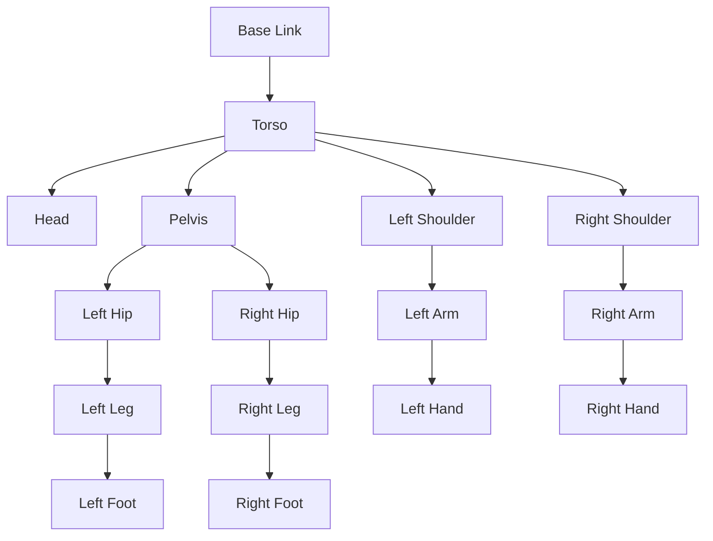
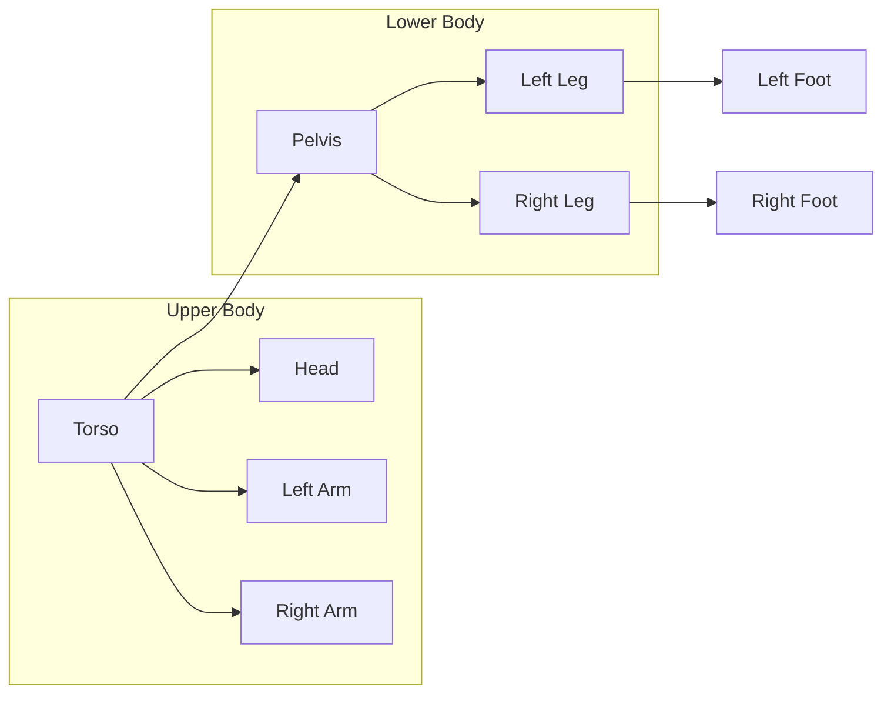

# Chapter 1.4: Understanding URDF (Unified Robot Description Format) for Humanoids

## Summary
This chapter provides a comprehensive guide to creating and implementing Unified Robot Description Format (URDF) files specifically for humanoid robots. It covers the unique challenges and requirements of humanoid robot modeling, including bipedal locomotion, balance, and complex kinematic structures.

## Learning Objectives
By the end of this chapter, you will be able to:
- Create URDF files specifically designed for humanoid robots
- Implement complex kinematic chains for bipedal locomotion
- Define appropriate inertial properties for humanoid balance
- Validate URDF files for humanoid-specific requirements
- Integrate humanoid URDFs with ROS 2 simulation environments

## Core Theory

### URDF Fundamentals for Humanoids
URDF (Unified Robot Description Format) is an XML-based format for representing robots in ROS. For humanoid robots, URDF must address unique challenges:

#### Key Components
- **Links**: Rigid bodies that make up the robot (torso, limbs, head)
- **Joints**: Connections between links that allow relative motion
- **Visual**: Properties for visualization (color, shape, mesh)
- **Collision**: Properties for collision detection
- **Inertial**: Mass properties for physics simulation

#### Humanoid-Specific Requirements
- **Bipedal Locomotion**: Special considerations for walking and balance
- **Balance Constraints**: Center of mass calculations for stable movement
- **Complex Kinematics**: Multiple degrees of freedom for human-like movement
- **Symmetry**: Left/right mirrored joint configurations

### Humanoid Robot Structure
Humanoid robots typically include specialized components:

#### Core Structure
- **Torso**: Central body with main computers and batteries
- **Head**: Contains cameras, sensors, and processing units
- **Spine**: Flexible connection between torso and pelvis (optional but realistic)

#### Limb Structure
- **Arms**: With shoulder, elbow, and wrist joints
- **Hands**: With finger joints for manipulation (optional complexity)
- **Legs**: With hip, knee, and ankle joints
- **Feet**: For balance and ground contact

### Bipedal Locomotion Requirements
Humanoid robots present unique challenges in URDF design:

#### Balance and Stability
- **Center of Mass**: Critical for stable walking patterns
- **Foot Design**: Multi-contact points for ground interaction
- **Ankle Joints**: Additional degrees of freedom for balance
- **Zero Moment Point (ZMP)**: Considerations for stable gait patterns

#### Humanoid-Specific Joint Configurations
- **Degrees of Freedom**: Typically 20-30+ joints for human-like movement
- **Joint Limits**: Biologically-inspired ranges of motion
- **Redundancy**: Multiple solutions for reaching the same position
- **Symmetry**: Left/right mirrored joint configurations

#### Balance and Stability Features
- **IMU Integration**: Inertial measurement units in torso/feet
- **Force/Torque Sensors**: In joints for balance feedback
- **COM Tracking**: Center of mass visualization and calculation
- **Stability Margins**: Safety factors for dynamic movements

## Practical Examples

### Complete Humanoid URDF
```xml
<?xml version="1.0"?>
<robot name="humanoid_robot">

  <!-- Materials -->
  <material name="blue">
    <color rgba="0.0 0.0 1.0 1.0"/>
  </material>
  <material name="white">
    <color rgba="1.0 1.0 1.0 1.0"/>
  </material>
  <material name="red">
    <color rgba="1.0 0.0 0.0 1.0"/>
  </material>
  <material name="black">
    <color rgba="0.1 0.1 0.1 1.0"/>
  </material>

  <!-- Base Link -->
  <link name="base_link">
    <inertial>
      <mass value="0.1"/>
      <inertia ixx="0.001" ixy="0.0" ixz="0.0" iyy="0.001" iyz="0.0" izz="0.001"/>
    </inertial>
  </link>

  <!-- Torso -->
  <link name="torso">
    <visual>
      <geometry>
        <box size="0.2 0.15 0.4"/>
      </geometry>
      <material name="white"/>
    </visual>
    <collision>
      <geometry>
        <box size="0.2 0.15 0.4"/>
      </geometry>
    </collision>
    <inertial>
      <mass value="5.0"/>
      <inertia ixx="0.1" ixy="0.0" ixz="0.0" iyy="0.15" iyz="0.0" izz="0.08"/>
    </inertial>
  </link>

  <joint name="torso_joint" type="fixed">
    <parent link="base_link"/>
    <child link="torso"/>
    <origin xyz="0 0 0.25" rpy="0 0 0"/>
  </joint>

  <!-- Head -->
  <link name="head">
    <visual>
      <geometry>
        <sphere radius="0.1"/>
      </geometry>
      <material name="white"/>
    </visual>
    <collision>
      <geometry>
        <sphere radius="0.1"/>
      </geometry>
    </collision>
    <inertial>
      <mass value="1.0"/>
      <inertia ixx="0.002" ixy="0.0" ixz="0.0" iyy="0.002" iyz="0.0" izz="0.002"/>
    </inertial>
  </link>

  <joint name="neck_joint" type="revolute">
    <parent link="torso"/>
    <child link="head"/>
    <origin xyz="0 0 0.25" rpy="0 0 0"/>
    <axis xyz="0 1 0"/>
    <limit lower="-0.5" upper="0.5" effort="10.0" velocity="1.0"/>
  </joint>

  <!-- Left Arm -->
  <link name="left_shoulder">
    <visual>
      <geometry>
        <box size="0.1 0.08 0.08"/>
      </geometry>
      <material name="red"/>
    </visual>
    <collision>
      <geometry>
        <box size="0.1 0.08 0.08"/>
      </geometry>
    </collision>
    <inertial>
      <mass value="0.8"/>
      <inertia ixx="0.0005" ixy="0.0" ixz="0.0" iyy="0.0008" iyz="0.0" izz="0.0008"/>
    </inertial>
  </link>

  <joint name="left_shoulder_joint" type="revolute">
    <parent link="torso"/>
    <child link="left_shoulder"/>
    <origin xyz="0.15 0.1 0.1" rpy="0 0 0"/>
    <axis xyz="0 1 0"/>
    <limit lower="-1.57" upper="1.57" effort="15.0" velocity="2.0"/>
  </joint>

  <link name="left_upper_arm">
    <visual>
      <geometry>
        <cylinder length="0.3" radius="0.05"/>
      </geometry>
      <material name="red"/>
    </visual>
    <collision>
      <geometry>
        <cylinder length="0.3" radius="0.05"/>
      </geometry>
    </collision>
    <inertial>
      <mass value="1.0"/>
      <inertia ixx="0.002" ixy="0.0" ixz="0.0" iyy="0.002" iyz="0.0" izz="0.0005"/>
    </inertial>
  </link>

  <joint name="left_upper_arm_joint" type="revolute">
    <parent link="left_shoulder"/>
    <child link="left_upper_arm"/>
    <origin xyz="0.05 0 0" rpy="0 0 0"/>
    <axis xyz="1 0 0"/>
    <limit lower="-2.0" upper="2.0" effort="20.0" velocity="2.0"/>
  </joint>

  <link name="left_lower_arm">
    <visual>
      <geometry>
        <cylinder length="0.25" radius="0.04"/>
      </geometry>
      <material name="red"/>
    </visual>
    <collision>
      <geometry>
        <cylinder length="0.25" radius="0.04"/>
      </geometry>
    </collision>
    <inertial>
      <mass value="0.6"/>
      <inertia ixx="0.001" ixy="0.0" ixz="0.0" iyy="0.001" iyz="0.0" izz="0.0003"/>
    </inertial>
  </link>

  <joint name="left_elbow_joint" type="revolute">
    <parent link="left_upper_arm"/>
    <child link="left_lower_arm"/>
    <origin xyz="0 0 -0.15" rpy="0 0 0"/>
    <axis xyz="1 0 0"/>
    <limit lower="0" upper="2.5" effort="15.0" velocity="2.0"/>
  </joint>

  <!-- Right Arm (mirrored) -->
  <link name="right_shoulder">
    <visual>
      <geometry>
        <box size="0.1 0.08 0.08"/>
      </geometry>
      <material name="red"/>
    </visual>
    <collision>
      <geometry>
        <box size="0.1 0.08 0.08"/>
      </geometry>
    </collision>
    <inertial>
      <mass value="0.8"/>
      <inertia ixx="0.0005" ixy="0.0" ixz="0.0" iyy="0.0008" iyz="0.0" izz="0.0008"/>
    </inertial>
  </link>

  <joint name="right_shoulder_joint" type="revolute">
    <parent link="torso"/>
    <child link="right_shoulder"/>
    <origin xyz="0.15 -0.1 0.1" rpy="0 0 0"/>
    <axis xyz="0 1 0"/>
    <limit lower="-1.57" upper="1.57" effort="15.0" velocity="2.0"/>
  </joint>

  <link name="right_upper_arm">
    <visual>
      <geometry>
        <cylinder length="0.3" radius="0.05"/>
      </geometry>
      <material name="red"/>
    </visual>
    <collision>
      <geometry>
        <cylinder length="0.3" radius="0.05"/>
      </geometry>
    </collision>
    <inertial>
      <mass value="1.0"/>
      <inertia ixx="0.002" ixy="0.0" ixz="0.0" iyy="0.002" iyz="0.0" izz="0.0005"/>
    </inertial>
  </link>

  <joint name="right_upper_arm_joint" type="revolute">
    <parent link="right_shoulder"/>
    <child link="right_upper_arm"/>
    <origin xyz="0.05 0 0" rpy="0 0 0"/>
    <axis xyz="1 0 0"/>
    <limit lower="-2.0" upper="2.0" effort="20.0" velocity="2.0"/>
  </joint>

  <link name="right_lower_arm">
    <visual>
      <geometry>
        <cylinder length="0.25" radius="0.04"/>
      </geometry>
      <material name="red"/>
    </visual>
    <collision>
      <geometry>
        <cylinder length="0.25" radius="0.04"/>
      </geometry>
    </collision>
    <inertial>
      <mass value="0.6"/>
      <inertia ixx="0.001" ixy="0.0" ixz="0.0" iyy="0.001" iyz="0.0" izz="0.0003"/>
    </inertial>
  </link>

  <joint name="right_elbow_joint" type="revolute">
    <parent link="right_upper_arm"/>
    <child link="right_lower_arm"/>
    <origin xyz="0 0 -0.15" rpy="0 0 0"/>
    <axis xyz="1 0 0"/>
    <limit lower="0" upper="2.5" effort="15.0" velocity="2.0"/>
  </joint>

  <!-- Pelvis (for proper bipedal structure) -->
  <link name="pelvis">
    <visual>
      <geometry>
        <box size="0.2 0.2 0.1"/>
      </geometry>
      <material name="black"/>
    </visual>
    <collision>
      <geometry>
        <box size="0.2 0.2 0.1"/>
      </geometry>
    </collision>
    <inertial>
      <mass value="2.0"/>
      <inertia ixx="0.02" ixy="0.0" ixz="0.0" iyy="0.02" iyz="0.0" izz="0.01"/>
    </inertial>
  </link>

  <joint name="pelvis_joint" type="fixed">
    <parent link="torso"/>
    <child link="pelvis"/>
    <origin xyz="0 0 -0.2" rpy="0 0 0"/>
  </joint>

  <!-- Left Leg -->
  <link name="left_hip">
    <visual>
      <geometry>
        <box size="0.08 0.08 0.1"/>
      </geometry>
      <material name="blue"/>
    </visual>
    <collision>
      <geometry>
        <box size="0.08 0.08 0.1"/>
      </geometry>
    </collision>
    <inertial>
      <mass value="1.0"/>
      <inertia ixx="0.001" ixy="0.0" ixz="0.0" iyy="0.001" iyz="0.0" izz="0.0015"/>
    </inertial>
  </link>

  <joint name="left_hip_joint" type="revolute">
    <parent link="pelvis"/>
    <child link="left_hip"/>
    <origin xyz="0 0.1 -0.05" rpy="0 0 0"/>
    <axis xyz="1 0 0"/>
    <limit lower="-0.5" upper="0.5" effort="30.0" velocity="1.0"/>
  </joint>

  <link name="left_upper_leg">
    <visual>
      <geometry>
        <cylinder length="0.4" radius="0.06"/>
      </geometry>
      <material name="blue"/>
    </visual>
    <collision>
      <geometry>
        <cylinder length="0.4" radius="0.06"/>
      </geometry>
    </collision>
    <inertial>
      <mass value="2.0"/>
      <inertia ixx="0.02" ixy="0.0" ixz="0.0" iyy="0.02" iyz="0.0" izz="0.002"/>
    </inertial>
  </link>

  <joint name="left_knee_joint" type="revolute">
    <parent link="left_hip"/>
    <child link="left_upper_leg"/>
    <origin xyz="0 0 -0.15" rpy="0 0 0"/>
    <axis xyz="1 0 0"/>
    <limit lower="0" upper="2.0" effort="40.0" velocity="1.5"/>
  </joint>

  <link name="left_lower_leg">
    <visual>
      <geometry>
        <cylinder length="0.4" radius="0.05"/>
      </geometry>
      <material name="blue"/>
    </visual>
    <collision>
      <geometry>
        <cylinder length="0.4" radius="0.05"/>
      </geometry>
    </collision>
    <inertial>
      <mass value="1.5"/>
      <inertia ixx="0.015" ixy="0.0" ixz="0.0" iyy="0.015" iyz="0.0" izz="0.0015"/>
    </inertial>
  </link>

  <joint name="left_ankle_joint" type="revolute">
    <parent link="left_upper_leg"/>
    <child link="left_lower_leg"/>
    <origin xyz="0 0 -0.25" rpy="0 0 0"/>
    <axis xyz="1 0 0"/>
    <limit lower="-0.5" upper="0.5" effort="25.0" velocity="1.0"/>
  </joint>

  <link name="left_foot">
    <visual>
      <geometry>
        <box size="0.2 0.1 0.05"/>
      </geometry>
      <material name="black"/>
    </visual>
    <collision>
      <geometry>
        <box size="0.2 0.1 0.05"/>
      </geometry>
    </collision>
    <inertial>
      <mass value="0.8"/>
      <inertia ixx="0.001" ixy="0.0" ixz="0.0" iyy="0.002" iyz="0.0" izz="0.0025"/>
    </inertial>
  </link>

  <joint name="left_foot_joint" type="fixed">
    <parent link="left_lower_leg"/>
    <child link="left_foot"/>
    <origin xyz="0 0 -0.05" rpy="0 0 0"/>
  </joint>

  <!-- Right Leg (mirrored) -->
  <link name="right_hip">
    <visual>
      <geometry>
        <box size="0.08 0.08 0.1"/>
      </geometry>
      <material name="blue"/>
    </visual>
    <collision>
      <geometry>
        <box size="0.08 0.08 0.1"/>
      </geometry>
    </collision>
    <inertial>
      <mass value="1.0"/>
      <inertia ixx="0.001" ixy="0.0" ixz="0.0" iyy="0.001" iyz="0.0" izz="0.0015"/>
    </inertial>
  </link>

  <joint name="right_hip_joint" type="revolute">
    <parent link="pelvis"/>
    <child link="right_hip"/>
    <origin xyz="0 -0.1 -0.05" rpy="0 0 0"/>
    <axis xyz="1 0 0"/>
    <limit lower="-0.5" upper="0.5" effort="30.0" velocity="1.0"/>
  </joint>

  <link name="right_upper_leg">
    <visual>
      <geometry>
        <cylinder length="0.4" radius="0.06"/>
      </geometry>
      <material name="blue"/>
    </visual>
    <collision>
      <geometry>
        <cylinder length="0.4" radius="0.06"/>
      </geometry>
    </collision>
    <inertial>
      <mass value="2.0"/>
      <inertia ixx="0.02" ixy="0.0" ixz="0.0" iyy="0.02" iyz="0.0" izz="0.002"/>
    </inertial>
  </link>

  <joint name="right_knee_joint" type="revolute">
    <parent link="right_hip"/>
    <child link="right_upper_leg"/>
    <origin xyz="0 0 -0.15" rpy="0 0 0"/>
    <axis xyz="1 0 0"/>
    <limit lower="0" upper="2.0" effort="40.0" velocity="1.5"/>
  </joint>

  <link name="right_lower_leg">
    <visual>
      <geometry>
        <cylinder length="0.4" radius="0.05"/>
      </geometry>
      <material name="blue"/>
    </visual>
    <collision>
      <geometry>
        <cylinder length="0.4" radius="0.05"/>
      </geometry>
    </collision>
    <inertial>
      <mass value="1.5"/>
      <inertia ixx="0.015" ixy="0.0" ixz="0.0" iyy="0.015" iyz="0.0" izz="0.0015"/>
    </inertial>
  </link>

  <joint name="right_ankle_joint" type="revolute">
    <parent link="right_upper_leg"/>
    <child link="right_lower_leg"/>
    <origin xyz="0 0 -0.25" rpy="0 0 0"/>
    <axis xyz="1 0 0"/>
    <limit lower="-0.5" upper="0.5" effort="25.0" velocity="1.0"/>
  </joint>

  <link name="right_foot">
    <visual>
      <geometry>
        <box size="0.2 0.1 0.05"/>
      </geometry>
      <material name="black"/>
    </visual>
    <collision>
      <geometry>
        <box size="0.2 0.1 0.05"/>
      </geometry>
    </collision>
    <inertial>
      <mass value="0.8"/>
      <inertia ixx="0.001" ixy="0.0" ixz="0.0" iyy="0.002" iyz="0.0" izz="0.0025"/>
    </inertial>
  </link>

  <joint name="right_foot_joint" type="fixed">
    <parent link="right_lower_leg"/>
    <child link="right_foot"/>
    <origin xyz="0 0 -0.05" rpy="0 0 0"/>
  </joint>

</robot>
```

### URDF Validation Script for Humanoids
```python
#!/usr/bin/env python3
import xml.etree.ElementTree as ET
import sys
from collections import defaultdict

def validate_humanoid_urdf(urdf_path):
    """Advanced URDF validation script for humanoid robots"""
    try:
        # Parse the URDF file
        tree = ET.parse(urdf_path)
        root = tree.getroot()

        if root.tag != 'robot':
            print(f"ERROR: Root element is not 'robot'")
            return False

        robot_name = root.attrib.get('name')
        if not robot_name:
            print(f"ERROR: Robot has no name attribute")
            return False

        print(f"Validating humanoid robot: {robot_name}")

        # Find all links and joints
        links = root.findall('.//link')
        joints = root.findall('.//joint')

        print(f"Found {len(links)} links and {len(joints)} joints")

        # Check for humanoid-specific requirements
        link_names = [link.attrib['name'] for link in links if 'name' in link.attrib]

        # Humanoid structure validation
        required_parts = ['torso', 'head', 'left_foot', 'right_foot']
        missing_parts = [part for part in required_parts if part not in link_names]

        if missing_parts:
            print(f"WARNING: Missing humanoid components: {missing_parts}")

        # Check for pelvis (recommended for bipedal)
        if 'pelvis' not in link_names:
            print("INFO: No pelvis joint found - consider adding for better bipedal structure")

        # Joint parent-child relationships
        joint_parents = []
        joint_children = []
        for joint in joints:
            parent_elem = joint.find('parent')
            child_elem = joint.find('child')
            if parent_elem is not None:
                joint_parents.append(parent_elem.attrib.get('link'))
            if child_elem is not None:
                joint_children.append(child_elem.attrib.get('link'))

        # Validate that all joint parents and children exist as links
        for parent in joint_parents:
            if parent and parent not in link_names:
                print(f"ERROR: Joint parent '{parent}' is not defined as a link")
                return False

        for child in joint_children:
            if child and child not in link_names:
                print(f"ERROR: Joint child '{child}' is not defined as a link")
                return False

        # Check for basic properties in links
        total_mass = 0.0
        for link in links:
            link_name = link.attrib.get('name')

            # Check for visual and collision elements
            visual = link.find('visual')
            collision = link.find('collision')
            inertial = link.find('inertial')

            if inertial is None:
                print(f"WARNING: Link '{link_name}' has no inertial properties")
            else:
                mass_elem = inertial.find('mass')
                if mass_elem is not None:
                    try:
                        mass_value = float(mass_elem.attrib.get('value', 0))
                        total_mass += mass_value
                    except ValueError:
                        print(f"WARNING: Invalid mass value for link '{link_name}'")

        print(f"Total robot mass: {total_mass:.2f} kg")

        # Check for reasonable humanoid mass
        if total_mass < 5.0:
            print("WARNING: Robot mass seems low for a humanoid (less than 5kg)")
        elif total_mass > 100.0:
            print("WARNING: Robot mass seems high for a humanoid (more than 100kg)")

        print("Humanoid URDF validation completed successfully!")
        return True

    except ET.ParseError as e:
        print(f"ERROR: Invalid XML in URDF file: {e}")
        return False
    except FileNotFoundError:
        print(f"ERROR: URDF file not found: {urdf_path}")
        return False
    except Exception as e:
        print(f"ERROR: Validation failed: {e}")
        return False

def analyze_humanoid_kinematics(urdf_path):
    """Analyze the kinematic structure of a humanoid robot"""
    try:
        tree = ET.parse(urdf_path)
        root = tree.getroot()

        joints = root.findall('.//joint')

        # Categorize joints by type
        joint_types = defaultdict(int)
        for joint in joints:
            joint_type = joint.attrib.get('type', 'undefined')
            joint_types[joint_type] += 1

        print("\nJoint Type Analysis:")
        for jtype, count in joint_types.items():
            print(f"  {jtype}: {count}")

        # Check for common humanoid joint patterns
        left_joints = [j for j in joints if 'left' in j.attrib.get('name', '').lower()]
        right_joints = [j for j in joints if 'right' in j.attrib.get('name', '').lower()]

        print(f"\nSymmetry Analysis:")
        print(f"  Left-side joints: {len(left_joints)}")
        print(f"  Right-side joints: {len(right_joints)}")

        if abs(len(left_joints) - len(right_joints)) > 2:  # Allow small differences for head/torso
            print("  WARNING: Significant asymmetry detected")
        else:
            print("  Good symmetry for humanoid structure")

    except Exception as e:
        print(f"Kinematic analysis failed: {e}")

if __name__ == '__main__':
    if len(sys.argv) != 2:
        print("Usage: python humanoid_urdf_validator.py <urdf_file>")
        sys.exit(1)

    urdf_file = sys.argv[1]
    success = validate_humanoid_urdf(urdf_file)

    if success:
        analyze_humanoid_kinematics(urdf_file)

    sys.exit(0 if success else 1)
```

## Diagrams

### Humanoid Robot Structure


### Humanoid Kinematic Chain


## Exercises

1. Create a complete URDF for a humanoid with at least 20 joints
2. Add proper inertial properties that ensure stable bipedal locomotion
3. Validate your humanoid URDF using the provided validation script
4. Create a launch file to visualize your humanoid robot in RViz with proper joint state publishers

## Quiz

1. What are the essential components that define a humanoid robot in URDF?
2. Why is the pelvis joint important in humanoid robot design?
3. What are the main challenges in modeling bipedal locomotion in URDF?
4. How do you validate that a humanoid URDF has proper balance characteristics?

## References
- [URDF Documentation](http://wiki.ros.org/urdf)
- [Humanoid Robot Modeling](https://en.wikipedia.org/wiki/Humanoid_robot)
- [Gazebo Humanoid Simulation](http://gazebosim.org/tutorials?tut=humanoid_robot)