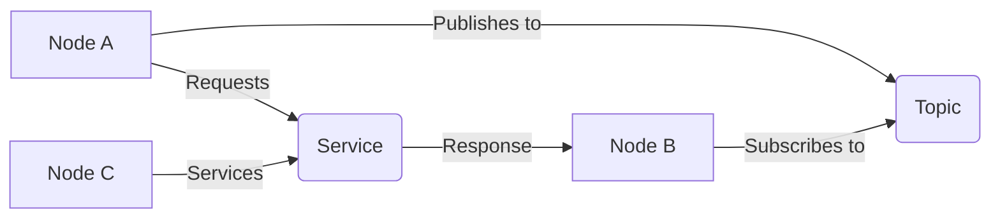

# Chapter 2: ROS 2 Architecture Fundamentals


## Learning Objectives
By the end of this chapter, you will be able to:
- Understand the core concepts of ROS 2 architecture
- Explain the roles of nodes, topics, and services
- Describe the pub/sub communication pattern
- Identify different types of ROS 2 communication interfaces

## Core Theory

### ROS 2 Architecture Overview
ROS 2 is built on DDS (Data Distribution Service) and provides a middleware that enables communication between different processes and machines. The architecture includes:

#### Nodes
- Individual processes that perform computation
- Each node runs a specific task or function
- Nodes can be written in different languages (C++, Python, etc.)
- Nodes communicate with each other through topics, services, and actions

#### Topics
- Unidirectional communication channels for data streaming
- Publishers send messages to topics
- Subscribers receive messages from topics
- Many-to-many communication pattern

#### Services
- Bidirectional communication for request/response patterns
- Client makes a request and waits for a response
- Synchronous communication model
- One-to-one communication pattern

#### Actions
- Extended services for long-running tasks with feedback
- Include goal, result, and feedback mechanisms
- Allow for cancellation and status tracking

### Communication Patterns
- **Publish/Subscribe**: Used for streaming data like sensor readings
- **Request/Response**: Used for RPC-style communication
- **Action**: Used for long-running tasks with progress feedback

### ROS 2 as Middleware for Robot Control
ROS 2 serves as a sophisticated middleware that abstracts the complexity of robot control:

#### Abstraction Layers
- **Hardware Abstraction Layer**: Hides low-level hardware details
- **Communication Layer**: Manages inter-process communication
- **Resource Management**: Handles process lifecycle and resource allocation
- **Security Layer**: Provides authentication and encryption capabilities

#### Control Architecture
- **Centralized Control**: Coordinator nodes manage multiple subsystems
- **Distributed Control**: Independent nodes coordinate through messages
- **Hierarchical Control**: Multi-level control architecture with supervisors
- **Behavior-Based Control**: Modular behaviors coordinated through events

#### Real-Time Capabilities
- **Real-time Scheduling**: Support for real-time operating systems
- **Deterministic Communication**: Guaranteed message delivery timing
- **Priority Management**: Task prioritization for critical operations
- **Deadline Enforcement**: Timely execution guarantees

## Practical Examples

### ROS 2 Node Example
```python
import rclpy
from rclpy.node import Node
from std_msgs.msg import String

class MinimalPublisher(Node):
    def __init__(self):
        super().__init__('minimal_publisher')
        self.publisher = self.create_publisher(String, 'topic', 10)
        timer_period = 0.5  # seconds
        self.timer = self.create_timer(timer_period, self.timer_callback)
        self.i = 0

    def timer_callback(self):
        msg = String()
        msg.data = 'Hello World: %d' % self.i
        self.publisher.publish(msg)
        self.get_logger().info('Publishing: "%s"' % msg.data)
        self.i += 1
```

### ROS 2 Subscriber Example
```python
import rclpy
from rclpy.node import Node
from std_msgs.msg import String

class MinimalSubscriber(Node):
    def __init__(self):
        super().__init__('minimal_subscriber')
        self.subscription = self.create_subscription(
            String,
            'topic',
            self.listener_callback,
            10)
        self.subscription  # prevent unused variable warning

    def listener_callback(self, msg):
        self.get_logger().info('I heard: "%s"' % msg.data)
```

## Diagrams

### ROS 2 Communication Architecture


## Exercises

1. Create a simple ROS 2 publisher node that publishes sensor data
2. Create a subscriber node that receives and processes the sensor data
3. Implement a service server and client to demonstrate request/response communication
4. Design a simple action server that simulates a long-running task

## Quiz

1. What is the difference between a ROS 2 topic and a service?
2. Which communication pattern would you use for streaming sensor data?
3. What are the three components of a ROS 2 action?

## References
- [ROS 2 Architecture](https://design.ros2.org/articles/Infrastructure.html)
- [DDS Specification](https://www.omg.org/spec/DDS/)
- [ROS 2 Tutorials](https://docs.ros.org/en/humble/Tutorials.html)

## Summary

This chapter covered the fundamental concepts of ROS 2 architecture, which is built on DDS (Data Distribution Service) and provides a middleware for communication between different processes and machines. We explored the core components of ROS 2 including nodes (individual processes that perform computation), topics (unidirectional communication channels for data streaming), services (bidirectional communication for request/response patterns), and actions (extended services for long-running tasks with feedback).

We discussed the different communication patterns in ROS 2: publish/subscribe for streaming data, request/response for RPC-style communication, and actions for long-running tasks with progress feedback. The chapter also covered how ROS 2 serves as middleware for robot control with abstraction layers including hardware abstraction, communication, resource management, and security.

Additionally, we examined the control architecture options (centralized, distributed, hierarchical, and behavior-based), real-time capabilities, and practical examples of creating publisher and subscriber nodes. The exercises provided hands-on experience with implementing different types of communication patterns and the quiz helped reinforce key concepts.