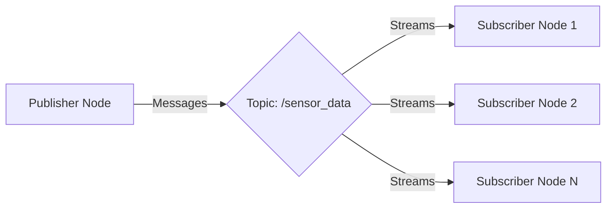

# Chapter 3: Nodes, Topics, Publishers & Subscribers


## Learning Objectives
By the end of this chapter, you will be able to:
- Create ROS 2 nodes with proper lifecycle management
- Implement publishers to broadcast messages
- Develop subscribers to receive and process messages
- Understand Quality of Service (QoS) settings
- Design efficient communication patterns

## Core Theory

### Node Lifecycle
ROS 2 nodes follow a specific lifecycle that includes:
- **Unconfigured**: Initial state after creation
- **Inactive**: Configured but not executing callbacks
- **Active**: Fully operational, executing callbacks
- **Finalized**: Ready for destruction

### Quality of Service (QoS) Settings
QoS settings define how messages are delivered:
- **Reliability**: Reliable vs. Best Effort delivery
- **Durability**: Volatile vs. Transient Local
- **History**: Keep Last vs. Keep All
- **Depth**: Size of message queue

### Topic Communication
The pub/sub pattern in ROS 2:
- Publishers send messages to topics without knowing subscribers
- Subscribers receive messages from topics without knowing publishers
- Topics decouple publishers and subscribers in time and space
- Multiple publishers and subscribers can exist for the same topic

### Bridging Python Agents to ROS Controllers
Modern robotic systems often require integration between high-level AI agents and low-level ROS controllers. This bridge enables:

#### Agent-Controller Communication Patterns
- **Request-Execute Pattern**: AI agents send high-level commands to ROS controllers
- **Feedback Integration**: Controllers provide execution status back to agents
- **State Synchronization**: Real-world robot state updates reflected in agent environment
- **Safety Validation**: Commands validated before execution in physical world

#### Implementation with rclpy
Using rclpy, Python agents can seamlessly interact with ROS 2 ecosystem:
- Direct node instantiation within agent processes
- Message publishing for commanding actuators
- Subscription to sensor topics for environmental awareness
- Service calls for synchronous operations and validation

#### Example Integration Architecture
```
AI Agent (Python) -> rclpy Node -> ROS 2 Network -> Hardware Controllers
       ^                                           |
       |                                           v
   State Updates <- rclpy Subscriptions <- Sensor Feedback
```

## Practical Examples

### Advanced Publisher with QoS
```python
import rclpy
from rclpy.node import Node
from std_msgs.msg import String
from rclpy.qos import QoSProfile, ReliabilityPolicy, DurabilityPolicy

class AdvancedPublisher(Node):
    def __init__(self):
        super().__init__('advanced_publisher')

        # Define custom QoS profile
        qos_profile = QoSProfile(
            depth=10,
            reliability=ReliabilityPolicy.BEST_EFFORT,
            durability=DurabilityPolicy.VOLATILE
        )

        self.publisher = self.create_publisher(
            String,
            'topic_with_qos',
            qos_profile
        )

        timer_period = 0.5
        self.timer = self.create_timer(timer_period, self.timer_callback)
        self.i = 0

    def timer_callback(self):
        msg = String()
        msg.data = f'Hello with QoS: {self.i}'
        self.publisher.publish(msg)
        self.get_logger().info(f'Publishing: "{msg.data}"')
        self.i += 1
```

### Subscriber with Custom Callback Group
```python
import rclpy
from rclpy.node import Node
from rclpy.callback_groups import MutuallyExclusiveCallbackGroup
from std_msgs.msg import String

class AdvancedSubscriber(Node):
    def __init__(self):
        super().__init__('advanced_subscriber')

        # Create a callback group
        cb_group = MutuallyExclusiveCallbackGroup()

        self.subscription = self.create_subscription(
            String,
            'topic_with_qos',
            self.listener_callback,
            10,
            callback_group=cb_group
        )
        self.subscription  # prevent unused variable warning

    def listener_callback(self, msg):
        self.get_logger().info(f'Received: "{msg.data}"')
```

## Diagrams

### Node-Topic-Node Communication


## Exercises

1. Implement a publisher that sends temperature sensor data with appropriate QoS settings
2. Create multiple subscribers that process the same topic differently (filtering, logging, etc.)
3. Experiment with different QoS profiles and observe their effects on communication
4. Design a node that both publishes and subscribes to different topics

## Quiz

1. What are the four main QoS settings in ROS 2?
2. Explain the difference between reliability policies in ROS 2.
3. What is the purpose of callback groups in ROS 2?

## References
- [ROS 2 QoS Examples](https://docs.ros.org/en/humble/Tutorials/Beginner-Client-Libraries/Quality-Of-Service.html)
- [ROS 2 Node Lifecycle](https://design.ros2.org/articles/node_lifecycle.html)
- [DDS QoS Policy Reference](https://community.rti.com/static/documentation/connext-dds/5.2.0/doc/manuals/connext_dds/html_files/RTI_ConnextDDS_CoreLibraries_UsersManual.pdf#%2F%2FArtech%2Fbookkeeper%2Ftemp%2FBookKeeperStorage%2F2147483710%2F1683491049%2Fsection.1.4.html)

## Summary

This chapter explored the core ROS 2 concepts of nodes, topics, publishers, and subscribers, which form the foundation of the publish/subscribe communication pattern. We learned about the node lifecycle with its states: unconfigured, inactive, active, and finalized, and how nodes can be written in different languages while communicating through ROS 2 topics.

We covered Quality of Service (QoS) settings which define how messages are delivered, including reliability (reliable vs. best effort), durability (volatile vs. transient local), history (keep last vs. keep all), and depth (message queue size). The chapter also examined how topics decouple publishers and subscribers in time and space, allowing for flexible communication patterns with multiple publishers and subscribers for the same topic.

The practical examples demonstrated creating advanced publishers with custom QoS profiles and subscribers with custom callback groups. We also explored how Python agents can be bridged to ROS controllers, which is essential for integrating high-level AI decision-making with low-level robot control systems. The chapter emphasized the importance of safe communication patterns and proper node management in robotic systems.