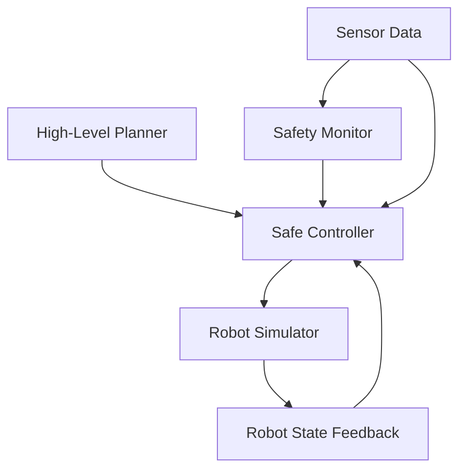

# Chapter 4: Controlling Robots with rclpy (Simulation-Safe)

## Summary
This chapter focuses on using rclpy to control robots safely in simulation environments, emphasizing best practices for safe robot control without affecting real hardware.

## Learning Objectives
By the end of this chapter, you will be able to:
- Use rclpy to create robot control nodes
- Implement safe control patterns for simulation
- Interface with robot simulators (Gazebo, Isaac Sim)
- Apply safety constraints and bounds checking
- Handle robot control errors gracefully

## Core Theory

### rclpy Framework
rclpy is the Python client library for ROS 2 that provides:
- Node creation and management
- Publisher/subscriber interfaces
- Service and action clients/servers
- Parameter management
- Logging and timing utilities

### Safe Simulation Control
When controlling robots in simulation:
- Always implement safety checks before sending commands
- Use velocity and position bounds to prevent extreme movements
- Implement graceful error handling for failed commands
- Design for simulation-first approach (no real hardware access)

### Robot Control Patterns
Common control patterns in robotics:
- **Position Control**: Direct joint position commands
- **Velocity Control**: Joint velocity commands
- **Effort Control**: Torque/force commands
- **Cartesian Control**: End-effector position and orientation

### Bridging Python Agents to ROS Controllers
Integrating high-level AI agents with ROS 2 controllers requires careful consideration of the interface between intelligent decision-making and low-level control:

#### Agent-Controller Interface Design
- **Command Translation**: Converting high-level agent actions to ROS 2 messages
- **State Representation**: Mapping robot state to agent observation space
- **Action Space Mapping**: Defining discrete/continuous action spaces for agents
- **Timing Coordination**: Managing execution timing between agent and controller

#### Safety-First Integration
- **Validation Layer**: All agent commands validated before ROS execution
- **Simulation-Safe Patterns**: Ensuring no real hardware commands during development
- **Emergency Protocols**: Agent-triggered safety stops and recovery procedures
- **Command Bounds**: Enforcing physical and safety limits on agent actions

#### Implementation Strategies
1. **Direct Integration**: AI agent runs as ROS 2 node using rclpy
2. **Bridge Node**: Dedicated node translates between agent and ROS ecosystem
3. **Service-Based**: Agent communicates via ROS services for synchronous operations
4. **Event-Driven**: Agent responds to ROS topics and publishes commands

#### Example: AI Agent Integration Pattern
```python
class AIAgentController(Node):
    def __init__(self):
        super().__init__('ai_agent_controller')

        # Agent-ROS interface
        self.observation_sub = self.create_subscription(
            RobotState, '/robot_state', self.state_callback, 10)
        self.action_pub = self.create_publisher(
            RobotCommand, '/robot_command', 10)

        # AI agent instance
        self.agent = MyAIAgent()

        # Safety validation layer
        self.safety_validator = SafetyValidator()

    def state_callback(self, msg):
        # Process robot state for agent
        observation = self.process_state_to_observation(msg)

        # Get action from AI agent
        raw_action = self.agent.get_action(observation)

        # Validate action safety
        if self.safety_validator.is_safe(raw_action):
            # Convert to ROS command
            command = self.convert_action_to_ros_command(raw_action)
            self.action_pub.publish(command)
```

## Practical Examples

### Safe Position Controller Node
```python
import rclpy
from rclpy.node import Node
from sensor_msgs.msg import JointState
from trajectory_msgs.msg import JointTrajectory, JointTrajectoryPoint
from builtin_interfaces.msg import Duration
import math

class SafePositionController(Node):
    def __init__(self):
        super().__init__('safe_position_controller')

        # Joint state subscriber
        self.joint_state_sub = self.create_subscription(
            JointState,
            '/joint_states',
            self.joint_state_callback,
            10
        )

        # Trajectory publisher for position control
        self.trajectory_pub = self.create_publisher(
            JointTrajectory,
            '/position_trajectory_controller/joint_trajectory',
            10
        )

        # Joint limits for safety
        self.joint_limits = {
            'joint1': (-math.pi, math.pi),
            'joint2': (-1.5, 1.5),
            'joint3': (-2.0, 2.0)
        }

        # Timer for control loop
        self.timer = self.create_timer(0.1, self.control_loop)

        self.current_positions = {}

    def joint_state_callback(self, msg):
        """Update current joint positions"""
        for i, name in enumerate(msg.name):
            if i < len(msg.position):
                self.current_positions[name] = msg.position[i]

    def safe_move_to_position(self, joint_names, target_positions, duration=2.0):
        """Safely move joints to target positions with bounds checking"""
        # Check bounds
        safe_targets = []
        for joint_name, target_pos in zip(joint_names, target_positions):
            if joint_name in self.joint_limits:
                min_pos, max_pos = self.joint_limits[joint_name]
                # Clamp to safe range
                clamped_pos = max(min_pos, min(max_pos, target_pos))
                safe_targets.append(clamped_pos)
            else:
                safe_targets.append(target_pos)

        # Create trajectory message
        traj_msg = JointTrajectory()
        traj_msg.joint_names = joint_names

        point = JointTrajectoryPoint()
        point.positions = safe_targets
        point.time_from_start = Duration(sec=int(duration), nanosec=0)

        traj_msg.points = [point]

        # Publish trajectory (only in simulation!)
        self.trajectory_pub.publish(traj_msg)
        self.get_logger().info(f'Moving to safe positions: {safe_targets}')

    def control_loop(self):
        """Main control loop with safety checks"""
        # Example: Move to home position if joints are in safe state
        if self.verify_safety_conditions():
            home_positions = [0.0, 0.0, 0.0]  # Safe home position
            self.safe_move_to_position(['joint1', 'joint2', 'joint3'], home_positions)

    def verify_safety_conditions(self):
        """Verify all safety conditions are met before movement"""
        # Check if current positions are within safe bounds
        for joint_name, pos in self.current_positions.items():
            if joint_name in self.joint_limits:
                min_pos, max_pos = self.joint_limits[joint_name]
                if pos < min_pos or pos > max_pos:
                    self.get_logger().warn(f'Joint {joint_name} out of safe bounds: {pos}')
                    return False

        return True
```

### Velocity Controller with Safety Limits
```python
import rclpy
from rclpy.node import Node
from geometry_msgs.msg import Twist
from sensor_msgs.msg import LaserScan
import numpy as np

class SafeVelocityController(Node):
    def __init__(self):
        super().__init__('safe_velocity_controller')

        # Velocity command publisher
        self.cmd_vel_pub = self.create_publisher(Twist, '/cmd_vel', 10)

        # Laser scan subscriber for obstacle detection
        self.scan_sub = self.create_subscription(
            LaserScan,
            '/scan',
            self.scan_callback,
            10
        )

        # Safety parameters
        self.max_linear_speed = 0.5  # m/s
        self.max_angular_speed = 0.5  # rad/s
        self.obstacle_threshold = 0.5  # meters

        self.obstacle_detected = False

    def scan_callback(self, msg):
        """Process laser scan data for obstacle detection"""
        # Check for obstacles in front of robot
        front_scan = msg.ranges[len(msg.ranges)//2 - 30:len(msg.ranges)//2 + 30]
        min_distance = min(front_scan) if front_scan else float('inf')

        self.obstacle_detected = min_distance < self.obstacle_threshold

    def safe_move(self, linear_x, angular_z):
        """Move with safety limits applied"""
        # Apply speed limits
        limited_linear = max(-self.max_linear_speed, min(self.max_linear_speed, linear_x))
        limited_angular = max(-self.max_angular_speed, min(self.max_angular_speed, angular_z))

        # Stop if obstacle detected
        if self.obstacle_detected:
            limited_linear = 0.0
            limited_angular = 0.0
            self.get_logger().warn('Obstacle detected! Stopping robot.')

        # Create and publish twist command
        twist_msg = Twist()
        twist_msg.linear.x = limited_linear
        twist_msg.angular.z = limited_angular

        self.cmd_vel_pub.publish(twist_msg)
```

## Diagrams

### Robot Control Architecture


## Exercises

1. Create a safe position controller for a simulated 6-DOF robotic arm
2. Implement velocity control with dynamic obstacle avoidance
3. Design a safety layer that monitors joint limits and velocities
4. Build a simulation-safe teleoperation interface

## Quiz

1. What are the three main types of robot control?
2. How do you implement safety bounds checking in rclpy?
3. What is the purpose of the trajectory controller in ROS 2?

## References
- [ROS 2 Control Documentation](https://control.ros.org/)
- [rclpy API Reference](https://docs.ros.org/en/humble/p/rclpy/)
- [ROS 2 Robot Control Tutorials](https://docs.ros.org/en/humble/Tutorials/Advanced/URDF/Using-URDF-with-Robot-State-Publisher.html)