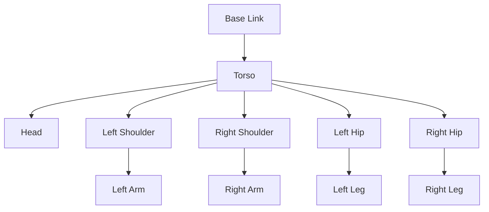

# Chapter 5: Building Humanoid URDFs


## Learning Objectives
By the end of this chapter, you will be able to:
- Create URDF files for humanoid robots
- Define kinematic chains and joint relationships
- Set up visual and collision properties
- Integrate URDF with ROS 2 simulation environments
- Validate URDF files for correctness

## Core Theory

### URDF Fundamentals
URDF (Unified Robot Description Format) is an XML-based format for representing robots in ROS. Key components include:
- **Links**: Rigid bodies that make up the robot
- **Joints**: Connections between links that allow relative motion
- **Visual**: Properties for visualization (color, shape, mesh)
- **Collision**: Properties for collision detection
- **Inertial**: Mass properties for physics simulation

### Humanoid Robot Structure
Humanoid robots typically include:
- **Torso**: Central body with main computers and batteries
- **Head**: Contains cameras, sensors, and processing units
- **Arms**: With shoulder, elbow, and wrist joints
- **Hands**: With finger joints for manipulation
- **Legs**: With hip, knee, and ankle joints
- **Feet**: For balance and ground contact

### Kinematic Chains
Kinematic chains define how robot parts are connected:
- **Serial Chain**: Links connected in a sequence (like an arm)
- **Tree Structure**: Links with multiple children (like a torso with arms and legs)
- **Closed Loop**: Links forming loops (less common in humanoid robots)

### URDF for Humanoids: Special Considerations
Humanoid robots present unique challenges in URDF design that differ from traditional robotic manipulators:

#### Bipedal Locomotion Requirements
- **Balance Constraints**: Center of mass calculations for stable walking
- **Foot Design**: Multi-contact points for ground interaction
- **Ankle Joints**: Additional degrees of freedom for balance
- **Zero Moment Point (ZMP)**: Considerations for stable gait patterns

#### Humanoid-Specific Joint Configurations
- **Degrees of Freedom**: Typically 20-30+ joints for human-like movement
- **Joint Limits**: Biologically-inspired ranges of motion
- **Redundancy**: Multiple solutions for reaching the same position
- **Symmetry**: Left/right mirrored joint configurations

#### Balance and Stability Features
- **IMU Integration**: Inertial measurement units in torso/feet
- **Force/Torque Sensors**: In joints for balance feedback
- **COM Tracking**: Center of mass visualization and calculation
- **Stability Margins**: Safety factors for dynamic movements

#### Humanoid-Specific Links and Joints
- **Head with 6DOF**: For vision and interaction systems
- **Complex Hands**: Multiple joints for manipulation tasks
- **Flexible Spine**: Additional joints for natural movement
- **Pelvis Joint**: Connection between upper body and legs

#### Example: Humanoid-Specific URDF Elements
```xml
<!-- Pelvis joint for upper body movement -->
<joint name="pelvis_joint" type="revolute">
  <parent link="torso"/>
  <child link="pelvis"/>
  <origin xyz="0 0 -0.1" rpy="0 0 0"/>
  <axis xyz="0 0 1"/>
  <limit lower="-0.2" upper="0.2" effort="50.0" velocity="1.0"/>
</joint>

<!-- Ankle joints for balance -->
<joint name="left_ankle_pitch" type="revolute">
  <parent link="left_lower_leg"/>
  <child link="left_foot"/>
  <origin xyz="0 0 -0.05" rpy="0 0 0"/>
  <axis xyz="0 1 0"/>
  <limit lower="-0.5" upper="0.5" effort="30.0" velocity="1.0"/>
</joint>

<joint name="left_ankle_roll" type="revolute">
  <parent link="left_foot"/>
  <child link="left_foot_tip"/>
  <origin xyz="0 0 -0.02" rpy="0 0 0"/>
  <axis xyz="1 0 0"/>
  <limit lower="-0.3" upper="0.3" effort="20.0" velocity="1.0"/>
</joint>

<!-- Multi-fingered hand -->
<joint name="left_thumb_joint" type="revolute">
  <parent link="left_wrist"/>
  <child link="left_thumb"/>
  <origin xyz="0.03 0.02 0" rpy="0 0 0.5"/>
  <axis xyz="0 0 1"/>
  <limit lower="0" upper="1.0" effort="5.0" velocity="2.0"/>
</joint>
```

## Practical Examples

### Basic Humanoid URDF
```xml
<?xml version="1.0"?>
<robot name="simple_humanoid">

  <!-- Materials -->
  <material name="blue">
    <color rgba="0.0 0.0 1.0 1.0"/>
  </material>
  <material name="white">
    <color rgba="1.0 1.0 1.0 1.0"/>
  </material>
  <material name="red">
    <color rgba="1.0 0.0 0.0 1.0"/>
  </material>

  <!-- Base Link -->
  <link name="base_link">
    <visual>
      <geometry>
        <box size="0.2 0.2 0.2"/>
      </geometry>
      <material name="white"/>
    </visual>
    <collision>
      <geometry>
        <box size="0.2 0.2 0.2"/>
      </geometry>
    </collision>
    <inertial>
      <mass value="1.0"/>
      <inertia ixx="0.01" ixy="0.0" ixz="0.0" iyy="0.01" iyz="0.0" izz="0.01"/>
    </inertial>
  </link>

  <!-- Torso -->
  <link name="torso">
    <visual>
      <geometry>
        <box size="0.15 0.1 0.3"/>
      </geometry>
      <material name="blue"/>
    </visual>
    <collision>
      <geometry>
        <box size="0.15 0.1 0.3"/>
      </geometry>
    </collision>
    <inertial>
      <mass value="2.0"/>
      <inertia ixx="0.02" ixy="0.0" ixz="0.0" iyy="0.03" iyz="0.0" izz="0.01"/>
    </inertial>
  </link>

  <joint name="torso_joint" type="fixed">
    <parent link="base_link"/>
    <child link="torso"/>
    <origin xyz="0 0 0.2" rpy="0 0 0"/>
  </joint>

  <!-- Head -->
  <link name="head">
    <visual>
      <geometry>
        <sphere radius="0.08"/>
      </geometry>
      <material name="white"/>
    </visual>
    <collision>
      <geometry>
        <sphere radius="0.08"/>
      </geometry>
    </collision>
    <inertial>
      <mass value="0.5"/>
      <inertia ixx="0.001" ixy="0.0" ixz="0.0" iyy="0.001" iyz="0.0" izz="0.001"/>
    </inertial>
  </link>

  <joint name="neck_joint" type="revolute">
    <parent link="torso"/>
    <child link="head"/>
    <origin xyz="0 0 0.2" rpy="0 0 0"/>
    <axis xyz="0 1 0"/>
    <limit lower="-0.5" upper="0.5" effort="10.0" velocity="1.0"/>
  </joint>

  <!-- Left Arm -->
  <link name="left_shoulder">
    <visual>
      <geometry>
        <box size="0.1 0.05 0.05"/>
      </geometry>
      <material name="red"/>
    </visual>
    <collision>
      <geometry>
        <box size="0.1 0.05 0.05"/>
      </geometry>
    </collision>
    <inertial>
      <mass value="0.3"/>
      <inertia ixx="0.0001" ixy="0.0" ixz="0.0" iyy="0.0002" iyz="0.0" izz="0.0002"/>
    </inertial>
  </link>

  <joint name="left_shoulder_joint" type="revolute">
    <parent link="torso"/>
    <child link="left_shoulder"/>
    <origin xyz="0.1 0.1 0.1" rpy="0 0 0"/>
    <axis xyz="0 1 0"/>
    <limit lower="-1.57" upper="1.57" effort="10.0" velocity="1.0"/>
  </joint>

  <!-- Right Arm (similar structure) -->
  <link name="right_shoulder">
    <visual>
      <geometry>
        <box size="0.1 0.05 0.05"/>
      </geometry>
      <material name="red"/>
    </visual>
    <collision>
      <geometry>
        <box size="0.1 0.05 0.05"/>
      </geometry>
    </collision>
    <inertial>
      <mass value="0.3"/>
      <inertia ixx="0.0001" ixy="0.0" ixz="0.0" iyy="0.0002" iyz="0.0" izz="0.0002"/>
    </inertial>
  </link>

  <joint name="right_shoulder_joint" type="revolute">
    <parent link="torso"/>
    <child link="right_shoulder"/>
    <origin xyz="0.1 -0.1 0.1" rpy="0 0 0"/>
    <axis xyz="0 1 0"/>
    <limit lower="-1.57" upper="1.57" effort="10.0" velocity="1.0"/>
  </joint>

</robot>
```

### URDF Validation Script
```python
#!/usr/bin/env python3
import xml.etree.ElementTree as ET
import sys
from collections import defaultdict

def validate_urdf(urdf_path):
    """Basic URDF validation script"""
    try:
        # Parse the URDF file
        tree = ET.parse(urdf_path)
        root = tree.getroot()

        if root.tag != 'robot':
            print(f"ERROR: Root element is not 'robot'")
            return False

        robot_name = root.attrib.get('name')
        if not robot_name:
            print(f"ERROR: Robot has no name attribute")
            return False

        print(f"Validating robot: {robot_name}")

        # Find all links and joints
        links = root.findall('.//link')
        joints = root.findall('.//joint')

        print(f"Found {len(links)} links and {len(joints)} joints")

        # Check for basic properties
        link_names = [link.attrib['name'] for link in links if 'name' in link.attrib]
        joint_parents = [joint.find('parent').attrib['link'] if joint.find('parent') is not None else None for joint in joints]
        joint_children = [joint.find('child').attrib['link'] if joint.find('child') is not None else None for joint in joints]

        # Validate that all joint parents and children exist as links
        for parent in joint_parents:
            if parent and parent not in link_names:
                print(f"ERROR: Joint parent '{parent}' is not defined as a link")
                return False

        for child in joint_children:
            if child and child not in link_names:
                print(f"ERROR: Joint child '{child}' is not defined as a link")
                return False

        # Check for basic properties in links
        for link in links:
            link_name = link.attrib.get('name')

            # Check for visual and collision elements
            visual = link.find('visual')
            collision = link.find('collision')
            inertial = link.find('inertial')

            if inertial is None:
                print(f"WARNING: Link '{link_name}' has no inertial properties")

        print("URDF validation completed successfully!")
        return True

    except ET.ParseError as e:
        print(f"ERROR: Invalid XML in URDF file: {e}")
        return False
    except FileNotFoundError:
        print(f"ERROR: URDF file not found: {urdf_path}")
        return False
    except Exception as e:
        print(f"ERROR: Validation failed: {e}")
        return False

if __name__ == '__main__':
    if len(sys.argv) != 2:
        print("Usage: python urdf_validator.py <urdf_file>")
        sys.exit(1)

    urdf_file = sys.argv[1]
    success = validate_urdf(urdf_file)
    sys.exit(0 if success else 1)
```

## Diagrams

### Humanoid Robot Structure


## Exercises

1. Create a complete URDF for a simple humanoid with 12+ joints
2. Add proper inertial properties to your URDF
3. Validate your URDF using the robot_state_publisher
4. Create a launch file to visualize your robot in RViz

## Quiz

1. What are the three required elements for a URDF link?
2. What is the difference between visual and collision elements?
3. What does the 'fixed' joint type mean in URDF?

## References
- [URDF Documentation](http://wiki.ros.org/urdf)
- [URDF Tutorials](http://wiki.ros.org/urdf/Tutorials)
- [Robot State Publisher](http://wiki.ros.org/robot_state_publisher)

## Summary

This chapter covered the creation of URDF (Unified Robot Description Format) files specifically for humanoid robots. We explored the fundamental components of URDF including links (rigid bodies that make up the robot), joints (connections between links that allow relative motion), visual properties (for visualization), collision properties (for collision detection), and inertial properties (for physics simulation).

The chapter emphasized the unique challenges of humanoid robot design, including bipedal locomotion requirements, balance constraints, and the need for complex joint configurations. We examined the typical structure of humanoid robots with components like torso, head, arms, hands, legs, and feet, and how kinematic chains define the connections between robot parts.

We discussed humanoid-specific considerations such as balance and stability features, degrees of freedom requirements (typically 20-30+ joints), joint limits based on biological ranges of motion, and the importance of symmetry in left/right joint configurations. The chapter included practical examples of creating basic humanoid URDF files with proper materials, visual and collision properties, and inertial parameters.

We also covered special humanoid features like pelvis joints for upper body movement, ankle joints for balance, complex hands with multiple joints for manipulation, and flexible spine joints for natural movement. The chapter included a URDF validation script to check for common errors and ensure proper structure. Finally, we explored how to integrate URDF files with ROS 2 simulation environments and validate them using robot_state_publisher and RViz.