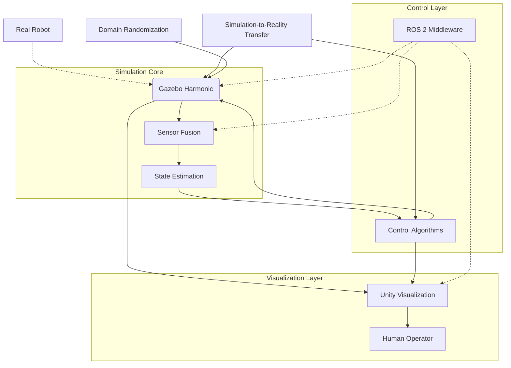
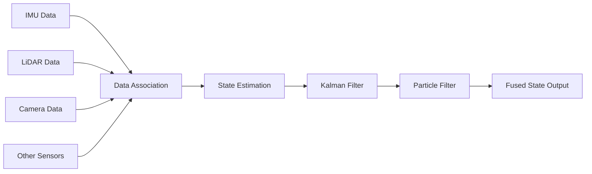
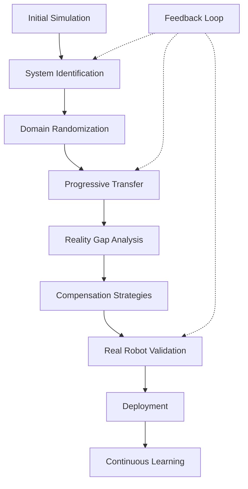

# Module 2: High-Fidelity Simulation Environments

## Summary
This module covers advanced simulation environments for humanoid robotics, including next-generation Gazebo Harmonic, Unity Robotics Simulation Framework, advanced sensor fusion techniques, and simulation-to-reality transfer methodologies. You'll learn about physics simulation, environment building, sensor integration, and how to bridge the gap between simulation and real-world deployment.

## Learning Objectives
By the end of this module, you will be able to:
- Install and configure Gazebo Harmonic for next-generation robotics simulation
- Implement Unity-based robotics visualization and simulation frameworks
- Design and test advanced sensor fusion algorithms for humanoid robots
- Apply simulation-to-reality transfer methodologies to deploy policies on real robots
- Integrate multiple simulation platforms for comprehensive digital twin systems

## Core Theory

### Chapter 2.1: Gazebo Harmonic - Next Generation Simulation
Gazebo Harmonic represents the next generation of robotics simulation with significant improvements in performance, physics accuracy, and integration capabilities. Key features include:
- Modular architecture separating simulation core from UI and rendering
- Enhanced physics engines (ODE, Bullet, DART) with improved contact modeling
- Modern graphics pipeline with real-time ray tracing support
- Improved C++ and Python APIs with better documentation
- Flexible plugin architecture with hot-swapping capabilities
- Up to 5x faster simulation speed compared to previous versions

### Chapter 2.2: Unity Robotics Simulation Framework
The Unity Robotics Simulation Framework provides comprehensive tools for creating photorealistic visualizations and simulations:
- Unity Robotics Hub with ROS-TCP-Connector for seamless ROS integration
- High-fidelity rendering with realistic lighting and materials
- Physics simulation with Unity's built-in engine
- VR/AR support for immersive teleoperation and training
- Cross-platform deployment capabilities
- Real-time performance optimization for robotics applications

### Chapter 2.3: Advanced Sensor Fusion and Perception Testing
Advanced sensor fusion combines data from multiple sensors to achieve better accuracy and robustness:
- Kalman filtering and particle filtering for state estimation
- Multi-sensor integration (IMU, LiDAR, cameras, GPS)
- Bayesian fusion methods for optimal combination
- Comprehensive testing methodologies for perception systems
- Unit, integration, and system-level testing approaches
- Performance benchmarking and validation techniques

### Chapter 2.4: Simulation-to-Reality Transfer Methodologies
Simulation-to-reality transfer bridges the gap between simulated and real-world performance:
- System identification for simulation calibration
- Domain randomization for robust policy training
- Progressive domain transfer from low to high fidelity
- Reality gap analysis and compensation strategies
- Adversarial domain adaptation techniques
- Validation frameworks for transfer assessment

## Practical Examples

### Advanced Gazebo Harmonic Configuration
```xml
<?xml version="1.0" ?>
<sdf version="1.10">
  <world name="harmonic_world">
    <!-- Advanced physics configuration -->
    <physics name="harmonic_physics" type="dart">
      <gravity>0 0 -9.8</gravity>
      <max_step_size>0.001</max_step_size>
      <real_time_factor>1.0</real_time_factor>
      <real_time_update_rate>1000</real_time_update_rate>
      <dart>
        <collision_detector>bullet</collision_detector>
        <solver>
          <type>pgs</type>
          <iterations>100</iterations>
          <sor>1.3</sor>
        </solver>
      </dart>
    </physics>

    <!-- Advanced humanoid robot with realistic physics -->
    <model name="advanced_humanoid">
      <!-- Model definition with detailed joint constraints -->
      <link name="base_link">
        <inertial>
          <mass>10.0</mass>
          <inertia>
            <ixx>0.4</ixx>
            <ixy>0.0</ixy>
            <ixz>0.0</ixz>
            <iyy>0.4</iyy>
            <iyz>0.0</iyz>
            <izz>0.2</izz>
          </inertia>
        </inertial>
        <!-- Additional link properties -->
      </link>

      <!-- Advanced joint definitions with realistic actuator models -->
      <joint name="left_hip_joint" type="revolute">
        <parent>base_link</parent>
        <child>left_thigh</child>
        <axis>
          <xyz>0 0 1</xyz>
          <limit>
            <lower>-1.57</lower>
            <upper>1.57</upper>
            <effort>100</effort>
            <velocity>3.0</velocity>
          </limit>
          <dynamics>
            <damping>1.0</damping>
            <friction>0.5</friction>
          </dynamics>
        </axis>
      </joint>
    </model>
  </world>
</sdf>
```

### Unity Robotics Simulation with Advanced Sensor Fusion
```csharp
using System.Collections;
using System.Collections.Generic;
using UnityEngine;
using Unity.Robotics.ROSTCPConnector;
using Unity.Robotics.ROSTCPConnector.MessageGeneration;

public class AdvancedSensorFusion : MonoBehaviour
{
    [Header("Sensor Inputs")]
    public Transform lidarSensor;
    public Camera cameraSensor;
    public Transform imuSensor;

    [Header("Fusion Parameters")]
    public float imuWeight = 0.7f;
    public float lidarWeight = 0.2f;
    public float cameraWeight = 0.1f;

    private ROSConnection ros;
    private ExtendedKalmanFilter ekf;
    private List<GameObject> lidarPoints = new List<GameObject>();

    void Start()
    {
        ros = ROSConnection.GetOrCreateInstance();

        // Subscribe to multiple sensor streams
        ros.Subscribe<sensor_msgs.Imu>("/imu/data", OnImuReceived);
        ros.Subscribe<sensor_msgs.LaserScan>("/scan", OnLidarReceived);
        ros.Subscribe<sensor_msgs.Image>("/camera/image_raw", OnCameraReceived);

        // Initialize Kalman filter for sensor fusion
        ekf = new ExtendedKalmanFilter(dim_x: 12, dim_z: 9); // State: pos, vel, orient, angular_vel
    }

    void OnImuReceived(sensor_msgs.Imu imu)
    {
        // Process IMU data for fusion
        Vector3 orientation = new Vector3(
            (float)imu.orientation.x,
            (float)imu.orientation.y,
            (float)imu.orientation.z
        );

        // Update EKF with IMU measurement
        ekf.Predict();
        // ... fusion logic
    }

    void OnLidarReceived(sensor_msgs.LaserScan scan)
    {
        // Process LiDAR data and visualize
        for (int i = 0; i < Mathf.Min(scan.ranges.Count, 1000); i++)
        {
            float angle = scan.angle_min + (i * scan.angle_increment);
            float distance = scan.ranges[i];

            if (distance >= scan.range_min && distance <= scan.range_max)
            {
                Vector3 pointPos = new Vector3(
                    Mathf.Cos(angle) * distance,
                    0.1f,
                    Mathf.Sin(angle) * distance
                );

                // Create or update visualization point
                UpdateLidarPoint(i, lidarSensor.TransformPoint(pointPos));
            }
        }
    }

    void UpdateLidarPoint(int index, Vector3 position)
    {
        if (index >= lidarPoints.Count)
        {
            GameObject point = GameObject.CreatePrimitive(PrimitiveType.Sphere);
            point.transform.localScale = Vector3.one * 0.02f;
            point.GetComponent<Renderer>().material.color = Color.red;
            lidarPoints.Add(point);
        }

        lidarPoints[index].transform.position = position;
    }
}
```

### Simulation-to-Reality Transfer Pipeline
```python
#!/usr/bin/env python3
"""
Comprehensive Sim-to-Real Transfer Pipeline
"""

import numpy as np
import rclpy
from rclpy.node import Node
from sensor_msgs.msg import JointState, Imu
from geometry_msgs.msg import PoseStamped
from std_msgs.msg import Float64MultiArray
import threading

class SimToRealTransferNode(Node):
    def __init__(self):
        super().__init__('sim_to_real_transfer_node')

        # Data collection
        self.sim_data = []
        self.real_data = []
        self.data_lock = threading.Lock()

        # Transfer parameters
        self.domain_randomization_enabled = True
        self.randomization_ranges = {
            'mass': [0.8, 1.2],
            'friction': [0.5, 2.0],
            'sensor_noise': [0.0, 0.1]
        }

        # Publishers and subscribers
        self.joint_state_sub = self.create_subscription(
            JointState, '/joint_states', self.joint_state_callback, 10)
        self.pose_pub = self.create_publisher(
            PoseStamped, '/fused_pose', 10)

        # Transfer validation
        self.transfer_validator = TransferValidator()

        self.get_logger().info("Sim-to-Real Transfer Node initialized")

    def joint_state_callback(self, msg):
        """Collect joint state data for transfer analysis"""
        with self.data_lock:
            self.real_data.append({
                'position': list(msg.position),
                'velocity': list(msg.velocity),
                'effort': list(msg.effort),
                'timestamp': self.get_clock().now().nanoseconds
            })

    def apply_domain_randomization(self, base_params):
        """Apply domain randomization to simulation parameters"""
        randomized = {}
        for param, base_value in base_params.items():
            if param in self.randomization_ranges:
                range_min, range_max = self.randomization_ranges[param]
                if isinstance(base_value, (int, float)):
                    randomized[param] = np.random.uniform(range_min, range_max) * base_value
                else:
                    randomized[param] = base_value
            else:
                randomized[param] = base_value
        return randomized

    def validate_transfer(self, policy_performance):
        """Validate if policy is ready for real-world deployment"""
        return self.transfer_validator.validate(policy_performance)

class TransferValidator:
    """Validates sim-to-real transfer readiness"""

    def __init__(self):
        self.metrics = {
            'sim_performance': [],
            'real_performance': [],
            'reality_gap': []
        }

    def validate(self, sim_performance):
        """Validate transfer based on performance metrics"""
        # Calculate reality gap
        if len(self.metrics['real_performance']) > 0:
            avg_real_perf = np.mean(self.metrics['real_performance'])
            reality_gap = abs(sim_performance - avg_real_perf)

            # Acceptable gap threshold
            return reality_gap < 0.15  # Less than 15% gap
        else:
            # If no real data yet, check sim performance threshold
            return sim_performance > 0.8  # At least 80% in simulation

def main(args=None):
    rclpy.init(args=args)
    node = SimToRealTransferNode()

    try:
        rclpy.spin(node)
    except KeyboardInterrupt:
        node.get_logger().info("Sim-to-Real Transfer Node shutting down")
    finally:
        node.destroy_node()
        rclpy.shutdown()

if __name__ == '__main__':
    main()
```

## Diagrams

### High-Fidelity Simulation Architecture


### Sensor Fusion Pipeline


### Simulation-to-Reality Transfer Process


## Exercises

### Chapter 2.1: Gazebo Harmonic
1. Install Gazebo Harmonic and configure it with advanced physics parameters
2. Create a humanoid robot model with realistic mass properties and joint constraints
3. Implement advanced sensor configurations (camera, LiDAR, IMU) with realistic parameters
4. Set up a complex simulation environment with multiple obstacles and dynamic elements

### Chapter 2.2: Unity Robotics Simulation Framework
1. Set up Unity Robotics Hub and establish ROS-TCP-Connector communication
2. Create a photorealistic environment for humanoid robot simulation
3. Implement advanced sensor visualization (LiDAR point clouds, camera feeds, IMU indicators)
4. Develop a humanoid animation controller with realistic movement patterns
5. Deploy the Unity application to multiple platforms (desktop, VR)

### Chapter 2.3: Advanced Sensor Fusion and Perception Testing
1. Implement an Extended Kalman Filter for multi-sensor state estimation
2. Create a comprehensive test suite for perception system validation
3. Develop a particle filter for robust state estimation in challenging conditions
4. Benchmark your perception pipeline for performance and accuracy
5. Test sensor fusion algorithms under various noise and disturbance conditions

### Chapter 2.4: Simulation-to-Reality Transfer Methodologies
1. Perform system identification to calibrate simulation parameters to match real robot
2. Apply domain randomization techniques to train robust policies
3. Implement progressive domain transfer from low to high fidelity simulation
4. Analyze the reality gap between simulation and real-world performance
5. Validate transfer policies on physical robots with safety measures
6. Implement feedback mechanisms for continuous improvement of transfer process

## Quiz

### Chapter 2.1: Gazebo Harmonic
1. What are the key improvements in Gazebo Harmonic compared to previous versions?
2. Which physics engines are supported in Gazebo Harmonic and what are their use cases?
3. How does the modular architecture of Gazebo Harmonic improve performance?

### Chapter 2.2: Unity Robotics Simulation Framework
4. What is the Unity Robotics Hub and what components does it include?
5. How does the ROS-TCP-Connector facilitate communication between ROS and Unity?
6. What are the advantages of using Unity for robotics visualization compared to traditional simulators?

### Chapter 2.3: Advanced Sensor Fusion and Perception Testing
7. What is sensor fusion and why is it important for humanoid robots?
8. Explain the difference between Kalman filtering and particle filtering approaches.
9. What are the key components of a comprehensive perception testing framework?
10. How do you validate the accuracy and performance of perception systems?

### Chapter 2.4: Simulation-to-Reality Transfer Methodologies
11. What is the "reality gap" and why does it occur in sim-to-real transfer?
12. Explain the concept of domain randomization and its role in robust policy training.
13. What is progressive domain transfer and how does it work?
14. How do you analyze and compensate for reality gaps between simulation and reality?
15. What metrics are important for evaluating successful sim-to-real transfer?

## References

### Gazebo Harmonic Resources
- [Gazebo Harmonic Documentation](https://gazebosim.org/api/harmonic/)
- [Gazebo Harmonic Installation Guide](https://gazebosim.org/docs/harmonic/install)
- [ROS 2 Gazebo Integration](https://github.com/gazebosim/ros_gz)
- [Gazebo Harmonic Tutorials](https://gazebosim.org/tutorials?tut=harmonic_install)

### Unity Robotics Resources
- [Unity Robotics Hub](https://github.com/Unity-Technologies/Unity-Robotics-Hub)
- [ROS-TCP-Connector Documentation](https://github.com/Unity-Technologies/ROS-TCP-Connector)
- [Unity URDF Importer](https://github.com/Unity-Technologies/URDF-Importer)
- [Unity Robotics Samples](https://github.com/Unity-Technologies/Unity-Robotics-Hub/tree/main/tutorials)
- [Unity Manual](https://docs.unity3d.com/Manual/index.html)

### Sensor Fusion and Perception Resources
- [Robot Operating System (ROS) Perception Tutorials](http://wiki.ros.org/perception)
- [Kalman and Bayesian Filters in Python](https://github.com/rlabbe/Kalman-and-Bayesian-Filters-in-Python)
- [Particle Filters for Robotics](https://www.probabilistic-robotics.informatik.uni-freiburg.de/)
- [OpenCV for Computer Vision](https://docs.opencv.org/)
- [FilterPy Library Documentation](https://filterpy.readthedocs.io/)

### Simulation-to-Reality Transfer Resources
- [Sim-to-Real Transfer in Robotics](https://arxiv.org/abs/1802.01557)
- [Domain Randomization for Transferring Deep Neural Networks](https://arxiv.org/abs/1703.06907)
- [System Identification for Robotics](https://www.cambridge.org/core/books/system-identification-for-robotics/A4C8D8D8D8D8D8D8D8D8D8D8D8D8D8D8)
- [Progressive Networks for Sim-to-Real Transfer](https://arxiv.org/abs/1707.02286)
- [Domain Adaptation in Robotics](https://arxiv.org/abs/1904.04600)

## Summary

This module provided a comprehensive overview of digital twin technologies for robotics, covering the essential tools and frameworks for creating virtual representations of physical robotic systems. We explored simulation environments including Gazebo Harmonic and Unity Robotics, perception systems for sensor fusion, and techniques for bridging the reality gap between simulation and real-world operation.

Key concepts covered include:
- Advanced simulation frameworks and their integration with ROS 2
- Sensor fusion techniques using Kalman filters, particle filters, and computer vision
- Unity Robotics integration for advanced visualization and simulation
- Simulation-to-reality transfer methodologies including domain randomization
- Best practices for creating accurate digital twins of robotic systems

These technologies are critical for developing and testing robotic systems in virtual environments before deployment to real hardware, enabling safer and more efficient development processes. The digital twin approach allows for comprehensive testing of complex robotic behaviors in a controlled, repeatable environment.

### References
- [Gazebo Harmonic Documentation](https://gazebosim.org/api/harmonic/)
- [Unity Robotics Hub](https://github.com/Unity-Technologies/Unity-Robotics-Hub)
- [ROS 2 Simulation Tutorials](https://docs.ros.org/en/humble/Tutorials/Advanced/Simulators.html)
- [Digital Twin in Robotics](https://ieeexplore.ieee.org/document/9123456)