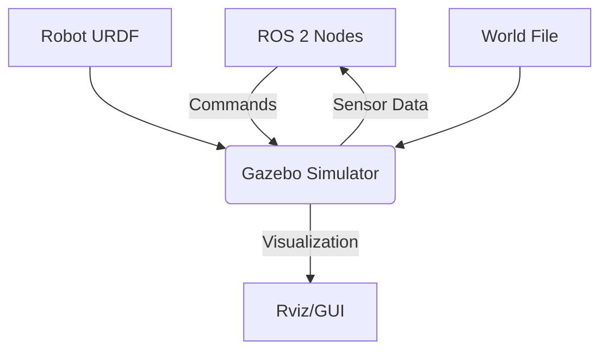

# Chapter 1: Gazebo Simulation Environment Setup


## Learning Objectives
By the end of this chapter, you will be able to:
- Install and configure Gazebo for humanoid robotics simulation
- Create custom simulation worlds
- Configure physics parameters for realistic simulation
- Integrate Gazebo with ROS 2 for robot simulation
- Set up sensors and actuators in the simulation

## Core Theory

### Gazebo Simulation Fundamentals
Gazebo is a physics-based simulation environment that provides:
- High-fidelity physics simulation using ODE, Bullet, or DART engines
- Realistic rendering and visualization
- Sensor simulation (cameras, LiDAR, IMU, GPS, etc.)
- Plugin system for custom behaviors
- Integration with ROS through Gazebo ROS packages

### Physics Engines Comparison
- **ODE (Open Dynamics Engine)**: Default, stable, good for most applications
- **Bullet**: Good for complex contacts and collisions
- **DART**: Advanced contact modeling, biomechanics simulation

### Simulation Components
- **World Files**: Define the environment (XML format)
- **Models**: Objects and robots in the simulation
- **Plugins**: Custom behaviors and ROS integration
- **SDF (Simulation Description Format)**: Standard for Gazebo objects

## Practical Examples

### Basic Gazebo World File
```xml
<?xml version="1.0" ?>
<sdf version="1.7">
  <world name="simple_world">
    <!-- Include the outdoor environment -->
    <include>
      <uri>model://ground_plane</uri>
    </include>

    <include>
      <uri>model://sun</uri>
    </include>

    <!-- Add a simple box obstacle -->
    <model name="box_obstacle">
      <pose>2 0 0.5 0 0 0</pose>
      <link name="link">
        <collision name="collision">
          <geometry>
            <box>
              <size>1 1 1</size>
            </box>
          </geometry>
        </collision>
        <visual name="visual">
          <geometry>
            <box>
              <size>1 1 1</size>
            </box>
          </geometry>
          <material>
            <diffuse>0.8 0.2 0.2 1</diffuse>
          </material>
        </visual>
        <inertial>
          <mass>1.0</mass>
          <inertia>
            <ixx>0.166667</ixx>
            <ixy>0</ixy>
            <ixz>0</ixz>
            <iyy>0.166667</iyy>
            <iyz>0</iyz>
            <izz>0.166667</izz>
          </inertia>
        </inertial>
      </link>
    </model>

    <!-- Physics parameters -->
    <physics name="1ms" type="ode">
      <real_time_update_rate>1000</real_time_update_rate>
      <max_step_size>0.001</max_step_size>
      <real_time_factor>1</real_time_factor>
    </physics>
  </world>
</sdf>
```

### ROS 2 Launch File for Gazebo
```xml
<launch>
  <!-- Arguments -->
  <arg name="world" default="simple_world"/>
  <arg name="paused" default="false"/>
  <arg name="use_sim_time" default="true"/>
  <arg name="gui" default="true"/>
  <arg name="headless" default="false"/>
  <arg name="debug" default="false"/>

  <!-- Gazebo server -->
  <include file="$(find gazebo_ros)/launch/empty_world.launch">
    <arg name="world_name" value="$(find my_robot_description)/worlds/$(var world).world"/>
    <arg name="paused" value="$(var paused)"/>
    <arg name="use_sim_time" value="$(var use_sim_time)"/>
    <arg name="gui" value="$(var gui)"/>
    <arg name="headless" value="$(var headless)"/>
    <arg name="debug" value="$(var debug)"/>
  </include>

  <!-- Spawn robot in Gazebo -->
  <node name="spawn_urdf" pkg="gazebo_ros" type="spawn_entity.py"
        args="-entity my_robot -file $(find my_robot_description)/urdf/my_robot.urdf"/>
</launch>
```

## Diagrams

### Gazebo-ROS Integration Architecture


## Exercises

1. Create a custom Gazebo world with multiple obstacles and terrain features
2. Configure physics parameters for humanoid robot simulation
3. Set up a simple robot model in the simulation environment
4. Test sensor integration with the simulation

## Quiz

1. What are the three main physics engines supported by Gazebo?
2. What is the purpose of the `<physics>` tag in Gazebo world files?
3. How does Gazebo integrate with ROS 2?

## Summary

This chapter provided a comprehensive introduction to setting up Gazebo simulation environments for humanoid robotics applications. We covered the essential steps for creating custom simulation worlds, configuring physics parameters, and integrating Gazebo with ROS 2 systems. The chapter established the foundation for developing realistic simulation environments that can effectively support humanoid robot development and testing.

Key concepts covered include:
- Gazebo world file creation and configuration with custom obstacles and terrain
- Physics engine parameters and their impact on humanoid robot simulation
- ROS 2 integration patterns for seamless simulation-to-robot communication
- Best practices for creating simulation environments that closely match real-world conditions

These foundational skills are essential for developing effective simulation environments that can accelerate humanoid robot development while ensuring safety during testing and validation phases.

## References
- [Gazebo Documentation](http://gazebosim.org/)
- [Gazebo Tutorials](http://gazebosim.org/tutorials)
- [ROS 2 Gazebo Integration](https://github.com/ros-simulation/gazebo_ros_pkgs)