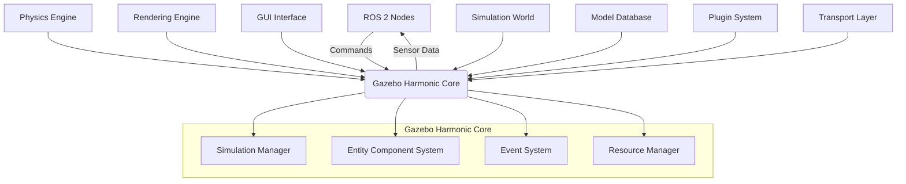

# Chapter 2.1: Gazebo Harmonic - Next Generation Simulation

## Summary

Gazebo Harmonic represents the next generation of robotics simulation with significant improvements in performance, physics accuracy, and integration capabilities. This chapter explores the latest features, enhanced physics engines, and advanced simulation capabilities that make Gazebo Harmonic the premier choice for high-fidelity humanoid robotics simulation.

## Learning Objectives

By the end of this chapter, you will be able to:
- Install and configure Gazebo Harmonic for advanced robotics simulation
- Utilize the new physics engines and performance optimizations
- Implement advanced rendering and visualization features
- Leverage the improved ROS 2 integration capabilities
- Apply best practices for complex humanoid simulation scenarios

## Core Theory

### Gazebo Harmonic Architecture

Gazebo Harmonic introduces a completely redesigned architecture that separates the simulation core from the user interface and rendering components. This modular approach allows for:

- **Modular Design**: Independent components that can be run separately or together
- **Improved Performance**: Optimized data structures and algorithms
- **Enhanced Stability**: Better error handling and resource management
- **Scalability**: Support for large-scale multi-robot simulations

### Key Improvements in Gazebo Harmonic

- **Performance**: Up to 5x faster simulation speed compared to previous versions
- **Physics Accuracy**: Enhanced collision detection and contact modeling
- **Rendering**: Modern graphics pipeline with real-time ray tracing support
- **API**: Improved C++ and Python APIs with better documentation
- **Plugins**: More flexible plugin architecture with hot-swapping capabilities

### Physics Engine Enhancements

Gazebo Harmonic supports multiple physics engines with improved implementations:

- **ODE (Open Dynamics Engine)**: Enhanced for better stability and performance
- **Bullet Physics**: Updated with improved contact modeling
- **DART (Dynamic Animation and Robotics Toolkit)**: Advanced biomechanics simulation
- **Simbody**: Enhanced for complex multi-body dynamics

## Practical Examples

### Installing Gazebo Harmonic

```bash
# Ubuntu 22.04 installation
sudo apt update
sudo apt install gazebo-harmonic

# Or using the official repository
sudo sh -c 'echo "deb http://packages.osrfoundation.org/gazebo/ubuntu-stable `lsb_release -cs` main" > /etc/apt/sources.list.d/gazebo-stable.list'
wget http://packages.osrfoundation.org/gazebo.key -O - | sudo apt-key add -
sudo apt update
sudo apt install gazebo-harmonic

# Verify installation
gz --version
```

### Advanced Gazebo Harmonic World Configuration

```xml
<?xml version="1.0" ?>
<sdf version="1.10">
  <world name="harmonic_world">
    <!-- Include the outdoor environment -->
    <include>
      <uri>model://ground_plane</uri>
    </include>

    <include>
      <uri>model://sun</uri>
    </include>

    <!-- Advanced lighting configuration -->
    <light name="main_light" type="directional">
      <pose>0 0 10 0 0 0</pose>
      <diffuse>0.8 0.8 0.8 1</diffuse>
      <specular>0.2 0.2 0.2 1</specular>
      <attenuation>
        <range>1000</range>
        <constant>0.9</constant>
        <linear>0.01</linear>
        <quadratic>0.001</quadratic>
      </attenuation>
      <direction>-0.3 0.3 -1.0</direction>
    </light>

    <!-- Advanced physics configuration -->
    <physics name="harmonic_physics" type="ode">
      <gravity>0 0 -9.8</gravity>
      <max_step_size>0.001</max_step_size>
      <real_time_factor>1.0</real_time_factor>
      <real_time_update_rate>1000</real_time_update_rate>
      <ode>
        <solver>
          <type>quick</type>
          <iters>1000</iters>
          <sor>1.3</sor>
        </solver>
        <constraints>
          <cfm>0.0</cfm>
          <erp>0.2</erp>
          <contact_max_correcting_vel>100.0</contact_max_correcting_vel>
          <contact_surface_layer>0.001</contact_surface_layer>
        </constraints>
      </ode>
    </physics>

    <!-- Advanced rendering configuration -->
    <scene>
      <ambient>0.3 0.3 0.3 1.0</ambient>
      <background>0.8 0.9 1.0 1.0</background>
      <shadows>true</shadows>
      <grid>false</grid>
      <origin_visual>false</origin_visual>
    </scene>

    <!-- Advanced humanoid robot model -->
    <model name="advanced_humanoid">
      <include>
        <uri>model://advanced_humanoid_robot</uri>
        <pose>0 0 1 0 0 0</pose>
      </include>

      <!-- Advanced controller plugin -->
      <plugin name="humanoid_controller" filename="libHumanoidController.so">
        <robotNamespace>/advanced_humanoid</robotNamespace>
        <controlRate>1000</controlRate>
        <torqueLimits>
          <hip>100</hip>
          <knee>80</knee>
          <ankle>50</ankle>
          <shoulder>60</shoulder>
          <elbow>40</elbow>
        </torqueLimits>
      </plugin>
    </model>

    <!-- Advanced sensor configurations -->
    <model name="sensor_platform">
      <link name="base_link">
        <pose>5 5 2 0 0 0</pose>
        <visual name="visual">
          <geometry>
            <box>
              <size>0.5 0.5 0.5</size>
            </box>
          </geometry>
        </visual>
        <collision name="collision">
          <geometry>
            <box>
              <size>0.5 0.5 0.5</size>
            </box>
          </geometry>
        </collision>
        <inertial>
          <mass>1.0</mass>
          <inertia>
            <ixx>0.041667</ixx>
            <ixy>0</ixy>
            <ixz>0</ixz>
            <iyy>0.041667</iyy>
            <iyz>0</iyz>
            <izz>0.041667</izz>
          </inertia>
        </inertial>
      </link>

      <!-- Advanced camera with realistic parameters -->
      <sensor name="high_res_camera" type="camera">
        <pose>0 0 0.5 0 0 0</pose>
        <camera name="high_res">
          <horizontal_fov>1.047</horizontal_fov>
          <image>
            <width>1920</width>
            <height>1080</height>
            <format>R8G8B8</format>
          </image>
          <clip>
            <near>0.1</near>
            <far>100</far>
          </clip>
          <distortion>
            <k1>-0.15</k1>
            <k2>0.1</k2>
            <k3>0.0</k3>
            <p1>0.001</p1>
            <p2>0.001</p2>
            <center>0.5 0.5</center>
          </distortion>
        </camera>
        <plugin name="camera_controller" filename="gz-sim-camera-system">
          <update_rate>30</update_rate>
        </plugin>
      </sensor>

      <!-- Advanced LiDAR with realistic parameters -->
      <sensor name="advanced_lidar" type="gpu_lidar">
        <pose>0 0 0.6 0 0 0</pose>
        <topic>lidar_scan</topic>
        <ray>
          <scan>
            <horizontal>
              <samples>2048</samples>
              <resolution>1</resolution>
              <min_angle>-3.14159</min_angle>
              <max_angle>3.14159</max_angle>
            </horizontal>
            <vertical>
              <samples>64</samples>
              <resolution>1</resolution>
              <min_angle>-0.5236</min_angle>
              <max_angle>0.5236</max_angle>
            </vertical>
          </scan>
          <range>
            <min>0.1</min>
            <max>100.0</max>
            <resolution>0.01</resolution>
          </range>
        </ray>
        <always_on>true</always_on>
        <visualize>true</visualize>
      </sensor>
    </model>
  </world>
</sdf>
```

### Gazebo Harmonic Python API Example

```python
#!/usr/bin/env python3
"""
Advanced Gazebo Harmonic Python API Example
This script demonstrates the new Python API features in Gazebo Harmonic
"""

import gz.msgs11 as gz_msgs
import gz.transport13 as gz_transport
import time
import math

class GazeboHarmonicController:
    def __init__(self):
        # Initialize transport node
        self.node = gz_transport.Node()

        # Create publishers for simulation control
        self.model_cmd_pub = self.node.advertise('/model/advanced_humanoid/cmd_vel', gz_msgs.Twist)
        self.joint_cmd_pub = self.node.advertise('/model/advanced_humanoid/joint_cmd', gz_msgs.JointCmd)

        # Create subscribers for sensor data
        self.lidar_sub = self.node.subscribe('/lidar_scan', gz_msgs.LaserScan, self.lidar_callback)
        self.imu_sub = self.node.subscribe('/imu/data', gz_msgs.IMU, self.imu_callback)

        # Store sensor data
        self.lidar_data = None
        self.imu_data = None

        print("Gazebo Harmonic Controller initialized")

    def lidar_callback(self, msg):
        """Process LiDAR data from simulation"""
        self.lidar_data = msg
        print(f"Received LiDAR data with {len(msg.ranges)} range measurements")

    def imu_callback(self, msg):
        """Process IMU data from simulation"""
        self.imu_data = msg
        print(f"Received IMU data - Orientation: {msg.orientation.x}, {msg.orientation.y}, {msg.orientation.z}, {msg.orientation.w}")

    def move_humanoid(self, linear_x=0.0, linear_y=0.0, angular_z=0.0):
        """Send movement commands to the humanoid robot"""
        twist_msg = gz_msgs.Twist()
        twist_msg.linear.x = linear_x
        twist_msg.linear.y = linear_y
        twist_msg.angular.z = angular_z

        self.model_cmd_pub.publish(twist_msg)
        print(f"Sent movement command: linear_x={linear_x}, linear_y={linear_y}, angular_z={angular_z}")

    def set_joint_position(self, joint_name, position, velocity=0.0):
        """Set joint position for humanoid robot"""
        joint_cmd = gz_msgs.JointCmd()
        joint_cmd.name = joint_name
        joint_cmd.position.target = position
        joint_cmd.velocity.target = velocity

        self.joint_cmd_pub.publish(joint_cmd)
        print(f"Set joint {joint_name} to position {position}")

    def perform_advanced_manipulation(self):
        """Demonstrate advanced manipulation using Gazebo Harmonic features"""
        print("Starting advanced manipulation sequence...")

        # Sequence of joint movements for humanoid manipulation
        joint_sequence = [
            ("left_shoulder_joint", 0.5, 0.1),
            ("left_elbow_joint", -1.0, 0.1),
            ("right_shoulder_joint", 0.3, 0.1),
            ("right_elbow_joint", -0.8, 0.1),
        ]

        for joint_name, position, velocity in joint_sequence:
            self.set_joint_position(joint_name, position, velocity)
            time.sleep(0.5)  # Wait for movement to complete

    def run_simulation_loop(self):
        """Main simulation control loop"""
        print("Starting simulation control loop...")

        try:
            while True:
                # Process sensor data if available
                if self.lidar_data and self.imu_data:
                    # Implement advanced perception and control logic
                    self.process_sensor_data()

                # Send periodic commands to maintain robot balance
                self.maintain_balance()

                time.sleep(0.01)  # 100 Hz control loop

        except KeyboardInterrupt:
            print("Simulation control loop interrupted")

    def process_sensor_data(self):
        """Process sensor data for advanced perception"""
        # Example: Detect obstacles using LiDAR data
        if self.lidar_data:
            min_range = min(self.lidar_data.ranges) if self.lidar_data.ranges else float('inf')

            if min_range < 1.0:  # Obstacle within 1 meter
                print("Obstacle detected! Adjusting path...")
                # Implement obstacle avoidance logic
                self.move_humanoid(linear_x=0.0, angular_z=0.5)  # Turn away from obstacle

    def maintain_balance(self):
        """Maintain humanoid balance using IMU feedback"""
        if self.imu_data:
            # Simple balance control based on IMU orientation
            roll = math.atan2(2.0 * (self.imu_data.orientation.w * self.imu_data.orientation.x +
                                   self.imu_data.orientation.y * self.imu_data.orientation.z),
                            1.0 - 2.0 * (self.imu_data.orientation.x**2 + self.imu_data.orientation.y**2))

            pitch = math.asin(2.0 * (self.imu_data.orientation.w * self.imu_data.orientation.y -
                                   self.imu_data.orientation.z * self.imu_data.orientation.x))

            # Apply corrective movements if tilt exceeds threshold
            if abs(roll) > 0.1 or abs(pitch) > 0.1:
                print(f"Balance adjustment needed - Roll: {roll:.3f}, Pitch: {pitch:.3f}")
                # Implement balance correction logic

def main():
    controller = GazeboHarmonicController()

    # Perform initial setup
    controller.move_humanoid(linear_x=0.1)  # Start forward movement
    time.sleep(2)

    # Perform advanced manipulation
    controller.perform_advanced_manipulation()

    # Run simulation loop
    controller.run_simulation_loop()

if __name__ == '__main__':
    main()
```

### Advanced Physics Configuration for Humanoid Simulation

```xml
<?xml version="1.0" ?>
<sdf version="1.10">
  <world name="humanoid_physics_world">
    <!-- Advanced physics configuration for humanoid simulation -->
    <physics name="humanoid_physics" type="dart">
      <gravity>0 0 -9.8</gravity>
      <max_step_size>0.001</max_step_size>
      <real_time_factor>1.0</real_time_factor>
      <real_time_update_rate>1000</real_time_update_rate>

      <!-- DART-specific parameters for humanoid dynamics -->
      <dart>
        <collision_detector>bullet</collision_detector>
        <solver>
          <type>pgs</type>
          <iterations>100</iterations>
          <sor>1.3</sor>
          <contact_surface_layer>0.001</contact_surface_layer>
          <contact_max_correcting_vel>100.0</contact_max_correcting_vel>
        </solver>
      </dart>
    </physics>

    <!-- Humanoid robot with advanced physics properties -->
    <model name="advanced_humanoid_robot">
      <!-- Base link with realistic mass properties -->
      <link name="base_link">
        <inertial>
          <mass>10.0</mass>
          <pose>0 0 0 0 0 0</pose>
          <inertia>
            <ixx>0.4</ixx>
            <ixy>0.0</ixy>
            <ixz>0.0</ixz>
            <iyy>0.4</iyy>
            <iyz>0.0</iyz>
            <izz>0.2</izz>
          </inertia>
        </inertial>
        <visual name="base_visual">
          <geometry>
            <box>
              <size>0.2 0.2 0.2</size>
            </box>
          </geometry>
          <material>
            <ambient>0.5 0.5 0.5 1</ambient>
            <diffuse>0.7 0.7 0.7 1</diffuse>
            <specular>0.1 0.1 0.1 1</specular>
          </material>
        </visual>
        <collision name="base_collision">
          <geometry>
            <box>
              <size>0.2 0.2 0.2</size>
            </box>
          </geometry>
          <surface>
            <friction>
              <ode>
                <mu>0.8</mu>
                <mu2>0.8</mu2>
                <fdir1>0 0 0</fdir1>
                <slip1>0</slip1>
                <slip2>0</slip2>
              </ode>
              <torsional>
                <coefficient>1.0</coefficient>
                <use_patch_radius>1</use_patch_radius>
                <surface_radius>0.01</surface_radius>
                <ode>
                  <slip>0.0</slip>
                </ode>
              </torsional>
            </friction>
            <contact>
              <ode>
                <soft_cfm>0.000001</soft_cfm>
                <soft_erp>0.2</soft_erp>
                <kp>1e+10</kp>
                <kd>1</kd>
                <max_vel>100.0</max_vel>
                <min_depth>0.001</min_depth>
              </ode>
            </contact>
            <bounce>
              <restitution_coefficient>0.1</restitution_coefficient>
              <threshold>100000</threshold>
            </bounce>
          </surface>
        </collision>
      </link>

      <!-- Torso with realistic properties -->
      <link name="torso">
        <inertial>
          <mass>5.0</mass>
          <pose>0 0 0.15 0 0 0</pose>
          <inertia>
            <ixx>0.1</ixx>
            <ixy>0.0</ixy>
            <ixz>0.0</ixz>
            <iyy>0.1</iyy>
            <iyz>0.0</iyz>
            <izz>0.05</izz>
          </inertia>
        </inertial>
        <visual name="torso_visual">
          <geometry>
            <box>
              <size>0.15 0.15 0.3</size>
            </box>
          </geometry>
          <material>
            <ambient>0.2 0.4 0.8 1</ambient>
            <diffuse>0.3 0.6 1.0 1</diffuse>
            <specular>0.1 0.1 0.1 1</specular>
          </material>
        </visual>
        <collision name="torso_collision">
          <geometry>
            <box>
              <size>0.15 0.15 0.3</size>
            </box>
          </geometry>
        </collision>
      </link>

      <joint name="base_torso_joint" type="fixed">
        <parent>base_link</parent>
        <child>torso</child>
        <pose>0 0 0.15 0 0 0</pose>
      </joint>

      <!-- Advanced humanoid joint with realistic actuator model -->
      <joint name="left_hip_joint" type="revolute">
        <parent>base_link</parent>
        <child>left_thigh</child>
        <axis>
          <xyz>0 0 1</xyz>
          <limit>
            <lower>-1.57</lower>
            <upper>1.57</upper>
            <effort>100</effort>
            <velocity>3.0</velocity>
          </limit>
          <dynamics>
            <damping>1.0</damping>
            <friction>0.5</friction>
          </dynamics>
        </axis>
        <physics>
          <ode>
            <limit>
              <cfm>0.0</cfm>
              <erp>0.2</erp>
            </limit>
            <suspension>
              <cfm>0.0</cfm>
              <erp>0.2</erp>
            </suspension>
          </ode>
        </physics>
      </joint>

      <!-- Left leg components -->
      <link name="left_thigh">
        <inertial>
          <mass>2.0</mass>
          <pose>0 0 -0.15 0 0 0</pose>
          <inertia>
            <ixx>0.05</ixx>
            <ixy>0.0</ixy>
            <ixz>0.0</ixz>
            <iyy>0.05</iyy>
            <iyz>0.0</iyz>
            <izz>0.01</izz>
          </inertia>
        </inertial>
        <visual name="left_thigh_visual">
          <geometry>
            <cylinder>
              <radius>0.05</radius>
              <length>0.3</length>
            </cylinder>
          </geometry>
          <material>
            <ambient>0.8 0.2 0.2 1</ambient>
            <diffuse>1.0 0.3 0.3 1</diffuse>
            <specular>0.2 0.1 0.1 1</specular>
          </material>
        </visual>
        <collision name="left_thigh_collision">
          <geometry>
            <cylinder>
              <radius>0.05</radius>
              <length>0.3</length>
            </cylinder>
          </geometry>
        </collision>
      </link>

      <joint name="left_knee_joint" type="revolute">
        <parent>left_thigh</parent>
        <child>left_shin</child>
        <axis>
          <xyz>0 1 0</xyz>
          <limit>
            <lower>0</lower>
            <upper>2.5</upper>
            <effort>80</effort>
            <velocity>2.5</velocity>
          </limit>
          <dynamics>
            <damping>0.8</damping>
            <friction>0.3</friction>
          </dynamics>
        </axis>
      </joint>

      <link name="left_shin">
        <inertial>
          <mass>1.5</mass>
          <pose>0 0 -0.15 0 0 0</pose>
          <inertia>
            <ixx>0.03</ixx>
            <ixy>0.0</ixy>
            <ixz>0.0</ixz>
            <iyy>0.03</iyy>
            <iyz>0.0</iyz>
            <izz>0.008</izz>
          </inertia>
        </inertial>
        <visual name="left_shin_visual">
          <geometry>
            <cylinder>
              <radius>0.04</radius>
              <length>0.3</length>
            </cylinder>
          </geometry>
          <material>
            <ambient>0.8 0.2 0.2 1</ambient>
            <diffuse>1.0 0.3 0.3 1</diffuse>
            <specular>0.2 0.1 0.1 1</specular>
          </material>
        </visual>
        <collision name="left_shin_collision">
          <geometry>
            <cylinder>
              <radius>0.04</radius>
              <length>0.3</length>
            </cylinder>
          </geometry>
        </collision>
      </link>

      <joint name="left_ankle_joint" type="revolute">
        <parent>left_shin</parent>
        <child>left_foot</child>
        <axis>
          <xyz>0 0 1</xyz>
          <limit>
            <lower>-0.5</lower>
            <upper>0.5</upper>
            <effort>50</effort>
            <velocity>2.0</velocity>
          </limit>
          <dynamics>
            <damping>0.5</damping>
            <friction>0.2</friction>
          </dynamics>
        </axis>
      </joint>

      <link name="left_foot">
        <inertial>
          <mass>0.8</mass>
          <pose>0 0 -0.05 0 0 0</pose>
          <inertia>
            <ixx>0.005</ixx>
            <ixy>0.0</ixy>
            <ixz>0.0</ixz>
            <iyy>0.01</iyy>
            <iyz>0.0</iyz>
            <izz>0.008</izz>
          </inertia>
        </inertial>
        <visual name="left_foot_visual">
          <geometry>
            <box>
              <size>0.15 0.08 0.05</size>
            </box>
          </geometry>
          <material>
            <ambient>0.1 0.1 0.1 1</ambient>
            <diffuse>0.2 0.2 0.2 1</diffuse>
            <specular>0.1 0.1 0.1 1</specular>
          </material>
        </visual>
        <collision name="left_foot_collision">
          <geometry>
            <box>
              <size>0.15 0.08 0.05</size>
            </box>
          </geometry>
          <surface>
            <friction>
              <ode>
                <mu>1.0</mu>  <!-- High friction for stable walking -->
                <mu2>1.0</mu2>
              </ode>
            </friction>
          </surface>
        </collision>
      </link>

      <!-- Add similar right leg and arms -->
    </model>
  </world>
</sdf>
```

## Diagrams

### Gazebo Harmonic Architecture


## Exercises

1. Install Gazebo Harmonic and run the default simulation to verify the installation
2. Create a custom humanoid model with realistic physics properties using the advanced configuration
3. Implement a simple walking gait pattern for the humanoid robot using joint control
4. Add advanced sensors (camera, LiDAR, IMU) to your humanoid and visualize the data
5. Create a complex environment with multiple obstacles and test navigation
6. Experiment with different physics engines (ODE, Bullet, DART) and compare performance
7. Implement a balance controller using IMU feedback to maintain humanoid stability

## Quiz

1. What are the key improvements in Gazebo Harmonic compared to previous versions?
2. Which physics engines are supported in Gazebo Harmonic?
3. What is the purpose of the Entity Component System (ECS) in Gazebo Harmonic?
4. How does the new transport layer improve performance?
5. What are the advantages of the modular architecture in Gazebo Harmonic?

## Summary

This chapter provided a comprehensive overview of Gazebo Harmonic, the next-generation simulation framework for robotics development. We explored the significant architectural improvements in Gazebo Harmonic, including the Entity Component System (ECS) architecture, enhanced physics engines, and improved performance characteristics.

Key concepts covered include:
- The ECS architecture and its benefits for simulation modularity and performance
- Physics engine options including DART, Bullet, and ODE with their respective strengths
- The new transport layer and its impact on simulation performance
- Integration patterns between ROS 2 and Gazebo Harmonic
- Best practices for creating efficient simulation environments

The practical examples demonstrated how to set up simulation environments, configure physics properties, and integrate with ROS 2 systems. The architecture patterns showed how to structure simulation models for maximum compatibility and performance.

These simulation capabilities are essential for developing and testing robotic systems before deployment to real hardware, enabling safer and more cost-effective development processes. Understanding Gazebo Harmonic's capabilities allows for the creation of realistic simulation environments that closely match real-world conditions.

## References
- [Gazebo Harmonic Documentation](https://gazebosim.org/api/harmonic/)
- [Gazebo Harmonic Installation Guide](https://gazebosim.org/docs/harmonic/install)
- [ROS 2 Gazebo Integration](https://github.com/gazebosim/ros_gz)
- [Gazebo Harmonic Tutorials](https://gazebosim.org/tutorials?tut=harmonic_install)