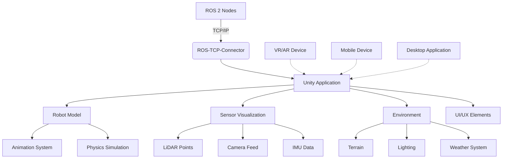

# Chapter 2.2: Unity Robotics Simulation Framework

## Summary

The Unity Robotics Simulation Framework provides a comprehensive platform for creating high-fidelity visualizations and simulations for robotics applications. This chapter explores the Unity Robotics Hub, ROS-TCP-Connector, and advanced simulation capabilities that enable photorealistic rendering and immersive experiences for humanoid robotics.

## Learning Objectives

By the end of this chapter, you will be able to:
- Set up and configure the Unity Robotics Simulation Framework
- Integrate Unity with ROS 2 using the ROS-TCP-Connector
- Create photorealistic environments for robotics simulation
- Implement advanced sensor visualization in Unity
- Deploy Unity robotics applications for various platforms

## Core Theory

### Unity Robotics Hub

The Unity Robotics Hub is a comprehensive package that provides essential tools and utilities for robotics development in Unity:

- **ROS-TCP-Connector**: A generic TCP-based connector for ROS communication
- **Robotics Library**: Utilities for robotics-specific tasks
- **Samples**: Pre-built examples for common robotics scenarios
- **Documentation**: Best practices and integration guides
- **Tools**: Visualization and debugging utilities

### ROS-TCP-Connector Architecture

The ROS-TCP-Connector provides a bridge between ROS and Unity through TCP/IP communication:

- **Message Serialization**: Converts ROS messages to/from Unity-compatible formats
- **Topic Management**: Handles ROS topic subscription and publishing
- **Service Calls**: Supports ROS service requests and responses
- **Action Management**: Handles long-running tasks with feedback
- **Connection Management**: Manages TCP connections and reconnection logic

### Unity Simulation Capabilities

Unity provides advanced simulation features that complement traditional robotics simulators:

- **Photorealistic Rendering**: High-quality graphics with realistic lighting and materials
- **Physics Simulation**: Built-in physics engine with realistic collision detection
- **VR/AR Support**: Immersive experiences for teleoperation and training
- **Cross-Platform Deployment**: Desktop, mobile, VR, and web deployment options
- **Real-time Performance**: Optimized for real-time applications

## Practical Examples

### Setting Up Unity Robotics Simulation Framework

First, install the Unity Robotics Simulation Framework:

1. Download and install Unity Hub
2. Install Unity 2021.3 LTS or later
3. Create a new 3D project
4. Add the Unity Robotics packages via the Package Manager

```json
// Add to Packages/manifest.json for package management
{
  "dependencies": {
    "com.unity.robotics.ros-tcp-connector": "https://github.com/Unity-Technologies/ROS-TCP-Connector.git?path=/com.unity.robotics.ros-tcp-connector#main",
    "com.unity.robotics.urdf-importer": "https://github.com/Unity-Technologies/URDF-Importer.git?path=/com.unity.robotics.urdf-importer#main",
    "com.unity.robotics.robot-toolkit": "https://github.com/Unity-Technologies/Robot-Toolchain.git?path=/com.unity.robotics.robot-toolkit#main"
  }
}
```

### Unity ROS-TCP-Connector Implementation

```csharp
using System.Collections;
using System.Collections.Generic;
using UnityEngine;
using Unity.Robotics.ROSTCPConnector;
using Unity.Robotics.ROSTCPConnector.MessageGeneration;
using UnityEngine.UI;

public class UnityRobotController : MonoBehaviour
{
    [Header("ROS Connection Settings")]
    public string rosIPAddress = "127.0.0.1";
    public int rosPort = 10000;

    [Header("Robot Control")]
    public Transform robotBase;
    public Transform[] jointTransforms;
    public string[] jointNames;

    [Header("Sensors")]
    public Camera sensorCamera;
    public Transform lidarTransform;

    private ROSConnection ros;
    private bool isConnected = false;

    // Publishers and subscribers
    private string jointStateTopic = "/unity_joint_states";
    private string poseTopic = "/unity_robot_pose";
    private string cameraTopic = "/unity_camera/image_raw";

    void Start()
    {
        // Initialize ROS connection
        ros = ROSConnection.GetOrCreateInstance();
        ros.OnConnected += OnConnected;
        ros.OnDisconnected += OnDisconnected;

        // Connect to ROS
        ros.Connect(rosIPAddress, rosPort);

        // Start publishers
        ros.RegisterPublisher<sensor_msgs.JointState>(jointStateTopic);
        ros.RegisterPublisher<geometry_msgs.PoseStamped>(poseTopic);

        // Start subscribers
        ros.Subscribe<sensor_msgs.JointState>("/joint_states", OnJointStateReceived);
        ros.Subscribe<geometry_msgs.Twist>("/cmd_vel", OnVelocityCommandReceived);
        ros.Subscribe<sensor_msgs.LaserScan>("/scan", OnLidarDataReceived);

        Debug.Log("Unity Robot Controller initialized");
    }

    void OnConnected(ROSConnection connection)
    {
        isConnected = true;
        Debug.Log("Connected to ROS master");
    }

    void OnDisconnected(ROSConnection connection)
    {
        isConnected = false;
        Debug.Log("Disconnected from ROS master");
    }

    void Update()
    {
        // Send robot state to ROS periodically
        if (isConnected && Time.time % 0.1f < Time.deltaTime) // Every 100ms
        {
            PublishRobotState();
        }

        // Send camera data periodically
        if (isConnected && Time.time % 0.033f < Time.deltaTime) // Every 30fps
        {
            SendCameraImage();
        }
    }

    void PublishRobotState()
    {
        // Create and publish joint state message
        var jointState = new sensor_msgs.JointState();
        jointState.name = new List<string>();
        jointState.position = new List<double>();
        jointState.velocity = new List<double>();
        jointState.effort = new List<double>();

        for (int i = 0; i < jointTransforms.Length; i++)
        {
            jointState.name.Add(jointNames[i]);
            jointState.position.Add(jointTransforms[i].localEulerAngles.y * Mathf.Deg2Rad);
            jointState.velocity.Add(0.0); // Placeholder
            jointState.effort.Add(0.0); // Placeholder
        }

        jointState.header = new std_msgs.Header();
        jointState.header.stamp = new builtin_interfaces.Time();
        jointState.header.frame_id = "base_link";

        ros.Publish(jointStateTopic, jointState);

        // Publish robot pose
        var poseStamped = new geometry_msgs.PoseStamped();
        poseStamped.header = new std_msgs.Header();
        poseStamped.header.stamp = new builtin_interfaces.Time();
        poseStamped.header.frame_id = "map";

        poseStamped.pose = new geometry_msgs.Pose();
        poseStamped.pose.position = new geometry_msgs.Vector3();
        poseStamped.pose.position.x = robotBase.position.x;
        poseStamped.pose.position.y = robotBase.position.z; // Unity Y is up
        poseStamped.pose.position.z = robotBase.position.y;

        poseStamped.pose.orientation = new geometry_msgs.Quaternion();
        poseStamped.pose.orientation.x = robotBase.rotation.x;
        poseStamped.pose.orientation.y = robotBase.rotation.z;
        poseStamped.pose.orientation.z = robotBase.rotation.y;
        poseStamped.pose.orientation.w = robotBase.rotation.w;

        ros.Publish(poseTopic, poseStamped);
    }

    void OnJointStateReceived(sensor_msgs.JointState jointState)
    {
        // Update robot joints based on received joint states
        for (int i = 0; i < jointState.name.Count; i++)
        {
            string jointName = jointState.name[i];
            double jointPosition = jointState.position[i];

            // Find corresponding joint in Unity model
            for (int j = 0; j < jointNames.Length; j++)
            {
                if (jointNames[j] == jointName)
                {
                    jointTransforms[j].localRotation = Quaternion.Euler(0, jointPosition * Mathf.Rad2Deg, 0);
                    break;
                }
            }
        }
    }

    void OnVelocityCommandReceived(geometry_msgs.Twist cmd)
    {
        // Move robot based on velocity commands
        Vector3 movement = new Vector3((float)cmd.linear.x, 0, (float)cmd.linear.y);
        robotBase.Translate(movement * Time.deltaTime);

        // Apply rotation
        robotBase.Rotate(0, (float)cmd.angular.z * Mathf.Rad2Deg * Time.deltaTime, 0);
    }

    void OnLidarDataReceived(sensor_msgs.LaserScan scan)
    {
        // Process LiDAR data for visualization
        // This could be used to update point clouds or visual indicators
        Debug.Log($"Received LiDAR data with {scan.ranges.Count} points");
    }

    void SendCameraImage()
    {
        // Capture camera image and send to ROS
        // This is a simplified example - in practice, you'd capture the actual camera output
        if (sensorCamera != null)
        {
            // In a real implementation, you would capture the camera image
            // and convert it to the appropriate ROS image format
        }
    }

    void OnDestroy()
    {
        if (ros != null)
        {
            ros.OnConnected -= OnConnected;
            ros.OnDisconnected -= OnDisconnected;
        }
    }
}
```

### Advanced Sensor Visualization in Unity

```csharp
using System.Collections;
using System.Collections.Generic;
using UnityEngine;
using Unity.Robotics.ROSTCPConnector;
using Unity.Robotics.ROSTCPConnector.MessageGeneration;

public class SensorVisualizer : MonoBehaviour
{
    [Header("LiDAR Visualization")]
    public GameObject lidarPointPrefab;
    public Material lidarPointMaterial;
    public int maxLidarPoints = 1000;
    private List<GameObject> lidarPoints = new List<GameObject>();

    [Header("Camera Feed")]
    public RawImage cameraFeedDisplay;
    public Material cameraMaterial;

    [Header("IMU Visualization")]
    public GameObject imuIndicator;
    public Material imuMaterial;

    [Header("GPS Visualization")]
    public GameObject gpsIndicator;
    public Material gpsMaterial;

    private ROSConnection ros;
    private string lidarTopic = "/scan";
    private string cameraTopic = "/camera/image_raw";
    private string imuTopic = "/imu/data";
    private string gpsTopic = "/gps/fix";

    void Start()
    {
        ros = ROSConnection.GetOrCreateInstance();
        ros.Subscribe<sensor_msgs.LaserScan>(lidarTopic, OnLidarDataReceived);
        ros.Subscribe<sensor_msgs.Image>(cameraTopic, OnCameraDataReceived);
        ros.Subscribe<sensor_msgs.Imu>(imuTopic, OnImuDataReceived);
        ros.Subscribe<sensor_msgs.NavSatFix>(gpsTopic, OnGpsDataReceived);

        InitializeLidarPoints();
    }

    void InitializeLidarPoints()
    {
        // Pre-create lidar point objects for performance
        for (int i = 0; i < maxLidarPoints; i++)
        {
            GameObject point = Instantiate(lidarPointPrefab);
            point.SetActive(false);
            point.GetComponent<Renderer>().material = lidarPointMaterial;
            lidarPoints.Add(point);
        }
    }

    void OnLidarDataReceived(sensor_msgs.LaserScan scan)
    {
        // Visualize LiDAR data as points in Unity
        for (int i = 0; i < Mathf.Min(scan.ranges.Count, maxLidarPoints); i++)
        {
            float angle = scan.angle_min + (i * scan.angle_increment);
            float distance = scan.ranges[i];

            if (distance >= scan.range_min && distance <= scan.range_max)
            {
                GameObject point = lidarPoints[i];
                point.SetActive(true);

                Vector3 position = new Vector3(
                    Mathf.Cos(angle) * distance,
                    0.1f, // Slightly above ground
                    Mathf.Sin(angle) * distance
                );

                // Position relative to lidar sensor
                Transform lidarSensor = transform; // Assuming lidar is at this transform
                point.transform.position = lidarSensor.TransformPoint(position);

                // Color based on distance
                float colorIntensity = Mathf.InverseLerp(scan.range_min, scan.range_max, distance);
                point.GetComponent<Renderer>().material.color = new Color(colorIntensity, 1 - colorIntensity, 0);
            }
            else
            {
                lidarPoints[i].SetActive(false);
            }
        }

        // Hide remaining points
        for (int i = scan.ranges.Count; i < maxLidarPoints; i++)
        {
            lidarPoints[i].SetActive(false);
        }
    }

    void OnCameraDataReceived(sensor_msgs.Image image)
    {
        // Convert ROS image data to Unity texture
        if (cameraFeedDisplay != null)
        {
            Texture2D texture = new Texture2D(image.width, image.height, TextureFormat.RGB24, false);

            // Convert ROS image data to Unity texture format
            Color32[] colors = new Color32[image.data.Count / 3];
            for (int i = 0; i < image.data.Count; i += 3)
            {
                int pixelIndex = i / 3;
                if (pixelIndex < colors.Length)
                {
                    colors[pixelIndex] = new Color32(
                        image.data[i],     // R
                        image.data[i + 1], // G
                        image.data[i + 2], // B
                        255                // A
                    );
                }
            }

            texture.SetPixels32(colors);
            texture.Apply();

            // Apply to UI element
            cameraFeedDisplay.texture = texture;
        }
    }

    void OnImuDataReceived(sensor_msgs.Imu imu)
    {
        // Visualize IMU orientation
        if (imuIndicator != null)
        {
            Quaternion orientation = new Quaternion(
                (float)imu.orientation.x,
                (float)imu.orientation.z,
                (float)imu.orientation.y,
                (float)imu.orientation.w
            );

            // Convert ROS coordinate system to Unity
            imuIndicator.transform.rotation = orientation;
        }

        // Visualize angular velocity as rotation speed
        Vector3 angularVelocity = new Vector3(
            (float)imu.angular_velocity.x,
            (float)imu.angular_velocity.z,
            (float)imu.angular_velocity.y
        );

        // Update visual indicator based on angular velocity
        if (imuIndicator != null)
        {
            imuIndicator.transform.Rotate(angularVelocity * Time.deltaTime * 100f);
        }
    }

    void OnGpsDataReceived(sensor_msgs.NavSatFix gps)
    {
        // Visualize GPS position
        if (gpsIndicator != null)
        {
            // Convert GPS coordinates to Unity world position
            // This is a simplified conversion - in practice, you'd need proper coordinate transformation
            Vector3 gpsPosition = new Vector3(
                (float)(gps.longitude * 1000), // Simplified conversion
                0.5f, // Height above ground
                (float)(gps.latitude * 1000)
            );

            gpsIndicator.transform.position = gpsPosition;

            // Color based on GPS accuracy
            float accuracy = (float)gps.position_covariance[0]; // Simplified
            gpsIndicator.GetComponent<Renderer>().material.color = Color.Lerp(Color.red, Color.green, 1.0f / (1.0f + accuracy));
        }
    }

    void Update()
    {
        // Additional real-time visualization updates can go here
    }
}
```

### Unity Humanoid Animation and Control System

```csharp
using System.Collections;
using System.Collections.Generic;
using UnityEngine;
using Unity.Robotics.ROSTCPConnector;
using Unity.Robotics.ROSTCPConnector.MessageGeneration;
using UnityEngine.Animations;

public class HumanoidAnimationController : MonoBehaviour
{
    [Header("Humanoid Model Setup")]
    public Animator animator;
    public HumanoidJointController[] humanoidJoints;

    [Header("Walking Parameters")]
    public float walkSpeed = 1.0f;
    public float turnSpeed = 90.0f;
    public float stepHeight = 0.1f;

    [Header("Balance Control")]
    public Transform centerOfMass;
    public float balanceThreshold = 0.1f;
    public float balanceCorrectionStrength = 1.0f;

    private ROSConnection ros;
    private string walkCommandTopic = "/unity_walk_command";
    private string balanceTopic = "/unity_balance_data";

    private Vector3 targetVelocity = Vector3.zero;
    private Vector3 currentVelocity = Vector3.zero;
    private bool isWalking = false;

    void Start()
    {
        ros = ROSConnection.GetOrCreateInstance();
        ros.Subscribe<geometry_msgs.Twist>("/cmd_vel", OnVelocityCommand);
        ros.Subscribe<sensor_msgs.JointState>("/joint_states", OnJointStateCommand);

        // Set center of mass if not assigned
        if (centerOfMass == null)
        {
            centerOfMass = new GameObject("CenterOfMass").transform;
            centerOfMass.SetParent(transform);
            centerOfMass.localPosition = Vector3.zero;
        }

        // Initialize animator
        if (animator == null)
        {
            animator = GetComponent<Animator>();
        }

        Debug.Log("Humanoid Animation Controller initialized");
    }

    void Update()
    {
        // Apply target velocity with smoothing
        currentVelocity = Vector3.Lerp(currentVelocity, targetVelocity, Time.deltaTime * 5f);

        // Apply movement to humanoid
        transform.Translate(currentVelocity * Time.deltaTime, Space.World);

        // Update balance control
        UpdateBalanceControl();

        // Publish balance data
        if (Time.time % 0.1f < Time.deltaTime)
        {
            PublishBalanceData();
        }
    }

    void OnVelocityCommand(geometry_msgs.Twist cmd)
    {
        // Convert ROS velocity command to Unity movement
        Vector3 linearVelocity = new Vector3((float)cmd.linear.x, 0, (float)cmd.linear.y);
        float angularVelocity = (float)cmd.angular.z;

        // Apply movement in Unity world space
        targetVelocity = transform.TransformDirection(linearVelocity);
        transform.Rotate(0, angularVelocity * Mathf.Rad2Deg * Time.deltaTime, 0);

        // Update walking state
        isWalking = targetVelocity.magnitude > 0.1f || Mathf.Abs(angularVelocity) > 0.1f;

        // Set animator parameters
        if (animator != null)
        {
            animator.SetFloat("Speed", targetVelocity.magnitude);
            animator.SetFloat("Direction", angularVelocity);
            animator.SetBool("IsWalking", isWalking);
        }
    }

    void OnJointStateCommand(sensor_msgs.JointState jointState)
    {
        // Update humanoid joints from ROS joint states
        for (int i = 0; i < jointState.name.Count; i++)
        {
            string jointName = jointState.name[i];
            double jointPosition = jointState.position[i];

            // Find and update the corresponding joint
            foreach (HumanoidJointController joint in humanoidJoints)
            {
                if (joint.jointName == jointName)
                {
                    joint.SetTargetPosition(jointPosition);
                    break;
                }
            }
        }
    }

    void UpdateBalanceControl()
    {
        if (animator == null) return;

        // Get current center of mass position
        Vector3 comPosition = centerOfMass.position;

        // Calculate balance error
        Vector3 balanceError = comPosition - transform.position;
        balanceError.y = 0; // Ignore vertical component

        // Apply balance correction if error exceeds threshold
        if (balanceError.magnitude > balanceThreshold)
        {
            Vector3 correction = -balanceError.normalized * balanceCorrectionStrength * Time.deltaTime;

            // Apply correction through animation layer or direct transform manipulation
            // This is a simplified example - real implementation would use inverse kinematics
            transform.Translate(correction, Space.World);
        }

        // Update animator with balance parameters
        if (animator != null)
        {
            animator.SetFloat("BalanceError", balanceError.magnitude);
            animator.SetFloat("BalanceCorrection", balanceError.magnitude > balanceThreshold ? 1.0f : 0.0f);
        }
    }

    void PublishBalanceData()
    {
        // Create and publish balance data message
        var balanceMsg = new std_msgs.Float32MultiArray();
        balanceMsg.data = new List<float>();

        // Add balance parameters to message
        balanceMsg.data.Add(animator.GetFloat("BalanceError"));
        balanceMsg.data.Add(animator.GetFloat("Speed"));
        balanceMsg.data.Add(animator.GetBool("IsWalking") ? 1.0f : 0.0f);

        ros.Publish(balanceTopic, balanceMsg);
    }

    // Custom joint controller class
    [System.Serializable]
    public class HumanoidJointController
    {
        public string jointName;
        public Transform jointTransform;
        public float maxAngle = 90f;
        public float minAngle = -90f;
        public float interpolationSpeed = 5f;

        private float currentTargetAngle = 0f;

        public void SetTargetPosition(double positionRadians)
        {
            float targetAngle = (float)(positionRadians * Mathf.Rad2Deg);
            currentTargetAngle = Mathf.Clamp(targetAngle, minAngle, maxAngle);
        }

        public void UpdateJoint()
        {
            if (jointTransform != null)
            {
                float currentAngle = jointTransform.localEulerAngles.y;
                float newAngle = Mathf.LerpAngle(currentAngle, currentTargetAngle, Time.deltaTime * interpolationSpeed);

                jointTransform.localEulerAngles = new Vector3(
                    jointTransform.localEulerAngles.x,
                    newAngle,
                    jointTransform.localEulerAngles.z
                );
            }
        }
    }

    void FixedUpdate()
    {
        // Update all joint controllers
        foreach (HumanoidJointController joint in humanoidJoints)
        {
            joint.UpdateJoint();
        }
    }
}
```

### Advanced Unity Environment Setup

```csharp
using System.Collections;
using System.Collections.Generic;
using UnityEngine;
using UnityEngine.Rendering;
using UnityEngine.Experimental.Rendering;

public class AdvancedEnvironmentController : MonoBehaviour
{
    [Header("Lighting Setup")]
    public Light mainLight;
    public Light[] additionalLights;
    public bool useRealisticLighting = true;

    [Header("Weather System")]
    public bool enableWeather = true;
    public float timeOfDay = 12f; // 0-24 hours
    public float dayNightCycleSpeed = 0.1f;
    public Gradient dayNightLightColor;
    public AnimationCurve dayNightIntensity;

    [Header("Terrain System")]
    public Terrain terrain;
    public float terrainDetailDistance = 80f;
    public int terrainResolution = 1024;

    [Header("Physics Environment")]
    public PhysicMaterial defaultMaterial;
    public PhysicMaterial highFrictionMaterial;
    public PhysicMaterial lowFrictionMaterial;

    [Header("Post-Processing")]
    public bool enablePostProcessing = true;
    public Volume postProcessingVolume;

    void Start()
    {
        InitializeEnvironment();
    }

    void InitializeEnvironment()
    {
        // Setup lighting
        if (mainLight != null)
        {
            mainLight.type = LightType.Directional;
            mainLight.shadows = LightShadows.Soft;
            mainLight.shadowResolution = ShadowResolution.High;
            mainLight.shadowBias = 0.05f;
            mainLight.shadowNormalBias = 0.4f;
        }

        // Setup terrain if available
        if (terrain != null)
        {
            terrain.detailObjectDistance = terrainDetailDistance;
            terrain.heightmapPixelError = 5;
            terrain.basemapDistance = 1000;
        }

        // Setup realistic materials
        SetupRealisticMaterials();

        // Initialize weather system
        if (enableWeather)
        {
            StartCoroutine(WeatherSystem());
        }
    }

    void SetupRealisticMaterials()
    {
        // Create and configure realistic materials for robotics simulation
        if (defaultMaterial == null)
        {
            defaultMaterial = new PhysicMaterial("Default");
            defaultMaterial.staticFriction = 0.5f;
            defaultMaterial.dynamicFriction = 0.4f;
            defaultMaterial.bounciness = 0.1f;
            defaultMaterial.frictionCombine = PhysicMaterialCombine.Average;
            defaultMaterial.bounceCombine = PhysicMaterialCombine.Average;
        }

        if (highFrictionMaterial == null)
        {
            highFrictionMaterial = new PhysicMaterial("HighFriction");
            highFrictionMaterial.staticFriction = 0.9f;
            highFrictionMaterial.dynamicFriction = 0.8f;
            highFrictionMaterial.bounciness = 0.05f;
        }

        if (lowFrictionMaterial == null)
        {
            lowFrictionMaterial = new PhysicMaterial("LowFriction");
            lowFrictionMaterial.staticFriction = 0.1f;
            lowFrictionMaterial.dynamicFriction = 0.05f;
            lowFrictionMaterial.bounciness = 0.2f;
        }
    }

    IEnumerator WeatherSystem()
    {
        while (enableWeather)
        {
            // Update time of day
            timeOfDay += dayNightCycleSpeed * Time.deltaTime;
            if (timeOfDay >= 24f) timeOfDay = 0f;

            // Update lighting based on time of day
            if (mainLight != null)
            {
                // Calculate sun position based on time
                float sunAngle = (timeOfDay / 24f) * 360f - 90f; // -90 to start at sunrise
                mainLight.transform.rotation = Quaternion.Euler(sunAngle, 0, 0);

                // Adjust light color and intensity based on time
                float normalizedTime = timeOfDay / 24f;
                mainLight.color = dayNightLightColor.Evaluate(normalizedTime);
                mainLight.intensity = dayNightIntensity.Evaluate(normalizedTime);
            }

            yield return new WaitForSeconds(0.1f);
        }
    }

    void Update()
    {
        // Dynamic environment updates
        UpdateEnvironmentEffects();
    }

    void UpdateEnvironmentEffects()
    {
        // Update environment based on simulation needs
        // This could include dynamic obstacles, changing lighting, etc.
    }

    // Method to add realistic obstacles to the environment
    public GameObject AddObstacle(Vector3 position, Vector3 size, PhysicMaterial material = null)
    {
        GameObject obstacle = GameObject.CreatePrimitive(PrimitiveType.Cube);
        obstacle.transform.position = position;
        obstacle.transform.localScale = size;
        obstacle.GetComponent<Renderer>().material.color = Random.ColorHSV(0.4f, 0.6f, 0.5f, 1f, 0.5f, 1f);

        if (material != null)
        {
            obstacle.GetComponent<Collider>().material = material;
        }

        return obstacle;
    }

    // Method to create realistic floor surfaces
    public void CreateRealisticFloor(Vector3 position, Vector3 size, PhysicMaterial material = null)
    {
        GameObject floor = GameObject.CreatePrimitive(PrimitiveType.Plane);
        floor.transform.position = position;
        floor.transform.localScale = new Vector3(size.x / 10f, 1f, size.z / 10f); // Plane is 10x10 units by default
        floor.GetComponent<Renderer>().material.color = Color.gray;

        if (material != null)
        {
            floor.GetComponent<Collider>().material = material;
        }
    }
}
```

## Diagrams

### Unity Robotics Simulation Framework Architecture


## Exercises

1. Set up a Unity project with the Robotics Simulation Framework
2. Create a humanoid robot model and import it into Unity
3. Implement ROS-TCP-Connector communication for joint control
4. Add realistic sensor visualization (LiDAR points, camera feed)
5. Create an advanced environment with realistic lighting and physics
6. Implement a complete walking animation system for the humanoid
7. Deploy the Unity application to different platforms (desktop, VR)
8. Test the simulation with real ROS 2 nodes

## Quiz

1. What are the main components of the Unity Robotics Simulation Framework?
2. How does the ROS-TCP-Connector facilitate communication between ROS and Unity?
3. What are the advantages of using Unity for robotics visualization compared to traditional simulators?
4. How can you implement realistic physics in Unity for robotics simulation?
5. What are the key considerations for deploying Unity robotics applications?

## References
- [Unity Robotics Hub](https://github.com/Unity-Technologies/Unity-Robotics-Hub)
- [ROS-TCP-Connector Documentation](https://github.com/Unity-Technologies/ROS-TCP-Connector)
- [Unity URDF Importer](https://github.com/Unity-Technologies/URDF-Importer)
- [Unity Robotics Samples](https://github.com/Unity-Technologies/Unity-Robotics-Hub/tree/main/tutorials)
- [Unity Manual](https://docs.unity3d.com/Manual/index.html)