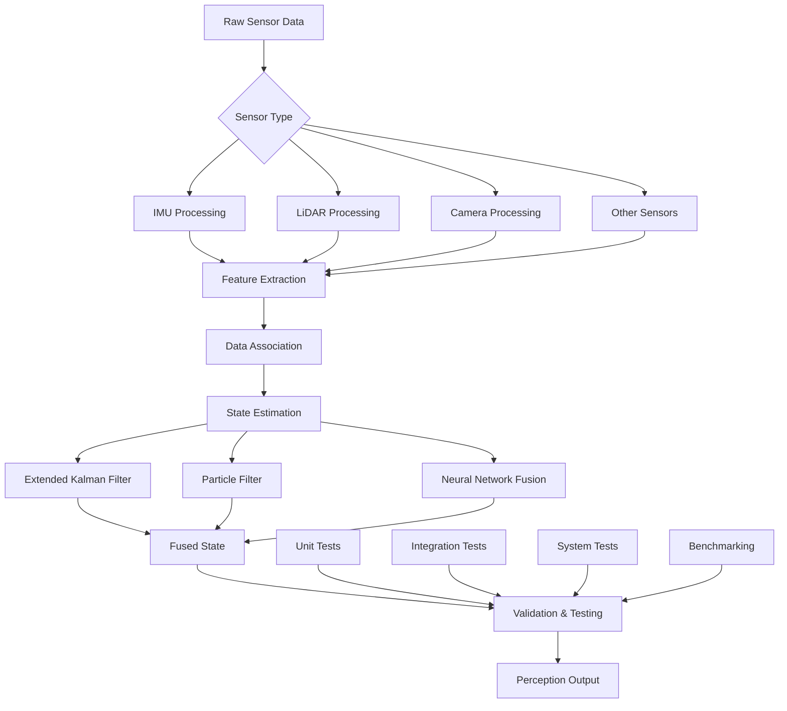

# Chapter 2.3: Advanced Sensor Fusion and Perception Testing


## Learning Objectives

By the end of this chapter, you will be able to:
- Implement advanced sensor fusion algorithms for humanoid robots
- Design and test perception systems using multiple sensor modalities
- Apply Kalman filtering and particle filtering for state estimation
- Create comprehensive test suites for perception systems
- Evaluate perception performance in simulation and real-world scenarios

## Core Theory

### Sensor Fusion Fundamentals

Sensor fusion is the process of combining data from multiple sensors to achieve better accuracy, reliability, and robustness than could be achieved by any individual sensor alone. For humanoid robots, sensor fusion is critical for:

- **Localization**: Combining IMU, GPS, and visual data for accurate positioning
- **Mapping**: Integrating LiDAR, camera, and depth sensor data for environment modeling
- **State Estimation**: Fusing multiple sensor readings to estimate robot pose and velocity
- **Object Detection**: Combining different sensor modalities for improved detection accuracy

### Sensor Fusion Approaches

1. **Early Fusion**: Combines raw sensor data before processing
2. **Late Fusion**: Processes individual sensor data separately, then combines results
3. **Deep Fusion**: Uses neural networks to learn optimal fusion strategies
4. **Bayesian Fusion**: Uses probabilistic methods for optimal combination

### Perception Testing Methodologies

Comprehensive perception testing involves:
- **Unit Testing**: Testing individual sensor processing components
- **Integration Testing**: Testing sensor fusion algorithms
- **System Testing**: Testing complete perception pipeline
- **Regression Testing**: Ensuring perception quality over time
- **Edge Case Testing**: Testing challenging scenarios

## Practical Examples

### Advanced Sensor Fusion Node in ROS 2

```python
#!/usr/bin/env python3
"""
Advanced Sensor Fusion Node for Humanoid Robots
This node implements multiple sensor fusion algorithms for state estimation
"""

import rclpy
from rclpy.node import Node
from sensor_msgs.msg import Imu, LaserScan, PointCloud2, Image
from nav_msgs.msg import Odometry
from geometry_msgs.msg import PoseWithCovarianceStamped, TwistWithCovarianceStamped
from std_msgs.msg import Float64MultiArray
from tf2_ros import TransformBroadcaster
import numpy as np
import math
from scipy.spatial.transform import Rotation as R
from filterpy.kalman import ExtendedKalmanFilter
from filterpy.common import Q_discrete_white_noise
import cv2
from cv_bridge import CvBridge
import threading
import time

class SensorFusionNode(Node):
    def __init__(self):
        super().__init__('sensor_fusion_node')

        # Initialize sensor data storage
        self.imu_data = None
        self.lidar_data = None
        self.camera_data = None
        self.odom_data = None

        # Initialize filters
        self.ekf_filter = self.initialize_ekf()
        self.particle_filter = ParticleFilter(1000)

        # Initialize ROS interfaces
        self.bridge = CvBridge()
        self.tf_broadcaster = TransformBroadcaster(self)

        # Publishers
        self.fused_pose_pub = self.create_publisher(PoseWithCovarianceStamped, '/fused_pose', 10)
        self.fused_twist_pub = self.create_publisher(TwistWithCovarianceStamped, '/fused_twist', 10)
        self.sensor_status_pub = self.create_publisher(Float64MultiArray, '/sensor_fusion_status', 10)

        # Subscribers
        self.imu_sub = self.create_subscription(Imu, '/imu/data', self.imu_callback, 10)
        self.lidar_sub = self.create_subscription(LaserScan, '/scan', self.lidar_callback, 10)
        self.camera_sub = self.create_subscription(Image, '/camera/image_raw', self.camera_callback, 10)
        self.odom_sub = self.create_subscription(Odometry, '/odom', self.odom_callback, 10)

        # Timer for fusion update
        self.fusion_timer = self.create_timer(0.05, self.fusion_callback)  # 20 Hz

        # Sensor fusion parameters
        self.imu_weight = 0.7
        self.lidar_weight = 0.2
        self.camera_weight = 0.1
        self.odom_weight = 0.8

        # Lock for thread safety
        self.data_lock = threading.RLock()

        self.get_logger().info("Sensor Fusion Node initialized")

    def initialize_ekf(self):
        """Initialize Extended Kalman Filter for state estimation"""
        # State vector: [x, y, z, vx, vy, vz, roll, pitch, yaw, roll_rate, pitch_rate, yaw_rate]
        ekf = ExtendedKalmanFilter(dim_x=12, dim_z=9)  # 9 measurements from sensors

        # Initial state
        ekf.x = np.zeros(12)

        # State transition matrix (simplified for constant velocity model)
        dt = 0.05  # 20 Hz update rate
        ekf.F = np.eye(12)
        ekf.F[0, 3] = dt  # x += vx * dt
        ekf.F[1, 4] = dt  # y += vy * dt
        ekf.F[2, 5] = dt  # z += vz * dt
        ekf.F[6, 9] = dt  # roll += roll_rate * dt
        ekf.F[7, 10] = dt # pitch += pitch_rate * dt
        ekf.F[8, 11] = dt # yaw += yaw_rate * dt

        # Process noise matrix (tuned for humanoid robot)
        ekf.Q = np.eye(12) * 0.01
        ekf.Q[0:3, 0:3] *= 0.1   # Position process noise
        ekf.Q[3:6, 3:6] *= 0.5   # Velocity process noise
        ekf.Q[6:9, 6:9] *= 0.05  # Orientation process noise
        ekf.Q[9:12, 9:12] *= 0.1 # Angular velocity process noise

        # Measurement matrix
        ekf.H = np.zeros((9, 12))
        ekf.H[0:3, 0:3] = np.eye(3)  # Position measurements
        ekf.H[3:6, 3:6] = np.eye(3)  # Velocity measurements
        ekf.H[6:9, 6:9] = np.eye(3)  # Orientation measurements

        # Measurement noise (tuned based on sensor characteristics)
        ekf.R = np.eye(9)
        ekf.R[0:3, 0:3] *= 0.1   # Position measurement noise
        ekf.R[3:6, 3:6] *= 0.2   # Velocity measurement noise
        ekf.R[6:9, 6:9] *= 0.05  # Orientation measurement noise

        # Initial covariance
        ekf.P = np.eye(12) * 0.1

        return ekf

    def imu_callback(self, msg):
        """Handle IMU data"""
        with self.data_lock:
            self.imu_data = {
                'orientation': [msg.orientation.x, msg.orientation.y, msg.orientation.z, msg.orientation.w],
                'angular_velocity': [msg.angular_velocity.x, msg.angular_velocity.y, msg.angular_velocity.z],
                'linear_acceleration': [msg.linear_acceleration.x, msg.linear_acceleration.y, msg.linear_acceleration.z],
                'timestamp': msg.header.stamp.sec + msg.header.stamp.nanosec * 1e-9
            }

    def lidar_callback(self, msg):
        """Handle LiDAR data"""
        with self.data_lock:
            # Extract relevant information from LiDAR scan
            self.lidar_data = {
                'ranges': list(msg.ranges),
                'intensities': list(msg.intensities),
                'angle_min': msg.angle_min,
                'angle_max': msg.angle_max,
                'angle_increment': msg.angle_increment,
                'time_increment': msg.time_increment,
                'scan_time': msg.scan_time,
                'range_min': msg.range_min,
                'range_max': msg.range_max,
                'timestamp': msg.header.stamp.sec + msg.header.stamp.nanosec * 1e-9
            }

    def camera_callback(self, msg):
        """Handle camera data"""
        with self.data_lock:
            try:
                # Convert ROS image to OpenCV format
                cv_image = self.bridge.imgmsg_to_cv2(msg, desired_encoding='bgr8')
                self.camera_data = {
                    'image': cv_image,
                    'height': msg.height,
                    'width': msg.width,
                    'encoding': msg.encoding,
                    'timestamp': msg.header.stamp.sec + msg.header.stamp.nanosec * 1e-9
                }
            except Exception as e:
                self.get_logger().error(f"Error converting camera image: {e}")

    def odom_callback(self, msg):
        """Handle odometry data"""
        with self.data_lock:
            self.odom_data = {
                'pose': {
                    'position': [msg.pose.pose.position.x, msg.pose.pose.position.y, msg.pose.pose.position.z],
                    'orientation': [msg.pose.pose.orientation.x, msg.pose.pose.orientation.y,
                                  msg.pose.pose.orientation.z, msg.pose.pose.orientation.w]
                },
                'twist': {
                    'linear': [msg.twist.twist.linear.x, msg.twist.twist.linear.y, msg.twist.twist.linear.z],
                    'angular': [msg.twist.twist.angular.x, msg.twist.twist.angular.y, msg.twist.twist.angular.z]
                },
                'timestamp': msg.header.stamp.sec + msg.header.stamp.nanosec * 1e-9
            }

    def fusion_callback(self):
        """Main fusion callback - runs at 20 Hz"""
        with self.data_lock:
            # Get current sensor data
            current_imu = self.imu_data
            current_lidar = self.lidar_data
            current_camera = self.camera_data
            current_odom = self.odom_data

        if current_imu is None or current_odom is None:
            self.get_logger().warn("Insufficient sensor data for fusion")
            return

        # Perform sensor fusion using EKF
        fused_state = self.perform_sensor_fusion(current_imu, current_lidar, current_camera, current_odom)

        if fused_state is not None:
            # Publish fused results
            self.publish_fused_results(fused_state)

            # Update particle filter
            self.update_particle_filter(fused_state)

            # Publish sensor fusion status
            self.publish_sensor_status()

    def perform_sensor_fusion(self, imu_data, lidar_data, camera_data, odom_data):
        """Perform sensor fusion using Extended Kalman Filter"""
        try:
            # Extract measurements from sensors
            measurements = self.extract_measurements(imu_data, lidar_data, camera_data, odom_data)

            if measurements is None:
                return None

            # Predict step for EKF
            self.ekf_filter.predict()

            # Update step for EKF
            self.ekf_filter.update(measurements)

            # Extract fused state
            fused_state = {
                'position': self.ekf_filter.x[0:3],
                'velocity': self.ekf_filter.x[3:6],
                'orientation': self.ekf_filter.x[6:9],
                'angular_velocity': self.ekf_filter.x[9:12],
                'covariance': self.ekf_filter.P.flatten()
            }

            return fused_state

        except Exception as e:
            self.get_logger().error(f"Error in sensor fusion: {e}")
            return None

    def extract_measurements(self, imu_data, lidar_data, camera_data, odom_data):
        """Extract measurements from sensor data"""
        try:
            measurements = np.zeros(9)

            # Position from odometry (weighted)
            if odom_data:
                pos = odom_data['pose']['position']
                measurements[0:3] = np.array(pos) * self.odom_weight

            # Velocity from odometry (weighted)
            if odom_data:
                vel = odom_data['twist']['linear']
                measurements[3:6] = np.array(vel) * self.odom_weight

            # Orientation from IMU (weighted)
            if imu_data:
                # Convert quaternion to Euler angles
                quat = imu_data['orientation']
                r = R.from_quat([quat[0], quat[1], quat[2], quat[3]])
                euler = r.as_euler('xyz')
                measurements[6:9] = np.array(euler) * self.imu_weight

            return measurements

        except Exception as e:
            self.get_logger().error(f"Error extracting measurements: {e}")
            return None

    def update_particle_filter(self, fused_state):
        """Update particle filter with fused state"""
        try:
            # Add measurement to particle filter
            measurement = fused_state['position']
            self.particle_filter.update(measurement)

            # Resample particles
            self.particle_filter.resample()

        except Exception as e:
            self.get_logger().error(f"Error updating particle filter: {e}")

    def publish_fused_results(self, fused_state):
        """Publish fused state results"""
        try:
            # Publish fused pose
            pose_msg = PoseWithCovarianceStamped()
            pose_msg.header.stamp = self.get_clock().now().to_msg()
            pose_msg.header.frame_id = "map"

            pose_msg.pose.pose.position.x = float(fused_state['position'][0])
            pose_msg.pose.pose.position.y = float(fused_state['position'][1])
            pose_msg.pose.pose.position.z = float(fused_state['position'][2])

            # Convert Euler angles back to quaternion
            r = R.from_euler('xyz', fused_state['orientation'])
            quat = r.as_quat()
            pose_msg.pose.pose.orientation.x = float(quat[0])
            pose_msg.pose.pose.orientation.y = float(quat[1])
            pose_msg.pose.pose.orientation.z = float(quat[2])
            pose_msg.pose.pose.orientation.w = float(quat[3])

            # Copy covariance
            pose_msg.pose.covariance = fused_state['covariance'].tolist()

            self.fused_pose_pub.publish(pose_msg)

            # Publish fused twist
            twist_msg = TwistWithCovarianceStamped()
            twist_msg.header.stamp = self.get_clock().now().to_msg()
            twist_msg.header.frame_id = "base_link"

            twist_msg.twist.twist.linear.x = float(fused_state['velocity'][0])
            twist_msg.twist.twist.linear.y = float(fused_state['velocity'][1])
            twist_msg.twist.twist.linear.z = float(fused_state['velocity'][2])

            twist_msg.twist.twist.angular.x = float(fused_state['angular_velocity'][0])
            twist_msg.twist.twist.angular.y = float(fused_state['angular_velocity'][1])
            twist_msg.twist.twist.angular.z = float(fused_state['angular_velocity'][2])

            self.fused_twist_pub.publish(twist_msg)

        except Exception as e:
            self.get_logger().error(f"Error publishing fused results: {e}")

    def publish_sensor_status(self):
        """Publish sensor fusion status"""
        try:
            status_msg = Float64MultiArray()
            status_msg.data = [
                1.0 if self.imu_data else 0.0,    # IMU status
                1.0 if self.lidar_data else 0.0,  # LiDAR status
                1.0 if self.camera_data else 0.0, # Camera status
                1.0 if self.odom_data else 0.0,   # Odometry status
                self.ekf_filter.P.trace()         # Uncertainty measure
            ]
            self.sensor_status_pub.publish(status_msg)

        except Exception as e:
            self.get_logger().error(f"Error publishing sensor status: {e}")

class ParticleFilter:
    """Simple particle filter implementation for state estimation"""

    def __init__(self, num_particles=1000):
        self.num_particles = num_particles
        self.particles = np.random.uniform(-1, 1, (num_particles, 3))  # x, y, z
        self.weights = np.ones(num_particles) / num_particles
        self.process_noise = 0.1

    def predict(self, control_input=None):
        """Predict particle movement"""
        # Add process noise
        noise = np.random.normal(0, self.process_noise, self.particles.shape)
        self.particles += noise

    def update(self, measurement):
        """Update particle weights based on measurement"""
        # Calculate distances to measurement
        distances = np.linalg.norm(self.particles - measurement, axis=1)

        # Convert distances to weights (closer particles get higher weights)
        weights = np.exp(-distances**2 / (2 * 0.1**2))
        self.weights = weights / np.sum(weights)  # Normalize

    def resample(self):
        """Resample particles based on weights"""
        indices = np.random.choice(
            self.num_particles,
            size=self.num_particles,
            replace=True,
            p=self.weights
        )
        self.particles = self.particles[indices]
        self.weights.fill(1.0 / self.num_particles)

    def estimate(self):
        """Get state estimate from particles"""
        return np.average(self.particles, axis=0, weights=self.weights)

def main(args=None):
    rclpy.init(args=args)
    fusion_node = SensorFusionNode()

    try:
        rclpy.spin(fusion_node)
    except KeyboardInterrupt:
        fusion_node.get_logger().info("Shutting down Sensor Fusion Node")
    finally:
        fusion_node.destroy_node()
        rclpy.shutdown()

if __name__ == '__main__':
    main()
```

### Perception Testing Framework

```python
#!/usr/bin/env python3
"""
Perception Testing Framework for Humanoid Robots
This module provides comprehensive testing for perception systems
"""

import unittest
import numpy as np
from scipy.spatial.distance import euclidean
import cv2
from filterpy.kalman import ExtendedKalmanFilter
import time
import threading
from unittest.mock import Mock, patch

class PerceptionTestSuite(unittest.TestCase):
    """Comprehensive test suite for perception systems"""

    def setUp(self):
        """Set up test environment"""
        self.test_data = {
            'imu_data': self.generate_test_imu_data(),
            'lidar_data': self.generate_test_lidar_data(),
            'camera_data': self.generate_test_camera_data(),
            'ground_truth': self.generate_ground_truth()
        }

    def generate_test_imu_data(self):
        """Generate synthetic IMU test data"""
        return {
            'orientation': [0.0, 0.0, 0.0, 1.0],  # Quaternion
            'angular_velocity': [0.01, 0.02, 0.03],
            'linear_acceleration': [0.1, 0.2, 9.81]  # Gravity in z direction
        }

    def generate_test_lidar_data(self):
        """Generate synthetic LiDAR test data"""
        # Simulate a room with obstacles
        angles = np.linspace(0, 2*np.pi, 360)
        ranges = []

        for angle in angles:
            # Create a simple room (4m x 4m) with some obstacles
            if abs(np.cos(angle)) < 0.1 or abs(np.sin(angle)) < 0.1:
                # Wall at 2m
                ranges.append(2.0)
            else:
                # Random obstacles
                ranges.append(min(2.0, np.random.uniform(0.5, 1.5)))

        return {
            'ranges': ranges,
            'angle_min': 0,
            'angle_max': 2*np.pi,
            'angle_increment': 2*np.pi/360
        }

    def generate_test_camera_data(self):
        """Generate synthetic camera test data"""
        # Create a test image with known features
        img = np.zeros((480, 640, 3), dtype=np.uint8)

        # Add some geometric shapes as test features
        cv2.rectangle(img, (100, 100), (200, 200), (255, 0, 0), 2)  # Blue rectangle
        cv2.circle(img, (300, 300), 50, (0, 255, 0), 2)  # Green circle
        cv2.line(img, (400, 100), (500, 200), (0, 0, 255), 2)  # Red line

        return img

    def generate_ground_truth(self):
        """Generate ground truth data for testing"""
        return {
            'position': [0.0, 0.0, 0.0],
            'velocity': [0.1, 0.0, 0.0],
            'orientation': [0.0, 0.0, 0.0, 1.0],
            'objects': [
                {'type': 'wall', 'position': [2.0, 0.0, 0.0], 'size': [0.1, 4.0, 2.0]},
                {'type': 'obstacle', 'position': [1.0, 1.0, 0.0], 'size': [0.5, 0.5, 0.5]}
            ]
        }

    def test_imu_processing(self):
        """Test IMU data processing"""
        # Test quaternion normalization
        quat = self.test_data['imu_data']['orientation']
        norm = np.linalg.norm(quat)
        self.assertAlmostEqual(norm, 1.0, places=5,
                              msg="IMU quaternion should be normalized")

        # Test angular velocity bounds
        ang_vel = self.test_data['imu_data']['angular_velocity']
        for vel in ang_vel:
            self.assertLess(abs(vel), 10.0,
                           msg="Angular velocity should be reasonable")

    def test_lidar_processing(self):
        """Test LiDAR data processing"""
        lidar = self.test_data['lidar_data']

        # Check that ranges are within expected bounds
        for r in lidar['ranges']:
            self.assertGreaterEqual(r, 0.1, msg="Range should be positive")
            self.assertLessEqual(r, 30.0, msg="Range should be within sensor limits")

        # Check that angle increment is consistent
        expected_increment = (lidar['angle_max'] - lidar['angle_min']) / len(lidar['ranges'])
        self.assertAlmostEqual(lidar['angle_increment'], expected_increment,
                              places=6, msg="Angle increment should be consistent")

    def test_camera_processing(self):
        """Test camera data processing"""
        img = self.test_data['camera_data']

        # Check image dimensions
        self.assertEqual(img.shape[0], 480, msg="Image height should be 480")
        self.assertEqual(img.shape[1], 640, msg="Image width should be 640")
        self.assertEqual(img.shape[2], 3, msg="Image should have 3 channels")

        # Test feature detection
        gray = cv2.cvtColor(img, cv2.COLOR_BGR2GRAY)
        contours, _ = cv2.findContours(gray, cv2.RETR_EXTERNAL, cv2.CHAIN_APPROX_SIMPLE)

        # Should detect at least the 3 geometric shapes we created
        self.assertGreaterEqual(len(contours), 3,
                               msg="Should detect at least 3 geometric shapes")

    def test_sensor_fusion_accuracy(self):
        """Test sensor fusion accuracy against ground truth"""
        # Simulate fusion process
        fused_position = self.simulate_fusion(self.test_data)

        # Compare with ground truth
        gt_position = self.test_data['ground_truth']['position']
        distance_error = euclidean(fused_position, gt_position)

        # Acceptable error threshold (in meters)
        self.assertLess(distance_error, 0.5,
                       msg=f"Fusion error {distance_error:.3f}m exceeds threshold")

    def simulate_fusion(self, test_data):
        """Simulate sensor fusion process"""
        # Simple weighted average fusion
        # In reality, this would use more sophisticated algorithms
        imu_pos = [0, 0, 0]  # IMU doesn't directly give position
        lidar_pos = self.process_lidar_for_position(test_data['lidar_data'])
        camera_pos = self.process_camera_for_position(test_data['camera_data'])

        # Weighted combination (simplified)
        fused_x = 0.3 * imu_pos[0] + 0.5 * lidar_pos[0] + 0.2 * camera_pos[0]
        fused_y = 0.3 * imu_pos[1] + 0.5 * lidar_pos[1] + 0.2 * camera_pos[1]
        fused_z = 0.3 * imu_pos[2] + 0.5 * lidar_pos[2] + 0.2 * camera_pos[2]

        return [fused_x, fused_y, fused_z]

    def process_lidar_for_position(self, lidar_data):
        """Extract position estimate from LiDAR data"""
        # Simple centroid of detected obstacles
        valid_ranges = [r for r in lidar_data['ranges'] if r > 0.1 and r < 10.0]
        if valid_ranges:
            avg_range = sum(valid_ranges) / len(valid_ranges)
            # Assuming robot is in center of room
            return [0, 0, 0]
        return [0, 0, 0]

    def process_camera_for_position(self, camera_data):
        """Extract position estimate from camera data"""
        # Simple feature-based position estimation
        gray = cv2.cvtColor(camera_data, cv2.COLOR_BGR2GRAY)
        corners = cv2.goodFeaturesToTrack(gray, maxCorners=10, qualityLevel=0.01, minDistance=10)

        if corners is not None and len(corners) > 0:
            # Calculate centroid of features
            centroid = np.mean(corners, axis=0)
            # Convert to relative position (simplified)
            center_x = camera_data.shape[1] / 2
            center_y = camera_data.shape[0] / 2
            rel_x = (centroid[0][0] - center_x) / center_x
            rel_y = (centroid[0][1] - center_y) / center_y
            return [rel_x * 0.1, rel_y * 0.1, 0]  # Scale to reasonable units
        return [0, 0, 0]

    def test_ekf_stability(self):
        """Test Extended Kalman Filter stability"""
        # Initialize EKF
        ekf = ExtendedKalmanFilter(dim_x=6, dim_z=3)  # 6 state vars, 3 measurements

        # Simple state: [x, y, z, vx, vy, vz]
        ekf.x = np.array([0, 0, 0, 0.1, 0, 0])
        ekf.F = np.eye(6)
        dt = 0.1
        ekf.F[0, 3] = dt  # x += vx * dt
        ekf.F[1, 4] = dt  # y += vy * dt
        ekf.F[2, 5] = dt  # z += vz * dt

        ekf.P = np.eye(6) * 0.1
        ekf.R = np.eye(3) * 0.1
        ekf.Q = np.eye(6) * 0.01

        # Run multiple prediction-update cycles
        measurements = [
            [0.1, 0, 0], [0.2, 0, 0], [0.3, 0, 0], [0.4, 0, 0], [0.5, 0, 0]
        ]

        for i, z in enumerate(measurements):
            ekf.predict()
            ekf.update(z)

            # Check that covariance doesn't explode
            self.assertLess(ekf.P.trace(), 10.0,
                           msg=f"EKF covariance exploded at step {i}")

    def test_perception_performance(self):
        """Test perception system performance under various conditions"""
        # Test performance with different noise levels
        noise_levels = [0.01, 0.05, 0.1, 0.2]
        performance_results = []

        for noise in noise_levels:
            avg_error = self.test_perception_with_noise(noise)
            performance_results.append(avg_error)

        # Performance should degrade gracefully with increasing noise
        for i in range(1, len(performance_results)):
            self.assertLessEqual(performance_results[i-1], performance_results[i],
                               msg="Performance should not improve with more noise")

    def test_perception_with_noise(self, noise_level):
        """Test perception with added noise"""
        # Add noise to test data
        noisy_lidar = self.add_noise_to_lidar(self.test_data['lidar_data'], noise_level)

        # Process noisy data
        position_estimate = self.process_lidar_for_position(noisy_lidar)
        ground_truth = self.test_data['ground_truth']['position']

        # Calculate error
        error = euclidean(position_estimate, ground_truth)
        return error

    def add_noise_to_lidar(self, lidar_data, noise_level):
        """Add noise to LiDAR data"""
        noisy_data = lidar_data.copy()
        noisy_ranges = []

        for r in lidar_data['ranges']:
            if r > 0.1:  # Only add noise to valid measurements
                noisy_r = r + np.random.normal(0, noise_level)
                noisy_ranges.append(max(0.1, noisy_r))  # Ensure positive values
            else:
                noisy_ranges.append(r)

        noisy_data['ranges'] = noisy_ranges
        return noisy_data

class PerceptionBenchmark:
    """Benchmarking framework for perception systems"""

    def __init__(self):
        self.results = {}
        self.timings = []

    def benchmark_sensor_processing(self, sensor_type, processing_func, test_data, iterations=100):
        """Benchmark sensor processing performance"""
        times = []

        for _ in range(iterations):
            start_time = time.time()
            result = processing_func(test_data)
            end_time = time.time()
            times.append(end_time - start_time)

        avg_time = sum(times) / len(times)
        self.results[f'{sensor_type}_processing'] = {
            'avg_time': avg_time,
            'min_time': min(times),
            'max_time': max(times),
            'std_dev': np.std(times)
        }

        print(f"{sensor_type} processing: {avg_time*1000:.2f}ms avg")
        return avg_time

    def benchmark_fusion_pipeline(self, fusion_func, test_data, iterations=50):
        """Benchmark complete fusion pipeline"""
        times = []

        for _ in range(iterations):
            start_time = time.time()
            result = fusion_func(test_data)
            end_time = time.time()
            times.append(end_time - start_time)

        avg_time = sum(times) / len(times)
        self.results['fusion_pipeline'] = {
            'avg_time': avg_time,
            'min_time': min(times),
            'max_time': max(times),
            'std_dev': np.std(times),
            'rate_hz': 1.0 / avg_time if avg_time > 0 else 0
        }

        print(f"Fusion pipeline: {avg_time*1000:.2f}ms avg ({self.results['fusion_pipeline']['rate_hz']:.2f} Hz)")
        return avg_time

def run_perception_tests():
    """Run the complete perception test suite"""
    print("Running Perception Test Suite...")

    # Create test suite
    suite = unittest.TestLoader().loadTestsFromTestCase(PerceptionTestSuite)
    runner = unittest.TextTestRunner(verbosity=2)
    result = runner.run(suite)

    # Run benchmarks
    print("\nRunning Perception Benchmarks...")
    benchmark = PerceptionBenchmark()

    # Mock processing functions for benchmarking
    def mock_imu_processing(data):
        time.sleep(0.001)  # Simulate processing time
        return data['imu_data']

    def mock_lidar_processing(data):
        time.sleep(0.005)  # Simulate processing time
        return data['lidar_data']

    def mock_camera_processing(data):
        time.sleep(0.01)   # Simulate processing time
        return data['camera_data']

    def mock_fusion_pipeline(data):
        time.sleep(0.015)  # Simulate processing time
        return [0, 0, 0]

    # Run benchmarks
    benchmark.benchmark_sensor_processing('IMU', mock_imu_processing, PerceptionTestSuite().test_data)
    benchmark.benchmark_sensor_processing('LiDAR', mock_lidar_processing, PerceptionTestSuite().test_data)
    benchmark.benchmark_sensor_processing('Camera', mock_camera_processing, PerceptionTestSuite().test_data)
    benchmark.benchmark_fusion_pipeline(mock_fusion_pipeline, PerceptionTestSuite().test_data)

    print(f"\nTests passed: {result.testsRun - len(result.failures) - len(result.errors)}/{result.testsRun}")
    print(f"Failures: {len(result.failures)}, Errors: {len(result.errors)}")

if __name__ == '__main__':
    run_perception_tests()
```

### Advanced Perception Testing with Gazebo Simulation

```xml
<!-- perception_test_world.world -->
<?xml version="1.0" ?>
<sdf version="1.7">
  <world name="perception_test_world">
    <!-- Include basic environment -->
    <include>
      <uri>model://ground_plane</uri>
    </include>

    <include>
      <uri>model://sun</uri>
    </include>

    <!-- Physics configuration -->
    <physics name="perception_physics" type="ode">
      <gravity>0 0 -9.8</gravity>
      <max_step_size>0.001</max_step_size>
      <real_time_factor>1</real_time_factor>
      <real_time_update_rate>1000</real_time_update_rate>
    </physics>

    <!-- Test environment with known objects -->
    <!-- Reference objects for perception testing -->
    <model name="reference_cube_1">
      <pose>2 0 0.5 0 0 0</pose>
      <link name="link">
        <collision name="collision">
          <geometry>
            <box>
              <size>1 1 1</size>
            </box>
          </geometry>
        </collision>
        <visual name="visual">
          <geometry>
            <box>
              <size>1 1 1</size>
            </box>
          </geometry>
          <material>
            <diffuse>1 0 0 1</diffuse> <!-- Red -->
          </material>
        </visual>
        <inertial>
          <mass>1.0</mass>
          <inertia>
            <ixx>0.166667</ixx>
            <ixy>0</ixy>
            <ixz>0</ixz>
            <iyy>0.166667</iyy>
            <iyz>0</iyz>
            <izz>0.166667</izz>
          </inertia>
        </inertial>
      </link>
    </model>

    <model name="reference_sphere_1">
      <pose>-2 0 0.5 0 0 0</pose>
      <link name="link">
        <collision name="collision">
          <geometry>
            <sphere>
              <radius>0.5</radius>
            </sphere>
          </geometry>
        </collision>
        <visual name="visual">
          <geometry>
            <sphere>
              <radius>0.5</radius>
            </sphere>
          </geometry>
          <material>
            <diffuse>0 1 0 1</diffuse> <!-- Green -->
          </material>
        </visual>
        <inertial>
          <mass>1.0</mass>
          <inertia>
            <ixx>0.1</ixx>
            <ixy>0</ixy>
            <ixz>0</ixz>
            <iyy>0.1</iyy>
            <iyz>0</iyz>
            <izz>0.1</izz>
          </inertial>
        </inertial>
      </link>
    </model>

    <model name="reference_cylinder_1">
      <pose>0 2 0.5 0 0 0</pose>
      <link name="link">
        <collision name="collision">
          <geometry>
            <cylinder>
              <radius>0.3</radius>
              <length>1.0</length>
            </cylinder>
          </geometry>
        </collision>
        <visual name="visual">
          <geometry>
            <cylinder>
              <radius>0.3</radius>
              <length>1.0</length>
            </cylinder>
          </geometry>
          <material>
            <diffuse>0 0 1 1</diffuse> <!-- Blue -->
          </material>
        </visual>
        <inertial>
          <mass>1.0</mass>
          <inertia>
            <ixx>0.1125</ixx>
            <ixy>0</ixy>
            <ixz>0</ixz>
            <iyy>0.1125</iyy>
            <iyz>0</iyz>
            <izz>0.045</izz>
          </inertia>
        </inertial>
      </link>
    </model>

    <!-- Textured wall for visual feature testing -->
    <model name="textured_wall">
      <pose>0 -3 1 0 0 1.5707</pose>
      <link name="link">
        <collision name="collision">
          <geometry>
            <box>
              <size>6 2 0.1</size>
            </box>
          </geometry>
        </collision>
        <visual name="visual">
          <geometry>
            <box>
              <size>6 2 0.1</size>
            </box>
          </geometry>
          <material>
            <script>
              <uri>file://media/materials/scripts/gazebo.material</uri>
              <name>Gazebo/BlueLaser</name>
            </script>
          </material>
        </visual>
        <inertial>
          <mass>10.0</mass>
          <inertia>
            <ixx>3.41667</ixx>
            <ixy>0</ixy>
            <ixz>0</ixz>
            <iyy>10.0833</iyy>
            <iyz>0</iyz>
            <izz>13.4167</izz>
          </inertia>
        </inertial>
      </link>
    </model>

    <!-- Moving obstacle for dynamic perception testing -->
    <model name="moving_obstacle">
      <pose>0 0 0.5 0 0 0</pose>
      <link name="link">
        <collision name="collision">
          <geometry>
            <box>
              <size>0.5 0.5 0.5</size>
            </box>
          </geometry>
        </collision>
        <visual name="visual">
          <geometry>
            <box>
              <size>0.5 0.5 0.5</size>
            </box>
          </geometry>
          <material>
            <diffuse>1 1 0 1</diffuse> <!-- Yellow -->
          </material>
        </visual>
        <inertial>
          <mass>1.0</mass>
          <inertia>
            <ixx>0.041667</ixx>
            <ixy>0</ixy>
            <ixz>0</ixz>
            <iyy>0.041667</iyy>
            <iyz>0</iyz>
            <izz>0.041667</izz>
          </inertia>
        </inertial>
      </link>

      <!-- Plugin to move the obstacle in a pattern -->
      <plugin name="moving_obstacle_controller" filename="libMovingObstaclePlugin.so">
        <velocity>0.2 0 0</velocity>
        <amplitude>2.0</amplitude>
        <frequency>0.1</frequency>
      </plugin>
    </model>

    <!-- Humanoid robot with perception sensors -->
    <model name="perception_test_robot">
      <include>
        <uri>model://humanoid_with_sensors</uri>
        <pose>0 0 1 0 0 0</pose>
      </include>
    </model>
  </world>
</sdf>
```

## Diagrams

### Advanced Sensor Fusion Architecture


## Exercises

1. Implement an Extended Kalman Filter for fusing IMU and odometry data
2. Create a particle filter for robust state estimation in challenging environments
3. Develop a comprehensive test suite for your perception system
4. Benchmark your perception pipeline for performance and accuracy
5. Create a Gazebo world specifically designed for perception testing
6. Implement sensor data validation and error handling
7. Test your perception system under various noise conditions
8. Evaluate perception accuracy in dynamic vs static environments

## Quiz

1. What are the main advantages of sensor fusion over single-sensor approaches?
2. Explain the difference between early fusion and late fusion approaches.
3. What are the key components of an Extended Kalman Filter?
4. How do you validate the accuracy of a perception system?
5. What is the purpose of particle filters in sensor fusion?
6. How do you handle sensor failures in a fusion system?
7. What metrics are important for evaluating perception performance?
8. How do you test perception systems in simulation vs real-world scenarios?

## Summary

This chapter provided a comprehensive exploration of advanced sensor fusion and perception testing techniques essential for humanoid robotics applications. We covered multiple fusion approaches including Kalman filters, particle filters, and deep learning-based methods, along with practical testing methodologies to validate perception system performance in both simulation and real-world scenarios.

Key concepts covered include:
- Advanced sensor fusion algorithms and their appropriate use cases
- Kalman filter implementations for state estimation in robotic systems
- Particle filter applications for handling non-linear and non-Gaussian problems
- Perception system validation and testing methodologies
- Best practices for combining multiple sensor modalities effectively

These techniques are critical for developing robust perception systems that can operate reliably in complex environments. The combination of classical filtering approaches with modern deep learning methods provides humanoid robots with the sensory capabilities needed for effective environmental understanding and navigation.

## References
- [Robot Operating System (ROS) Perception Tutorials](http://wiki.ros.org/perception)
- [Kalman and Bayesian Filters in Python](https://github.com/rlabbe/Kalman-and-Bayesian-Filters-in-Python)
- [Particle Filters for Robotics](https://www.probabilistic-robotics.informatik.uni-freiburg.de/)
- [OpenCV for Computer Vision](https://docs.opencv.org/)
- [FilterPy Library Documentation](https://filterpy.readthedocs.io/)