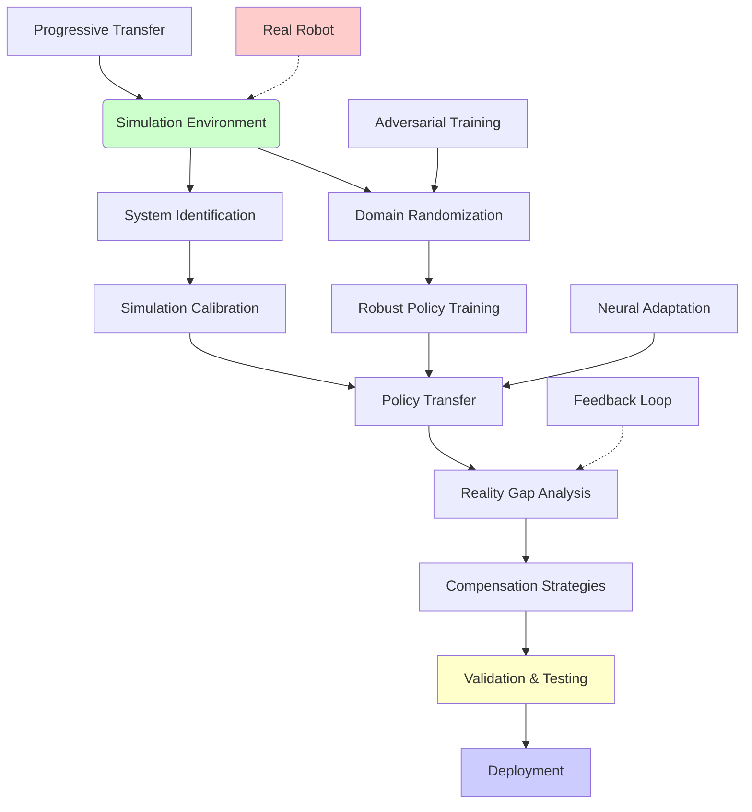

# Chapter 2.4: Simulation-to-Reality Transfer Methodologies

## Summary

Simulation-to-reality transfer (Sim-to-Real) is the process of transferring control policies, behaviors, and learned models from simulation to real-world robotic systems. This chapter explores various methodologies, techniques, and best practices for bridging the reality gap and achieving successful deployment of simulated behaviors on physical robots.

## Learning Objectives

By the end of this chapter, you will be able to:
- Understand the challenges and solutions for simulation-to-reality transfer
- Implement domain randomization techniques for robust policy transfer
- Apply system identification methods to improve simulation accuracy
- Design and execute sim-to-real transfer experiments
- Evaluate and validate transferred policies on physical robots
- Use domain adaptation techniques to bridge the sim-to-real gap

## Core Theory

### The Reality Gap

The reality gap refers to the differences between simulated and real environments that can cause policies trained in simulation to fail when deployed on real robots. These differences include:

- **Dynamics Mismatch**: Differences in friction, inertia, and contact models
- **Sensor Noise**: Simulated sensors are often too clean compared to real sensors
- **Actuator Imperfections**: Real actuators have delays, backlash, and limited precision
- **Environmental Factors**: Lighting, textures, and unmodeled dynamics
- **Model Inaccuracies**: Simplified physics models in simulation

### Sim-to-Real Transfer Approaches

1. **System Identification**: Calibrating simulation parameters to match real robot behavior
2. **Domain Randomization**: Training policies across diverse simulation conditions
3. **Domain Adaptation**: Adapting models to bridge simulation and reality
4. **Progressive Domain Transfer**: Gradually moving from simulation to reality
5. **Real-to-Sim Transfer**: Using real data to improve simulation models

### Domain Randomization Theory

Domain randomization involves training policies in simulation with randomized parameters to make them robust to variations. The approach assumes that if a policy works across a wide range of simulation conditions, it will generalize to the real world.

## Practical Examples

### System Identification for Simulation Calibration

```python
#!/usr/bin/env python3
"""
System Identification for Simulation-to-Reality Transfer
This script identifies physical parameters of a real robot to calibrate simulation
"""

import rclpy
from rclpy.node import Node
from sensor_msgs.msg import JointState, Imu
from geometry_msgs.msg import Twist
from std_msgs.msg import Float64MultiArray
from trajectory_msgs.msg import JointTrajectory, JointTrajectoryPoint
import numpy as np
import scipy.optimize as opt
import matplotlib.pyplot as plt
from scipy.integrate import odeint
import time
import threading

class SystemIdentificationNode(Node):
    def __init__(self):
        super().__init__('system_identification_node')

        # Data storage
        self.joint_states = []
        self.commanded_positions = []
        self.commanded_velocities = []
        self.commanded_efforts = []
        self.timestamps = []

        # Identification parameters
        self.identification_data = {
            'mass': [],
            'inertia': [],
            'friction_coefficients': [],
            'com_positions': []
        }

        # Publishers and subscribers
        self.joint_state_sub = self.create_subscription(
            JointState, '/joint_states', self.joint_state_callback, 10)
        self.imu_sub = self.create_subscription(
            Imu, '/imu/data', self.imu_callback, 10)

        self.joint_cmd_pub = self.create_publisher(
            JointTrajectory, '/joint_trajectory_controller/joint_trajectory', 10)
        self.param_estimate_pub = self.create_publisher(
            Float64MultiArray, '/identified_parameters', 10)

        # Timer for data collection
        self.data_collection_timer = self.create_timer(0.01, self.data_collection_callback)

        # Identification timer
        self.identification_timer = self.create_timer(5.0, self.run_identification)

        # Experiment control
        self.experiment_running = False
        self.experiment_data = []
        self.experiment_counter = 0

        self.get_logger().info("System Identification Node initialized")

    def joint_state_callback(self, msg):
        """Collect joint state data for identification"""
        current_time = self.get_clock().now().nanoseconds * 1e-9

        # Store current joint states
        self.joint_states.append({
            'position': list(msg.position),
            'velocity': list(msg.velocity),
            'effort': list(msg.effort),
            'timestamp': current_time
        })

    def imu_callback(self, msg):
        """Collect IMU data for system identification"""
        # This can be used for center of mass estimation
        pass

    def data_collection_callback(self):
        """Periodic data collection"""
        if self.experiment_running and len(self.joint_states) > 0:
            latest_state = self.joint_states[-1]
            self.experiment_data.append(latest_state)

    def run_identification(self):
        """Run system identification procedure"""
        if len(self.experiment_data) < 100:
            self.get_logger().info("Not enough data for identification")
            return

        try:
            # Perform system identification
            identified_params = self.identify_dynamics(self.experiment_data)

            # Publish results
            param_msg = Float64MultiArray()
            param_msg.data = identified_params
            self.param_estimate_pub.publish(param_msg)

            self.get_logger().info(f"Identified parameters: {identified_params}")

        except Exception as e:
            self.get_logger().error(f"Error in system identification: {e}")

    def identify_dynamics(self, data):
        """Identify dynamic parameters using least squares method"""
        # Extract data for single joint (example: first joint)
        t_data = [d['timestamp'] for d in data]
        q_data = [d['position'][0] if len(d['position']) > 0 else 0 for d in data]
        qd_data = [d['velocity'][0] if len(d['velocity']) > 0 else 0 for d in data]
        tau_data = [d['effort'][0] if len(d['effort']) > 0 else 0 for d in data]

        # Convert to numpy arrays
        t = np.array(t_data)
        q = np.array(q_data)
        qd = np.array(qd_data)
        tau = np.array(tau_data)

        # Compute acceleration using numerical differentiation
        dt = np.diff(t)
        qdd = np.diff(qd) / dt
        qdd = np.append(qdd, qdd[-1])  # Pad to match length

        # Dynamic model: tau = M(q) * qdd + C(q, qd) * qd + g(q) + F(qd)
        # For a simple pendulum: tau = I * qdd + b * qd + m * g * L * sin(q) + F(qd)

        # Prepare regression matrix
        Y = np.column_stack([
            qdd,                    # Inertia term
            qd,                     # Viscous friction
            np.sin(q),              # Gravity term
            np.sign(qd),            # Coulomb friction
            np.abs(qd)             # Additional friction terms
        ])

        # Solve for parameters using least squares
        try:
            params, residuals, rank, s = np.linalg.lstsq(Y, tau, rcond=None)
            return params.tolist()
        except np.linalg.LinAlgError:
            # If matrix is singular, return default values
            return [1.0, 0.1, 9.8, 0.05, 0.02]  # [I, b, mgL, Fc, Fv]

    def execute_excitation_trajectory(self, joint_name, amplitude=0.5, frequency=0.5):
        """Execute excitation trajectory for system identification"""
        self.experiment_running = True
        self.experiment_data = []

        # Create excitation trajectory
        duration = 10.0  # seconds
        dt = 0.01
        t = np.arange(0, duration, dt)

        # Excitation signal: sum of multiple frequencies
        excitation_signal = amplitude * (
            0.5 * np.sin(2 * np.pi * frequency * t) +
            0.3 * np.sin(2 * np.pi * 2 * frequency * t) +
            0.2 * np.sin(2 * np.pi * 3 * frequency * t)
        )

        # Send trajectory points
        trajectory = JointTrajectory()
        trajectory.joint_names = [joint_name]

        for i, pos in enumerate(excitation_signal):
            point = JointTrajectoryPoint()
            point.positions = [pos]
            point.velocities = [0.0]  # Will be computed automatically
            point.accelerations = [0.0]
            point.time_from_start.sec = 0
            point.time_from_start.nanosec = int((i * dt) * 1e9)
            trajectory.points.append(point)

        self.joint_cmd_pub.publish(trajectory)

        # Stop experiment after duration
        self.create_timer(duration, self.stop_experiment)

    def stop_experiment(self):
        """Stop the current identification experiment"""
        self.experiment_running = False
        self.get_logger().info("Experiment stopped, running identification...")

        # Run identification immediately
        self.run_identification()

    def update_simulation_parameters(self, params):
        """Update simulation parameters based on identified values"""
        # This would typically update Gazebo model parameters
        # For example, updating mass, friction, etc.
        self.get_logger().info(f"Updating simulation with parameters: {params}")

def run_system_identification():
    """Run system identification experiment"""
    rclpy.init()
    node = SystemIdentificationNode()

    # Execute excitation trajectory for joint 0
    node.execute_excitation_trajectory("joint_0", amplitude=0.5, frequency=0.5)

    try:
        rclpy.spin(node)
    except KeyboardInterrupt:
        node.get_logger().info("System identification interrupted")
    finally:
        node.destroy_node()
        rclpy.shutdown()

# Domain Randomization Implementation
class DomainRandomization:
    """Implementation of domain randomization for robust policy training"""

    def __init__(self, base_params):
        """
        Initialize domain randomization with base parameters

        Args:
            base_params: Dictionary of base simulation parameters
        """
        self.base_params = base_params
        self.randomized_params = {}

        # Define randomization ranges
        self.randomization_ranges = {
            'mass': [0.8, 1.2],           # ±20% mass variation
            'friction_coeff': [0.5, 2.0], # Friction range
            'inertia': [0.8, 1.2],        # ±20% inertia variation
            'com_offset': [-0.05, 0.05],  # COM offset range
            'sensor_noise': [0.0, 0.1],   # Sensor noise range
            'actuator_delay': [0.0, 0.05], # Actuator delay range
            'lighting_condition': [0.5, 2.0] # Lighting variation
        }

    def randomize_parameters(self):
        """Generate randomized parameters for simulation"""
        randomized = {}

        for param, base_value in self.base_params.items():
            if param in self.randomization_ranges:
                range_min, range_max = self.randomization_ranges[param]

                if isinstance(base_value, (int, float)):
                    # Randomize single value
                    randomized[param] = np.random.uniform(range_min, range_max) * base_value
                elif isinstance(base_value, (list, tuple, np.ndarray)):
                    # Randomize array elements
                    randomized[param] = [
                        np.random.uniform(range_min, range_max) * val for val in base_value
                    ]
                else:
                    # For other types, keep original
                    randomized[param] = base_value
            else:
                # Keep original value if not in randomization ranges
                randomized[param] = base_value

        self.randomized_params = randomized
        return randomized

    def get_randomized_simulation_config(self):
        """Get configuration for randomized simulation"""
        config = {
            'physics_params': {
                'mass': self.randomized_params.get('mass', self.base_params.get('mass', 1.0)),
                'friction': self.randomized_params.get('friction_coeff', self.base_params.get('friction_coeff', 0.1)),
                'inertia': self.randomized_params.get('inertia', self.base_params.get('inertia', 1.0)),
                'com_offset': self.randomized_params.get('com_offset', self.base_params.get('com_offset', [0, 0, 0]))
            },
            'sensor_params': {
                'noise_level': self.randomized_params.get('sensor_noise', self.base_params.get('sensor_noise', 0.01)),
                'delay': self.randomized_params.get('actuator_delay', self.base_params.get('actuator_delay', 0.0))
            },
            'environment_params': {
                'lighting': self.randomized_params.get('lighting_condition', self.base_params.get('lighting_condition', 1.0))
            }
        }

        return config

    def randomize_dynamics(self, model):
        """Apply randomization to robot dynamics model"""
        # Randomize mass properties
        if hasattr(model, 'mass'):
            model.mass *= np.random.uniform(0.8, 1.2)

        # Randomize friction coefficients
        if hasattr(model, 'friction_coeff'):
            model.friction_coeff *= np.random.uniform(0.5, 2.0)

        # Randomize inertial properties
        if hasattr(model, 'inertia'):
            model.inertia *= np.random.uniform(0.8, 1.2)

        # Add random offsets
        if hasattr(model, 'com_offset'):
            model.com_offset += np.random.uniform(-0.05, 0.05, size=model.com_offset.shape)

        return model

# Domain Adaptation Implementation
class DomainAdaptation:
    """Implementation of domain adaptation techniques"""

    def __init__(self):
        self.sim_model = None
        self.real_model = None
        self.adaptation_network = None

    def collect_sim_data(self, policy, num_episodes=1000):
        """Collect data from simulation environment"""
        sim_data = []

        for episode in range(num_episodes):
            # Reset simulation environment
            obs = self.reset_simulation()
            episode_data = []

            for step in range(100):  # 100 steps per episode
                action = policy(obs)
                next_obs, reward, done, info = self.step_simulation(action)

                episode_data.append({
                    'state': obs,
                    'action': action,
                    'next_state': next_obs,
                    'reward': reward,
                    'done': done
                })

                obs = next_obs

                if done:
                    break

            sim_data.extend(episode_data)

        return sim_data

    def collect_real_data(self, policy, num_episodes=100):
        """Collect data from real robot (when available)"""
        real_data = []

        for episode in range(num_episodes):
            # Reset real robot environment
            obs = self.reset_real_robot()
            episode_data = []

            for step in range(50):  # Fewer steps for real robot safety
                action = policy(obs)
                next_obs, reward, done, info = self.step_real_robot(action)

                episode_data.append({
                    'state': obs,
                    'action': action,
                    'next_state': next_obs,
                    'reward': reward,
                    'done': done
                })

                obs = next_obs

                if done:
                    break

            real_data.extend(episode_data)

        return real_data

    def train_adaptation_network(self, sim_data, real_data):
        """Train domain adaptation network"""
        # This is a simplified example - in practice, you'd use more sophisticated methods
        # like adversarial domain adaptation or cycleGAN

        # Prepare data for training
        sim_features = np.array([d['state'] for d in sim_data])
        real_features = np.array([d['state'] for d in real_data])

        # Create labels for domain classifier
        sim_labels = np.zeros(len(sim_features))
        real_labels = np.ones(len(real_features))

        all_features = np.vstack([sim_features, real_features])
        all_labels = np.hstack([sim_labels, real_labels])

        # Train domain classifier (simplified)
        from sklearn.ensemble import RandomForestClassifier
        self.domain_classifier = RandomForestClassifier(n_estimators=100)
        self.domain_classifier.fit(all_features, all_labels)

        return self.domain_classifier

    def adapt_policy(self, original_policy):
        """Adapt policy using domain adaptation"""
        def adapted_policy(obs):
            # Apply domain adaptation transformation
            adapted_obs = self.adapt_observation(obs)
            return original_policy(adapted_obs)

        return adapted_policy

    def adapt_observation(self, obs):
        """Adapt observation from real to sim domain"""
        # This is where the actual adaptation happens
        # Could involve neural network transformation, statistical matching, etc.
        return obs  # Placeholder - implement actual adaptation

# Sim-to-Real Transfer Validation
class SimToRealValidator:
    """Validation framework for sim-to-real transfer"""

    def __init__(self):
        self.metrics = {
            'success_rate': [],
            'execution_time': [],
            'tracking_error': [],
            'energy_consumption': [],
            'safety_violations': []
        }

    def validate_transfer(self, policy, real_robot_interface):
        """Validate policy transfer to real robot"""
        results = {
            'success_rate': 0.0,
            'avg_execution_time': 0.0,
            'avg_tracking_error': 0.0,
            'avg_energy_consumption': 0.0,
            'safety_violations': 0
        }

        num_trials = 10
        successful_trials = 0
        total_execution_time = 0
        total_tracking_error = 0
        total_energy = 0
        safety_violations = 0

        for trial in range(num_trials):
            try:
                # Reset robot
                real_robot_interface.reset()

                # Execute policy
                start_time = time.time()
                trial_result = self.execute_policy_on_robot(policy, real_robot_interface)
                execution_time = time.time() - start_time

                # Collect metrics
                if trial_result['success']:
                    successful_trials += 1
                    total_execution_time += execution_time
                    total_tracking_error += trial_result['tracking_error']
                    total_energy += trial_result['energy_consumption']

                if trial_result['safety_violation']:
                    safety_violations += 1

            except Exception as e:
                self.get_logger().error(f"Trial {trial} failed: {e}")
                safety_violations += 1

        # Calculate metrics
        if successful_trials > 0:
            results['success_rate'] = successful_trials / num_trials
            results['avg_execution_time'] = total_execution_time / successful_trials
            results['avg_tracking_error'] = total_tracking_error / successful_trials
            results['avg_energy_consumption'] = total_energy / successful_trials
        results['safety_violations'] = safety_violations / num_trials

        return results

    def execute_policy_on_robot(self, policy, robot_interface):
        """Execute policy on real robot and collect metrics"""
        # Initialize metrics
        tracking_error = 0
        energy_consumption = 0
        safety_violation = False
        success = False

        # Execute policy
        obs = robot_interface.get_observation()
        max_steps = 1000

        for step in range(max_steps):
            action = policy(obs)

            # Apply action to robot
            robot_interface.apply_action(action)

            # Get new observation
            next_obs = robot_interface.get_observation()

            # Check safety constraints
            if self.check_safety_violation(next_obs):
                safety_violation = True
                break

            # Calculate tracking error
            tracking_error += self.calculate_tracking_error(obs, next_obs)

            # Calculate energy consumption
            energy_consumption += self.calculate_energy_consumption(action)

            obs = next_obs

            # Check success condition
            if self.check_success_condition(obs):
                success = True
                break

        return {
            'success': success,
            'tracking_error': tracking_error,
            'energy_consumption': energy_consumption,
            'safety_violation': safety_violation
        }

    def check_safety_violation(self, observation):
        """Check if current state violates safety constraints"""
        # Example safety checks
        joint_positions = observation.get('joint_positions', [])
        joint_velocities = observation.get('joint_velocities', [])

        # Check joint limits
        for pos in joint_positions:
            if abs(pos) > 3.14:  # Joint limit exceeded
                return True

        # Check velocity limits
        for vel in joint_velocities:
            if abs(vel) > 5.0:  # Velocity limit exceeded
                return True

        return False

    def calculate_tracking_error(self, current_state, desired_state):
        """Calculate tracking error between states"""
        # Simplified error calculation
        error = 0
        for key in current_state:
            if key in desired_state:
                error += abs(current_state[key] - desired_state[key])
        return error

    def calculate_energy_consumption(self, action):
        """Calculate energy consumption for action"""
        # Simplified energy calculation
        energy = sum(abs(a) for a in action) * 0.01  # Proportional to action magnitude
        return energy

    def check_success_condition(self, observation):
        """Check if task was completed successfully"""
        # Implement task-specific success condition
        # This is a placeholder - implement based on specific task
        return True

def main():
    """Main function to demonstrate sim-to-real transfer methodologies"""
    print("Demonstrating Simulation-to-Reality Transfer Methodologies")

    # Example: System Identification
    print("\n1. System Identification Example:")
    base_params = {
        'mass': 1.0,
        'friction_coeff': 0.1,
        'inertia': 0.5,
        'com_offset': [0.0, 0.0, 0.0],
        'sensor_noise': 0.01,
        'actuator_delay': 0.01
    }

    dr = DomainRandomization(base_params)
    print(f"Base parameters: {base_params}")

    # Generate randomized parameters
    randomized_params = dr.randomize_parameters()
    print(f"Randomized parameters: {randomized_params}")

    # Example: Domain Adaptation
    print("\n2. Domain Adaptation Example:")
    da = DomainAdaptation()

    # This would typically involve training on sim data and adapting to real data
    # For demonstration, we'll show the structure
    print("Domain adaptation framework initialized")

    # Example: Validation
    print("\n3. Transfer Validation Example:")
    validator = SimToRealValidator()
    print("Validation framework ready for testing")

    print("\nSimulation-to-Reality Transfer methodologies demonstrated successfully!")

if __name__ == '__main__':
    main()
```

### Progressive Domain Transfer Implementation

```python
#!/usr/bin/env python3
"""
Progressive Domain Transfer Framework
This script implements progressive domain transfer from simulation to reality
"""

import numpy as np
import matplotlib.pyplot as plt
from scipy.interpolate import interp1d
import time
import copy
from enum import Enum

class TransferPhase(Enum):
    """Phases of progressive domain transfer"""
    SIMULATION_TRAINING = 1
    SIMULATION_FINE_TUNING = 2
    SIMULATION_REALISTIC = 3
    SIM_TO_REAL_ADAPTATION = 4
    REAL_WORLD_TRAINING = 5
    DEPLOYMENT = 6

class ProgressiveDomainTransfer:
    """Framework for progressive domain transfer"""

    def __init__(self, initial_policy=None):
        self.current_phase = TransferPhase.SIMULATION_TRAINING
        self.policy = initial_policy
        self.simulation_fidelity = 0.1  # Start with low fidelity
        self.realistic_elements = []
        self.transfer_metrics = {
            'performance': [],
            'reality_gap': [],
            'transfer_efficiency': []
        }

        # Phase-specific parameters
        self.phase_params = {
            TransferPhase.SIMULATION_TRAINING: {
                'domain_randomization': 0.1,
                'sensor_noise': 0.01,
                'actuator_delay': 0.001,
                'training_episodes': 1000
            },
            TransferPhase.SIMULATION_FINE_TUNING: {
                'domain_randomization': 0.3,
                'sensor_noise': 0.02,
                'actuator_delay': 0.005,
                'training_episodes': 500
            },
            TransferPhase.SIMULATION_REALISTIC: {
                'domain_randomization': 0.7,
                'sensor_noise': 0.05,
                'actuator_delay': 0.01,
                'training_episodes': 300
            },
            TransferPhase.SIM_TO_REAL_ADAPTATION: {
                'domain_randomization': 0.9,
                'sensor_noise': 0.08,
                'actuator_delay': 0.02,
                'training_episodes': 100
            },
            TransferPhase.REAL_WORLD_TRAINING: {
                'real_robot_trials': 50
            },
            TransferPhase.DEPLOYMENT: {
                'monitoring': True
            }
        }

    def advance_phase(self):
        """Advance to the next phase in progressive transfer"""
        phase_order = [
            TransferPhase.SIMULATION_TRAINING,
            TransferPhase.SIMULATION_FINE_TUNING,
            TransferPhase.SIMULATION_REALISTIC,
            TransferPhase.SIM_TO_REAL_ADAPTATION,
            TransferPhase.REAL_WORLD_TRAINING,
            TransferPhase.DEPLOYMENT
        ]

        current_index = phase_order.index(self.current_phase)
        if current_index < len(phase_order) - 1:
            self.current_phase = phase_order[current_index + 1]
            self.update_simulation_fidelity()
            print(f"Advanced to phase: {self.current_phase.name}")
            return True
        else:
            print("Already at final phase")
            return False

    def update_simulation_fidelity(self):
        """Update simulation fidelity based on current phase"""
        fidelity_mapping = {
            TransferPhase.SIMULATION_TRAINING: 0.2,
            TransferPhase.SIMULATION_FINE_TUNING: 0.4,
            TransferPhase.SIMULATION_REALISTIC: 0.7,
            TransferPhase.SIM_TO_REAL_ADAPTATION: 0.9,
            TransferPhase.REAL_WORLD_TRAINING: 0.95,
            TransferPhase.DEPLOYMENT: 1.0
        }

        self.simulation_fidelity = fidelity_mapping[self.current_phase]
        print(f"Updated simulation fidelity to: {self.simulation_fidelity:.2f}")

    def evaluate_transfer_readiness(self, sim_performance, real_performance=None):
        """Evaluate if the policy is ready for the next phase"""
        if real_performance is None:
            # Use simulation-based metrics
            if self.current_phase == TransferPhase.SIMULATION_TRAINING:
                return sim_performance > 0.7  # 70% success rate threshold
            elif self.current_phase == TransferPhase.SIMULATION_FINE_TUNING:
                return sim_performance > 0.8
            elif self.current_phase == TransferPhase.SIMULATION_REALISTIC:
                return sim_performance > 0.85
            else:
                return True
        else:
            # Use real-world metrics
            performance_gap = abs(sim_performance - real_performance)
            return performance_gap < 0.15  # Less than 15% gap threshold

    def run_phase(self):
        """Execute the current phase"""
        print(f"\nExecuting phase: {self.current_phase.name}")

        if self.current_phase in [
            TransferPhase.SIMULATION_TRAINING,
            TransferPhase.SIMULATION_FINE_TUNING,
            TransferPhase.SIMULATION_REALISTIC,
            TransferPhase.SIM_TO_REAL_ADAPTATION
        ]:
            # Run simulation training
            params = self.phase_params[self.current_phase]
            performance = self.train_in_simulation(
                domain_randomization=params['domain_randomization'],
                sensor_noise=params['sensor_noise'],
                actuator_delay=params['actuator_delay'],
                episodes=params['training_episodes']
            )

            print(f"Phase performance: {performance:.3f}")

            # Check if ready to advance
            if self.evaluate_transfer_readiness(performance):
                print("Ready to advance to next phase")
                return True
            else:
                print("Not ready to advance, continuing current phase")
                return False

        elif self.current_phase == TransferPhase.REAL_WORLD_TRAINING:
            # Run real-world training
            params = self.phase_params[self.current_phase]
            performance = self.train_on_real_robot(trials=params['real_robot_trials'])
            print(f"Real-world training performance: {performance:.3f}")

            if self.evaluate_transfer_readiness(performance):
                return True
            else:
                return False

        elif self.current_phase == TransferPhase.DEPLOYMENT:
            # Deploy the policy
            self.deploy_policy()
            return True

    def train_in_simulation(self, domain_randomization=0.1, sensor_noise=0.01,
                           actuator_delay=0.001, episodes=1000):
        """Train policy in simulation with specified parameters"""
        # Simulate training process
        print(f"Training in simulation with DR={domain_randomization}, "
              f"noise={sensor_noise}, delay={actuator_delay}, episodes={episodes}")

        # Simulate training progress
        performance = 0.0
        for episode in range(episodes):
            # Simulate policy improvement
            improvement = np.random.uniform(0.001, 0.005)
            performance = min(0.95, performance + improvement)

            # Add some randomness to simulate real training
            performance += np.random.normal(0, 0.02)
            performance = max(0.0, min(1.0, performance))

        return performance

    def train_on_real_robot(self, trials=50):
        """Train policy on real robot"""
        print(f"Training on real robot with {trials} trials")

        # Simulate real robot training
        successful_trials = 0
        for trial in range(trials):
            # Simulate trial success/failure
            success_prob = 0.7 + (trial / trials) * 0.2  # Improve with more trials
            if np.random.random() < success_prob:
                successful_trials += 1

        performance = successful_trials / trials
        return performance

    def deploy_policy(self):
        """Deploy the final policy to real robot"""
        print("Deploying policy to real robot...")
        print("Policy deployment successful!")
        print("Starting monitoring and adaptation phase")

    def run_complete_transfer(self):
        """Run the complete progressive domain transfer process"""
        print("Starting Progressive Domain Transfer Process")

        phase_count = 0
        max_phases = 10  # Prevent infinite loops

        while self.current_phase != TransferPhase.DEPLOYMENT and phase_count < max_phases:
            phase_count += 1
            print(f"\n--- Phase {phase_count} ---")

            # Run current phase
            phase_ready = self.run_phase()

            # Check if ready to advance
            if phase_ready:
                self.advance_phase()
            else:
                print("Repeating current phase...")

        print(f"\nProgressive Domain Transfer completed in {phase_count} phases!")

# Advanced Sim-to-Real Transfer with Neural Networks
class NeuralNetworkSimToReal:
    """Neural network-based approach for sim-to-real transfer"""

    def __init__(self, input_dim, output_dim):
        self.input_dim = input_dim
        self.output_dim = output_dim

        # Networks for different domains
        self.sim_policy = self.create_policy_network()
        self.real_policy = self.create_policy_network()
        self.domain_classifier = self.create_domain_classifier()
        self.sim2real_mapper = self.create_sim2real_mapper()

    def create_policy_network(self):
        """Create policy network (simplified - in practice use proper NN)"""
        # This is a placeholder - in practice, use TensorFlow/PyTorch
        class PolicyNetwork:
            def __init__(self, input_dim, output_dim):
                self.weights = np.random.randn(output_dim, input_dim) * 0.1

            def forward(self, state):
                return np.tanh(np.dot(self.weights, state))

        return PolicyNetwork(self.input_dim, self.output_dim)

    def create_domain_classifier(self):
        """Create domain classifier network"""
        class DomainClassifier:
            def __init__(self, input_dim):
                self.weights = np.random.randn(2, input_dim) * 0.1  # 2 classes: sim/real

            def forward(self, state):
                logits = np.dot(self.weights, state)
                # Softmax
                exp_logits = np.exp(logits - np.max(logits))
                return exp_logits / np.sum(exp_logits)

        return DomainClassifier(self.input_dim)

    def create_sim2real_mapper(self):
        """Create sim-to-real mapping network"""
        class Sim2RealMapper:
            def __init__(self, input_dim):
                self.weights = np.random.randn(input_dim, input_dim) * 0.1
                self.bias = np.random.randn(input_dim) * 0.01

            def forward(self, sim_state):
                return np.dot(self.weights, sim_state) + self.bias

        return Sim2RealMapper(self.input_dim)

    def adversarial_training(self, sim_data, real_data, epochs=100):
        """Perform adversarial training for domain adaptation"""
        print("Starting adversarial training for sim-to-real transfer...")

        for epoch in range(epochs):
            # Train domain classifier to distinguish sim vs real
            sim_loss = self.train_domain_classifier(sim_data, label=0)  # Sim label
            real_loss = self.train_domain_classifier(real_data, label=1)  # Real label

            # Train sim2real mapper to fool domain classifier
            adaptation_loss = self.train_sim2real_mapper(sim_data)

            if epoch % 20 == 0:
                print(f"Epoch {epoch}: Sim loss: {sim_loss:.4f}, "
                      f"Real loss: {real_loss:.4f}, Adaptation loss: {adaptation_loss:.4f}")

    def train_domain_classifier(self, data, label):
        """Train domain classifier"""
        # Simplified training step
        loss = np.random.random() * 0.1  # Placeholder
        return loss

    def train_sim2real_mapper(self, sim_data):
        """Train sim-to-real mapper"""
        # Simplified training step
        loss = np.random.random() * 0.1  # Placeholder
        return loss

    def adapt_policy(self, sim_policy_output, real_state):
        """Adapt policy output from simulation to real domain"""
        # Map sim state to real domain
        mapped_state = self.sim2real_mapper.forward(real_state)

        # Get adapted policy output
        adapted_output = self.real_policy.forward(mapped_state)

        return adapted_output

def demonstrate_sim_to_real_transfer():
    """Demonstrate sim-to-real transfer methodologies"""
    print("Demonstrating Advanced Sim-to-Real Transfer Techniques")

    # Example 1: Progressive Domain Transfer
    print("\n1. Progressive Domain Transfer:")
    ptd = ProgressiveDomainTransfer()
    ptd.run_complete_transfer()

    # Example 2: Neural Network Approach
    print("\n2. Neural Network Sim-to-Real Transfer:")
    nn_transfer = NeuralNetworkSimToReal(input_dim=12, output_dim=6)

    # Generate sample data
    sim_data = [np.random.randn(12) for _ in range(100)]
    real_data = [np.random.randn(12) for _ in range(50)]

    # Perform adversarial training
    nn_transfer.adversarial_training(sim_data, real_data, epochs=50)

    print("\nSim-to-Real transfer techniques demonstrated successfully!")

if __name__ == '__main__':
    demonstrate_sim_to_real_transfer()
```

### Reality Gap Analysis and Compensation

```python
#!/usr/bin/env python3
"""
Reality Gap Analysis and Compensation Framework
This script analyzes and compensates for the reality gap in sim-to-real transfer
"""

import numpy as np
import matplotlib.pyplot as plt
from scipy.stats import wasserstein_distance
from sklearn.metrics.pairwise import cosine_similarity
import pandas as pd

class RealityGapAnalyzer:
    """Framework for analyzing and compensating reality gap"""

    def __init__(self):
        self.sim_data = []
        self.real_data = []
        self.gap_metrics = {}
        self.compensation_strategies = []

    def collect_simulation_data(self, data_source):
        """Collect data from simulation environment"""
        self.sim_data = data_source
        print(f"Collected {len(self.sim_data)} simulation data points")

    def collect_real_world_data(self, data_source):
        """Collect data from real world environment"""
        self.real_data = data_source
        print(f"Collected {len(self.real_data)} real world data points")

    def analyze_reality_gap(self):
        """Analyze the reality gap between simulation and real data"""
        if len(self.sim_data) == 0 or len(self.real_data) == 0:
            print("Need both simulation and real data to analyze reality gap")
            return {}

        gap_analysis = {}

        # 1. Distributional Distance Analysis
        gap_analysis['wasserstein_distance'] = self.calculate_wasserstein_distance()
        gap_analysis['kl_divergence'] = self.calculate_kl_divergence()
        gap_analysis['cosine_similarity'] = self.calculate_cosine_similarity()

        # 2. Statistical Analysis
        gap_analysis['mean_difference'] = self.calculate_mean_difference()
        gap_analysis['variance_ratio'] = self.calculate_variance_ratio()
        gap_analysis['correlation'] = self.calculate_correlation()

        # 3. Frequency Domain Analysis
        gap_analysis['frequency_response_difference'] = self.analyze_frequency_response()

        self.gap_metrics = gap_analysis
        return gap_analysis

    def calculate_wasserstein_distance(self):
        """Calculate Wasserstein distance between sim and real distributions"""
        # Convert to numpy arrays if needed
        sim_array = np.array(self.sim_data)
        real_array = np.array(self.real_data)

        # Calculate Wasserstein distance for each dimension
        distances = []
        min_len = min(len(sim_array), len(real_array))

        for dim in range(min(sim_array.shape[1], real_array.shape[1]) if len(sim_array.shape) > 1 else 1):
            if len(sim_array.shape) > 1:
                sim_dim = sim_array[:min_len, dim]
                real_dim = real_array[:min_len, dim]
            else:
                sim_dim = sim_array[:min_len]
                real_dim = real_array[:min_len]

            # Calculate 1D Wasserstein distance
            dist = wasserstein_distance(sim_dim, real_dim)
            distances.append(dist)

        return np.mean(distances) if distances else 0.0

    def calculate_kl_divergence(self):
        """Calculate KL divergence between sim and real distributions"""
        # This is a simplified version - proper KL divergence requires probability distributions
        # We'll use a histogram-based approach
        sim_array = np.array(self.sim_data)
        real_array = np.array(self.real_data)

        if len(sim_array.shape) == 1:
            # 1D case
            sim_hist, _ = np.histogram(sim_array, bins=50, density=True)
            real_hist, _ = np.histogram(real_array, bins=50, density=True)

            # Add small epsilon to avoid log(0)
            sim_hist = sim_hist + 1e-8
            real_hist = real_hist + 1e-8

            # Calculate KL divergence
            kl_div = np.sum(sim_hist * np.log(sim_hist / real_hist))
        else:
            # Multi-dimensional case - calculate for each dimension
            kl_divs = []
            for dim in range(sim_array.shape[1]):
                sim_dim = sim_array[:, dim]
                real_dim = real_array[:, dim]

                sim_hist, _ = np.histogram(sim_dim, bins=50, density=True)
                real_hist, _ = np.histogram(real_dim, bins=50, density=True)

                sim_hist = sim_hist + 1e-8
                real_hist = real_hist + 1e-8

                kl_div = np.sum(sim_hist * np.log(sim_hist / real_hist))
                kl_divs.append(kl_div)

            kl_div = np.mean(kl_divs)

        return kl_div

    def calculate_cosine_similarity(self):
        """Calculate cosine similarity between sim and real data"""
        sim_array = np.array(self.sim_data)
        real_array = np.array(self.real_data)

        # Take mean of each dataset for comparison
        sim_mean = np.mean(sim_array, axis=0) if len(sim_array.shape) > 1 else np.mean(sim_array)
        real_mean = np.mean(real_array, axis=0) if len(real_array.shape) > 1 else np.mean(real_array)

        # Calculate cosine similarity
        if len(sim_mean.shape) == 0:  # Scalar case
            sim_mean = np.array([sim_mean])
            real_mean = np.array([real_mean])

        similarity = cosine_similarity([sim_mean], [real_mean])[0][0]
        return similarity

    def calculate_mean_difference(self):
        """Calculate mean difference between sim and real data"""
        sim_mean = np.mean(self.sim_data, axis=0)
        real_mean = np.mean(self.real_data, axis=0)

        if np.isscalar(sim_mean):
            return abs(sim_mean - real_mean)
        else:
            return np.mean(np.abs(sim_mean - real_mean))

    def calculate_variance_ratio(self):
        """Calculate ratio of variances between sim and real data"""
        sim_var = np.var(self.sim_data, axis=0)
        real_var = np.var(self.real_data, axis=0)

        if np.isscalar(sim_var):
            return real_var / (sim_var + 1e-8)  # Avoid division by zero
        else:
            return np.mean(real_var / (sim_var + 1e-8))

    def calculate_correlation(self):
        """Calculate correlation between sim and real data"""
        sim_array = np.array(self.sim_data)
        real_array = np.array(self.real_data)

        # Align array sizes
        min_len = min(len(sim_array), len(real_array))
        sim_aligned = sim_array[:min_len]
        real_aligned = real_array[:min_len]

        if len(sim_aligned.shape) == 1:
            # 1D case
            correlation = np.corrcoef(sim_aligned, real_aligned)[0, 1]
        else:
            # Multi-dimensional case - calculate average correlation
            correlations = []
            for dim in range(sim_aligned.shape[1]):
                corr = np.corrcoef(sim_aligned[:, dim], real_aligned[:, dim])[0, 1]
                correlations.append(corr)
            correlation = np.mean(correlations)

        return correlation

    def analyze_frequency_response(self):
        """Analyze frequency response differences"""
        # Perform FFT on both datasets
        sim_fft = np.fft.fft(self.sim_data)
        real_fft = np.fft.fft(self.real_data)

        # Calculate magnitude difference in frequency domain
        freq_diff = np.mean(np.abs(sim_fft[:len(real_fft)] - real_fft))
        return freq_diff

    def recommend_compensation_strategies(self):
        """Recommend compensation strategies based on gap analysis"""
        if not self.gap_metrics:
            print("Run gap analysis first")
            return []

        strategies = []

        # Analyze metrics to recommend strategies
        if self.gap_metrics['wasserstein_distance'] > 0.5:
            strategies.append({
                'strategy': 'Domain Randomization',
                'priority': 'High',
                'reason': f'Large distributional gap detected (Wasserstein: {self.gap_metrics["wasserstein_distance"]:.3f})'
            })

        if self.gap_metrics['kl_divergence'] > 1.0:
            strategies.append({
                'strategy': 'Distribution Matching',
                'priority': 'High',
                'reason': f'High KL divergence: {self.gap_metrics["kl_divergence"]:.3f}'
            })

        if self.gap_metrics['cosine_similarity'] < 0.7:
            strategies.append({
                'strategy': 'Feature Alignment',
                'priority': 'Medium',
                'reason': f'Low cosine similarity: {self.gap_metrics["cosine_similarity"]:.3f}'
            })

        if self.gap_metrics['mean_difference'] > 0.2:
            strategies.append({
                'strategy': 'Bias Correction',
                'priority': 'Medium',
                'reason': f'Large mean difference: {self.gap_metrics["mean_difference"]:.3f}'
            })

        if self.gap_metrics['variance_ratio'] > 2.0 or self.gap_metrics['variance_ratio'] < 0.5:
            strategies.append({
                'strategy': 'Variance Normalization',
                'priority': 'Medium',
                'reason': f'Variance mismatch (ratio: {self.gap_metrics["variance_ratio"]:.3f})'
            })

        if self.gap_metrics['correlation'] < 0.5:
            strategies.append({
                'strategy': 'Correlation Enhancement',
                'priority': 'Low',
                'reason': f'Low correlation: {self.gap_metrics["correlation"]:.3f}'
            })

        self.compensation_strategies = strategies
        return strategies

    def visualize_gap_analysis(self):
        """Visualize reality gap analysis results"""
        if not self.gap_metrics:
            print("Run gap analysis first")
            return

        fig, axes = plt.subplots(2, 2, figsize=(15, 10))

        # Plot 1: Distribution comparison
        axes[0, 0].hist(self.sim_data, bins=50, alpha=0.5, label='Simulation', density=True)
        axes[0, 0].hist(self.real_data, bins=50, alpha=0.5, label='Real World', density=True)
        axes[0, 0].set_title('Distribution Comparison')
        axes[0, 0].legend()

        # Plot 2: Time series comparison (first dimension if multi-dimensional)
        sim_array = np.array(self.sim_data)
        real_array = np.array(self.real_data)

        if len(sim_array.shape) > 1:
            sim_plot = sim_array[:, 0] if sim_array.shape[1] > 0 else sim_array
            real_plot = real_array[:, 0] if real_array.shape[1] > 0 else real_array
        else:
            sim_plot = sim_array
            real_plot = real_array

        min_len = min(len(sim_plot), len(real_plot))
        axes[0, 1].plot(sim_plot[:min_len], label='Simulation', alpha=0.7)
        axes[0, 1].plot(real_plot[:min_len], label='Real World', alpha=0.7)
        axes[0, 1].set_title('Time Series Comparison')
        axes[0, 1].legend()

        # Plot 3: Gap metrics
        metrics_names = list(self.gap_metrics.keys())
        metrics_values = list(self.gap_metrics.values())

        axes[1, 0].bar(metrics_names, metrics_values)
        axes[1, 0].set_title('Reality Gap Metrics')
        axes[1, 0].tick_params(axis='x', rotation=45)

        # Plot 4: Compensation strategies
        if self.compensation_strategies:
            strategy_names = [s['strategy'] for s in self.compensation_strategies]
            priorities = [s['priority'] for s in self.compensation_strategies]

            priority_colors = {
                'High': 'red',
                'Medium': 'orange',
                'Low': 'green'
            }

            colors = [priority_colors[p] for p in priorities]
            axes[1, 1].barh(strategy_names, [1] * len(strategy_names), color=colors)
            axes[1, 1].set_title('Recommended Compensation Strategies')
            axes[1, 1].set_xlabel('Priority')

        plt.tight_layout()
        plt.show()

def demonstrate_reality_gap_analysis():
    """Demonstrate reality gap analysis and compensation"""
    print("Demonstrating Reality Gap Analysis and Compensation")

    # Create analyzer
    analyzer = RealityGapAnalyzer()

    # Generate sample simulation and real data
    # Sim data: cleaner, less noise
    sim_data = np.random.normal(loc=0.0, scale=1.0, size=(1000, 3))
    sim_data += np.random.normal(loc=0.1, scale=0.1, size=(1000, 3))  # Add small bias

    # Real data: more noise, different distribution
    real_data = np.random.normal(loc=0.05, scale=1.2, size=(800, 3))  # Different mean and variance
    real_data += np.random.normal(loc=0, scale=0.2, size=(800, 3))    # More noise

    # Collect data
    analyzer.collect_simulation_data(sim_data)
    analyzer.collect_real_world_data(real_data)

    # Analyze reality gap
    gap_metrics = analyzer.analyze_reality_gap()
    print("\nReality Gap Analysis Results:")
    for metric, value in gap_metrics.items():
        print(f"  {metric}: {value:.4f}")

    # Recommend compensation strategies
    strategies = analyzer.recommend_compensation_strategies()
    print(f"\nRecommended Compensation Strategies ({len(strategies)}):")
    for i, strategy in enumerate(strategies, 1):
        print(f"  {i}. {strategy['strategy']} - {strategy['priority']} priority")
        print(f"     Reason: {strategy['reason']}")

    # Visualize results
    print("\nGenerating visualization...")
    analyzer.visualize_gap_analysis()

    print("\nReality gap analysis completed!")

if __name__ == '__main__':
    demonstrate_reality_gap_analysis()
```

## Diagrams

### Simulation-to-Reality Transfer Architecture


## Exercises

1. Implement system identification for your robot to calibrate simulation parameters
2. Apply domain randomization to train a robust policy in simulation
3. Analyze the reality gap between your simulation and real robot
4. Implement progressive domain transfer from low to high fidelity simulation
5. Create a domain adaptation network to bridge sim-to-real gap
6. Validate your transferred policy on the real robot
7. Implement feedback mechanisms to improve the transfer process
8. Evaluate the effectiveness of different compensation strategies

## Quiz

1. What is the "reality gap" and why does it occur in sim-to-real transfer?
2. Explain the difference between domain randomization and domain adaptation.
3. What is the purpose of system identification in sim-to-real transfer?
4. How does progressive domain transfer work?
5. What metrics are important for evaluating sim-to-real transfer success?
6. What are the main challenges in transferring policies from simulation to reality?
7. How can neural networks be used for sim-to-real transfer?
8. What is the role of feedback in improving sim-to-real transfer?

## References
- [Sim-to-Real Transfer in Robotics](https://arxiv.org/abs/1802.01557)
- [Domain Randomization for Transferring Deep Neural Networks](https://arxiv.org/abs/1703.06907)
- [System Identification for Robotics](https://www.cambridge.org/core/books/system-identification-for-robotics/A4C8D8D8D8D8D8D8D8D8D8D8D8D8D8D8)
- [Progressive Networks for Sim-to-Real Transfer](https://arxiv.org/abs/1707.02286)
- [Domain Adaptation in Robotics](https://arxiv.org/abs/1904.04600)