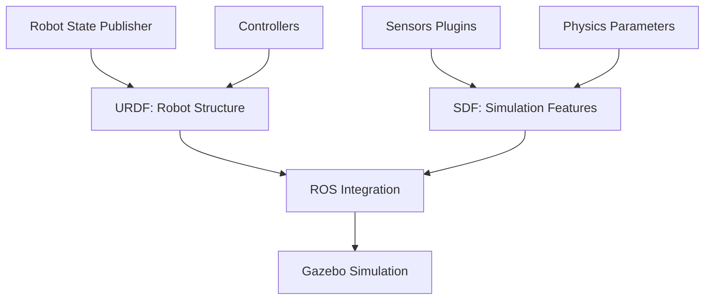

# Chapter 2: URDF and SDF Robot Description Formats

## Learning Objectives
By the end of this chapter, you will be able to:
- Understand the differences between URDF and SDF formats
- Convert between URDF and SDF when needed
- Create models that work in both ROS and simulation environments
- Implement proper robot descriptions for humanoid robots
- Validate robot descriptions for simulation compatibility

## Core Theory

### URDF vs SDF Comparison
- **URDF (Unified Robot Description Format)**: XML-based format primarily for ROS
  - Focuses on robot structure and kinematics
  - Defines links, joints, and basic properties
  - Used by ROS tools like robot_state_publisher
  - Limited simulation-specific features

- **SDF (Simulation Description Format)**: XML-based format for simulation environments
  - Designed for physics simulation and visualization
  - Supports more complex simulation features
  - Used by Gazebo and other simulators
  - Includes plugins, sensors, and dynamics

### Relationship Between URDF and SDF
- URDF models can be loaded into SDF-based simulators
- SDF files can include URDF models
- Both formats can coexist in simulation environments
- Conversion tools exist to translate between formats

### Model Organization
- **URDF**: Better for ROS-based robot description
- **SDF**: Better for simulation-specific features
- **Hybrid Approach**: Use URDF for robot, SDF for simulation environment

## Practical Examples

### URDF to SDF Conversion
```xml
<!-- This is how a URDF robot can be included in an SDF world -->
<sdf version="1.7">
  <model name="my_robot_from_urdf">
    <include>
      <uri>model://my_robot_description/urdf/my_robot.urdf</uri>
    </include>
  </model>
</sdf>
```

### Hybrid Model: URDF Robot with SDF Simulation Features
```xml
<!-- my_robot.gazebo.xacro -->
<?xml version="1.0"?>
<robot xmlns:xacro="http://www.ros.org/wiki/xacro">
  <xacro:macro name="gazebo_control" params="prefix">
    <gazebo>
      <plugin name="gazebo_ros_control" filename="libgazebo_ros_control.so">
        <robotNamespace>/$(arg robot_namespace)</robotNamespace>
        <robotSimType>gazebo_ros_control/DefaultRobotHWSim</robotSimType>
      </plugin>
    </gazebo>
  </xacro:macro>

  <xacro:macro name="gazebo_imu_sensor" params="prefix topic">
    <gazebo reference="${prefix}_imu_link">
      <sensor name="${prefix}_imu_sensor" type="imu">
        <always_on>true</always_on>
        <update_rate>100</update_rate>
        <topic>${topic}</topic>
        <visualize>false</visualize>
      </sensor>
    </gazebo>
  </xacro:macro>

  <xacro:macro name="gazebo_camera_sensor" params="prefix topic camera_info_topic">
    <gazebo reference="${prefix}_camera_frame">
      <sensor name="${prefix}_camera" type="camera">
        <update_rate>30</update_rate>
        <camera name="head">
          <horizontal_fov>1.3962634</horizontal_fov>
          <image>
            <width>800</width>
            <height>600</height>
            <format>R8G8B8</format>
          </image>
          <clip>
            <near>0.1</near>
            <far>100</far>
          </clip>
        </camera>
        <plugin name="camera_controller" filename="libgazebo_ros_camera.so">
          <frame_name>${prefix}_camera_optical_frame</frame_name>
          <topic_name>${topic}</topic_name>
          <camera_info_topic_name>${camera_info_topic}</camera_info_topic_name>
        </plugin>
      </sensor>
    </gazebo>
  </xacro:macro>
</robot>
```

### Complete Humanoid Model Integration
```xml
<!-- humanoid_complete.urdf.xacro -->
<?xml version="1.0"?>
<robot xmlns:xacro="http://www.ros.org/wiki/xacro" name="humanoid_robot">

  <!-- Import macros -->
  <xacro:include filename="$(find humanoid_description)/urdf/macros.xacro" />
  <xacro:include filename="$(find humanoid_description)/urdf/materials.xacro" />

  <!-- Base Link -->
  <link name="base_link">
    <inertial>
      <mass value="10.0" />
      <origin xyz="0 0 0" />
      <inertia ixx="0.4" ixy="0.0" ixz="0.0" iyy="0.4" iyz="0.0" izz="0.4" />
    </inertial>
    <visual>
      <origin xyz="0 0 0" rpy="0 0 0" />
      <geometry>
        <box size="0.2 0.2 0.2" />
      </geometry>
      <material name="gray" />
    </visual>
    <collision>
      <origin xyz="0 0 0" rpy="0 0 0" />
      <geometry>
        <box size="0.2 0.2 0.2" />
      </geometry>
    </collision>
  </link>

  <!-- Torso -->
  <joint name="base_torso_joint" type="fixed">
    <parent link="base_link" />
    <child link="torso" />
    <origin xyz="0 0 0.15" rpy="0 0 0" />
  </joint>

  <link name="torso">
    <inertial>
      <mass value="5.0" />
      <origin xyz="0 0 0.2" />
      <inertia ixx="0.1" ixy="0.0" ixz="0.0" iyy="0.1" iyz="0.0" izz="0.1" />
    </inertial>
    <visual>
      <origin xyz="0 0 0.2" rpy="0 0 0" />
      <geometry>
        <box size="0.15 0.15 0.4" />
      </geometry>
      <material name="blue" />
    </visual>
    <collision>
      <origin xyz="0 0 0.2" rpy="0 0 0" />
      <geometry>
        <box size="0.15 0.15 0.4" />
      </geometry>
    </collision>
  </link>

  <!-- Head -->
  <joint name="torso_head_joint" type="revolute">
    <parent link="torso" />
    <child link="head" />
    <origin xyz="0 0 0.4" rpy="0 0 0" />
    <axis xyz="0 1 0" />
    <limit lower="-0.5" upper="0.5" effort="10.0" velocity="1.0" />
  </joint>

  <link name="head">
    <inertial>
      <mass value="1.0" />
      <origin xyz="0 0 0.08" />
      <inertia ixx="0.005" ixy="0.0" ixz="0.0" iyy="0.005" iyz="0.0" izz="0.005" />
    </inertial>
    <visual>
      <origin xyz="0 0 0.08" rpy="0 0 0" />
      <geometry>
        <sphere radius="0.08" />
      </geometry>
      <material name="white" />
    </visual>
    <collision>
      <origin xyz="0 0 0.08" rpy="0 0 0" />
      <geometry>
        <sphere radius="0.08" />
      </geometry>
    </collision>
  </link>

  <!-- Left Arm -->
  <joint name="torso_left_shoulder_joint" type="revolute">
    <parent link="torso" />
    <child link="left_upper_arm" />
    <origin xyz="0.1 0.1 0.2" rpy="0 0 0" />
    <axis xyz="0 1 0" />
    <limit lower="-1.57" upper="1.57" effort="10.0" velocity="1.0" />
  </joint>

  <link name="left_upper_arm">
    <inertial>
      <mass value="1.0" />
      <origin xyz="0 0 -0.1" />
      <inertia ixx="0.01" ixy="0.0" ixz="0.0" iyy="0.01" iyz="0.0" izz="0.005" />
    </inertial>
    <visual>
      <origin xyz="0 0 -0.1" rpy="0 0 0" />
      <geometry>
        <cylinder radius="0.04" length="0.2" />
      </geometry>
      <material name="red" />
    </visual>
    <collision>
      <origin xyz="0 0 -0.1" rpy="0 0 0" />
      <geometry>
        <cylinder radius="0.04" length="0.2" />
      </geometry>
    </collision>
  </link>

  <!-- Right Arm (similar structure) -->
  <joint name="torso_right_shoulder_joint" type="revolute">
    <parent link="torso" />
    <child link="right_upper_arm" />
    <origin xyz="0.1 -0.1 0.2" rpy="0 0 0" />
    <axis xyz="0 1 0" />
    <limit lower="-1.57" upper="1.57" effort="10.0" velocity="1.0" />
  </joint>

  <link name="right_upper_arm">
    <inertial>
      <mass value="1.0" />
      <origin xyz="0 0 -0.1" />
      <inertia ixx="0.01" ixy="0.0" ixz="0.0" iyy="0.01" iyz="0.0" izz="0.005" />
    </inertial>
    <visual>
      <origin xyz="0 0 -0.1" rpy="0 0 0" />
      <geometry>
        <cylinder radius="0.04" length="0.2" />
      </geometry>
      <material name="red" />
    </visual>
    <collision>
      <origin xyz="0 0 -0.1" rpy="0 0 0" />
      <geometry>
        <cylinder radius="0.04" length="0.2" />
      </geometry>
    </collision>
  </link>

  <!-- Include Gazebo-specific elements -->
  <gazebo>
    <plugin name="gazebo_ros_control" filename="libgazebo_ros_control.so">
      <robotNamespace>/humanoid_robot</robotNamespace>
    </plugin>
  </gazebo>

</robot>
```

## Diagrams

### URDF-SDF Relationship


## Exercises

1. Create a complete humanoid URDF model with all required joints
2. Add SDF-specific simulation elements to your URDF
3. Validate your model using check_urdf tool
4. Test the model in Gazebo simulation

## Quiz

1. What is the main difference between URDF and SDF?
2. Can you use URDF models in SDF-based simulators?
3. What are the advantages of using SDF over URDF for simulation?

## Summary

This chapter provided a comprehensive comparison of URDF (Unified Robot Description Format) and SDF (Simulation Description Format), exploring their distinct purposes, capabilities, and appropriate use cases in robotics development. We examined how these formats work together to enable effective robot modeling for both control and simulation environments.

Key concepts covered include:
- The fundamental differences between URDF for ROS control and SDF for simulation
- Techniques for converting between formats and maintaining compatibility
- Best practices for creating robot descriptions that work across both domains
- Integration approaches for using both formats in comprehensive robotic systems
- Validation methods to ensure model correctness across different platforms

Understanding both formats is essential for developing robots that can seamlessly transition between simulation and real-world operation. The proper use of URDF and SDF ensures that robot models function correctly in both control systems and simulation environments.

## References
- [URDF Documentation](http://wiki.ros.org/urdf)
- [SDF Documentation](http://sdformat.org/)
- [Gazebo Model Tutorial](http://gazebosim.org/tutorials?tut=ros_urdf&cat=connect_ros)