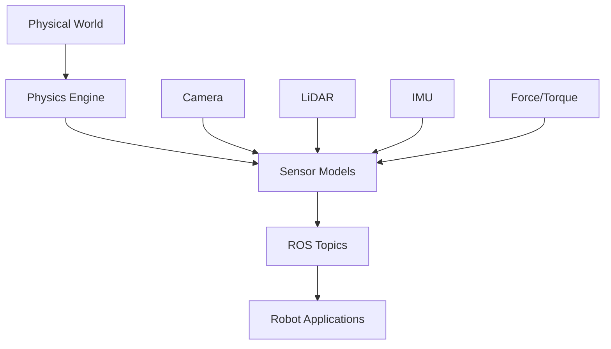

# Chapter 3: Physics Simulation and Sensor Simulation


## Learning Objectives
By the end of this chapter, you will be able to:
- Configure realistic physics parameters for humanoid simulation
- Implement sensor simulation including cameras, LiDAR, and IMU
- Tune simulation parameters for realistic behavior
- Validate sensor data in simulation
- Optimize simulation performance

## Core Theory

### Physics Simulation Fundamentals
Physics simulation in Gazebo relies on several key concepts:
- **Integration Methods**: How the physics engine advances simulation in time
- **Collision Detection**: How objects interact physically
- **Constraints**: How joints limit movement
- **Material Properties**: Friction, restitution, and other physical characteristics

### Physics Parameters
- **Time Step**: The smallest time interval for simulation updates
- **Real-time Factor**: How fast simulation runs compared to real time
- **Iterations**: Number of solver iterations for constraint resolution
- **ERP/CFM**: Error reduction parameter and constraint force mixing

### Sensor Simulation Types
- **Cameras**: Visual sensors with RGB, depth, or stereo capabilities
- **LiDAR**: Range-finding sensors for mapping and navigation
- **IMU**: Inertial measurement units for orientation and acceleration
- **GPS**: Global positioning for outdoor navigation
- **Force/Torque**: Contact sensors for manipulation tasks

### Humanoid-Specific Physics Considerations
- Balance and stability for bipedal locomotion
- Contact modeling for feet and ground interaction
- Dynamics of articulated limbs
- Center of mass considerations

## Practical Examples

### Physics Configuration for Humanoid Robot
```xml
<!-- In your robot's URDF/SDF -->
<gazebo reference="left_foot">
  <kp>1000000.0</kp>  <!-- Proportional gain -->
  <kd>100000.0</kd>   <!-- Derivative gain -->
  <mu1>1.0</mu1>      <!-- Primary friction coefficient -->
  <mu2>1.0</mu2>      <!-- Secondary friction coefficient -->
  <max_vel>1.0</max_vel>
  <min_depth>0.001</min_depth>
</gazebo>

<!-- Physics parameters in world file -->
<physics name="humanoid_physics" type="ode">
  <gravity>0 0 -9.8</gravity>
  <max_step_size>0.001</max_step_size>
  <real_time_factor>1.0</real_time_factor>
  <real_time_update_rate>1000</real_time_update_rate>
  <ode>
    <solver>
      <type>quick</type>
      <iters>1000</iters>
      <sor>1.3</sor>
    </solver>
    <constraints>
      <cfm>0.0</cfm>
      <erp>0.2</erp>
      <contact_max_correcting_vel>100.0</contact_max_correcting_vel>
      <contact_surface_layer>0.001</contact_surface_layer>
    </constraints>
  </ode>
</physics>
```

### Camera Sensor Configuration
```xml
<gazebo reference="camera_link">
  <sensor name="camera" type="camera">
    <update_rate>30</update_rate>
    <camera name="head">
      <horizontal_fov>1.3962634</horizontal_fov>
      <image>
        <width>640</width>
        <height>480</height>
        <format>R8G8B8</format>
      </image>
      <clip>
        <near>0.1</near>
        <far>100</far>
      </clip>
      <noise>
        <type>gaussian</type>
        <mean>0.0</mean>
        <stddev>0.007</stddev>
      </noise>
    </camera>
    <plugin name="camera_controller" filename="libgazebo_ros_camera.so">
      <frame_name>camera_optical_frame</frame_name>
      <topic_name>image_raw</topic_name>
      <camera_info_topic_name>camera_info</camera_info_topic_name>
      <hack_baseline>0.07</hack_baseline>
    </plugin>
  </sensor>
</gazebo>
```

### IMU Sensor Configuration
```xml
<gazebo reference="imu_link">
  <sensor name="imu_sensor" type="imu">
    <always_on>true</always_on>
    <update_rate>100</update_rate>
    <visualize>true</visualize>
    <topic>__default_topic__</topic>
    <plugin name="imu_plugin" filename="libgazebo_ros_imu.so">
      <topicName>imu/data</topicName>
      <serviceName>imu/service</serviceName>
      <gaussianNoise>0.01</gaussianNoise>
      <bodyName>imu_link</bodyName>
      <frameName>imu_link</frameName>
      <initialOrientationAsReference>false</initialOrientationAsReference>
      <xyzOffset>0 0 0</xyzOffset>
      <rpyOffset>0 0 0</rpyOffset>
      <pubRate>100</pubRate>
    </plugin>
  </sensor>
</gazebo>
```

### LiDAR Sensor Configuration
```xml
<gazebo reference="lidar_link">
  <sensor name="lidar" type="ray">
    <always_on>true</always_on>
    <visualize>true</visualize>
    <update_rate>10</update_rate>
    <ray>
      <scan>
        <horizontal>
          <samples>720</samples>
          <resolution>1</resolution>
          <min_angle>-1.570796</min_angle>
          <max_angle>1.570796</max_angle>
        </horizontal>
      </scan>
      <range>
        <min>0.1</min>
        <max>30.0</max>
        <resolution>0.01</resolution>
      </range>
    </ray>
    <plugin name="lidar_controller" filename="libgazebo_ros_laser.so">
      <topicName>scan</topicName>
      <frameName>lidar_link</frameName>
    </plugin>
  </sensor>
</gazebo>
```

## Diagrams

### Sensor Simulation Architecture


## Exercises

1. Configure a humanoid robot with realistic physics parameters for walking
2. Implement a complete sensor suite (camera, IMU, LiDAR) for your robot
3. Tune physics parameters to achieve stable standing behavior
4. Validate sensor data accuracy compared to real-world expectations

## Quiz

1. What is the purpose of ERP and CFM parameters in physics simulation?
2. What are the three main types of sensors commonly used in humanoid robots?
3. How does the real-time factor affect simulation performance?

## Summary

This chapter provided a comprehensive overview of physics simulation and sensor simulation techniques essential for creating realistic humanoid robot simulation environments. We explored the configuration of physics engines, the implementation of various sensor types, and the tuning of parameters to achieve realistic robot behavior in simulation.

Key concepts covered include:
- Physics engine configuration with parameters like ERP, CFM, and real-time factors
- Implementation and configuration of various sensor types (cameras, IMUs, LiDAR, etc.)
- Techniques for achieving stable and realistic robot behavior in simulation
- Methods for validating sensor data accuracy and physics realism
- Best practices for configuring humanoid robots with appropriate physical properties

These simulation capabilities are crucial for developing and testing humanoid robots in safe, repeatable environments before deployment to real hardware. Proper physics and sensor simulation enables effective algorithm development and validation.

## References
- [Gazebo Physics Documentation](http://gazebosim.org/tutorials?tut=physics&cat=simulation)
- [Gazebo Sensors Documentation](http://gazebosim.org/tutorials?tut=ros_gzplugins_sensors&cat=connect_ros)
- [ROS Control Hardware Interface](http://wiki.ros.org/ros_control)