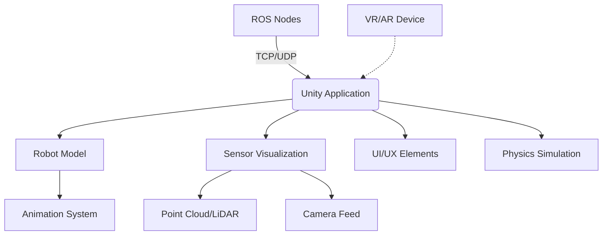

# Chapter 4: Unity Robotics Visualization

## Summary
This chapter covers Unity's role in robotics visualization, including the Unity Robotics Hub, ROS# integration, and how to create high-fidelity visualizations for humanoid robots.

## Learning Objectives
By the end of this chapter, you will be able to:
- Set up Unity for robotics visualization projects
- Integrate Unity with ROS using ROS# or ROS TCP Connector
- Create realistic visualizations for humanoid robots
- Implement sensor visualization in Unity
- Deploy Unity robotics visualizations

## Core Theory

### Unity in Robotics
Unity provides high-fidelity visualization for robotics applications:
- **Photorealistic Rendering**: Advanced lighting and materials
- **VR/AR Support**: Immersive visualization capabilities
- **Real-time Simulation**: Interactive environments
- **Cross-platform Deployment**: Desktop, mobile, and VR devices

### Unity Robotics Hub
The Unity Robotics Hub provides:
- **Robotics Library**: Utilities for robotics development
- **Samples**: Pre-built robotics examples
- **Documentation**: Best practices for robotics in Unity
- **Tools**: Visualization and debugging utilities

### ROS Integration Approaches
- **ROS#**: Native Unity-C# ROS bridge
- **ROS TCP Connector**: Generic TCP-based connector
- **Custom Bridge**: Specialized communication protocols
- **Asset Store Packages**: Third-party solutions

### Visualization Components
- **Cameras**: Multiple viewpoints for robot monitoring
- **Sensors**: Visual representations of sensor data
- **Markers**: Visualization aids for debugging
- **Interactions**: User interaction with robot models

## Practical Examples

### Unity ROS# Connection Example
```csharp
using System.Collections;
using System.Collections.Generic;
using UnityEngine;
using ROS2;

public class UnityRobotController : MonoBehaviour
{
    private ROS2UnityComponent ros2;
    private ROS2Socket ros2Socket;
    private string topicName = "unity_robot_pose";
    private UDPManager udpManager;

    void Start()
    {
        // Initialize ROS2 component
        ros2 = GetComponent<ROS2UnityComponent>();
        ros2.Init();

        // Create socket for communication
        ros2Socket = ros2.CreateSocket(Ros2SocketType.TCPROS);

        // Connect to ROS master (adjust IP and port as needed)
        ros2Socket.Connect("127.0.0.1", 11311);

        // Subscribe to robot pose topic
        ros2Socket.Subscribe<ROS2.Standard.Msgs.PoseStamped>(
            "robot_pose",
            ReceivePoseCallback
        );
    }

    void Update()
    {
        // Send robot pose to ROS
        var pose = transform.position;
        var rotation = transform.rotation;

        // Publish pose to ROS topic
        var poseMsg = new ROS2.Standard.Msgs.PoseStamped();
        poseMsg.header.stamp = new ROS2.Standard.Msgs.TimeStamp();
        poseMsg.header.frame_id = "unity_world";
        poseMsg.pose.position.x = pose.x;
        poseMsg.pose.position.y = pose.y;
        poseMsg.pose.position.z = pose.z;
        poseMsg.pose.orientation.x = rotation.x;
        poseMsg.pose.orientation.y = rotation.y;
        poseMsg.pose.orientation.z = rotation.z;
        poseMsg.pose.orientation.w = rotation.w;

        ros2Socket.Publish(topicName, poseMsg);
    }

    void ReceivePoseCallback(ROS2.Standard.Msgs.PoseStamped msg)
    {
        // Update robot position based on received pose
        Vector3 newPosition = new Vector3(
            msg.pose.position.x,
            msg.pose.position.y,
            msg.pose.position.z
        );

        Quaternion newRotation = new Quaternion(
            msg.pose.orientation.x,
            msg.pose.orientation.y,
            msg.pose.orientation.z,
            msg.pose.orientation.w
        );

        transform.position = newPosition;
        transform.rotation = newRotation;
    }

    void OnDestroy()
    {
        // Clean up ROS connections
        if (ros2Socket != null)
        {
            ros2Socket.Dispose();
        }
    }
}
```

### Unity Sensor Visualization Example
```csharp
using System.Collections;
using System.Collections.Generic;
using UnityEngine;
using ROS2;

public class SensorVisualizer : MonoBehaviour
{
    public LineRenderer lidarLineRenderer;
    public GameObject cameraFeedDisplay;
    public Material pointCloudMaterial;

    private ROS2Socket ros2Socket;
    private List<Vector3> lidarPoints = new List<Vector3>();

    void Start()
    {
        // Initialize ROS connection
        ros2Socket = GetComponent<ROS2UnityComponent>().CreateSocket(Ros2SocketType.TCPROS);
        ros2Socket.Connect("127.0.0.1", 11311);

        // Subscribe to sensor topics
        ros2Socket.Subscribe<ROS2.Sensor.Msgs.LaserScan>(
            "scan",
            ProcessLidarData
        );

        ros2Socket.Subscribe<ROS2.Sensor.Msgs.Image>(
            "camera/image_raw",
            ProcessCameraImage
        );
    }

    void ProcessLidarData(ROS2.Sensor.Msgs.LaserScan scan)
    {
        // Convert LiDAR scan to Unity world coordinates
        lidarPoints.Clear();

        for (int i = 0; i < scan.ranges.Count; i++)
        {
            float angle = scan.angle_min + (i * scan.angle_increment);
            float distance = scan.ranges[i];

            if (distance >= scan.range_min && distance <= scan.range_max)
            {
                Vector3 point = new Vector3(
                    Mathf.Cos(angle) * distance,
                    0, // Height
                    Mathf.Sin(angle) * distance
                );
                lidarPoints.Add(point);
            }
        }

        // Update line renderer with LiDAR data
        UpdateLidarVisualization();
    }

    void ProcessCameraImage(ROS2.Sensor.Msgs.Image image)
    {
        // Process camera image for display
        Texture2D texture = new Texture2D(image.width, image.height, TextureFormat.RGB24, false);

        // Convert ROS image data to Unity texture
        Color32[] colors = new Color32[image.data.Count];
        for (int i = 0; i < image.data.Count; i += 3)
        {
            colors[i/3] = new Color32(
                image.data[i],     // R
                image.data[i+1],   // G
                image.data[i+2],   // B
                255                // A
            );
        }

        texture.SetPixels32(colors);
        texture.Apply();

        // Apply texture to material/display
        if (cameraFeedDisplay.GetComponent<Renderer>() != null)
        {
            cameraFeedDisplay.GetComponent<Renderer>().material.mainTexture = texture;
        }
    }

    void UpdateLidarVisualization()
    {
        if (lidarLineRenderer != null && lidarPoints.Count > 0)
        {
            lidarLineRenderer.positionCount = lidarPoints.Count;
            lidarLineRenderer.SetPositions(lidarPoints.ToArray());
        }
    }
}
```

### Unity Humanoid Animation Controller
```csharp
using System.Collections;
using System.Collections.Generic;
using UnityEngine;
using ROS2;

public class HumanoidAnimator : MonoBehaviour
{
    public Animator animator;
    public Transform[] jointTransforms; // Array of joint transforms

    private ROS2Socket ros2Socket;

    void Start()
    {
        // Initialize ROS connection
        ros2Socket = GetComponent<ROS2UnityComponent>().CreateSocket(Ros2SocketType.TCPROS);
        ros2Socket.Connect("127.0.0.1", 11311);

        // Subscribe to joint state topic
        ros2Socket.Subscribe<ROS2.Sensor.Msgs.JointState>(
            "joint_states",
            ProcessJointStates
        );
    }

    void ProcessJointStates(ROS2.Sensor.Msgs.JointState jointState)
    {
        // Update humanoid joints based on ROS joint states
        for (int i = 0; i < jointState.name.Count; i++)
        {
            string jointName = jointState.name[i];
            float jointPosition = jointState.position[i];

            // Find corresponding joint in Unity model
            Transform jointTransform = FindJointByName(jointName);
            if (jointTransform != null)
            {
                // Update joint rotation based on position
                // Convert ROS joint position to Unity rotation
                jointTransform.localRotation = Quaternion.Euler(0, jointPosition * Mathf.Rad2Deg, 0);
            }
        }
    }

    Transform FindJointByName(string jointName)
    {
        foreach (Transform joint in jointTransforms)
        {
            if (joint.name == jointName)
                return joint;
        }
        return null;
    }
}
```

## Diagrams

### Unity-ROS Integration Architecture


## Exercises

1. Create a Unity scene with a humanoid robot model
2. Implement ROS connection to receive joint states
3. Add sensor visualization (LiDAR points, camera feed)
4. Deploy the Unity application for robot monitoring

## Quiz

1. What are the two main approaches for ROS integration in Unity?
2. What is the purpose of the Unity Robotics Hub?
3. How can Unity be used for VR/AR robot teleoperation?

## References
- [Unity Robotics Hub](https://github.com/Unity-Technologies/Unity-Robotics-Hub)
- [ROS# Documentation](https://github.com/siemens/ros-sharp)
- [Unity Manual](https://docs.unity3d.com/Manual/index.html)