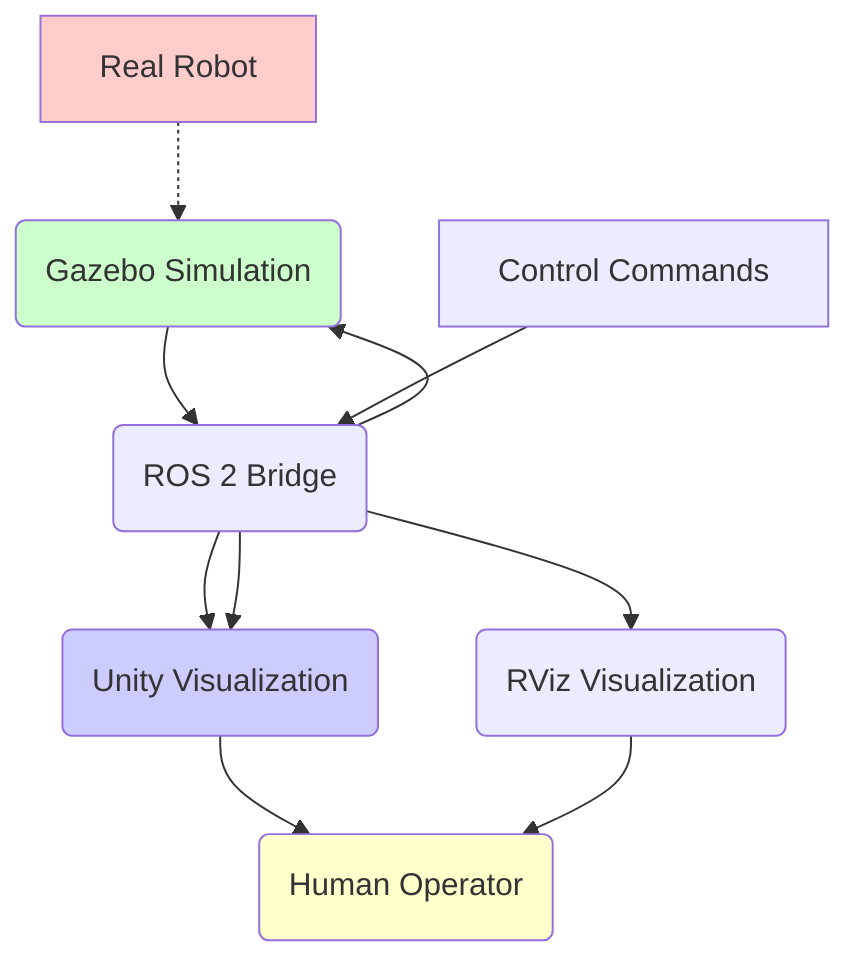

# Chapter 5: Integrating ROS 2 Nodes with Gazebo and Unity

## Summary
This chapter covers the integration of ROS 2 nodes with both Gazebo simulation and Unity visualization, creating a complete digital twin pipeline for humanoid robotics.

## Learning Objectives
By the end of this chapter, you will be able to:
- Establish communication between ROS 2, Gazebo, and Unity
- Create a unified simulation and visualization pipeline
- Implement bidirectional data flow between simulation and visualization
- Synchronize robot states across multiple platforms
- Build a complete digital twin system for humanoid robots

## Core Theory

### Digital Twin Architecture
A digital twin for robotics involves:
- **Physical System**: The real robot (or simulation)
- **Virtual System**: The digital representation (Unity visualization)
- **Data Connection**: Communication layer (ROS 2 topics/services)
- **Synchronization**: Real-time updates between systems

### Multi-Platform Integration
- **ROS 2**: Communication and coordination layer
- **Gazebo**: Physics-based simulation
- **Unity**: High-fidelity visualization
- **Synchronization**: Keeping all systems in sync

### Communication Patterns
- **ROS 2 Topics**: Streaming data between systems
- **ROS 2 Services**: Request/response for configuration
- **ROS 2 Actions**: Long-running tasks with feedback
- **Custom Messages**: Specialized data structures

### Timing and Synchronization
- **Clock Management**: Ensuring synchronized time across platforms
- **Rate Control**: Managing update frequencies
- **Latency Compensation**: Handling communication delays
- **State Prediction**: Predicting states during high-latency periods

## Practical Examples

### ROS 2 Bridge Package for Gazebo-Unity Integration
```python
#!/usr/bin/env python3
"""
ROS 2 Bridge for Gazebo-Unity Integration
This script synchronizes robot states between Gazebo simulation and Unity visualization.
"""
import rclpy
from rclpy.node import Node
from sensor_msgs.msg import JointState
from geometry_msgs.msg import PoseStamped, Twist
from nav_msgs.msg import Odometry
from std_msgs.msg import Float32MultiArray
from tf2_ros import TransformBroadcaster
import numpy as np
import math

class GazeboUnityBridge(Node):
    def __init__(self):
        super().__init__('gazebo_unity_bridge')

        # Publishers for Unity visualization
        self.unity_joint_pub = self.create_publisher(Float32MultiArray, '/unity/joint_states', 10)
        self.unity_pose_pub = self.create_publisher(PoseStamped, '/unity/robot_pose', 10)

        # Subscribers from Gazebo simulation
        self.gazebo_joint_sub = self.create_subscription(
            JointState, '/joint_states', self.joint_state_callback, 10)
        self.gazebo_odom_sub = self.create_subscription(
            Odometry, '/odom', self.odom_callback, 10)

        # TF broadcaster for visualization
        self.tf_broadcaster = TransformBroadcaster(self)

        # Timer for synchronization
        self.sync_timer = self.create_timer(0.05, self.synchronization_callback)  # 20 Hz

        # Robot state storage
        self.current_joint_states = JointState()
        self.current_odom = Odometry()
        self.last_sync_time = self.get_clock().now()

        self.get_logger().info("Gazebo-Unity Bridge initialized")

    def joint_state_callback(self, msg):
        """Receive joint states from Gazebo"""
        self.current_joint_states = msg
        self.get_logger().debug(f"Received joint states: {len(msg.position)} joints")

    def odom_callback(self, msg):
        """Receive odometry from Gazebo"""
        self.current_odom = msg
        self.get_logger().debug(f"Received odometry: {msg.pose.pose}")

    def synchronization_callback(self):
        """Synchronize data between Gazebo and Unity"""
        current_time = self.get_clock().now()

        # Publish joint states to Unity
        joint_array = Float32MultiArray()
        joint_array.data = list(self.current_joint_states.position)
        self.unity_joint_pub.publish(joint_array)

        # Publish pose to Unity
        pose_msg = PoseStamped()
        pose_msg.header.stamp = current_time.to_msg()
        pose_msg.header.frame_id = "map"
        pose_msg.pose = self.current_odom.pose.pose
        self.unity_pose_pub.publish(pose_msg)

        # Broadcast transforms for visualization
        self.broadcast_transforms()

        # Log synchronization
        self.get_logger().debug(f"Synchronized at {current_time.nanoseconds}")

    def broadcast_transforms(self):
        """Broadcast transforms for visualization"""
        # Robot base transform
        t = self.current_odom
        transform_stamped = TransformStamped()
        transform_stamped.header.stamp = self.get_clock().now().to_msg()
        transform_stamped.header.frame_id = "map"
        transform_stamped.child_frame_id = "base_link"
        transform_stamped.transform.translation.x = t.pose.pose.position.x
        transform_stamped.transform.translation.y = t.pose.pose.position.y
        transform_stamped.transform.translation.z = t.pose.pose.position.z
        transform_stamped.transform.rotation = t.pose.pose.orientation

        self.tf_broadcaster.sendTransform(transform_stamped)

def main(args=None):
    rclpy.init(args=args)
    bridge = GazeboUnityBridge()

    try:
        rclpy.spin(bridge)
    except KeyboardInterrupt:
        bridge.get_logger().info("Shutting down Gazebo-Unity Bridge")
    finally:
        bridge.destroy_node()
        rclpy.shutdown()

if __name__ == '__main__':
    main()
```

### Unity ROS TCP Connector Integration
```csharp
using System.Collections;
using System.Collections.Generic;
using UnityEngine;
using RosSharp.RosBridgeClient;

public class UnityGazeboSync : MonoBehaviour
{
    public string rosBridgeServerURL = "ws://127.0.0.1:9090";
    private RosSocket rosSocket;

    // Robot joint transforms
    public Transform[] jointTransforms;
    public string[] jointNames;

    // Publishers and Subscribers
    private Publisher<Float32MultiArray> unityJointPublisher;
    private Subscriber<PoseStamped> robotPoseSubscriber;
    private Subscriber<Odometry> robotOdomSubscriber;

    void Start()
    {
        // Connect to ROS Bridge
        WebSocketNativeClient webSocket = new WebSocketNativeClient(rosBridgeServerURL);
        rosSocket = new RosSocket(webSocket);

        // Initialize publishers and subscribers
        InitializePublishersSubscribers();
    }

    void InitializePublishersSubscribers()
    {
        // Publisher for Unity joint states
        unityJointPublisher = rosSocket.Advertise<Float32MultiArray>("/unity/joint_states");

        // Subscribers for robot data from Gazebo
        robotPoseSubscriber = rosSocket.Subscribe<PoseStamped>("/unity/robot_pose", OnRobotPoseReceived);
        robotOdomSubscriber = rosSocket.Subscribe<Odometry>("/odom", OnRobotOdomReceived);

        Debug.Log("ROS Bridge connections established");
    }

    void Update()
    {
        // Periodically send joint states from Unity
        if (Time.time % 0.1f < Time.deltaTime) // Every 100ms
        {
            PublishJointStates();
        }
    }

    void PublishJointStates()
    {
        // Collect joint angles from Unity transforms
        float[] jointAngles = new float[jointTransforms.Length];
        for (int i = 0; i < jointTransforms.Length; i++)
        {
            // Convert Unity rotation to ROS joint angle
            jointAngles[i] = jointTransforms[i].localEulerAngles.y * Mathf.Deg2Rad;
        }

        // Create and publish Float32MultiArray message
        Float32MultiArray jointMsg = new Float32MultiArray();
        jointMsg.data = jointAngles;

        unityJointPublisher.Publish(jointMsg);
    }

    void OnRobotPoseReceived(PoseStamped poseMsg)
    {
        // Update robot position in Unity based on Gazebo simulation
        Vector3 position = new Vector3(
            (float)poseMsg.pose.position.x,
            (float)poseMsg.pose.position.z, // Unity Y is up
            (float)poseMsg.pose.position.y
        );

        Quaternion rotation = new Quaternion(
            (float)poseMsg.pose.orientation.x,
            (float)poseMsg.pose.orientation.z,
            (float)poseMsg.pose.orientation.y,
            (float)poseMsg.pose.orientation.w
        );

        transform.position = position;
        transform.rotation = rotation;
    }

    void OnRobotOdomReceived(Odometry odomMsg)
    {
        // Update robot odometry visualization
        // Similar to pose update but with velocity information
        OnRobotPoseReceived(new PoseStamped { pose = odomMsg.pose.pose });
    }

    void OnDestroy()
    {
        if (rosSocket != null)
        {
            rosSocket.Close();
        }
    }
}
```

### Configuration Launch File
```xml
<launch>
  <!-- Arguments -->
  <arg name="world" default="simple_world"/>
  <arg name="use_sim_time" default="true"/>
  <arg name="robot_namespace" default="humanoid_robot"/>

  <!-- Gazebo server -->
  <include file="$(find gazebo_ros)/launch/empty_world.launch">
    <arg name="world_name" value="$(find my_robot_description)/worlds/$(var world).world"/>
    <arg name="paused" value="false"/>
    <arg name="use_sim_time" value="$(var use_sim_time)"/>
    <arg name="gui" value="true"/>
    <arg name="headless" value="false"/>
    <arg name="debug" value="false"/>
  </include>

  <!-- Robot state publisher -->
  <node name="robot_state_publisher" pkg="robot_state_publisher" type="robot_state_publisher"
        respawn="false" output="screen">
    <param name="use_sim_time" value="$(var use_sim_time)"/>
  </node>

  <!-- Spawn robot in Gazebo -->
  <node name="spawn_urdf" pkg="gazebo_ros" type="spawn_entity.py"
        args="-entity $(var robot_namespace) -file $(find my_robot_description)/urdf/humanoid.urdf -x 0 -y 0 -z 1"/>

  <!-- Gazebo-Unity bridge -->
  <node name="gazebo_unity_bridge" pkg="my_robot_bringup" type="gazebo_unity_bridge.py"
        respawn="true" output="screen"/>

  <!-- ROS Bridge Server for Unity -->
  <node name="rosbridge_websocket" pkg="rosbridge_server" type="rosbridge_websocket"
        respawn="true" output="screen">
    <param name="port" value="9090"/>
  </node>

  <!-- Joint state publisher (GUI) -->
  <node name="joint_state_publisher_gui" pkg="joint_state_publisher_gui"
        type="joint_state_publisher_gui" respawn="true" output="screen"/>

  <!-- Controllers -->
  <node name="controller_manager" pkg="controller_manager" type="ros2_control_node"
        respawn="false" output="screen">
    <remap from="/controller_manager/robot_description" to="robot_description"/>
  </node>
</launch>
```

## Diagrams

### Digital Twin Integration Architecture


## Exercises

1. Implement a complete Gazebo-Unity-ROS integration for a humanoid robot
2. Create bidirectional communication between all three systems
3. Add visualization of sensor data in Unity
4. Test synchronization performance between systems

## Quiz

1. What are the three main components of a digital twin system?
2. What is the purpose of the ROS Bridge in Unity integration?
3. How do you handle timing synchronization between different simulation platforms?

## References
- [ROS Bridge Suite](http://wiki.ros.org/rosbridge_suite)
- [Unity Robotics Integration](https://github.com/Unity-Technologies/Unity-Robotics-Hub)
- [Gazebo-ROS Integration](https://github.com/ros-simulation/gazebo_ros_pkgs)