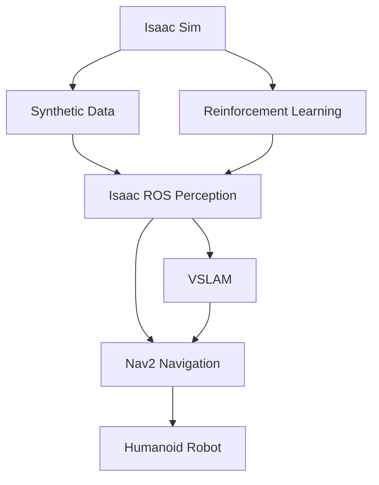

# Module 3: The AI-Robot Brain (NVIDIA Isaac™)

## Summary
This module covers advanced perception and training for humanoid robots using NVIDIA Isaac ecosystem. You'll learn about Isaac Sim for photorealistic simulation, Isaac ROS for hardware-accelerated perception, and Nav2 for path planning in humanoid navigation.

## Learning Objectives
By the end of this module, you will be able to:
- Use NVIDIA Isaac Sim for photorealistic simulation and synthetic data generation
- Implement perception pipelines using Isaac ROS
- Apply Visual SLAM (VSLAM) concepts for humanoid navigation
- Train AI models in simulation for humanoid locomotion
- Use Nav2 for bipedal path planning in humanoid robots

## Core Theory

### NVIDIA Isaac Sim Foundations
Isaac Sim is NVIDIA's robotics simulator that provides:
- Photorealistic rendering for synthetic data generation
- Physically accurate simulation with NVIDIA PhysX
- Integration with Isaac ROS for perception and navigation
- Support for reinforcement learning environments

### Perception Pipelines in Isaac ROS
Isaac ROS provides hardware-accelerated perception nodes including:
- Visual SLAM for mapping and localization
- Stereo Disparity for depth estimation
- AprilTag Detection for fiducial marker tracking
- Image Scale and Crop for preprocessing
- ROS Bridge for communication

### VSLAM and Navigation
Visual SLAM combines visual input with motion data to estimate position and map the environment. For humanoid robots, this involves:
- Feature detection and tracking
- Pose estimation
- Map building
- Path planning for bipedal locomotion

### Training AI Models in Simulation
Simulation provides a safe environment for training AI models:
- Reinforcement learning for locomotion
- Synthetic data generation for perception
- Sim-to-real transfer techniques
- Safe testing of complex behaviors

### Bipedal Path Planning with Nav2
Nav2 provides navigation capabilities adapted for humanoid robots:
- Costmap management for bipedal movement
- Path planning algorithms suitable for two-legged locomotion
- Controller integration for humanoid-specific movement

## Practical Examples

### Isaac Sim Python API Example
```python
import omni
from omni.isaac.kit import SimulationApp

# Start the simulation app
config = {"headless": False}
simulation_app = SimulationApp(config)

# Import necessary modules
from omni.isaac.core import World
from omni.isaac.core.utils.stage import add_reference_to_stage
from omni.isaac.core.utils.nucleus import get_assets_root_path

# Create a world
world = World(stage_units_in_meters=1.0)

# Add robot to the stage
assets_root_path = get_assets_root_path()
if assets_root_path is None:
    carb.log_error("Could not find Isaac Sim assets folder")

add_reference_to_stage(
    usd_path=assets_root_path + "/Isaac/Robots/Franka/franka.usd",
    prim_path="/World/Robot"
)

# Simulate
for i in range(500):
    world.step(render=True)

simulation_app.close()
```

### Isaac ROS Perception Pipeline Example
```python
import rclpy
from rclpy.node import Node
from sensor_msgs.msg import Image
from cv_bridge import CvBridge
import cv2

class IsaacPerceptionNode(Node):
    def __init__(self):
        super().__init__('isaac_perception_node')
        self.subscription = self.create_subscription(
            Image,
            '/camera/color/image_raw',
            self.image_callback,
            10)
        self.publisher = self.create_publisher(Image, '/processed_image', 10)
        self.bridge = CvBridge()

    def image_callback(self, msg):
        # Convert ROS Image message to OpenCV image
        cv_image = self.bridge.imgmsg_to_cv2(msg, desired_encoding='bgr8')

        # Apply perception processing (e.g., feature detection)
        processed_image = self.process_image(cv_image)

        # Convert back to ROS Image message
        processed_msg = self.bridge.cv2_to_imgmsg(processed_image, encoding='bgr8')
        self.publisher.publish(processed_msg)

    def process_image(self, image):
        # Example: Apply edge detection
        gray = cv2.cvtColor(image, cv2.COLOR_BGR2GRAY)
        edges = cv2.Canny(gray, 50, 150)
        return cv2.cvtColor(edges, cv2.COLOR_GRAY2BGR)
```

## Diagrams

### Isaac Ecosystem Architecture


## Exercises

1. Set up Isaac Sim and create a simple humanoid robot simulation
2. Implement a perception pipeline using Isaac ROS components
3. Create a VSLAM node that estimates robot position in simulation
4. Configure Nav2 for bipedal path planning with custom costmaps

## Quiz

1. What is the primary advantage of Isaac Sim over traditional simulators?
2. Name three Isaac ROS perception components.
3. How does VSLAM differ from traditional SLAM for humanoid robots?

## References
- [NVIDIA Isaac Sim Documentation](https://docs.omniverse.nvidia.com/isaacsim/latest/isaacsim.html)
- [Isaac ROS Documentation](https://nvidia-isaac-ros.github.io/)
- [Nav2 Documentation](https://navigation.ros.org/)