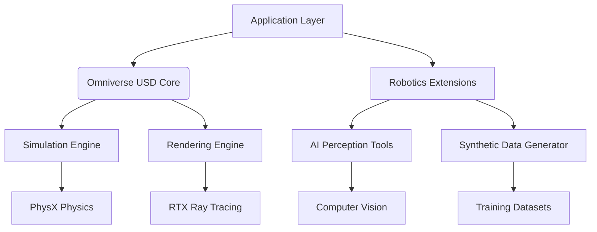

# Chapter 1: NVIDIA Isaac Sim Foundations

## Learning Objectives
By the end of this chapter, you will be able to:
- Install and configure NVIDIA Isaac Sim for robotics development
- Understand the Omniverse platform architecture
- Create basic robotic scenes in Isaac Sim
- Configure photorealistic rendering pipelines
- Generate synthetic datasets for AI training
- Run safe simulated humanoid robots

## Core Theory

### Isaac Sim Overview
NVIDIA Isaac Sim is built on the Omniverse platform and provides:
- **Photorealistic Rendering**: Physically-based rendering for realistic simulation
- **Synthetic Data Generation**: Large-scale data generation for AI training
- **Hardware Acceleration**: GPU-accelerated physics and rendering
- **Robotics Framework**: Built-in robotics libraries and tools
- **Extension System**: Modular architecture for custom functionality

### Omniverse Platform Architecture
- **USD (Universal Scene Description)**: Core data model for 3D scenes
- **Connectors**: Real-time collaboration between applications
- **Simulation Engine**: PhysX physics engine integration
- **Rendering Engine**: RTX ray tracing for photorealistic graphics
- **Extension Framework**: Python and C++ extensibility

### Photorealistic Simulation Benefits
- **Domain Randomization**: Varying visual conditions for robust AI
- **Synthetic Data**: Unlimited training data without real-world collection
- **Safety**: Risk-free testing of complex behaviors
- **Scalability**: Parallel simulation across multiple GPUs
- **Consistency**: Controlled experimental conditions

### Synthetic Data Generation
- **Ground Truth**: Perfect annotations for training data
- **Variety**: Infinite combinations of objects, lighting, textures
- **Efficiency**: Faster data generation than real-world collection
- **Quality**: Consistent, high-quality images and annotations
- **Cost**: Reduced annotation and collection costs

## Practical Examples

### Isaac Sim Python API Example
```python
import omni
from omni.isaac.kit import SimulationApp

# Start the simulation app
config = {"headless": False}  # Set to True for headless operation
simulation_app = SimulationApp(config)

# Import necessary modules
from omni.isaac.core import World
from omni.isaac.core.utils.stage import add_reference_to_stage
from omni.isaac.core.utils.nucleus import get_assets_root_path
from omni.isaac.core.utils.prims import create_prim
from omni.isaac.core.objects import DynamicCuboid
from pxr import UsdPhysics

# Create a world
world = World(stage_units_in_meters=1.0)

# Get assets root path
assets_root_path = get_assets_root_path()
if assets_root_path is None:
    print("Could not find Isaac Sim assets folder")

# Add a robot to the stage
robot_path = assets_root_path + "/Isaac/Robots/Franka/franka_alt_fingers.usd"
add_reference_to_stage(usd_path=robot_path, prim_path="/World/Robot")

# Add some objects to interact with
world.scene.add(
    DynamicCuboid(
        prim_path="/World/Cube",
        name="cube",
        position=[0.5, 0.5, 0.5],
        size=0.1,
        mass=0.1,
        color=[0.8, 0.1, 0.1]
    )
)

# Add ground plane
create_prim(
    prim_path="/World/GroundPlane",
    prim_type="Plane",
    position=[0, 0, 0],
    scale=[10, 10, 1],
    orientation=[0, 0, 0, 1]
)

# Enable physics
world.enable_physics()

# Simulate
for i in range(500):
    world.step(render=True)
    if i % 100 == 0:
        print(f"Simulation step: {i}")

# Shutdown
simulation_app.close()
```

### Isaac Sim Extension Example
```python
import omni.ui as ui
from omni.isaac.core.utils.stage import add_reference_to_stage
from omni.isaac.core.utils.nucleus import get_assets_root_path
from omni.kit.menu.utils import MenuItemDescription, add_menu_items, remove_menu_items
import omni.ext

class IsaacSimTutorialExtension(omni.ext.IExt):
    def on_startup(self, ext_id):
        print("[isaac.sim.tutorial] Isaac Sim Tutorial Startup")

        # Add menu item
        self._menu_items = [
            MenuItemDescription(
                name="Isaac Sim Tutorial",
                onclick_fn=self._on_tutorial_menu_clicked
            )
        ]
        add_menu_items(self._menu_items, "Isaac Sim")

    def on_shutdown(self):
        print("[isaac.sim.tutorial] Isaac Sim Tutorial Shutdown")
        remove_menu_items(self._menu_items, "Isaac Sim")

    def _on_tutorial_menu_clicked(self):
        # Add a robot to the stage when menu clicked
        assets_root_path = get_assets_root_path()
        if assets_root_path:
            robot_path = assets_root_path + "/Isaac/Robots/Franka/franka.usd"
            add_reference_to_stage(usd_path=robot_path, prim_path="/World/MenuRobot")
            print("Added robot from menu!")
```

### Synthetic Data Generation Pipeline
```python
import omni
from omni.isaac.kit import SimulationApp
from omni.replicator.core import Replicator
import numpy as np

# Start simulation app
config = {"headless": True}
simulation_app = SimulationApp(config)

# Initialize replicator
replicator = Replicator()

# Set up the annotators
from omni.replicator.isaac.scripts.annotators import *
from omni.replicator.core import random_colormap

# Attach annotators to camera
camera_prim_path = "/World/Camera"
replicator.attach_annotator(camera_prim_path, "rgb")
replicator.attach_annotator(camera_prim_path, "depth", device="cpu")
replicator.attach_annotator(camera_prim_path, "bounding_box_2d_tight")

# Set up domain randomization
from omni.replicator.isaac.scripts.domain_randomization import *

# Randomize materials
randomize_materials = [
    "Material1", "Material2", "Material3"
]

# Generate synthetic dataset
def generate_dataset(num_samples=1000):
    for i in range(num_samples):
        # Randomize environment
        randomize_scene()

        # Capture data
        data = replicator.get_data(camera_prim_path)

        # Save data
        save_data(data, f"synthetic_data_{i}.npz")

        print(f"Generated sample {i+1}/{num_samples}")

def randomize_scene():
    """Randomize scene properties for domain randomization"""
    # Randomize lighting
    # Randomize object positions
    # Randomize textures
    pass

def save_data(data, filename):
    """Save synthetic data to file"""
    np.savez_compressed(filename, **data)

# Run data generation
generate_dataset(1000)

simulation_app.close()
```

## Diagrams

### Isaac Sim Architecture


## Exercises

1. Install Isaac Sim and run the basic example
2. Create a simple humanoid robot scene
3. Implement a basic synthetic data generation pipeline
4. Experiment with domain randomization techniques

## Quiz

1. What is USD and why is it important for Isaac Sim?
2. What are the benefits of synthetic data generation for AI training?
3. How does Isaac Sim utilize GPU acceleration?

## Summary

This chapter provided a comprehensive introduction to NVIDIA Isaac Sim, a powerful simulation environment built on the Omniverse platform for developing AI-powered robotic systems. We explored the fundamental concepts of USD (Universal Scene Description) and how Isaac Sim leverages GPU acceleration for photorealistic rendering and physics simulation.

Key concepts covered include:
- The USD framework and its role in creating complex 3D scenes and robotic environments
- Synthetic data generation capabilities for AI training and testing
- GPU-accelerated physics simulation and rendering for realistic robot interactions
- Integration with ROS 2 and other robotics frameworks
- Best practices for creating simulation environments that closely match real-world conditions

The practical examples demonstrated how to set up Isaac Sim environments, configure physics properties, and generate synthetic data for AI training. The architecture patterns showed how to structure simulation assets for maximum reusability and performance.

These simulation capabilities are essential for developing and testing AI-powered robotic systems before deployment to real hardware, enabling safer and more cost-effective development processes. Isaac Sim's advanced rendering and physics capabilities allow for the creation of highly realistic training environments that can significantly improve the performance of AI models in real-world applications.

## References
- [NVIDIA Isaac Sim Documentation](https://docs.omniverse.nvidia.com/isaacsim/latest/isaacsim.html)
- [Omniverse Documentation](https://docs.omniverse.nvidia.com/)
- [Isaac Sim Tutorials](https://docs.omniverse.nvidia.com/isaacsim/latest/tutorial_intro.html)