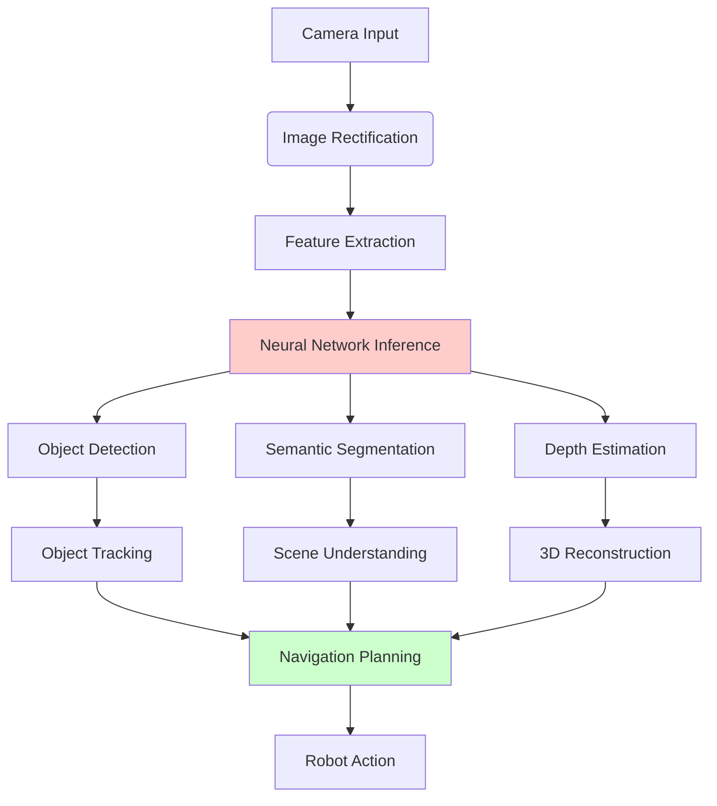

# Chapter 2: Perception Pipelines in Isaac ROS

## Summary
This chapter covers Isaac ROS (Robotics Sensors) packages that provide hardware-accelerated perception pipelines for robot perception and navigation, including integration with NVIDIA GPU acceleration.

## Learning Objectives
By the end of this chapter, you will be able to:
- Install and configure Isaac ROS packages
- Implement hardware-accelerated perception pipelines
- Integrate Isaac ROS with standard ROS 2 perception workflows
- Use GPU-accelerated computer vision algorithms
- Build perception pipelines for humanoid robots
- Integrate with Isaac Sim for simulation

## Core Theory

### Isaac ROS Overview
Isaac ROS provides hardware-accelerated perception algorithms:
- **GPU Acceleration**: Leverages NVIDIA GPUs for performance
- **CUDA Optimization**: CUDA-accelerated computer vision
- **TensorRT Integration**: Optimized inference for neural networks
- **Standard ROS 2 Interfaces**: Compatible with ROS 2 ecosystem
- **Real-time Performance**: Optimized for real-time robotics applications

### Perception Pipeline Components
- **Image Acquisition**: Camera drivers and image preprocessing
- **Feature Detection**: GPU-accelerated feature extraction
- **Stereo Processing**: Depth estimation and disparity maps
- **Object Detection**: Neural network-based object detection
- **Semantic Segmentation**: Pixel-level scene understanding
- **SLAM Integration**: Localization and mapping algorithms

### GPU Acceleration Benefits
- **Performance**: Significantly faster processing than CPU
- **Power Efficiency**: Better performance per watt on NVIDIA GPUs
- **Real-time Processing**: Enables real-time perception for robotics
- **Complex Algorithms**: Makes computationally intensive algorithms feasible

### Isaac ROS Packages
- **Isaac ROS Apriltag**: GPU-accelerated fiducial detection
- **Isaac ROS Stereo Dense Reconstruction**: Depth estimation
- **Isaac ROS Visual Slam**: Visual-inertial SLAM
- **Isaac ROS Image Pipeline**: Image preprocessing and rectification
- **Isaac ROS Detection NITROS**: Neural inference with TensorRT

## Practical Examples

### Isaac ROS Stereo Dense Reconstruction Example
```python
import rclpy
from rclpy.node import Node
from sensor_msgs.msg import Image, CameraInfo
from stereo_msgs.msg import DisparityImage
import cv2
from cv_bridge import CvBridge
import numpy as np

class IsaacStereoProcessor(Node):
    def __init__(self):
        super().__init__('isaac_stereo_processor')

        # Publishers and subscribers
        self.left_sub = self.create_subscription(
            Image, '/camera/left/image_rect_color', self.left_callback, 10)
        self.right_sub = self.create_subscription(
            Image, '/camera/right/image_rect_color', self.right_callback, 10)
        self.disparity_pub = self.create_publisher(
            DisparityImage, '/stereo/disparity', 10)

        # Camera info subscribers
        self.left_info_sub = self.create_subscription(
            CameraInfo, '/camera/left/camera_info', self.left_info_callback, 10)
        self.right_info_sub = self.create_subscription(
            CameraInfo, '/camera/right/camera_info', self.right_info_callback, 10)

        # Internal buffers
        self.left_image = None
        self.right_image = None
        self.left_info = None
        self.right_info = None
        self.bridge = CvBridge()

        # Stereo matcher (GPU-accelerated in Isaac ROS)
        self.stereo_matcher = cv2.cuda.StereoBM_create(numDisparities=16, blockSize=15)
        # Note: In real Isaac ROS, this would use CUDA-accelerated stereo matching

    def left_callback(self, msg):
        """Process left camera image"""
        self.left_image = self.bridge.imgmsg_to_cv2(msg, desired_encoding='bgr8')
        self.process_stereo_if_ready()

    def right_callback(self, msg):
        """Process right camera image"""
        self.right_image = self.bridge.imgmsg_to_cv2(msg, desired_encoding='bgr8')
        self.process_stereo_if_ready()

    def left_info_callback(self, msg):
        """Process left camera info"""
        self.left_info = msg

    def right_info_callback(self, msg):
        """Process right camera info"""
        self.right_info = msg

    def process_stereo_if_ready(self):
        """Process stereo images if both are available"""
        if self.left_image is not None and self.right_image is not None:
            # Convert to grayscale
            left_gray = cv2.cvtColor(self.left_image, cv2.COLOR_BGR2GRAY)
            right_gray = cv2.cvtColor(self.right_image, cv2.COLOR_BGR2GRAY)

            # Compute disparity (in real Isaac ROS, this would be GPU accelerated)
            # For demonstration, using CPU version
            stereo = cv2.StereoBM_create(numDisparities=16, blockSize=15)
            disparity = stereo.compute(left_gray, right_gray)

            # Convert to float32 for ROS message
            disparity_float = disparity.astype(np.float32) / 16.0

            # Create disparity message
            disp_msg = DisparityImage()
            disp_msg.image = self.bridge.cv2_to_imgmsg(disparity_float, encoding='32FC1')
            disp_msg.header = self.left_image.header  # Would need proper header
            disp_msg.f = self.left_info.K[0] if self.left_info else 1.0  # Focal length
            disp_msg.T = 0.1  # Baseline (example value)
            disp_msg.valid_window.x_offset = 0
            disp_msg.valid_window.y_offset = 0
            disp_msg.valid_window.width = disparity.shape[1]
            disp_msg.valid_window.height = disparity.shape[0]

            # Publish disparity
            self.disparity_pub.publish(disp_msg)
            self.get_logger().info("Published disparity image")
```

### Isaac ROS AprilTag Detection Example
```python
import rclpy
from rclpy.node import Node
from sensor_msgs.msg import Image
from geometry_msgs.msg import PoseArray
from cv_bridge import CvBridge
import cv2
import numpy as np

class IsaacAprilTagDetector(Node):
    def __init__(self):
        super().__init__('isaac_apriltag_detector')

        # Subscribe to camera image
        self.image_sub = self.create_subscription(
            Image, '/camera/image_color', self.image_callback, 10)

        # Publish detected tags
        self.tag_pub = self.create_publisher(PoseArray, '/apriltags/poses', 10)

        # Internal variables
        self.bridge = CvBridge()

        # AprilTag detector parameters
        self.tag_family = 'tag36h11'  # Isaac ROS supports this family
        self.tag_size = 0.166  # Size of tag in meters

        # Camera intrinsic parameters (would come from camera_info in real use)
        self.camera_matrix = np.array([
            [615.167236, 0.0, 657.192444],
            [0.0, 615.167236, 387.718689],
            [0.0, 0.0, 1.0]
        ])

        self.dist_coeffs = np.array([0.0, 0.0, 0.0, 0.0, 0.0])

        # In real Isaac ROS, this would use GPU-accelerated AprilTag detection
        # For demonstration, we'll use the CPU version
        try:
            import pupil_apriltags as apriltag
            self.detector = apriltag.Detector(families=self.tag_family)
        except ImportError:
            self.get_logger().error("AprilTag detector not available")
            self.detector = None

    def image_callback(self, msg):
        """Process camera image for AprilTag detection"""
        if self.detector is None:
            return

        # Convert ROS image to OpenCV
        cv_image = self.bridge.imgmsg_to_cv2(msg, desired_encoding='bgr8')

        # Detect AprilTags (in real Isaac ROS, this would be GPU accelerated)
        gray = cv2.cvtColor(cv_image, cv2.COLOR_BGR2GRAY)
        detections = self.detector.detect(
            gray,
            estimate_tag_pose=True,
            camera_params=[self.camera_matrix[0,0], self.camera_matrix[1,1],
                         self.camera_matrix[0,2], self.camera_matrix[1,2]],
            tag_size=self.tag_size
        )

        # Create pose array for detected tags
        pose_array = PoseArray()
        pose_array.header = msg.header

        for detection in detections:
            # Extract pose from detection
            if hasattr(detection, 'pose_R') and hasattr(detection, 'pose_t'):
                pose = Pose()

                # Position (translation)
                pose.position.x = detection.pose_t[0][0]
                pose.position.y = detection.pose_t[1][0]
                pose.position.z = detection.pose_t[2][0]

                # Orientation (rotation matrix to quaternion)
                R = detection.pose_R
                # Convert rotation matrix to quaternion
                quat = self.rotation_matrix_to_quaternion(R)
                pose.orientation = quat

                pose_array.poses.append(pose)

        # Publish detected tags
        self.tag_pub.publish(pose_array)
        self.get_logger().info(f"Detected {len(detections)} AprilTags")

    def rotation_matrix_to_quaternion(self, R):
        """Convert 3x3 rotation matrix to quaternion"""
        import math

        # Compute quaternion from rotation matrix
        trace = np.trace(R)

        if trace > 0:
            s = math.sqrt(trace + 1.0) * 2  # s = 4 * qw
            qw = 0.25 * s
            qx = (R[2, 1] - R[1, 2]) / s
            qy = (R[0, 2] - R[2, 0]) / s
            qz = (R[1, 0] - R[0, 1]) / s
        elif R[0, 0] > R[1, 1] and R[0, 0] > R[2, 2]:
            s = math.sqrt(1.0 + R[0, 0] - R[1, 1] - R[2, 2]) * 2  # s = 4 * qx
            qw = (R[2, 1] - R[1, 2]) / s
            qx = 0.25 * s
            qy = (R[0, 1] + R[1, 0]) / s
            qz = (R[0, 2] + R[2, 0]) / s
        elif R[1, 1] > R[2, 2]:
            s = math.sqrt(1.0 + R[1, 1] - R[0, 0] - R[2, 2]) * 2  # s = 4 * qy
            qw = (R[0, 2] - R[2, 0]) / s
            qx = (R[0, 1] + R[1, 0]) / s
            qy = 0.25 * s
            qz = (R[1, 2] + R[2, 1]) / s
        else:
            s = math.sqrt(1.0 + R[2, 2] - R[0, 0] - R[1, 1]) * 2  # s = 4 * qz
            qw = (R[1, 0] - R[0, 1]) / s
            qx = (R[0, 2] + R[2, 0]) / s
            qy = (R[1, 2] + R[2, 1]) / s
            qz = 0.25 * s

        # Create quaternion message
        quat_msg = Quaternion()
        quat_msg.x = qx
        quat_msg.y = qy
        quat_msg.z = qz
        quat_msg.w = qw

        return quat_msg
```

### Isaac ROS Image Pipeline Example
```python
import rclpy
from rclpy.node import Node
from sensor_msgs.msg import Image, CameraInfo
from cv_bridge import CvBridge
import cv2
import numpy as np

class IsaacImagePipeline(Node):
    def __init__(self):
        super().__init__('isaac_image_pipeline')

        # Subscribe to raw image
        self.raw_image_sub = self.create_subscription(
            Image, '/camera/image_raw', self.raw_image_callback, 10)

        # Subscribe to camera info
        self.camera_info_sub = self.create_subscription(
            CameraInfo, '/camera/camera_info', self.camera_info_callback, 10)

        # Publishers for processed images
        self.rectified_pub = self.create_publisher(Image, '/camera/image_rect', 10)
        self.resized_pub = self.create_publisher(Image, '/camera/image_resized', 10)
        self.enhanced_pub = self.create_publisher(Image, '/camera/image_enhanced', 10)

        # Internal variables
        self.bridge = CvBridge()
        self.camera_matrix = None
        self.distortion_coeffs = None
        self.map1 = None
        self.map2 = None
        self.initialized = False

    def camera_info_callback(self, msg):
        """Process camera calibration info"""
        if self.initialized:
            return  # Only initialize once

        self.camera_matrix = np.array(msg.k).reshape((3, 3))
        self.distortion_coeffs = np.array(msg.d)

        # Create undistortion maps (in real Isaac ROS, this would be GPU accelerated)
        self.map1, self.map2 = cv2.initUndistortRectifyMap(
            self.camera_matrix,
            self.distortion_coeffs,
            None,  # R
            self.camera_matrix,
            (msg.width, msg.height),
            cv2.CV_32FC1
        )

        self.initialized = True
        self.get_logger().info("Camera calibration initialized")

    def raw_image_callback(self, msg):
        """Process raw camera image through pipeline"""
        if not self.initialized:
            return

        # Convert ROS image to OpenCV
        cv_image = self.bridge.imgmsg_to_cv2(msg, desired_encoding='bgr8')

        # Step 1: Rectify image (remove distortion)
        rectified_image = cv2.remap(
            cv_image,
            self.map1,
            self.map2,
            interpolation=cv2.INTER_LINEAR
        )

        # Step 2: Resize image
        resized_image = cv2.resize(rectified_image, (640, 480))

        # Step 3: Enhance image (contrast, brightness, etc.)
        enhanced_image = self.enhance_image(resized_image)

        # Publish processed images
        rectified_msg = self.bridge.cv2_to_imgmsg(rectified_image, encoding='bgr8')
        rectified_msg.header = msg.header
        self.rectified_pub.publish(rectified_msg)

        resized_msg = self.bridge.cv2_to_imgmsg(resized_image, encoding='bgr8')
        resized_msg.header = msg.header
        self.resized_pub.publish(resized_msg)

        enhanced_msg = self.bridge.cv2_to_imgmsg(enhanced_image, encoding='bgr8')
        enhanced_msg.header = msg.header
        self.enhanced_pub.publish(enhanced_msg)

        self.get_logger().info("Image pipeline processed frame")

    def enhance_image(self, image):
        """Apply image enhancement techniques"""
        # Convert to LAB for better enhancement
        lab = cv2.cvtColor(image, cv2.COLOR_BGR2LAB)

        # Apply CLAHE to L channel
        clahe = cv2.createCLAHE(clipLimit=2.0, tileGridSize=(8,8))
        lab[:,:,0] = clahe.apply(lab[:,:,0])

        # Convert back to BGR
        enhanced = cv2.cvtColor(lab, cv2.COLOR_LAB2BGR)

        return enhanced
```

## Diagrams

### Isaac ROS Perception Pipeline


## Exercises

1. Install Isaac ROS packages on your system
2. Create a perception pipeline that processes stereo images
3. Implement AprilTag detection using Isaac ROS
4. Build a complete perception pipeline for humanoid robot navigation

## Quiz

1. What are the main benefits of GPU acceleration in Isaac ROS?
2. Which Isaac ROS packages are commonly used for perception tasks?
3. How does Isaac ROS integrate with the standard ROS 2 ecosystem?

## References
- [Isaac ROS Documentation](https://nvidia-isaac-ros.github.io/)
- [Isaac ROS GitHub Repository](https://github.com/NVIDIA-ISAAC-ROS)
- [ROS 2 Perception Tutorials](https://docs.ros.org/en/humble/Tutorials.html#perception)