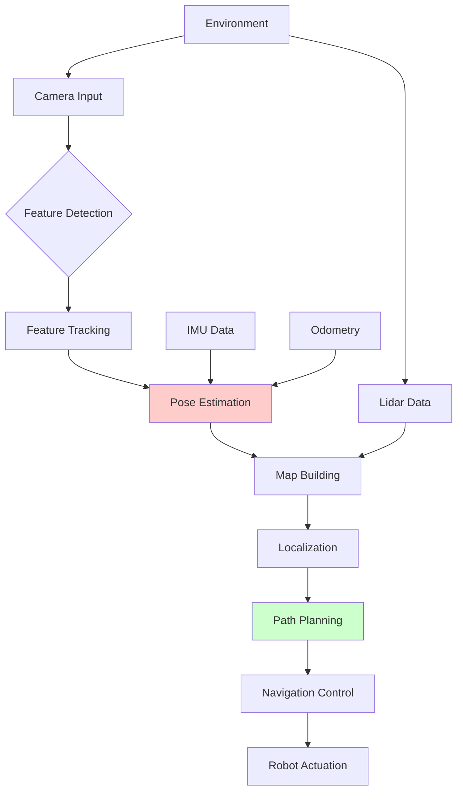

# Chapter 3: VSLAM and Navigation


## Learning Objectives
By the end of this chapter, you will be able to:
- Understand VSLAM concepts and their application to humanoid robots
- Implement VSLAM algorithms using Isaac Sim and Isaac ROS
- Integrate VSLAM with ROS 2 Navigation Stack (Nav2)
- Configure navigation parameters for humanoid robot locomotion
- Plan paths suitable for bipedal humanoid movement
- Evaluate VSLAM and navigation performance

## Core Theory

### Visual SLAM Fundamentals
Visual SLAM (Simultaneous Localization and Mapping) combines:
- **Localization**: Estimating the robot's position in the environment
- **Mapping**: Building a representation of the environment
- **Visual Processing**: Using camera images for perception

### VSLAM Approaches
- **Feature-based**: Detect and track distinctive features in images
- **Direct Method**: Use pixel intensities directly for tracking
- **Semi-direct**: Combine feature and direct methods
- **Deep Learning**: Use neural networks for feature extraction and matching

### VSLAM Challenges for Humanoid Robots
- **Dynamic Motion**: Bipedal gait creates irregular motion patterns
- **Height Variations**: Different viewpoint heights than wheeled robots
- **Balance Constraints**: Need to maintain balance during navigation
- **Limited Computing Power**: On-board computing constraints
- **Sensor Mounting**: Camera placement affects perception

### Navigation System Components
- **Global Planner**: Path planning from start to goal
- **Local Planner**: Obstacle avoidance and path following
- **Costmaps**: Representing environment obstacles and costs
- **Controllers**: Sending commands to robot actuators
- **Recovery Behaviors**: Handling navigation failures

### Bipedal Navigation Considerations
- **Step Planning**: Planning where to place feet for stable walking
- **Center of Mass**: Managing CoM for balance during navigation
- **Terrain Adaptation**: Adjusting gait for different surfaces
- **Dynamic Obstacles**: Dealing with moving obstacles
- **Social Navigation**: Navigating around humans safely

## Practical Examples

### Isaac ROS Visual SLAM Example
```python
import rclpy
from rclpy.node import Node
from sensor_msgs.msg import Image, Imu
from geometry_msgs.msg import PoseStamped, Twist
from nav_msgs.msg import Odometry, Path
from visualization_msgs.msg import MarkerArray
from cv_bridge import CvBridge
import numpy as np
import tf2_ros
from geometry_msgs.msg import TransformStamped

class IsaacVSLAMNode(Node):
    def __init__(self):
        super().__init__('isaac_vsiam_node')

        # Publishers and subscribers
        self.image_sub = self.create_subscription(
            Image, '/camera/image_raw', self.image_callback, 10)
        self.imu_sub = self.create_subscription(
            Imu, '/imu/data', self.imu_callback, 10)

        self.odom_pub = self.create_publisher(Odometry, '/visual_slam/odometry', 10)
        self.map_pub = self.create_publisher(MarkerArray, '/visual_slam/map', 10)
        self.path_pub = self.create_publisher(Path, '/visual_slam/path', 10)

        # TF broadcaster
        self.tf_broadcaster = tf2_ros.TransformBroadcaster(self)

        # Internal variables
        self.bridge = CvBridge()
        self.previous_image = None
        self.current_pose = np.eye(4)  # 4x4 transformation matrix
        self.feature_points = []  # Tracked feature points
        self.map_points = []  # 3D map points
        self.path = Path()
        self.path.header.frame_id = 'map'

        # VSLAM parameters
        self.keyframe_threshold = 0.1  # Movement threshold for keyframes
        self.max_features = 1000
        self.min_tracked_features = 50

        # Initialize feature detector
        self.feature_detector = cv2.ORB_create(nfeatures=self.max_features)

        self.get_logger().info("Isaac VSLAM node initialized")

    def image_callback(self, msg):
        """Process camera image for VSLAM"""
        # Convert ROS image to OpenCV
        current_image = self.bridge.imgmsg_to_cv2(msg, desired_encoding='mono8')

        if self.previous_image is not None:
            # Track features between frames
            pose_delta = self.track_features(self.previous_image, current_image)

            # Update global pose
            if pose_delta is not None:
                self.current_pose = self.current_pose @ pose_delta

                # Publish odometry
                self.publish_odometry(msg.header.stamp, self.current_pose)

                # Publish transform
                self.publish_transform(msg.header.stamp, self.current_pose)

                # Add to path if moved significantly
                if self.should_add_keyframe(pose_delta):
                    self.add_path_point(msg.header.stamp, self.current_pose)

        self.previous_image = current_image

    def track_features(self, prev_img, curr_img):
        """Track features between consecutive frames"""
        # Detect features in current image
        curr_kp = self.feature_detector.detect(curr_img)
        curr_kp, curr_desc = self.feature_detector.compute(curr_img, curr_kp)

        if self.feature_points:
            # Match features with previous frame
            prev_kp = self.feature_points[-1]['keypoints']
            prev_desc = self.feature_points[-1]['descriptors']

            # Use brute-force matcher
            bf = cv2.BFMatcher()
            matches = bf.match(prev_desc, curr_desc)

            # Sort matches by distance
            matches = sorted(matches, key=lambda x: x.distance)

            # Extract matched points
            if len(matches) >= 10:  # Need minimum matches
                prev_pts = np.float32([prev_kp[m.queryIdx].pt for m in matches]).reshape(-1, 1, 2)
                curr_pts = np.float32([curr_kp[m.trainIdx].pt for m in matches]).reshape(-1, 1, 2)

                # Estimate motion using essential matrix
                E, mask = cv2.findEssentialMat(
                    curr_pts, prev_pts,
                    cameraMatrix=np.array([[525, 0, 319.5], [0, 525, 239.5], [0, 0, 1]]),
                    method=cv2.RANSAC, prob=0.999, threshold=1.0
                )

                if E is not None:
                    # Recover pose from essential matrix
                    _, R, t, _ = cv2.recoverPose(E, curr_pts, prev_pts)

                    # Create transformation matrix
                    pose_delta = np.eye(4)
                    pose_delta[:3, :3] = R
                    pose_delta[:3, 3] = t.flatten()

                    # Store current features
                    self.feature_points.append({
                        'keypoints': curr_kp,
                        'descriptors': curr_desc,
                        'image': curr_img
                    })

                    return pose_delta

        return None

    def imu_callback(self, msg):
        """Process IMU data to improve VSLAM"""
        # Use IMU data to improve pose estimation
        # This is a simplified example - real implementation would be more complex
        self.imu_orientation = msg.orientation
        self.imu_angular_velocity = msg.angular_velocity
        self.imu_linear_acceleration = msg.linear_acceleration

    def should_add_keyframe(self, pose_delta):
        """Determine if we should add a keyframe"""
        translation = np.linalg.norm(pose_delta[:3, 3])
        rotation = np.arccos(np.clip((np.trace(pose_delta[:3, :3]) - 1) / 2, -1, 1))
        return translation > self.keyframe_threshold or rotation > 0.1

    def add_path_point(self, stamp, pose):
        """Add current pose to path"""
        pose_stamped = PoseStamped()
        pose_stamped.header.stamp = stamp
        pose_stamped.header.frame_id = 'map'

        pose_stamped.pose.position.x = pose[0, 3]
        pose_stamped.pose.position.y = pose[1, 3]
        pose_stamped.pose.position.z = pose[2, 3]

        # Convert rotation matrix to quaternion
        quat = self.rotation_matrix_to_quaternion(pose[:3, :3])
        pose_stamped.pose.orientation = quat

        self.path.poses.append(pose_stamped)
        self.path.header.stamp = stamp

        # Publish path
        self.path_pub.publish(self.path)

    def publish_odometry(self, stamp, pose):
        """Publish odometry message"""
        odom_msg = Odometry()
        odom_msg.header.stamp = stamp
        odom_msg.header.frame_id = 'map'
        odom_msg.child_frame_id = 'base_link'

        odom_msg.pose.pose.position.x = pose[0, 3]
        odom_msg.pose.pose.position.y = pose[1, 3]
        odom_msg.pose.pose.position.z = pose[2, 3]

        quat = self.rotation_matrix_to_quaternion(pose[:3, :3])
        odom_msg.pose.pose.orientation = quat

        # Set covariance (simplified)
        odom_msg.pose.covariance = [1e-3] * 36  # Simplified covariance

        self.odom_pub.publish(odom_msg)

    def publish_transform(self, stamp, pose):
        """Publish transform to TF tree"""
        t = TransformStamped()
        t.header.stamp = stamp
        t.header.frame_id = 'map'
        t.child_frame_id = 'base_link'

        t.transform.translation.x = pose[0, 3]
        t.transform.translation.y = pose[1, 3]
        t.transform.translation.z = pose[2, 3]

        quat = self.rotation_matrix_to_quaternion(pose[:3, :3])
        t.transform.rotation = quat

        self.tf_broadcaster.sendTransform(t)

    def rotation_matrix_to_quaternion(self, R):
        """Convert 3x3 rotation matrix to quaternion"""
        import math

        # Compute quaternion from rotation matrix
        trace = np.trace(R)

        if trace > 0:
            s = math.sqrt(trace + 1.0) * 2  # s = 4 * qw
            qw = 0.25 * s
            qx = (R[2, 1] - R[1, 2]) / s
            qy = (R[0, 2] - R[2, 0]) / s
            qz = (R[1, 0] - R[0, 1]) / s
        elif R[0, 0] > R[1, 1] and R[0, 0] > R[2, 2]:
            s = math.sqrt(1.0 + R[0, 0] - R[1, 1] - R[2, 2]) * 2  # s = 4 * qx
            qw = (R[2, 1] - R[1, 2]) / s
            qx = 0.25 * s
            qy = (R[0, 1] + R[1, 0]) / s
            qz = (R[0, 2] + R[2, 0]) / s
        elif R[1, 1] > R[2, 2]:
            s = math.sqrt(1.0 + R[1, 1] - R[0, 0] - R[2, 2]) * 2  # s = 4 * qy
            qw = (R[0, 2] - R[2, 0]) / s
            qx = (R[0, 1] + R[1, 0]) / s
            qy = 0.25 * s
            qz = (R[1, 2] + R[2, 1]) / s
        else:
            s = math.sqrt(1.0 + R[2, 2] - R[0, 0] - R[1, 1]) * 2  # s = 4 * qz
            qw = (R[1, 0] - R[0, 1]) / s
            qx = (R[0, 2] + R[2, 0]) / s
            qy = (R[1, 2] + R[2, 1]) / s
            qz = 0.25 * s

        # Create quaternion message
        from geometry_msgs.msg import Quaternion
        quat_msg = Quaternion()
        quat_msg.x = qx
        quat_msg.y = qy
        quat_msg.z = qz
        quat_msg.w = qw

        return quat_msg
```

### Nav2 Configuration for Humanoid Robot
```yaml
# behavior_tree.xml
<root main_tree_to_execute="MainTree">
  <BehaviorTree ID="MainTree">
    <Sequence name="MainSequence">
      <RecoveryNode number_of_retries="2" name="NavigateRecovery">
        <PipelineSequence name="NavigateWithRecovery">
          <RateController hz="1.0">
            <ReactiveGoalChecker name="GoalChecker"/>
          </RateController>
          <ComputePathToPose goal="{goal}" path="{path}" planner_id="GridBased"/>
          <FollowPath path="{path}" controller_id="FollowPath"/>
        </PipelineSequence>
        <RecoveryNode number_of_retries="2" name="FollowPathRecovery">
          <Sequence name="FollowPathRecoveryFallback">
            <ClearEntireCostmap name="ClearLocalCostmap" service_name="local_costmap/clear_entirely_local_costmap"/>
            <Spin name="Spin" angle="1.57"/>
            <Wait name="Wait" time="5"/>
          </Sequence>
        </RecoveryNode>
      </RecoveryNode>
    </Sequence>
  </BehaviorTree>

  <BehaviorTree ID="SimpleNavigator">
    <Sequence name="NavigateToPose">
      <GoalReached goal="{goal}" tolerance="0.5"/>
      <ComputePathToPose goal="{goal}" path="{path}" planner_id="GridBased"/>
      <FollowPath path="{path}" controller_id="FollowPath"/>
    </Sequence>
  </BehaviorTree>
</root>
```

### Humanoid Navigation Configuration
```yaml
# nav2_params_humanoid.yaml
amcl:
  ros__parameters:
    use_sim_time: True
    alpha1: 0.2
    alpha2: 0.2
    alpha3: 0.2
    alpha4: 0.2
    alpha5: 0.2
    base_frame_id: "base_footprint"
    beam_skip_distance: 0.5
    beam_skip_error_threshold: 0.9
    beam_skip_threshold: 0.3
    do_beamskip: false
    global_frame_id: "map"
    lambda_short: 0.1
    laser_likelihood_max_dist: 2.0
    laser_max_range: 100.0
    laser_min_range: -1.0
    laser_model_type: "likelihood_field"
    max_beams: 60
    max_particles: 2000
    min_particles: 500
    odom_frame_id: "odom"
    pf_err: 0.05
    pf_z: 0.99
    recovery_alpha_fast: 0.0
    recovery_alpha_slow: 0.0
    resample_interval: 1
    robot_model_type: "nav2_amcl::DifferentialMotionModel"
    save_pose_rate: 0.5
    sigma_hit: 0.2
    tf_broadcast: true
    transform_tolerance: 1.0
    update_min_a: 0.2
    update_min_d: 0.25
    z_hit: 0.5
    z_max: 0.05
    z_rand: 0.5
    z_short: 0.05

bt_navigator:
  ros__parameters:
    use_sim_time: True
    global_frame: "map"
    robot_base_frame: "base_link"
    odom_topic: "odom"
    bt_loop_duration: 10
    default_server_timeout: 20
    enable_groot_monitoring: True
    enable_bt_metrics: False
    enable_action_metrics: False
    interrupt_handle_policy: 1
    progress_checker_plugin: "progress_checker"
    goal_checker_plugins: ["general_goal_checker"]
    controller_frequency: 20.0
    controller_plugin_ids: ["FollowPath"]
    navigator_plugins: ["behavior_tree_navigator"]
    behavior_tree_navigator:
      plugin: "nav2_bt_navigator::BtNavigator"
      to_plan_topic: "to_plan"
      global_frame: "map"
      robot_base_frame: "base_link"
      transform_tolerance: 0.1
      use_astar: false

controller_server:
  ros__parameters:
    use_sim_time: True
    controller_frequency: 20.0
    min_x_velocity_threshold: 0.001
    min_y_velocity_threshold: 0.5
    min_theta_velocity_threshold: 0.001
    progress_checker_plugin: "progress_checker"
    goal_checker_plugins: ["general_goal_checker"]
    controller_plugins: ["FollowPath"]

    # Humanoid-specific controller parameters
    FollowPath:
      plugin: "nav2_rotation_shim_controller::RotationShimController"
      simulate_to_time: 1.0
      max_angular_accel: 1.0
      max_angular_decel: 1.0
      goal_tolerance: 0.25
      xy_goal_tolerance: 0.25
      trans_stopped_velocity: 0.25
      short_circuit_trajectory_validation: True
      use_cost_regulated_linear_velocity_scaling: True
      cost_scaling_dist: 0.6
      cost_scaling_gain: 1.0
      inflation_cost_scaling_factor: 3.0
      replan_frequency: 0.25
      linear_scale_lookahead_distance: 0.6
      rotation_shim:
        plugin: "nav2_rotation_shim_controller::RotationShimController"
        simulate_to_heading_rate: True
        max_angular_accel: 1.0
        max_rotational_vel: 1.0
        min_rotational_vel: 0.4
        rotational_acc_lim: 3.2

local_costmap:
  local_costmap:
    ros__parameters:
      update_frequency: 5.0
      publish_frequency: 2.0
      global_frame: "odom"
      robot_base_frame: "base_link"
      use_sim_time: True
      rolling_window: true
      width: 6
      height: 6
      resolution: 0.05
      origin_x: 0.0
      origin_y: 0.0
      footprint: "[ [0.3, 0.3], [0.3, -0.3], [-0.3, -0.3], [-0.3, 0.3] ]"
      plugins: ["voxel_layer", "inflation_layer"]
      inflation_layer:
        plugin: "nav2_costmap_2d::InflationLayer"
        cost_scaling_factor: 3.0
        inflation_radius: 0.55
      voxel_layer:
        plugin: "nav2_costmap_2d::VoxelLayer"
        enabled: True
        publish_voxel_map: True
        origin_z: 0.0
        z_resolution: 0.2
        z_voxels: 10
        max_obstacle_height: 2.0
        mark_threshold: 0
        observation_sources: scan
        scan:
          topic: "/scan"
          max_obstacle_height: 2.0
          clearing: True
          marking: True
          data_type: "LaserScan"
          raytrace_max_range: 3.0
          raytrace_min_range: 0.0
          obstacle_max_range: 2.5
          obstacle_min_range: 0.0

global_costmap:
  global_costmap:
    ros__parameters:
      update_frequency: 1.0
      publish_frequency: 0.5
      global_frame: "map"
      robot_base_frame: "base_link"
      use_sim_time: True
      robot_radius: 0.3
      resolution: 0.05
      track_unknown_space: true
      plugins: ["static_layer", "obstacle_layer", "inflation_layer"]
      obstacle_layer:
        plugin: "nav2_costmap_2d::ObstacleLayer"
        enabled: True
        observation_sources: scan
        scan:
          topic: "/scan"
          max_obstacle_height: 2.0
          clearing: True
          marking: True
          data_type: "LaserScan"
          raytrace_max_range: 3.0
          raytrace_min_range: 0.0
          obstacle_max_range: 2.5
          obstacle_min_range: 0.0
      static_layer:
        plugin: "nav2_costmap_2d::StaticLayer"
        map_subscribe_transient_local: True
      inflation_layer:
        plugin: "nav2_costmap_2d::InflationLayer"
        cost_scaling_factor: 3.0
        inflation_radius: 0.6

planner_server:
  ros__parameters:
    expected_planner_frequency: 20.0
    planner_plugins: ["GridBased"]
    GridBased:
      plugin: "nav2_navfn_planner::NavfnPlanner"
      tolerance: 0.5
      use_astar: false
      allow_unknown: true

behavior_server:
  ros__parameters:
    costmap_topic: "local_costmap/costmap_raw"
    footprint_topic: "local_costmap/published_footprint"
    cycle_frequency: 10.0
    behavior_plugins: ["spin", "backup", "wait"]
    spin:
      plugin: "nav2_behaviors::Spin"
      spin_dist: 1.57
    backup:
      plugin: "nav2_behaviors::BackUp"
      backup_dist: 0.15
      backup_speed: 0.025
    wait:
      plugin: "nav2_behaviors::Wait"
      wait_duration: 1.0
```

## Diagrams

### VSLAM and Navigation Architecture


## Exercises

1. Implement a basic VSLAM system using camera images
2. Configure Nav2 for humanoid robot navigation
3. Test path planning with bipedal constraints
4. Evaluate VSLAM performance in different environments

## Quiz

1. What are the main differences between VSLAM and traditional laser-based SLAM?
2. How do humanoid robots' navigation requirements differ from wheeled robots?
3. What is the purpose of the Rotation Shim Controller in Nav2?

## References
- [Nav2 Documentation](https://navigation.ros.org/)
- [Isaac ROS Visual SLAM](https://nvidia-isaac-ros.github.io/repositories_and_packages/isaac_ros_visual_slam/index.html)
- [ROS 2 Navigation Tutorials](https://docs.ros.org/en/humble/Tutorials/Navigation.html)

## Summary

This chapter focused on Visual SLAM (Simultaneous Localization and Mapping) and navigation for humanoid robots. We explored the fundamentals of VSLAM, which combines localization (estimating the robot's position), mapping (building a representation of the environment), and visual processing (using camera images for perception).

We examined different VSLAM approaches including feature-based methods that detect and track distinctive features in images, direct methods that use pixel intensities directly for tracking, semi-direct methods that combine feature and direct approaches, and deep learning methods that use neural networks for feature extraction and matching. The chapter addressed specific challenges for humanoid robots including dynamic motion from bipedal gait, height variations affecting viewpoint, balance constraints during navigation, limited computing power, and sensor mounting considerations.

We covered the essential components of navigation systems including global planners for path planning from start to goal, local planners for obstacle avoidance and path following, costmaps for representing environment obstacles and costs, controllers for sending commands to robot actuators, and recovery behaviors for handling navigation failures. Special attention was given to bipedal navigation considerations such as step planning for stable walking, center of mass management for balance, terrain adaptation for different surfaces, and social navigation around humans.

Practical examples demonstrated implementing Isaac ROS Visual SLAM with image processing, feature tracking, and pose estimation. We also explored Nav2 configuration for humanoid robots with specific parameters for bipedal navigation, including controller settings, costmap configurations, and behavior trees tailored for humanoid movement patterns. The chapter emphasized the importance of evaluating VSLAM and navigation performance in different environments and understanding how humanoid navigation requirements differ from wheeled robots.