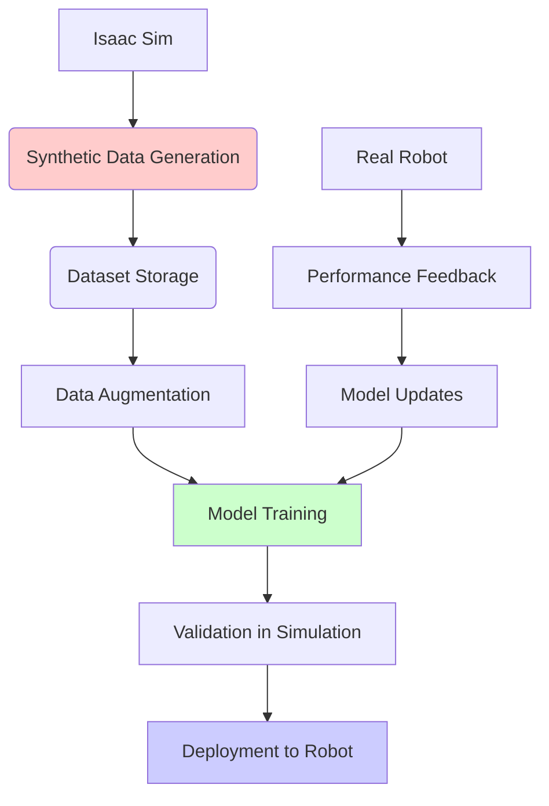

# Chapter 4: Training AI Models in Simulation

## Summary
This chapter covers training AI models for humanoid robotics using Isaac Sim and synthetic data generation, including reinforcement learning, imitation learning, and sim-to-real transfer techniques.

## Learning Objectives
By the end of this chapter, you will be able to:
- Generate synthetic datasets for AI training using Isaac Sim
- Implement reinforcement learning in simulation environments
- Apply domain randomization techniques for sim-to-real transfer
- Train perception models using synthetic data
- Validate AI models in simulation before real-world deployment
- Use Isaac ROS for real-time inference with trained models

## Core Theory

### Synthetic Data Generation
Synthetic data generation offers:
- **Infinite Data**: Unlimited training samples
- **Ground Truth**: Perfect annotations and labels
- **Variety**: Infinite combinations of lighting, textures, objects
- **Safety**: Risk-free training in simulation
- **Cost Efficiency**: Reduced real-world data collection costs

### Domain Randomization
Techniques for improving sim-to-real transfer:
- **Visual Domain Randomization**: Randomize colors, textures, lighting
- **Physical Domain Randomization**: Randomize friction, mass, dynamics
- **Geometric Domain Randomization**: Randomize shapes, sizes, layouts
- **Temporal Domain Randomization**: Randomize timing and delays

### Reinforcement Learning for Robotics
- **Continuous Action Spaces**: Policy gradient methods for robot control
- **Hierarchical RL**: Breaking complex tasks into sub-tasks
- **Multi-agent RL**: Coordinating multiple robots or agents
- **Curriculum Learning**: Gradually increasing task complexity

### Imitation Learning
- **Behavior Cloning**: Learning from demonstrations
- **Inverse Reinforcement Learning**: Learning reward functions
- **Generative Adversarial Imitation Learning**: Learning policies from demonstrations
- **One-shot Learning**: Learning from minimal demonstrations

### Sim-to-Real Transfer Challenges
- **Reality Gap**: Differences between simulation and reality
- **Dynamics Mismatch**: Different physical properties
- **Sensor Noise**: Real sensors have noise not in simulation
- **Actuator Delays**: Real actuators have delays and limits

## Practical Examples

### Isaac Sim Python API for Dataset Generation
```python
import omni
from omni.isaac.kit import SimulationApp
from omni.isaac.core import World
from omni.isaac.core.utils.stage import add_reference_to_stage
from omni.isaac.core.utils.nucleus import get_assets_root_path
from omni.replicator.core import Replicator
import numpy as np
import torch
import torchvision.transforms as transforms
from PIL import Image
import json
import os

# Start simulation app
config = {"headless": True}
simulation_app = SimulationApp(config)

# Import Isaac Sim components
from omni.isaac.core.objects import DynamicCuboid
from omni.isaac.core.prims import XFormPrim
from omni.replicator.isaac.scripts.annotators import *
from omni.replicator.core.randomizer import random_colormap

# Initialize world
world = World(stage_units_in_meters=1.0)

class SyntheticDatasetGenerator:
    def __init__(self, dataset_path="./synthetic_dataset", num_samples=1000):
        self.dataset_path = dataset_path
        self.num_samples = num_samples

        # Create dataset directory
        os.makedirs(dataset_path, exist_ok=True)
        os.makedirs(os.path.join(dataset_path, "images"), exist_ok=True)
        os.makedirs(os.path.join(dataset_path, "labels"), exist_ok=True)

        # Initialize replicator
        self.replicator = Replicator()

        # Setup camera
        self.setup_camera()

        # Setup annotators
        self.setup_annotators()

        # Setup randomization
        self.setup_randomization()

    def setup_camera(self):
        """Setup camera for data collection"""
        # Create camera prim
        self.camera_prim = XFormPrim(
            prim_path="/World/Isaac/Systems/Camera",
            position=[2.0, 0.0, 1.0],
            orientation=[0.0, 0.0, 0.0, 1.0]
        )

        # Set up camera properties
        self.camera_prim.set_world_pose(position=[2.0, 0.0, 1.0],
                                       orientation=[0.0, 0.0, 0.0, 1.0])

    def setup_annotators(self):
        """Setup annotators for different types of ground truth"""
        # RGB image annotator
        self.replicator.attach_annotator(
            self.camera_prim.prim_path,
            "rgb",
            name="rgb"
        )

        # Semantic segmentation annotator
        self.replicator.attach_annotator(
            self.camera_prim.prim_path,
            "instance_segmentation",
            name="seg"
        )

        # Depth annotator
        self.replicator.attach_annotator(
            self.camera_prim.prim_path,
            "depth",
            name="depth"
        )

        # Bounding box annotator
        self.replicator.attach_annotator(
            self.camera_prim.prim_path,
            "bounding_box_2d_tight",
            name="bbox"
        )

    def setup_randomization(self):
        """Setup domain randomization parameters"""
        # Lighting randomization
        self.light_randomization = {
            'intensity': (100, 10000),
            'color_temperature': (3000, 7000),
            'position': ((-5, -5, 5), (5, 5, 10))
        }

        # Material randomization
        self.material_randomization = {
            'roughness': (0.0, 1.0),
            'metallic': (0.0, 1.0),
            'specular': (0.0, 1.0)
        }

        # Object placement randomization
        self.object_randomization = {
            'position_range': ((-2, -2, 0), (2, 2, 2)),
            'rotation_range': ((-1.57, -1.57, -1.57), (1.57, 1.57, 1.57))
        }

    def randomize_scene(self):
        """Randomize scene for domain randomization"""
        # Randomize lighting
        light_intensity = np.random.uniform(*self.light_randomization['intensity'])
        light_color_temp = np.random.uniform(*self.light_randomization['color_temperature'])

        # Randomize materials
        roughness = np.random.uniform(*self.material_randomization['roughness'])
        metallic = np.random.uniform(*self.material_randomization['metallic'])

        # Randomize object positions
        pos_min, pos_max = self.object_randomization['position_range']
        rot_min, rot_max = self.object_randomization['rotation_range']

        # Apply randomization to objects in the scene
        # (This is a simplified example - real implementation would be more complex)
        pass

    def generate_sample(self, sample_id):
        """Generate a single synthetic sample"""
        # Randomize scene
        self.randomize_scene()

        # Step simulation
        world.step(render=True)

        # Capture data from all annotators
        data = self.replicator.get_data(self.camera_prim.prim_path)

        # Save RGB image
        rgb_image = data["rgb"]
        image_path = os.path.join(self.dataset_path, "images", f"{sample_id:06d}.png")
        Image.fromarray(rgb_image).save(image_path)

        # Save semantic segmentation
        seg_data = data["seg"]
        seg_path = os.path.join(self.dataset_path, "labels", f"{sample_id:06d}_seg.npy")
        np.save(seg_path, seg_data)

        # Save depth data
        depth_data = data["depth"]
        depth_path = os.path.join(self.dataset_path, "labels", f"{sample_id:06d}_depth.npy")
        np.save(depth_path, depth_data)

        # Save bounding box data
        bbox_data = data["bbox"]
        bbox_path = os.path.join(self.dataset_path, "labels", f"{sample_id:06d}_bbox.json")
        with open(bbox_path, 'w') as f:
            json.dump(bbox_data, f)

        return {
            'image_path': image_path,
            'seg_path': seg_path,
            'depth_path': depth_path,
            'bbox_path': bbox_path
        }

    def generate_dataset(self):
        """Generate complete synthetic dataset"""
        print(f"Generating {self.num_samples} samples...")

        metadata = {
            'dataset_path': self.dataset_path,
            'num_samples': self.num_samples,
            'randomization_params': {
                'light_randomization': self.light_randomization,
                'material_randomization': self.material_randomization,
                'object_randomization': self.object_randomization
            },
            'sample_paths': []
        }

        for i in range(self.num_samples):
            sample_info = self.generate_sample(i)
            metadata['sample_paths'].append(sample_info)

            if i % 100 == 0:
                print(f"Generated {i}/{self.num_samples} samples")

        # Save metadata
        metadata_path = os.path.join(self.dataset_path, "metadata.json")
        with open(metadata_path, 'w') as f:
            json.dump(metadata, f, indent=2)

        print(f"Dataset generation completed! Saved to {self.dataset_path}")

# Example usage
if __name__ == "__main__":
    # Initialize world with basic scene
    world.reset()

    # Add a simple object to the scene
    world.scene.add(
        DynamicCuboid(
            prim_path="/World/Cube",
            name="cube",
            position=[0.0, 0.0, 0.5],
            size=0.2,
            mass=1.0,
            color=np.array([0.8, 0.1, 0.1])
        )
    )

    # Create dataset generator
    generator = SyntheticDatasetGenerator(num_samples=500)

    # Generate dataset
    generator.generate_dataset()

    # Shutdown
    simulation_app.close()
```

### Reinforcement Learning Training Example
```python
import torch
import torch.nn as nn
import torch.optim as optim
import numpy as np
import gym
from torch.distributions import Normal
import random

class ActorNetwork(nn.Module):
    def __init__(self, state_dim, action_dim, max_action):
        super(ActorNetwork, self).__init__()

        self.l1 = nn.Linear(state_dim, 256)
        self.l2 = nn.Linear(256, 256)
        self.mean = nn.Linear(256, action_dim)
        self.log_std = nn.Linear(256, action_dim)

        self.max_action = max_action

    def forward(self, state):
        x = torch.relu(self.l1(state))
        x = torch.relu(self.l2(x))

        mean = self.mean(x)
        log_std = self.log_std(x)
        log_std = torch.clamp(log_std, min=-20, max=2)

        std = torch.exp(log_std)
        normal = Normal(mean, std)

        x_t = normal.rsample()  # Reparameterization trick
        y_t = torch.tanh(x_t)
        action = y_t * self.max_action

        # Calculate log probability
        log_prob = normal.log_prob(x_t)
        log_prob -= torch.log(self.max_action * (1 - y_t.pow(2)) + 1e-6)
        log_prob = log_prob.sum(1, keepdim=True)

        return action, log_prob

class CriticNetwork(nn.Module):
    def __init__(self, state_dim, action_dim):
        super(CriticNetwork, self).__init__()

        # Q1 architecture
        self.l1 = nn.Linear(state_dim + action_dim, 256)
        self.l2 = nn.Linear(256, 256)
        self.l3 = nn.Linear(256, 1)

        # Q2 architecture
        self.l4 = nn.Linear(state_dim + action_dim, 256)
        self.l5 = nn.Linear(256, 256)
        self.l6 = nn.Linear(256, 1)

    def forward(self, state, action):
        sa = torch.cat([state, action], 1)

        q1 = torch.relu(self.l1(sa))
        q1 = torch.relu(self.l2(q1))
        q1 = self.l3(q1)

        q2 = torch.relu(self.l4(sa))
        q2 = torch.relu(self.l5(q2))
        q2 = self.l6(q2)

        return q1, q2

class SACAgent:
    def __init__(self, state_dim, action_dim, max_action, lr=3e-4):
        self.device = torch.device("cuda" if torch.cuda.is_available() else "cpu")

        self.actor = ActorNetwork(state_dim, action_dim, max_action).to(self.device)
        self.critic = CriticNetwork(state_dim, action_dim).to(self.device)
        self.critic_target = CriticNetwork(state_dim, action_dim).to(self.device)

        # Copy critic weights to target critic
        self.critic_target.load_state_dict(self.critic.state_dict())

        self.actor_optimizer = optim.Adam(self.actor.parameters(), lr=lr)
        self.critic_optimizer = optim.Adam(self.critic.parameters(), lr=lr)

        self.max_action = max_action
        self.gamma = 0.99
        self.tau = 0.005
        self.alpha = 0.2

        # Replay buffer
        self.replay_buffer = []
        self.buffer_size = 1000000
        self.batch_size = 256

    def select_action(self, state):
        state = torch.FloatTensor(state.reshape(1, -1)).to(self.device)
        action, _ = self.actor(state)
        return action.cpu().data.numpy().flatten()

    def train(self, replay_buffer, batch_size=256):
        if len(replay_buffer) < batch_size:
            return

        # Sample replay buffer
        batch_indices = np.random.choice(len(replay_buffer), batch_size, replace=False)
        batch = [replay_buffer[i] for i in batch_indices]

        state, action, next_state, reward, done = map(np.stack, zip(*batch))

        state = torch.FloatTensor(state).to(self.device)
        action = torch.FloatTensor(action).to(self.device)
        next_state = torch.FloatTensor(next_state).to(self.device)
        reward = torch.FloatTensor(reward).unsqueeze(1).to(self.device)
        done = torch.BoolTensor(done).unsqueeze(1).to(self.device)

        with torch.no_grad():
            next_action, next_log_prob = self.actor(next_state)
            target_q1, target_q2 = self.critic_target(next_state, next_action)
            target_q = torch.min(target_q1, target_q2) - self.alpha * next_log_prob
            target_q = reward + (1 - done) * self.gamma * target_q

        # Get current Q estimates
        current_q1, current_q2 = self.critic(state, action)

        # Compute critic loss
        critic_loss = nn.MSELoss()(current_q1, target_q) + nn.MSELoss()(current_q2, target_q)

        # Optimize critic
        self.critic_optimizer.zero_grad()
        critic_loss.backward()
        self.critic_optimizer.step()

        # Compute actor loss
        pi, log_pi = self.actor(state)
        q1, q2 = self.critic(state, pi)
        q = torch.min(q1, q2)

        actor_loss = (self.alpha * log_pi - q).mean()

        # Optimize actor
        self.actor_optimizer.zero_grad()
        actor_loss.backward()
        self.actor_optimizer.step()

        # Update target networks
        for param, target_param in zip(self.critic.parameters(), self.critic_target.parameters()):
            target_param.data.copy_(self.tau * param.data + (1 - self.tau) * target_param.data)

# Training loop example
def train_humanoid_rl():
    # Initialize environment (this would connect to Isaac Sim)
    # For demo, using a placeholder
    state_dim = 24  # Example humanoid state dimension
    action_dim = 12  # Example humanoid action dimension
    max_action = 1.0

    agent = SACAgent(state_dim, action_dim, max_action)

    # Training loop
    for episode in range(1000):
        state = np.random.rand(state_dim)  # Placeholder initial state
        episode_reward = 0
        done = False

        for step in range(1000):  # Max steps per episode
            action = agent.select_action(state)

            # In real implementation, this would interact with Isaac Sim
            next_state = state + np.random.randn(state_dim) * 0.1  # Placeholder
            reward = np.random.rand()  # Placeholder reward
            done = random.random() < 0.01  # Placeholder termination

            # Store transition in replay buffer
            agent.replay_buffer.append((state, action, next_state, reward, done))
            if len(agent.replay_buffer) > agent.buffer_size:
                agent.replay_buffer.pop(0)

            # Train agent
            agent.train(agent.replay_buffer)

            state = next_state
            episode_reward += reward

            if done:
                break

        if episode % 10 == 0:
            print(f"Episode {episode}, Reward: {episode_reward:.2f}")
```

### Isaac ROS Integration for Inference
```python
import rclpy
from rclpy.node import Node
from sensor_msgs.msg import Image
from geometry_msgs.msg import Twist
from std_msgs.msg import Float32MultiArray
from cv_bridge import CvBridge
import torch
import torch.nn as nn
import numpy as np

class IsaacROSInferenceNode(Node):
    def __init__(self):
        super().__init__('isaac_ros_inference')

        # Subscribe to sensor data
        self.image_sub = self.create_subscription(
            Image, '/camera/image_raw', self.image_callback, 10)

        # Publish actions to robot
        self.action_pub = self.create_publisher(
            Float32MultiArray, '/humanoid_robot/actions', 10)

        # Internal variables
        self.bridge = CvBridge()
        self.model_loaded = False

        # Load trained model
        self.load_model()

    def load_model(self):
        """Load trained model for inference"""
        try:
            # Load the trained model
            self.model = torch.load('/path/to/trained/model.pth')
            self.model.eval()
            self.model_loaded = True
            self.get_logger().info("Model loaded successfully")
        except Exception as e:
            self.get_logger().error(f"Failed to load model: {e}")
            self.model_loaded = False

    def preprocess_image(self, image):
        """Preprocess image for model input"""
        # Convert to tensor and normalize
        image_tensor = torch.from_numpy(image).float()
        image_tensor = image_tensor.permute(2, 0, 1)  # HWC to CHW
        image_tensor = image_tensor.unsqueeze(0)  # Add batch dimension
        image_tensor = image_tensor / 255.0  # Normalize to [0, 1]

        return image_tensor

    def image_callback(self, msg):
        """Process camera image and generate action"""
        if not self.model_loaded:
            return

        # Convert ROS image to OpenCV
        cv_image = self.bridge.imgmsg_to_cv2(msg, desired_encoding='bgr8')

        # Preprocess image
        input_tensor = self.preprocess_image(cv_image)

        # Run inference
        with torch.no_grad():
            action = self.model(input_tensor)

        # Convert action to message format
        action_msg = Float32MultiArray()
        action_msg.data = action.squeeze().cpu().numpy().tolist()

        # Publish action
        self.action_pub.publish(action_msg)

        self.get_logger().info(f"Inference completed, action published: {action_msg.data[:5]}...")
```

## Diagrams

### AI Training Pipeline


## Exercises

1. Generate a synthetic dataset using Isaac Sim for object detection
2. Train a perception model on synthetic data
3. Implement domain randomization for sim-to-real transfer
4. Create a reinforcement learning environment in Isaac Sim

## Quiz

1. What are the main benefits of synthetic data generation for AI training?
2. How does domain randomization help with sim-to-real transfer?
3. What are the key components of a reinforcement learning system?

## References
- [Isaac Sim Synthetic Data Generation](https://docs.omniverse.nvidia.com/isaacsim/latest/features/replicator.html)
- [Isaac ROS Documentation](https://nvidia-isaac-ros.github.io/)
- [Reinforcement Learning for Robotics](https://arxiv.org/abs/2002.00435)