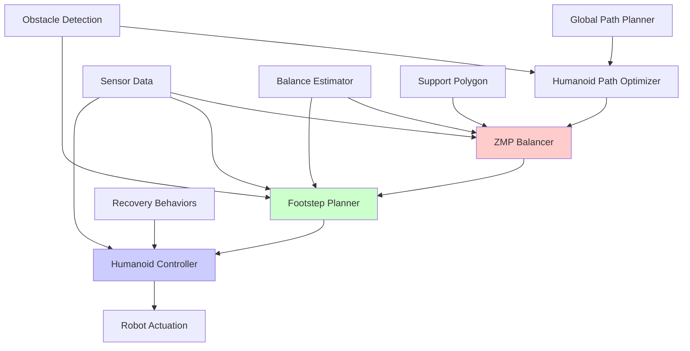

# Chapter 5: Bipedal Path Planning with Nav2


## Learning Objectives
By the end of this chapter, you will be able to:
- Configure Nav2 for bipedal humanoid robot navigation
- Implement specialized path planners for legged robots
- Design footstep planners for stable walking
- Integrate with humanoid robot controllers
- Plan paths considering bipedal kinematic constraints
- Validate navigation performance for humanoid robots

## Core Theory

### Bipedal Navigation Challenges
Bipedal humanoid navigation presents unique challenges:
- **Balance Constraints**: Maintaining center of mass within support polygon
- **Foot Placement**: Precise footstep planning for stable locomotion
- **Kinematic Constraints**: Limited joint ranges and gait patterns
- **Dynamic Stability**: Managing dynamic balance during movement
- **Terrain Adaptation**: Adjusting to uneven surfaces and obstacles

### Path Planning for Bipedal Robots
- **Footstep Planning**: Calculating safe and stable foot placements
- **Center of Mass Trajectories**: Planning CoM movement for balance
- **Zero Moment Point (ZMP)**: Maintaining ZMP within support polygon
- **Capture Point**: Planning for dynamic balance recovery
- **Gait Selection**: Choosing appropriate gaits for different terrains

### Nav2 Components for Humanoid Robots
- **Global Planner**: Path planning considering bipedal constraints
- **Local Planner**: Footstep adjustment and obstacle avoidance
- **Controller**: Humanoid-specific motion controllers
- **Costmap**: Representation of navigable space for legged robots
- **Recovery Behaviors**: Specialized recovery for bipedal robots

### Bipedal-Specific Navigation Parameters
- **Step Length**: Maximum distance between consecutive foot placements
- **Step Width**: Lateral distance between left and right feet
- **Turning Radius**: Minimum turning radius considering leg constraints
- **Obstacle Clearance**: Required clearance for leg swing phase
- **Stance Time**: Time spent with feet in stance phase

## Practical Examples

### Humanoid-Specific Nav2 Configuration
```yaml
# humanoid_nav2_config.yaml
bt_navigator:
  ros__parameters:
    use_sim_time: True
    global_frame: "map"
    robot_base_frame: "base_link"
    odom_topic: "odom"
    bt_loop_duration: 10
    default_server_timeout: 20
    enable_groot_monitoring: True
    enable_bt_metrics: False
    enable_action_metrics: False
    interrupt_handle_policy: 1
    progress_checker_plugin: "progress_checker"
    goal_checker_plugins: ["humanoid_goal_checker"]
    controller_frequency: 10.0  # Lower frequency for bipedal control
    controller_plugin_ids: ["HumanoidController"]
    navigator_plugins: ["behavior_tree_navigator"]
    behavior_tree_navigator:
      plugin: "nav2_bt_navigator::BtNavigator"
      to_plan_topic: "to_plan"
      global_frame: "map"
      robot_base_frame: "base_link"
      transform_tolerance: 0.5  # Higher tolerance for bipedal motion
      use_astar: false

controller_server:
  ros__parameters:
    use_sim_time: True
    controller_frequency: 10.0  # 10Hz for bipedal control
    min_x_velocity_threshold: 0.01  # Lower threshold for slow walking
    min_y_velocity_threshold: 0.1
    min_theta_velocity_threshold: 0.01
    progress_checker_plugin: "progress_checker"
    goal_checker_plugins: ["humanoid_goal_checker"]
    controller_plugins: ["HumanoidController"]

    # Humanoid-specific controller
    HumanoidController:
      plugin: "nav2_humanoid_controller::HumanoidController"
      # Bipedal-specific parameters
      max_forward_speed: 0.5  # m/s
      max_backward_speed: 0.2  # m/s
      max_angular_speed: 0.5  # rad/s
      max_angular_accel: 0.5  # rad/s²
      max_angular_decel: 0.5  # rad/s²
      goal_tolerance: 0.3  # Larger tolerance for bipedal precision
      xy_goal_tolerance: 0.3
      trans_stopped_velocity: 0.05
      short_circuit_trajectory_validation: True
      use_cost_regulated_linear_velocity_scaling: True
      cost_scaling_dist: 0.8  # Larger scaling for footstep planning
      cost_scaling_gain: 1.2
      inflation_cost_scaling_factor: 4.0  # Higher inflation for leg safety
      replan_frequency: 0.5  # Lower replanning frequency
      linear_scale_lookahead_distance: 0.8  # Longer lookahead for bipedal
      # Footstep planning parameters
      foot_separation: 0.2  # Distance between left and right feet
      max_step_length: 0.4  # Maximum step length
      min_step_length: 0.1  # Minimum step length
      step_height: 0.05  # Height of foot during swing phase
      stance_duration: 0.8  # Time for each stance phase

local_costmap:
  local_costmap:
    ros__parameters:
      update_frequency: 5.0
      publish_frequency: 2.0
      global_frame: "odom"
      robot_base_frame: "base_link"
      use_sim_time: True
      rolling_window: true
      width: 8  # Larger window for footstep planning
      height: 8
      resolution: 0.05  # Fine resolution for foot placement
      origin_x: 0.0
      origin_y: 0.0
      # Humanoid-specific footprint
      footprint: "[ [0.4, 0.3], [0.4, -0.3], [-0.4, -0.3], [-0.4, 0.3] ]"
      plugins: ["footstep_layer", "inflation_layer"]
      inflation_layer:
        plugin: "nav2_costmap_2d::InflationLayer"
        cost_scaling_factor: 4.0  # Higher scaling for leg safety
        inflation_radius: 0.7  # Larger inflation for leg clearance
      footstep_layer:
        plugin: "nav2_costmap_2d::FootstepLayer"
        enabled: True
        lethal_cost_threshold: 90
        observation_sources: scan
        scan:
          topic: "/scan"
          max_obstacle_height: 1.0  # Lower max height for leg safety
          clearing: True
          marking: True
          data_type: "LaserScan"
          raytrace_max_range: 4.0  # Shorter raytrace for closer attention
          raytrace_min_range: 0.0
          obstacle_max_range: 3.0
          obstacle_min_range: 0.1

global_costmap:
  global_costmap:
    ros__parameters:
      update_frequency: 1.0
      publish_frequency: 0.5
      global_frame: "map"
      robot_base_frame: "base_link"
      use_sim_time: True
      robot_radius: 0.4  # Larger radius for humanoid safety
      resolution: 0.1  # Coarser resolution for global planning
      track_unknown_space: true
      plugins: ["static_layer", "obstacle_layer", "inflation_layer"]
      obstacle_layer:
        plugin: "nav2_costmap_2d::ObstacleLayer"
        enabled: True
        observation_sources: scan
        scan:
          topic: "/scan"
          max_obstacle_height: 1.0
          clearing: True
          marking: True
          data_type: "LaserScan"
          raytrace_max_range: 5.0
          raytrace_min_range: 0.0
          obstacle_max_range: 4.0
          obstacle_min_range: 0.0
      static_layer:
        plugin: "nav2_costmap_2d::StaticLayer"
        map_subscribe_transient_local: True
      inflation_layer:
        plugin: "nav2_costmap_2d::InflationLayer"
        cost_scaling_factor: 4.0
        inflation_radius: 0.8

planner_server:
  ros__parameters:
    expected_planner_frequency: 1.0  # Lower frequency for complex planning
    planner_plugins: ["HumanoidGridPlanner"]
    HumanoidGridPlanner:
      plugin: "nav2_humanoid_planner::HumanoidGridPlanner"
      tolerance: 0.8  # Larger tolerance for bipedal planning
      use_astar: false
      allow_unknown: true
      # Bipedal-specific parameters
      max_step_length: 0.4  # Maximum step in path
      min_step_length: 0.1
      step_width: 0.2  # Distance between footsteps
      step_height: 0.05  # Height for stepping over obstacles

behavior_server:
  ros__parameters:
    costmap_topic: "local_costmap/costmap_raw"
    footprint_topic: "local_costmap/published_footprint"
    cycle_frequency: 5.0  # Slower cycle for bipedal behaviors
    behavior_plugins: ["spin", "backup", "wait", "recover_balance"]
    spin:
      plugin: "nav2_behaviors::Spin"
      spin_dist: 0.785  # Less spin for bipedal stability
    backup:
      plugin: "nav2_behaviors::BackUp"
      backup_dist: 0.3  # Shorter backup for bipedal
      backup_speed: 0.05  # Slower backup speed
    wait:
      plugin: "nav2_behaviors::Wait"
      wait_duration: 2.0  # Longer wait for bipedal stability
    recover_balance:
      plugin: "nav2_humanoid_behaviors::RecoverBalance"
      max_attempts: 3
      recovery_time: 5.0
```

### Humanoid Controller Implementation
```python
import rclpy
from rclpy.node import Node
from nav_msgs.msg import Path
from geometry_msgs.msg import PoseStamped, Twist
from sensor_msgs.msg import LaserScan
from tf2_ros import TransformListener, Buffer
import numpy as np
import math
from scipy.spatial import distance

class HumanoidFootstepPlanner:
    def __init__(self, step_length=0.4, step_width=0.2, step_height=0.05):
        self.step_length = step_length
        self.step_width = step_width
        self.step_height = step_height

        # Initialize foot positions
        self.left_foot = np.array([0.0, step_width/2, 0.0])
        self.right_foot = np.array([0.0, -step_width/2, 0.0])
        self.support_foot = "left"  # Which foot is supporting

    def plan_footsteps(self, global_path, robot_pose):
        """Plan footstep sequence from global path"""
        footsteps = []

        # Convert global path to footstep sequence
        for i in range(len(global_path)):
            # Determine next foot placement based on path
            target_pos = np.array([
                global_path[i].pose.position.x,
                global_path[i].pose.position.y,
                global_path[i].pose.position.z
            ])

            # Calculate footstep based on current robot state
            next_footstep = self.calculate_next_footstep(target_pos)
            footsteps.append(next_footstep)

        return footsteps

    def calculate_next_footstep(self, target_pos):
        """Calculate next footstep based on target position"""
        # Simple implementation - in reality would involve more complex
        # kinematic and balance calculations
        if self.support_foot == "left":
            # Right foot moves toward target
            next_pos = self.right_foot + (target_pos - self.right_foot) * 0.5
            self.support_foot = "right"
        else:
            # Left foot moves toward target
            next_pos = self.left_foot + (target_pos - self.left_foot) * 0.5
            self.support_foot = "left"

        # Add step height for swing phase
        next_pos[2] = self.step_height

        return next_pos

class HumanoidController(Node):
    def __init__(self):
        super().__init__('humanoid_controller')

        # Publishers and subscribers
        self.path_sub = self.create_subscription(
            Path, 'global_plan', self.path_callback, 10)
        self.cmd_vel_pub = self.create_publisher(Twist, 'cmd_vel', 10)
        self.footstep_pub = self.create_publisher(Path, 'footsteps', 10)

        # TF listener for robot pose
        self.tf_buffer = Buffer()
        self.tf_listener = TransformListener(self.tf_buffer, self)

        # Footstep planner
        self.footstep_planner = HumanoidFootstepPlanner()

        # Internal state
        self.current_path = None
        self.current_footsteps = []
        self.current_step_index = 0
        self.robot_pose = None

        # Navigation parameters
        self.linear_vel = 0.3  # m/s
        self.angular_vel = 0.3  # rad/s
        self.step_duration = 1.0  # seconds per step

        # Timer for control loop
        self.control_timer = self.create_timer(0.1, self.control_loop)

        self.get_logger().info("Humanoid Controller initialized")

    def path_callback(self, msg):
        """Receive global path and plan footstep sequence"""
        self.current_path = msg.poses
        if self.robot_pose:
            # Plan footstep sequence
            self.current_footsteps = self.footstep_planner.plan_footsteps(
                self.current_path, self.robot_pose)

            # Publish footstep plan
            footstep_msg = Path()
            footstep_msg.header = msg.header
            for step in self.current_footsteps:
                pose = PoseStamped()
                pose.pose.position.x = step[0]
                pose.pose.position.y = step[1]
                pose.pose.position.z = step[2]
                footstep_msg.poses.append(pose)

            self.footstep_pub.publish(footstep_msg)
            self.current_step_index = 0

    def control_loop(self):
        """Main control loop for humanoid navigation"""
        # Get current robot pose
        try:
            transform = self.tf_buffer.lookup_transform(
                'map', 'base_link', rclpy.time.Time())
            self.robot_pose = transform.transform.translation
        except Exception as e:
            self.get_logger().warn(f"Could not get robot pose: {e}")
            return

        if not self.current_footsteps or self.current_step_index >= len(self.current_footsteps):
            # No path to follow, stop robot
            cmd_vel = Twist()
            self.cmd_vel_pub.publish(cmd_vel)
            return

        # Get next footstep
        next_step = self.current_footsteps[self.current_step_index]

        # Calculate desired velocity toward next footstep
        cmd_vel = self.calculate_step_command(next_step)

        # Publish command
        self.cmd_vel_pub.publish(cmd_vel)

        # Check if reached current step
        robot_pos = np.array([self.robot_pose.x, self.robot_pose.y, self.robot_pose.z])
        step_pos = np.array([next_step.position.x, next_step.position.y, next_step.position.z])

        if distance.euclidean(robot_pos[:2], step_pos[:2]) < 0.1:  # 10cm tolerance
            self.current_step_index += 1

    def calculate_step_command(self, next_step):
        """Calculate velocity command to reach next footstep"""
        cmd_vel = Twist()

        if not self.robot_pose:
            return cmd_vel

        # Calculate direction to next step
        dx = next_step.position.x - self.robot_pose.x
        dy = next_step.position.y - self.robot_pose.y

        # Calculate distance and angle
        dist = math.sqrt(dx*dx + dy*dy)
        angle = math.atan2(dy, dx)

        # Simple proportional control
        if dist > 0.1:  # If not close to target
            cmd_vel.linear.x = min(self.linear_vel, dist * 0.5)
            cmd_vel.angular.z = angle * 0.5

            # Limit angular velocity
            cmd_vel.angular.z = max(-self.angular_vel,
                                   min(self.angular_vel, cmd_vel.angular.z))
        else:
            cmd_vel.linear.x = 0.0
            cmd_vel.angular.z = 0.0

        return cmd_vel
```

### ZMP-Based Path Planning
```python
import numpy as np
from scipy.optimize import minimize
import matplotlib.pyplot as plt

class ZMPPathPlanner:
    def __init__(self, robot_height=0.8, gravity=9.81):
        self.robot_height = robot_height
        self.gravity = gravity
        self.omega = np.sqrt(gravity / robot_height)

    def compute_zmp_trajectory(self, com_trajectory, dt=0.01):
        """Compute ZMP trajectory from CoM trajectory using ZMP equation

        ZMP_x = CoM_x - (CoM_z - ZMP_z) / omega^2 * CoM_x_ddot
        """
        n_steps = len(com_trajectory)
        zmp_trajectory = np.zeros_like(com_trajectory)

        # Compute accelerations using finite differences
        for i in range(1, n_steps-1):
            # Second derivative approximation
            com_acc = (com_trajectory[i-1] - 2*com_trajectory[i] + com_trajectory[i+1]) / (dt*dt)

            # ZMP equation (assuming ZMP_z = 0 for flat ground)
            zmp_trajectory[i] = com_trajectory[i] - (self.robot_height) / (self.omega**2) * com_acc

        return zmp_trajectory

    def plan_balanced_path(self, start_pos, goal_pos, num_waypoints=50):
        """Plan a balanced path ensuring ZMP stays within support polygon"""
        # Generate initial path
        path = np.linspace(start_pos, goal_pos, num_waypoints)

        # Optimize for ZMP stability
        optimized_path = self.optimize_for_stability(path)

        return optimized_path

    def optimize_for_stability(self, initial_path):
        """Optimize path to ensure ZMP remains within support polygon"""
        def stability_cost(path_flat):
            path = path_flat.reshape(-1, 2)  # Reshape to (N, 2) for x,y

            # Compute ZMP trajectory
            zmp_x = self.compute_zmp_trajectory(path[:, 0])
            zmp_y = self.compute_zmp_trajectory(path[:, 1])

            # Compute cost based on ZMP being outside support polygon
            # For simplicity, assume rectangular support polygon around feet
            cost = 0
            foot_separation = 0.2  # 20cm between feet
            for i in range(len(zmp_x)):
                # Assume support polygon is roughly between feet positions
                # This is a simplified model - real implementation would be more complex
                if abs(zmp_y[i]) > foot_separation/2 + 0.1:  # Extra margin
                    cost += 1000  # High penalty for ZMP outside support

            # Add smoothness cost
            smoothness_cost = 0
            for i in range(1, len(path)-1):
                curvature = np.linalg.norm(path[i-1] - 2*path[i] + path[i+1])
                smoothness_cost += curvature**2

            return cost + 0.1 * smoothness_cost

        # Flatten path for optimization
        initial_flat = initial_path.flatten()

        # Optimize
        result = minimize(stability_cost, initial_flat, method='BFGS')

        # Reshape back to path format
        optimized_path = result.x.reshape(-1, 2)

        return optimized_path

# Example usage
def example_zmp_navigation():
    planner = ZMPPathPlanner(robot_height=0.8)

    start = np.array([0.0, 0.0])
    goal = np.array([5.0, 3.0])

    # Plan balanced path
    path = planner.plan_balanced_path(start, goal)

    # Compute ZMP trajectory for the path
    zmp_x = planner.compute_zmp_trajectory(path[:, 0])
    zmp_y = planner.compute_zmp_trajectory(path[:, 1])

    print(f"Planned path with {len(path)} waypoints")
    print(f"Start: {start}, Goal: {goal}")

    return path, zmp_x, zmp_y
```

## Diagrams

### Bipedal Navigation Architecture


## Exercises

1. Configure Nav2 for a humanoid robot with appropriate parameters
2. Implement a footstep planner for stable walking
3. Design a ZMP-based path optimizer for balance
4. Test navigation with bipedal-specific constraints

## Quiz

1. What are the main differences between wheeled and bipedal navigation?
2. How does Zero Moment Point (ZMP) relate to humanoid balance?
3. What are the key parameters that differ for humanoid navigation in Nav2?

## References
- [Nav2 Documentation](https://navigation.ros.org/)
- [Humanoid Navigation Research](https://ieeexplore.ieee.org/document/8206276)
- [ROS 2 Navigation Tutorials](https://docs.ros.org/en/humble/Tutorials/Navigation.html)

## Summary

This chapter focused on configuring and implementing Nav2 (Navigation 2) for bipedal humanoid robot navigation, addressing the unique challenges that differ significantly from wheeled robot navigation. We explored the specific challenges of bipedal navigation including balance constraints requiring the center of mass to remain within the support polygon, precise foot placement for stable locomotion, kinematic constraints from limited joint ranges and gait patterns, dynamic stability management during movement, and terrain adaptation for uneven surfaces.

We examined specialized path planning approaches for bipedal robots including footstep planning to calculate safe and stable foot placements, center of mass trajectory planning for balance, Zero Moment Point (ZMP) management to maintain stability within the support polygon, capture point planning for dynamic balance recovery, and gait selection appropriate for different terrains. The chapter detailed Nav2 components adapted for humanoid robots including global planners considering bipedal constraints, local planners for footstep adjustment and obstacle avoidance, humanoid-specific motion controllers, costmaps representing navigable space for legged robots, and specialized recovery behaviors.

Practical examples included comprehensive Nav2 configuration for humanoid robots with parameters specifically tuned for bipedal navigation such as step length limits, foot separation distances, turning radius constraints, and obstacle clearance requirements. We implemented a humanoid controller with footstep planning algorithms that convert global paths into sequences of foot placements, considering the robot's balance and kinematic constraints. The chapter also covered ZMP-based path planning, which ensures that the Zero Moment Point remains within the support polygon throughout the robot's movement, critical for maintaining dynamic stability during navigation.

The implementation addressed key bipedal-specific navigation parameters including stance duration, step height for swing phase, linear and angular velocity limits appropriate for walking gaits, and recovery behaviors designed for bipedal balance restoration. The chapter emphasized the importance of validating navigation performance for humanoid robots and understanding how to adapt the navigation stack to account for the unique dynamics and constraints of legged locomotion.