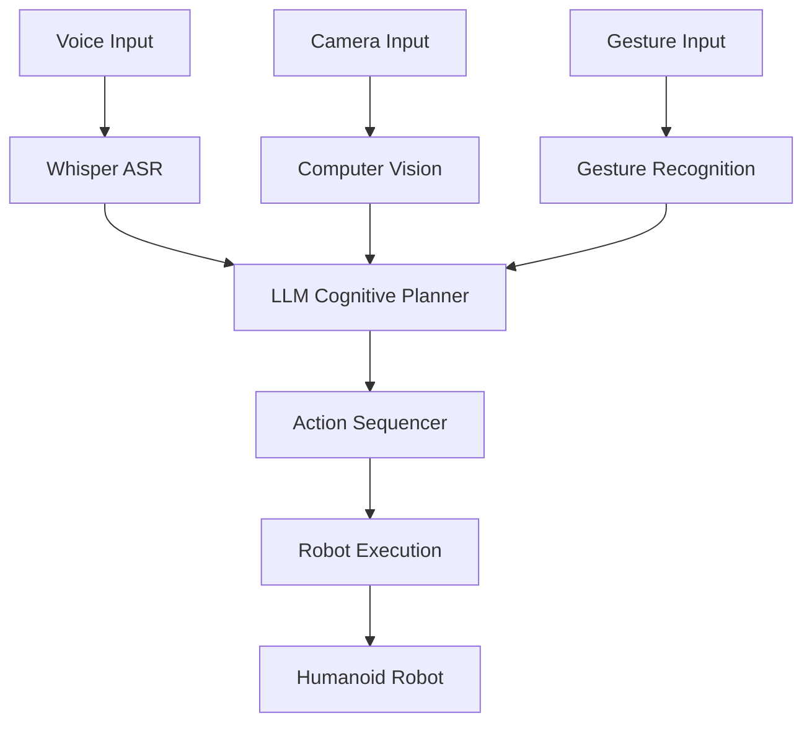

# Module 4: Vision-Language-Action (VLA) and Capstone Project


## Learning Objectives
By the end of this module, you will be able to:
- Understand Vision-Language-Action (VLA) concepts and their importance in Physical AI
- Implement voice-to-action systems using OpenAI Whisper for voice commands
- Use LLMs for cognitive planning and translating natural language to robot tasks
- Integrate multi-modal interaction combining speech, vision, and gesture
- Complete a comprehensive capstone project with an autonomous humanoid simulation

## Core Theory

### Introduction to Vision-Language-Action (VLA)
Vision-Language-Action (VLA) represents an integrated approach where robots can:
- Perceive the environment through vision systems
- Understand natural language commands
- Execute appropriate actions based on understanding

### Voice-to-Action with OpenAI Whisper
OpenAI Whisper is an Automatic Speech Recognition (ASR) system that:
- Converts spoken language to text
- Works with multiple languages and accents
- Provides timestamps for speech segments
- Integrates with ROS 2 for command processing

### Cognitive Planning with LLMs
Large Language Models can be used for:
- Natural language understanding and interpretation
- Task decomposition into executable steps
- Context-aware planning
- Error recovery and adaptation

### Multi-Modal Interaction
Effective human-robot interaction requires:
- Voice input processing
- Visual scene understanding
- Gesture recognition
- Context integration from multiple modalities

### Capstone: Autonomous Humanoid Simulation
The capstone integrates all components:
- Voice command interpretation
- Path planning and navigation
- Object identification and manipulation
- Multi-modal interaction

## Practical Examples

### Voice Command Processing Node
```python
import rclpy
from rclpy.node import Node
from std_msgs.msg import String
import openai
import speech_recognition as sr

class VoiceCommandNode(Node):
    def __init__(self):
        super().__init__('voice_command_node')
        self.publisher = self.create_publisher(String, 'robot_commands', 10)
        self.recognizer = sr.Recognizer()
        self.microphone = sr.Microphone()

        # Set up microphone
        with self.microphone as source:
            self.recognizer.adjust_for_ambient_noise(source)

        # Timer to continuously listen
        self.timer = self.create_timer(5.0, self.listen_for_command)

    def listen_for_command(self):
        try:
            with self.microphone as source:
                self.get_logger().info("Listening for command...")
                audio = self.recognizer.listen(source, timeout=5)

            # Use Whisper API for speech recognition
            # Note: In a real implementation, you'd use local Whisper or OpenAI API
            command_text = self.recognizer.recognize_whisper(audio, model="base")

            # Publish command to robot
            msg = String()
            msg.data = command_text
            self.publisher.publish(msg)
            self.get_logger().info(f"Published command: {command_text}")

        except sr.WaitTimeoutError:
            self.get_logger().info("No speech detected")
        except Exception as e:
            self.get_logger().error(f"Error in voice recognition: {e}")
```

### LLM-Based Cognitive Planning
```python
import openai
import json
from typing import List, Dict, Any

class CognitivePlanner:
    def __init__(self, api_key: str):
        self.client = openai.OpenAI(api_key=api_key)

    def plan_from_command(self, command: str, robot_capabilities: List[str]) -> List[Dict[str, Any]]:
        """
        Convert natural language command to sequence of ROS 2 actions
        """
        prompt = f"""
        Given the following robot capabilities: {robot_capabilities}

        Convert this natural language command to a sequence of specific robot actions:
        "{command}"

        Return a JSON array of actions, where each action has:
        - type: The type of action (navigation, manipulation, sensing, etc.)
        - parameters: The specific parameters for the action
        - description: A brief description of what the action does

        Example response:
        [
            {{
                "type": "navigation",
                "parameters": {{"x": 1.0, "y": 2.0, "theta": 0.0}},
                "description": "Navigate to position (1.0, 2.0)"
            }},
            {{
                "type": "manipulation",
                "parameters": {{"object_id": "cup", "action": "grasp"}},
                "description": "Grasp the cup"
            }}
        ]
        """

        response = self.client.chat.completions.create(
            model="gpt-3.5-turbo",
            messages=[{"role": "user", "content": prompt}],
            temperature=0.1
        )

        # Parse the response to extract the action sequence
        try:
            # In a real implementation, you'd parse the JSON response properly
            # This is a simplified example
            actions_str = response.choices[0].message.content
            # Extract JSON from response
            start_idx = actions_str.find('[')
            end_idx = actions_str.rfind(']') + 1
            if start_idx != -1 and end_idx != 0:
                actions_json = actions_str[start_idx:end_idx]
                return json.loads(actions_json)
        except:
            # Fallback: return a simple action
            return [{"type": "unknown", "parameters": {}, "description": "Unable to parse command"}]

        return [{"type": "unknown", "parameters": {}, "description": "Unable to parse command"}]
```

### Multi-Modal Integration Example
```python
import rclpy
from rclpy.node import Node
from sensor_msgs.msg import Image, CameraInfo
from std_msgs.msg import String
from cv_bridge import CvBridge
import cv2

class MultiModalNode(Node):
    def __init__(self):
        super().__init__('multi_modal_node')

        # Subscriptions for different modalities
        self.image_sub = self.create_subscription(
            Image, '/camera/rgb/image_raw', self.image_callback, 10)
        self.voice_sub = self.create_subscription(
            String, '/voice_commands', self.voice_callback, 10)

        # Publisher for robot actions
        self.action_pub = self.create_publisher(String, '/robot_actions', 10)

        self.bridge = CvBridge()
        self.latest_image = None
        self.latest_command = None

    def image_callback(self, msg):
        # Convert ROS Image to OpenCV
        self.latest_image = self.bridge.imgmsg_to_cv2(msg, desired_encoding='bgr8')

        # Process image (e.g., object detection)
        if self.latest_command:
            self.process_command_with_vision()

    def voice_callback(self, msg):
        self.latest_command = msg.data
        self.get_logger().info(f"Received voice command: {msg.data}")

        if self.latest_image:
            self.process_command_with_vision()

    def process_command_with_vision(self):
        # Combine voice command with visual information
        if self.latest_command and self.latest_image:
            # Example: "Pick up the red cup" - identify red cup in image
            processed_action = self.interpret_command_with_vision(
                self.latest_command, self.latest_image)

            # Publish action to robot
            action_msg = String()
            action_msg.data = processed_action
            self.action_pub.publish(action_msg)

            # Reset for next cycle
            self.latest_command = None

    def interpret_command_with_vision(self, command, image):
        # Simplified example: detect objects and match with command
        # In a real implementation, this would use more sophisticated perception
        if "red" in command.lower():
            # Simple color detection
            hsv = cv2.cvtColor(image, cv2.COLOR_BGR2HSV)
            lower_red = cv2.np.array([0, 50, 50])
            upper_red = cv2.np.array([10, 255, 255])
            mask1 = cv2.inRange(hsv, lower_red, upper_red)

            # Another red range
            lower_red = cv2.np.array([170, 50, 50])
            upper_red = cv2.np.array([180, 255, 255])
            mask2 = cv2.inRange(hsv, lower_red, upper_red)

            mask = mask1 + mask2
            contours, _ = cv2.findContours(mask, cv2.RETR_EXTERNAL, cv2.CHAIN_APPROX_SIMPLE)

            if len(contours) > 0:
                # Found red object, create action
                return f"Move to location of red object and perform action: {command}"

        return f"Action based on command: {command}"
```

## Diagrams

### VLA Integration Architecture


## Exercises

1. Implement a voice command system that can interpret simple commands like "move forward" or "turn left"
2. Create a cognitive planning system that converts "bring me the blue bottle" into specific robot actions
3. Integrate camera input to identify objects mentioned in voice commands
4. Build a complete capstone project that combines all VLA components for a humanoid robot simulation

## Quiz

1. What are the three components of Vision-Language-Action (VLA)?
2. How does OpenAI Whisper contribute to voice-to-action systems?
3. What challenges arise when integrating multi-modal inputs for robot control?

## References
- [OpenAI Whisper Documentation](https://platform.openai.com/docs/guides/speech-to-text)
- [ROS 2 Navigation Documentation](https://navigation.ros.org/)
- [Large Language Models for Robotics](https://arxiv.org/abs/2304.07212)