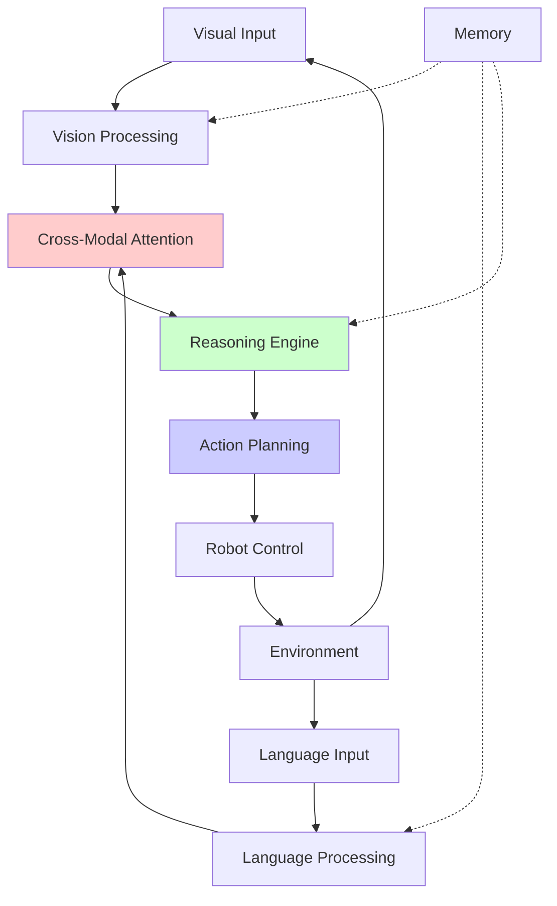

# Chapter 1: Introduction to Vision-Language-Action (VLA)

## Summary
This chapter introduces Vision-Language-Action (VLA) systems, which integrate computer vision, natural language processing, and robotic action for intelligent physical AI systems.

## Learning Objectives
By the end of this chapter, you will be able to:
- Understand the concept of Vision-Language-Action (VLA) systems
- Explain how VLA differs from traditional AI approaches
- Identify components of a VLA system
- Recognize applications of VLA in humanoid robotics
- Understand the importance of multimodal integration
- Appreciate challenges in VLA system design

## Core Theory

### Vision-Language-Action (VLA) Fundamentals
VLA systems combine three key modalities:
- **Vision**: Processing visual information from cameras and sensors
- **Language**: Understanding and generating natural language
- **Action**: Executing physical actions in the environment

### Multimodal Integration
- **Early Fusion**: Combining raw sensory data before processing
- **Late Fusion**: Processing modalities separately then combining
- **Cross-Modal Attention**: Attending to relevant information across modalities
- **Unified Representations**: Creating shared embeddings across modalities

### VLA Architecture Components
- **Perception Module**: Vision and sensor processing
- **Language Understanding**: Natural language processing
- **Action Planning**: Motion and manipulation planning
- **Execution Engine**: Low-level control and actuation
- **Memory System**: Short and long-term memory for context

### VLA in Physical AI
- **Embodied Learning**: Learning through physical interaction
- **Grounded Understanding**: Language grounded in physical experiences
- **Interactive Learning**: Learning from human demonstrations and corrections
- **Contextual Reasoning**: Understanding spatial and temporal relationships

### Challenges in VLA Systems
- **Modal Alignment**: Ensuring consistent representation across modalities
- **Real-time Processing**: Meeting timing constraints for robotic control
- **Uncertainty Handling**: Managing uncertainty in perception and language
- **Generalization**: Transferring learned behaviors to new situations
- **Safety**: Ensuring safe physical interactions

## Practical Examples

### VLA System Architecture
```python
import torch
import torch.nn as nn
import numpy as np
from transformers import AutoTokenizer, AutoModel
from torchvision import transforms
import cv2

class VLAModel(nn.Module):
    def __init__(self, vision_model, language_model, action_model, hidden_dim=512):
        super(VLAModel, self).__init__()

        # Vision encoder
        self.vision_encoder = vision_model
        self.vision_projection = nn.Linear(vision_model.config.hidden_size, hidden_dim)

        # Language encoder
        self.language_encoder = language_model
        self.language_projection = nn.Linear(language_model.config.hidden_size, hidden_dim)

        # Cross-modal attention
        self.cross_attention = nn.MultiheadAttention(hidden_dim, num_heads=8)

        # Action decoder
        self.action_decoder = action_model

        # Fusion layers
        self.fusion_layer = nn.Sequential(
            nn.Linear(hidden_dim * 2, hidden_dim),
            nn.ReLU(),
            nn.Dropout(0.1)
        )

        # Output projection to action space
        self.output_projection = nn.Linear(hidden_dim, action_model.action_dim)

    def forward(self, images, text_inputs, attention_mask=None):
        # Encode visual information
        vision_features = self.vision_encoder(images).last_hidden_state
        vision_embeds = self.vision_projection(vision_features)

        # Encode language information
        language_features = self.language_encoder(text_inputs, attention_mask=attention_mask).last_hidden_state
        language_embeds = self.language_projection(language_features)

        # Cross-modal attention
        attended_vision, _ = self.cross_attention(
            language_embeds, vision_embeds, vision_embeds
        )

        # Fuse multimodal information
        fused_features = torch.cat([attended_vision, language_embeds], dim=-1)
        fused_embeds = self.fusion_layer(fused_features)

        # Decode to actions
        actions = self.output_projection(fused_embeds.mean(dim=1))  # Average pooling over sequence

        return actions

class VLAProcessor:
    def __init__(self, model_path):
        # Initialize tokenizer and model
        self.tokenizer = AutoTokenizer.from_pretrained(model_path)
        self.model = torch.load(model_path)
        self.model.eval()

        # Image preprocessing
        self.image_transform = transforms.Compose([
            transforms.Resize((224, 224)),
            transforms.ToTensor(),
            transforms.Normalize(mean=[0.485, 0.456, 0.406],
                               std=[0.229, 0.224, 0.225])
        ])

    def process_command(self, image, command):
        """Process a vision-language command and generate action"""
        # Preprocess image
        image_tensor = self.image_transform(image).unsqueeze(0)

        # Tokenize command
        text_tokens = self.tokenizer(
            command,
            return_tensors="pt",
            padding=True,
            truncation=True,
            max_length=128
        )

        # Forward pass
        with torch.no_grad():
            actions = self.model(
                image_tensor,
                text_tokens.input_ids,
                attention_mask=text_tokens.attention_mask
            )

        return actions

# Example usage
def example_vla_usage():
    # This is a conceptual example - real implementation would require trained models
    processor = VLAProcessor("path/to/pretrained/vla/model")

    # Example: "Pick up the red cup on the table"
    command = "Pick up the red cup on the table"
    image = cv2.imread("scene_with_red_cup.jpg")

    actions = processor.process_command(image, command)
    print(f"Generated actions: {actions}")

    return actions
```

### VLA Pipeline Example
```python
import asyncio
from typing import Dict, Any, List
import numpy as np

class VLAPipeline:
    def __init__(self):
        # Initialize components
        self.perception_module = VisionLanguagePerception()
        self.reasoning_module = CognitiveReasoningEngine()
        self.action_module = ActionPlanner()

    async def process_vla_request(self, image, command, context=None):
        """Process a complete VLA request"""
        # Step 1: Perception - Understand visual scene and language command
        perception_result = await self.perception_module.process(image, command)

        # Step 2: Reasoning - Plan actions based on perception and context
        action_plan = await self.reasoning_module.plan(
            perception_result,
            command,
            context
        )

        # Step 3: Action - Execute planned actions
        execution_result = await self.action_module.execute(action_plan)

        return {
            'perception': perception_result,
            'plan': action_plan,
            'execution': execution_result,
            'success': execution_result.success
        }

class VisionLanguagePerception:
    def __init__(self):
        # Initialize vision and language models
        self.object_detector = self.initialize_object_detector()
        self.language_parser = self.initialize_language_parser()

    async def process(self, image, command):
        """Process visual and linguistic input"""
        # Detect objects in image
        objects = self.detect_objects(image)

        # Parse language command
        parsed_command = self.parse_command(command)

        # Ground language in visual scene
        grounded_entities = self.ground_language_in_scene(
            parsed_command, objects
        )

        return {
            'objects': objects,
            'command': parsed_command,
            'grounded_entities': grounded_entities,
            'scene_graph': self.build_scene_graph(objects)
        }

    def detect_objects(self, image):
        """Detect objects in the image"""
        # In real implementation, this would use a vision model
        # For example: YOLO, DETR, or Segment Anything
        return [
            {'name': 'cup', 'bbox': [100, 100, 150, 150], 'confidence': 0.9},
            {'name': 'table', 'bbox': [50, 200, 300, 300], 'confidence': 0.85}
        ]

    def parse_command(self, command):
        """Parse natural language command"""
        # In real implementation, this would use NLP models
        # For example: spaCy, NLTK, or transformer-based parsers
        return {
            'action': 'pick_up',
            'object': 'red cup',
            'location': 'on the table',
            'attributes': {'color': 'red'}
        }

    def ground_language_in_scene(self, command, objects):
        """Ground language entities in visual scene"""
        # Match linguistic entities to visual objects
        grounded_entities = {}

        for obj in objects:
            if command['object'].lower() in obj['name'] or \
               command.get('attributes', {}).get('color') in obj.get('color', ''):
                grounded_entities[obj['name']] = obj

        return grounded_entities

    def build_scene_graph(self, objects):
        """Build scene graph representing spatial relationships"""
        # Create graph of object relationships
        scene_graph = {
            'objects': objects,
            'relationships': [
                {'subject': 'cup', 'relation': 'on', 'object': 'table'},
                {'subject': 'cup', 'relation': 'color', 'object': 'red'}
            ]
        }
        return scene_graph

class CognitiveReasoningEngine:
    def __init__(self):
        self.knowledge_base = self.initialize_knowledge_base()

    async def plan(self, perception_result, command, context):
        """Plan sequence of actions to fulfill command"""
        # Use perception and knowledge to plan actions
        action_sequence = []

        # Example planning logic
        command_action = perception_result['command']['action']
        target_object = perception_result['command']['object']

        if command_action == 'pick_up':
            # Plan pick-up sequence
            action_sequence.extend([
                self.plan_approach_object(target_object, perception_result),
                self.plan_grasp_object(target_object, perception_result),
                self.plan_lift_object(target_object, perception_result)
            ])

        return {
            'action_sequence': action_sequence,
            'reasoning_trace': self.generate_reasoning_trace(
                perception_result, command, action_sequence
            ),
            'confidence': 0.85  # Example confidence score
        }

    def plan_approach_object(self, target_object, perception_result):
        """Plan approach to target object"""
        # Calculate approach path
        object_location = self.get_object_location(target_object, perception_result)

        return {
            'type': 'navigate',
            'target': object_location,
            'approach_vector': self.calculate_approach_vector(object_location)
        }

    def plan_grasp_object(self, target_object, perception_result):
        """Plan grasp of target object"""
        return {
            'type': 'grasp',
            'object': target_object,
            'grasp_type': 'precision_pinch',  # or 'power_grasp', etc.
            'approach_direction': 'top_down'
        }

    def plan_lift_object(self, target_object, perception_result):
        """Plan lift of target object"""
        return {
            'type': 'lift',
            'object': target_object,
            'height': 0.2  # Lift 20cm above surface
        }

    def get_object_location(self, target_object, perception_result):
        """Get location of target object from perception result"""
        # Find target object in detected objects
        for obj in perception_result['objects']:
            if target_object.lower() in obj['name'].lower():
                return {
                    'x': (obj['bbox'][0] + obj['bbox'][2]) / 2,  # Center x
                    'y': (obj['bbox'][1] + obj['bbox'][3]) / 2,  # Center y
                    'bbox': obj['bbox']
                }
        return None

    def calculate_approach_vector(self, object_location):
        """Calculate approach vector for grasping"""
        # Simple approach: move to object center from above
        return [0, 0, -1]  # Approach from above

class ActionPlanner:
    def __init__(self):
        # Initialize action planning components
        pass

    async def execute(self, action_plan):
        """Execute planned actions"""
        success = True
        execution_log = []

        for action in action_plan['action_sequence']:
            try:
                result = await self.execute_single_action(action)
                execution_log.append({
                    'action': action,
                    'result': result,
                    'success': result.get('success', True)
                })

                if not result.get('success', True):
                    success = False
                    break

            except Exception as e:
                execution_log.append({
                    'action': action,
                    'error': str(e),
                    'success': False
                })
                success = False
                break

        return {
            'success': success,
            'execution_log': execution_log,
            'final_state': 'completed' if success else 'failed'
        }

    async def execute_single_action(self, action):
        """Execute a single action"""
        # In real implementation, this would interface with robot control
        # For simulation purposes, we'll return success
        if action['type'] == 'navigate':
            # Simulate navigation
            await asyncio.sleep(0.5)  # Simulate movement time
            return {'success': True, 'position': action['target']}
        elif action['type'] == 'grasp':
            # Simulate grasping
            await asyncio.sleep(0.3)  # Simulate grasp time
            return {'success': True, 'object_grasped': action['object']}
        elif action['type'] == 'lift':
            # Simulate lifting
            await asyncio.sleep(0.4)  # Simulate lift time
            return {'success': True, 'height': action['height']}
        else:
            return {'success': False, 'error': f'Unknown action type: {action["type"]}'}
```

## Diagrams

### VLA System Architecture


## Exercises

1. Design a VLA system architecture for a humanoid robot
2. Implement a simple cross-modal attention mechanism
3. Create a scene graph representation for spatial reasoning
4. Develop a command parser for natural language instructions

## Quiz

1. What are the three main components of a VLA system?
2. What is the difference between early fusion and late fusion in VLA?
3. Why is multimodal integration important for physical AI?

## References
- [VLA Research Papers](https://arxiv.org/search?query=vision+language+action&searchtype=all)
- [Multimodal Deep Learning](https://arxiv.org/abs/1905.12562)
- [Embodied AI Survey](https://arxiv.org/abs/2103.04974)