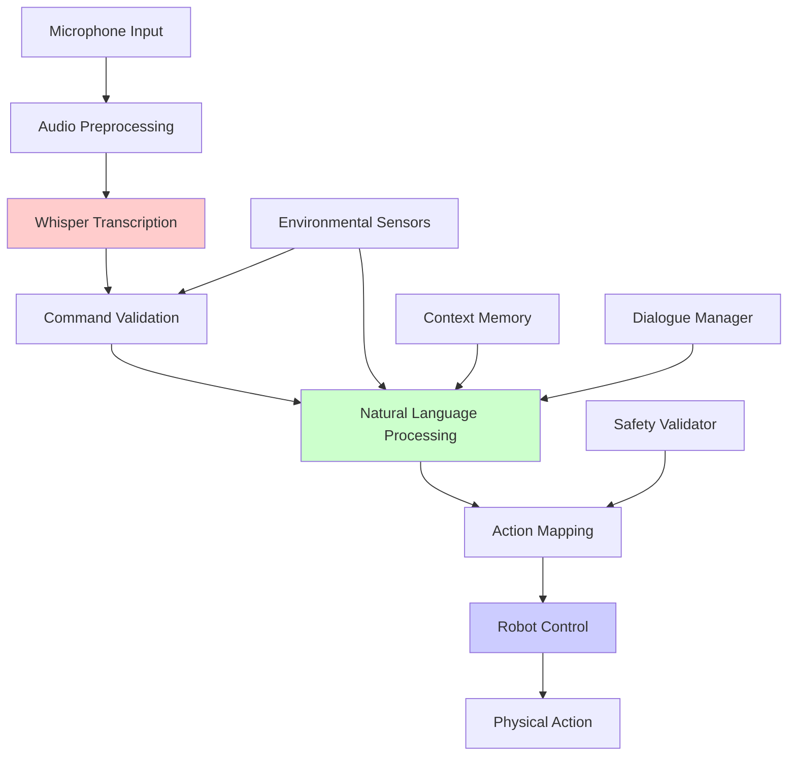

# Chapter 2: Voice-to-Action with OpenAI Whisper


## Learning Objectives
By the end of this chapter, you will be able to:
- Install and configure OpenAI Whisper for speech recognition
- Process voice commands in real-time for robot control
- Convert natural language to ROS 2 action sequences
- Implement voice command validation and error handling
- Integrate Whisper with ROS 2 for robot control
- Design voice interfaces for humanoid robot interaction

## Core Theory

### OpenAI Whisper Fundamentals
Whisper is a general-purpose speech recognition model developed by OpenAI:
- **Multilingual Support**: Supports multiple languages out of the box
- **Robust Recognition**: Handles various accents, background noise, and speaking styles
- **Timestamp Information**: Provides precise timing for speech segments
- **Speaker Diarization**: Identifies different speakers in conversations
- **Punctuation Restoration**: Adds punctuation to transcribed text

### Voice Command Processing Pipeline
- **Audio Capture**: Recording voice commands from microphones
- **Preprocessing**: Noise reduction, normalization, and filtering
- **Transcription**: Converting speech to text using Whisper
- **Command Parsing**: Extracting actionable commands from text
- **Action Mapping**: Converting commands to robot actions
- **Execution**: Sending commands to the robot control system

### Voice Command Design Principles
- **Clear Intent**: Commands should clearly indicate desired action
- **Consistent Format**: Use consistent command structures
- **Error Recovery**: Provide feedback and error correction
- **Context Awareness**: Consider environmental context
- **Safety First**: Implement safety checks before action execution

### Real-time Voice Processing
- **Streaming Recognition**: Process audio in chunks for real-time response
- **Wake Word Detection**: Trigger recognition with specific wake words
- **Buffer Management**: Efficiently manage audio buffers
- **Latency Optimization**: Minimize delay between command and action
- **Resource Management**: Balance accuracy with computational requirements

## Practical Examples

### Whisper Integration with ROS 2
```python
import rclpy
from rclpy.node import Node
from std_msgs.msg import String
from sensor_msgs.msg import AudioData
import whisper
import torch
import pyaudio
import numpy as np
import threading
import queue
import time

class WhisperVoiceCommandNode(Node):
    def __init__(self):
        super().__init__('whisper_voice_command')

        # Initialize Whisper model
        self.get_logger().info("Loading Whisper model...")
        self.model = whisper.load_model("base")  # Use "small" or "medium" for better accuracy

        # Audio recording parameters
        self.audio_format = pyaudio.paInt16
        self.channels = 1
        self.rate = 16000
        self.chunk = 1024
        self.record_seconds = 3  # Record for 3 seconds
        self.silence_threshold = 500  # Threshold for silence detection

        # Publishers and subscribers
        self.command_pub = self.create_publisher(String, '/robot/voice_command', 10)
        self.status_pub = self.create_publisher(String, '/voice_recognition/status', 10)

        # Audio buffer
        self.audio_queue = queue.Queue()

        # Start audio recording thread
        self.recording_thread = threading.Thread(target=self.audio_recording_loop)
        self.recording_thread.daemon = True
        self.recording_thread.start()

        # Timer for processing audio
        self.process_timer = self.create_timer(1.0, self.process_audio_buffer)

        # Internal state
        self.is_listening = True
        self.audio_buffer = []
        self.wake_word = "robot"  # Wake word to activate recognition

        self.get_logger().info("Whisper Voice Command Node initialized")

    def audio_recording_loop(self):
        """Continuously record audio and put chunks in queue"""
        p = pyaudio.PyAudio()

        stream = p.open(
            format=self.audio_format,
            channels=self.channels,
            rate=self.rate,
            input=True,
            frames_per_buffer=self.chunk
        )

        self.get_logger().info("Started audio recording...")

        while self.is_listening:
            try:
                data = stream.read(self.chunk, exception_on_overflow=False)
                self.audio_queue.put(data)
            except Exception as e:
                self.get_logger().error(f"Audio recording error: {e}")
                break

        stream.stop_stream()
        stream.close()
        p.terminate()

    def process_audio_buffer(self):
        """Process accumulated audio and convert to text"""
        # Collect audio data from queue
        frames = []
        while not self.audio_queue.empty():
            frames.append(self.audio_queue.get())

        if len(frames) == 0:
            return  # No audio to process

        # Convert frames to numpy array
        audio_data = b''.join(frames)
        audio_np = np.frombuffer(audio_data, dtype=np.int16)

        # Convert to float32 and normalize
        audio_float = audio_np.astype(np.float32) / 32768.0

        # Check if audio has sufficient energy (not just silence)
        if np.max(np.abs(audio_float)) < self.silence_threshold / 32768.0:
            return  # Likely just silence, skip processing

        try:
            # Transcribe audio using Whisper
            result = self.model.transcribe(audio_float)
            transcription = result['text'].strip()

            if transcription:
                self.get_logger().info(f"Recognized: '{transcription}'")

                # Check for wake word
                if self.wake_word.lower() in transcription.lower():
                    # Extract command (everything after wake word)
                    command_start = transcription.lower().find(self.wake_word.lower()) + len(self.wake_word)
                    command = transcription[command_start:].strip()

                    if command:
                        self.process_voice_command(command)
                else:
                    # Optionally process any command without wake word (for direct interaction)
                    self.process_voice_command(transcription)

        except Exception as e:
            self.get_logger().error(f"Transcription error: {e}")

    def process_voice_command(self, command):
        """Process recognized voice command"""
        self.get_logger().info(f"Processing command: '{command}'")

        # Validate command
        if not self.validate_command(command):
            self.get_logger().warn(f"Invalid command: '{command}'")
            return

        # Convert natural language to ROS 2 command
        ros_command = self.natural_language_to_ros(command)

        if ros_command:
            # Publish command to robot
            cmd_msg = String()
            cmd_msg.data = ros_command
            self.command_pub.publish(cmd_msg)

            self.get_logger().info(f"Published command: '{ros_command}'")

            # Publish status update
            status_msg = String()
            status_msg.data = f"Command executed: {command}"
            self.status_pub.publish(status_msg)
        else:
            self.get_logger().warn(f"Could not parse command: '{command}'")

    def validate_command(self, command):
        """Validate if command is safe and appropriate"""
        # Check for dangerous commands
        dangerous_keywords = [
            'shutdown', 'power off', 'emergency stop', 'self destruct',
            'jump', 'run fast', 'break', 'damage', 'destroy'
        ]

        command_lower = command.lower()
        for keyword in dangerous_keywords:
            if keyword in command_lower:
                return False  # Command is potentially dangerous

        # Check command length (reasonable limits)
        if len(command) < 3 or len(command) > 100:
            return False

        return True

    def natural_language_to_ros(self, command):
        """Convert natural language command to ROS 2 command format"""
        # Define command mappings
        command_mappings = {
            # Movement commands
            'forward': 'move_forward',
            'backward': 'move_backward',
            'back': 'move_backward',
            'left': 'turn_left',
            'right': 'turn_right',
            'stop': 'stop',
            'halt': 'stop',
            'come': 'move_to_user',
            'follow': 'follow_user',
            'go to': 'navigate_to',
            'walk to': 'navigate_to',

            # Object interaction
            'pick up': 'pick_up_object',
            'take': 'pick_up_object',
            'grab': 'grasp_object',
            'put down': 'release_object',
            'drop': 'release_object',
            'place': 'place_object',

            # Navigation
            'go': 'navigate_to',
            'move to': 'navigate_to',
            'navigate to': 'navigate_to',
            'find': 'locate_object',
            'look for': 'locate_object',
            'search for': 'locate_object',

            # Social interaction
            'hello': 'greet_user',
            'hi': 'greet_user',
            'wave': 'wave_gesture',
            'nod': 'nod_gesture',
            'shake': 'shake_hands',
        }

        # Convert command to ROS format
        command_lower = command.lower()

        # Check for specific command patterns
        for pattern, ros_cmd in command_mappings.items():
            if pattern in command_lower:
                # Extract target/object if present
                if 'go to' in command_lower or 'move to' in command_lower or 'navigate to' in command_lower:
                    # Extract destination
                    target_start = command_lower.find(pattern) + len(pattern)
                    target = command[target_start:].strip()
                    if target:
                        return f"{ros_cmd}:{target}"
                elif 'pick up' in command_lower or 'take' in command_lower or 'grab' in command_lower:
                    # Extract object to pick up
                    target_start = command_lower.find(pattern) + len(pattern)
                    target = command[target_start:].strip()
                    if target:
                        return f"{ros_cmd}:{target}"
                else:
                    return ros_cmd

        # If no specific pattern matched, try to infer command
        if any(word in command_lower for word in ['move', 'go', 'walk']):
            return 'move_autonomous'
        elif any(word in command_lower for word in ['stop', 'halt', 'wait']):
            return 'stop'
        elif any(word in command_lower for word in ['hello', 'hi', 'greet']):
            return 'greet_user'
        elif any(word in command_lower for word in ['help', 'assist']):
            return 'provide_assistance'

        # If command cannot be mapped, return None
        return None

    def destroy_node(self):
        """Clean up resources"""
        self.is_listening = False
        super().destroy_node()


def main(args=None):
    rclpy.init(args=args)

    voice_node = WhisperVoiceCommandNode()

    try:
        rclpy.spin(voice_node)
    except KeyboardInterrupt:
        voice_node.get_logger().info("Shutting down Whisper Voice Command Node")
    finally:
        voice_node.destroy_node()
        rclpy.shutdown()

if __name__ == '__main__':
    main()
```

### Voice Command Validation Service
```python
import rclpy
from rclpy.node import Node
from std_msgs.msg import String
from std_srvs.srv import Trigger
from humanoid_msgs.srv import ValidateVoiceCommand

class VoiceCommandValidator(Node):
    def __init__(self):
        super().__init__('voice_command_validator')

        # Service to validate voice commands
        self.validation_service = self.create_service(
            ValidateVoiceCommand,
            '/voice_command/validate',
            self.validate_command_callback
        )

        # Safety parameters
        self.forbidden_commands = [
            'self_destruct', 'emergency_stop', 'power_off',
            'unsafe_movement', 'ignore_safety'
        ]
        self.max_command_length = 200
        self.min_confidence = 0.7

        self.get_logger().info("Voice Command Validator initialized")

    def validate_command_callback(self, request, response):
        """Validate voice command for safety and appropriateness"""
        command = request.command
        confidence = request.confidence if request.confidence > 0 else 1.0

        # Check confidence level
        if confidence < self.min_confidence:
            response.success = False
            response.message = f"Command confidence too low: {confidence:.2f} < {self.min_confidence}"
            return response

        # Check command length
        if len(command) > self.max_command_length:
            response.success = False
            response.message = f"Command too long: {len(command)} > {self.max_command_length}"
            return response

        # Check forbidden commands
        command_lower = command.lower()
        for forbidden in self.forbidden_commands:
            if forbidden in command_lower:
                response.success = False
                response.message = f"Forbidden command detected: {forbidden}"
                return response

        # Check for potentially unsafe patterns
        unsafe_patterns = [
            ('speed', 'fast'),  # Moving too fast
            ('jump', ''),       # Jumping commands
            ('run', 'fast'),    # Running too fast
            ('force', 'high'),  # High force commands
        ]

        for pattern1, pattern2 in unsafe_patterns:
            if pattern1 in command_lower and (not pattern2 or pattern2 in command_lower):
                response.success = False
                response.message = f"Potentially unsafe command pattern detected: {pattern1}"
                return response

        # Command is valid
        response.success = True
        response.message = "Command validated successfully"
        return response


class VoiceCommandSafetyFilter(Node):
    def __init__(self):
        super().__init__('voice_command_safety_filter')

        # Subscribe to raw voice commands
        self.raw_command_sub = self.create_subscription(
            String,
            '/voice_recognition/raw_command',
            self.raw_command_callback,
            10
        )

        # Publish filtered/safe commands
        self.filtered_command_pub = self.create_publisher(
            String,
            '/voice_recognition/filtered_command',
            10
        )

        # Create client for validation service
        self.validation_client = self.create_client(
            ValidateVoiceCommand,
            '/voice_command/validate'
        )

        # Wait for service to be available
        while not self.validation_client.wait_for_service(timeout_sec=1.0):
            self.get_logger().info('Validation service not available, waiting...')

        self.get_logger().info("Voice Command Safety Filter initialized")

    def raw_command_callback(self, msg):
        """Process raw voice command through safety filter"""
        raw_command = msg.data

        # Create validation request
        request = ValidateVoiceCommand.Request()
        request.command = raw_command
        request.confidence = 1.0  # Default confidence

        # Call validation service asynchronously
        future = self.validation_client.call_async(request)
        future.add_done_callback(lambda future: self.handle_validation_response(future, raw_command))

    def handle_validation_response(self, future, original_command):
        """Handle validation response"""
        try:
            response = future.result()

            if response.success:
                # Command is safe, publish it
                safe_cmd_msg = String()
                safe_cmd_msg.data = original_command
                self.filtered_command_pub.publish(safe_cmd_msg)
                self.get_logger().info(f"Safe command published: {original_command}")
            else:
                # Command is unsafe, log warning
                self.get_logger().warn(f"Unsafe command blocked: {original_command} - {response.message}")

        except Exception as e:
            self.get_logger().error(f"Service call failed: {e}")
```

### Whisper-Based Dialog Manager
```python
import asyncio
from typing import Dict, List, Optional
from dataclasses import dataclass
import re

@dataclass
class ConversationTurn:
    """Represents a turn in a conversation"""
    user_input: str
    robot_response: str
    timestamp: float
    context: Dict[str, any]

class DialogManager:
    def __init__(self):
        self.conversation_history: List[ConversationTurn] = []
        self.current_context = {}
        self.max_history_length = 10

    async def process_voice_command(self, voice_input: str) -> str:
        """Process voice command and generate appropriate response"""
        # Add to conversation history
        turn = ConversationTurn(
            user_input=voice_input,
            robot_response="",
            timestamp=asyncio.get_event_loop().time(),
            context=self.current_context.copy()
        )

        # Process the command based on context
        response = await self.generate_response(voice_input)

        # Update turn with response
        turn.robot_response = response
        self.conversation_history.append(turn)

        # Maintain history size
        if len(self.conversation_history) > self.max_history_length:
            self.conversation_history.pop(0)

        # Update context based on interaction
        await self.update_context(voice_input, response)

        return response

    async def generate_response(self, user_input: str) -> str:
        """Generate appropriate response to user input"""
        user_input_lower = user_input.lower()

        # Check for greetings
        if any(greeting in user_input_lower for greeting in ['hello', 'hi', 'hey', 'good morning', 'good afternoon']):
            return "Hello! How can I assist you today?"

        # Check for gratitude
        if any(thanks in user_input_lower for thanks in ['thank you', 'thanks', 'appreciate it']):
            return "You're welcome! Is there anything else I can help with?"

        # Check for simple questions
        if '?' in user_input:
            return await self.process_question(user_input)

        # Check for commands
        if await self.is_command(user_input):
            return await self.process_command(user_input)

        # Default response
        return "I understood your input. How else may I assist you?"

    async def process_question(self, question: str) -> str:
        """Process a question and generate answer"""
        question_lower = question.lower()

        # Knowledge-based responses
        if 'name' in question_lower:
            return "I am your humanoid assistant robot. You can call me Assistant."
        elif 'time' in question_lower:
            import datetime
            current_time = datetime.datetime.now().strftime("%H:%M")
            return f"The current time is {current_time}."
        elif 'weather' in question_lower:
            return "I don't have access to weather information, but I can help with indoor tasks."
        elif 'help' in question_lower or 'assist' in question_lower:
            return "I can help with navigation, object manipulation, and basic interactions. What would you like me to do?"
        else:
            return "I can help with various tasks. Could you please specify what you need assistance with?"

    async def process_command(self, command: str) -> str:
        """Process a command and prepare for execution"""
        # This would typically interface with the action planner
        # For simulation, we'll return a confirmation
        return f"I will execute the command: '{command}'. Starting execution now."

    async def is_command(self, text: str) -> bool:
        """Determine if text is a command vs a question or statement"""
        # Look for action verbs at the beginning
        command_verbs = [
            'move', 'go', 'walk', 'turn', 'rotate', 'stop', 'start',
            'pick', 'take', 'grab', 'put', 'place', 'drop', 'release',
            'find', 'locate', 'search', 'look', 'bring', 'fetch',
            'follow', 'come', 'approach', 'avoid', 'stay'
        ]

        text_lower = text.lower().strip()
        words = text_lower.split()

        if not words:
            return False

        # Check if first word is a command verb
        return words[0] in command_verbs

    async def update_context(self, user_input: str, response: str):
        """Update conversation context based on interaction"""
        # Extract entities and update context
        self.current_context['last_interaction'] = asyncio.get_event_loop().time()
        self.current_context['last_user_input'] = user_input
        self.current_context['last_response'] = response

        # Extract potential objects or locations from user input
        # This is a simplified example - real implementation would use NLP
        if 'table' in user_input.lower():
            self.current_context['focus_object'] = 'table'
        elif 'cup' in user_input.lower():
            self.current_context['focus_object'] = 'cup'
        elif 'door' in user_input.lower():
            self.current_context['focus_object'] = 'door'

    def get_recent_context(self, num_turns: int = 3) -> List[ConversationTurn]:
        """Get recent conversation turns for context"""
        return self.conversation_history[-num_turns:]

# Example usage
async def example_dialog_system():
    """Example of using the dialog manager with Whisper"""
    dialog_manager = DialogManager()

    # Simulate voice inputs
    voice_inputs = [
        "Hello robot",
        "Can you help me?",
        "Please pick up the red cup",
        "Thank you",
        "Move forward"
    ]

    for voice_input in voice_inputs:
        response = await dialog_manager.process_voice_command(voice_input)
        print(f"User: {voice_input}")
        print(f"Robot: {response}")
        print("---")

# Run example
# asyncio.run(example_dialog_system())
```

## Diagrams

### Voice-to-Action Pipeline


## Exercises

1. Install and configure OpenAI Whisper for voice recognition
2. Implement a voice command validation system
3. Create a natural language to action mapping system
4. Build a complete voice-controlled robot interaction system

## Quiz

1. What are the main advantages of using Whisper for voice recognition?
2. How does the voice command validation system ensure safety?
3. What are the key components of a voice-to-action pipeline?

## References
- [OpenAI Whisper Documentation](https://github.com/openai/whisper)
- [ROS 2 Audio Processing](https://docs.ros.org/en/humble/Tutorials.html#audio-processing)
- [Speech Recognition in Robotics](https://ieeexplore.ieee.org/document/9158056)

## Summary

This chapter focused on implementing voice-to-action systems using OpenAI Whisper for speech recognition in robotics applications. Whisper is a general-purpose speech recognition model that offers multilingual support, robust recognition across different accents and noise conditions, timestamp information for speech segments, speaker diarization, and punctuation restoration.

The chapter detailed the voice command processing pipeline, which includes audio capture from microphones, preprocessing for noise reduction and normalization, transcription using Whisper, command parsing to extract actionable elements from text, action mapping to convert commands to robot actions, and execution through the robot control system. Key design principles for voice commands were emphasized, including clear intent, consistent format, error recovery, context awareness, and safety-first approaches.

Real-time voice processing techniques were covered, including streaming recognition for immediate response, wake word detection to trigger recognition, buffer management for efficient processing, latency optimization to minimize delays, and resource management to balance accuracy with computational requirements. The chapter provided practical implementations of Whisper integration with ROS 2, including audio recording loops, transcription processing, voice command validation, and natural language to ROS command conversion.

Safety considerations were highlighted through voice command validation systems that check for dangerous keywords, validate command length, and ensure appropriate actions. The chapter also covered voice command safety filters that use service-based validation to approve or reject commands before execution. A dialog manager implementation was provided to handle conversational context, maintain conversation history, and update interaction context based on user inputs. The integration of voice commands with robot control systems was demonstrated through practical examples showing how to convert natural language commands into executable robot actions while maintaining safety and reliability.