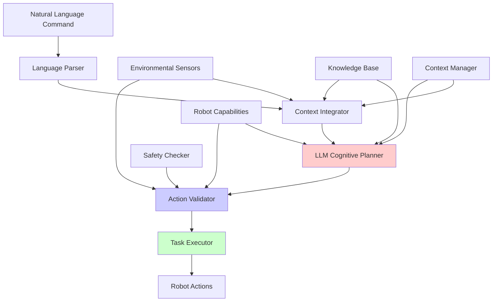

# Chapter 3: Cognitive Planning with LLMs

## Summary
This chapter covers using Large Language Models (LLMs) for cognitive planning in robotics, enabling robots to understand natural language commands and translate them into executable action sequences.

## Learning Objectives
By the end of this chapter, you will be able to:
- Integrate LLMs with robotic systems for cognitive planning
- Parse natural language commands for robotic execution
- Generate action sequences from high-level commands
- Implement contextual reasoning for robot tasks
- Design cognitive architectures for humanoid robots
- Handle ambiguous or complex natural language commands

## Core Theory

### Cognitive Planning Fundamentals
Cognitive planning for robotics involves:
- **Natural Language Understanding**: Interpreting human commands
- **Task Decomposition**: Breaking complex tasks into subtasks
- **Spatial Reasoning**: Understanding locations and relationships
- **Temporal Reasoning**: Planning sequences of actions over time
- **Context Awareness**: Using environmental and situational context

### LLM Integration Challenges
- **Grounding**: Connecting language concepts to physical reality
- **Precision**: Translating abstract commands to specific actions
- **Safety**: Ensuring generated plans are safe for execution
- **Real-time Constraints**: Meeting timing requirements for control
- **Uncertainty Handling**: Managing ambiguous or incomplete information

### Planning Hierarchies
- **High-level Planning**: Task-level decomposition and sequencing
- **Mid-level Planning**: Action selection and parameterization
- **Low-level Planning**: Trajectory generation and control

### Contextual Reasoning
- **Spatial Context**: Understanding locations and relationships
- **Temporal Context**: Understanding timing and sequences
- **Social Context**: Understanding human intentions and preferences
- **Physical Context**: Understanding object properties and affordances

## Practical Examples

### LLM-Based Task Planner
```python
import asyncio
import json
from typing import Dict, List, Any, Optional
from dataclasses import dataclass
import openai
from enum import Enum

class TaskType(Enum):
    NAVIGATION = "navigation"
    MANIPULATION = "manipulation"
    INTERACTION = "interaction"
    SEARCH = "search"
    OTHER = "other"

@dataclass
class RobotAction:
    """Represents a single robot action"""
    action_type: str
    parameters: Dict[str, Any]
    description: str
    estimated_duration: float  # in seconds

@dataclass
class TaskPlan:
    """Represents a complete task plan"""
    task_id: str
    original_command: str
    plan: List[RobotAction]
    estimated_completion_time: float
    confidence: float

class LLMCognitivePlanner:
    def __init__(self, api_key: str, model: str = "gpt-3.5-turbo"):
        self.client = openai.OpenAI(api_key=api_key)
        self.model = model
        self.max_tokens = 1000
        self.temperature = 0.1  # Low temperature for more deterministic output

    async def plan_task(self, command: str, robot_capabilities: List[str],
                       environment_context: Dict[str, Any]) -> Optional[TaskPlan]:
        """Plan a task based on natural language command"""
        try:
            # Create the planning prompt
            prompt = self._create_planning_prompt(command, robot_capabilities, environment_context)

            # Call the LLM
            response = await self._call_llm(prompt)

            # Parse the response
            plan_data = self._parse_llm_response(response)

            # Create task plan
            task_plan = self._create_task_plan(command, plan_data)

            return task_plan

        except Exception as e:
            print(f"Error in task planning: {e}")
            return None

    def _create_planning_prompt(self, command: str, robot_capabilities: List[str],
                               environment_context: Dict[str, Any]) -> str:
        """Create a prompt for the LLM to generate a task plan"""
        prompt = f"""
You are a cognitive planner for a humanoid robot. Your job is to decompose high-level natural language commands into executable action sequences.

Robot Capabilities: {', '.join(robot_capabilities)}

Environment Context: {json.dumps(environment_context, indent=2)}

Command: "{command}"

Please provide a detailed task plan in the following JSON format:
{{
    "task_id": "unique identifier for the task",
    "original_command": "{command}",
    "actions": [
        {{
            "action_type": "specific action type (navigate_to, grasp_object, etc.)",
            "parameters": {{"key": "value", "another_key": "another_value"}},
            "description": "Human-readable description of the action",
            "estimated_duration": 2.5
        }}
    ],
    "estimated_completion_time": 15.0,
    "confidence": 0.85
}}

Guidelines:
- Only use actions that match the robot's capabilities
- Include spatial reasoning for navigation tasks
- Consider environmental constraints
- Break complex tasks into simpler, sequential actions
- Ensure each action is executable and safe
- Provide realistic duration estimates

Response (JSON only, no additional text):
"""

        return prompt

    async def _call_llm(self, prompt: str) -> str:
        """Call the LLM with the given prompt"""
        response = await self.client.chat.completions.create(
            model=self.model,
            messages=[
                {"role": "system", "content": "You are a cognitive planner for a humanoid robot. Respond with valid JSON only."},
                {"role": "user", "content": prompt}
            ],
            max_tokens=self.max_tokens,
            temperature=self.temperature,
            response_format={"type": "json_object"}
        )

        return response.choices[0].message.content

    def _parse_llm_response(self, response: str) -> Dict[str, Any]:
        """Parse the LLM response into a structured format"""
        try:
            # Extract JSON from response if it contains additional text
            start_idx = response.find('{')
            end_idx = response.rfind('}') + 1

            if start_idx != -1 and end_idx != 0:
                json_str = response[start_idx:end_idx]
                return json.loads(json_str)
            else:
                raise ValueError("No valid JSON found in response")

        except json.JSONDecodeError as e:
            print(f"Error parsing LLM response: {e}")
            print(f"Response: {response}")
            # Return a default structure if parsing fails
            return {
                "task_id": "default_task",
                "original_command": "default",
                "actions": [],
                "estimated_completion_time": 0.0,
                "confidence": 0.0
            }

    def _create_task_plan(self, original_command: str, plan_data: Dict[str, Any]) -> TaskPlan:
        """Create a TaskPlan object from parsed data"""
        actions = []

        for action_data in plan_data.get("actions", []):
            action = RobotAction(
                action_type=action_data["action_type"],
                parameters=action_data.get("parameters", {}),
                description=action_data.get("description", ""),
                estimated_duration=action_data.get("estimated_duration", 1.0)
            )
            actions.append(action)

        return TaskPlan(
            task_id=plan_data.get("task_id", "default"),
            original_command=original_command,
            plan=actions,
            estimated_completion_time=plan_data.get("estimated_completion_time", sum(a.estimated_duration for a in actions)),
            confidence=plan_data.get("confidence", 0.5)
        )

class RobotCapabilityManager:
    """Manages robot capabilities and available actions"""

    def __init__(self):
        self.capabilities = [
            "navigate_to_location",
            "grasp_object",
            "release_object",
            "manipulate_object",
            "open_door",
            "close_door",
            "push_button",
            "pickup_item",
            "place_item",
            "follow_person",
            "stop_motion",
            "wave_hand",
            "nod_head",
            "speak_text",
            "listen_for_speech",
            "detect_objects",
            "measure_distance",
            "avoid_obstacles"
        ]

        # Action schemas for validation
        self.action_schemas = {
            "navigate_to_location": {
                "required": ["location"],
                "optional": ["orientation", "speed"]
            },
            "grasp_object": {
                "required": ["object_id", "grasp_type"],
                "optional": ["approach_vector", "force_limit"]
            },
            "release_object": {
                "required": ["object_id"],
                "optional": ["placement_location"]
            },
            "manipulate_object": {
                "required": ["object_id", "manipulation_type"],
                "optional": ["parameters"]
            }
        }

    def get_available_capabilities(self) -> List[str]:
        """Get list of available robot capabilities"""
        return self.capabilities.copy()

    def validate_action(self, action: RobotAction) -> bool:
        """Validate that an action is valid for this robot"""
        if action.action_type not in self.capabilities:
            return False

        schema = self.action_schemas.get(action.action_type, {})
        required_fields = schema.get("required", [])

        for field in required_fields:
            if field not in action.parameters:
                return False

        return True
```

### Context-Aware Planning System
```python
import asyncio
from typing import Dict, List, Any, Optional
from dataclasses import dataclass, field
import json
import copy

@dataclass
class EnvironmentalContext:
    """Represents the current environmental context"""
    objects: List[Dict[str, Any]] = field(default_factory=list)
    locations: List[Dict[str, Any]] = field(default_factory=list)
    spatial_relationships: List[Dict[str, Any]] = field(default_factory=list)
    time_of_day: str = "day"
    lighting_conditions: str = "normal"
    people_present: List[Dict[str, Any]] = field(default_factory=list)
    obstacles: List[Dict[str, Any]] = field(default_factory=list)
    robot_state: Dict[str, Any] = field(default_factory=dict)

@dataclass
class TaskContext:
    """Context for a specific task"""
    current_task: str = ""
    task_history: List[str] = field(default_factory=list)
    user_preferences: Dict[str, Any] = field(default_factory=dict)
    safety_constraints: List[str] = field(default_factory=list)
    environmental_context: EnvironmentalContext = field(default_factory=EnvironmentalContext)

class ContextAwarePlanner:
    def __init__(self):
        self.current_context = TaskContext()
        self.planning_history = []
        self.knowledge_base = {}  # Stores learned information

    async def update_context(self, new_context: EnvironmentalContext):
        """Update the current environmental context"""
        self.current_context.environmental_context = new_context

        # Update knowledge base with new observations
        await self._update_knowledge_base(new_context)

    async def plan_with_context(self, command: str, planner: LLMCognitivePlanner) -> Optional[TaskPlan]:
        """Plan a task considering the current context"""
        # Prepare context for the planner
        context_dict = self._context_to_dict()

        # Get robot capabilities
        capability_manager = RobotCapabilityManager()
        capabilities = capability_manager.get_available_capabilities()

        # Generate plan with context
        plan = await planner.plan_task(command, capabilities, context_dict)

        if plan:
            # Validate plan against context constraints
            validated_plan = await self._validate_plan_with_context(plan)
            return validated_plan

        return None

    def _context_to_dict(self) -> Dict[str, Any]:
        """Convert context to dictionary format for LLM"""
        env_ctx = self.current_context.environmental_context

        return {
            "environment": {
                "objects": env_ctx.objects,
                "locations": env_ctx.locations,
                "spatial_relationships": env_ctx.spatial_relationships,
                "obstacles": env_ctx.obstacles,
                "people": env_ctx.people_present,
                "time_of_day": env_ctx.time_of_day,
                "lighting": env_ctx.lighting_conditions
            },
            "robot_state": env_ctx.robot_state,
            "task_context": {
                "current_task": self.current_context.current_task,
                "task_history": self.current_context.task_history,
                "user_preferences": self.current_context.user_preferences,
                "safety_constraints": self.current_context.safety_constraints
            },
            "knowledge_base": self.knowledge_base
        }

    async def _validate_plan_with_context(self, plan: TaskPlan) -> TaskPlan:
        """Validate a plan against contextual constraints"""
        validated_actions = []

        for action in plan.plan:
            # Check if action conflicts with environmental constraints
            if await self._is_action_safe_in_context(action):
                validated_actions.append(action)
            else:
                # Modify action to comply with constraints or skip
                modified_action = await self._modify_action_for_safety(action)
                if modified_action:
                    validated_actions.append(modified_action)

        # Create new plan with validated actions
        validated_plan = TaskPlan(
            task_id=plan.task_id,
            original_command=plan.original_command,
            plan=validated_actions,
            estimated_completion_time=sum(a.estimated_duration for a in validated_actions),
            confidence=min(plan.confidence, 0.95)  # Reduce confidence if modifications were made
        )

        return validated_plan

    async def _is_action_safe_in_context(self, action: RobotAction) -> bool:
        """Check if an action is safe given the current context"""
        env_ctx = self.current_context.environmental_context

        # Check for obstacle conflicts
        if action.action_type.startswith("navigate") and env_ctx.obstacles:
            for obstacle in env_ctx.obstacles:
                # This is a simplified check - real implementation would be more complex
                if self._is_path_blocked(action, obstacle):
                    return False

        # Check for people safety
        if action.action_type.startswith("grasp") or action.action_type.startswith("manipulate"):
            for person in env_ctx.people_present:
                if self._is_too_close_to_person(action, person):
                    return False

        # Check safety constraints
        for constraint in self.current_context.safety_constraints:
            if not self._satisfies_constraint(action, constraint):
                return False

        return True

    async def _modify_action_for_safety(self, action: RobotAction) -> Optional[RobotAction]:
        """Modify an action to make it safe in the current context"""
        # For now, return the original action (in real implementation, this would modify parameters)
        # Or return None to skip the action
        return action  # In a real system, this might adjust parameters for safety

    def _is_path_blocked(self, action: RobotAction, obstacle: Dict[str, Any]) -> bool:
        """Check if an action path is blocked by an obstacle"""
        # Simplified implementation - real version would check actual path geometry
        return False

    def _is_too_close_to_person(self, action: RobotAction, person: Dict[str, Any]) -> bool:
        """Check if an action brings robot too close to a person"""
        # Simplified implementation
        return False

    def _satisfies_constraint(self, action: RobotAction, constraint: str) -> bool:
        """Check if an action satisfies a safety constraint"""
        # Simplified implementation
        return True

    async def _update_knowledge_base(self, context: EnvironmentalContext):
        """Update the knowledge base with new environmental information"""
        # Store information about objects, locations, and relationships
        for obj in context.objects:
            obj_id = obj.get("id", obj.get("name", "unknown"))
            if obj_id not in self.knowledge_base:
                self.knowledge_base[obj_id] = {}

            self.knowledge_base[obj_id].update({
                "type": obj.get("type"),
                "location": obj.get("location"),
                "properties": obj.get("properties", {}),
                "last_seen": obj.get("timestamp")
            })
```

### Natural Language Command Processor
```python
import re
from typing import Dict, Any, List, Tuple
import inflect

class NaturalLanguageCommandProcessor:
    """Processes natural language commands and extracts relevant information"""

    def __init__(self):
        self.inflect_engine = inflect.engine()
        self.command_patterns = self._define_command_patterns()
        self.object_classifiers = self._define_object_classifiers()
        self.spatial_indicators = self._define_spacial_indicators()

    def _define_command_patterns(self) -> Dict[str, str]:
        """Define regex patterns for different command types"""
        return {
            # Navigation commands
            "navigate_to": r"(?:go|move|walk|navigate|travel|head|proceed)\s+(?:to|toward|towards|over\s+to)\s+(.+)",
            "navigate_to_location": r"(?:go|move|walk|navigate|travel|head|proceed)\s+(?:to|toward|towards)\s+(the\s+)?(\w+)",
            "follow": r"(?:follow|accompany|escort|go\s+with)\s+(.+)",
            "come_to": r"(?:come|return|get)\s+(?:to|over\s+to|back\s+to)\s+(.+)",

            # Manipulation commands
            "pick_up": r"(?:pick\s+up|take|grasp|grab|get|lift|collect|retrieve|fetch|catch)\s+(?:the\s+)?(.+)",
            "put_down": r"(?:put\s+down|place|set|drop|release|lay|position|deposit)\s+(?:the\s+)?(.+)",
            "move_object": r"(?:move|relocate|shift|transfer|transport)\s+(?:the\s+)?(.+?)\s+(?:to|toward|towards|on(to)?|from)\s+(.+)",
            "open": r"(?:open|unlock|unlatch|unseal|unfasten)\s+(?:the\s+)?(.+)",
            "close": r"(?:close|shut|lock|latch|seal|fasten)\s+(?:the\s+)?(.+)",

            # Interaction commands
            "greet": r"(?:say\s+hello|hello|hi|greet|welcome|wave\s+to|acknowledge)\s*(.+)?",
            "speak": r"(?:say|tell|speak|mention|state|express)\s+(.+)",
            "listen": r"(?:listen|hear|pay\s+attention|attend\s+to)\s+(.+)?",
            "wait": r"(?:wait|pause|hold|stop|stand\s+by|remain\s+stationary)",
            "stop": r"(?:stop|halt|cease|terminate|end|finish)\s*(.+)?",

            # Search commands
            "find": r"(?:find|locate|look\s+for|search\s+for|seek|track\s+down|spot|discover|detect)\s+(.+)",
            "show": r"(?:show|point\s+to|indicate|reveal|display|present)\s+(.+)",
            "describe": r"(?:describe|tell\s+about|explain|detail|characterize)\s+(.+)",
        }

    def _define_object_classifiers(self) -> Dict[str, List[str]]:
        """Define categories of objects"""
        return {
            "container": ["box", "basket", "bag", "drawer", "shelf", "cabinet", "container", "bin"],
            "furniture": ["table", "chair", "desk", "couch", "sofa", "bed", "cabinet", "shelf", "counter"],
            "door": ["door", "gate", "entrance", "exit", "entry"],
            "device": ["computer", "phone", "tablet", "tv", "monitor", "lamp", "switch", "button"],
            "food": ["apple", "banana", "water", "coffee", "cup", "plate", "bottle", "snack"],
            "personal_item": ["keys", "wallet", "phone", "glasses", "hat", "coat", "bag", "book"],
            "cleaning_supply": ["cloth", "towel", "sponge", "broom", "mop", "vacuum", "duster"],
            "tool": ["screwdriver", "hammer", "wrench", "pliers", "knife", "scissors", "tape", "glue"]
        }

    def _define_spacial_indicators(self) -> Dict[str, str]:
        """Define spatial relationship indicators"""
        return {
            # Directional
            "left": "direction:left",
            "right": "direction:right",
            "front": "direction:front",
            "back": "direction:back",
            "behind": "spatial:behind",
            "in_front_of": "spatial:in_front_of",
            "next_to": "spatial:next_to",
            "beside": "spatial:beside",
            "between": "spatial:between",
            "above": "spatial:above",
            "below": "spatial:below",
            "on": "spatial:on",
            "under": "spatial:under",
            "inside": "spatial:inside",
            "outside": "spatial:outside",
            "near": "spatial:near",
            "far": "spatial:far",
            "around": "spatial:around",
            "through": "spatial:through"
        }

    def process_command(self, command: str) -> Dict[str, Any]:
        """Process a natural language command and extract structure"""
        command_lower = command.lower().strip()

        # Extract command type and parameters
        command_structure = {
            "original_command": command,
            "command_type": None,
            "action": None,
            "target_object": None,
            "destination": None,
            "location": None,
            "spatial_relationships": [],
            "quantifiers": [],
            "modifiers": [],
            "confidence": 0.0
        }

        # Try to match command patterns
        for cmd_type, pattern in self.command_patterns.items():
            match = re.search(pattern, command_lower, re.IGNORECASE)
            if match:
                command_structure["command_type"] = cmd_type
                command_structure["action"] = cmd_type.split("_")[0] if "_" in cmd_type else cmd_type

                # Extract parameters based on pattern
                groups = match.groups()
                if groups:
                    if cmd_type.startswith(("navigate", "go", "come")):
                        command_structure["location"] = groups[0].strip()
                    elif cmd_type.startswith(("pick", "take", "grasp")):
                        command_structure["target_object"] = groups[0].strip()
                    elif cmd_type.startswith("move"):
                        command_structure["target_object"] = groups[0].strip()
                        command_structure["destination"] = groups[1].strip()
                    elif cmd_type.startswith(("put", "place")):
                        command_structure["target_object"] = groups[0].strip()
                    elif cmd_type.startswith("find"):
                        command_structure["target_object"] = groups[0].strip()
                    elif cmd_type.startswith("follow"):
                        command_structure["target_object"] = groups[0].strip()

                    command_structure["confidence"] = 0.8  # High confidence for matched patterns
                break

        # If no pattern matched, try general classification
        if not command_structure["command_type"]:
            command_structure.update(self._classify_general_command(command_lower))

        # Extract additional information
        command_structure.update(self._extract_additional_info(command_lower))

        return command_structure

    def _classify_general_command(self, command: str) -> Dict[str, Any]:
        """Classify a command when no specific pattern matches"""
        structure = {"confidence": 0.0}

        # Look for action verbs
        action_words = ["go", "move", "pick", "take", "put", "place", "find", "look", "follow", "stop", "wait"]
        for word in action_words:
            if word in command:
                structure["action"] = word
                structure["command_type"] = f"generic_{word}"
                structure["confidence"] = 0.5  # Lower confidence for general classification
                break

        return structure

    def _extract_additional_info(self, command: str) -> Dict[str, Any]:
        """Extract additional information like quantifiers, modifiers, etc."""
        info = {
            "quantifiers": [],
            "modifiers": [],
            "spatial_relationships": []
        }

        # Extract quantifiers (numbers, amounts)
        number_pattern = r'\b(one|two|three|four|five|six|seven|eight|nine|ten|\d+)\b'
        numbers = re.findall(number_pattern, command, re.IGNORECASE)
        info["quantifiers"].extend(numbers)

        # Extract spatial relationships
        for word, relation_type in self.spatial_indicators.items():
            if word in command:
                info["spatial_relationships"].append(relation_type)

        # Extract modifiers (adjectives, adverbs)
        # This is simplified - real NLP would use POS tagging
        modifier_words = ["carefully", "quickly", "slowly", "gently", "careful", "fast", "slow", "big", "small", "red", "blue", "green"]
        for word in modifier_words:
            if word in command:
                info["modifiers"].append(word)

        return info

    def resolve_command_ambiguity(self, command_structure: Dict[str, Any],
                                  context: EnvironmentalContext) -> Dict[str, Any]:
        """Resolve ambiguity in command interpretation using context"""
        resolved = copy.deepcopy(command_structure)

        # Resolve ambiguous object references
        if resolved.get("target_object"):
            resolved["target_object"] = self._resolve_object_reference(
                resolved["target_object"], context
            )

        # Resolve ambiguous locations
        if resolved.get("location"):
            resolved["location"] = self._resolve_location_reference(
                resolved["location"], context
            )

        # Resolve spatial relationships using context
        if resolved.get("spatial_relationships"):
            resolved["spatial_relationships"] = self._resolve_spatial_relationships(
                resolved["spatial_relationships"], context
            )

        return resolved

    def _resolve_object_reference(self, obj_ref: str, context: EnvironmentalContext) -> str:
        """Resolve ambiguous object reference using context"""
        # Find closest matching object in environment
        obj_ref_lower = obj_ref.lower()

        for obj in context.objects:
            obj_name = obj.get("name", "").lower()
            obj_type = obj.get("type", "").lower()

            # Check if reference matches object name or type
            if obj_ref_lower in obj_name or obj_ref_lower in obj_type:
                return obj_name

        # If no exact match, try partial matching
        for obj in context.objects:
            obj_name = obj.get("name", "").lower()
            obj_type = obj.get("type", "").lower()

            if any(word in obj_name or word in obj_type for word in obj_ref_lower.split()):
                return obj_name

        # Return original if no match found
        return obj_ref

    def _resolve_location_reference(self, loc_ref: str, context: EnvironmentalContext) -> str:
        """Resolve ambiguous location reference using context"""
        loc_ref_lower = loc_ref.lower()

        for location in context.locations:
            loc_name = location.get("name", "").lower()

            if loc_ref_lower in loc_name:
                return loc_name

        # Return original if no match found
        return loc_ref

    def _resolve_spatial_relationships(self, relations: List[str],
                                      context: EnvironmentalContext) -> List[str]:
        """Resolve spatial relationships using environmental context"""
        # This would typically involve geometric reasoning
        # For now, return the relations as-is
        return relations
```

## Diagrams

### Cognitive Planning Architecture


## Exercises

1. Implement an LLM-based task planner for robotic actions
2. Create a context-aware planning system
3. Develop natural language command processing
4. Build a complete cognitive architecture for humanoid robots

## Quiz

1. What are the main challenges in integrating LLMs with robotic systems?
2. How does contextual reasoning improve robot task planning?
3. What are the key components of a cognitive planning architecture?

## References
- [Large Language Models for Robotics](https://arxiv.org/abs/2309.17108)
- [Cognitive Architectures for Robotics](https://ieeexplore.ieee.org/document/9158056)
- [Language Grounding in Robotics](https://arxiv.org/abs/2205.11498)