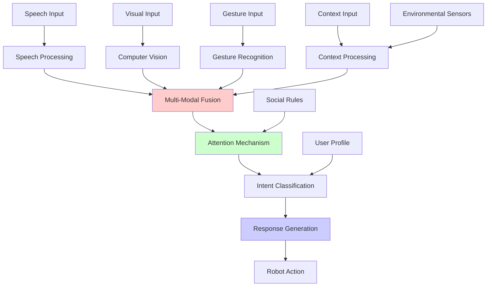

# Chapter 4: Multi-Modal Interaction

## Summary
This chapter covers multi-modal interaction systems that integrate speech, vision, and gesture for natural human-robot interaction, enabling more intuitive and effective communication with humanoid robots.

## Learning Objectives
By the end of this chapter, you will be able to:
- Implement multi-modal perception for human-robot interaction
- Integrate speech, vision, and gesture recognition
- Design fusion mechanisms for multi-modal input
- Create natural interaction patterns for humanoid robots
- Implement attention mechanisms for multi-modal processing
- Validate multi-modal interaction for safety and effectiveness

## Core Theory

### Multi-Modal Interaction Fundamentals
Multi-modal interaction combines multiple input/output modalities:
- **Speech**: Verbal communication and command input
- **Vision**: Face recognition, gesture detection, emotion recognition
- **Gesture**: Hand and body movement interpretation
- **Touch**: Haptic feedback and tactile interaction
- **Context**: Environmental and situational awareness

### Modalities Integration Approaches
- **Early Fusion**: Combining raw inputs from different modalities
- **Late Fusion**: Combining processed information from each modality
- **Intermediate Fusion**: Partial processing followed by combination
- **Attention-based Fusion**: Dynamically weighting modalities based on relevance

### Human-Robot Interaction (HRI) Principles
- **Naturalness**: Interaction should feel intuitive and natural
- **Predictability**: Robot behavior should be predictable
- **Feedback**: Clear feedback for user actions
- **Adaptivity**: Adapting to user preferences and abilities
- **Social Norms**: Following social conventions and etiquette

### Attention Mechanisms
- **Selective Attention**: Focusing on relevant stimuli
- **Divided Attention**: Processing multiple simultaneous inputs
- **Sustained Attention**: Maintaining focus over time
- **Orienting Attention**: Directing attention to important events

### Social Signal Processing
- **Facial Expression Recognition**: Emotion and intent detection
- **Gaze Tracking**: Understanding attention and intention
- **Body Language**: Posture and movement interpretation
- **Proxemics**: Personal space and distance preferences
- **Temporal Coordination**: Turn-taking and timing

## Practical Examples

### Multi-Modal Perception System
```python
import asyncio
from typing import Dict, Any, List, Optional
from dataclasses import dataclass
import numpy as np
import cv2
import mediapipe as mp
from collections import deque
import threading
import queue

@dataclass
class SpeechEvent:
    text: str
    confidence: float
    timestamp: float
    speaker_id: Optional[str] = None

@dataclass
class GestureEvent:
    gesture_type: str
    landmarks: List[List[float]]
    confidence: float
    timestamp: float
    hand: str  # "left" or "right"

@dataclass
class VisualEvent:
    face_detected: bool
    person_id: Optional[str]
    gaze_direction: Optional[List[float]]
    facial_expression: Optional[str]
    timestamp: float

class MultiModalPerceptor:
    def __init__(self):
        # Initialize MediaPipe modules
        self.mp_hands = mp.solutions.hands
        self.mp_face_mesh = mp.solutions.face_mesh
        self.mp_pose = mp.solutions.pose

        self.hands = self.mp_hands.Hands(
            static_image_mode=False,
            max_num_hands=2,
            min_detection_confidence=0.5,
            min_tracking_confidence=0.5
        )

        self.face_mesh = self.mp_face_mesh.FaceMesh(
            static_image_mode=False,
            max_num_faces=1,
            min_detection_confidence=0.5
        )

        self.pose = self.mp_pose.Pose(
            static_image_mode=False,
            model_complexity=1,
            enable_segmentation=False,
            min_detection_confidence=0.5
        )

        # Event queues
        self.speech_queue = queue.Queue()
        self.gesture_queue = queue.Queue()
        self.visual_queue = queue.Queue()

        # Feature trackers
        self.gesture_history = deque(maxlen=10)
        self.face_history = deque(maxlen=10)
        self.speech_history = deque(maxlen=5)

        # State variables
        self.current_attentions = {}
        self.interaction_state = "idle"

        self.get_logger().info("Multi-Modal Perceptor initialized")

    def process_frame(self, frame: np.ndarray) -> Dict[str, Any]:
        """Process a video frame for multi-modal perception"""
        results = {
            'gestures': [],
            'faces': [],
            'poses': [],
            'gaze_estimates': [],
            'facial_expressions': []
        }

        # Convert BGR to RGB
        rgb_frame = cv2.cvtColor(frame, cv2.COLOR_BGR2RGB)

        # Process hands for gesture detection
        hand_results = self.hands.process(rgb_frame)
        if hand_results.multi_hand_landmarks:
            for idx, hand_landmarks in enumerate(hand_results.multi_hand_landmarks):
                handedness = hand_results.multi_handedness[idx].classification[0].label
                gesture = self._recognize_gesture(hand_landmarks, handedness)

                if gesture:
                    results['gestures'].append({
                        'gesture': gesture,
                        'landmarks': [(lm.x, lm.y, lm.z) for lm in hand_landmarks.landmark],
                        'hand': handedness.lower(),
                        'confidence': hand_results.multi_handedness[idx].classification[0].score
                    })

        # Process faces for facial features
        face_results = self.face_mesh.process(rgb_frame)
        if face_results.multi_face_landmarks:
            for face_landmarks in face_results.multi_face_landmarks:
                face_data = self._analyze_face(face_landmarks, frame)
                results['faces'].append(face_data)

        # Process body pose
        pose_results = self.pose.process(rgb_frame)
        if pose_results.pose_landmarks:
            pose_data = self._analyze_pose(pose_results.pose_landmarks)
            results['poses'].append(pose_data)

        return results

    def _recognize_gesture(self, hand_landmarks, hand_type: str) -> Optional[str]:
        """Recognize hand gestures from landmarks"""
        # Calculate distances between key landmarks
        thumb_tip = hand_landmarks.landmark[self.mp_hands.HandLandmark.THUMB_TIP]
        index_tip = hand_landmarks.landmark[self.mp_hands.HandLandmark.INDEX_FINGER_TIP]
        middle_tip = hand_landmarks.landmark[self.mp_hands.HandLandmark.MIDDLE_FINGER_TIP]
        ring_tip = hand_landmarks.landmark[self.mp_hands.HandLandmark.RING_FINGER_TIP]
        pinky_tip = hand_landmarks.landmark[self.mp_hands.HandLandmark.PINKY_TIP]

        # Calculate distances
        index_thumb_dist = np.sqrt(
            (thumb_tip.x - index_tip.x)**2 +
            (thumb_tip.y - index_tip.y)**2 +
            (thumb_tip.z - index_tip.z)**2
        )

        middle_thumb_dist = np.sqrt(
            (thumb_tip.x - middle_tip.x)**2 +
            (thumb_tip.y - middle_tip.y)**2 +
            (thumb_tip.z - middle_tip.z)**2
        )

        # Recognize gestures based on landmark positions
        if index_thumb_dist < 0.05 and middle_thumb_dist < 0.05:
            return "pinch" if hand_type == "Right" else "pinch_left"
        elif index_tip.y < thumb_tip.y and middle_tip.y > thumb_tip.y:
            return "point_up"
        elif index_tip.y > thumb_tip.y and middle_tip.y > thumb_tip.y:
            return "peace_sign"
        elif all(
            tip.y > hand_landmarks.landmark[self.mp_hands.HandLandmark.WRIST].y
            for tip in [index_tip, middle_tip, ring_tip, pinky_tip]
        ):
            return "open_palm"
        elif all(
            tip.y < hand_landmarks.landmark[self.mp_hands.HandLandmark.WRIST].y
            for tip in [index_tip, middle_tip, ring_tip, pinky_tip]
        ):
            return "fist"

        return None

    def _analyze_face(self, face_landmarks, frame) -> Dict[str, Any]:
        """Analyze facial features and expressions"""
        # Calculate facial landmarks for expression analysis
        # This is a simplified example - real implementation would use ML models
        nose_tip = face_landmarks.landmark[1]
        left_eye = face_landmarks.landmark[159]
        right_eye = face_landmarks.landmark[386]
        mouth_left = face_landmarks.landmark[61]
        mouth_right = face_landmarks.landmark[291]

        # Estimate gaze direction (simplified)
        eye_center_x = (left_eye.x + right_eye.x) / 2
        nose_x = nose_tip.x
        gaze_horizontal = "center"
        if nose_x - eye_center_x > 0.1:
            gaze_horizontal = "right"
        elif nose_x - eye_center_x < -0.1:
            gaze_horizontal = "left"

        # Estimate facial expression (simplified)
        mouth_width = np.sqrt((mouth_right.x - mouth_left.x)**2 + (mouth_right.y - mouth_left.y)**2)
        eye_openness = abs(left_eye.y - face_landmarks.landmark[145].y)  # Left eye open/close

        expression = "neutral"
        if mouth_width > 0.15 and eye_openness > 0.05:
            expression = "surprised"
        elif mouth_width < 0.05 and eye_openness < 0.03:
            expression = "sad"
        elif mouth_width > 0.1 and eye_openness > 0.03:
            expression = "happy"

        return {
            'has_face': True,
            'gaze_direction': gaze_horizontal,
            'facial_expression': expression,
            'landmarks': [(lm.x, lm.y, lm.z) for lm in face_landmarks.landmark],
            'confidence': 0.8  # Simplified confidence
        }

    def _analyze_pose(self, pose_landmarks) -> Dict[str, Any]:
        """Analyze body pose and posture"""
        # Extract key pose landmarks
        left_shoulder = pose_landmarks.landmark[self.mp_pose.PoseLandmark.LEFT_SHOULDER]
        right_shoulder = pose_landmarks.landmark[self.mp_pose.PoseLandmark.RIGHT_SHOULDER]
        left_hip = pose_landmarks.landmark[self.mp_pose.PoseLandmark.LEFT_HIP]
        right_hip = pose_landmarks.landmark[self.mp_pose.PoseLandmark.RIGHT_HIP]

        # Calculate body orientation
        shoulder_center_x = (left_shoulder.x + right_shoulder.x) / 2
        hip_center_x = (left_hip.x + right_hip.x) / 2
        facing_direction = "forward"

        if abs(shoulder_center_x - hip_center_x) > 0.1:
            facing_direction = "turned" if shoulder_center_x > hip_center_x else "turned_opposite"

        return {
            'facing_direction': facing_direction,
            'posture': 'standing',  # Simplified
            'landmarks': [(lm.x, lm.y, lm.z) for lm in pose_landmarks.landmark],
            'confidence': 0.7  # Simplified confidence
        }

    def process_speech(self, speech_text: str, confidence: float = 1.0) -> SpeechEvent:
        """Process speech input and create speech event"""
        speech_event = SpeechEvent(
            text=speech_text,
            confidence=confidence,
            timestamp=asyncio.get_event_loop().time()
        )

        self.speech_queue.put(speech_event)
        self.speech_history.append(speech_event)

        return speech_event

    def process_gesture(self, gesture_data: Dict[str, Any]) -> GestureEvent:
        """Process gesture data and create gesture event"""
        gesture_event = GestureEvent(
            gesture_type=gesture_data['gesture'],
            landmarks=gesture_data['landmarks'],
            confidence=gesture_data.get('confidence', 0.8),
            timestamp=asyncio.get_event_loop().time(),
            hand=gesture_data.get('hand', 'unknown')
        )

        self.gesture_queue.put(gesture_event)
        self.gesture_history.append(gesture_event)

        return gesture_event

    def process_visual(self, visual_data: Dict[str, Any]) -> VisualEvent:
        """Process visual data and create visual event"""
        visual_event = VisualEvent(
            face_detected=visual_data.get('has_face', False),
            person_id=visual_data.get('person_id'),
            gaze_direction=visual_data.get('gaze_direction'),
            facial_expression=visual_data.get('facial_expression'),
            timestamp=asyncio.get_event_loop().time()
        )

        self.visual_queue.put(visual_event)
        self.face_history.append(visual_event)

        return visual_event

    def fuse_modalities(self) -> Dict[str, Any]:
        """Fuse information from multiple modalities"""
        fused_data = {
            'attention_focus': None,
            'interaction_intent': None,
            'social_cues': [],
            'user_engagement': 'low',
            'confidence': 0.0,
            'timestamp': asyncio.get_event_loop().time()
        }

        # Get recent events
        recent_speech = list(self.speech_history)[-3:] if self.speech_history else []
        recent_gestures = list(self.gesture_history)[-3:] if self.gesture_history else []
        recent_faces = list(self.face_history)[-5:] if self.face_history else []

        # Determine attention focus
        if recent_faces:
            # If face is detected and looking at robot
            face_events = [f for f in recent_faces if f.face_detected and f.gaze_direction in ['center', 'left', 'right']]
            if face_events:
                fused_data['attention_focus'] = 'face_detected'

                # Check for engagement cues
                engaged_gestures = [g for g in recent_gestures if g.gesture_type in ['open_palm', 'point_up']]
                if engaged_gestures:
                    fused_data['user_engagement'] = 'high'

        # Determine interaction intent
        if recent_speech:
            # Look for command words in recent speech
            command_words = ['robot', 'hey', 'please', 'can you', 'help']
            for speech in recent_speech:
                if any(word in speech.text.lower() for word in command_words):
                    fused_data['interaction_intent'] = 'command'
                    break

        # Combine confidence scores
        speech_conf = max([s.confidence for s in recent_speech], default=0.0)
        visual_conf = max([f.confidence if hasattr(f, 'confidence') else 0.8 for f in recent_faces], default=0.0)
        gesture_conf = max([g.confidence for g in recent_gestures], default=0.0)

        fused_data['confidence'] = max(speech_conf, visual_conf, gesture_conf)

        return fused_data
```

### Multi-Modal Fusion Engine
```python
import numpy as np
from sklearn.preprocessing import StandardScaler
from typing import Dict, List, Any, Optional
import torch
import torch.nn as nn

class MultiModalFusionNetwork(nn.Module):
    def __init__(self, speech_dim=128, vision_dim=512, gesture_dim=64, output_dim=256):
        super(MultiModalFusionNetwork, self).__init__()

        # Modality encoders
        self.speech_encoder = nn.Sequential(
            nn.Linear(speech_dim, 256),
            nn.ReLU(),
            nn.Dropout(0.2),
            nn.Linear(256, 128)
        )

        self.vision_encoder = nn.Sequential(
            nn.Linear(vision_dim, 512),
            nn.ReLU(),
            nn.Dropout(0.3),
            nn.Linear(512, 256)
        )

        self.gesture_encoder = nn.Sequential(
            nn.Linear(gesture_dim, 128),
            nn.ReLU(),
            nn.Dropout(0.2),
            nn.Linear(128, 64)
        )

        # Cross-modal attention
        self.cross_attention = nn.MultiheadAttention(embed_dim=256, num_heads=8)

        # Fusion layers
        self.fusion_layer = nn.Sequential(
            nn.Linear(128 + 256 + 64, 512),
            nn.ReLU(),
            nn.Dropout(0.3),
            nn.Linear(512, output_dim)
        )

        # Attention weights for different modalities
        self.modality_attention = nn.Parameter(torch.ones(3))  # speech, vision, gesture

    def forward(self, speech_features, vision_features, gesture_features):
        # Encode each modality
        speech_encoded = self.speech_encoder(speech_features)
        vision_encoded = self.vision_encoder(vision_features)
        gesture_encoded = self.gesture_encoder(gesture_features)

        # Apply attention weights
        weighted_speech = speech_encoded * torch.sigmoid(self.modality_attention[0])
        weighted_vision = vision_encoded * torch.sigmoid(self.modality_attention[1])
        weighted_gesture = gesture_encoded * torch.sigmoid(self.modality_attention[2])

        # Concatenate encoded features
        combined_features = torch.cat([weighted_speech, weighted_vision, weighted_gesture], dim=-1)

        # Final fusion
        fused_output = self.fusion_layer(combined_features)

        return fused_output, {
            'speech_weight': torch.sigmoid(self.modality_attention[0]),
            'vision_weight': torch.sigmoid(self.modality_attention[1]),
            'gesture_weight': torch.sigmoid(self.modality_attention[2])
        }

class MultiModalInteractionManager:
    def __init__(self):
        # Initialize fusion network
        self.fusion_network = MultiModalFusionNetwork()
        self.feature_scaler = StandardScaler()

        # Interaction context
        self.interaction_context = {
            'user_id': None,
            'session_start_time': None,
            'conversation_turns': 0,
            'attention_history': [],
            'engagement_level': 'low'
        }

        # State tracking
        self.current_interaction_state = 'idle'
        self.pending_interactions = []

        # Confidence thresholds
        self.speech_confidence_threshold = 0.7
        self.vision_confidence_threshold = 0.6
        self.gesture_confidence_threshold = 0.65

    def process_multi_modal_input(self, speech_data: Dict[str, Any],
                                vision_data: Dict[str, Any],
                                gesture_data: Dict[str, Any]) -> Dict[str, Any]:
        """Process multi-modal input and generate interaction response"""

        # Validate input confidences
        if not self._validate_modalities(speech_data, vision_data, gesture_data):
            return self._generate_low_confidence_response()

        # Extract features from modalities
        speech_features = self._extract_speech_features(speech_data)
        vision_features = self._extract_vision_features(vision_data)
        gesture_features = self._extract_gesture_features(gesture_data)

        # Normalize features
        combined_features = np.concatenate([speech_features, vision_features, gesture_features])
        normalized_features = self.feature_scaler.fit_transform(combined_features.reshape(1, -1)).flatten()

        # Split back to modality-specific features
        speech_feat = normalized_features[:len(speech_features)]
        vision_feat = normalized_features[len(speech_features):len(speech_features)+len(vision_features)]
        gesture_feat = normalized_features[len(speech_features)+len(vision_features):]

        # Convert to tensors
        speech_tensor = torch.tensor(speech_feat, dtype=torch.float32).unsqueeze(0)
        vision_tensor = torch.tensor(vision_feat, dtype=torch.float32).unsqueeze(0)
        gesture_tensor = torch.tensor(gesture_feat, dtype=torch.float32).unsqueeze(0)

        # Fuse modalities using neural network
        with torch.no_grad():
            fused_output, attention_weights = self.fusion_network(
                speech_tensor, vision_tensor, gesture_tensor
            )

        # Interpret fused output
        interaction_result = self._interpret_fusion_output(
            fused_output, attention_weights, speech_data, vision_data, gesture_data
        )

        # Update interaction context
        self._update_interaction_context(interaction_result)

        return interaction_result

    def _validate_modalities(self, speech_data, vision_data, gesture_data) -> bool:
        """Validate that modalities meet confidence thresholds"""
        speech_conf = speech_data.get('confidence', 0.0)
        vision_conf = vision_data.get('confidence', 0.0)
        gesture_conf = gesture_data.get('confidence', 0.0)

        return (speech_conf >= self.speech_confidence_threshold and
                vision_conf >= self.vision_confidence_threshold and
                gesture_conf >= self.gesture_confidence_threshold)

    def _extract_speech_features(self, speech_data: Dict[str, Any]) -> np.ndarray:
        """Extract features from speech data"""
        text = speech_data.get('text', '')

        # Simple features: length, word count, presence of command words
        features = [
            len(text),
            len(text.split()),
            float(any(word in text.lower() for word in ['please', 'help', 'robot', 'can you'])),
            float('hello' in text.lower()),
            float('stop' in text.lower()),
            float('?' in text),  # Question indicator
            float('!' in text),  # Exclamation indicator
        ]

        # Pad to fixed dimension
        features.extend([0.0] * (128 - len(features)))  # Assuming 128-dim features
        return np.array(features[:128])

    def _extract_vision_features(self, vision_data: Dict[str, Any]) -> np.ndarray:
        """Extract features from vision data"""
        features = [
            float(vision_data.get('face_detected', False)),
            float(vision_data.get('gaze_direction') == 'center'),
            float(vision_data.get('facial_expression') == 'happy'),
            float(vision_data.get('facial_expression') == 'neutral'),
            float(vision_data.get('facial_expression') == 'surprised'),
            float(vision_data.get('facial_expression') == 'sad'),
        ]

        # Pad to fixed dimension
        features.extend([0.0] * (512 - len(features)))  # Assuming 512-dim features
        return np.array(features[:512])

    def _extract_gesture_features(self, gesture_data: Dict[str, Any]) -> np.ndarray:
        """Extract features from gesture data"""
        gesture_type = gesture_data.get('gesture_type', 'unknown')

        gesture_mapping = {
            'open_palm': 0, 'fist': 1, 'point_up': 2, 'peace_sign': 3, 'pinch': 4,
            'unknown': 5
        }

        features = [
            gesture_mapping.get(gesture_type, 5),  # Gesture type as index
            gesture_data.get('confidence', 0.0),
            float(gesture_data.get('hand') == 'right'),
            float(gesture_data.get('hand') == 'left'),
        ]

        # Pad to fixed dimension
        features.extend([0.0] * (64 - len(features)))  # Assuming 64-dim features
        return np.array(features[:64])

    def _interpret_fusion_output(self, fused_output, attention_weights,
                               speech_data, vision_data, gesture_data) -> Dict[str, Any]:
        """Interpret the fused output to generate interaction response"""

        # Convert tensor to numpy for processing
        fused_np = fused_output.detach().cpu().numpy()[0]

        # Determine interaction type based on fused representation
        interaction_type = self._classify_interaction_type(fused_np)

        # Generate response based on modalities
        response = {
            'interaction_type': interaction_type,
            'response_text': self._generate_response_text(speech_data, vision_data, gesture_data),
            'robot_behavior': self._select_robot_behavior(fused_np),
            'attention_focus': self._determine_attention_focus(vision_data),
            'confidence': float(torch.mean(torch.stack([
                attention_weights['speech_weight'],
                attention_weights['vision_weight'],
                attention_weights['gesture_weight']
            ]))),
            'modality_weights': {
                'speech': float(attention_weights['speech_weight']),
                'vision': float(attention_weights['vision_weight']),
                'gesture': float(attention_weights['gesture_weight'])
            }
        }

        return response

    def _classify_interaction_type(self, fused_representation: np.ndarray) -> str:
        """Classify the type of interaction based on fused features"""
        # Simple heuristic-based classification
        # In real implementation, this would use a trained classifier

        # Calculate magnitude of fused representation
        magnitude = np.linalg.norm(fused_representation)

        if magnitude > 2.0:
            return 'command'
        elif magnitude > 1.0:
            return 'request'
        else:
            return 'greeting'

    def _generate_response_text(self, speech_data, vision_data, gesture_data) -> str:
        """Generate appropriate response text based on multi-modal input"""
        speech_text = speech_data.get('text', '').lower()

        # Check for specific command patterns
        if any(word in speech_text for word in ['hello', 'hi', 'hey']):
            return "Hello! I'm here to assist you. How can I help?"
        elif any(word in speech_text for word in ['please', 'can you', 'could you']):
            return "I heard your request. I'll do my best to help."
        elif any(word in speech_text for word in ['stop', 'halt', 'wait']):
            return "I understand. I'll pause my current action."
        elif any(word in speech_text for word in ['thank', 'thanks']):
            return "You're welcome! Is there anything else I can assist with?"
        elif vision_data.get('facial_expression') == 'surprised' and gesture_data.get('gesture_type') == 'open_palm':
            return "I noticed you seem surprised. Is everything alright?"
        else:
            return "I acknowledge your input. How else may I assist you?"

    def _select_robot_behavior(self, fused_representation: np.ndarray) -> List[str]:
        """Select appropriate robot behaviors based on fused input"""
        behaviors = []

        magnitude = np.linalg.norm(fused_representation)

        if magnitude > 2.0:  # High activation - likely a command
            behaviors.extend(['attend', 'listen', 'respond'])
        elif magnitude > 1.0:  # Medium activation - request for attention
            behaviors.extend(['acknowledge', 'attend'])
        else:  # Low activation - social interaction
            behaviors.extend(['greet', 'maintain_attention'])

        # Add gesture-specific behaviors
        # This would be more sophisticated in practice
        behaviors.append('maintain_eye_contact')

        return behaviors

    def _determine_attention_focus(self, vision_data) -> str:
        """Determine where the robot should focus its attention"""
        if vision_data.get('face_detected', False):
            gaze_dir = vision_data.get('gaze_direction', 'unknown')
            if gaze_dir == 'center':
                return 'direct_attention'
            elif gaze_dir in ['left', 'right']:
                return 'peripheral_attention'
            else:
                return 'scanning'
        else:
            return 'idle'

    def _update_interaction_context(self, interaction_result: Dict[str, Any]):
        """Update the interaction context based on current interaction"""
        self.interaction_context['conversation_turns'] += 1
        self.interaction_context['engagement_level'] = 'high' if interaction_result['confidence'] > 0.7 else 'low'

        # Update attention history
        self.interaction_context['attention_history'].append({
            'timestamp': interaction_result.get('timestamp'),
            'focus': interaction_result.get('attention_focus'),
            'confidence': interaction_result.get('confidence')
        })

        # Keep only recent history
        if len(self.interaction_context['attention_history']) > 10:
            self.interaction_context['attention_history'] = self.interaction_context['attention_history'][-10:]

    def _generate_low_confidence_response(self) -> Dict[str, Any]:
        """Generate response when modality confidences are too low"""
        return {
            'interaction_type': 'uncertain',
            'response_text': "I'm sorry, I didn't quite catch that. Could you please repeat?",
            'robot_behavior': ['wait', 'listen'],
            'attention_focus': 'scanning',
            'confidence': 0.3,
            'modality_weights': {
                'speech': 0.3,
                'vision': 0.3,
                'gesture': 0.3
            }
        }
```

### Attention Mechanism Implementation
```python
import torch
import torch.nn as nn
import numpy as np

class MultiModalAttention(nn.Module):
    """Attention mechanism for multi-modal fusion"""

    def __init__(self, hidden_dim=256, num_modalities=3):
        super(MultiModalAttention, self).__init__()

        self.hidden_dim = hidden_dim
        self.num_modalities = num_modalities

        # Query, key, value projections for each modality
        self.modality_projections = nn.ModuleList([
            nn.Linear(hidden_dim, hidden_dim) for _ in range(num_modalities)
        ])

        # Attention computation
        self.attention_weights = nn.Linear(hidden_dim * num_modalities, num_modalities)
        self.output_projection = nn.Linear(hidden_dim, hidden_dim)

        # Learnable modality biases
        self.modality_biases = nn.Parameter(torch.zeros(num_modalities))

    def forward(self, modalities: List[torch.Tensor]) -> torch.Tensor:
        """
        Compute attention-weighted fusion of multiple modalities

        Args:
            modalities: List of tensors, one for each modality

        Returns:
            Fused representation with attention weights applied
        """
        # Project each modality
        projected_modalities = []
        for i, modality in enumerate(modalities):
            projected = self.modality_projections[i](modality)
            projected_modalities.append(projected)

        # Concatenate projected modalities
        concatenated = torch.cat(projected_modalities, dim=-1)

        # Compute attention weights
        attention_logits = self.attention_weights(concatenated)
        attention_weights = torch.softmax(attention_logits + self.modality_biases, dim=-1)

        # Apply attention weights to original modalities
        weighted_sum = torch.zeros_like(projected_modalities[0])
        for i, (modality, weight) in enumerate(zip(projected_modalities, attention_weights.unbind(dim=-1))):
            weighted_sum += modality * weight.unsqueeze(-1)

        # Project the result
        output = self.output_projection(weighted_sum)

        return output, attention_weights

class SocialAttentionMechanism:
    """Manages social attention in multi-modal human-robot interaction"""

    def __init__(self):
        self.attention_map = {}
        self.social_rules = self._define_social_rules()
        self.focus_history = []

    def _define_social_rules(self) -> Dict[str, Any]:
        """Define social attention rules for human-robot interaction"""
        return {
            'eye_contact_priority': 0.8,
            'greeting_attention': 1.0,
            'command_attention': 0.9,
            'proximity_factor': 0.7,
            'duration_weight': 0.3,
            'gaze_following': True,
            'turn_taking': True
        }

    def attend_to_modality(self, modality_data: Dict[str, Any],
                          current_context: Dict[str, Any]) -> Dict[str, Any]:
        """Determine attention allocation based on multi-modal input"""

        attention_scores = {}

        # Calculate speech attention
        speech_data = modality_data.get('speech', {})
        if speech_data:
            attention_scores['speech'] = self._calculate_speech_attention(speech_data, current_context)

        # Calculate visual attention
        visual_data = modality_data.get('visual', {})
        if visual_data:
            attention_scores['visual'] = self._calculate_visual_attention(visual_data, current_context)

        # Calculate gesture attention
        gesture_data = modality_data.get('gesture', {})
        if gesture_data:
            attention_scores['gesture'] = self._calculate_gesture_attention(gesture_data, current_context)

        # Normalize attention scores
        total_score = sum(attention_scores.values())
        if total_score > 0:
            normalized_scores = {k: v/total_score for k, v in attention_scores.items()}
        else:
            normalized_scores = {k: 1.0/len(attention_scores) for k in attention_scores.keys()}

        # Determine primary focus
        primary_focus = max(normalized_scores, key=normalized_scores.get)

        # Update attention history
        self.focus_history.append({
            'primary_focus': primary_focus,
            'scores': normalized_scores.copy(),
            'timestamp': current_context.get('timestamp', 0)
        })

        # Keep only recent history
        if len(self.focus_history) > 20:
            self.focus_history = self.focus_history[-20:]

        return {
            'primary_attention': primary_focus,
            'attention_distribution': normalized_scores,
            'recommended_response': self._recommend_response(primary_focus, modality_data),
            'social_cues': self._extract_social_cues(modality_data)
        }

    def _calculate_speech_attention(self, speech_data: Dict[str, Any],
                                   context: Dict[str, Any]) -> float:
        """Calculate attention score for speech input"""
        base_score = speech_data.get('confidence', 0.5)

        # Boost for greeting words
        text = speech_data.get('text', '').lower()
        greeting_boost = 0.3 if any(word in text for word in ['hello', 'hi', 'hey', 'robot']) else 0.0

        # Boost for command words
        command_boost = 0.2 if any(word in text for word in ['please', 'can you', 'help', 'stop']) else 0.0

        # Adjust for context
        if context.get('recent_interaction', False):
            base_score *= 1.2  # Increase attention if recently interacted

        return min(1.0, base_score + greeting_boost + command_boost)

    def _calculate_visual_attention(self, visual_data: Dict[str, Any],
                                   context: Dict[str, Any]) -> float:
        """Calculate attention score for visual input"""
        base_score = 0.5

        if visual_data.get('face_detected', False):
            base_score += 0.3  # Boost for face detection

            # Further boost if gaze is directed at robot
            if visual_data.get('gaze_direction') == 'center':
                base_score += 0.3

        # Boost for proximity
        proximity = context.get('user_proximity', 2.0)  # Default 2 meters
        if proximity < 1.0:  # Within 1 meter
            base_score += 0.2

        return min(1.0, base_score)

    def _calculate_gesture_attention(self, gesture_data: Dict[str, Any],
                                    context: Dict[str, Any]) -> float:
        """Calculate attention score for gesture input"""
        base_score = gesture_data.get('confidence', 0.3)

        # Boost for attention-seeking gestures
        gesture_type = gesture_data.get('gesture_type', 'unknown')
        if gesture_type in ['open_palm', 'wave', 'point_up']:
            base_score += 0.4

        # Boost if accompanied by speech
        if context.get('speech_accompaniment', False):
            base_score *= 1.3

        return min(1.0, base_score)

    def _recommend_response(self, primary_focus: str, modality_data: Dict[str, Any]) -> str:
        """Recommend appropriate response based on primary attention focus"""
        if primary_focus == 'speech':
            speech_text = modality_data.get('speech', {}).get('text', '').lower()
            if any(word in speech_text for word in ['hello', 'hi', 'hey']):
                return 'verbal_greeting'
            elif any(word in speech_text for word in ['please', 'can you', 'help']):
                return 'attentive_response'
            else:
                return 'acknowledgment'
        elif primary_focus == 'visual':
            if modality_data.get('visual', {}).get('gaze_direction') == 'center':
                return 'direct_attention'
            else:
                return 'acknowledgment'
        elif primary_focus == 'gesture':
            gesture_type = modality_data.get('gesture', {}).get('gesture_type', 'unknown')
            if gesture_type in ['open_palm', 'wave']:
                return 'greeting_response'
            elif gesture_type == 'point_up':
                return 'attentive_response'
            else:
                return 'acknowledgment'
        else:
            return 'idle_attention'

    def _extract_social_cues(self, modality_data: Dict[str, Any]) -> List[str]:
        """Extract social cues from multi-modal input"""
        cues = []

        # Speech-based cues
        speech_text = modality_data.get('speech', {}).get('text', '').lower()
        if any(word in speech_text for word in ['please', 'thank', 'sorry']):
            cues.append('politeness')
        if '?' in speech_text:
            cues.append('inquiring')
        if '!' in speech_text:
            cues.append('emphatic')

        # Visual cues
        visual_data = modality_data.get('visual', {})
        if visual_data.get('facial_expression') == 'happy':
            cues.append('positive_affect')
        if visual_data.get('gaze_direction') == 'center':
            cues.append('direct_attention')

        # Gesture cues
        gesture_type = modality_data.get('gesture', {}).get('gesture_type', 'unknown')
        if gesture_type in ['wave', 'open_palm']:
            cues.append('friendly_approach')
        elif gesture_type == 'point_up':
            cues.append('attention_seeking')

        return cues
```

## Diagrams

### Multi-Modal Interaction Architecture


## Exercises

1. Implement a multi-modal perception system combining speech, vision, and gesture
2. Create an attention mechanism for multi-modal fusion
3. Develop a social interaction system for humanoid robots
4. Build a complete multi-modal interaction pipeline

## Quiz

1. What are the main modalities in multi-modal human-robot interaction?
2. What is the difference between early fusion and late fusion in multi-modal systems?
3. How does attention mechanism improve multi-modal processing?

## References
- [Multi-Modal Interaction in HRI](https://ieeexplore.ieee.org/document/8957456)
- [Social Signal Processing](https://link.springer.com/book/10.1007/978-3-030-46150-8)
- [Attention Mechanisms in Robotics](https://arxiv.org/abs/2103.04934)