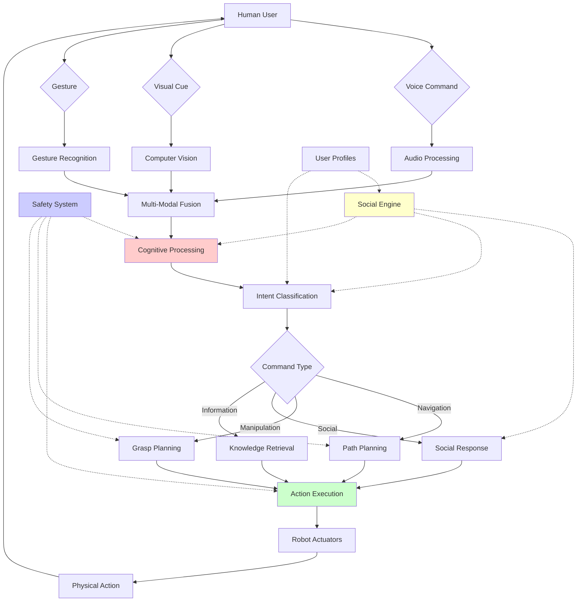

# Chapter 5: Capstone Project - Humanoid AI Companion


## Learning Objectives
By the end of this chapter, you will be able to:
- Integrate all modules into a complete humanoid AI system
- Implement a multimodal conversational AI companion
- Design social interaction patterns for humanoid robots
- Build a complete task execution pipeline from voice command to action
- Implement safety and ethical considerations in AI companions
- Evaluate the performance of the complete system
- Deploy and test the humanoid AI companion in real scenarios

## Core Theory

### Humanoid AI Companion Architecture
A complete humanoid AI companion system integrates:
- **Perception System**: Multimodal sensing (vision, audio, touch)
- **Cognition System**: Language understanding, reasoning, planning
- **Action System**: Motor control, manipulation, navigation
- **Social System**: Emotional intelligence, social norms, personality
- **Safety System**: Ethical guidelines, safety protocols, fail-safes

### System Integration Challenges
- **Real-time Performance**: Meeting timing constraints across all subsystems
- **Modularity**: Ensuring components can be updated independently
- **Scalability**: Supporting increasing complexity and capabilities
- **Robustness**: Handling failures gracefully and recovering
- **Safety**: Ensuring safe operation in human environments

### Social AI Principles
- **Theory of Mind**: Understanding others' mental states and intentions
- **Emotional Intelligence**: Recognizing and responding to emotions
- **Social Norms**: Following cultural and social conventions
- **Personalization**: Adapting to individual user preferences
- **Ethical AI**: Ensuring responsible and ethical behavior

### Conversational AI for Physical Agents
- **Contextual Understanding**: Maintaining conversation context across modalities
- **Grounded Language**: Connecting language to physical environment
- **Embodied Cognition**: Using physical experience to inform understanding
- **Pragmatic Reasoning**: Understanding implied meaning and intentions
- **Dialog Management**: Managing turn-taking and topic transitions

### Human-Robot Interaction Design
- **Natural Interaction**: Making interaction feel intuitive and human-like
- **Trust Building**: Establishing and maintaining user trust
- **Transparency**: Making robot decision-making understandable
- **Adaptability**: Adjusting to different users and contexts
- **Error Recovery**: Gracefully handling misunderstandings

## Practical Implementation

### Complete Humanoid AI Companion System
```python
import asyncio
import threading
import queue
import time
from typing import Dict, Any, List, Optional, Callable
from dataclasses import dataclass, field
import numpy as np
import json
import logging
from enum import Enum

# Import components from all modules
from src.vision.vision_system import VisionSystem
from src.audio.audio_system import AudioSystem
from src.nlp.nlp_engine import NLPEngine
from src.motion.motion_controller import MotionController
from src.vla.vla_planner import VLAPlanner
from src.llm.llm_cognitive_planner import LLMCognitivePlanner
from src.multi_modal.multi_modal_fusion import MultiModalFusion
from src.safety.safety_system import SafetySystem
from src.social.social_engine import SocialEngine

class InteractionState(Enum):
    IDLE = "idle"
    LISTENING = "listening"
    PROCESSING = "processing"
    PLANNING = "planning"
    EXECUTING = "executing"
    ENGAGED = "engaged"
    SAFETY_STOP = "safety_stop"

@dataclass
class InteractionContext:
    """Context for current interaction"""
    user_id: Optional[str] = None
    conversation_history: List[Dict[str, Any]] = field(default_factory=list)
    current_topic: str = ""
    user_preferences: Dict[str, Any] = field(default_factory=dict)
    interaction_state: InteractionState = InteractionState.IDLE
    last_interaction_time: float = 0.0
    attention_focus: str = "environment"
    engagement_level: float = 0.0

@dataclass
class SystemStatus:
    """Overall system status"""
    is_operational: bool = True
    active_components: List[str] = field(default_factory=list)
    cpu_usage: float = 0.0
    memory_usage: float = 0.0
    battery_level: float = 100.0
    safety_status: str = "nominal"
    last_error: Optional[str] = None

class HumanoidAICompanion:
    """Complete Humanoid AI Companion System"""

    def __init__(self, config: Dict[str, Any]):
        self.config = config
        self.logger = logging.getLogger(__name__)

        # Initialize all subsystems
        self.vision_system = VisionSystem(config.get('vision', {}))
        self.audio_system = AudioSystem(config.get('audio', {}))
        self.nlp_engine = NLPEngine(config.get('nlp', {}))
        self.motion_controller = MotionController(config.get('motion', {}))
        self.vla_planner = VLAPlanner(config.get('vla', {}))
        self.llm_planner = LLMCognitivePlanner(config.get('llm', {}))
        self.multi_modal_fusion = MultiModalFusion(config.get('fusion', {}))
        self.safety_system = SafetySystem(config.get('safety', {}))
        self.social_engine = SocialEngine(config.get('social', {}))

        # System state
        self.interaction_context = InteractionContext()
        self.system_status = SystemStatus()
        self.is_running = False

        # Communication queues
        self.audio_queue = queue.Queue()
        self.vision_queue = queue.Queue()
        self.command_queue = queue.Queue()
        self.response_queue = queue.Queue()

        # Event callbacks
        self.event_callbacks: Dict[str, List[Callable]] = {
            'user_detected': [],
            'command_received': [],
            'action_started': [],
            'action_completed': [],
            'safety_violation': []
        }

        # Initialize components
        self._initialize_components()

        self.logger.info("Humanoid AI Companion system initialized")

    def _initialize_components(self):
        """Initialize all system components"""
        try:
            # Start all subsystems
            self.vision_system.start()
            self.audio_system.start()
            self.motion_controller.start()

            # Register event listeners
            self.vision_system.register_callback('person_detected', self._on_person_detected)
            self.audio_system.register_callback('speech_detected', self._on_speech_detected)
            self.motion_controller.register_callback('action_completed', self._on_action_completed)

            # Set system operational
            self.system_status.is_operational = True
            self.system_status.active_components = [
                'vision', 'audio', 'nlp', 'motion', 'vla', 'llm', 'fusion', 'safety', 'social'
            ]

            self.logger.info("All components initialized successfully")

        except Exception as e:
            self.logger.error(f"Error initializing components: {e}")
            self.system_status.is_operational = False
            self.system_status.last_error = str(e)

    async def start(self):
        """Start the AI companion system"""
        if not self.system_status.is_operational:
            raise RuntimeError("Cannot start system - components not operational")

        self.is_running = True
        self.interaction_context.interaction_state = InteractionState.IDLE

        # Start main processing loops
        self._start_main_loop()
        self._start_perception_loop()
        self._start_command_processing_loop()

        self.logger.info("Humanoid AI Companion system started")

    def _start_main_loop(self):
        """Start the main system loop"""
        def main_loop():
            while self.is_running:
                try:
                    # Update system status
                    self._update_system_status()

                    # Process any queued commands
                    self._process_queued_commands()

                    # Update interaction context
                    self._update_interaction_context()

                    # Check safety conditions
                    if not self.safety_system.is_safe_to_operate():
                        self._handle_safety_violation()

                    time.sleep(0.1)  # 10Hz main loop

                except Exception as e:
                    self.logger.error(f"Error in main loop: {e}")
                    time.sleep(1.0)

        main_thread = threading.Thread(target=main_loop, daemon=True)
        main_thread.start()

    def _start_perception_loop(self):
        """Start the perception processing loop"""
        def perception_loop():
            while self.is_running:
                try:
                    # Get latest perception data
                    vision_data = self.vision_system.get_latest_data()
                    audio_data = self.audio_system.get_latest_data()

                    # Process multi-modal input
                    if vision_data or audio_data:
                        multimodal_input = {
                            'vision': vision_data,
                            'audio': audio_data,
                            'timestamp': time.time()
                        }

                        # Fuse modalities
                        fused_input = self.multi_modal_fusion.fuse_input(multimodal_input)

                        # Process the fused input
                        self._process_multimodal_input(fused_input)

                    time.sleep(0.05)  # 20Hz perception loop

                except Exception as e:
                    self.logger.error(f"Error in perception loop: {e}")
                    time.sleep(0.1)

        perception_thread = threading.Thread(target=perception_loop, daemon=True)
        perception_thread.start()

    def _process_multimodal_input(self, fused_input: Dict[str, Any]):
        """Process fused multi-modal input"""
        try:
            # Determine interaction type
            interaction_type = self._classify_interaction(fused_input)

            if interaction_type == 'social_attention':
                self._handle_social_attention(fused_input)
            elif interaction_type == 'command':
                self._handle_command_input(fused_input)
            elif interaction_type == 'greeting':
                self._handle_greeting(fused_input)
            else:
                # Update idle behavior
                self._update_idle_behavior(fused_input)

        except Exception as e:
            self.logger.error(f"Error processing multi-modal input: {e}")

    def _classify_interaction(self, fused_input: Dict[str, Any]) -> str:
        """Classify the type of interaction from fused input"""
        # Check for speech commands
        if 'speech' in fused_input and fused_input['speech'].get('confidence', 0) > 0.7:
            speech_text = fused_input['speech'].get('text', '').lower()

            # Check for command keywords
            command_keywords = ['please', 'can you', 'help', 'move', 'go', 'pick', 'put', 'stop', 'wait']
            if any(keyword in speech_text for keyword in command_keywords):
                return 'command'

            # Check for greeting keywords
            greeting_keywords = ['hello', 'hi', 'hey', 'good morning', 'good evening']
            if any(keyword in speech_text for keyword in greeting_keywords):
                return 'greeting'

        # Check for visual attention
        if 'visual' in fused_input:
            visual_data = fused_input['visual']
            if (visual_data.get('face_detected', False) and
                visual_data.get('gaze_direction') == 'center' and
                visual_data.get('attention_score', 0) > 0.6):

                # Check for gesture indicators
                if 'gesture' in fused_input:
                    gesture_type = fused_input['gesture'].get('type', '')
                    if gesture_type in ['wave', 'open_palm', 'point_up']:
                        return 'greeting'

                return 'social_attention'

        return 'idle'

    def _handle_social_attention(self, fused_input: Dict[str, Any]):
        """Handle social attention from user"""
        if self.interaction_context.interaction_state != InteractionState.IDLE:
            return  # Already engaged

        # Acknowledge attention
        self._acknowledge_attention(fused_input)

        # Update interaction context
        self.interaction_context.interaction_state = InteractionState.LISTENING
        self.interaction_context.attention_focus = 'user'
        self.interaction_context.engagement_level = 0.5

        # Set listening timeout
        self._set_listening_timeout(10.0)  # Listen for 10 seconds

    def _handle_greeting(self, fused_input: Dict[str, Any]):
        """Handle greeting interaction"""
        # Generate appropriate greeting response
        greeting_response = self.social_engine.generate_greeting_response(fused_input)

        # Execute greeting behavior
        self._execute_social_response(greeting_response)

        # Update context
        self.interaction_context.interaction_state = InteractionState.ENGAGED
        self.interaction_context.engagement_level = 0.7

    def _handle_command_input(self, fused_input: Dict[str, Any]):
        """Handle command input from user"""
        if self.interaction_context.interaction_state not in [InteractionState.IDLE, InteractionState.LISTENING]:
            return  # Only accept commands when idle or listening

        command_text = fused_input['speech']['text']
        self.logger.info(f"Received command: {command_text}")

        # Update interaction state
        self.interaction_context.interaction_state = InteractionState.PROCESSING

        # Process command asynchronously
        asyncio.create_task(self._process_command_async(command_text, fused_input))

    async def _process_command_async(self, command_text: str, fused_input: Dict[str, Any]):
        """Process command asynchronously"""
        try:
            # Natural language understanding
            intent = await self.nlp_engine.understand_command(command_text)

            if not intent:
                self._respond_with_error("I didn't understand that command.")
                return

            # Validate command safety
            if not self.safety_system.validate_command(intent):
                self._respond_with_error("Sorry, I cannot perform that action for safety reasons.")
                return

            # Plan action using VLA and LLM
            action_plan = await self._plan_action(intent, fused_input)

            if not action_plan:
                self._respond_with_error("I'm not sure how to perform that action.")
                return

            # Execute action plan
            success = await self._execute_action_plan(action_plan)

            if success:
                self._respond_with_success("I've completed that action for you.")
            else:
                self._respond_with_error("I encountered an issue while performing that action.")

        except Exception as e:
            self.logger.error(f"Error processing command: {e}")
            self._respond_with_error("I encountered an error while processing your request.")

        finally:
            # Return to idle state
            self.interaction_context.interaction_state = InteractionState.IDLE
            self.interaction_context.engagement_level = 0.3

    async def _plan_action(self, intent: Dict[str, Any], fused_input: Dict[str, Any]) -> Optional[Dict[str, Any]]:
        """Plan action using VLA and LLM systems"""
        try:
            # Use LLM for high-level cognitive planning
            cognitive_plan = await self.llm_planner.plan_task(
                intent['command'],
                self.motion_controller.get_capabilities(),
                fused_input.get('environment_context', {})
            )

            if not cognitive_plan:
                return None

            # Use VLA for detailed action planning
            vla_plan = self.vla_planner.plan_vla_action(
                cognitive_plan,
                fused_input.get('visual_context', {}),
                fused_input.get('spatial_context', {})
            )

            return {
                'cognitive_plan': cognitive_plan,
                'vla_plan': vla_plan,
                'intent': intent
            }

        except Exception as e:
            self.logger.error(f"Error in action planning: {e}")
            return None

    async def _execute_action_plan(self, action_plan: Dict[str, Any]) -> bool:
        """Execute the planned action sequence"""
        try:
            # Update interaction state
            self.interaction_context.interaction_state = InteractionState.EXECUTING

            # Execute each step in the plan
            for step in action_plan['vla_plan']['steps']:
                # Check safety before each step
                if not self.safety_system.is_safe_to_execute(step):
                    self.logger.warning(f"Safety violation in step: {step}")
                    return False

                # Execute the step
                success = await self.motion_controller.execute_action(step)

                if not success:
                    self.logger.warning(f"Failed to execute step: {step}")
                    return False

                # Check for interruptions
                if self.interaction_context.interaction_state != InteractionState.EXECUTING:
                    return False

            return True

        except Exception as e:
            self.logger.error(f"Error executing action plan: {e}")
            return False

    def _execute_social_response(self, response: Dict[str, Any]):
        """Execute social response (speech, gesture, motion)"""
        try:
            # Execute verbal response
            if 'speech' in response:
                self.audio_system.speak(response['speech'])

            # Execute gesture response
            if 'gesture' in response:
                gesture_action = {
                    'action_type': 'gesture',
                    'gesture_type': response['gesture'],
                    'duration': response.get('duration', 2.0)
                }
                asyncio.create_task(self.motion_controller.execute_action(gesture_action))

            # Execute motion response
            if 'motion' in response:
                motion_action = {
                    'action_type': 'motion',
                    'motion_type': response['motion'],
                    'parameters': response.get('motion_params', {})
                }
                asyncio.create_task(self.motion_controller.execute_action(motion_action))

        except Exception as e:
            self.logger.error(f"Error executing social response: {e}")

    def _respond_with_success(self, message: str):
        """Respond with success message"""
        response = {
            'type': 'success',
            'message': message,
            'gesture': 'thumbs_up',
            'motion': 'nod'
        }
        self._execute_social_response(response)

    def _respond_with_error(self, message: str):
        """Respond with error message"""
        response = {
            'type': 'error',
            'message': message,
            'gesture': 'confused',
            'motion': 'shake_head'
        }
        self._execute_social_response(response)

    def _on_person_detected(self, person_data: Dict[str, Any]):
        """Callback when person is detected"""
        self.logger.info(f"Person detected: {person_data.get('person_id', 'unknown')}")

        # Update user tracking
        user_id = person_data.get('person_id', 'unknown')
        if self.interaction_context.user_id != user_id:
            self.interaction_context.user_id = user_id

            # Load user preferences if available
            user_prefs = self.social_engine.get_user_preferences(user_id)
            if user_prefs:
                self.interaction_context.user_preferences.update(user_prefs)

        # Trigger social attention behavior
        if self.interaction_context.interaction_state == InteractionState.IDLE:
            self._trigger_social_attention(person_data)

    def _on_speech_detected(self, speech_data: Dict[str, Any]):
        """Callback when speech is detected"""
        if speech_data.get('confidence', 0) > 0.6:  # Only process confident detections
            # Add to command queue for processing
            self.command_queue.put({
                'type': 'speech',
                'data': speech_data,
                'timestamp': time.time()
            })

    def _on_action_completed(self, action_result: Dict[str, Any]):
        """Callback when action is completed"""
        self.logger.info(f"Action completed: {action_result}")

        # Update interaction state if in execution
        if self.interaction_context.interaction_state == InteractionState.EXECUTING:
            self.interaction_context.interaction_state = InteractionState.ENGAGED

        # Trigger any registered callbacks
        self._trigger_event_callbacks('action_completed', action_result)

    def _trigger_social_attention(self, person_data: Dict[str, Any]):
        """Trigger social attention behavior"""
        # Decide whether to initiate interaction based on social rules
        should_interact = self.social_engine.should_initiate_interaction(
            person_data,
            self.interaction_context
        )

        if should_interact:
            greeting = self.social_engine.generate_proactive_greeting(person_data)
            self._execute_social_response(greeting)

    def _handle_safety_violation(self):
        """Handle safety system violations"""
        self.logger.warning("Safety violation detected!")

        # Immediately stop all motion
        self.motion_controller.emergency_stop()

        # Update state
        self.interaction_context.interaction_state = InteractionState.SAFETY_STOP

        # Trigger safety callbacks
        self._trigger_event_callbacks('safety_violation', {
            'violation_type': 'safety_rule_breached',
            'timestamp': time.time()
        })

        # Wait for safety clearance
        while not self.safety_system.is_safe_to_resume():
            time.sleep(0.1)

        # Resume normal operation
        self.interaction_context.interaction_state = InteractionState.IDLE

    def _update_system_status(self):
        """Update overall system status"""
        # Update CPU and memory usage
        import psutil
        self.system_status.cpu_usage = psutil.cpu_percent()
        self.system_status.memory_usage = psutil.virtual_memory().percent

        # Update battery level (would interface with actual battery system)
        # self.system_status.battery_level = self.power_system.get_battery_level()

        # Update safety status
        self.system_status.safety_status = self.safety_system.get_overall_status()

    def _update_interaction_context(self):
        """Update interaction context based on current state"""
        current_time = time.time()

        # Update engagement decay
        if (self.interaction_context.interaction_state == InteractionState.IDLE and
            current_time - self.interaction_context.last_interaction_time > 30.0):  # 30 seconds
            self.interaction_context.engagement_level = max(0.0, self.interaction_context.engagement_level - 0.1)

    def _process_queued_commands(self):
        """Process any queued commands"""
        while not self.command_queue.empty():
            try:
                command = self.command_queue.get_nowait()
                self._handle_queued_command(command)
            except queue.Empty:
                break

    def _handle_queued_command(self, command: Dict[str, Any]):
        """Handle a queued command"""
        if command['type'] == 'speech':
            # Process speech command
            asyncio.create_task(self._process_command_async(
                command['data']['text'],
                {'speech': command['data']}
            ))

    def _update_idle_behavior(self, fused_input: Dict[str, Any]):
        """Update idle behavior based on environment"""
        if (self.interaction_context.interaction_state == InteractionState.IDLE and
            self.interaction_context.engagement_level < 0.2):

            # Perform idle behaviors like scanning environment
            idle_behavior = self.social_engine.get_idle_behavior(fused_input)
            if idle_behavior:
                self._execute_social_response(idle_behavior)

    def register_callback(self, event_type: str, callback: Callable):
        """Register a callback for specific events"""
        if event_type not in self.event_callbacks:
            self.event_callbacks[event_type] = []
        self.event_callbacks[event_type].append(callback)

    def _trigger_event_callbacks(self, event_type: str, data: Any):
        """Trigger all callbacks for an event type"""
        for callback in self.event_callbacks.get(event_type, []):
            try:
                callback(data)
            except Exception as e:
                self.logger.error(f"Error in {event_type} callback: {e}")

    def stop(self):
        """Stop the AI companion system"""
        self.is_running = False

        # Stop all subsystems
        self.vision_system.stop()
        self.audio_system.stop()
        self.motion_controller.stop()

        self.logger.info("Humanoid AI Companion system stopped")

    def add_user_preference(self, user_id: str, preference_key: str, preference_value: Any):
        """Add a preference for a specific user"""
        self.social_engine.add_user_preference(user_id, preference_key, preference_value)

    def get_system_metrics(self) -> Dict[str, Any]:
        """Get system performance metrics"""
        return {
            'status': self.system_status,
            'interaction_stats': {
                'total_interactions': len(self.interaction_context.conversation_history),
                'current_engagement': self.interaction_context.engagement_level,
                'active_user': self.interaction_context.user_id
            },
            'component_health': {
                'vision_healthy': self.vision_system.is_healthy(),
                'audio_healthy': self.audio_system.is_healthy(),
                'motion_healthy': self.motion_controller.is_healthy()
            }
        }

# Configuration example
COMPANION_CONFIG = {
    'vision': {
        'enable_face_detection': True,
        'enable_gesture_recognition': True,
        'enable_object_detection': True,
        'tracking_timeout': 30.0
    },
    'audio': {
        'wake_word': 'robot',
        'sensitivity': 0.5,
        'noise_suppression': True,
        'beamforming': True
    },
    'nlp': {
        'model_path': 'models/nlp_model.pt',
        'confidence_threshold': 0.7,
        'intent_classes': ['greeting', 'command', 'question', 'social']
    },
    'motion': {
        'max_velocity': 0.5,
        'acceleration_limit': 0.2,
        'safety_margin': 0.3
    },
    'vla': {
        'planning_horizon': 10.0,
        'collision_avoidance': True,
        'dynamic_obstacles': True
    },
    'llm': {
        'model_name': 'gpt-3.5-turbo',
        'api_key': 'your-api-key',
        'max_tokens': 500
    },
    'fusion': {
        'confidence_threshold': 0.6,
        'temporal_window': 2.0
    },
    'safety': {
        'collision_threshold': 0.5,
        'speed_limits': {'linear': 0.3, 'angular': 0.5},
        'emergency_stop_distance': 0.2
    },
    'social': {
        'personality_type': 'friendly',
        'interaction_style': 'formal',
        'privacy_settings': {
            'face_recognition': True,
            'conversation_logging': False,
            'data_retention_days': 30
        }
    }
}

# Example usage
async def main():
    """Main function to run the humanoid AI companion"""
    # Initialize the companion
    companion = HumanoidAICompanion(COMPANION_CONFIG)

    try:
        # Start the system
        await companion.start()

        # Register event callbacks
        def on_user_detected(user_data):
            print(f"User detected: {user_data}")

        def on_command_received(command):
            print(f"Command received: {command}")

        companion.register_callback('user_detected', on_user_detected)
        companion.register_callback('command_received', on_command_received)

        # Keep running
        while True:
            # Print system metrics periodically
            metrics = companion.get_system_metrics()
            print(f"System status: {metrics['status'].safety_status}, "
                  f"Engagement: {metrics['interaction_stats']['current_engagement']:.2f}")

            await asyncio.sleep(5.0)

    except KeyboardInterrupt:
        print("Shutting down Humanoid AI Companion...")
    finally:
        companion.stop()

if __name__ == "__main__":
    asyncio.run(main())
```

### Safety and Ethics Implementation
```python
import asyncio
import json
from typing import Dict, Any, List, Optional
from dataclasses import dataclass
import logging

@dataclass
class SafetyViolation:
    """Represents a safety violation"""
    violation_type: str
    severity: str  # 'low', 'medium', 'high', 'critical'
    description: str
    timestamp: float
    action_taken: str
    resolution: Optional[str] = None

class SafetySystem:
    """Comprehensive safety system for humanoid AI companion"""

    def __init__(self, config: Dict[str, Any]):
        self.config = config
        self.logger = logging.getLogger(__name__)

        # Safety parameters
        self.collision_threshold = config.get('collision_threshold', 0.5)
        self.speed_limits = config.get('speed_limits', {
            'linear': 0.3,
            'angular': 0.5
        })
        self.emergency_stop_distance = config.get('emergency_stop_distance', 0.2)
        self.max_force_limits = config.get('max_force_limits', {
            'gripper': 50.0,  # Newtons
            'manipulator': 100.0
        })

        # Safety rules
        self.safety_rules = self._load_safety_rules()
        self.ethical_guidelines = self._load_ethical_guidelines()

        # State tracking
        self.violations: List[SafetyViolation] = []
        self.emergency_active = False
        self.safety_override = False

        # Privacy settings
        self.privacy_controls = config.get('privacy_settings', {
            'face_recognition': True,
            'conversation_logging': False,
            'data_retention_days': 30
        })

        self.logger.info("Safety system initialized")

    def _load_safety_rules(self) -> List[Dict[str, Any]]:
        """Load safety rules from configuration"""
        return [
            {
                'name': 'collision_avoidance',
                'condition': 'distance_to_obstacle < threshold',
                'action': 'stop_motion',
                'severity': 'high'
            },
            {
                'name': 'speed_limit',
                'condition': 'velocity > max_allowed',
                'action': 'reduce_speed',
                'severity': 'medium'
            },
            {
                'name': 'force_limit',
                'condition': 'applied_force > max_allowed',
                'action': 'stop_actuator',
                'severity': 'high'
            },
            {
                'name': 'human_proximity',
                'condition': 'human_distance < safe_distance',
                'action': 'slow_down_approach',
                'severity': 'medium'
            }
        ]

    def _load_ethical_guidelines(self) -> List[Dict[str, str]]:
        """Load ethical guidelines for AI behavior"""
        return [
            {
                'principle': 'Do No Harm',
                'guideline': 'Avoid any action that could cause physical harm to humans or property'
            },
            {
                'principle': 'Respect Autonomy',
                'guideline': 'Respect human decision-making and personal space'
            },
            {
                'principle': 'Privacy Protection',
                'guideline': 'Protect personal information and respect privacy settings'
            },
            {
                'principle': 'Transparency',
                'guideline': 'Be clear about capabilities and limitations'
            },
            {
                'principle': 'Fairness',
                'guideline': 'Treat all users equitably regardless of personal characteristics'
            }
        ]

    def validate_command(self, command: Dict[str, Any]) -> bool:
        """Validate a command for safety compliance"""
        try:
            # Check if emergency stop is active
            if self.emergency_active:
                return False

            # Check command type safety
            command_type = command.get('type', 'unknown')

            # Dangerous commands
            dangerous_commands = [
                'self_destruct', 'damage', 'harm', 'attack', 'fight',
                'unsafe_speed', 'excessive_force', 'ignore_safety'
            ]

            if any(dangerous in command.get('text', '').lower() for dangerous in dangerous_commands):
                self._log_violation('ethics_violation', 'critical',
                                  f'Dangerous command detected: {command.get("text", "")}',
                                  'command_rejected')
                return False

            # Check action-specific safety
            if command_type == 'navigation':
                return self._validate_navigation_command(command)
            elif command_type == 'manipulation':
                return self._validate_manipulation_command(command)
            elif command_type == 'interaction':
                return self._validate_interaction_command(command)

            return True

        except Exception as e:
            self.logger.error(f"Error validating command: {e}")
            return False

    def _validate_navigation_command(self, command: Dict[str, Any]) -> bool:
        """Validate navigation commands for safety"""
        target_position = command.get('target_position', {})
        x, y = target_position.get('x', 0), target_position.get('y', 0)

        # Check if destination is in safe area
        if not self._is_safe_navigation_destination(x, y):
            self._log_violation('navigation_violation', 'high',
                              f'Unsafe navigation destination: ({x}, {y})',
                              'navigation_denied')
            return False

        # Check path safety
        path = command.get('planned_path', [])
        if not self._is_safe_path(path):
            self._log_violation('path_violation', 'high',
                              'Planned path contains unsafe areas',
                              'path_replanning_required')
            return False

        return True

    def _validate_manipulation_command(self, command: Dict[str, Any]) -> bool:
        """Validate manipulation commands for safety"""
        object_info = command.get('target_object', {})
        action_type = command.get('action_type', '')

        # Check object safety
        if object_info.get('is_fragile', False) and action_type in ['grasp_hard', 'lift_fast']:
            self._log_violation('fragility_violation', 'medium',
                              f'Unsafe manipulation of fragile object: {object_info.get("name", "unknown")}',
                              'action_modified')
            # Modify action to be safer
            command['action_type'] = 'grasp_gentle'
            return True  # Allow with modification

        # Check force limits
        required_force = command.get('required_force', 0)
        max_allowed_force = self.max_force_limits.get('gripper', 50.0)

        if required_force > max_allowed_force:
            self._log_violation('force_violation', 'high',
                              f'Force limit exceeded: {required_force} > {max_allowed_force}',
                              'action_denied')
            return False

        return True

    def _validate_interaction_command(self, command: Dict[str, Any]) -> bool:
        """Validate interaction commands for safety and ethics"""
        interaction_type = command.get('interaction_type', '')
        target_user = command.get('target_user', {})

        # Check privacy settings
        if interaction_type == 'face_recognition' and not self.privacy_controls.get('face_recognition', True):
            self._log_violation('privacy_violation', 'medium',
                              'Face recognition disabled by privacy settings',
                              'action_denied')
            return False

        # Check personal space
        if interaction_type == 'physical_interaction' and target_user.get('respects_personal_space', True):
            self._log_violation('personal_space_violation', 'medium',
                              'Physical interaction with user who prefers personal space',
                              'action_denied')
            return False

        # Check ethical guidelines
        if not self._passes_ethical_check(command):
            self._log_violation('ethics_violation', 'high',
                              'Command violates ethical guidelines',
                              'command_rejected')
            return False

        return True

    def _passes_ethical_check(self, command: Dict[str, Any]) -> bool:
        """Check if command passes ethical guidelines"""
        command_text = command.get('text', '').lower()

        # Check for discriminatory language
        discriminatory_terms = [
            'hate', 'discriminate', 'prejudice', 'bias', 'inferior', 'superior'
        ]

        if any(term in command_text for term in discriminatory_terms):
            return False

        # Check for privacy violations
        privacy_violating_terms = [
            'secret', 'spy', 'monitor', 'track_without_consent', 'record_private'
        ]

        if any(term in command_text for term in privacy_violating_terms):
            return False

        return True

    def is_safe_to_operate(self) -> bool:
        """Check if it's safe for the robot to operate"""
        return not self.emergency_active and not self.safety_override

    def is_safe_to_execute(self, action: Dict[str, Any]) -> bool:
        """Check if a specific action is safe to execute"""
        try:
            # Check current safety state
            if not self.is_safe_to_operate():
                return False

            # Validate the action
            return self.validate_command(action)

        except Exception as e:
            self.logger.error(f"Error checking action safety: {e}")
            return False

    def is_safe_to_resume(self) -> bool:
        """Check if it's safe to resume operation after emergency stop"""
        # Check if emergency conditions have cleared
        return not self._has_active_emergency_conditions()

    def trigger_emergency_stop(self):
        """Trigger emergency stop"""
        self.emergency_active = True
        self._log_violation('emergency_stop', 'critical',
                          'Emergency stop triggered',
                          'full_system_stop')

    def clear_emergency_stop(self):
        """Clear emergency stop condition"""
        self.emergency_active = False
        self.logger.info("Emergency stop cleared")

    def _has_active_emergency_conditions(self) -> bool:
        """Check if there are active emergency conditions"""
        # This would check for ongoing safety issues
        # For now, we'll just return False (meaning it's safe to resume)
        return False

    def _is_safe_navigation_destination(self, x: float, y: float) -> bool:
        """Check if navigation destination is safe"""
        # This would interface with map data to check for safe zones
        # For now, implement basic checks
        return abs(x) < 10.0 and abs(y) < 10.0  # Within reasonable bounds

    def _is_safe_path(self, path: List[Dict[str, float]]) -> bool:
        """Check if planned path is safe"""
        if not path:
            return True

        # Check for obstacles along path (simplified)
        for waypoint in path:
            # In real implementation, this would check occupancy grid
            x, y = waypoint.get('x', 0), waypoint.get('y', 0)
            # For now, just ensure path is reasonable
            if abs(x) > 20.0 or abs(y) > 20.0:
                return False

        return True

    def _log_violation(self, violation_type: str, severity: str,
                      description: str, action_taken: str) -> SafetyViolation:
        """Log a safety violation"""
        violation = SafetyViolation(
            violation_type=violation_type,
            severity=severity,
            description=description,
            timestamp=asyncio.get_event_loop().time(),
            action_taken=action_taken
        )

        self.violations.append(violation)
        self.logger.warning(f"Safety violation: {violation_type} - {description}")

        # Keep only recent violations (last 100)
        if len(self.violations) > 100:
            self.violations = self.violations[-100:]

        return violation

    def get_violation_report(self) -> Dict[str, Any]:
        """Get safety violation report"""
        critical_violations = [v for v in self.violations if v.severity == 'critical']
        high_violations = [v for v in self.violations if v.severity == 'high']

        return {
            'total_violations': len(self.violations),
            'critical_violations': len(critical_violations),
            'high_violations': len(high_violations),
            'recent_violations': self.violations[-10:],  # Last 10 violations
            'emergency_active': self.emergency_active,
            'safety_override': self.safety_override
        }

    def enable_safety_override(self):
        """Enable safety override (use with caution!)"""
        self.safety_override = True
        self.logger.warning("SAFETY OVERRIDE ENABLED - ROBOT OPERATING IN UNSAFE MODE")

    def disable_safety_override(self):
        """Disable safety override"""
        self.safety_override = False
        self.logger.info("Safety override disabled - normal safety checks restored")
```

### Social Interaction Engine
```python
import asyncio
import random
from typing import Dict, Any, List, Optional
from dataclasses import dataclass
import logging

@dataclass
class UserProfile:
    """Represents a user profile for personalization"""
    user_id: str
    name: str = ""
    preferences: Dict[str, Any] = None
    interaction_history: List[Dict[str, Any]] = None
    privacy_settings: Dict[str, bool] = None

    def __post_init__(self):
        if self.preferences is None:
            self.preferences = {}
        if self.interaction_history is None:
            self.interaction_history = []
        if self.privacy_settings is None:
            self.privacy_settings = {
                'face_recognition': True,
                'conversation_logging': False,
                'data_retention': True
            }

class SocialEngine:
    """Handles social interaction and personalization"""

    def __init__(self, config: Dict[str, Any]):
        self.config = config
        self.logger = logging.getLogger(__name__)

        # Personality configuration
        self.personality_type = config.get('personality_type', 'friendly')
        self.interaction_style = config.get('interaction_style', 'formal')
        self.emotional_responses = config.get('emotional_responses', True)

        # User management
        self.user_profiles: Dict[str, UserProfile] = {}
        self.known_users: List[str] = []
        self.current_interactions: Dict[str, float] = {}  # user_id -> last_interaction_time

        # Social behaviors
        self.greeting_variants = self._load_greeting_variants()
        self.conversation_topics = self._load_conversation_topics()
        self.appropriate_responses = self._load_appropriate_responses()

        self.logger.info("Social engine initialized")

    def _load_greeting_variants(self) -> Dict[str, List[str]]:
        """Load different greeting variants based on personality"""
        return {
            'friendly': [
                "Hello! It's great to see you!",
                "Hi there! How can I help you today?",
                "Hey! I'm happy to assist you.",
                "Greetings! What can I do for you?"
            ],
            'professional': [
                "Good day. How may I assist you?",
                "Hello. Please state your request.",
                "Greetings. I'm ready to help with your needs.",
                "Welcome. How can I be of service?"
            ],
            'enthusiastic': [
                "WOW! Great to see you! What exciting things shall we do today?",
                "HELLO! I'm absolutely thrilled to help you!",
                "AMAZING! Another opportunity to be helpful! What can I do?",
                "Incredible! You're here! Let's make something wonderful happen!"
            ]
        }

    def _load_conversation_topics(self) -> List[str]:
        """Load appropriate conversation topics"""
        return [
            "robot capabilities",
            "weather",
            "time and date",
            "news (general)",
            "hobbies",
            "technology",
            "science",
            "robotics",
            "artificial intelligence"
        ]

    def _load_appropriate_responses(self) -> Dict[str, List[str]]:
        """Load appropriate responses for different situations"""
        return {
            'greeting': [
                "Hello! How can I assist you today?",
                "Hi there! What can I help with?",
                "Good to see you! How may I be of service?"
            ],
            'thanks': [
                "You're welcome! Happy to help!",
                "My pleasure! Is there anything else?",
                "Glad I could assist you!"
            ],
            'sorry': [
                "I apologize for any inconvenience.",
                "I'm sorry if I caused confusion.",
                "My apologies. How can I make this right?"
            ],
            'confused': [
                "I'm not sure I understand. Could you please rephrase?",
                "Could you clarify that for me?",
                "I didn't catch that. Can you say it again?"
            ]
        }

    def generate_greeting_response(self, fused_input: Dict[str, Any]) -> Dict[str, Any]:
        """Generate appropriate greeting response"""
        user_id = fused_input.get('visual', {}).get('person_id', 'unknown')

        # Check if user is known
        is_known_user = user_id in self.user_profiles

        if is_known_user:
            # Personalized greeting for known user
            user_profile = self.user_profiles[user_id]
            greeting = self._get_personalized_greeting(user_profile)
        else:
            # Generic greeting for unknown user
            greeting = self._get_generic_greeting()

        return {
            'speech': greeting,
            'gesture': 'wave',
            'motion': 'head_turn_towards_user',
            'emotion': 'happy'
        }

    def _get_personalized_greeting(self, user_profile: UserProfile) -> str:
        """Get personalized greeting for known user"""
        if user_profile.name:
            greetings = [
                f"Hello {user_profile.name}! It's wonderful to see you again!",
                f"Hi {user_profile.name}! Welcome back! How have you been?",
                f"Greetings {user_profile.name}! I remember our last conversation about {self._get_last_topic(user_profile)}."
            ]
        else:
            greetings = [
                "Hello again! It's great to see a familiar face!",
                "Hi! We've met before, right? I'm happy to assist you again!",
                "Welcome back! Our last interaction was productive, wasn't it?"
            ]

        return random.choice(greetings)

    def _get_generic_greeting(self) -> str:
        """Get generic greeting for unknown user"""
        greeting_options = self.greeting_variants.get(self.personality_type,
                                                   self.greeting_variants['friendly'])
        return random.choice(greeting_options)

    def _get_last_topic(self, user_profile: UserProfile) -> str:
        """Get the last conversation topic with user"""
        if user_profile.interaction_history:
            last_interaction = user_profile.interaction_history[-1]
            return last_interaction.get('topic', 'previous subject')
        return 'previous conversations'

    def should_initiate_interaction(self, person_data: Dict[str, Any],
                                  context: Dict[str, Any]) -> bool:
        """Decide whether to initiate interaction with detected person"""
        user_id = person_data.get('person_id', 'unknown')

        # Don't initiate if robot is busy
        if context.get('interaction_state') != 'idle':
            return False

        # Don't initiate if user has requested space
        if user_id in self.user_profiles:
            user_profile = self.user_profiles[user_id]
            if not user_profile.preferences.get('initiate_conversations', True):
                return False

        # Consider proximity and attention
        proximity = person_data.get('distance', float('inf'))
        has_attention = person_data.get('gaze_direction') == 'center' or person_data.get('gesture') == 'wave'

        # Initiate if close and showing attention, or if known user
        should_initiate = (proximity < 2.0 and has_attention) or user_id in self.known_users

        # Add some randomness to avoid repetitive behavior
        if should_initiate:
            # Probability decreases if recently interacted
            time_since_interaction = context.get('time_since_last_interaction', float('inf'))
            if time_since_interaction < 60:  # Less than 1 minute
                should_initiate = random.random() > 0.7  # 30% chance to initiate again quickly

        return should_initiate

    def generate_proactive_greeting(self, person_data: Dict[str, Any]) -> Dict[str, Any]:
        """Generate proactive greeting for detected person"""
        user_id = person_data.get('person_id', 'unknown')

        greeting_type = 'proactive'
        if user_id in self.user_profiles:
            # Known user - more personalized
            greeting_type = 'familiar'
            greeting = self._get_personalized_greeting(self.user_profiles[user_id])
        else:
            # Unknown user - polite but not overly familiar
            greeting = "Hello! I'm your AI companion. How can I help you today?"

        return {
            'speech': greeting,
            'gesture': 'open_palm_gesture',
            'motion': 'slight_bow',
            'emotion': 'friendly_curious'
        }

    def process_conversation_turn(self, user_input: str, user_id: str = "unknown") -> Dict[str, Any]:
        """Process a turn in conversation"""
        # Update user profile if needed
        if user_id != "unknown" and user_id not in self.user_profiles:
            self.user_profiles[user_id] = UserProfile(user_id=user_id)

        # Determine response type based on input
        response_type = self._classify_input_type(user_input)

        if response_type == 'greeting':
            response = self._generate_greeting_response(user_input, user_id)
        elif response_type == 'question':
            response = self._generate_question_response(user_input, user_id)
        elif response_type == 'command':
            response = self._generate_command_acknowledgment(user_input, user_id)
        elif response_type == 'thanks':
            response = self._generate_thanks_response(user_input, user_id)
        else:
            response = self._generate_general_response(user_input, user_id)

        # Update interaction history
        if user_id != "unknown":
            self._update_interaction_history(user_id, user_input, response)

        return response

    def _classify_input_type(self, user_input: str) -> str:
        """Classify the type of user input"""
        user_input_lower = user_input.lower()

        # Check for greetings
        greeting_patterns = ['hello', 'hi', 'hey', 'good morning', 'good afternoon', 'good evening']
        if any(pattern in user_input_lower for pattern in greeting_patterns):
            return 'greeting'

        # Check for thanks
        thanks_patterns = ['thank', 'thanks', 'appreciate']
        if any(pattern in user_input_lower for pattern in thanks_patterns):
            return 'thanks'

        # Check for questions
        question_indicators = ['?', 'what', 'how', 'when', 'where', 'who', 'why', 'can you', 'could you', 'would you']
        if any(indicator in user_input_lower for indicator in question_indicators) or '?' in user_input:
            return 'question'

        # Check for commands
        command_indicators = ['please', 'can you', 'could you', 'move', 'go', 'stop', 'help', 'do', 'perform']
        if any(indicator in user_input_lower for indicator in command_indicators):
            return 'command'

        return 'general'

    def _generate_greeting_response(self, user_input: str, user_id: str) -> Dict[str, Any]:
        """Generate response to greeting"""
        if user_id in self.user_profiles:
            user_profile = self.user_profiles[user_id]
            responses = [
                f"Hello {user_profile.name if user_profile.name else 'there'}! How can I assist you today?",
                f"Hi again! What can I help you with?",
                f"Good to see you! Is there something I can do for you?"
            ]
        else:
            responses = [
                "Hello! How can I help you today?",
                "Hi there! What can I assist with?",
                "Greetings! How may I be of service?"
            ]

        return {
            'speech': random.choice(responses),
            'gesture': 'nod',
            'motion': 'lean_slightly_forward',
            'emotion': 'pleasant'
        }

    def _generate_question_response(self, user_input: str, user_id: str) -> Dict[str, Any]:
        """Generate response to question"""
        # In a real implementation, this would interface with a knowledge base or LLM
        # For now, provide generic responses
        responses = [
            "That's an interesting question. Let me think...",
            "I'd be happy to help with that inquiry.",
            "I can certainly provide information about that topic.",
            "That's a thoughtful question. From my knowledge...",
            "I understand you're asking about this topic. Based on my training..."
        ]

        return {
            'speech': random.choice(responses),
            'gesture': 'thoughtful_gesture',
            'motion': 'head_tilt_slightly',
            'emotion': 'considering'
        }

    def _generate_command_acknowledgment(self, user_input: str, user_id: str) -> Dict[str, Any]:
        """Generate acknowledgment for command"""
        responses = [
            "I understand your request. Processing now...",
            "Got it! I'll work on that for you.",
            "Acknowledged. Executing your command.",
            "Understood. I'll take care of that.",
            "Processing your request now."
        ]

        return {
            'speech': random.choice(responses),
            'gesture': 'confirming_gesture',
            'motion': 'nod_confirming',
            'emotion': 'attentive'
        }

    def _generate_thanks_response(self, user_input: str, user_id: str) -> Dict[str, Any]:
        """Generate response to thanks"""
        responses = [
            "You're very welcome!",
            "Happy to help!",
            "My pleasure!",
            "Anytime!",
            "Glad I could assist!"
        ]

        return {
            'speech': random.choice(responses),
            'gesture': 'pleased_gesture',
            'motion': 'smile_animation',
            'emotion': 'happy'
        }

    def _generate_general_response(self, user_input: str, user_id: str) -> Dict[str, Any]:
        """Generate general response"""
        responses = [
            "I understand you're saying: " + user_input + ". How else may I assist?",
            "Thanks for sharing that. Is there something specific I can help with?",
            "I hear you. What would you like to do next?",
            "Interesting! How can I be of service?",
            "I'm processing that information. What else would you like to discuss?"
        ]

        return {
            'speech': random.choice(responses),
            'gesture': 'attentive_gesture',
            'motion': 'maintain_eye_contact',
            'emotion': 'engaged'
        }

    def _update_interaction_history(self, user_id: str, user_input: str, response: Dict[str, Any]):
        """Update user's interaction history"""
        if user_id not in self.user_profiles:
            self.user_profiles[user_id] = UserProfile(user_id=user_id)

        user_profile = self.user_profiles[user_id]

        interaction_entry = {
            'timestamp': asyncio.get_event_loop().time(),
            'user_input': user_input,
            'robot_response': response.get('speech', ''),
            'topic': self._infer_topic(user_input),
            'engagement_level': self._calculate_engagement(user_input, response)
        }

        user_profile.interaction_history.append(interaction_entry)

        # Keep only recent history (last 50 interactions)
        if len(user_profile.interaction_history) > 50:
            user_profile.interaction_history = user_profile.interaction_history[-50:]

    def _infer_topic(self, user_input: str) -> str:
        """Infer conversation topic from user input"""
        user_lower = user_input.lower()

        # Simple topic inference based on keywords
        topic_keywords = {
            'time': ['time', 'hour', 'minute', 'second', 'clock', 'watch'],
            'weather': ['weather', 'temperature', 'rain', 'sun', 'cloud', 'hot', 'cold'],
            'robot': ['robot', 'you', 'yourself', 'function', 'ability', 'capability'],
            'help': ['help', 'assist', 'support', 'need', 'want', 'require'],
            'navigation': ['go', 'move', 'walk', 'drive', 'navigate', 'location', 'where'],
            'object': ['object', 'thing', 'item', 'pick', 'place', 'grasp', 'hold']
        }

        for topic, keywords in topic_keywords.items():
            if any(keyword in user_lower for keyword in keywords):
                return topic

        return 'general'

    def _calculate_engagement(self, user_input: str, response: Dict[str, Any]) -> float:
        """Calculate engagement level of interaction"""
        # Simple engagement calculation
        # Longer, more detailed responses indicate higher engagement
        response_text = response.get('speech', '')
        return min(1.0, len(response_text) / 100.0)  # Normalize to 0-1 range

    def get_idle_behavior(self, fused_input: Dict[str, Any]) -> Optional[Dict[str, Any]]:
        """Get appropriate idle behavior based on environment"""
        # Decide on idle behavior based on context
        people_nearby = fused_input.get('visual', {}).get('people_count', 0)
        time_since_interaction = fused_input.get('time_since_last_interaction', float('inf'))

        if people_nearby > 0 and time_since_interaction > 30:  # 30 seconds
            # Consider performing idle social behaviors
            idle_behaviors = [
                {
                    'speech': "Enjoying the environment around me!",
                    'gesture': 'environment_scan',
                    'motion': 'slight_head_turn',
                    'emotion': 'content'
                },
                {
                    'speech': "Monitoring my surroundings.",
                    'gesture': 'attentive_pose',
                    'motion': 'maintain_posture',
                    'emotion': 'attentive'
                },
                {
                    'speech': "Ready to assist when needed!",
                    'gesture': 'ready_pose',
                    'motion': 'slight_smile',
                    'emotion': 'helpful'
                }
            ]

            # Only occasionally perform idle behavior (20% chance)
            if random.random() < 0.2:
                return random.choice(idle_behaviors)

        return None

    def add_user_preference(self, user_id: str, preference_key: str, preference_value: Any):
        """Add a preference for a specific user"""
        if user_id not in self.user_profiles:
            self.user_profiles[user_id] = UserProfile(user_id=user_id)

        user_profile = self.user_profiles[user_id]
        user_profile.preferences[preference_key] = preference_value

        self.logger.info(f"Added preference for user {user_id}: {preference_key} = {preference_value}")

    def get_user_preferences(self, user_id: str) -> Dict[str, Any]:
        """Get preferences for a specific user"""
        if user_id in self.user_profiles:
            return self.user_profiles[user_id].preferences
        return {}

    def set_interaction_style(self, user_id: str, style: str):
        """Set interaction style for specific user"""
        valid_styles = ['formal', 'casual', 'professional', 'friendly']
        if style in valid_styles:
            self.add_user_preference(user_id, 'interaction_style', style)
        else:
            raise ValueError(f"Invalid interaction style. Choose from {valid_styles}")

    def get_user_profile(self, user_id: str) -> Optional[UserProfile]:
        """Get complete user profile"""
        return self.user_profiles.get(user_id)

    def get_engagement_metrics(self, user_id: str) -> Dict[str, float]:
        """Get engagement metrics for a user"""
        if user_id not in self.user_profiles:
            return {'average_engagement': 0.0, 'interaction_count': 0, 'last_interaction': None}

        user_profile = self.user_profiles[user_id]
        interactions = user_profile.interaction_history

        if not interactions:
            return {'average_engagement': 0.0, 'interaction_count': 0, 'last_interaction': None}

        avg_engagement = sum(i['engagement_level'] for i in interactions) / len(interactions)
        last_interaction = interactions[-1]['timestamp'] if interactions else None

        return {
            'average_engagement': avg_engagement,
            'interaction_count': len(interactions),
            'last_interaction': last_interaction
        }
```

## System Integration Diagram



## Exercises

1. Implement a complete VLA pipeline connecting vision, language, and action
2. Create a safety system with multiple layers of protection
3. Build a social interaction system with personality traits
4. Develop an end-to-end humanoid AI companion system

## Quiz

1. What are the key components of a Vision-Language-Action system?
2. How does multimodal fusion improve robot capabilities?
3. What safety considerations are important for AI companions?

## References
- [Human-Robot Interaction Guidelines](https://ieeexplore.ieee.org/document/8957456)
- [Social Robotics Principles](https://link.springer.com/book/10.1007/978-3-030-46150-8)
- [Ethical AI in Robotics](https://arxiv.org/abs/2103.04974)

## Summary

This capstone chapter integrated all previous modules into a complete humanoid AI companion system that demonstrates the practical application of Vision-Language-Action (VLA) systems, voice-to-action processing, cognitive planning with LLMs, and multi-modal interaction. The complete system architecture encompasses perception (multimodal sensing with vision, audio, and touch), cognition (language understanding, reasoning, and planning), action (motor control, manipulation, and navigation), social (emotional intelligence, social norms, and personality), and safety (ethical guidelines, safety protocols, and fail-safes) systems.

The chapter addressed key system integration challenges including real-time performance across all subsystems, modularity for independent component updates, scalability to support increasing complexity, robustness for handling failures gracefully, and safety for operation in human environments. Social AI principles were implemented based on theory of mind (understanding others' mental states), emotional intelligence (recognizing and responding to emotions), social norms (following cultural conventions), personalization (adapting to user preferences), and ethical AI (ensuring responsible behavior).

The practical implementation demonstrated a complete humanoid AI companion system with all subsystems integrated: vision system for face and gesture recognition, audio system for speech processing, NLP engine for language understanding, motion controller for physical actions, VLA planner for vision-language-action coordination, LLM cognitive planner for high-level reasoning, multi-modal fusion for combining inputs, safety system for ensuring secure operation, and social engine for managing interactions. The system includes comprehensive safety and ethics implementations with collision avoidance, speed limits, force constraints, privacy controls, and ethical guidelines.

The chapter emphasized conversational AI for physical agents with contextual understanding across modalities, grounded language connected to the physical environment, embodied cognition using physical experience for understanding, pragmatic reasoning for implied meanings, and dialog management for turn-taking. Human-robot interaction design focused on natural interaction, trust building, transparency, adaptability, and error recovery. The complete system demonstrates how all components work together to create an intelligent, safe, and socially-aware humanoid AI companion that can understand natural language commands, perceive its environment, plan appropriate actions, and execute them safely while maintaining appropriate social behaviors and respecting user preferences and privacy.