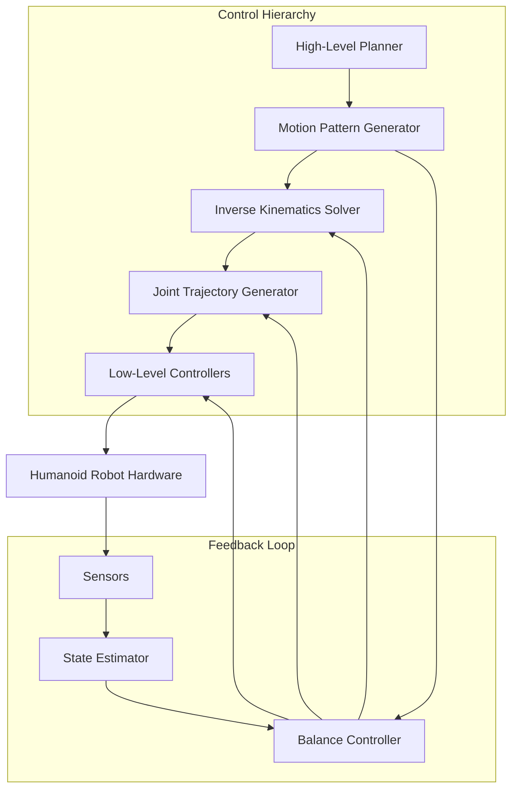
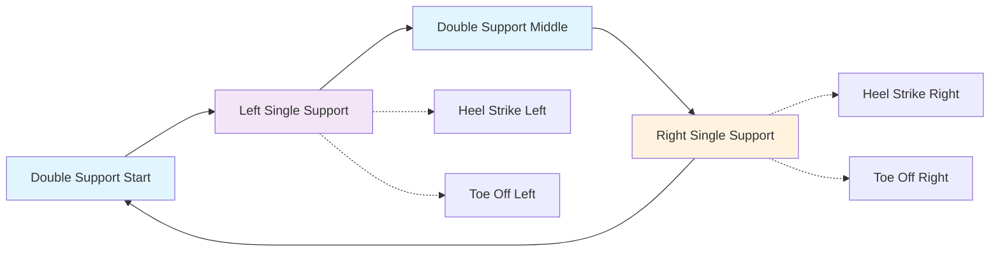
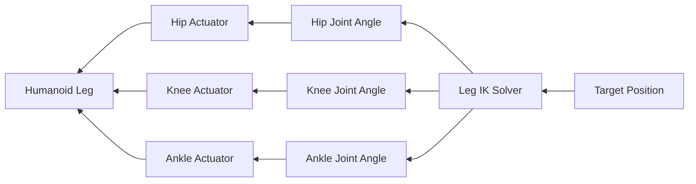

# Module 5: Advanced Control Systems and Locomotion for Humanoid Robots

## Learning Objectives
By the end of this module, you will be able to:
- Understand advanced control systems for humanoid robot stability and balance
- Implement locomotion algorithms for bipedal walking and movement
- Design feedback control systems for humanoid robot actuators
- Apply inverse kinematics and dynamics for motion planning
- Integrate control systems with perception for adaptive locomotion

## Core Theory

### Chapter 5.1: Advanced Control Systems for Humanoid Stability
Humanoid robots require sophisticated control systems to maintain balance and stability. Key concepts include:
- Zero Moment Point (ZMP) control for maintaining balance
- Linear Inverted Pendulum Model (LIPM) for humanoid gait planning
- Center of Mass (CoM) control for stability
- Feedback control loops for real-time balance adjustments
- Model Predictive Control (MPC) for dynamic stability

### Chapter 5.2: Bipedal Locomotion Algorithms
Bipedal locomotion involves complex gait patterns and coordination:
- Walking gaits: heel-strike, stance phase, toe-off, swing phase
- Static vs. dynamic walking approaches
- Footstep planning for stable locomotion
- Terrain adaptation algorithms
- Dynamic balance during movement transitions

### Chapter 5.3: Feedback Control Systems for Actuators
Precise actuator control is crucial for humanoid robot performance:
- PID controllers for joint position and velocity control
- Impedance control for compliant behavior
- Force control for interaction with environment
- Adaptive control for changing conditions
- Cascade control architectures for multi-loop systems

### Chapter 5.4: Inverse Kinematics and Dynamics
Motion planning requires solving complex kinematic problems:
- Forward and inverse kinematics for humanoid structures
- Jacobian-based methods for motion control
- Optimization-based inverse kinematics solvers
- Dynamic motion generation considering robot dynamics
- Whole-body control frameworks for coordinated movement

### Chapter 5.5: Adaptive Control and Perception Integration
Intelligent control adapts to environmental conditions:
- Sensor-based control adaptation
- Vision-guided locomotion
- Tactile feedback integration
- Learning-based control parameter adjustment
- Failure detection and recovery systems

## Practical Examples

### ZMP-Based Balance Control Implementation
```cpp
#include <iostream>
#include <vector>
#include <cmath>

class ZMPController {
private:
    double com_height_;           // Center of mass height
    double gravity_;             // Gravity constant
    double zmp_x_ref_, zmp_y_ref_; // Reference ZMP position
    double com_x_, com_y_;       // Current CoM position
    double com_vel_x_, com_vel_y_; // Current CoM velocity
    double com_acc_x_, com_acc_y_; // Current CoM acceleration

public:
    ZMPController(double height) : com_height_(height), gravity_(9.81) {}

    void updateCoM(double x, double y, double vel_x, double vel_y, double acc_x, double acc_y) {
        com_x_ = x;
        com_y_ = y;
        com_vel_x_ = vel_x;
        com_vel_y_ = vel_y;
        com_acc_x_ = acc_x;
        com_acc_y_ = acc_y;
    }

    std::pair<double, double> computeDesiredCoM() {
        // ZMP equation: zmp = com - (com_height/gravity) * com_acc
        double desired_com_x = com_x_ + (com_height_/gravity_) * com_acc_x_;
        double desired_com_y = com_y_ + (com_height_/gravity_) * com_acc_y_;

        return std::make_pair(desired_com_x, desired_com_y);
    }

    void computeBalanceCorrection(const std::pair<double, double>& actual_zmp) {
        // Calculate error between reference and actual ZMP
        double zmp_error_x = zmp_x_ref_ - actual_zmp.first;
        double zmp_error_y = zmp_y_ref_ - actual_zmp.second;

        // Apply feedback correction to CoM trajectory
        // Implementation details for balance control
    }
};
```

### Bipedal Walking Pattern Generator
```python
import numpy as np
from math import sin, cos, pi, sqrt

class BipedalWalker:
    def __init__(self, step_length=0.3, step_height=0.1, step_duration=1.0):
        self.step_length = step_length
        self.step_height = step_height
        self.step_duration = step_duration
        self.omega = pi / step_duration  # Frequency of half-period

        # Walking state
        self.time = 0.0
        self.left_support = True  # True if left foot is supporting
        self.current_step = 0

    def generate_foot_trajectory(self, t, foot_start_pos, foot_goal_pos):
        """Generate smooth foot trajectory using 5th order polynomial"""
        # Normalize time to [0, 1] over the step duration
        tau = min(max((t % self.step_duration) / self.step_duration, 0.0), 1.0)

        # 5th order polynomial coefficients for smooth trajectory
        poly_coeffs = [0, 0, 10, -15, 6, 0]  # Standard 5th order polynomial

        # Calculate trajectory position
        x_start, y_start, z_start = foot_start_pos
        x_goal, y_goal, z_goal = foot_goal_pos

        dx = x_goal - x_start
        dy = y_goal - y_start
        dz = z_goal - z_start

        # Smooth interpolation
        s_tau = sum(poly_coeffs[i] * (tau ** i) for i in range(len(poly_coeffs)))

        # Vertical lift during swing phase
        lift_offset = self.step_height * sin(pi * tau) if not self.is_support_phase(t) else 0

        x = x_start + s_tau * dx
        y = y_start + s_tau * dy
        z = z_start + s_tau * dz + lift_offset

        return (x, y, z)

    def is_support_phase(self, t):
        """Determine if current time is in support phase (foot on ground)"""
        # Alternate between support phases for each foot
        step_num = int(t / self.step_duration)
        return step_num % 2 == 0  # Even steps: left support, odd steps: right support

    def calculate_com_trajectory(self, t):
        """Calculate Center of Mass trajectory based on walking pattern"""
        # Generate CoM trajectory following the walking pattern
        step_num = int(t / self.step_duration)
        tau = (t % self.step_duration) / self.step_duration

        # Smooth CoM movement with slight oscillation for natural walking
        com_x = step_num * self.step_length + tau * self.step_length
        com_y = 0.0  # Maintain center laterally
        com_z = 0.8 + 0.02 * sin(2 * pi * t / (2 * self.step_duration))  # Slight vertical movement

        return (com_x, com_y, com_z)

    def update_walking_pattern(self, dt):
        """Update walking pattern with time step"""
        self.time += dt

        # Calculate trajectories for both feet
        left_foot_pos = self.calculate_left_foot_pos()
        right_foot_pos = self.calculate_right_foot_pos()
        com_pos = self.calculate_com_trajectory(self.time)

        return {
            'left_foot': left_foot_pos,
            'right_foot': right_foot_pos,
            'com': com_pos,
            'time': self.time
        }

    def calculate_left_foot_pos(self):
        """Calculate left foot position based on walking state"""
        step_num = int(self.time / self.step_duration)
        if self.left_support and step_num % 2 == 0:
            # Left foot is supporting, stays in place
            return (step_num * self.step_length, 0.1, 0.0)
        else:
            # Left foot is swinging, interpolate to next position
            start_pos = ((step_num-1) * self.step_length, 0.1, 0.0)
            goal_pos = (step_num * self.step_length, 0.1, 0.0)
            return self.generate_foot_trajectory(self.time, start_pos, goal_pos)

    def calculate_right_foot_pos(self):
        """Calculate right foot position based on walking state"""
        step_num = int(self.time / self.step_duration)
        if not self.left_support and step_num % 2 == 1:
            # Right foot is supporting, stays in place
            return (step_num * self.step_length, -0.1, 0.0)
        else:
            # Right foot is swinging, interpolate to next position
            start_pos = ((step_num-1) * self.step_length, -0.1, 0.0)
            goal_pos = (step_num * self.step_length, -0.1, 0.0)
            return self.generate_foot_trajectory(self.time, start_pos, goal_pos)
```

### Inverse Kinematics Solver for Humanoid Legs
```python
import numpy as np
from scipy.optimize import minimize
import math

class HumanoidLegIK:
    def __init__(self, thigh_length=0.4, shin_length=0.4):
        self.thigh_length = thigh_length
        self.shin_length = shin_length

    def leg_ik_3dof(self, target_pos, current_pos=(0, 0, 0)):
        """
        Solve 3-DOF leg inverse kinematics (hip pitch, knee, ankle pitch)
        Target position in hip coordinate frame
        """
        x, y, z = target_pos  # x: forward/backward, y: lateral, z: up/down

        # Distance from hip to target in the sagittal plane
        r = math.sqrt(x**2 + z**2)

        # Check if target is reachable
        if r > (self.thigh_length + self.shin_length):
            # Target too far, extend leg fully
            ratio = (self.thigh_length + self.shin_length) / r
            x *= ratio
            z *= ratio
            r = math.sqrt(x**2 + z**2)

        if r < abs(self.thigh_length - self.shin_length):
            # Target too close, extend leg partially
            ratio = abs(self.thigh_length - self.shin_length) / r
            x *= ratio
            z *= ratio
            r = math.sqrt(x**2 + z**2)

        # Knee angle using law of cosines
        # c^2 = a^2 + b^2 - 2ab*cos(C)
        # cos(C) = (a^2 + b^2 - c^2) / (2ab)
        cos_knee_angle = (self.thigh_length**2 + self.shin_length**2 - r**2) / (2 * self.thigh_length * self.shin_length)
        cos_knee_angle = max(-1, min(1, cos_knee_angle))  # Clamp to [-1, 1]
        knee_angle = math.pi - math.acos(cos_knee_angle)

        # Hip angle
        alpha = math.atan2(z, x)
        beta = math.acos((self.thigh_length**2 + r**2 - self.shin_length**2) / (2 * self.thigh_length * r))
        hip_angle = alpha + beta

        # Ankle angle to maintain foot orientation
        ankle_angle = -hip_angle - knee_angle

        # Account for hip abduction (lateral movement)
        hip_abduction = math.atan2(y, r) if r > 0.001 else 0

        return {
            'hip_pitch': hip_angle,
            'knee': knee_angle,
            'ankle_pitch': ankle_angle,
            'hip_abduction': hip_abduction
        }

    def optimize_full_body_ik(self, target_positions, initial_angles, weights=None):
        """
        Optimize full-body IK using numerical methods
        target_positions: dict with desired positions for different body parts
        initial_angles: initial joint angle guesses
        weights: importance weights for different targets
        """
        if weights is None:
            weights = {'left_foot': 1.0, 'right_foot': 1.0, 'com': 0.5}

        def objective_function(joint_angles):
            # Convert flat joint angles array to structured format
            angles_dict = self.flat_to_structured_angles(joint_angles)

            # Calculate current positions from angles
            current_positions = self.forward_kinematics(angles_dict)

            # Calculate weighted error
            total_error = 0.0

            for part, target_pos in target_positions.items():
                if part in current_positions:
                    current_pos = current_positions[part]
                    error = np.linalg.norm(np.array(target_pos) - np.array(current_pos))
                    weight = weights.get(part, 1.0)
                    total_error += weight * error**2

            return total_error

        # Minimize the objective function
        result = minimize(objective_function, initial_angles, method='BFGS')

        if result.success:
            return self.flat_to_structured_angles(result.x)
        else:
            raise RuntimeError("IK optimization failed to converge")

    def flat_to_structured_angles(self, flat_angles):
        """Convert flat array to structured joint angles dictionary"""
        # Assuming a simple humanoid model with 12 DOF (6 per leg)
        angles = {
            'left_hip_pitch': flat_angles[0],
            'left_hip_roll': flat_angles[1],
            'left_hip_yaw': flat_angles[2],
            'left_knee': flat_angles[3],
            'left_ankle_pitch': flat_angles[4],
            'left_ankle_roll': flat_angles[5],
            'right_hip_pitch': flat_angles[6],
            'right_hip_roll': flat_angles[7],
            'right_hip_yaw': flat_angles[8],
            'right_knee': flat_angles[9],
            'right_ankle_pitch': flat_angles[10],
            'right_ankle_roll': flat_angles[11]
        }
        return angles

    def forward_kinematics(self, angles_dict):
        """Calculate end-effector positions from joint angles"""
        # Simplified calculation - in a real implementation this would use
        # transformation matrices and proper kinematic chains
        positions = {}

        # Calculate left foot position
        lhp = angles_dict['left_hip_pitch']
        lk = angles_dict['left_knee']
        lap = angles_dict['left_ankle_pitch']

        # Simplified leg FK - in reality this would use proper transformation matrices
        left_foot_x = (self.thigh_length * math.cos(lhp) +
                      self.shin_length * math.cos(lhp + lk) +
                      0.1 * math.cos(lhp + lk + lap))
        left_foot_z = -(self.thigh_length * math.sin(lhp) +
                       self.shin_length * math.sin(lhp + lk) +
                       0.1 * math.sin(lhp + lk + lap))

        positions['left_foot'] = (left_foot_x, 0.1, left_foot_z)

        # Similar calculation for right foot
        rhp = angles_dict['right_hip_pitch']
        rk = angles_dict['right_knee']
        rap = angles_dict['right_ankle_pitch']

        right_foot_x = (self.thigh_length * math.cos(rhp) +
                       self.shin_length * math.cos(rhp + rk) +
                       0.1 * math.cos(rhp + rk + rap))
        right_foot_z = -(self.thigh_length * math.sin(rhp) +
                        self.shin_length * math.sin(rhp + rk) +
                        0.1 * math.sin(rhp + rk + rap))

        positions['right_foot'] = (right_foot_x, -0.1, right_foot_z)

        return positions
```

## Diagrams

### Humanoid Control Architecture


### Bipedal Walking Phases


### Inverse Kinematics Chain


## Exercises

### Chapter 5.1: Advanced Control Systems
1. Implement a ZMP-based balance controller for a simulated humanoid
2. Compare LIPM and inverted pendulum models for balance control
3. Tune PID parameters for stable joint control
4. Implement a simple MPC controller for humanoid balance

### Chapter 5.2: Bipedal Locomotion
1. Create a stable walking gait pattern generator for flat terrain
2. Implement footstep planning algorithm for navigating obstacles
3. Design transition patterns between standing and walking
4. Implement turning and sideways walking patterns

### Chapter 5.3: Feedback Control Systems
1. Design and tune PID controllers for each joint in a humanoid leg
2. Implement impedance control for compliant behavior
3. Create cascade control architecture for precise motion
4. Test control performance under external disturbances

### Chapter 5.4: Inverse Kinematics and Dynamics
1. Implement a full-body IK solver for humanoid motion
2. Create an optimization-based IK solver with constraints
3. Implement forward dynamics calculations for motion prediction
4. Design a whole-body controller for coordinated movement

### Chapter 5.5: Adaptive Control
1. Implement vision-based footstep adjustment for uneven terrain
2. Create tactile feedback integration for contact-aware control
3. Design learning-based parameter adaptation for walking
4. Implement failure detection and recovery mechanisms

## Quiz

### Chapter 5.1: Advanced Control Systems
1. What is Zero Moment Point (ZMP) and why is it important for humanoid balance?
2. Explain the difference between static and dynamic walking approaches.
3. What are the advantages of Model Predictive Control (MPC) for humanoid robots?

### Chapter 5.2: Bipedal Locomotion
4. Describe the four phases of a typical bipedal walking gait.
5. What factors influence step length and duration in humanoid walking?
6. How does terrain adaptation affect locomotion planning?

### Chapter 5.3: Feedback Control Systems
7. Why are cascade control architectures beneficial for humanoid robots?
8. What is impedance control and when is it useful?
9. How do you tune PID parameters for optimal performance?

### Chapter 5.4: Inverse Kinematics and Dynamics
10. What is the difference between forward and inverse kinematics?
11. Why is redundancy resolution important in humanoid IK?
12. How do dynamics considerations affect motion planning?

### Chapter 5.5: Adaptive Control
13. How can sensory feedback improve locomotion performance?
14. What are the challenges of real-time control adaptation?
15. Why is failure detection critical for humanoid robots?

## References

### Control Systems Resources
- [Kajita et al. - Humanoid Robot Control Using the Preview Control of ZMP](https://ieeexplore.ieee.org/document/1249227)
- [Spong - Underactuated Robotics: Algorithms, Classification, Control](https://underactuated.mit.edu/)
- [Ott - Cartesian Control of Robots](https://www.kore robotics.net/download/ott_iros2008.pdf)
- [Pratt - Virtual Model Control](https://www.ri.cmu.edu/pub_files/pub3/pratt_jerry_1997_1/pratt_jerry_1997_1.pdf)

### Locomotion Resources
- [Hyon - Full Body Dynamic Pattern Generators for Humanoid Robots](https://ieeexplore.ieee.org/document/4543634)
- [Englsberger - Bipedal Walking Control](https://elib.dlr.de/90612/1/Englsberger_Humanoids2014.pdf)
- [Stephens - Humanoid Robot Simulation](https://www.cs.utah.edu/~skulper/spring2015/papers/stephens2010.pdf)
- [Wieber - Trajectory Free Linear Model Predictive Control](https://hal.inria.fr/inria-00390298/document)

### Inverse Kinematics Resources
- [Cisneros - Humanoid Robot Kinematics](https://link.springer.com/chapter/10.1007/978-3-319-56980-2_12)
- [Buss - Introduction to Inverse Kinematics](https://www.mathworks.com/help/robotics/ug/understanding-inverse-kinematics.html)
- [Cherubini - KDL: Kinematics and Dynamics Library](https://www.orocos.org/kdl)
- [OpenRAVE Documentation](http://openrave.org/docs/latest_stable/)

## Summary

This module provided a comprehensive overview of advanced control systems and locomotion techniques for humanoid robots. We covered the fundamental concepts of balance control using ZMP and LIPM models, developed sophisticated bipedal walking algorithms, designed feedback control systems for precise actuator control, and implemented inverse kinematics solutions for coordinated motion.

Key concepts covered include:
- Advanced control strategies for maintaining humanoid balance and stability
- Bipedal locomotion algorithms for various walking patterns and terrains
- Feedback control systems for precise joint actuation
- Inverse kinematics and dynamics for motion planning
- Adaptive control techniques that integrate perception and control

These control systems are essential for creating humanoid robots that can move dynamically and stably in real-world environments. The integration of perception and control allows robots to adapt to changing conditions and navigate complex scenarios while maintaining balance and executing tasks safely.

### References
- [Humanoid Robotics: A Reference - Springer Handbook](https://link.springer.com/referencework/10.1007/978-94-007-7299-9)
- [Springer Handbook of Robotics - Siciliano & Khatib](https://link.springer.com/book/10.1007/978-3-319-32552-1)
- [Introduction to Humanoid Robotics - Kajita et al.](https://link.springer.com/book/10.1007/978-3-642-54536-8)