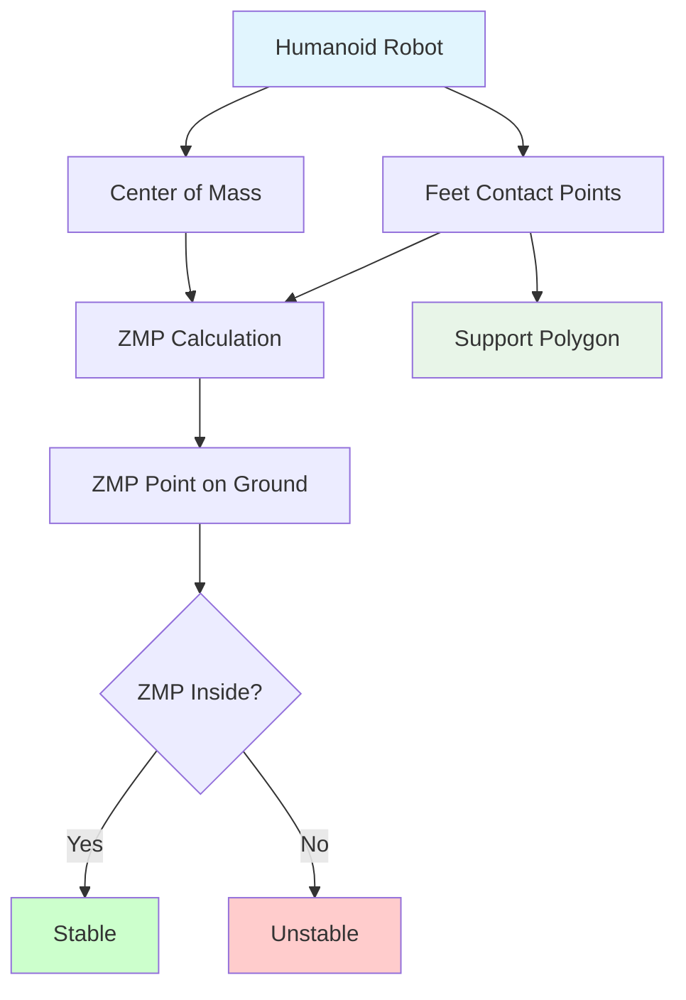

# Chapter 1: Advanced Control Systems for Humanoid Stability

## Learning Objectives
By the end of this chapter, you will be able to:
- Understand the principles of Zero Moment Point (ZMP) control for humanoid balance
- Implement Linear Inverted Pendulum Model (LIPM) for gait planning
- Design feedback control systems for real-time balance adjustments
- Apply Model Predictive Control (MPC) for dynamic stability
- Evaluate stability margins for humanoid robots

## Core Theory

### Zero Moment Point (ZMP) Control
Zero Moment Point (ZMP) is a fundamental concept in humanoid robotics that defines the point on the ground where the net moment of the ground reaction forces is zero. For a humanoid robot to maintain balance, the ZMP must remain within the support polygon defined by the feet.

The ZMP is calculated using the formula:
ZMP_x = x - (h/g) * (ẍ + g*h*z̈)/(1 + z̈/g)

Where:
- x is the center of mass (CoM) position
- h is the CoM height
- g is gravitational acceleration
- ẍ is the CoM acceleration
- z̈ is the CoM vertical acceleration

### Linear Inverted Pendulum Model (LIPM)
The Linear Inverted Pendulum Model simplifies the complex dynamics of a humanoid robot to a point mass supported by a massless rod. This model assumes a constant CoM height, resulting in linearized equations of motion:

ẍ = ω²(x - x_ZMP)

Where ω² = g/h and x_ZMP is the desired ZMP position.

### Center of Mass (CoM) Control
Maintaining CoM stability is crucial for humanoid balance. The CoM controller must:
- Track desired CoM trajectories
- Respond to external disturbances
- Coordinate with other control systems
- Ensure smooth transitions between different postures

### Feedback Control for Balance
Real-time balance control requires:
- Fast sensor feedback (IMU, force/torque sensors)
- Low-latency control loops
- Adaptive control gains
- Disturbance rejection mechanisms

## Practical Examples

### ZMP Calculation Implementation
```python
import numpy as np

class ZMPCalculator:
    def __init__(self, robot_mass, gravity=9.81):
        self.mass = robot_mass
        self.gravity = gravity

    def calculate_zmp(self, com_pos, com_acc, cop_pos=None, height=None):
        """
        Calculate ZMP based on Center of Mass position and acceleration
        """
        if height is None:
            # Estimate height from CoM z-coordinate
            height = com_pos[2]

        # Calculate net forces and moments
        net_force_z = self.mass * (self.gravity + com_acc[2])

        if net_force_z != 0:
            zmp_x = com_pos[0] - (self.mass * com_acc[0]) / net_force_z
            zmp_y = com_pos[1] - (self.mass * com_acc[1]) / net_force_z
        else:
            # Handle case where vertical force is zero
            zmp_x = com_pos[0]
            zmp_y = com_pos[1]

        return np.array([zmp_x, zmp_y, 0.0])

    def check_stability(self, zmp_pos, support_polygon):
        """
        Check if ZMP is within the support polygon
        """
        # Simple rectangular support polygon check
        x_min, x_max = support_polygon['x_range']
        y_min, y_max = support_polygon['y_range']

        return (x_min <= zmp_pos[0] <= x_max and
                y_min <= zmp_pos[1] <= y_max)
```

### LIPM-based Gait Planning
```python
import numpy as np
from scipy.integrate import odeint

class LIPMGaitPlanner:
    def __init__(self, com_height, gravity=9.81):
        self.h = com_height
        self.g = gravity
        self.omega = np.sqrt(gravity / com_height)

    def plan_com_trajectory(self, start_pos, goal_pos, duration, dt=0.01):
        """
        Plan CoM trajectory using LIPM
        """
        num_steps = int(duration / dt)
        time_points = np.linspace(0, duration, num_steps)

        # LIPM dynamics: ẍ = ω²(x - x_ZMP)
        # For stable walking, we define a series of ZMP references

        # Generate ZMP reference trajectory (e.g., for stepping)
        zmp_refs = self.generate_zmp_refs(start_pos, goal_pos, duration, dt)

        # Integrate the dynamics to get CoM trajectory
        com_trajectory = []
        current_pos = np.array(start_pos)
        current_vel = np.zeros(2)  # Starting with zero velocity

        for i, t in enumerate(time_points[:-1]):
            zmp_ref = zmp_refs[i]

            # LIPM dynamics: ẍ = ω²(x - x_ZMP)
            com_acc = self.omega**2 * (current_pos - zmp_ref)

            # Integrate to get next state
            current_vel += com_acc * dt
            current_pos += current_vel * dt

            com_trajectory.append(current_pos.copy())

        return np.array(com_trajectory), time_points[:-1]

    def generate_zmp_refs(self, start_pos, goal_pos, duration, dt):
        """
        Generate ZMP reference trajectory for walking
        """
        num_steps = int(duration / dt)
        zmp_refs = []

        # For simplicity, use a 3rd order polynomial to transition ZMP
        for i in range(num_steps):
            t_norm = i * dt / duration

            # 3rd order polynomial for smooth transition
            # From start_pos to goal_pos
            zmp_x = start_pos[0] + (goal_pos[0] - start_pos[0]) * (3*t_norm**2 - 2*t_norm**3)
            zmp_y = start_pos[1] + (goal_pos[1] - start_pos[1]) * (3*t_norm**2 - 2*t_norm**3)

            zmp_refs.append(np.array([zmp_x, zmp_y]))

        return np.array(zmp_refs)
```

## Diagrams

### ZMP and Support Polygon


## Exercises

1. Implement a ZMP estimator using IMU and force sensor data
2. Create a LIPM-based controller that stabilizes a humanoid model
3. Design a balance recovery strategy when ZMP exits the support polygon
4. Simulate the effect of different CoM heights on stability margins
5. Implement a ZMP-based stepping controller for disturbance recovery

## Quiz

1. What is the mathematical relationship between ZMP and Center of Mass?
2. Why is the Linear Inverted Pendulum Model useful for humanoid control?
3. How does the support polygon change during different phases of walking?
4. What are the limitations of the LIPM assumption?
5. How does ZMP control differ from other balance control approaches?

## References

- Kajita, S., et al. "The 3D Linear Inverted Pendulum Mode: A simple modeling for a biped walking pattern generation"
- Pratt, J., et al. "Capturability-based analysis and control of legged locomotion"
- Hof, A. "Scaling the extrapolated center of mass to estimate gait stability"
- Goswami, A. "Postural stability of biped robots and the foot rotation indicator (FRI) point"

## Summary

This chapter introduced the fundamental concepts of ZMP and LIPM-based control for humanoid stability. We explored the mathematical foundations of balance control and implemented practical algorithms for ZMP calculation and trajectory planning. Understanding these concepts is essential for developing stable humanoid robots that can maintain balance under various conditions.