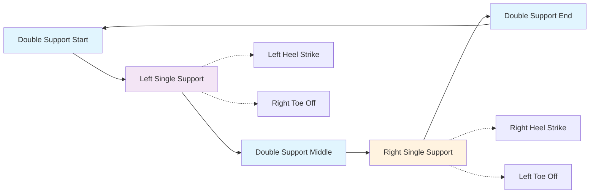
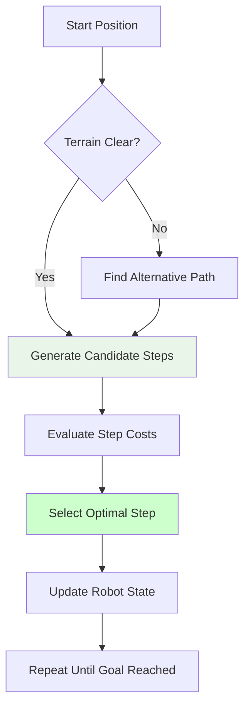

# Chapter 2: Bipedal Locomotion Algorithms for Humanoid Robots

## Learning Objectives
By the end of this chapter, you will be able to:
- Implement walking gait patterns for stable bipedal locomotion
- Design footstep planning algorithms for navigation
- Create smooth transitions between walking and standing
- Apply dynamic balance control during locomotion
- Evaluate gait parameters for different terrains

## Core Theory

### Walking Gait Patterns
Bipedal walking consists of several distinct phases:
- Double Support Phase: Both feet are in contact with the ground
- Single Support Phase: Only one foot is in contact with the ground
- Heel Strike: Leading foot contacts the ground with the heel
- Toe Off: Trailing foot pushes off with the toes

### Gait Parameters
Key parameters that define walking patterns:
- Step Length: Distance between consecutive foot placements
- Step Width: Lateral distance between feet
- Step Height: Maximum height of swing foot
- Cadence: Steps per minute
- Walking Speed: Average velocity of locomotion

### Footstep Planning
Footstep planning involves:
- Determining optimal placement locations
- Considering terrain characteristics
- Maintaining balance throughout the gait cycle
- Planning for obstacle avoidance

### Dynamic Balance During Locomotion
During walking, the Center of Mass (CoM) moves in a complex pattern:
- Lateral sway during single support phases
- Vertical oscillation following an inverted pendulum motion
- Forward progression with controlled falling and catching

## Practical Examples

### Bipedal Walking Pattern Generator
```python
import numpy as np
from math import sin, cos, pi

class BipedalPatternGenerator:
    def __init__(self, step_length=0.3, step_width=0.2, step_height=0.05, step_duration=0.8):
        self.step_length = step_length
        self.step_width = step_width
        self.step_height = step_height
        self.step_duration = step_duration

        # Current state
        self.current_time = 0.0
        self.left_support = True  # Start with left foot support
        self.left_foot_pos = np.array([0.0, self.step_width/2, 0.0])
        self.right_foot_pos = np.array([0.0, -self.step_width/2, 0.0])
        self.step_count = 0

    def generate_step_sequence(self, num_steps):
        """
        Generate a sequence of steps
        """
        steps = []

        for i in range(num_steps):
            # Calculate step parameters
            start_pos = self.left_foot_pos if self.left_support else self.right_foot_pos

            # Target position for the swing foot
            if self.left_support:
                # Right foot swings forward
                target_x = start_pos[0] + self.step_length
                target_y = -self.step_width/2
                swing_foot = "right"
            else:
                # Left foot swings forward
                target_x = start_pos[0] + self.step_length
                target_y = self.step_width/2
                swing_foot = "left"

            # Generate smooth trajectory for swing foot
            swing_trajectory = self.generate_swing_trajectory(
                start_pos, [target_x, target_y, 0], self.step_duration
            )

            steps.append({
                'swing_foot': swing_foot,
                'start_pos': start_pos,
                'target_pos': [target_x, target_y, 0],
                'trajectory': swing_trajectory,
                'duration': self.step_duration
            })

            # Update support foot
            self.left_support = not self.left_support
            if swing_foot == "left":
                self.left_foot_pos = np.array([target_x, target_y, 0])
            else:
                self.right_foot_pos = np.array([target_x, target_y, 0])

        return steps

    def generate_swing_trajectory(self, start_pos, end_pos, duration, dt=0.01):
        """
        Generate smooth trajectory for swing foot
        """
        steps = int(duration / dt)
        trajectory = []

        for i in range(steps + 1):
            t = i * dt / duration  # Normalized time [0, 1]

            # 5th order polynomial for smooth motion
            poly_t = 10*t**3 - 15*t**4 + 6*t**5

            # Interpolate position
            x = start_pos[0] + poly_t * (end_pos[0] - start_pos[0])
            y = start_pos[1] + poly_t * (end_pos[1] - start_pos[1])

            # Parabolic lift for z-axis
            z_lift = self.step_height * sin(pi * t)  # Lift during swing
            z = start_pos[2] + poly_t * (end_pos[2] - start_pos[2]) + z_lift

            trajectory.append([x, y, z])

        return np.array(trajectory)
```

### Footstep Planning Algorithm
```python
import numpy as np
from scipy.spatial.distance import euclidean
import heapq

class FootstepPlanner:
    def __init__(self, step_length=0.3, step_width=0.2, max_step_dist=0.4):
        self.step_length = step_length
        self.step_width = step_width
        self.max_step_dist = max_step_dist
        self.grid_resolution = 0.1  # Grid resolution in meters

    def plan_footsteps(self, start_pos, goal_pos, terrain_map=None):
        """
        Plan sequence of footsteps from start to goal
        """
        # Simplified A* algorithm for footstep planning
        open_set = [(0, start_pos)]
        came_from = {}
        g_score = {tuple(start_pos): 0}
        f_score = {tuple(start_pos): self.heuristic(start_pos, goal_pos)}

        directions = [
            (self.step_length, 0, 0),  # Forward
            (-self.step_length, 0, 0), # Backward
            (0, self.step_width, 0),   # Left
            (0, -self.step_width, 0),  # Right
            (self.step_length/2, self.step_width/2, 0),  # Diagonal forward-left
            (self.step_length/2, -self.step_width/2, 0), # Diagonal forward-right
        ]

        while open_set:
            current = heapq.heappop(open_set)[1]

            if self.distance(current, goal_pos) < self.step_length:
                # Reconstruct path
                path = [current]
                while tuple(current) in came_from:
                    current = came_from[tuple(current)]
                    path.append(current)
                path.reverse()
                return path

            for direction in directions:
                neighbor = [current[0] + direction[0],
                           current[1] + direction[1],
                           current[2] + direction[2]]

                # Check if step is valid
                if not self.is_valid_step(current, neighbor, terrain_map):
                    continue

                tentative_g_score = g_score[tuple(current)] + self.step_cost(current, neighbor)

                if tuple(neighbor) not in g_score or tentative_g_score < g_score[tuple(neighbor)]:
                    came_from[tuple(neighbor)] = current
                    g_score[tuple(neighbor)] = tentative_g_score
                    f_score[tuple(neighbor)] = tentative_g_score + self.heuristic(neighbor, goal_pos)
                    heapq.heappush(open_set, (f_score[tuple(neighbor)], neighbor))

        return []  # No path found

    def heuristic(self, pos1, pos2):
        """
        Heuristic function for A* (Euclidean distance)
        """
        return self.distance(pos1, pos2)

    def distance(self, pos1, pos2):
        """
        Calculate Euclidean distance between two points
        """
        return euclidean(pos1, pos2)

    def is_valid_step(self, current, neighbor, terrain_map):
        """
        Check if step is valid (doesn't exceed maximum distance, terrain is traversable)
        """
        dist = self.distance(current, neighbor)
        if dist > self.max_step_dist:
            return False

        # If terrain map exists, check for obstacles
        if terrain_map is not None:
            # Simplified obstacle check
            pass

        return True

    def step_cost(self, pos1, pos2):
        """
        Calculate cost of taking a step
        """
        base_cost = self.distance(pos1, pos2)

        # Additional costs could be added for terrain difficulty, energy, etc.
        return base_cost
```

## Diagrams

### Walking Gait Cycle


### Footstep Planning


## Exercises

1. Implement a complete walking controller that follows the generated patterns
2. Create a footstep planner that avoids obstacles in real-time
3. Design a gait adaptation system for different walking speeds
4. Implement terrain adaptation for uneven surfaces
5. Create a recovery mechanism for lost balance during walking

## Quiz

1. What are the main phases of a bipedal walking gait?
2. How does step length affect walking stability and speed?
3. What is the purpose of the double support phase?
4. How does footstep planning differ from path planning for wheeled robots?
5. What are the challenges of adapting gait parameters to different terrains?

## References

- McGeer, T. "Passive dynamic walking" - Foundation of stable walking
- Kuffner, J., et al. "Footstep planning for biped robots" - Planning algorithms
- Takenaka, T., et al. "Real-time walking pattern generation" - Online gait generation
- Harada, K., et al. "Free-position control" - Footstep optimization

## Summary

This chapter covered the fundamental concepts of bipedal locomotion for humanoid robots. We explored walking gait patterns, footstep planning algorithms, and the dynamics of stable walking. The practical implementations provided a foundation for creating walking controllers that can navigate various terrains while maintaining balance.