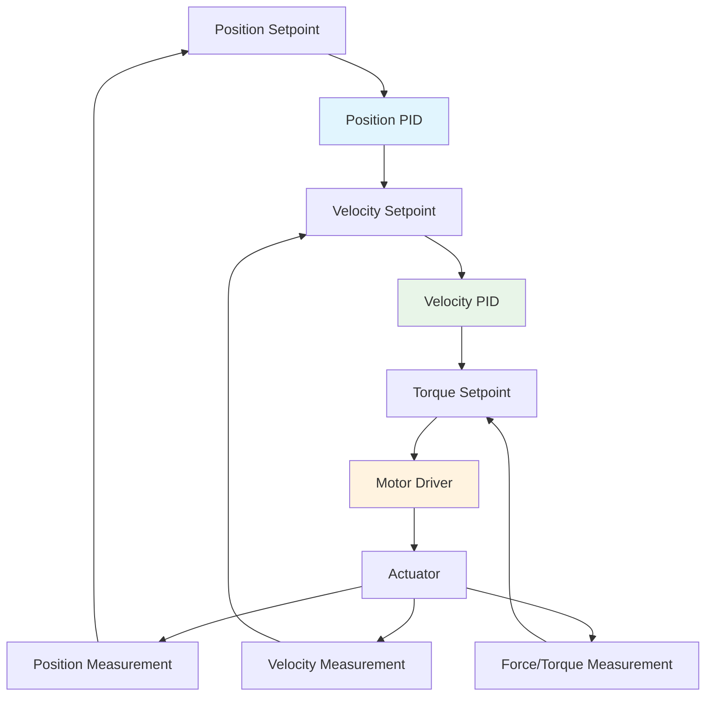
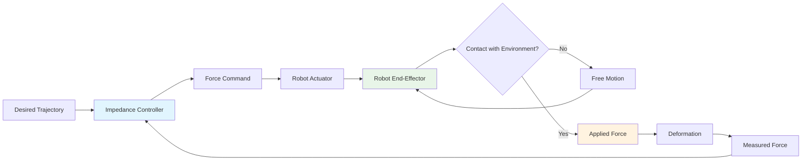

# Chapter 3: Feedback Control Systems for Humanoid Actuators

## Learning Objectives
By the end of this chapter, you will be able to:
- Design PID controllers for precise joint position and velocity control
- Implement impedance control for compliant robot behavior
- Create cascade control architectures for multi-loop systems
- Apply adaptive control techniques for changing conditions
- Evaluate control performance and stability margins

## Core Theory

### Proportional-Integral-Derivative (PID) Control
PID controllers are fundamental in robotics for precise control of actuators:
- Proportional term: Reduces current error
- Integral term: Eliminates steady-state error
- Derivative term: Predicts future error and improves stability

The PID control law is: u(t) = Kp*e(t) + Ki*∫e(t)dt + Kd*de(t)/dt

### Cascade Control Architecture
Cascade control involves multiple control loops:
- Outer loop: Position control
- Inner loop: Velocity control
- Innermost loop: Torque/Force control

### Impedance Control
Impedance control regulates the dynamic relationship between position and force:
M_des*ẍ_d + B_des*ẋ_d + K_des*x_d = F_cmd

Where M, B, K represent desired mass, damping, and stiffness.

### Adaptive Control
Adaptive control adjusts parameters in real-time:
- Model Reference Adaptive Control (MRAC)
- Self-Tuning Regulators (STR)
- Gain Scheduling

### Force Control and Compliance
Force control is essential for interaction with environment:
- Hybrid Position/Force control
- Admittance control
- Stiffness modulation

## Practical Examples

### Advanced PID Controller for Joint Control
```python
import numpy as np
import time

class AdvancedPIDController:
    def __init__(self, kp, ki, kd, dt=0.001, output_limits=(-np.inf, np.inf)):
        self.kp = kp
        self.ki = ki
        self.kd = kd
        self.dt = dt
        self.output_limits = output_limits

        # Internal state
        self.previous_error = 0.0
        self.integral = 0.0
        self.previous_derivative = 0.0
        self.setpoint = 0.0
        self.measurement = 0.0

        # Anti-windup parameters
        self.windup_guard = 20.0

        # Derivative filtering
        self.alpha = 0.1  # Low-pass filter coefficient

        # Feedforward terms
        self.kff_pos = 0.0
        self.kff_vel = 0.0
        self.kff_acc = 0.0

    def update(self, setpoint, measurement, feedforward_pos=0.0, feedforward_vel=0.0, feedforward_acc=0.0):
        """
        Update PID controller and return control output
        """
        self.setpoint = setpoint
        self.measurement = measurement

        # Calculate error
        error = setpoint - measurement

        # Proportional term
        proportional = self.kp * error

        # Integral term with anti-windup
        self.integral += error * self.dt
        # Anti-windup: clamp integral term
        self.integral = np.clip(self.integral,
                               -self.windup_guard, self.windup_guard)
        integral = self.ki * self.integral

        # Derivative term with low-pass filtering
        derivative_raw = (error - self.previous_error) / self.dt
        # Low-pass filter the derivative to reduce noise
        filtered_derivative = (1 - self.alpha) * self.previous_derivative + \
                             self.alpha * derivative_raw
        derivative = self.kd * filtered_derivative

        # Update previous values
        self.previous_error = error
        self.previous_derivative = filtered_derivative

        # Calculate PID output
        pid_output = proportional + integral + derivative

        # Add feedforward terms
        feedforward_output = (self.kff_pos * feedforward_pos +
                             self.kff_vel * feedforward_vel +
                             self.kff_acc * feedforward_acc)

        output = pid_output + feedforward_output

        # Apply output limits
        output = np.clip(output, self.output_limits[0], self.output_limits[1])

        return output

    def reset(self):
        """
        Reset the PID controller to initial state
        """
        self.previous_error = 0.0
        self.integral = 0.0
        self.previous_derivative = 0.0
        self.setpoint = 0.0
        self.measurement = 0.0

    def set_tunings(self, kp, ki, kd):
        """
        Update PID tuning parameters
        """
        self.kp = kp
        self.ki = ki
        self.kd = kd
```

### Impedance Controller Implementation
```python
import numpy as np

class ImpedanceController:
    def __init__(self, mass=1.0, damping=10.0, stiffness=100.0, dt=0.001):
        self.desired_mass = mass
        self.desired_damping = damping
        self.desired_stiffness = stiffness
        self.dt = dt

        # State variables
        self.position = 0.0
        self.velocity = 0.0
        self.acceleration = 0.0

        # Desired trajectory
        self.desired_pos = 0.0
        self.desired_vel = 0.0
        self.desired_acc = 0.0

        # External forces
        self.external_force = 0.0

    def update(self, measured_pos, measured_vel, desired_pos, desired_vel, desired_acc, external_force=0.0):
        """
        Update impedance controller and return control force
        """
        # Update state
        self.position = measured_pos
        self.velocity = measured_vel
        self.external_force = external_force

        # Store desired trajectory
        self.desired_pos = desired_pos
        self.desired_vel = desired_vel
        self.desired_acc = desired_acc

        # Calculate position and velocity errors
        pos_error = desired_pos - measured_pos
        vel_error = desired_vel - measured_vel

        # Impedance control law: M_des*ẍ_d + B_des*ẋ_d + K_des*x_d = F_cmd
        # Rearranging: F_cmd = M_des*ẍ_des + B_des*vel_error + K_des*pos_error
        force_cmd = (self.desired_mass * desired_acc +
                    self.desired_damping * vel_error +
                    self.desired_stiffness * pos_error)

        # Add external force to the equation
        total_force = force_cmd - external_force

        # Update acceleration based on applied force
        self.acceleration = total_force / self.desired_mass

        # Update velocity and position using Euler integration
        self.velocity += self.acceleration * self.dt
        self.position += self.velocity * self.dt

        return total_force

    def update_impedance_params(self, mass, damping, stiffness):
        """
        Update impedance parameters in real-time
        """
        self.desired_mass = mass
        self.desired_damping = damping
        self.desired_stiffness = stiffness

    def get_current_state(self):
        """
        Return current state of the impedance controller
        """
        return {
            'position': self.position,
            'velocity': self.velocity,
            'acceleration': self.acceleration,
            'external_force': self.external_force
        }
```

## Diagrams

### Cascade Control Architecture


### Impedance Control Concept


## Exercises

1. Implement a PID controller for a single joint and tune the parameters
2. Create a cascade control system with position and velocity loops
3. Design an impedance controller for safe human-robot interaction
4. Implement adaptive control to handle changing load conditions
5. Evaluate the stability margins of your control system

## Quiz

1. What is the purpose of the integral term in a PID controller?
2. How does anti-windup prevent integral saturation?
3. What is the difference between impedance control and position control?
4. Why is derivative filtering important in PID controllers?
5. How does cascade control improve system performance?

## References

- Craig, J. "Introduction to Robotics: Mechanics and Control" - Classic robotics control
- Sciavicco, L. and Siciliano, B. "Modelling and Control of Robot Manipulators" - Advanced control
- Hogan, N. "Impedance control: An approach to manipulation" - Original impedance control paper
- Åström, K. and Hägglund, T. "Advanced PID Control" - PID tuning methods

## Summary

This chapter explored feedback control systems for humanoid actuators, covering PID controllers, impedance control, and cascade architectures. We implemented advanced control algorithms with features like anti-windup, derivative filtering, and feedforward terms. These control systems are essential for precise and compliant robot behavior during interaction with the environment.