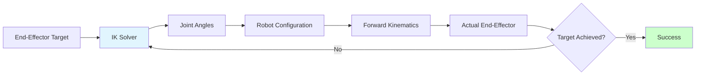

# Chapter 4: Inverse Kinematics and Dynamics for Humanoid Motion

## Learning Objectives
By the end of this chapter, you will be able to:
- Solve inverse kinematics problems for humanoid robot structures
- Implement Jacobian-based methods for motion control
- Apply optimization-based inverse kinematics solvers
- Calculate robot dynamics for motion planning
- Design whole-body control frameworks for coordinated movement

## Core Theory

### Forward and Inverse Kinematics
Forward Kinematics: Calculate end-effector position from joint angles
Inverse Kinematics: Calculate joint angles from desired end-effector position

For a humanoid robot with n joints, the relationship is:
T = f(θ₁, θ₂, ..., θₙ)

Where T is the end-effector pose and θᵢ are joint angles.

### Jacobian Matrix
The Jacobian relates joint velocities to end-effector velocities:
Ẋ = J(θ) * θ̇

Where X is end-effector velocity, J is the Jacobian matrix, and θ̇ is joint velocities.

### Inverse Kinematics Solutions
Common approaches:
- Analytical solutions (for simple kinematic chains)
- Numerical methods (Jacobian pseudoinverse)
- Optimization-based methods (minimize error subject to constraints)
- Geometric methods (trigonometric solutions)

### Robot Dynamics
Robot dynamics describe the relationship between forces and motion:
M(q)q̈ + C(q,q̇)q̇ + G(q) = τ

Where M is the mass matrix, C represents Coriolis and centrifugal forces, G is gravity vector, and τ is joint torques.

### Whole-Body Control
Coordinates multiple tasks simultaneously:
- Priority-based task execution
- Null-space projection
- Constraint handling

## Practical Examples

### Inverse Kinematics Solver for Humanoid Arm
```python
import numpy as np
from math import sin, cos, atan2, acos, sqrt

class HumanoidArmIK:
    def __init__(self, shoulder_pos=np.array([0, 0, 0]),
                 upper_arm_length=0.3, forearm_length=0.25):
        self.shoulder_pos = shoulder_pos
        self.upper_arm_length = upper_arm_length
        self.forearm_length = forearm_length

    def solve_3dof_arm(self, target_pos, elbow_direction=1):
        """
        Solve 3-DOF arm inverse kinematics (shoulder, elbow, wrist)
        Assumes planar movement for simplicity
        """
        # Transform target to shoulder frame
        rel_target = target_pos - self.shoulder_pos

        # Calculate distance from shoulder to target
        dist_sq = rel_target[0]**2 + rel_target[1]**2
        dist = sqrt(dist_sq)

        # Check reachability
        if dist > (self.upper_arm_length + self.forearm_length):
            # Target unreachable, extend arm fully
            scale = (self.upper_arm_length + self.forearm_length) / dist
            rel_target *= scale
            dist = self.upper_arm_length + self.forearm_length

        if dist < abs(self.upper_arm_length - self.forearm_length):
            # Target too close, extend arm partially
            scale = abs(self.upper_arm_length - self.forearm_length) / dist
            rel_target *= scale
            dist = abs(self.upper_arm_length - self.forearm_length)

        # Shoulder yaw (rotation around z-axis)
        shoulder_yaw = atan2(rel_target[1], rel_target[0])

        # Calculate elbow angle using law of cosines
        # c² = a² + b² - 2ab*cos(C)
        # cos(C) = (a² + b² - c²) / (2ab)
        cos_elbow = (self.upper_arm_length**2 + self.forearm_length**2 - dist_sq) / \
                   (2 * self.upper_arm_length * self.forearm_length)
        cos_elbow = max(-1, min(1, cos_elbow))  # Clamp to [-1, 1]
        elbow_angle = acos(cos_elbow)

        # Elbow direction (flexed forward or backward)
        elbow_angle = elbow_direction * (np.pi - elbow_angle)

        # Shoulder pitch
        alpha = atan2(rel_target[2], sqrt(rel_target[0]**2 + rel_target[1]**2))
        beta = atan2(self.forearm_length * sin(np.pi - abs(elbow_angle)),
                     self.upper_arm_length + self.forearm_length * cos(np.pi - abs(elbow_angle)))
        shoulder_pitch = alpha + beta

        return {
            'shoulder_yaw': shoulder_yaw,
            'shoulder_pitch': shoulder_pitch,
            'elbow': elbow_angle
        }

    def jacobian_3dof(self, joint_angles):
        """
        Calculate Jacobian matrix for 3-DOF arm
        """
        q1, q2, q3 = joint_angles

        # Extract lengths
        l1 = self.upper_arm_length
        l2 = self.forearm_length

        # Calculate Jacobian elements
        # For a 3-DOF planar manipulator
        jacobian = np.zeros((6, 3))  # 6 DOF (position + orientation) for 3 joints

        # Position Jacobian
        jacobian[0, 0] = -l1*sin(q1)*cos(q2) - l2*sin(q1)*cos(q2+q3)  # dx/dq1
        jacobian[0, 1] = -l1*cos(q1)*sin(q2) - l2*cos(q1)*sin(q2+q3)  # dx/dq2
        jacobian[0, 2] = -l2*cos(q1)*sin(q2+q3)  # dx/dq3

        jacobian[1, 0] = l1*cos(q1)*cos(q2) + l2*cos(q1)*cos(q2+q3)   # dy/dq1
        jacobian[1, 1] = -l1*sin(q1)*sin(q2) - l2*sin(q1)*sin(q2+q3)  # dy/dq2
        jacobian[1, 2] = -l2*sin(q1)*sin(q2+q3)  # dy/dq3

        jacobian[2, 1] = l1*cos(q2) + l2*cos(q2+q3)  # dz/dq2
        jacobian[2, 2] = l2*cos(q2+q3)  # dz/dq3

        return jacobian

    def iterative_ik_solver(self, target_pos, initial_angles, max_iterations=100, tolerance=1e-4):
        """
        Solve IK using iterative Jacobian pseudoinverse method
        """
        current_angles = np.array(initial_angles)

        for i in range(max_iterations):
            # Calculate current end-effector position
            current_pos = self.forward_kinematics(current_angles)

            # Calculate error
            error = target_pos - current_pos

            if np.linalg.norm(error) < tolerance:
                break

            # Calculate Jacobian
            jacobian = self.jacobian_3dof(current_angles)

            # Calculate pseudo-inverse of Jacobian
            j_pinv = np.linalg.pinv(jacobian[:3, :])  # Only position part

            # Update joint angles
            delta_angles = j_pinv.dot(error)
            current_angles += delta_angles * 0.1  # Small step size for stability

        return current_angles

    def forward_kinematics(self, joint_angles):
        """
        Calculate end-effector position from joint angles
        """
        q1, q2, q3 = joint_angles

        x = self.upper_arm_length * cos(q1) * sin(q2) + \
            self.forearm_length * cos(q1) * sin(q2+q3)
        y = self.upper_arm_length * sin(q1) * sin(q2) + \
            self.forearm_length * sin(q1) * sin(q2+q3)
        z = self.upper_arm_length * cos(q2) + \
            self.forearm_length * cos(q2+q3)

        return np.array([x, y, z]) + self.shoulder_pos
```

### Whole-Body Inverse Kinematics
```python
import numpy as np
from scipy.optimize import minimize

class WholeBodyIK:
    def __init__(self, robot_model):
        self.robot_model = robot_model
        self.weights = {
            'primary_task': 1.0,
            'secondary_task': 0.1,
            'posture': 0.01,
            'joint_limits': 10.0
        }

    def solve(self, tasks, initial_config, posture_preferences=None):
        """
        Solve whole-body IK with multiple tasks
        tasks: list of task dictionaries with 'target', 'type', 'weight'
        """
        def objective_function(joint_angles):
            total_error = 0.0

            # Primary task errors
            for task in tasks:
                if task['type'] == 'position':
                    ee_pos = self.calculate_end_effector_pos(joint_angles, task['chain'])
                    error = np.linalg.norm(task['target'] - ee_pos)
                    total_error += task['weight'] * error**2

                elif task['type'] == 'orientation':
                    ee_orient = self.calculate_end_effector_orient(joint_angles, task['chain'])
                    error = self.orientation_error(ee_orient, task['target'])
                    total_error += task['weight'] * error**2

            # Posture preference error
            if posture_preferences:
                posture_error = np.sum((joint_angles - posture_preferences)**2)
                total_error += self.weights['posture'] * posture_error

            # Joint limit penalties
            joint_limit_penalty = self.joint_limit_penalty(joint_angles)
            total_error += self.weights['joint_limits'] * joint_limit_penalty

            return total_error

        # Solve optimization problem
        result = minimize(objective_function, initial_config, method='BFGS')

        if result.success:
            return result.x
        else:
            raise RuntimeError("Whole-body IK optimization failed")

    def calculate_end_effector_pos(self, joint_angles, chain):
        """
        Calculate end-effector position for given kinematic chain
        """
        # This would involve forward kinematics calculation
        # Simplified placeholder
        return np.zeros(3)

    def calculate_end_effector_orient(self, joint_angles, chain):
        """
        Calculate end-effector orientation for given kinematic chain
        """
        # This would involve forward kinematics calculation
        # Simplified placeholder
        return np.eye(3)

    def orientation_error(self, current_orient, target_orient):
        """
        Calculate orientation error between two rotation matrices
        """
        # Use rotation error metric
        R_error = np.dot(target_orient.T, current_orient)
        trace = np.trace(R_error)
        angle_error = np.arccos(np.clip((trace - 1) / 2, -1, 1))
        return angle_error

    def joint_limit_penalty(self, joint_angles):
        """
        Calculate penalty for approaching joint limits
        """
        # Simplified joint limit penalty
        penalty = 0.0
        for i, angle in enumerate(joint_angles):
            # Assume symmetric limits for simplicity
            limit = np.pi  # ±π limit
            if abs(angle) > 0.9 * limit:  # 90% of limit
                penalty += (abs(angle) - 0.9 * limit)**2
        return penalty
```

## Diagrams

### Inverse Kinematics Concept


### Jacobian Relationship
```mermaid
graph TB
    A[Joint Velocities θ̇] --> B[Jacobian J(θ)]
    B --> C[End-Effector Velocities Ẋ]
    C --> D[Robot Motion]
    A --> E[Force/Torque τ]
    E --> B
    style B fill:#e8f5e8
```

## Exercises

1. Implement an analytical IK solver for a humanoid leg
2. Create a numerical IK solver using the Jacobian pseudoinverse
3. Design a whole-body IK system for simultaneous multi-task control
4. Implement a dynamics calculator for humanoid motion
5. Create a motion optimizer that minimizes energy consumption

## Quiz

1. What is the difference between forward and inverse kinematics?
2. Why is the Jacobian matrix important in robotics?
3. What are the advantages of numerical vs analytical IK solutions?
4. How does whole-body control handle conflicting tasks?
5. What challenges arise when solving IK for redundant robots?

## References

- Siciliano, B. and Khatib, O. "Springer Handbook of Robotics" - Comprehensive robotics reference
- Craig, J. "Introduction to Robotics: Mechanics and Control" - Kinematics fundamentals
- Featherstone, R. "Rigid Body Dynamics Algorithms" - Dynamics algorithms
- Nakamura, Y. "Advanced Robotics: Redundancy and Optimization" - Whole-body control

## Summary

This chapter covered inverse kinematics and dynamics for humanoid motion, providing both analytical and numerical approaches to solve complex kinematic problems. We implemented IK solvers for individual limbs and whole-body systems, demonstrating how to coordinate multiple tasks simultaneously. Understanding these concepts is crucial for creating natural and coordinated humanoid movements.