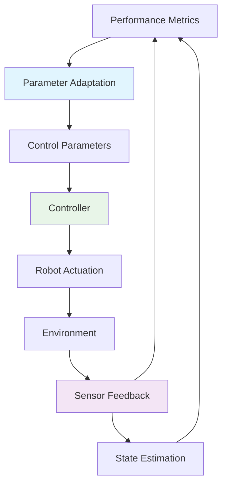
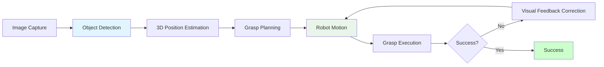

# Chapter 5: Adaptive Control and Perception Integration for Humanoid Robots

## Learning Objectives
By the end of this chapter, you will be able to:
- Implement sensor-based control adaptation for changing conditions
- Integrate vision and tactile feedback into control systems
- Design learning-based control parameter adjustment
- Create failure detection and recovery systems
- Evaluate control performance in dynamic environments

## Core Theory

### Sensor-Based Control Adaptation
Adaptive control systems respond to environmental changes:
- Visual feedback for motion correction
- Force/torque sensing for contact detection
- Inertial measurement for balance correction
- Tactile sensing for grasp adjustment

### Vision-Guided Control
Vision-based control incorporates:
- Object detection and tracking
- Depth estimation for spatial awareness
- Visual servoing for precise positioning
- Scene understanding for action planning

### Tactile Feedback Integration
Tactile sensing enhances robot control:
- Contact detection and localization
- Force control for compliant interaction
- Texture recognition for grip adjustment
- Slip detection for grasp stability

### Learning-Based Control
Machine learning improves control systems:
- Parameter optimization through experience
- Model-free adaptive control
- Reinforcement learning for complex behaviors
- Neural networks for nonlinear control

### Failure Detection and Recovery
Robust systems include:
- Anomaly detection algorithms
- Graceful degradation strategies
- Recovery behavior planning
- Safe state transitions

## Practical Examples

### Adaptive Control with Sensor Fusion
```python
import numpy as np
from collections import deque
import time

class AdaptiveController:
    def __init__(self, initial_params={'kp': 1.0, 'ki': 0.1, 'kd': 0.05}):
        self.params = initial_params
        self.param_history = deque(maxlen=100)
        self.error_history = deque(maxlen=100)
        self.performance_metrics = {
            'mse': float('inf'),
            'overshoot': 0.0,
            'settling_time': float('inf')
        }

        # Sensor fusion parameters
        self.sensor_weights = {
            'vision': 0.4,
            'force': 0.3,
            'imu': 0.3
        }

        # Adaptation parameters
        self.adaptation_rate = 0.01
        self.performance_threshold = 0.01

    def update(self, error, vision_feedback=None, force_feedback=None, imu_feedback=None):
        """
        Update adaptive controller with sensor feedback
        """
        # Store current error
        self.error_history.append(abs(error))

        # Fuse sensor information
        fused_feedback = self.fuse_sensors(vision_feedback, force_feedback, imu_feedback)

        # Adapt control parameters based on performance
        self.adapt_parameters(error, fused_feedback)

        # Calculate control output using adapted parameters
        control_output = (self.params['kp'] * error +
                         self.params['ki'] * self.integrate_errors() +
                         self.params['kd'] * self.differentiate_error(error))

        return control_output

    def fuse_sensors(self, vision, force, imu):
        """
        Fuse information from multiple sensors
        """
        fused_value = 0.0

        if vision is not None:
            fused_value += self.sensor_weights['vision'] * vision
        if force is not None:
            fused_value += self.sensor_weights['force'] * force
        if imu is not None:
            fused_value += self.sensor_weights['imu'] * imu

        return fused_value

    def adapt_parameters(self, current_error, sensor_feedback):
        """
        Adapt control parameters based on performance
        """
        # Calculate performance metric
        recent_errors = list(self.error_history)[-10:] if len(self.error_history) >= 10 else list(self.error_history)
        mse = np.mean([e**2 for e in recent_errors]) if recent_errors else float('inf')

        # Update performance metrics
        self.performance_metrics['mse'] = mse

        # Adapt parameters if performance is below threshold
        if mse > self.performance_threshold and sensor_feedback is not None:
            # Adjust parameters based on error trend and sensor feedback
            error_trend = self.calculate_error_trend()

            # Increase gain if error is growing
            if error_trend > 0.1:
                self.params['kp'] *= (1 + self.adaptation_rate)
                self.params['kd'] *= (1 + self.adaptation_rate * 0.5)
            # Decrease gain if system is oscillating
            elif error_trend < -0.1 and self.oscillation_detected():
                self.params['kp'] *= (1 - self.adaptation_rate * 0.5)
                self.params['kd'] *= (1 + self.adaptation_rate)

            # Store parameter history for analysis
            self.param_history.append(self.params.copy())

    def calculate_error_trend(self):
        """
        Calculate the trend of recent errors
        """
        if len(self.error_history) < 5:
            return 0.0

        recent_errors = list(self.error_history)[-5:]
        return (recent_errors[-1] - recent_errors[0]) / len(recent_errors)

    def oscillation_detected(self):
        """
        Detect if the system is oscillating
        """
        if len(self.error_history) < 10:
            return False

        recent_errors = list(self.error_history)[-10:]
        # Count sign changes in error
        sign_changes = 0
        prev_sign = np.sign(recent_errors[0])

        for error in recent_errors[1:]:
            current_sign = np.sign(error)
            if current_sign != prev_sign and error != 0:
                sign_changes += 1
                prev_sign = current_sign

        # If more than 60% of intervals show sign changes, consider oscillating
        return sign_changes > len(recent_errors) * 0.6

    def integrate_errors(self):
        """
        Calculate integral of errors
        """
        if not self.error_history:
            return 0.0
        return sum(self.error_history) / len(self.error_history)

    def differentiate_error(self, current_error):
        """
        Calculate derivative of error
        """
        if len(self.error_history) < 2:
            return 0.0
        return current_error - self.error_history[-2]

    def get_performance_report(self):
        """
        Get performance metrics for analysis
        """
        return self.performance_metrics
```

### Vision-Guided Grasping Controller
```python
import numpy as np
import cv2
from scipy.spatial.transform import Rotation as R

class VisionGuidedGrasper:
    def __init__(self, camera_matrix, robot_base_to_camera):
        self.camera_matrix = camera_matrix
        self.base_to_cam = robot_base_to_camera
        self.grasp_planner = GraspPosePlanner()

        # Control parameters
        self.position_tolerance = 0.01  # 1cm
        self.orientation_tolerance = 0.1  # 0.1 rad

    def plan_grasp_from_vision(self, rgb_image, depth_image, object_class='cylinder'):
        """
        Plan grasp pose based on visual input
        """
        # Detect object in RGB image
        obj_center_2d, obj_mask = self.detect_object(rgb_image, object_class)

        if obj_center_2d is None:
            return None, "Object not detected"

        # Get 3D position from depth
        obj_pos_3d = self.pixel_to_3d(obj_center_2d, depth_image)

        # Plan grasp pose
        grasp_pose = self.grasp_planner.plan_grasp(obj_pos_3d, object_class)

        return grasp_pose, "Success"

    def detect_object(self, rgb_image, obj_class):
        """
        Detect object in image (simplified implementation)
        """
        # In a real implementation, this would use deep learning models
        # For demonstration, we'll use simple color-based detection

        # Convert to HSV for color detection
        hsv = cv2.cvtColor(rgb_image, cv2.COLOR_RGB2HSV)

        if obj_class == 'cylinder':  # Assume red cylinder
            lower_red = np.array([0, 50, 50])
            upper_red = np.array([10, 255, 255])
            mask1 = cv2.inRange(hsv, lower_red, upper_red)

            lower_red = np.array([170, 50, 50])
            upper_red = np.array([180, 255, 255])
            mask2 = cv2.inRange(hsv, lower_red, upper_red)

            mask = mask1 + mask2
        else:
            # Default: detect any bright object
            gray = cv2.cvtColor(rgb_image, cv2.COLOR_RGB2GRAY)
            _, mask = cv2.threshold(gray, 200, 255, cv2.THRESH_BINARY)

        # Find contours
        contours, _ = cv2.findContours(mask, cv2.RETR_EXTERNAL, cv2.CHAIN_APPROX_SIMPLE)

        if not contours:
            return None, None

        # Get largest contour
        largest_contour = max(contours, key=cv2.contourArea)

        # Calculate centroid
        M = cv2.moments(largest_contour)
        if M["m00"] != 0:
            cx = int(M["m10"] / M["m00"])
            cy = int(M["m01"] / M["m00"])
            return (cx, cy), mask
        else:
            return None, None

    def pixel_to_3d(self, pixel_coords, depth_image):
        """
        Convert 2D pixel coordinates to 3D world coordinates
        """
        u, v = pixel_coords
        z = depth_image[v, u] / 1000.0  # Convert mm to meters

        # Camera intrinsic parameters
        fx = self.camera_matrix[0, 0]
        fy = self.camera_matrix[1, 1]
        cx = self.camera_matrix[0, 2]
        cy = self.camera_matrix[1, 2]

        # Convert to camera frame
        x_cam = (u - cx) * z / fx
        y_cam = (v - cy) * z / fy

        # Transform to robot base frame
        cam_point = np.array([x_cam, y_cam, z, 1])
        base_point = np.dot(self.base_to_cam, cam_point)

        return base_point[:3]

    def execute_grasp_with_visual_feedback(self, target_pose):
        """
        Execute grasp with continuous visual feedback
        """
        current_pose = self.get_robot_pose()

        while not self.reached_pose(current_pose, target_pose):
            # Get visual feedback
            rgb_img, depth_img = self.capture_images()
            visual_correction = self.calculate_visual_correction(current_pose, target_pose, rgb_img, depth_img)

            # Apply correction to motion
            corrected_pose = self.apply_correction(current_pose, visual_correction)

            # Move to corrected pose
            self.move_to_pose(corrected_pose)

            # Update current pose
            current_pose = self.get_robot_pose()

            # Check for grasp success
            if self.check_grasp_success():
                return True

        return False

    def calculate_visual_correction(self, current_pose, target_pose, rgb_img, depth_img):
        """
        Calculate correction based on visual feedback
        """
        # Detect target object in current view
        obj_center_2d, _ = self.detect_object(rgb_img, 'cylinder')

        if obj_center_2d is None:
            # Object not visible, use last known position
            return np.zeros(6)

        # Get current object position
        current_obj_pos = self.pixel_to_3d(obj_center_2d, depth_img)

        # Get expected object position based on target pose
        expected_obj_pos = target_pose[:3]

        # Calculate position error
        pos_error = expected_obj_pos - current_obj_pos

        # Return 6D correction (position + orientation)
        correction = np.zeros(6)
        correction[:3] = pos_error * 0.1  # Scale factor

        return correction

    def apply_correction(self, current_pose, correction):
        """
        Apply visual correction to current pose
        """
        corrected_pose = current_pose.copy()
        corrected_pose[:3] += correction[:3]

        # For orientation, use rotation vector representation
        if np.linalg.norm(correction[3:]) > 0:
            rot_vec = correction[3:]
            current_rot = R.from_matrix(current_pose[3:].reshape(3, 3))
            correction_rot = R.from_rotvec(rot_vec)
            new_rot = current_rot * correction_rot
            corrected_pose[3:] = new_rot.as_matrix().flatten()

        return corrected_pose

    def get_robot_pose(self):
        """
        Get current robot pose (placeholder implementation)
        """
        # In real implementation, this would interface with robot driver
        return np.zeros(12)  # 3D position + 9D rotation matrix

    def move_to_pose(self, pose):
        """
        Move robot to specified pose (placeholder implementation)
        """
        # In real implementation, this would send commands to robot
        pass

    def reached_pose(self, current, target):
        """
        Check if robot reached target pose
        """
        pos_diff = np.linalg.norm(current[:3] - target[:3])
        return pos_diff < self.position_tolerance

    def check_grasp_success(self):
        """
        Check if grasp was successful (placeholder)
        """
        # In real implementation, this would check force sensors, tactile sensors, etc.
        return False
```

## Diagrams

### Adaptive Control Architecture


### Vision-Guided Control Loop


## Exercises

1. Implement an adaptive controller that adjusts gains based on load changes
2. Create a vision-guided grasping system with continuous feedback
3. Design a tactile feedback controller for delicate object manipulation
4. Implement a learning-based parameter optimizer for control systems
5. Create a failure detection system that identifies when control fails

## Quiz

1. What is the purpose of sensor fusion in adaptive control?
2. How does visual servoing improve robotic manipulation?
3. What are the benefits of learning-based control adaptation?
4. How does tactile feedback enhance robot-environment interaction?
5. What methods can be used for failure detection in robotic systems?

## References

- Sastry, S. and Bodson, M. "Adaptive Control: Stability, Convergence, and Robustness" - Adaptive control theory
- Chaumette, F. and Hutchinson, S. "Visual Servo Control" - Vision-based control
- Okamura, A., Smaby, N., and Cutkosky, M. "An overview of dexterous tactile sensing" - Tactile sensing
- Piltz, R., et al. "Learning-based adaptive control" - Machine learning for control

## Summary

This chapter covered adaptive control and perception integration for humanoid robots, demonstrating how to incorporate sensor feedback into control systems. We implemented adaptive controllers that adjust parameters based on performance, and vision-guided systems that use continuous feedback for precise manipulation. These techniques enable robots to operate effectively in dynamic and uncertain environments.