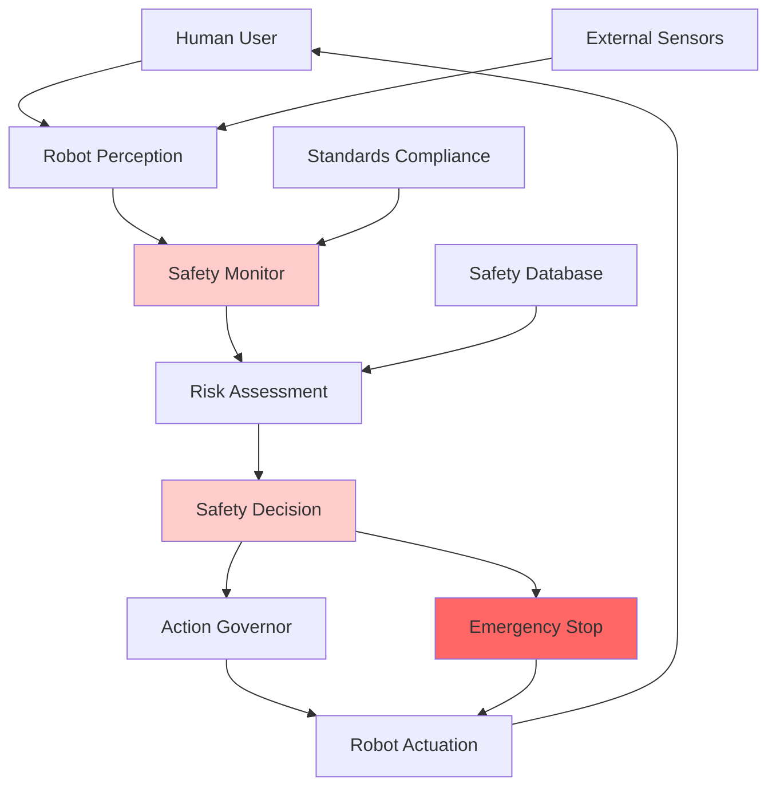
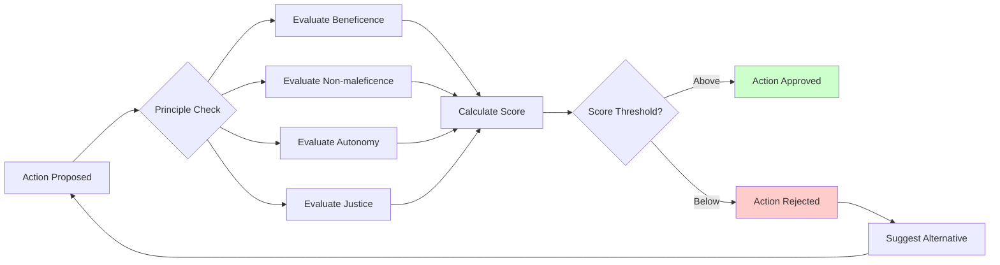
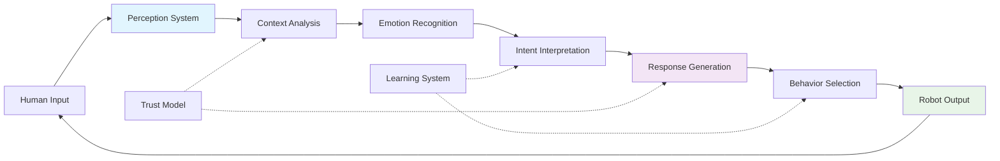

# Module 6: Safety, Ethics, and Human-Robot Interaction in Physical AI

## Learning Objectives
By the end of this module, you will be able to:
- Implement safety frameworks and protocols for physical AI systems
- Understand ethical considerations in robotics and AI development
- Design intuitive human-robot interaction interfaces
- Apply ISO/IEC standards for robot safety and security
- Evaluate social implications of humanoid robots in society

## Core Theory

### Chapter 6.1: Safety Frameworks for Physical AI Systems
Safety in physical AI encompasses multiple layers of protection:
- Functional safety standards (ISO 13482 for service robots)
- Collision avoidance and emergency stop mechanisms
- Risk assessment and hazard analysis (FMEA, HAZOP)
- Safe human-robot collaboration zones
- Fail-safe operational modes and graceful degradation

### Chapter 6.2: Ethical Considerations in Robotics
Ethical robotics addresses moral implications of AI systems:
- Asimov's laws of robotics and modern adaptations
- Bias mitigation in AI decision-making
- Transparency and explainability in robot behavior
- Privacy protection in human-robot interactions
- Responsibility and accountability frameworks

### Chapter 6.3: Human-Robot Interaction (HRI) Principles
Effective HRI design requires understanding human psychology:
- Social presence and anthropomorphism effects
- Trust building and maintenance mechanisms
- Non-verbal communication and gesture recognition
- Emotional intelligence in robots
- Cultural sensitivity in interaction design

### Chapter 6.4: Standards and Compliance for Robot Systems
International standards ensure robot safety and interoperability:
- ISO 10218-1/-2 for industrial robots
- ISO 13482 for personal/service robots
- IEEE standards for ethical AI and autonomous systems
- GDPR compliance for data protection
- Cybersecurity frameworks (NIST, ISO 27001)

### Chapter 6.5: Social Implications and Future Considerations
Humanoid robots impact society in multiple dimensions:
- Economic implications of automation
- Job displacement and creation scenarios
- Psychological effects of human-like robots
- Legal frameworks for robot rights and responsibilities
- Long-term societal adaptation to AI companions

## Practical Examples

### Safety Monitoring and Emergency Response System
```python
import rclpy
from rclpy.node import Node
from sensor_msgs.msg import LaserScan, PointCloud2
from geometry_msgs.msg import Twist
from std_msgs.msg import Bool, String
from builtin_interfaces.msg import Time
import numpy as np
from enum import Enum

class SafetyLevel(Enum):
    SAFE = 0
    WARNING = 1
    EMERGENCY_STOP = 2
    SYSTEM_FAILURE = 3

class SafetyMonitorNode(Node):
    def __init__(self):
        super().__init__('safety_monitor_node')

        # Safety parameters
        self.safety_distance = 0.5  # meters
        self.warning_distance = 1.0  # meters
        self.emergency_stop_enabled = True

        # Safety state
        self.safety_level = SafetyLevel.SAFE
        self.last_safe_time = self.get_clock().now()
        self.emergency_active = False

        # Publishers and subscribers
        self.lidar_sub = self.create_subscription(
            LaserScan, '/scan', self.lidar_callback, 10)
        self.pointcloud_sub = self.create_subscription(
            PointCloud2, '/camera/depth/points', self.pointcloud_callback, 10)
        self.cmd_vel_sub = self.create_subscription(
            Twist, '/cmd_vel', self.cmd_vel_callback, 10)
        self.emergency_stop_pub = self.create_publisher(Bool, '/emergency_stop', 10)
        self.safety_status_pub = self.create_publisher(String, '/safety_status', 10)

        # Timer for periodic safety checks
        self.safety_timer = self.create_timer(0.1, self.safety_check)

        self.get_logger().info("Safety Monitor Node initialized")

    def lidar_callback(self, msg):
        """Process laser scan data for obstacle detection"""
        if len(msg.ranges) == 0:
            return

        # Filter out invalid ranges
        valid_ranges = [r for r in msg.ranges if msg.range_min < r < msg.range_max]

        if len(valid_ranges) == 0:
            return

        # Find minimum distance
        min_distance = min(valid_ranges)

        # Update safety level based on distance
        if min_distance < self.safety_distance:
            self.safety_level = SafetyLevel.EMERGENCY_STOP
        elif min_distance < self.warning_distance:
            self.safety_level = SafetyLevel.WARNING
        else:
            self.safety_level = SafetyLevel.SAFE

    def pointcloud_callback(self, msg):
        """Process point cloud data for 3D obstacle detection"""
        # Process point cloud for close obstacles in 3D space
        # Implementation would convert PointCloud2 to numpy array
        # and perform 3D proximity checks
        pass

    def cmd_vel_callback(self, msg):
        """Monitor commanded velocities for safety"""
        linear_speed = np.sqrt(msg.linear.x**2 + msg.linear.y**2 + msg.linear.z**2)
        angular_speed = np.sqrt(msg.angular.x**2 + msg.angular.y**2 + msg.angular.z**2)

        # Check for unsafe velocity commands
        max_linear = 1.0  # m/s
        max_angular = 1.5  # rad/s

        if linear_speed > max_linear or angular_speed > max_angular:
            self.get_logger().warn("Unsafe velocity command detected")
            self.safety_level = SafetyLevel.WARNING

    def safety_check(self):
        """Periodic safety assessment"""
        current_time = self.get_clock().now()

        # Check if safety state has changed
        if self.safety_level == SafetyLevel.EMERGENCY_STOP and self.emergency_stop_enabled:
            if not self.emergency_active:
                self.trigger_emergency_stop()
        elif self.safety_level == SafetyLevel.SAFE:
            if self.emergency_active:
                self.release_emergency_stop()

        # Publish safety status
        status_msg = String()
        status_msg.data = f"{self.safety_level.name}|{current_time.sec}.{current_time.nanosec}"
        self.safety_status_pub.publish(status_msg)

    def trigger_emergency_stop(self):
        """Activate emergency stop procedures"""
        self.emergency_active = True
        emergency_msg = Bool()
        emergency_msg.data = True
        self.emergency_stop_pub.publish(emergency_msg)
        self.get_logger().error("EMERGENCY STOP ACTIVATED")

    def release_emergency_stop(self):
        """Release emergency stop when safe"""
        self.emergency_active = False
        emergency_msg = Bool()
        emergency_msg.data = False
        self.emergency_stop_pub.publish(emergency_msg)
        self.get_logger().info("Emergency stop released - system safe")
```

### Ethical Decision-Making Framework
```python
from enum import Enum
from dataclasses import dataclass
from typing import List, Dict, Any
import json

class EthicalPrinciple(Enum):
    BENEFICENCE = "Beneficence - Do good"
    NON_MALEFICENCE = "Non-maleficence - Do no harm"
    AUTONOMY = "Autonomy - Respect individual choice"
    JUSTICE = "Justice - Fair treatment"
    VERACITY = "Veracity - Truthfulness"
    CONFIDENTIALITY = "Confidentiality - Privacy protection"

@dataclass
class EthicalConsideration:
    principle: EthicalPrinciple
    impact_score: float  # -1.0 to 1.0, negative = harmful, positive = beneficial
    affected_parties: List[str]
    confidence: float  # 0.0 to 1.0

class EthicalDecisionEngine:
    def __init__(self):
        self.principles_weight = {
            EthicalPrinciple.NON_MALEFICENCE: 1.0,
            EthicalPrinciple.BENEFICENCE: 0.8,
            EthicalPrinciple.AUTONOMY: 0.7,
            EthicalPrinciple.JUSTICE: 0.6,
            EthicalPrinciple.VERACITY: 0.5,
            EthicalPrinciple.CONFIDENTIALITY: 0.5
        }

    def evaluate_action(self, action: str, context: Dict[str, Any]) -> Dict[str, Any]:
        """Evaluate an action against ethical principles"""
        considerations = self._assess_considerations(action, context)

        # Calculate overall ethical score
        total_score = 0.0
        for consideration in considerations:
            weight = self.principles_weight[consideration.principle]
            score = consideration.impact_score * weight * consideration.confidence
            total_score += score

        # Determine if action is ethically acceptable
        threshold = 0.0  # Actions with negative scores are problematic
        is_acceptable = total_score >= threshold

        return {
            "action": action,
            "ethical_score": total_score,
            "is_acceptable": is_acceptable,
            "considerations": [
                {
                    "principle": c.principle.value,
                    "impact": c.impact_score,
                    "affected": c.affected_parties,
                    "confidence": c.confidence
                } for c in considerations
            ],
            "total_considerations": len(considerations)
        }

    def _assess_considerations(self, action: str, context: Dict[str, Any]) -> List[EthicalConsideration]:
        """Assess ethical considerations for an action"""
        considerations = []

        # Example assessments based on action type
        if "assist" in action.lower() or "help" in action.lower():
            # Helping action - likely positive for beneficence
            considerations.append(EthicalConsideration(
                principle=EthicalPrinciple.BENEFICENCE,
                impact_score=0.8,
                affected_parties=["human_user"],
                confidence=0.9
            ))

            # Check if assistance respects autonomy
            if context.get("explicit_request", False):
                considerations.append(EthicalConsideration(
                    principle=EthicalPrinciple.AUTONOMY,
                    impact_score=0.7,
                    affected_parties=["human_user"],
                    confidence=0.8
                ))
            else:
                considerations.append(EthicalConsideration(
                    principle=EthicalPrinciple.AUTONOMY,
                    impact_score=-0.3,
                    affected_parties=["human_user"],
                    confidence=0.6
                ))

        elif "monitor" in action.lower() or "track" in action.lower():
            # Monitoring action - privacy concerns
            considerations.append(EthicalConsideration(
                principle=EthicalPrinciple.CONFIDENTIALITY,
                impact_score=-0.6,
                affected_parties=["observed_individuals"],
                confidence=0.8
            ))

            # Check if monitoring is consensual
            if context.get("consent_given", False):
                considerations.append(EthicalConsideration(
                    principle=EthicalPrinciple.AUTONOMY,
                    impact_score=0.4,
                    affected_parties=["observed_individuals"],
                    confidence=0.7
                ))
            else:
                considerations.append(EthicalConsideration(
                    principle=EthicalPrinciple.AUTONOMY,
                    impact_score=-0.8,
                    affected_parties=["observed_individuals"],
                    confidence=0.9
                ))

        elif "move" in action.lower() or "navigate" in action.lower():
            # Movement action - safety considerations
            considerations.append(EthicalConsideration(
                principle=EthicalPrinciple.NON_MALEFICENCE,
                impact_score=0.0 if context.get("safe_path", True) else -0.9,
                affected_parties=["surrounding_individuals"],
                confidence=0.9
            ))

        return considerations

    def explain_decision(self, evaluation_result: Dict[str, Any]) -> str:
        """Provide explanation for ethical decision"""
        action = evaluation_result["action"]
        score = evaluation_result["ethical_score"]
        is_acceptable = evaluation_result["is_acceptable"]

        explanation = f"Ethical evaluation for action '{action}':\n"
        explanation += f"Overall score: {score:.2f} ({'ACCEPTABLE' if is_acceptable else 'UNACCEPTABLE'})\n\n"

        explanation += "Detailed considerations:\n"
        for consideration in evaluation_result["considerations"]:
            impact_symbol = "+" if consideration["impact"] > 0 else "-" if consideration["impact"] < 0 else "~"
            explanation += f"  {impact_symbol} {consideration['principle']}\n"
            explanation += f"    Impact: {consideration['impact']:.2f}, "
            explanation += f"Affects: {', '.join(consideration['affected'])}\n"

        return explanation

# Example usage
def main():
    engine = EthicalDecisionEngine()

    # Example scenarios
    scenarios = [
        {
            "action": "assist elderly user with medication",
            "context": {"explicit_request": True, "urgent_need": True}
        },
        {
            "action": "monitor room occupancy",
            "context": {"consent_given": False, "purpose": "security"}
        },
        {
            "action": "navigate through crowded hallway",
            "context": {"safe_path": True, "speed_reduced": True}
        }
    ]

    for scenario in scenarios:
        evaluation = engine.evaluate_action(scenario["action"], scenario["context"])
        explanation = engine.explain_decision(evaluation)
        print(explanation)
        print("-" * 50)
```

### Human-Robot Interaction Interface
```python
import tkinter as tk
from tkinter import ttk, messagebox
import threading
import time
import json
from enum import Enum

class InteractionMode(Enum):
    INFORMATIVE = "informative"
    COLLABORATIVE = "collaborative"
    COMFORT = "comfort"
    INSTRUCTIONAL = "instructional"

class HRIInterface:
    def __init__(self):
        self.root = tk.Tk()
        self.root.title("Human-Robot Interaction Interface")
        self.root.geometry("800x600")

        # Interaction state
        self.current_mode = InteractionMode.INFORMATIVE
        self.user_emotion = "neutral"
        self.trust_level = 0.5  # 0.0 to 1.0
        self.conversation_history = []

        self.setup_ui()

    def setup_ui(self):
        """Setup the graphical user interface"""
        # Main frame
        main_frame = ttk.Frame(self.root, padding="10")
        main_frame.grid(row=0, column=0, sticky=(tk.W, tk.E, tk.N, tk.S))

        # Mode selection
        mode_frame = ttk.LabelFrame(main_frame, text="Interaction Mode", padding="5")
        mode_frame.grid(row=0, column=0, columnspan=2, sticky=(tk.W, tk.E), pady=5)

        self.mode_var = tk.StringVar(value=self.current_mode.value)
        modes = [mode.value for mode in InteractionMode]
        mode_combo = ttk.Combobox(mode_frame, textvariable=self.mode_var, values=modes, state="readonly")
        mode_combo.grid(row=0, column=0, padx=5)
        mode_combo.bind('<<ComboboxSelected>>', self.on_mode_change)

        # Emotion detection simulation
        emotion_frame = ttk.LabelFrame(main_frame, text="Emotion Detection", padding="5")
        emotion_frame.grid(row=1, column=0, sticky=(tk.W, tk.E), pady=5)

        self.emotion_var = tk.StringVar(value=self.user_emotion)
        emotions = ["happy", "sad", "angry", "surprised", "neutral", "confused"]
        emotion_combo = ttk.Combobox(emotion_frame, textvariable=self.emotion_var, values=emotions, state="readonly")
        emotion_combo.grid(row=0, column=0, padx=5)
        emotion_combo.bind('<<ComboboxSelected>>', self.on_emotion_change)

        # Trust level indicator
        trust_frame = ttk.LabelFrame(main_frame, text="Trust Level", padding="5")
        trust_frame.grid(row=1, column=1, sticky=(tk.W, tk.E), pady=5)

        self.trust_scale = ttk.Scale(trust_frame, from_=0, to=1, variable=tk.DoubleVar(value=self.trust_level))
        self.trust_scale.grid(row=0, column=0, padx=5, sticky=(tk.W, tk.E))

        # Conversation display
        conv_frame = ttk.LabelFrame(main_frame, text="Conversation", padding="5")
        conv_frame.grid(row=2, column=0, columnspan=2, sticky=(tk.W, tk.E, tk.N, tk.S), pady=5)

        # Text display for conversation
        self.conv_display = tk.Text(conv_frame, height=15, width=70)
        scrollbar = ttk.Scrollbar(conv_frame, orient="vertical", command=self.conv_display.yview)
        self.conv_display.configure(yscrollcommand=scrollbar.set)

        self.conv_display.grid(row=0, column=0, sticky=(tk.W, tk.E, tk.N, tk.S))
        scrollbar.grid(row=0, column=1, sticky=(tk.N, tk.S))

        # Input area
        input_frame = ttk.Frame(main_frame)
        input_frame.grid(row=3, column=0, columnspan=2, sticky=(tk.W, tk.E), pady=5)

        self.user_input = tk.Entry(input_frame, width=60)
        self.user_input.grid(row=0, column=0, padx=5)
        self.user_input.bind('<Return>', self.send_message)

        send_button = ttk.Button(input_frame, text="Send", command=self.send_message)
        send_button.grid(row=0, column=1, padx=5)

        # Action buttons
        action_frame = ttk.LabelFrame(main_frame, text="Robot Actions", padding="5")
        action_frame.grid(row=4, column=0, columnspan=2, sticky=(tk.W, tk.E), pady=5)

        actions = [
            ("Wave Hello", self.wave_hello),
            ("Express Empathy", self.express_empathy),
            ("Offer Help", self.offer_help),
            ("Share Information", self.share_info)
        ]

        for i, (text, command) in enumerate(actions):
            btn = ttk.Button(action_frame, text=text, command=command)
            btn.grid(row=0, column=i, padx=2, pady=2)

        # Configure grid weights
        self.root.columnconfigure(0, weight=1)
        self.root.rowconfigure(0, weight=1)
        main_frame.columnconfigure(0, weight=1)
        main_frame.rowconfigure(2, weight=1)
        conv_frame.columnconfigure(0, weight=1)
        conv_frame.rowconfigure(0, weight=1)

    def on_mode_change(self, event=None):
        """Handle interaction mode change"""
        new_mode = InteractionMode(self.mode_var.get())
        self.current_mode = new_mode
        self.add_message("System", f"Interaction mode changed to {new_mode.value}")

    def on_emotion_change(self, event=None):
        """Handle emotion detection change"""
        new_emotion = self.emotion_var.get()
        self.user_emotion = new_emotion
        self.add_message("System", f"Detected user emotion: {new_emotion}")

        # Adjust trust based on emotion
        if new_emotion in ["angry", "frustrated"]:
            self.trust_level = max(0.0, self.trust_level - 0.1)
        elif new_emotion in ["happy", "calm"]:
            self.trust_level = min(1.0, self.trust_level + 0.05)

        self.trust_scale.set(self.trust_level)

    def add_message(self, sender, message):
        """Add message to conversation display"""
        timestamp = time.strftime("%H:%M:%S")
        formatted_msg = f"[{timestamp}] {sender}: {message}\n"

        self.conv_display.insert(tk.END, formatted_msg)
        self.conv_display.see(tk.END)

        # Store in history
        self.conversation_history.append({
            "timestamp": timestamp,
            "sender": sender,
            "message": message
        })

    def send_message(self, event=None):
        """Handle user sending a message"""
        user_text = self.user_input.get().strip()
        if not user_text:
            return

        self.add_message("User", user_text)
        self.user_input.delete(0, tk.END)

        # Simulate robot response based on mode and emotion
        self.simulate_robot_response(user_text)

    def simulate_robot_response(self, user_input):
        """Simulate robot response based on current context"""
        # This would normally connect to the robot's NLP and response system
        response_thread = threading.Thread(target=self.generate_response, args=(user_input,))
        response_thread.daemon = True
        response_thread.start()

    def generate_response(self, user_input):
        """Generate appropriate response based on context"""
        time.sleep(0.5)  # Simulate processing time

        # Generate response based on interaction mode
        if self.current_mode == InteractionMode.INFORMATIVE:
            response = self.generate_informative_response(user_input)
        elif self.current_mode == InteractionMode.COLLABORATIVE:
            response = self.generate_collaborative_response(user_input)
        elif self.current_mode == InteractionMode.COMFORT:
            response = self.generate_comfort_response(user_input)
        elif self.current_mode == InteractionMode.INSTRUCTIONAL:
            response = self.generate_instructional_response(user_input)
        else:
            response = "I'm here to help. How can I assist you today?"

        # Add some personality based on user emotion
        if self.user_emotion == "sad":
            response = "I understand this might be difficult. " + response
        elif self.user_emotion == "confused":
            response = "Let me explain that more clearly. " + response
        elif self.user_emotion == "happy":
            response = "I'm glad to hear that! " + response

        # Adjust for trust level
        if self.trust_level < 0.3:
            response = "I'd like to help, but I want to make sure I understand correctly. " + response

        self.add_message("Robot", response)

    def generate_informative_response(self, user_input):
        """Generate informative response"""
        return f"I can provide information about: {user_input[:50]}... Would you like me to elaborate?"

    def generate_collaborative_response(self, user_input):
        """Generate collaborative response"""
        return f"I can work with you on: {user_input}. What specific aspect should we focus on together?"

    def generate_comfort_response(self, user_input):
        """Generate comfort-oriented response"""
        return f"I hear you saying: {user_input}. How can I support you right now?"

    def generate_instructional_response(self, user_input):
        """Generate instructional response"""
        return f"For {user_input}, I recommend the following steps: 1) Assess the situation, 2) Plan your approach, 3) Take action."

    def wave_hello(self):
        """Simulate waving gesture"""
        self.add_message("Robot", "*waves hand* Hello! Nice to meet you.")

    def express_empathy(self):
        """Express empathy based on detected emotion"""
        empathy_responses = {
            "sad": "I sense you might be feeling down. Is there anything I can do to help?",
            "angry": "You seem frustrated. Would you like to talk about what's bothering you?",
            "confused": "You appear puzzled. Let me try to clarify things for you.",
            "happy": "I'm glad you're happy! Positive emotions are wonderful to share.",
            "surprised": "Something unexpected happened? I'm here to help you process it.",
            "neutral": "I'm here for you. How are you feeling today?"
        }

        response = empathy_responses.get(self.user_emotion, "I'm here to support you.")
        self.add_message("Robot", response)

    def offer_help(self):
        """Offer help based on context"""
        help_offers = {
            InteractionMode.INFORMATIVE: "I can provide detailed information about topics you're interested in.",
            InteractionMode.COLLABORATIVE: "I can work alongside you to accomplish tasks more efficiently.",
            InteractionMode.COMFORT: "I can provide emotional support and a listening ear when needed.",
            InteractionMode.INSTRUCTIONAL: "I can guide you through complex procedures step by step."
        }

        offer = help_offers.get(self.current_mode, "I'm here to assist you in various ways.")
        self.add_message("Robot", f"{offer} Is there something specific I can help with?")

    def share_info(self):
        """Share interesting information"""
        facts = [
            "Did you know that the first humanoid robot was created in 1973 by Tomovic and Boni?",
            "Modern humanoid robots can have over 200 degrees of freedom for natural movement.",
            "Social robots have been shown to reduce loneliness in elderly care facilities.",
            "The uncanny valley effect describes the discomfort humans feel with near-human robots.",
            "Ethical guidelines for robots are being developed by organizations worldwide."
        ]

        import random
        fact = random.choice(facts)
        self.add_message("Robot", fact)

    def run(self):
        """Start the interface"""
        self.root.mainloop()

# Example usage
if __name__ == "__main__":
    interface = HRIInterface()
    interface.run()
```

## Diagrams

### Safety Architecture for Physical AI


### Ethical Decision-Making Process


### Human-Robot Interaction Loop


## Exercises

### Chapter 6.1: Safety Frameworks
1. Implement a collision avoidance system with multiple sensor fusion
2. Design a risk assessment matrix for different robot operational modes
3. Create a safety protocol for human-robot collaboration zones
4. Develop a fail-safe mechanism for critical robot functions

### Chapter 6.2: Ethical Considerations
1. Analyze a real-world robotics case study for ethical implications
2. Design an ethical decision-making system for autonomous robots
3. Create guidelines for bias detection and mitigation in AI systems
4. Develop a framework for robot transparency and explainability

### Chapter 6.3: Human-Robot Interaction
1. Design an intuitive interface for elderly users interacting with robots
2. Implement emotion recognition and response adaptation
3. Create a trust-building protocol for long-term human-robot relationships
4. Develop culturally sensitive interaction patterns for global deployment

### Chapter 6.4: Standards and Compliance
1. Research and summarize ISO 13482 safety requirements for service robots
2. Implement a compliance checking system for robot behavior
3. Design a cybersecurity framework for connected robots
4. Create documentation for regulatory approval processes

### Chapter 6.5: Social Implications
1. Conduct a survey on public perception of humanoid robots
2. Analyze economic impacts of robotics automation in different sectors
3. Research legal frameworks for robot liability and responsibility
4. Propose guidelines for ethical robot deployment in society

## Quiz

### Chapter 6.1: Safety Frameworks
1. What is the primary purpose of ISO 13482 standard for service robots?
2. Explain the difference between functional safety and operational safety.
3. What are the key components of a fail-safe system?

### Chapter 6.2: Ethical Considerations
4. How do Asimov's laws apply to modern robotics?
5. What is algorithmic bias and how can it be mitigated?
6. Why is transparency important in AI decision-making?

### Chapter 6.3: Human-Robot Interaction
7. What factors influence trust in human-robot relationships?
8. How does anthropomorphism affect human-robot interaction?
9. What are the key principles of intuitive interface design?

### Chapter 6.4: Standards and Compliance
10. What is the difference between ISO 10218 and ISO 13482?
11. Why is cybersecurity critical for connected robots?
12. How does GDPR affect robot data collection practices?

### Chapter 6.5: Social Implications
13. What are the main economic concerns about robotics automation?
14. How might humanoid robots affect social interaction patterns?
15. What legal questions arise with autonomous robot decision-making?

## References

### Safety Resources
- [ISO 13482:2014 - Safety requirements for personal care robots](https://www.iso.org/standard/45428.html)
- [ISO 10218-1/-2 - Industrial robot safety standards](https://www.iso.org/standard/63893.html)
- [IEEE 1872-2015 - Ontologies for Robotics and Automation](https://standards.ieee.org/standard/1872-2015.html)
- [Safety in Robotics - MIT OpenCourseWare](https://ocw.mit.edu/courses/electrical-engineering-and-computer-science/6-141-robotics-laboratory-projects-fall-2005/)

### Ethics Resources
- [IEEE Global Initiative on Ethics of Autonomous and Intelligent Systems](https://ethicsinaction.ieee.org/)
- [European Group on Ethics - Ethics of Robotics and AI](https://ec.europa.eu/research-and-innovation/en/tab/group-ethics)
- [ACM/IEEE Statement on Algorithmic Accountability and Transparency](https://www.acm.org/binaries/content/assets/about-acm/acm-ieee-statement.pdf)
- [Ethical Guidelines for Trustworthy AI - European Commission](https://digital-strategy.ec.europa.eu/en/library/ethics-guidelines-trustworthy-ai)

### Human-Robot Interaction Resources
- [Handbook of Robotics - Siciliano & Khatib (Chapter on HRI)](https://link.springer.com/book/10.1007/978-3-319-32552-1)
- [Affective Computing for Human-Robot Interaction - Tapus et al.](https://link.springer.com/chapter/10.1007/978-3-319-60964-5_1)
- [Social Signal Processing for HRI - Pantic et al.](https://ieeexplore.ieee.org/document/5459263)
- [Designing Socially Acceptable Robots - Scassellati et al.](https://link.springer.com/chapter/10.1007/978-3-642-15190-6_1)

### Standards and Regulations
- [NIST Cybersecurity Framework](https://www.nist.gov/cyberframework)
- [GDPR Guidelines for AI Systems](https://gdpr-info.eu/art-22-gdpr/)
- [FDA Guidance on AI/ML-Based Medical Devices](https://www.fda.gov/medical-devices/software-medical-device-samd/artificial-intelligence-and-machine-learning-software-medical-device)
- [ISO/IEC 23053 - Framework for AI Systems Using Machine Learning](https://www.iso.org/standard/78894.html)

## Summary

This module provided a comprehensive overview of safety, ethics, and human-robot interaction in Physical AI systems. We explored the critical importance of implementing robust safety frameworks to protect both humans and robots, examined ethical considerations that must guide AI development, and investigated effective approaches to human-robot interaction design.

Key concepts covered include:
- Multi-layered safety systems incorporating international standards and risk assessment
- Ethical frameworks for responsible AI development and deployment
- Human-centered design principles for intuitive and trustworthy robot interfaces
- Regulatory compliance and cybersecurity considerations
- Societal implications of widespread humanoid robot adoption

The integration of safety, ethics, and effective interaction design is essential for creating humanoid robots that can be safely and acceptably deployed in human environments. These considerations ensure that as robots become more capable and ubiquitous, they remain aligned with human values and societal norms.

### References
- [Ethics of Artificial Intelligence and Robotics - Stanford Encyclopedia](https://plato.stanford.edu/entries/ethics-ai/)
- [Human-Robot Interaction: An Introduction - Goodrich & Schultz](https://www.cambridge.org/core/books/humanrobot-interaction/9781107037487)
- [Robot Ethics 2.0 - Lin et al.](https://global.oup.com/academic/product/robot-ethics-20-9780190651379)
- [Safety of Robotic Systems - Murphy & Woods](https://ieeexplore.ieee.org/document/938895)