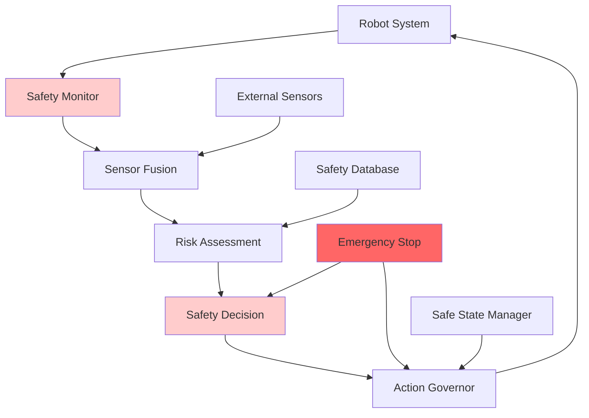
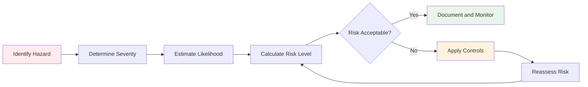

# Chapter 2.1: Safety Frameworks for Physical AI Systems

## Learning Objectives
By the end of this chapter, you will be able to:
- Implement functional safety standards for physical AI systems
- Design collision avoidance and emergency stop mechanisms
- Conduct risk assessment and hazard analysis for robot systems
- Establish safe human-robot collaboration zones
- Create fail-safe operational modes and graceful degradation strategies

## Core Theory

### Functional Safety Standards
Functional safety in robotics ensures that safety-related systems perform correctly in response to hazards. Key standards include:
- ISO 13482 for personal care robots
- ISO 10218 for industrial robots
- ISO/TS 15066 for collaborative robots
- IEC 61508 for electrical/electronic/programmable safety systems

### Collision Avoidance Systems
Critical components for preventing robot-human collisions:
- Proximity sensors (lidar, ultrasonic, infrared)
- Vision-based detection systems
- Predictive collision algorithms
- Dynamic safety zones

### Risk Assessment and Hazard Analysis
Systematic approaches to identify and mitigate risks:
- Failure Modes and Effects Analysis (FMEA)
- Hazard and Operability Study (HAZOP)
- Fault Tree Analysis (FTA)
- Preliminary Hazard Analysis (PHA)

### Human-Robot Collaboration Zones
Defined areas with different safety requirements:
- Safety-rated monitored stops
- Hand guiding operations
- Speed and separation monitoring
- Power and force limiting

### Fail-Safe Mechanisms
Systems that default to safe states upon failure:
- Emergency stop circuits
- Safe Limited Speed (SLS)
- Safe Limited Position (SLP)
- Safe Torque Off (STO)

## Practical Examples

### Safety Monitoring System Implementation
```python
import rclpy
from rclpy.node import Node
from sensor_msgs.msg import LaserScan, PointCloud2
from geometry_msgs.msg import Twist, PoseStamped
from std_msgs.msg import Bool, String
from builtin_interfaces.msg import Time
import numpy as np
from enum import Enum
from dataclasses import dataclass
from typing import List, Tuple

class SafetyLevel(Enum):
    SAFE = 0
    WARNING = 1
    EMERGENCY_STOP = 2
    SYSTEM_FAILURE = 3

@dataclass
class SafetyZone:
    """Define a safety zone with boundaries and threat levels"""
    name: str
    boundary: List[Tuple[float, float]]  # List of (x, y) coordinates
    threat_level: int  # 1-5 scale
    enabled: bool = True

class SafetyMonitorNode(Node):
    def __init__(self):
        super().__init__('safety_monitor_node')

        # Safety parameters
        self.safety_distances = {
            'close_proximity': 0.3,    # meters
            'warning_zone': 0.7,       # meters
            'safe_distance': 1.2       # meters
        }

        self.emergency_stop_enabled = True
        self.safety_level = SafetyLevel.SAFE
        self.last_safe_time = self.get_clock().now()
        self.emergency_active = False

        # Safety zones for human-robot interaction
        self.safety_zones = [
            SafetyZone(
                name="collaboration_zone",
                boundary=[(-1.0, -1.0), (1.0, -1.0), (1.0, 1.0), (-1.0, 1.0)],
                threat_level=3
            ),
            SafetyZone(
                name="caution_zone",
                boundary=[(-2.0, -2.0), (2.0, -2.0), (2.0, 2.0), (-2.0, 2.0)],
                threat_level=2
            )
        ]

        # Publishers and subscribers
        self.lidar_sub = self.create_subscription(
            LaserScan, '/scan', self.lidar_callback, 10)
        self.pointcloud_sub = self.create_subscription(
            PointCloud2, '/camera/depth/points', self.pointcloud_callback, 10)
        self.cmd_vel_sub = self.create_subscription(
            Twist, '/cmd_vel', self.cmd_vel_callback, 10)
        self.pose_sub = self.create_subscription(
            PoseStamped, '/robot_pose', self.pose_callback, 10)

        self.emergency_stop_pub = self.create_publisher(Bool, '/emergency_stop', 10)
        self.safety_status_pub = self.create_publisher(String, '/safety_status', 10)
        self.velocity_limit_pub = self.create_publisher(Twist, '/cmd_vel_limited', 10)

        # Timer for periodic safety checks
        self.safety_timer = self.create_timer(0.05, self.safety_check)  # 20 Hz

        self.get_logger().info("Safety Monitor Node initialized with safety zones")

    def lidar_callback(self, msg):
        """Process laser scan data for obstacle detection"""
        if len(msg.ranges) == 0:
            return

        # Filter out invalid ranges
        valid_ranges = [r for r in msg.ranges if msg.range_min < r < msg.range_max]

        if len(valid_ranges) == 0:
            return

        # Find minimum distance
        min_distance = min(valid_ranges)

        # Update safety level based on distance
        if min_distance < self.safety_distances['close_proximity']:
            self.safety_level = SafetyLevel.EMERGENCY_STOP
        elif min_distance < self.safety_distances['warning_zone']:
            self.safety_level = SafetyLevel.WARNING
        else:
            self.safety_level = SafetyLevel.SAFE

    def pointcloud_callback(self, msg):
        """Process point cloud data for 3D obstacle detection"""
        # In a real implementation, this would convert PointCloud2 to numpy array
        # and perform 3D proximity checks in a more sophisticated manner
        pass

    def cmd_vel_callback(self, msg):
        """Monitor commanded velocities for safety"""
        linear_speed = np.sqrt(msg.linear.x**2 + msg.linear.y**2 + msg.linear.z**2)
        angular_speed = np.sqrt(msg.angular.x**2 + msg.angular.y**2 + msg.angular.z**2)

        # Check for unsafe velocity commands
        max_linear = 1.0  # m/s
        max_angular = 1.5  # rad/s

        if linear_speed > max_linear or angular_speed > max_angular:
            self.get_logger().warn(f"Unsafe velocity command: linear={linear_speed:.2f}, angular={angular_speed:.2f}")
            self.safety_level = SafetyLevel.WARNING

    def pose_callback(self, msg):
        """Monitor robot pose for safety zone violations"""
        robot_x = msg.pose.position.x
        robot_y = msg.pose.position.y

        # Check if robot is in safety zones
        for zone in self.safety_zones:
            if zone.enabled and self.point_in_polygon(robot_x, robot_y, zone.boundary):
                if zone.threat_level >= 3:  # High threat zone
                    self.safety_level = SafetyLevel.WARNING

    def point_in_polygon(self, x, y, polygon):
        """Check if point is inside polygon using ray casting algorithm"""
        n = len(polygon)
        inside = False

        p1x, p1y = polygon[0]
        for i in range(1, n + 1):
            p2x, p2y = polygon[i % n]
            if y > min(p1y, p2y):
                if y <= max(p1y, p2y):
                    if x <= max(p1x, p2x):
                        if p1y != p2y:
                            xinters = (y - p1y) * (p2x - p1x) / (p2y - p1y) + p1x
                        if p1x == p2x or x <= xinters:
                            inside = not inside
            p1x, p1y = p2x, p2y

        return inside

    def safety_check(self):
        """Periodic safety assessment"""
        current_time = self.get_clock().now()

        # Check if safety state has changed
        if self.safety_level == SafetyLevel.EMERGENCY_STOP and self.emergency_stop_enabled:
            if not self.emergency_active:
                self.trigger_emergency_stop()
        elif self.safety_level == SafetyLevel.SAFE:
            if self.emergency_active:
                self.release_emergency_stop()

        # Publish safety status
        status_msg = String()
        status_msg.data = f"{self.safety_level.name}|{current_time.sec}.{current_time.nanosec}"
        self.safety_status_pub.publish(status_msg)

    def trigger_emergency_stop(self):
        """Activate emergency stop procedures"""
        self.emergency_active = True
        emergency_msg = Bool()
        emergency_msg.data = True
        self.emergency_stop_pub.publish(emergency_msg)
        self.get_logger().error("EMERGENCY STOP ACTIVATED")

    def release_emergency_stop(self):
        """Release emergency stop when safe"""
        self.emergency_active = False
        emergency_msg = Bool()
        emergency_msg.data = False
        self.emergency_stop_pub.publish(emergency_msg)
        self.get_logger().info("Emergency stop released - system safe")
```

### Risk Assessment Framework
```python
from enum import Enum
from dataclasses import dataclass
from typing import List, Dict, Any
import json
from datetime import datetime

class RiskSeverity(Enum):
    NEGLIGIBLE = 1
    MINOR = 2
    MODERATE = 3
    MAJOR = 4
    CATASTROPHIC = 5

class RiskLikelihood(Enum):
    REMOTE = 1
    LOW = 2
    MEDIUM = 3
    HIGH = 4
    CERTAIN = 5

class RiskLevel(Enum):
    ACCEPTABLE = "Acceptable"
    UNDESIRABLE = "Undesirable"
    INTOLERABLE = "Intolerable"

@dataclass
class Hazard:
    id: str
    description: str
    severity: RiskSeverity
    likelihood: RiskLikelihood
    risk_level: RiskLevel
    controls: List[str]
    probability: float = 0.0  # Calculated probability

class RiskAssessmentFramework:
    def __init__(self):
        self.hazards = []
        self.controls = []
        self.assessments = []

    def assess_hazard(self, description: str, severity: RiskSeverity,
                     likelihood: RiskLikelihood, existing_controls: List[str] = None) -> Hazard:
        """Assess a hazard and return a hazard object"""
        # Calculate risk level based on severity and likelihood
        risk_score = severity.value * likelihood.value

        if risk_score <= 4:
            risk_level = RiskLevel.ACCEPTABLE
        elif risk_score <= 8:
            risk_level = RiskLevel.UNDESIRABLE
        else:
            risk_level = RiskLevel.INTOLERABLE

        # Generate hazard ID
        hazard_id = f"HZ{len(self.hazards)+1:03d}"

        hazard = Hazard(
            id=hazard_id,
            description=description,
            severity=severity,
            likelihood=likelihood,
            risk_level=risk_level,
            controls=existing_controls or []
        )

        # Calculate probability based on likelihood
        hazard.probability = self._calculate_probability(likelihood)

        self.hazards.append(hazard)
        return hazard

    def _calculate_probability(self, likelihood: RiskLikelihood) -> float:
        """Map likelihood to probability value"""
        probability_map = {
            RiskLikelihood.REMOTE: 0.001,
            RiskLikelihood.LOW: 0.01,
            RiskLikelihood.MEDIUM: 0.1,
            RiskLikelihood.HIGH: 0.5,
            RiskLikelihood.CERTAIN: 0.9
        }
        return probability_map[likelihood]

    def add_control_measure(self, hazard_id: str, control_description: str,
                          effectiveness: float) -> bool:
        """Add a control measure to reduce hazard risk"""
        for hazard in self.hazards:
            if hazard.id == hazard_id:
                hazard.controls.append(control_description)

                # Update probability based on control effectiveness
                hazard.probability *= (1 - effectiveness)

                # Recalculate risk level
                risk_score = hazard.severity.value * hazard.probability
                if risk_score <= 0.04:  # Adjusted for probability
                    hazard.risk_level = RiskLevel.ACCEPTABLE
                elif risk_score <= 0.08:
                    hazard.risk_level = RiskLevel.UNDESIRABLE
                else:
                    hazard.risk_level = RiskLevel.INTOLERABLE

                return True
        return False

    def generate_fmea_analysis(self) -> Dict[str, Any]:
        """Generate FMEA (Failure Modes and Effects Analysis)"""
        fmea_results = {
            'date': datetime.now().isoformat(),
            'analysis_type': 'FMEA',
            'hazards': []
        }

        for hazard in self.hazards:
            fmea_entry = {
                'hazard_id': hazard.id,
                'description': hazard.description,
                'severity': hazard.severity.name,
                'severity_value': hazard.severity.value,
                'likelihood': hazard.likelihood.name,
                'likelihood_value': hazard.likelihood.value,
                'probability': hazard.probability,
                'risk_priority_number': hazard.severity.value * hazard.likelihood.value,
                'risk_level': hazard.risk_level.value,
                'controls': hazard.controls
            }
            fmea_results['hazards'].append(fmea_entry)

        return fmea_results

    def get_high_risk_items(self) -> List[Hazard]:
        """Get hazards with high or intolerable risk levels"""
        return [h for h in self.hazards if h.risk_level == RiskLevel.INTOLERABLE]

    def generate_safety_report(self) -> str:
        """Generate a comprehensive safety report"""
        report = f"Safety Assessment Report\n"
        report += f"Generated: {datetime.now().strftime('%Y-%m-%d %H:%M:%S')}\n\n"

        report += f"Total Hazards Identified: {len(self.hazards)}\n"
        report += f"Intolerable Risks: {len(self.get_high_risk_items())}\n\n"

        for hazard in self.hazards:
            report += f"Hazard {hazard.id}: {hazard.description}\n"
            report += f"  Severity: {hazard.severity.name} ({hazard.severity.value})\n"
            report += f"  Likelihood: {hazard.likelihood.name} ({hazard.likelihood.value})\n"
            report += f"  Probability: {hazard.probability:.4f}\n"
            report += f"  Risk Level: {hazard.risk_level.value}\n"
            report += f"  Controls: {', '.join(hazard.controls) if hazard.controls else 'None'}\n\n"

        return report
```

## Diagrams

### Safety System Architecture


### Risk Assessment Process


## Exercises

1. Implement a collision avoidance system with multiple sensor fusion
2. Design a risk assessment matrix for different robot operational modes
3. Create a safety protocol for human-robot collaboration zones
4. Develop a fail-safe mechanism for critical robot functions
5. Build a safety monitoring dashboard for operators

## Quiz

1. What is the difference between ISO 13482 and ISO 10218 safety standards?
2. How does a Safety-rated Monitored Stop work?
3. What is a Risk Priority Number (RPN) in FMEA analysis?
4. Explain the concept of "Safe State" in robot safety.
5. How does power and force limiting protect human operators?

## References

- ISO 13482:2014 - Safety requirements for personal care robots
- ISO 10218-1/-2 - Industrial robot safety standards
- ISO/TS 15066 - Collaborative robots safety guidelines
- IEC 61508 - Functional safety of electrical/electronic systems
- ANSI/RIA R15.06 - Industrial robot safety standard

## Summary

This chapter introduced comprehensive safety frameworks for physical AI systems, covering functional safety standards, collision avoidance systems, risk assessment methodologies, and fail-safe mechanisms. We implemented practical safety monitoring systems and risk assessment frameworks that can be applied to various robotic platforms. These safety measures are essential for deploying robots in environments where they interact with humans, ensuring both safety and operational effectiveness.