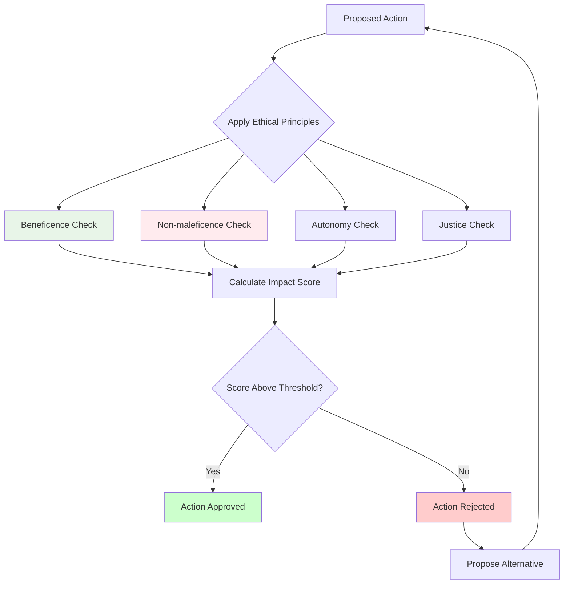
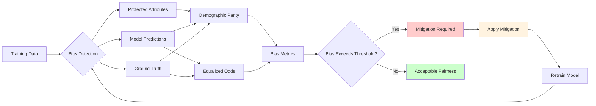

# Chapter 2.2: Ethical Considerations in Robotics and AI Development

## Learning Objectives
By the end of this chapter, you will be able to:
- Apply Asimov's laws of robotics and modern ethical frameworks to AI systems
- Implement bias detection and mitigation in AI decision-making
- Design transparent and explainable robot behavior
- Protect privacy in human-robot interactions
- Establish responsibility and accountability frameworks for autonomous systems

## Core Theory

### Asimov's Laws and Modern Adaptations
Original Three Laws of Robotics:
1. A robot may not injure a human being or, through inaction, allow a human being to come to harm
2. A robot must obey the orders given to it by human beings, except where such orders would conflict with the First Law
3. A robot must protect its own existence as long as such protection does not conflict with the First or Second Laws

Modern additions and adaptations:
- Zeroth Law: A robot may not harm humanity, or, by inaction, allow humanity to come to harm
- Expanded frameworks considering broader ethical implications

### Bias in AI Systems
Types of bias that can affect AI systems:
- Historical bias: Reflects past discrimination in training data
- Representation bias: Unequal representation of groups
- Measurement bias: Different error rates across groups
- Aggregation bias: Treating diverse populations as homogeneous

### Transparency and Explainability
Key aspects of AI transparency:
- Algorithmic transparency: Understanding how algorithms work
- Decision transparency: Understanding why decisions were made
- Data transparency: Understanding what data was used
- Process transparency: Understanding the development process

### Privacy Protection in HRI
Privacy considerations in human-robot interaction:
- Data collection and storage
- Consent mechanisms
- Data minimization principles
- Right to erasure and portability
- Secure communication protocols

### Responsibility and Accountability
Frameworks for assigning responsibility:
- Designer responsibility
- Manufacturer responsibility
- User responsibility
- System autonomy levels and corresponding responsibilities

## Practical Examples

### Ethical Decision-Making Framework
```python
from enum import Enum
from dataclasses import dataclass
from typing import List, Dict, Any, Optional
import json
from datetime import datetime

class EthicalPrinciple(Enum):
    BENEFICENCE = "Beneficence - Do good"
    NON_MALEFICENCE = "Non-maleficence - Do no harm"
    AUTONOMY = "Autonomy - Respect individual choice"
    JUSTICE = "Justice - Fair treatment"
    VERACITY = "Veracity - Truthfulness"
    CONFIDENTIALITY = "Confidentiality - Privacy protection"
    DIGNITY = "Dignity - Respect human worth"
    CONSENT = "Consent - Voluntary agreement"

@dataclass
class EthicalConsideration:
    principle: EthicalPrinciple
    impact_score: float  # -1.0 to 1.0, negative = harmful, positive = beneficial
    affected_parties: List[str]
    confidence: float  # 0.0 to 1.0
    temporal_scope: str = "immediate"  # immediate, short_term, long_term

class EthicalDecisionEngine:
    def __init__(self):
        self.principles_weight = {
            EthicalPrinciple.NON_MALEFICENCE: 1.0,
            EthicalPrinciple.BENEFICENCE: 0.9,
            EthicalPrinciple.AUTONOMY: 0.8,
            EthicalPrinciple.DIGNITY: 0.8,
            EthicalPrinciple.JUSTICE: 0.7,
            EthicalPrinciple.VERACITY: 0.6,
            EthicalPrinciple.CONFIDENTIALITY: 0.6,
            EthicalPrinciple.CONSENT: 0.5
        }

    def evaluate_action(self, action: str, context: Dict[str, Any]) -> Dict[str, Any]:
        """Evaluate an action against ethical principles"""
        considerations = self._assess_considerations(action, context)

        # Calculate overall ethical score
        total_score = 0.0
        for consideration in considerations:
            weight = self.principles_weight[consideration.principle]
            score = consideration.impact_score * weight * consideration.confidence
            total_score += score

        # Determine if action is ethically acceptable
        threshold = 0.0  # Actions with negative scores are problematic
        is_acceptable = total_score >= threshold

        return {
            "action": action,
            "context": context,
            "ethical_score": total_score,
            "is_acceptable": is_acceptable,
            "considerations": [
                {
                    "principle": c.principle.value,
                    "impact": c.impact_score,
                    "affected": c.affected_parties,
                    "confidence": c.confidence,
                    "temporal_scope": c.temporal_scope
                } for c in considerations
            ],
            "total_considerations": len(considerations),
            "timestamp": datetime.now().isoformat()
        }

    def _assess_considerations(self, action: str, context: Dict[str, Any]) -> List[EthicalConsideration]:
        """Assess ethical considerations for an action"""
        considerations = []

        # Example assessments based on action type
        if "assist" in action.lower() or "help" in action.lower():
            # Helping action - likely positive for beneficence
            considerations.append(EthicalConsideration(
                principle=EthicalPrinciple.BENEFICENCE,
                impact_score=0.8,
                affected_parties=["human_user"],
                confidence=0.9
            ))

            # Check if assistance respects autonomy
            if context.get("explicit_request", False):
                considerations.append(EthicalConsideration(
                    principle=EthicalPrinciple.AUTONOMY,
                    impact_score=0.7,
                    affected_parties=["human_user"],
                    confidence=0.8
                ))
            else:
                considerations.append(EthicalConsideration(
                    principle=EthicalPrinciple.AUTONOMY,
                    impact_score=-0.3,
                    affected_parties=["human_user"],
                    confidence=0.6
                ))

        elif "monitor" in action.lower() or "track" in action.lower():
            # Monitoring action - privacy concerns
            considerations.append(EthicalConsideration(
                principle=EthicalPrinciple.CONFIDENTIALITY,
                impact_score=-0.6,
                affected_parties=["observed_individuals"],
                confidence=0.8
            ))

            # Check if monitoring is consensual
            if context.get("consent_given", False):
                considerations.append(EthicalConsideration(
                    principle=EthicalPrinciple.CONSENT,
                    impact_score=0.5,
                    affected_parties=["observed_individuals"],
                    confidence=0.7
                ))
            else:
                considerations.append(EthicalConsideration(
                    principle=EthicalPrinciple.CONSENT,
                    impact_score=-0.8,
                    affected_parties=["observed_individuals"],
                    confidence=0.9
                ))

        elif "move" in action.lower() or "navigate" in action.lower():
            # Movement action - safety considerations
            considerations.append(EthicalConsideration(
                principle=EthicalPrinciple.NON_MALEFICENCE,
                impact_score=0.0 if context.get("safe_path", True) else -0.9,
                affected_parties=["surrounding_individuals"],
                confidence=0.9
            ))

        elif "interact" in action.lower() or "communicate" in action.lower():
            # Interaction action - dignity and respect
            considerations.append(EthicalConsideration(
                principle=EthicalPrinciple.DIGNITY,
                impact_score=0.5 if context.get("respectful_interaction", True) else -0.4,
                affected_parties=["interacting_individuals"],
                confidence=0.8
            ))

        return considerations

    def explain_decision(self, evaluation_result: Dict[str, Any]) -> str:
        """Provide explanation for ethical decision"""
        action = evaluation_result["action"]
        score = evaluation_result["ethical_score"]
        is_acceptable = evaluation_result["is_acceptable"]

        explanation = f"Ethical evaluation for action '{action}':\n"
        explanation += f"Overall score: {score:.2f} ({'ACCEPTABLE' if is_acceptable else 'UNACCEPTABLE'})\n\n"

        explanation += "Detailed considerations:\n"
        for consideration in evaluation_result["considerations"]:
            impact_symbol = "+" if consideration["impact"] > 0 else "-" if consideration["impact"] < 0 else "~"
            explanation += f"  {impact_symbol} {consideration['principle']}\n"
            explanation += f"    Impact: {consideration['impact']:.2f}, "
            explanation += f"Affects: {', '.join(consideration['affected'])}\n"
            explanation += f"    Confidence: {consideration['confidence']:.2f}\n"

        return explanation

    def audit_trail(self, evaluation_result: Dict[str, Any]) -> str:
        """Generate an audit trail for the ethical decision"""
        action = evaluation_result["action"]
        timestamp = evaluation_result["timestamp"]
        score = evaluation_result["ethical_score"]

        audit_record = {
            "action": action,
            "timestamp": timestamp,
            "ethical_score": score,
            "evaluator": "EthicalDecisionEngine",
            "version": "1.0"
        }

        return json.dumps(audit_record, indent=2)
```

### Bias Detection and Mitigation System
```python
import numpy as np
import pandas as pd
from sklearn.metrics import accuracy_score, precision_score, recall_score, f1_score
from typing import Dict, List, Any, Tuple
from dataclasses import dataclass

@dataclass
class BiasMetrics:
    demographic_parity: float
    equalized_odds: float
    predictive_parity: float
    accuracy_difference: float
    statistical_parity: float

class BiasDetectionSystem:
    def __init__(self):
        self.protected_attributes = []
        self.bias_threshold = 0.05  # 5% difference threshold

    def detect_bias(self, predictions: np.ndarray,
                   actual_labels: np.ndarray,
                   protected_groups: Dict[str, np.ndarray]) -> Dict[str, BiasMetrics]:
        """
        Detect bias across different protected groups
        """
        results = {}

        for group_name, group_mask in protected_groups.items():
            # Calculate metrics for the group
            group_predictions = predictions[group_mask]
            group_actual = actual_labels[group_mask]

            # Calculate metrics for this group
            group_accuracy = accuracy_score(group_actual, group_predictions)
            group_precision = precision_score(group_actual, group_predictions, average='weighted', zero_division=0)
            group_recall = recall_score(group_actual, group_predictions, average='weighted', zero_division=0)

            # Calculate metrics for the rest
            other_mask = ~group_mask
            other_predictions = predictions[other_mask]
            other_actual = actual_labels[other_mask]

            other_accuracy = accuracy_score(other_actual, other_predictions)
            other_precision = precision_score(other_actual, other_predictions, average='weighted', zero_division=0)
            other_recall = recall_score(other_actual, other_predictions, average='weighted', zero_division=0)

            # Calculate bias metrics
            accuracy_diff = abs(group_accuracy - other_accuracy)
            precision_diff = abs(group_precision - other_precision)
            recall_diff = abs(group_recall - other_recall)

            # Statistical parity difference
            group_positive_rate = np.mean(group_predictions)
            other_positive_rate = np.mean(other_predictions)
            statistical_parity = abs(group_positive_rate - other_positive_rate)

            # Equal opportunity difference
            group_tpr = recall_score(group_actual, group_predictions, pos_label=1, zero_division=0)
            other_tpr = recall_score(other_actual, other_predictions, pos_label=1, zero_division=0)
            equal_opportunity = abs(group_tpr - other_tpr)

            bias_metrics = BiasMetrics(
                demographic_parity=statistical_parity,
                equalized_odds=equal_opportunity,
                predictive_parity=abs(precision_diff),
                accuracy_difference=accuracy_diff,
                statistical_parity=statistical_parity
            )

            results[group_name] = bias_metrics

        return results

    def apply_preprocessing_mitigation(self, data: pd.DataFrame,
                                     protected_attribute: str,
                                     target_column: str) -> pd.DataFrame:
        """
        Apply preprocessing techniques to mitigate bias
        """
        # Implement reweighing technique
        df_mitigated = data.copy()

        # Calculate sample weights to balance groups
        group_counts = df_mitigated[protected_attribute].value_counts()
        total_samples = len(df_mitigated)

        # Calculate weights
        weights = {}
        for group, count in group_counts.items():
            weights[group] = total_samples / (len(group_counts) * count)

        # Add weights column
        df_mitigated['sample_weight'] = df_mitigated[protected_attribute].map(weights)

        return df_mitigated

    def generate_bias_report(self, bias_results: Dict[str, BiasMetrics]) -> str:
        """
        Generate a comprehensive bias report
        """
        report = "Bias Detection Report\n"
        report += "=" * 50 + "\n\n"

        for group_name, metrics in bias_results.items():
            report += f"Group: {group_name}\n"
            report += f"  Demographic Parity Difference: {metrics.demographic_parity:.4f}\n"
            report += f"  Equalized Odds Difference: {metrics.equalized_odds:.4f}\n"
            report += f"  Predictive Parity Difference: {metrics.predictive_parity:.4f}\n"
            report += f"  Accuracy Difference: {metrics.accuracy_difference:.4f}\n"
            report += f"  Statistical Parity Difference: {metrics.statistical_parity:.4f}\n"

            # Identify if bias is detected
            max_bias = max([
                metrics.demographic_parity,
                metrics.equalized_odds,
                metrics.predictive_parity,
                metrics.accuracy_difference,
                metrics.statistical_parity
            ])

            if max_bias > self.bias_threshold:
                report += f"  Status: BIAS DETECTED (threshold: {self.bias_threshold})\n"
            else:
                report += f"  Status: ACCEPTABLE\n"

            report += "\n"

        return report

class EthicalAIValidator:
    def __init__(self):
        self.bias_detector = BiasDetectionSystem()
        self.ethical_engine = EthicalDecisionEngine()

    def validate_ai_system(self, model_predictions: np.ndarray,
                          ground_truth: np.ndarray,
                          protected_groups: Dict[str, np.ndarray],
                          context: Dict[str, Any]) -> Dict[str, Any]:
        """
        Comprehensive validation of AI system for ethical compliance
        """
        # Detect bias
        bias_results = self.bias_detector.detect_bias(
            model_predictions, ground_truth, protected_groups
        )

        # Generate bias report
        bias_report = self.bias_detector.generate_bias_report(bias_results)

        # Overall validation result
        has_bias = any(
            max([
                metrics.demographic_parity,
                metrics.equalized_odds,
                metrics.predictive_parity,
                metrics.accuracy_difference,
                metrics.statistical_parity
            ]) > self.bias_detector.bias_threshold
            for metrics in bias_results.values()
        )

        validation_result = {
            "bias_detected": has_bias,
            "bias_report": bias_report,
            "bias_metrics": {
                group: {
                    "demographic_parity": metrics.demographic_parity,
                    "equalized_odds": metrics.equalized_odds,
                    "predictive_parity": metrics.predictive_parity,
                    "accuracy_difference": metrics.accuracy_difference,
                    "statistical_parity": metrics.statistical_parity
                }
                for group, metrics in bias_results.items()
            },
            "overall_compliance": not has_bias
        }

        return validation_result
```

## Diagrams

### Ethical Decision Framework


### Bias Detection Pipeline


## Exercises

1. Analyze a real-world robotics case study for ethical implications
2. Design an ethical decision-making system for autonomous robots
3. Create guidelines for bias detection and mitigation in AI systems
4. Develop a framework for robot transparency and explainability
5. Implement a consent mechanism for human-robot interactions

## Quiz

1. What are the original Three Laws of Robotics proposed by Asimov?
2. How does historical bias differ from representation bias in AI systems?
3. What is the difference between algorithmic and decision transparency?
4. Explain the concept of "privacy by design" in human-robot interaction.
5. How should responsibility be allocated in human-robot teams?

## References

- IEEE P7000 - Ethically Aligned Design for AI Systems
- European Group on Ethics - Ethics of AI and Robotics
- ACM Code of Ethics for AI Systems
- Partnership on AI - AI Safety Guidelines
- ISO/IEC TR 24028 - AI Risk Management Overview

## Summary

This chapter explored ethical considerations in robotics and AI development, covering frameworks for ethical decision-making, bias detection and mitigation, transparency requirements, privacy protection, and responsibility allocation. We implemented practical systems for ethical evaluation and bias detection that can be integrated into AI development workflows. These ethical frameworks are essential for ensuring that AI systems align with human values and societal norms.