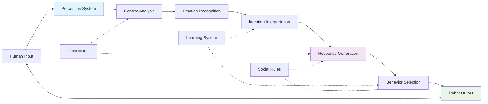
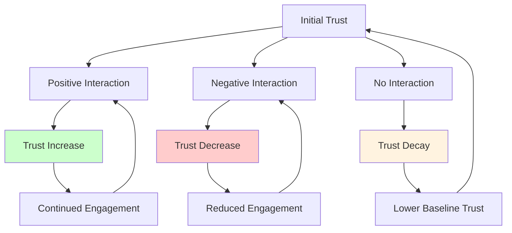

# Chapter 2.3: Human-Robot Interaction Principles

## Learning Objectives
By the end of this chapter, you will be able to:
- Design intuitive interfaces for human-robot interaction
- Implement trust-building mechanisms in robot behavior
- Recognize and respond to non-verbal communication cues
- Develop emotional intelligence capabilities in robots
- Create culturally sensitive interaction patterns

## Core Theory

### Social Presence and Anthropomorphism
Social presence refers to the extent to which a robot is perceived as a social entity:
- Appearance and behavior influence social perception
- Appropriate anthropomorphism enhances interaction
- Over-anthropomorphization can lead to the uncanny valley effect
- Matching appearance to capability prevents disappointment

### Trust Building and Maintenance
Trust in HRI involves:
- Consistency in robot behavior
- Predictability of robot actions
- Transparency in robot intentions
- Reliability in task execution
- Recovery from failures

### Non-Verbal Communication
Key elements of non-verbal HRI:
- Eye contact and gaze direction
- Body posture and gestures
- Proxemics (personal space management)
- Facial expressions and micro-expressions
- Timing and rhythm of interactions

### Emotional Intelligence in Robots
Components of robot emotional intelligence:
- Emotion recognition from multiple modalities
- Emotion expression through appropriate behaviors
- Emotion regulation in response to human emotions
- Empathetic responses to human emotional states

### Cultural Sensitivity in Interaction
Cultural considerations for global HRI:
- Gesture meaning varies across cultures
- Personal space preferences differ
- Communication styles vary (direct vs indirect)
- Power distance and authority expectations
- Time perception and punctuality norms

## Practical Examples

### Human-Robot Interaction Interface
```python
import tkinter as tk
from tkinter import ttk, messagebox
import threading
import time
import json
from enum import Enum
from dataclasses import dataclass
from typing import Dict, List, Callable

class InteractionMode(Enum):
    INFORMATIVE = "informative"
    COLLABORATIVE = "collaborative"
    COMFORT = "comfort"
    INSTRUCTIONAL = "instructional"
    SOCIAL = "social"

class EmotionState(Enum):
    HAPPY = "happy"
    SAD = "sad"
    ANGRY = "angry"
    SURPRISED = "surprised"
    NEUTRAL = "neutral"
    CONFUSED = "confused"

@dataclass
class InteractionHistory:
    timestamp: float
    user_input: str
    robot_response: str
    detected_emotion: str
    interaction_mode: str
    trust_level: float

class HRIInterface:
    def __init__(self):
        self.root = tk.Tk()
        self.root.title("Human-Robot Interaction Interface")
        self.root.geometry("900x700")

        # Interaction state
        self.current_mode = InteractionMode.INFORMATIVE
        self.user_emotion = EmotionState.NEUTRAL
        self.trust_level = 0.5  # 0.0 to 1.0
        self.conversation_history = []
        self.interaction_log = []

        # Trust dynamics
        self.trust_decay_rate = 0.001
        self.trust_gain_factor = 0.05
        self.trust_loss_factor = 0.1

        self.setup_ui()

    def setup_ui(self):
        """Setup the graphical user interface"""
        # Main frame
        main_frame = ttk.Frame(self.root, padding="10")
        main_frame.grid(row=0, column=0, sticky=(tk.W, tk.E, tk.N, tk.S))

        # Mode selection
        mode_frame = ttk.LabelFrame(main_frame, text="Interaction Mode", padding="5")
        mode_frame.grid(row=0, column=0, columnspan=2, sticky=(tk.W, tk.E), pady=5)

        self.mode_var = tk.StringVar(value=self.current_mode.value)
        modes = [mode.value for mode in InteractionMode]
        mode_combo = ttk.Combobox(mode_frame, textvariable=self.mode_var, values=modes, state="readonly")
        mode_combo.grid(row=0, column=0, padx=5)
        mode_combo.bind('<<ComboboxSelected>>', self.on_mode_change)

        # Emotion detection simulation
        emotion_frame = ttk.LabelFrame(main_frame, text="Emotion Detection", padding="5")
        emotion_frame.grid(row=1, column=0, sticky=(tk.W, tk.E), pady=5)

        self.emotion_var = tk.StringVar(value=self.user_emotion.value)
        emotions = [e.value for e in EmotionState]
        emotion_combo = ttk.Combobox(emotion_frame, textvariable=self.emotion_var, values=emotions, state="readonly")
        emotion_combo.grid(row=0, column=0, padx=5)
        emotion_combo.bind('<<ComboboxSelected>>', self.on_emotion_change)

        # Trust level indicator
        trust_frame = ttk.LabelFrame(main_frame, text="Trust Level", padding="5")
        trust_frame.grid(row=1, column=1, sticky=(tk.W, tk.E), pady=5)

        self.trust_scale = ttk.Scale(trust_frame, from_=0, to=1, value=self.trust_level)
        self.trust_scale.grid(row=0, column=0, padx=5, sticky=(tk.W, tk.E))

        # Conversation display
        conv_frame = ttk.LabelFrame(main_frame, text="Conversation", padding="5")
        conv_frame.grid(row=2, column=0, columnspan=2, sticky=(tk.W, tk.E, tk.N, tk.S), pady=5)

        # Text display for conversation
        self.conv_display = tk.Text(conv_frame, height=15, width=80)
        scrollbar = ttk.Scrollbar(conv_frame, orient="vertical", command=self.conv_display.yview)
        self.conv_display.configure(yscrollcommand=scrollbar.set)

        self.conv_display.grid(row=0, column=0, sticky=(tk.W, tk.E, tk.N, tk.S))
        scrollbar.grid(row=0, column=1, sticky=(tk.N, tk.S))

        # Input area
        input_frame = ttk.Frame(main_frame)
        input_frame.grid(row=3, column=0, columnspan=2, sticky=(tk.W, tk.E), pady=5)

        self.user_input = tk.Entry(input_frame, width=70)
        self.user_input.grid(row=0, column=0, padx=5)
        self.user_input.bind('<Return>', self.send_message)

        send_button = ttk.Button(input_frame, text="Send", command=self.send_message)
        send_button.grid(row=0, column=1, padx=5)

        # Action buttons
        action_frame = ttk.LabelFrame(main_frame, text="Robot Actions", padding="5")
        action_frame.grid(row=4, column=0, columnspan=2, sticky=(tk.W, tk.E), pady=5)

        actions = [
            ("Wave Hello", self.wave_hello),
            ("Express Empathy", self.express_empathy),
            ("Offer Help", self.offer_help),
            ("Share Information", self.share_info),
            ("Ask for Clarification", self.ask_clarification)
        ]

        for i, (text, command) in enumerate(actions):
            btn = ttk.Button(action_frame, text=text, command=command)
            btn.grid(row=0, column=i, padx=2, pady=2)

        # Trust decay simulation
        self.root.after(1000, self.simulate_trust_decay)

        # Configure grid weights
        self.root.columnconfigure(0, weight=1)
        self.root.rowconfigure(0, weight=1)
        main_frame.columnconfigure(0, weight=1)
        main_frame.rowconfigure(2, weight=1)
        conv_frame.columnconfigure(0, weight=1)
        conv_frame.rowconfigure(0, weight=1)

    def on_mode_change(self, event=None):
        """Handle interaction mode change"""
        new_mode = InteractionMode(self.mode_var.get())
        self.current_mode = new_mode
        self.add_message("System", f"Interaction mode changed to {new_mode.value}")

    def on_emotion_change(self, event=None):
        """Handle emotion detection change"""
        new_emotion = EmotionState(self.emotion_var.get())
        self.user_emotion = new_emotion
        self.add_message("System", f"Detected user emotion: {new_emotion.value}")

        # Adjust trust based on emotion
        if new_emotion in [EmotionState.ANGRY, EmotionState.FRUSTATED]:
            self.update_trust(-0.1)
        elif new_emotion in [EmotionState.HAPPY, EmotionState.CALM]:
            self.update_trust(0.05)
        elif new_emotion == EmotionState.CONFUSED:
            self.update_trust(-0.05)

    def update_trust(self, change):
        """Update trust level with bounds checking"""
        self.trust_level = max(0.0, min(1.0, self.trust_level + change))
        self.trust_scale.set(self.trust_level)

    def add_message(self, sender, message):
        """Add message to conversation display"""
        timestamp = time.strftime("%H:%M:%S")
        formatted_msg = f"[{timestamp}] {sender}: {message}\n"

        self.conv_display.insert(tk.END, formatted_msg)
        self.conv_display.see(tk.END)

        # Store in history
        history_entry = InteractionHistory(
            timestamp=time.time(),
            user_input=message if sender == "User" else "",
            robot_response=message if sender == "Robot" else "",
            detected_emotion=self.user_emotion.value,
            interaction_mode=self.current_mode.value,
            trust_level=self.trust_level
        )
        self.conversation_history.append(history_entry)

    def send_message(self, event=None):
        """Handle user sending a message"""
        user_text = self.user_input.get().strip()
        if not user_text:
            return

        self.add_message("User", user_text)
        self.user_input.delete(0, tk.END)

        # Log interaction
        self.log_interaction("user_input", user_text)

        # Simulate robot response based on mode and emotion
        self.simulate_robot_response(user_text)

    def simulate_robot_response(self, user_input):
        """Simulate robot response based on current context"""
        # This would normally connect to the robot's NLP and response system
        response_thread = threading.Thread(target=self.generate_response, args=(user_input,))
        response_thread.daemon = True
        response_thread.start()

    def generate_response(self, user_input):
        """Generate appropriate response based on context"""
        time.sleep(0.5)  # Simulate processing time

        # Generate response based on interaction mode
        if self.current_mode == InteractionMode.INFORMATIVE:
            response = self.generate_informative_response(user_input)
        elif self.current_mode == InteractionMode.COLLABORATIVE:
            response = self.generate_collaborative_response(user_input)
        elif self.current_mode == InteractionMode.COMFORT:
            response = self.generate_comfort_response(user_input)
        elif self.current_mode == InteractionMode.INSTRUCTIONAL:
            response = self.generate_instructional_response(user_input)
        elif self.current_mode == InteractionMode.SOCIAL:
            response = self.generate_social_response(user_input)
        else:
            response = "I'm here to help. How can I assist you today?"

        # Add some personality based on user emotion
        if self.user_emotion == EmotionState.SAD:
            response = "I understand this might be difficult. " + response
        elif self.user_emotion == EmotionState.CONFUSED:
            response = "Let me explain that more clearly. " + response
        elif self.user_emotion == EmotionState.HAPPY:
            response = "I'm glad to hear that! " + response

        # Adjust for trust level
        if self.trust_level < 0.3:
            response = "I'd like to help, but I want to make sure I understand correctly. " + response

        self.add_message("Robot", response)
        self.log_interaction("robot_response", response)

        # Update trust based on successful interaction
        if self.trust_level < 0.8:  # Only increase trust up to a point
            self.update_trust(0.02)

    def generate_informative_response(self, user_input):
        """Generate informative response"""
        return f"I can provide information about: {user_input[:50]}... Would you like me to elaborate?"

    def generate_collaborative_response(self, user_input):
        """Generate collaborative response"""
        return f"I can work with you on: {user_input}. What specific aspect should we focus on together?"

    def generate_comfort_response(self, user_input):
        """Generate comfort-oriented response"""
        return f"I hear you saying: {user_input}. How can I support you right now?"

    def generate_instructional_response(self, user_input):
        """Generate instructional response"""
        return f"For {user_input}, I recommend the following steps: 1) Assess the situation, 2) Plan your approach, 3) Take action."

    def generate_social_response(self, user_input):
        """Generate social response"""
        return f"That's interesting! Tell me more about {user_input.split()[0] if user_input.split() else 'your interests'}."

    def wave_hello(self):
        """Simulate waving gesture"""
        self.add_message("Robot", "*waves hand* Hello! Nice to meet you.")
        self.update_trust(0.05)

    def express_empathy(self):
        """Express empathy based on detected emotion"""
        empathy_responses = {
            EmotionState.SAD: "I sense you might be feeling down. Is there anything I can do to help?",
            EmotionState.ANGRY: "You seem frustrated. Would you like to talk about what's bothering you?",
            EmotionState.CONFUSED: "You appear puzzled. Let me try to clarify things for you.",
            EmotionState.HAPPY: "I'm glad you're happy! Positive emotions are wonderful to share.",
            EmotionState.SURPRISED: "Something unexpected happened? I'm here to help you process it.",
            EmotionState.NEUTRAL: "I'm here for you. How are you feeling today?"
        }

        response = empathy_responses.get(self.user_emotion, "I'm here to support you.")
        self.add_message("Robot", response)
        self.update_trust(0.03)

    def offer_help(self):
        """Offer help based on context"""
        help_offers = {
            InteractionMode.INFORMATIVE: "I can provide detailed information about topics you're interested in.",
            InteractionMode.COLLABORATIVE: "I can work alongside you to accomplish tasks more efficiently.",
            InteractionMode.COMFORT: "I can provide emotional support and a listening ear when needed.",
            InteractionMode.INSTRUCTIONAL: "I can guide you through complex procedures step by step.",
            InteractionMode.SOCIAL: "I can engage in meaningful conversations and provide companionship."
        }

        offer = help_offers.get(self.current_mode, "I'm here to assist you in various ways.")
        self.add_message("Robot", f"{offer} Is there something specific I can help with?")
        self.update_trust(0.02)

    def share_info(self):
        """Share interesting information"""
        facts = [
            "Did you know that the first humanoid robot was created in 1973 by Tomovic and Boni?",
            "Modern humanoid robots can have over 200 degrees of freedom for natural movement.",
            "Social robots have been shown to reduce loneliness in elderly care facilities.",
            "The uncanny valley effect describes the discomfort humans feel with near-human robots.",
            "Ethical guidelines for robots are being developed by organizations worldwide."
        ]

        import random
        fact = random.choice(facts)
        self.add_message("Robot", fact)

    def ask_clarification(self):
        """Ask for clarification to improve understanding"""
        self.add_message("Robot", "To better assist you, could you clarify what you mean by that?")
        self.update_trust(0.01)

    def simulate_trust_decay(self):
        """Simulate natural trust decay when no interaction occurs"""
        if len(self.conversation_history) > 0:
            time_since_last_interaction = time.time() - self.conversation_history[-1].timestamp
            if time_since_last_interaction > 10:  # 10 seconds without interaction
                self.update_trust(-self.trust_decay_rate * time_since_last_interaction)

        # Schedule next check
        self.root.after(1000, self.simulate_trust_decay)

    def log_interaction(self, interaction_type, content):
        """Log interaction for analysis"""
        log_entry = {
            "timestamp": time.time(),
            "type": interaction_type,
            "content": content,
            "emotion": self.user_emotion.value,
            "mode": self.current_mode.value,
            "trust_level": self.trust_level
        }
        self.interaction_log.append(log_entry)

    def run(self):
        """Start the interface"""
        self.root.mainloop()
```

### Emotion Recognition and Response System
```python
import numpy as np
import cv2
from sklearn.svm import SVC
from sklearn.preprocessing import StandardScaler
from typing import Tuple, Dict, Any
import time

class EmotionRecognitionSystem:
    def __init__(self):
        self.face_cascade = cv2.CascadeClassifier(cv2.data.haarcascades + 'haarcascade_frontalface_default.xml')

        # Pre-trained emotion classifier (in a real system, this would be loaded from a model file)
        self.emotion_classifier = self._initialize_classifier()

        # Emotion mapping
        self.emotion_labels = ['angry', 'disgust', 'fear', 'happy', 'neutral', 'sad', 'surprise']

        # Feature extraction parameters
        self.image_size = (48, 48)

        # Confidence thresholds
        self.confidence_threshold = 0.6

    def _initialize_classifier(self):
        """Initialize a basic SVM classifier (placeholder - would be pre-trained in real system)"""
        # In a real implementation, this would load a pre-trained model
        # For demo purposes, we'll return a basic SVM
        return SVC(probability=True, random_state=42)

    def detect_faces(self, image):
        """Detect faces in the image"""
        gray = cv2.cvtColor(image, cv2.COLOR_BGR2GRAY)
        faces = self.face_cascade.detectMultiScale(gray, 1.1, 4)
        return faces, gray

    def extract_features(self, face_roi):
        """Extract features from face region of interest"""
        # Resize to standard size
        resized_face = cv2.resize(face_roi, self.image_size)

        # Convert to grayscale if needed
        if len(resized_face.shape) == 3:
            gray_face = cv2.cvtColor(resized_face, cv2.COLOR_BGR2GRAY)
        else:
            gray_face = resized_face

        # Normalize pixel values
        normalized_face = gray_face.astype(np.float32) / 255.0

        # Flatten features
        features = normalized_face.flatten()

        return features.reshape(1, -1)

    def predict_emotion(self, face_image):
        """Predict emotion from face image"""
        # In a real system, this would use a trained model
        # For this example, we'll simulate predictions based on image characteristics

        # Extract features
        features = self.extract_features(face_image)

        # Simulated emotion prediction based on image features
        # This is a simplified approach - real systems would use deep learning models
        mean_intensity = np.mean(face_image)
        std_intensity = np.std(face_image)

        # Simple heuristic-based emotion prediction
        if mean_intensity > 150 and std_intensity > 50:
            # Bright and varied intensity - likely happy/surprised
            emotion_probs = [0.1, 0.1, 0.1, 0.4, 0.1, 0.1, 0.1]  # Happy
        elif mean_intensity < 100:
            # Dark image - possibly sad/angry
            emotion_probs = [0.3, 0.1, 0.1, 0.1, 0.1, 0.3, 0.1]  # Sad
        else:
            # Neutral conditions
            emotion_probs = [0.1, 0.1, 0.1, 0.1, 0.4, 0.1, 0.1]  # Neutral

        predicted_emotion_idx = np.argmax(emotion_probs)
        confidence = emotion_probs[predicted_emotion_idx]

        if confidence > self.confidence_threshold:
            return self.emotion_labels[predicted_emotion_idx], confidence
        else:
            return "neutral", confidence

    def process_video_frame(self, frame):
        """Process a video frame for emotion recognition"""
        faces, gray = self.detect_faces(frame)

        results = []
        for (x, y, w, h) in faces:
            face_roi = gray[y:y+h, x:x+w]

            emotion, confidence = self.predict_emotion(face_roi)

            result = {
                'bbox': (x, y, w, h),
                'emotion': emotion,
                'confidence': confidence,
                'timestamp': time.time()
            }
            results.append(result)

            # Draw bounding box and emotion label
            cv2.rectangle(frame, (x, y), (x+w, y+h), (255, 0, 0), 2)
            label = f"{emotion} ({confidence:.2f})"
            cv2.putText(frame, label, (x, y-10), cv2.FONT_HERSHEY_SIMPLEX, 0.9, (255, 0, 0), 2)

        return frame, results

class EmotionResponsiveBehavior:
    def __init__(self):
        self.emotion_recognition = EmotionRecognitionSystem()
        self.behavior_mapping = {
            'happy': ['celebrate', 'engage_more', 'share_positive'],
            'sad': ['comfort', 'be_gentle', 'listen'],
            'angry': ['stay_calm', 'give_space', 'acknowledge'],
            'fear': ['reassure', 'explain', 'be_patient'],
            'surprise': ['acknowledge', 'clarify', 'engage'],
            'neutral': ['maintain', 'ask_questions', 'provide_info'],
            'disgust': ['change_topic', 'be_respectful', 'apologize_if_needed']
        }

    def select_behavior(self, detected_emotion: str) -> Dict[str, Any]:
        """Select appropriate robot behavior based on detected emotion"""
        if detected_emotion not in self.behavior_mapping:
            detected_emotion = 'neutral'  # Default to neutral

        suggested_behaviors = self.behavior_mapping[detected_emotion]

        # Create behavior plan based on emotion
        behavior_plan = {
            'emotion': detected_emotion,
            'behaviors': suggested_behaviors,
            'priority': self._calculate_priority(detected_emotion),
            'recommended_actions': self._get_recommended_actions(detected_emotion),
            'interaction_style': self._get_interaction_style(detected_emotion)
        }

        return behavior_plan

    def _calculate_priority(self, emotion: str) -> int:
        """Calculate priority level for emotion response"""
        priority_map = {
            'angry': 3,
            'fear': 3,
            'sad': 2,
            'surprise': 2,
            'happy': 1,
            'neutral': 1,
            'disgust': 3
        }
        return priority_map.get(emotion, 1)

    def _get_recommended_actions(self, emotion: str) -> List[str]:
        """Get recommended actions for specific emotion"""
        action_map = {
            'happy': [
                'express joy',
                'ask about positive experience',
                'share in happiness',
                'maintain positive engagement'
            ],
            'sad': [
                'offer comfort',
                'listen actively',
                'avoid pushing for interaction',
                'provide supportive presence'
            ],
            'angry': [
                'remain calm',
                'avoid confrontation',
                'acknowledge feelings',
                'suggest cooling down period'
            ],
            'fear': [
                'reassure safety',
                'explain surroundings',
                'move slowly',
                'provide security'
            ],
            'surprise': [
                'acknowledge surprise',
                'provide explanation',
                'allow processing time',
                'maintain predictable behavior'
            ],
            'neutral': [
                'continue normal interaction',
                'ask engaging questions',
                'provide relevant information',
                'observe for changes'
            ],
            'disgust': [
                'stop current activity',
                'apologize if appropriate',
                'change subject or activity',
                'respect boundaries'
            ]
        }
        return action_map.get(emotion, action_map['neutral'])

    def _get_interaction_style(self, emotion: str) -> str:
        """Get appropriate interaction style for emotion"""
        style_map = {
            'happy': 'warm_and_engaging',
            'sad': 'gentle_and_supportive',
            'angry': 'calm_and_non_confrontational',
            'fear': 'reassuring_and_predictable',
            'surprise': 'acknowledging_and_explanatory',
            'neutral': 'normal_and_balanced',
            'disgust': 'respectful_and_accommodating'
        }
        return style_map.get(emotion, 'normal_and_balanced')
```

## Diagrams

### Human-Robot Interaction Loop


### Trust Dynamics in HRI


## Exercises

1. Design an intuitive interface for elderly users interacting with robots
2. Implement emotion recognition and response adaptation
3. Create a trust-building protocol for long-term human-robot relationships
4. Develop culturally sensitive interaction patterns for global deployment
5. Implement a multimodal emotion recognition system

## Quiz

1. What factors influence trust in human-robot relationships?
2. How does anthropomorphism affect human-robot interaction?
3. What are the key principles of intuitive interface design?
4. How can robots recognize and respond to non-verbal cues?
5. What cultural differences should be considered in global HRI?

## References

- Breazeal, C. "Designing Sociable Robots" - Social robotics principles
- Dautenhahn, K. "Socially Intelligent Robots" - HRI research
- Fong, T., Nourbakhsh, I., and Dautenhahn, K. "A Survey of Socially Interactive Robots" - HRI survey
- Kidd, C. and Breazeal, C. "Robots at Home: Understanding Long-Term Human-Robot Interaction" - Long-term HRI
- ISO 13482 - Safety requirements for personal care robots with HRI aspects

## Summary

This chapter covered the fundamental principles of human-robot interaction, focusing on designing intuitive interfaces, building trust, recognizing non-verbal communication, implementing emotional intelligence, and considering cultural sensitivity. We developed practical systems for emotion recognition and responsive behavior that can enhance the quality of human-robot interactions. These principles are essential for creating robots that can effectively collaborate with humans in various contexts.