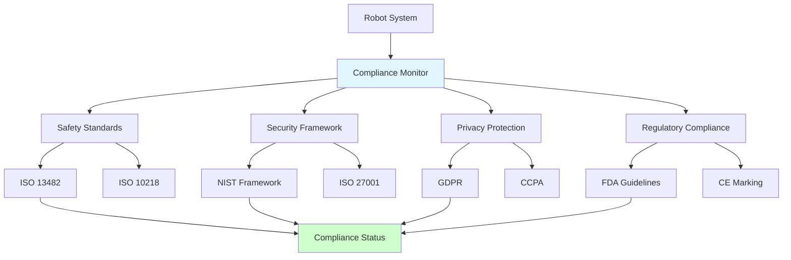
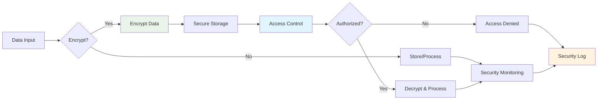

# Chapter 2.4: Standards and Compliance for Robot Systems

## Learning Objectives
By the end of this chapter, you will be able to:
- Apply ISO/IEC standards for robot safety and security
- Implement cybersecurity frameworks for connected robots
- Ensure GDPR compliance for data protection in robotics
- Design regulatory compliance systems for robot deployment
- Evaluate international standards for robot ethics and accountability

## Core Theory

### International Safety Standards
Key international standards for robot safety:
- ISO 10218-1/-2: Industrial robot safety requirements
- ISO 13482: Safety requirements for personal care robots
- ISO/TS 15066: Collaborative robot safety guidelines
- ISO 12100: Safety of machinery - General principles
- IEC 61508: Functional safety of electrical/electronic systems

### Cybersecurity Frameworks
Essential cybersecurity considerations for robots:
- NIST Cybersecurity Framework
- ISO 27001 Information Security Management
- IEC 62443 for industrial automation security
- OWASP Top 10 for robotics applications
- Secure communication protocols (TLS, VPN)

### Data Protection and Privacy
Privacy compliance requirements:
- GDPR (General Data Protection Regulation) for EU operations
- CCPA (California Consumer Privacy Act) for California operations
- HIPAA compliance for healthcare robotics
- Data minimization principles
- Right to erasure and portability

### Regulatory Compliance
Regulatory frameworks for robot deployment:
- FDA guidelines for medical robots
- FAA regulations for aerial robots
- CE marking for European market access
- FCC compliance for wireless communications
- UL safety certifications

### Ethics and Accountability Standards
Ethical frameworks for robot systems:
- IEEE P7000 series on ethical considerations
- Partnership on AI guidelines
- EU Ethics Guidelines for Trustworthy AI
- ISO/IEC TR 24028 on AI risk management
- Transparency and explainability standards

## Practical Examples

### Compliance Monitoring System
```python
import json
import hashlib
from datetime import datetime, timedelta
from typing import Dict, List, Any, Optional
from dataclasses import dataclass
from enum import Enum

class ComplianceStandard(Enum):
    ISO_10218 = "ISO 10218-1/-2: Industrial robot safety"
    ISO_13482 = "ISO 13482: Personal care robot safety"
    ISO_15066 = "ISO/TS 15066: Collaborative robot safety"
    ISO_27001 = "ISO 27001: Information security management"
    GDPR = "GDPR: General Data Protection Regulation"
    NIST = "NIST Cybersecurity Framework"
    IEEE_7000 = "IEEE P7000: Ethical considerations"

@dataclass
class ComplianceCheck:
    standard: ComplianceStandard
    requirement: str
    implementation_status: str  # implemented, in_progress, not_implemented
    evidence: str
    last_checked: datetime
    next_check: datetime

class ComplianceMonitor:
    def __init__(self):
        self.compliance_checks = []
        self.non_compliance_issues = []
        self.audit_logs = []

    def add_compliance_check(self, standard: ComplianceStandard, requirement: str,
                           implementation_status: str, evidence: str) -> ComplianceCheck:
        """Add a compliance check item"""
        check = ComplianceCheck(
            standard=standard,
            requirement=requirement,
            implementation_status=implementation_status,
            evidence=evidence,
            last_checked=datetime.now(),
            next_check=datetime.now() + timedelta(days=30)  # Check monthly
        )
        self.compliance_checks.append(check)
        return check

    def check_compliance_status(self) -> Dict[str, Any]:
        """Generate overall compliance status report"""
        total_checks = len(self.compliance_checks)
        implemented = sum(1 for check in self.compliance_checks
                         if check.implementation_status == "implemented")
        in_progress = sum(1 for check in self.compliance_checks
                         if check.implementation_status == "in_progress")
        not_implemented = sum(1 for check in self.compliance_checks
                             if check.implementation_status == "not_implemented")

        compliance_percentage = (implemented / total_checks * 100) if total_checks > 0 else 0

        report = {
            "timestamp": datetime.now().isoformat(),
            "total_checks": total_checks,
            "implemented": implemented,
            "in_progress": in_progress,
            "not_implemented": not_implemented,
            "compliance_percentage": round(compliance_percentage, 2),
            "status": "compliant" if compliance_percentage >= 90 else "non_compliant" if compliance_percentage < 70 else "partially_compliant"
        }

        return report

    def identify_non_compliance(self) -> List[ComplianceCheck]:
        """Identify non-compliant items"""
        non_compliant = [check for check in self.compliance_checks
                        if check.implementation_status != "implemented"]
        self.non_compliance_issues = non_compliant
        return non_compliant

    def generate_compliance_report(self) -> str:
        """Generate a detailed compliance report"""
        report = "Robot System Compliance Report\n"
        report += "=" * 50 + "\n"
        report += f"Generated: {datetime.now().strftime('%Y-%m-%d %H:%M:%S')}\n\n"

        # Overall status
        status = self.check_compliance_status()
        report += f"Overall Compliance Status: {status['status']}\n"
        report += f"Compliance Percentage: {status['compliance_percentage']}%\n\n"

        # Breakdown by standard
        report += "Compliance by Standard:\n"
        standards = set(check.standard for check in self.compliance_checks)
        for standard in standards:
            standard_checks = [c for c in self.compliance_checks if c.standard == standard]
            total = len(standard_checks)
            implemented = sum(1 for c in standard_checks if c.implementation_status == "implemented")
            compliance = (implemented / total * 100) if total > 0 else 0
            report += f"  {standard.value}: {compliance:.1f}% compliant ({implemented}/{total})\n"

        report += f"\nNon-Compliant Items: {len(self.non_compliance_issues)}\n"
        for i, issue in enumerate(self.non_compliance_issues, 1):
            report += f"  {i}. {issue.requirement}\n"
            report += f"     Standard: {issue.standard.value}\n"
            report += f"     Status: {issue.implementation_status}\n"
            report += f"     Evidence: {issue.evidence}\n\n"

        return report

    def audit_trail(self, action: str, details: str) -> None:
        """Log compliance-related actions"""
        audit_entry = {
            "timestamp": datetime.now().isoformat(),
            "action": action,
            "details": details,
            "actor": "ComplianceSystem"
        }
        self.audit_logs.append(audit_entry)

    def get_audit_log(self) -> List[Dict[str, Any]]:
        """Retrieve audit log"""
        return self.audit_logs
```

### Cybersecurity Framework Implementation
```python
import hashlib
import hmac
import secrets
from cryptography.fernet import Fernet
from cryptography.hazmat.primitives import hashes
from cryptography.hazmat.primitives.kdf.pbkdf2 import PBKDF2HMAC
import json
import base64
from typing import Dict, List, Any, Optional

class RobotCybersecurityFramework:
    def __init__(self):
        self.encryption_keys = {}
        self.access_control_list = {}
        self.security_policies = {}
        self.vulnerability_database = []
        self.security_logs = []

    def generate_encryption_key(self, purpose: str) -> str:
        """Generate a new encryption key for a specific purpose"""
        key = Fernet.generate_key()
        self.encryption_keys[purpose] = key
        return key.decode()

    def encrypt_data(self, data: str, purpose: str = "default") -> str:
        """Encrypt data using the specified key"""
        if purpose not in self.encryption_keys:
            self.generate_encryption_key(purpose)

        f = Fernet(self.encryption_keys[purpose])
        encrypted_data = f.encrypt(data.encode())
        return encrypted_data.decode()

    def decrypt_data(self, encrypted_data: str, purpose: str = "default") -> str:
        """Decrypt data using the specified key"""
        if purpose not in self.encryption_keys:
            raise ValueError(f"No encryption key found for purpose: {purpose}")

        f = Fernet(self.encryption_keys[purpose])
        decrypted_data = f.decrypt(encrypted_data.encode())
        return decrypted_data.decode()

    def hash_password(self, password: str) -> str:
        """Hash a password using salt and PBKDF2"""
        salt = secrets.token_bytes(16)
        kdf = PBKDF2HMAC(
            algorithm=hashes.SHA256(),
            length=32,
            salt=salt,
            iterations=100000,
        )
        key = base64.urlsafe_b64encode(kdf.derive(password.encode()))
        return salt.hex() + ":" + key.decode()

    def verify_password(self, password: str, hashed: str) -> bool:
        """Verify a password against its hash"""
        salt_hex, key_b64 = hashed.split(":")
        salt = bytes.fromhex(salt_hex)

        kdf = PBKDF2HMAC(
            algorithm=hashes.SHA256(),
            length=32,
            salt=salt,
            iterations=100000,
        )
        key = base64.urlsafe_b64encode(kdf.derive(password.encode()))
        return key.decode() == key_b64

    def add_access_control(self, user_id: str, permissions: List[str],
                          resource: str, access_level: str) -> None:
        """Add access control for a user"""
        if user_id not in self.access_control_list:
            self.access_control_list[user_id] = []

        access_entry = {
            "resource": resource,
            "permissions": permissions,
            "access_level": access_level,
            "timestamp": datetime.now().isoformat()
        }
        self.access_control_list[user_id].append(access_entry)

    def check_access(self, user_id: str, resource: str, required_permission: str) -> bool:
        """Check if a user has access to a resource with required permission"""
        if user_id not in self.access_control_list:
            return False

        for entry in self.access_control_list[user_id]:
            if entry["resource"] == resource:
                if required_permission in entry["permissions"]:
                    return True

        return False

    def add_security_policy(self, policy_name: str, policy_config: Dict[str, Any]) -> None:
        """Add a security policy"""
        self.security_policies[policy_name] = {
            "config": policy_config,
            "timestamp": datetime.now().isoformat()
        }

    def scan_vulnerabilities(self, system_components: List[str]) -> List[Dict[str, Any]]:
        """Scan for known vulnerabilities in system components"""
        found_vulnerabilities = []

        # In a real implementation, this would connect to a vulnerability database
        # For this example, we'll simulate a basic scan
        known_vulns = {
            "old_ssl_version": {
                "severity": "high",
                "description": "Using outdated SSL/TLS version",
                "recommendation": "Upgrade to TLS 1.3"
            },
            "weak_cryptography": {
                "severity": "medium",
                "description": "Using weak cryptographic algorithms",
                "recommendation": "Use AES-256 or similar"
            },
            "default_credentials": {
                "severity": "critical",
                "description": "Default credentials not changed",
                "recommendation": "Change default passwords immediately"
            }
        }

        # Simulate scan results
        for component in system_components:
            if "security" in component.lower():
                found_vulnerabilities.append({
                    "component": component,
                    "vulnerability": "default_credentials",
                    "severity": known_vulns["default_credentials"]["severity"],
                    "description": known_vulns["default_credentials"]["description"],
                    "recommendation": known_vulns["default_credentials"]["recommendation"],
                    "timestamp": datetime.now().isoformat()
                })

        self.vulnerability_database.extend(found_vulnerabilities)
        return found_vulnerabilities

    def log_security_event(self, event_type: str, description: str, severity: str = "medium") -> None:
        """Log a security event"""
        event = {
            "timestamp": datetime.now().isoformat(),
            "type": event_type,
            "description": description,
            "severity": severity
        }
        self.security_logs.append(event)

    def generate_security_report(self) -> Dict[str, Any]:
        """Generate a comprehensive security report"""
        report = {
            "timestamp": datetime.now().isoformat(),
            "report_type": "Security Assessment",
            "total_vulnerabilities": len(self.vulnerability_database),
            "vulnerability_summary": {
                "critical": len([v for v in self.vulnerability_database if v["severity"] == "critical"]),
                "high": len([v for v in self.vulnerability_database if v["severity"] == "high"]),
                "medium": len([v for v in self.vulnerability_database if v["severity"] == "medium"]),
                "low": len([v for v in self.vulnerability_database if v["severity"] == "low"])
            },
            "security_logs_count": len(self.security_logs),
            "access_control_entries": len(self.access_control_list),
            "encryption_keys_count": len(self.encryption_keys),
            "security_policies_count": len(self.security_policies)
        }

        return report
```

## Diagrams

### Compliance Framework Architecture


### Cybersecurity Implementation


## Exercises

1. Research and summarize ISO 13482 safety requirements for service robots
2. Implement a compliance checking system for robot behavior
3. Design a cybersecurity framework for connected robots
4. Create documentation for regulatory approval processes
5. Develop a privacy protection system for robot data collection

## Quiz

1. What is the difference between ISO 10218 and ISO 13482?
2. Why is cybersecurity critical for connected robots?
3. How does GDPR affect robot data collection practices?
4. What is the NIST Cybersecurity Framework?
5. Explain the importance of CE marking for European market access.

## References

- ISO 13482:2014 - Safety requirements for personal care robots
- ISO 10218-1/-2 - Industrial robot safety standards
- NIST Cybersecurity Framework - Version 1.1
- ISO/IEC 27001 - Information security management
- IEEE P7000 - Ethically Aligned Design for AI Systems

## Summary

This chapter covered the critical aspects of standards and compliance for robot systems, including safety standards, cybersecurity frameworks, data protection requirements, regulatory compliance, and ethical guidelines. We implemented practical systems for compliance monitoring and cybersecurity that can be integrated into robot development and deployment processes. These frameworks ensure that robots meet international standards for safety, security, and ethical operation.