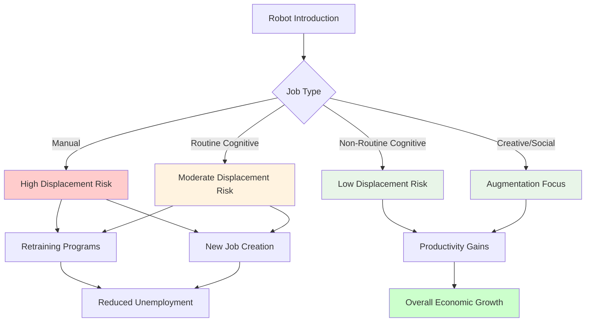
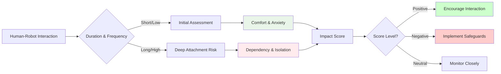

# Chapter 2.5: Social Implications and Future Considerations

## Learning Objectives
By the end of this chapter, you will be able to:
- Analyze economic implications of robotics automation in different sectors
- Evaluate psychological effects of human-like robots on society
- Assess legal frameworks for robot rights and responsibilities
- Understand long-term societal adaptation to AI companions
- Design responsible deployment strategies for humanoid robots

## Core Theory

### Economic Implications of Automation
The impact of robotics on the economy includes:
- Job displacement in manual and routine tasks
- Job creation in robot maintenance and programming
- Productivity gains and economic efficiency
- Shift in required workforce skills
- Potential for increased economic inequality

### Psychological Effects of Humanoid Robots
Human responses to humanoid robots:
- Uncanny valley effect and discomfort with human-like robots
- Anthropomorphism and emotional attachment to robots
- Social facilitation and learning effects
- Potential for reduced human interaction
- Therapeutic benefits in healthcare and education

### Legal Frameworks for Robotics
Legal considerations for robot deployment:
- Liability and responsibility for robot actions
- Robot rights and ethical treatment
- Intellectual property for AI-generated content
- Regulatory frameworks for robot behavior
- International harmonization of robot laws

### Societal Adaptation to AI Companions
How society adapts to AI companions:
- Changing social norms and expectations
- Intergenerational differences in robot acceptance
- Cultural variations in robot perception
- Integration into daily life routines
- Evolution of human-robot relationships

### Future Considerations
Long-term implications of humanoid robots:
- Potential for robot consciousness and moral status
- Impact on human identity and uniqueness
- Evolution of robot-human collaboration
- Ethical implications of advanced AI
- Need for adaptive governance frameworks

## Practical Examples

### Economic Impact Assessment Tool
```python
from typing import Dict, List, Any
import pandas as pd
import numpy as np
from dataclasses import dataclass
from enum import Enum

class JobCategory(Enum):
    MANUAL = "Manual Labor"
    ROUTINE = "Routine Cognitive"
    NON_ROUTINE = "Non-Routine Cognitive"
    CREATIVE = "Creative"
    SOCIAL = "Social/Emotional"

@dataclass
class JobImpactAssessment:
    job_title: str
    category: JobCategory
    automation_probability: float  # 0.0 to 1.0
    economic_value: float  # Annual economic value in USD
    human_replacement_cost: float  # Cost to replace with robot
    social_value: float  # Non-economic value

class EconomicImpactAnalyzer:
    def __init__(self):
        self.job_assessments = []
        self.automation_threshold = 0.7  # Jobs with >70% probability considered automatable

    def assess_job_automation_risk(self, job_title: str, category: JobCategory,
                                   automation_probability: float, economic_value: float,
                                   human_replacement_cost: float, social_value: float) -> JobImpactAssessment:
        """Assess the automation risk for a specific job"""
        assessment = JobImpactAssessment(
            job_title=job_title,
            category=category,
            automation_probability=automation_probability,
            economic_value=economic_value,
            human_replacement_cost=human_replacement_cost,
            social_value=social_value
        )
        self.job_assessments.append(assessment)
        return assessment

    def calculate_sector_impact(self, sector_jobs: List[JobImpactAssessment]) -> Dict[str, Any]:
        """Calculate economic impact for a sector"""
        total_jobs = len(sector_jobs)
        automatable_jobs = [job for job in sector_jobs if job.automation_probability > self.automation_threshold]
        total_economic_value = sum(job.economic_value for job in sector_jobs)
        automatable_value = sum(job.economic_value for job in automatable_jobs)

        # Calculate displacement metrics
        displacement_rate = len(automatable_jobs) / total_jobs if total_jobs > 0 else 0
        economic_displacement = sum(job.economic_value for job in automatable_jobs)

        # Calculate potential efficiency gains
        efficiency_gains = sum(job.human_replacement_cost * 0.2 for job in automatable_jobs)  # 20% efficiency gain

        impact_report = {
            "total_jobs": total_jobs,
            "automatable_jobs": len(automatable_jobs),
            "displacement_rate": displacement_rate,
            "total_economic_value": total_economic_value,
            "economic_displacement": economic_displacement,
            "potential_efficiency_gains": efficiency_gains,
            "net_economic_impact": efficiency_gains - economic_displacement,
            "jobs_by_category": self._categorize_jobs(automatable_jobs)
        }

        return impact_report

    def _categorize_jobs(self, jobs: List[JobImpactAssessment]) -> Dict[str, int]:
        """Categorize jobs by category"""
        categories = {}
        for job in jobs:
            cat_name = job.category.value
            categories[cat_name] = categories.get(cat_name, 0) + 1
        return categories

    def generate_employment_transition_plan(self, sector_impact: Dict[str, Any]) -> Dict[str, Any]:
        """Generate a plan for managing employment transitions"""
        transition_plan = {
            "retraining_opportunities": [],
            "new_job_creation": [],
            "support_programs": [],
            "timeline": "3-5 years",
            "budget_estimation": sector_impact["economic_displacement"] * 0.1  # 10% of displacement as support
        }

        # Identify retraining opportunities based on remaining jobs
        if sector_impact["displacement_rate"] > 0.5:
            transition_plan["retraining_opportunities"].append({
                "focus": "Technology and robot maintenance",
                "estimated_participants": int(sector_impact["automatable_jobs"] * 0.6),
                "duration": "6-12 months"
            })

        # Suggest new job creation in emerging areas
        transition_plan["new_job_creation"].append({
            "role": "Human-Robot Interaction Specialist",
            "estimated_positions": int(sector_impact["automatable_jobs"] * 0.1),
            "skills_needed": ["HRI design", "Robot ethics", "Human factors"]
        })

        # Support programs
        transition_plan["support_programs"] = [
            "Income support during retraining",
            "Career counseling services",
            "Mental health support for displaced workers"
        ]

        return transition_plan

    def analyze_economic_impact(self) -> Dict[str, Any]:
        """Analyze overall economic impact of robotics automation"""
        all_impact = self.calculate_sector_impact(self.job_assessments)

        analysis = {
            "summary": all_impact,
            "recommendations": {
                "policy_changes": [
                    "Universal basic income pilot programs",
                    "Lifelong learning and retraining initiatives",
                    "Robot tax considerations"
                ],
                "mitigation_strategies": [
                    "Gradual automation implementation",
                    "Human-robot collaboration models",
                    "Focus on augmentation rather than replacement"
                ]
            },
            "risk_assessment": self._calculate_risk_level(all_impact)
        }

        return analysis

    def _calculate_risk_level(self, impact: Dict[str, Any]) -> str:
        """Calculate overall risk level based on displacement rate"""
        if impact["displacement_rate"] > 0.7:
            return "Very High Risk"
        elif impact["displacement_rate"] > 0.5:
            return "High Risk"
        elif impact["displacement_rate"] > 0.3:
            return "Moderate Risk"
        else:
            return "Low Risk"
```

### Psychological Impact Assessment Tool
```python
from enum import Enum
from dataclasses import dataclass
from typing import Dict, List, Any
import numpy as np

class PsychologicalEffect(Enum):
    COMFORT = "Comfort and Companionship"
    ANXIETY = "Anxiety and Discomfort"
    DEPENDENCE = "Dependency on Robots"
    SOCIAL_ISOLATION = "Reduced Human Interaction"
    LEARNING_ENHANCEMENT = "Enhanced Learning"
    UNCANNY_VALLEY = "Uncanny Valley Discomfort"
    TRUST_DEVELOPMENT = "Trust Development"
    EMOTIONAL_ATTACH = "Emotional Attachment"

@dataclass
class PsychologicalAssessment:
    participant_id: str
    interaction_duration: float  # hours
    robot_type: str
    effects: List[PsychologicalEffect]
    intensity_scores: Dict[PsychologicalEffect, float]  # 0.0 to 1.0
    timestamp: str

class PsychologicalImpactAssessor:
    def __init__(self):
        self.assessments = []
        self.effect_weights = {
            PsychologicalEffect.COMFORT: 0.8,
            PsychologicalEffect.ANXIETY: -0.6,
            PsychologicalEffect.DEPENDENCE: -0.4,
            PsychologicalEffect.SOCIAL_ISOLATION: -0.7,
            PsychologicalEffect.LEARNING_ENHANCEMENT: 0.9,
            PsychologicalEffect.UNCANNY_VALLEY: -0.5,
            PsychologicalEffect.TRUST_DEVELOPMENT: 0.6,
            PsychologicalEffect.EMOTIONAL_ATTACH: 0.3
        }

    def conduct_assessment(self, participant_id: str, interaction_duration: float,
                          robot_type: str, effects: List[PsychologicalEffect],
                          intensity_scores: Dict[PsychologicalEffect, float]) -> PsychologicalAssessment:
        """Conduct a psychological impact assessment"""
        assessment = PsychologicalAssessment(
            participant_id=participant_id,
            interaction_duration=interaction_duration,
            robot_type=robot_type,
            effects=effects,
            intensity_scores=intensity_scores,
            timestamp=str(pd.Timestamp.now())
        )
        self.assessments.append(assessment)
        return assessment

    def calculate_psychological_impact_score(self, assessment: PsychologicalAssessment) -> float:
        """Calculate overall psychological impact score"""
        total_score = 0.0
        for effect, intensity in assessment.intensity_scores.items():
            weight = self.effect_weights.get(effect, 0.0)
            total_score += weight * intensity

        # Normalize by number of effects
        if len(assessment.intensity_scores) > 0:
            total_score /= len(assessment.intensity_scores)

        return total_score

    def analyze_population_impact(self, target_group: str = "elderly") -> Dict[str, Any]:
        """Analyze psychological impact for a specific population"""
        # Filter assessments for target group
        if target_group == "elderly":
            # In a real system, this would filter by actual demographic data
            relevant_assessments = [a for a in self.assessments if "elderly" in a.robot_type.lower() or a.interaction_duration > 10]
        else:
            relevant_assessments = self.assessments

        if not relevant_assessments:
            return {"message": "No data available for target group"}

        # Calculate average impact scores
        impact_scores = [self.calculate_psychological_impact_score(ass) for ass in relevant_assessments]
        avg_impact = np.mean(impact_scores) if impact_scores else 0.0

        # Identify most common effects
        effect_counts = {}
        for ass in relevant_assessments:
            for effect in ass.effects:
                effect_counts[effect] = effect_counts.get(effect, 0) + 1

        # Calculate effect intensities
        effect_intensities = {}
        for effect in PsychologicalEffect:
            intensities = [ass.intensity_scores.get(effect, 0.0) for ass in relevant_assessments if effect in ass.intensity_scores]
            if intensities:
                effect_intensities[effect.value] = np.mean(intensities)

        analysis = {
            "target_group": target_group,
            "sample_size": len(relevant_assessments),
            "average_impact_score": avg_impact,
            "most_common_effects": sorted(effect_counts.items(), key=lambda x: x[1], reverse=True)[:3],
            "effect_intensities": effect_intensities,
            "recommendations": self._generate_recommendations(avg_impact, effect_counts)
        }

        return analysis

    def _generate_recommendations(self, avg_impact: float, effect_counts: Dict[PsychologicalEffect, int]) -> List[str]:
        """Generate recommendations based on impact analysis"""
        recommendations = []

        if avg_impact > 0.5:
            recommendations.append("Positive psychological impact observed - continue with appropriate safeguards")
        elif avg_impact < -0.3:
            recommendations.append("Negative psychological impact detected - implement mitigation strategies")
        else:
            recommendations.append("Neutral impact - monitor closely for changes")

        if PsychologicalEffect.SOCIAL_ISOLATION in effect_counts:
            recommendations.append("Implement measures to prevent reduced human interaction")
        if PsychologicalEffect.DEPENDENCE in effect_counts:
            recommendations.append("Design systems to promote independence alongside assistance")
        if PsychologicalEffect.ANXIETY in effect_counts:
            recommendations.append("Address anxiety through improved design and interaction protocols")

        return recommendations

    def predict_long_term_effects(self, current_data: List[PsychologicalAssessment]) -> Dict[str, Any]:
        """Predict long-term psychological effects based on current data"""
        # This would use more sophisticated modeling in a real implementation
        # For now, we'll use a simplified approach

        avg_duration = np.mean([d.interaction_duration for d in current_data]) if current_data else 0
        avg_impact = np.mean([self.calculate_psychological_impact_score(d) for d in current_data]) if current_data else 0

        prediction = {
            "predicted_outcome": "positive" if avg_impact > 0.3 else "concerning" if avg_impact < -0.2 else "neutral",
            "confidence_level": min(0.8, avg_duration / 20),  # Higher confidence with more data
            "time_to_stabilization": f"{int(avg_duration * 2)}-{int(avg_duration * 3)} months",
            "critical_factors": self._identify_critical_factors(current_data),
            "mitigation_needed": avg_impact < -0.1
        }

        return prediction

    def _identify_critical_factors(self, data: List[PsychologicalAssessment]) -> List[str]:
        """Identify critical factors affecting psychological impact"""
        factors = []
        if any(PsychologicalEffect.ANXIETY in ass.effects for ass in data):
            factors.append("Anxiety responses need addressing")
        if any(PsychologicalEffect.UNCANNY_VALLEY in ass.effects for ass in data):
            factors.append("Robot appearance needs refinement")
        if any(ass.interaction_duration < 1 for ass in data):
            factors.append("Insufficient interaction time for assessment")

        return factors
```

## Diagrams

### Economic Impact of Robotics


### Psychological Impact Assessment


## Exercises

1. Conduct a survey on public perception of humanoid robots
2. Analyze economic impacts of robotics automation in different sectors
3. Research legal frameworks for robot liability and responsibility
4. Propose guidelines for ethical robot deployment in society
5. Design a long-term study on human-robot relationship development

## Quiz

1. What are the main economic concerns about robotics automation?
2. How does the uncanny valley effect impact human-robot interaction?
3. What legal questions arise with autonomous robot decision-making?
4. How might humanoid robots affect social interaction patterns?
5. What factors influence long-term societal adaptation to AI companions?

## References

- Frey, C. and Osborne, M. "The Future of Employment" - Job automation risks
- Sharkey, A. and Sharkey, N. "Granny and the Robots" - Elderly care robotics
- Lin, P., Abney, K., and Bekey, G. "Robot Ethics" - Ethical frameworks
- Sparrow, R. "Killer Robots" - Military robotics ethics
- IEEE Global Initiative on Ethics of Autonomous and Intelligent Systems

## Summary

This chapter explored the social implications and future considerations of humanoid robots in society. We examined economic impacts including job displacement and creation, psychological effects on humans interacting with robots, legal frameworks for robot rights and responsibilities, and societal adaptation patterns. We developed practical tools for assessing economic and psychological impacts that can inform responsible robot deployment strategies. These considerations are crucial for ensuring that the integration of humanoid robots into society benefits humanity while minimizing potential negative consequences.